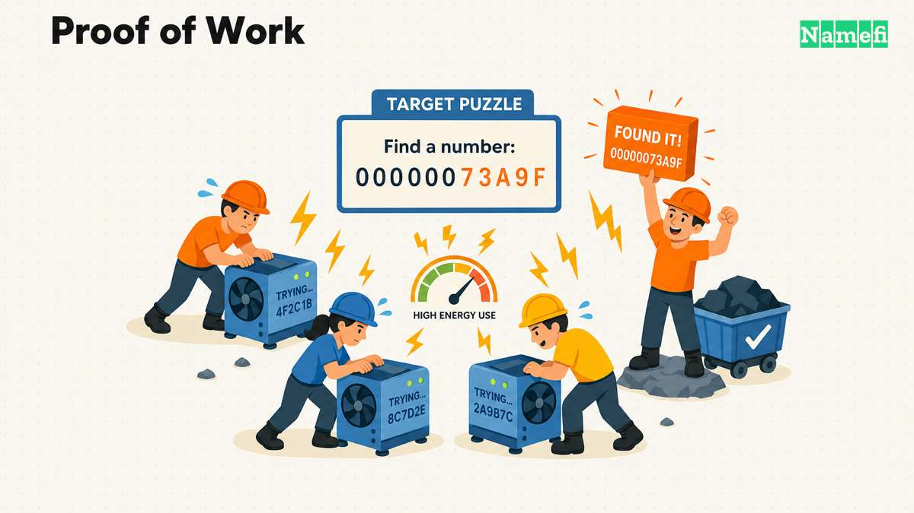
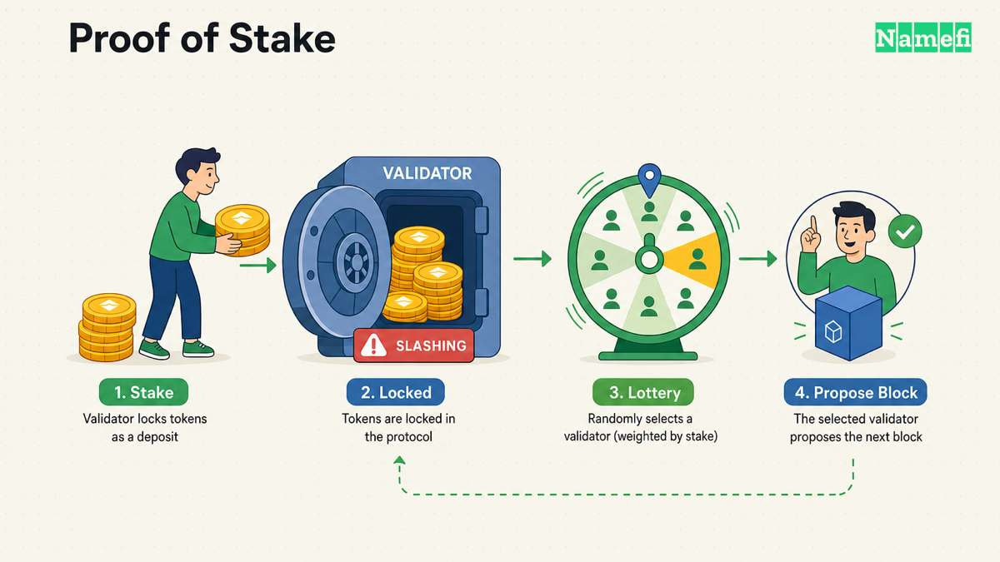
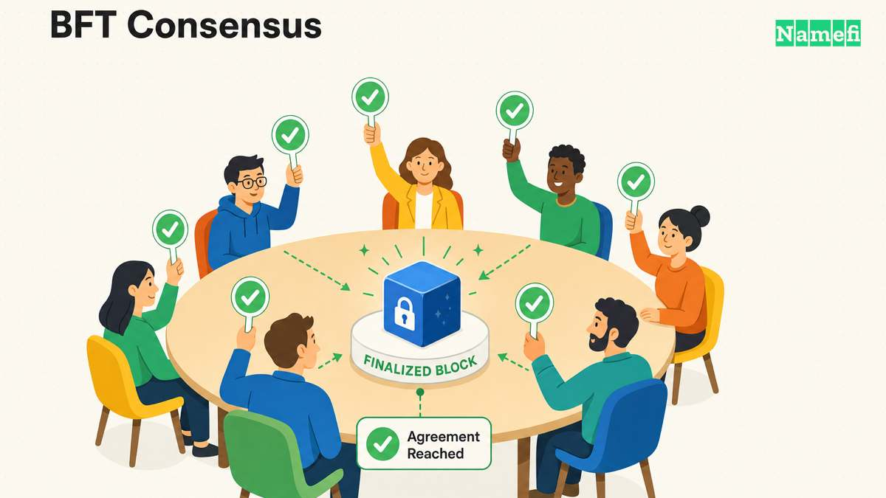

Toda [blockchain](/es/glossary/blockchain/) debe responder una pregunta antes de que pueda confiársele el dinero de alguien: ¿quién decide qué ocurrió y en qué orden? No hay banco, notario ni servidor central que tome las decisiones. Un **mecanismo de consenso** es el conjunto de reglas que siguen los participantes de una red para acordar un único historial compartido de transacciones, sin una parte central y sin permitir que nadie gaste la misma moneda dos veces.

Esta guía recorre los principales mecanismos de consenso en uso hoy, cómo elige cada uno el siguiente bloque y dónde están sus concesiones.

---

## Qué resuelve realmente el consenso

Dos problemas dificultan el acuerdo descentralizado.

**El problema del doble gasto.** En un sistema digital, una unidad de valor es solo información, y la información se puede copiar. Sin un árbitro, nada impide que alguien transmita dos transacciones en conflicto que gasten la misma moneda. El white paper de Bitcoin de Satoshi Nakamoto plantea el objetivo de forma directa: la red necesita «un sistema para que los participantes acuerden un único historial del orden en que se recibieron», de modo que quien recibe un pago pueda tener la certeza de que un pago anterior no se revierta mediante otro posterior y conflictivo ([white paper de Bitcoin](https://bitcoin.org/bitcoin.pdf)).

**Acuerdo sin una parte central.** En una base de datos convencional, la decisión de un único operador es definitiva. En una red pública y sin permisos, cualquiera puede ejecutar un nodo, proponer transacciones e intentar añadir el siguiente bloque, incluidos participantes que podrían mentir, censurar o intentar reescribir el historial. Un mecanismo de consenso debe hacer que atacar el libro mayor sea prohibitivamente costoso o que deje de resultar atractivo, manteniendo al mismo tiempo un coste suficientemente bajo para que los participantes honestos puedan operar la red.

Cada mecanismo siguiente responde de forma distinta a «¿quién propone el siguiente bloque y cómo sabemos que podemos confiar en él?». Los dos ejes más importantes para compararlos son la [resistencia a Sybil](/es/glossary/consensus-mechanism/), es decir, qué impide que un atacante cree identidades falsas ilimitadas para superar en votos a todos los demás, y la **finalidad**, es decir, con qué rapidez y con qué grado de certeza una transacción se vuelve irreversible.

---

## Proof of Work

[Proof of Work](/es/glossary/proof-of-work/) (PoW) es el mecanismo que Bitcoin introdujo en 2009 y el que la mayoría de la gente imagina al oír «blockchain». Los mineros compiten por resolver un rompecabezas criptográfico: aplican repetidamente una función hash a los datos de un bloque candidato con un nonce hasta que el hash resultante queda por debajo de un valor objetivo. La documentación para desarrolladores de Ethereum describe la carrera de forma sencilla: un minero «introduce repetidamente un conjunto de datos… en una función matemática» para encontrar una solución válida antes que los demás ([ethereum.org: Proof-of-work](https://ethereum.org/en/developers/docs/consensus-mechanisms/pow/#:~:text=When%20racing%20to%20create%20a%20block%2C%20a%20miner%20repeatedly%20put%20a%20dataset)). Quien encuentra primero un hash válido puede proponer el siguiente bloque y cobrar la recompensa de bloque más las comisiones de transacción.

La **resistencia a Sybil** proviene del propio rompecabezas: calcular hashes consume electricidad y hardware reales, por lo que fingir muchas identidades no da ventaja alguna; solo cuenta la potencia de cálculo bruta. La **finalidad es probabilística**. El white paper de Bitcoin describe que los nodos siempre extienden «la cadena más larga como la correcta» ([white paper de Bitcoin](https://bitcoin.org/bitcoin.pdf)); quien recibe un pago gana confianza en que una transacción está liquidada al esperar que se minen bloques adicionales encima de ella. Cada bloque nuevo hace exponencialmente más costoso reescribir el historial, pero ningún bloque individual es final de forma instantánea y matemática.

La contrapartida es la energía. Proteger la red mediante cómputo del mundo real exige consumo eléctrico real, por eso la minería de Bitcoin se mide en teravatios-hora al año. **Cadenas de ejemplo:** Bitcoin, Litecoin, Dogecoin y Ethereum antes de 2022.

---

## Proof of Stake

[Proof of Stake](/es/glossary/proof-of-stake/) (PoS) sustituye el trabajo computacional por una garantía económica. En lugar de minar, los participantes hacen **staking**, es decir, bloquean el activo nativo de la red, y el protocolo selecciona de forma seudoaleatoria a uno de ellos para proponer cada bloque. El papel de validador de Ethereum es un buen diseño de referencia: un validador deposita 32 ETH y ejecuta software de cliente; después, el protocolo selecciona aleatoriamente a «un validador… como proponente de bloque en cada slot», mientras un comité elegido al azar de otros validadores certifica la validez de ese bloque ([ethereum.org: Proof-of-stake](https://ethereum.org/en/developers/docs/consensus-mechanisms/pos/#:~:text=One%20validator%20is%20randomly%20selected%20to%20be%20a%20block%20proposer%20in%20every%20slot)).

La **resistencia a Sybil** procede de la propia participación en staking: crear muchos validadores falsos solo divide el mismo capital entre más identidades y no aporta influencia adicional. La conducta deshonesta, como proponer bloques en conflicto o certificaciones contradictorias, se castiga mediante **slashing**: el protocolo quema una parte del staking del validador infractor ([ethereum.org: Proof-of-stake](https://ethereum.org/en/developers/docs/consensus-mechanisms/pos/#:~:text=Two%20primary%20behaviors%20can%20be%20considered%20dishonest)). Ethereum finaliza bloques en épocas mediante un mecanismo de puntos de control (Casper FFG combinado con la regla de elección de bifurcación LMD-GHOST), lo que ofrece garantías de finalidad más sólidas que el PoW puro sin requerir una votación de una sola ronda al estilo BFT.

La principal diferencia frente a PoW es la energía: el staking no necesita hardware especializado compitiendo para resolver rompecabezas, de modo que, como dice ethereum.org, «no es necesario emplear mucha energía en cálculos de proof-of-work» ([ethereum.org: Proof-of-stake](https://ethereum.org/en/developers/docs/consensus-mechanisms/pos/#:~:text=there%20is%20no%20need%20to%20use%20lots%20of%20energy%20on%20proof)). La magnitud del ahorro está bien documentada: un análisis independiente de CCRI concluyó que la transición de Ethereum de PoW a PoS en septiembre de 2022, «The Merge», redujo el consumo anualizado de electricidad de la red en más de un 99,988 % ([ethereum.org: Consumo de energía](https://ethereum.org/en/energy-consumption/#:~:text=CCRI%20estimates%20that%20The%20Merge%20reduced%20Ethereum%27s%20annualized%20electricity%20consumption%20by%20more%20than%2099.988%25)). **Cadenas de ejemplo:** Ethereum, Cardano, Solana (que usa PoS para la seguridad económica junto con Proof of History) y Polkadot.

---

## Proof of Stake Delegado

Proof of Stake Delegado (DPoS) mantiene el modelo de staking, pero añade una capa electoral. En vez de que cada participante que hace staking pueda proponer bloques individualmente, los titulares de tokens respaldan con sus tokens a un pequeño conjunto de **delegados** (también llamados testigos o productores de bloques), y solo ese grupo elegido produce realmente los bloques. El poder de voto aumenta con la cantidad de tokens en posesión; el sector explica bien la mecánica central: «el poder de voto de cada titular de tokens es proporcional a la cantidad de tokens que posee», y las elecciones son continuas, por lo que los titulares pueden reasignar sus votos o retirar a delegados con bajo rendimiento en cualquier momento ([Binance Academy: Explicación de Delegated Proof of Stake](https://www.binance.com/en/academy/articles/delegated-proof-of-stake-explained)).

La **resistencia a Sybil** sigue basándose en el staking: los votos se ponderan por los tokens en posesión, no por el número de cuentas. Sin embargo, la *producción* de bloques se concentra en un pequeño comité elegido, en vez de estar abierta a todos los participantes que hacen staking. Esa concentración es precisamente el objetivo: como el conjunto activo de validadores es pequeño y se conoce de antemano, las redes DPoS «pueden lograr tiempos de bloque rápidos, a menudo muy por debajo de tres segundos» ([Binance Academy: Explicación de Delegated Proof of Stake](https://www.binance.com/en/academy/articles/delegated-proof-of-stake-explained)). La contrapartida es la descentralización: la mayoría de redes DPoS funciona con aproximadamente «21 a 101 validadores activos», un conjunto mucho menor que los cientos o miles de validadores habituales en las redes PoS abiertas; además, la apatía de los votantes puede permitir que los mismos delegados se afiancen con el tiempo ([Binance Academy: Explicación de Delegated Proof of Stake](https://www.binance.com/en/academy/articles/delegated-proof-of-stake-explained)). **Cadenas de ejemplo:** EOS, TRON y, de forma modificada, muchas de las primeras cadenas de aplicaciones basadas en Cosmos SDK.

---

## Consenso de estilo BFT (Tendermint / CometBFT, PBFT)

El consenso tolerante a fallos bizantinos (BFT) adopta un enfoque completamente distinto: en lugar de competir o seleccionar aleatoriamente a un proponente por bloque, un conjunto conocido de validadores realiza rondas explícitas de votación y solo confirma un bloque cuando una supermayoría —por lo general, más de dos tercios del poder de voto— está de acuerdo en esa misma ronda. **CometBFT** (el sucesor de Tendermint Core, el motor de consenso que está detrás de Cosmos SDK) se describe como un sistema que realiza «replicación de máquina de estados tolerante a fallos bizantinos (BFT) para máquinas de estados finitas, deterministas y arbitrarias» ([Documentación de Cosmos: CometBFT](https://docs.cosmos.network/cometbft)). Es decir, convierte un conjunto de nodos gestionados de forma independiente en un libro mayor replicado y coherente, aunque algunos fallen o sean maliciosos.

La **resistencia a Sybil** en las cadenas de estilo Tendermint suele añadirse mediante staking (los validadores se ponderan según su participación, como en PoS), mientras que el propio protocolo de votación BFT aporta la **finalidad**: una vez que un bloque reúne la supermayoría requerida de firmas de validadores en una ronda, queda confirmado y no puede reorganizarse como sí puede ocurrir con un bloque PoW. Esto permite una liquidación rápida y práctica: Cosmos Network destaca liquidaciones de transacciones de menos de un segundo en cadenas basadas en CometBFT ([Cosmos Network](https://cosmos.network/#:~:text=%3C1%20second%20transaction%20settlement)), en contraste con el modelo de PoW de confirmar esperando. La contrapartida es que los protocolos BFT necesitan que el conjunto de validadores sea conocido y tenga un tamaño limitado (la sobrecarga de comunicación aumenta con el número de validadores), lo que limita cuántos pueden participar directamente. **Cadenas de ejemplo:** Cosmos Hub y otras cadenas de Cosmos SDK (CometBFT), Binance Chain y libros mayores empresariales o con permisos basados en el diseño original de Practical Byzantine Fault Tolerance (PBFT).

---

## Más allá: Proof of History, Proof of Authority y Proof of Space

Algunos mecanismos más completan el panorama; cada uno resuelve un problema más específico en lugar de reemplazar la cuestión central de la resistencia a Sybil.

**Proof of History (PoH)**, que Solana usa junto con PoS, no es un mecanismo de consenso independiente, sino un reloj criptográfico. Inserta marcas de tiempo verificables directamente en la cadena aplicando repetidamente una función hash a «los datos de los estados generados previamente», creando una secuencia que prueba cuánto tiempo transcurrió entre eventos sin que los validadores tengan que comunicarse sobre el tiempo ([Solana: Proof of History](https://solana.com/news/proof-of-history#:~:text=inserting%20data%20into%20the%20sequence%20by%20appending%20the%20hash%20of%20the%20data%20of%20the%20previously%20generated%20states)). Ese reloj proporciona a los validadores un orden verificable para el consenso, pero no es lo que ejecuta las transacciones en paralelo. La ejecución paralela procede de **Sealevel**: las transacciones de Solana declaran todas las cuentas de las que leerán o en las que escribirán, lo que permite al entorno de ejecución procesar simultáneamente tanto las transacciones que no se solapan como aquellas que solo leen el mismo estado ([Solana: Sealevel](https://solana.com/news/sealevel---parallel-processing-thousands-of-smart-contracts#:~:text=The%20reason%20why%20Solana%20is%20able%20to%20process%20transactions%20in%20parallel,transactions%20that%20are%20only%20reading%20the%20same%20state%20to%20execute%20concurrently%20as%20well)).

**Proof of Authority (PoA)** reemplaza la minería abierta o la validación basada en staking por un conjunto de firmantes autorizados. En comparación con PoW, reduce considerablemente el coste de los recursos necesarios para producir bloques; ethereum.org señala que PoA evita la necesidad de una minería con un alto consumo de recursos como la de PoW ([ethereum.org: Proof-of-authority](https://ethereum.org/en/developers/docs/consensus-mechanisms/poa/#:~:text=as%20it%20overcomes%20the%20need%20for%20high%20quality%20resources%20as%20PoW%20does)). Sin embargo, no elimina los costes de operación ni de seguridad de la red. La responsabilidad de la seguridad y la gobernanza se traslada a las identidades y reputaciones de los validadores de confianza, así como a las reglas de admisión de firmantes: PoA exige confiar en firmantes conocidos, cuya identidad suele establecerse mediante KYC o su pertenencia a organizaciones reconocibles ([ethereum.org: firmantes de confianza](https://ethereum.org/en/developers/docs/consensus-mechanisms/poa/#:~:text=Proof%2Dof%2Dauthority%20requires%20trusting%20a%20set%20of%20authorized%20signers,if%20a%20validator%20does%20anything%20wrong%2C%20their%20identity%20is%20known)), y la implementación que describe ethereum.org permite que los firmantes voten para añadir o retirar a otros ([ethereum.org: admisión de firmantes](https://ethereum.org/en/developers/docs/consensus-mechanisms/poa/#:~:text=Each%20signer%20votes%20for%20the%20addition%20or%20removal%20of%20a%20signer%20in%20their%20block%20when%20they%20create%20a%20new%20block)). Sacrifica descentralización por velocidad y un bajo coste operativo, por lo que se emplea principalmente en cadenas privadas, redes de prueba y redes de desarrollo local, y no en redes públicas y adversariales.

**Proof of Space** (y su pariente, proof of space-time) sustituye la potencia de cómputo o el staking por almacenamiento en disco asignado: los participantes demuestran que han reservado espacio sin usar en el disco duro, y el protocolo les exige periódicamente probar que todavía lo conservan. Ofrece una resistencia a Sybil similar a la de PoW con una huella energética mucho menor, a cambio de necesitar grandes cantidades de hardware de almacenamiento. Chia es el ejemplo más conocido.

---

## Comparación de los mecanismos

| Mecanismo | Base de la resistencia a Sybil | Finalidad | Coste energético | Descentralización | Cadenas de ejemplo |
|---|---|---|---|---|---|
| Proof of Work | Coste computacional (hashing) | Probabilística (confirmaciones) | Muy alto | Alta (minería sin permisos) | Bitcoin, Litecoin, Dogecoin |
| Proof of Stake | Participación económica en riesgo | Con puntos de control / casi definitiva dentro de épocas | Muy bajo | Alta (cientos de miles de validadores) | Ethereum, Cardano, Polkadot |
| Proof of Stake Delegado | Votación ponderada por staking para delegados | Rápida, casi instantánea por productor elegido | Muy bajo | Menor (conjunto reducido de validadores elegidos) | EOS, TRON |
| Estilo BFT (Tendermint/CometBFT, PBFT) | Staking o identidad con permisos + voto por supermayoría | Instantánea/determinista una vez confirmado | Bajo | Moderada (conjunto de validadores limitado) | Cosmos Hub, Binance Chain |
| Proof of Authority | Identidad/reputación verificada | Rápida, casi instantánea | Muy bajo | Baja (conjunto reducido de validadores de confianza) | Cadenas privadas/empresariales, redes de prueba |
| Proof of Space | Capacidad de almacenamiento asignada | Probabilística (por bloques) | Bajo | Moderada (dependiente del hardware de almacenamiento) | Chia |

---

## Cómo se relaciona esto con los dominios tokenizados

Los mecanismos de consenso son la base invisible de todo [dominio tokenizado](/es/blog/what-are-tokenized-domains/). Cuando un dominio `.com`, `.ai` o `.io` se acuña como un [NFT](/es/glossary/nft/), el consenso de la cadena protege el registro de propiedad on-chain, así como cualquier transferencia del token o liquidación de una venta que quede registrada en ella. No sustituye los procesos del registrador y del registro responsables de renovar el dominio DNS subyacente y mantener vigente su registro. Un NFT de dominio acuñado en [Ethereum](/es/glossary/ethereum/) hereda las garantías de finalidad mediante puntos de control que ofrece el PoS de Ethereum; el mismo activo en una cadena PoW hereda el modelo de confirmaciones probabilísticas de esa cadena. Las comisiones de transacción y el tiempo que deben esperar los usuarios para considerar efectiva la liquidación también dependen de la capacidad de ejecución, la demanda de la red y de si se utiliza L1 o L2; no los determina por sí sola la elección entre PoW y PoS. Comprender qué mecanismo sustenta una cadena, qué protege en realidad y qué significan sus garantías de resistencia a Sybil y finalidad forma parte de la evaluación de cualquier activo on-chain, incluidos los dominios tokenizados.

---

## Fuentes y lecturas adicionales

- [Bitcoin: un sistema de efectivo electrónico entre pares (white paper de Nakamoto)](https://bitcoin.org/bitcoin.pdf)
- [ethereum.org — Proof-of-work](https://ethereum.org/en/developers/docs/consensus-mechanisms/pow/)
- [ethereum.org — Proof-of-stake](https://ethereum.org/en/developers/docs/consensus-mechanisms/pos/)
- [ethereum.org — Proof-of-authority](https://ethereum.org/en/developers/docs/consensus-mechanisms/poa/)
- [ethereum.org — Consumo de energía](https://ethereum.org/en/energy-consumption/)
- [Documentación de Cosmos — CometBFT](https://docs.cosmos.network/cometbft)
- [Cosmos Network](https://cosmos.network/)
- [Binance Academy — Explicación de Delegated Proof of Stake](https://www.binance.com/en/academy/articles/delegated-proof-of-stake-explained)
- [Solana — Proof of History](https://solana.com/news/proof-of-history)
- [Solana — Sealevel: procesamiento paralelo de miles de contratos inteligentes](https://solana.com/news/sealevel---parallel-processing-thousands-of-smart-contracts)
