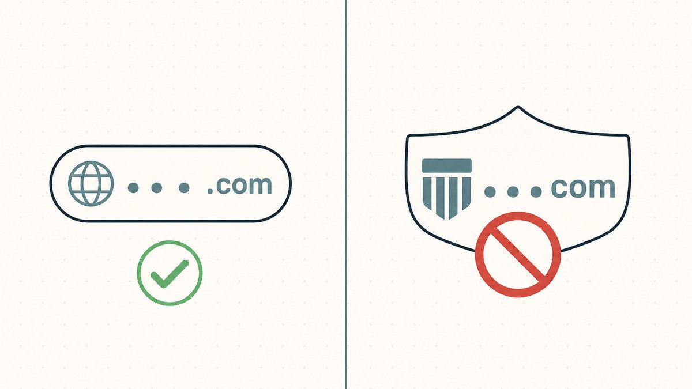
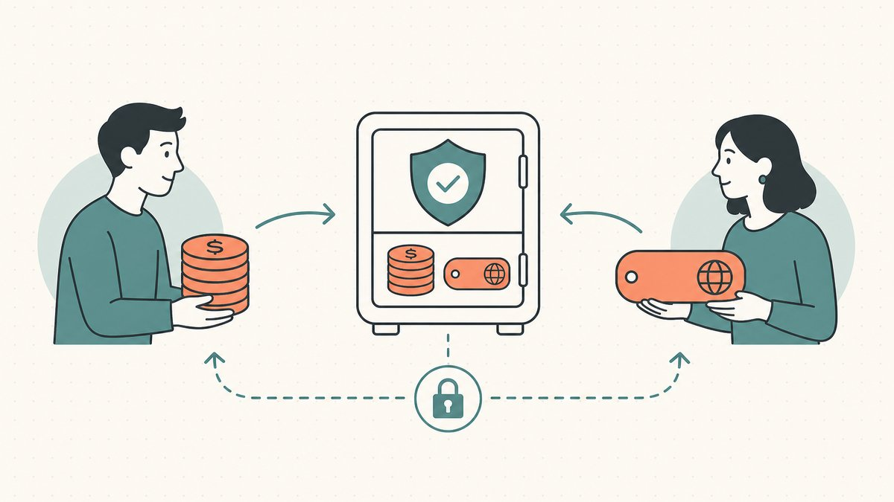
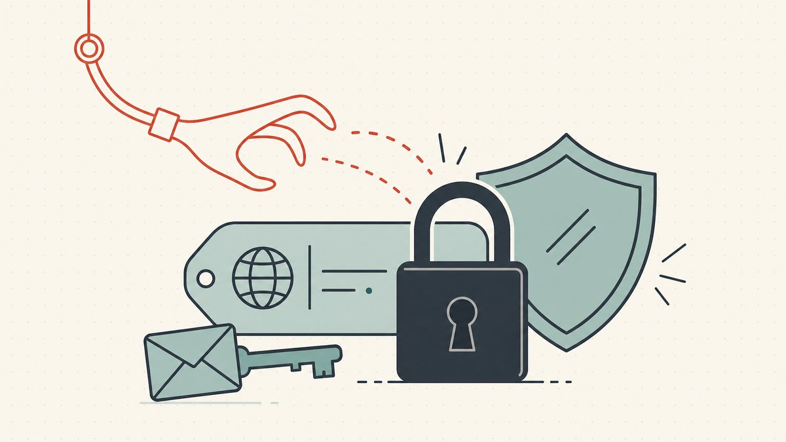

Hacer 'flipping' (compraventa especulativa) de dominios es legal. Hacer 'flipping' con los dominios equivocados te costará el nombre, el dinero que pagaste por él y, a veces, una sentencia de cinco cifras además. La diferencia entre esos dos resultados no es cuestión de suerte. Es un pequeño cuerpo legal que puedes aprender en una tarde, además de un puñado de hábitos operativos que mantienen tu portafolio limpio y evitan que te roben en las transacciones.

Este es el pilar legal y de seguridad de nuestra serie sobre [el 'flipping' de dominios](/es/blog/domain-flipping/). Cubre la línea entre el '[domaining](/es/glossary/domaining/)' y la ciberocupación, los dos sistemas de disputas que hacen cumplir esa línea, cómo liquidar una venta sin ser estafado y cómo evitar que alguien te robe un nombre. Nada de esto es asesoramiento legal (consulta el descargo de responsabilidad al final), pero todo es el conocimiento práctico que los 'flippers' experimentados valoran en cada operación.

## La única línea que no puedes cruzar: las marcas registradas

Toda la cuestión legal se reduce a una única distinción. Registrar un nombre genérico, descriptivo o inventado para revenderlo es una inversión normal. Registrar algo que se aprovecha de la *marca de una empresa específica* es ciberocupación, y es la única jugada que convierte una reventa legítima en una perdedora.

La definición de Wikipedia es la estándar: la ciberocupación es [la práctica de registrar, traficar o utilizar un nombre de dominio de Internet con la intención de mala fe de lucrarse con el fondo de comercio de una marca registrada que pertenece a otra persona](https://en.wikipedia.org/wiki/Cybersquatting#:~:text=is%20the%20practice%20of%20registering%2C%20trafficking%20in%2C%20or%20using%20an%20Internet%20domain%20name%2C%20with%20a%20bad%20faith%20intent%20to%20profit). Dos palabras en esa frase son clave: *[mala fe](/es/glossary/bad-faith/)* y *[marca registrada](/es/glossary/trademark/)*. Una palabra de diccionario como `loans` o un nombre inventado como `Zapio` no pertenecen a nadie en particular. `nikeshoes-store.com` se apoya claramente en una marca que sí tiene dueño. Cuanto más se acerca un nombre a una marca existente, más parece que lo registraste para extraer dinero de esa marca, y esa intención es exactamente lo que la ley castiga. Trazamos el límite completo en [ciberocupación vs. 'domaining': UDRP y ACPA](/es/blog/cybersquatting-vs-domaining-udrp-acpa/).

Un filtro práctico antes de comprar: ¿una persona razonable asumiría que este nombre estaba *destinado* a apuntar a una empresa en particular? Si es así, descártalo, por muy barato que sea. Los fundamentos que hacen que un nombre valga la pena se tratan en [cómo valorar un nombre de dominio](/es/blog/how-to-value-a-domain-name/) y [qué es un dominio](/es/blog/what-is-domain/); un nombre que no pasa la prueba de la marca registrada tiene un valor negativo, porque poseerlo es un pasivo.

## UDRP: cómo el titular de una marca registrada recupera un nombre

La vía de ejecución rápida y barata es la Política Uniforme de Solución de Controversias en materia de Nombres de Dominio. Forma parte de las reglas de la [ICANN](/es/glossary/icann/), integrada en el acuerdo de registro que aceptas cada vez que registras un nombre, por lo que ya estás obligado por ella. La ICANN adoptó la [UDRP](/es/glossary/udrp/) en 1999, y las disputas son decididas por proveedores acreditados, entre los que destaca la [Organización Mundial de la Propiedad Intelectual (OMPI)](https://en.wikipedia.org/wiki/Uniform_Domain-Name_Dispute-Resolution_Policy#:~:text=World%20Intellectual%20Property%20Organization).

Un demandante tiene que probar tres cosas, sin excepción. Como resume la política Wikipedia, el nombre debe ser [idéntico o confusamente similar a una marca registrada o de servicio en la que el demandante tiene derechos](https://en.wikipedia.org/wiki/Uniform_Domain-Name_Dispute-Resolution_Policy#:~:text=identical%20or%20confusingly%20similar%20to%20a%20trademark%20or%20service%20mark); el [registrante](/es/glossary/registrant/) [no tiene derechos o intereses legítimos sobre el nombre de dominio](https://en.wikipedia.org/wiki/Uniform_Domain-Name_Dispute-Resolution_Policy#:~:text=does%20not%20have%20any%20rights%20or%20legitimate%20interests); y el nombre [ha sido registrado y el nombre de dominio está siendo utilizado de 'mala fe'](https://en.wikipedia.org/wiki/Uniform_Domain-Name_Dispute-Resolution_Policy#:~:text=has%20been%20registered%20and%20the%20domain%20name%20is%20being%20used). Si falla en cualquiera de los tres, la demanda no prospera.

Lo que está en juego en una UDRP es limitado pero absoluto. Los únicos remedios son la [cancelación o transferencia](https://en.wikipedia.org/wiki/Uniform_Domain-Name_Dispute-Resolution_Policy#:~:text=cancellation%20or%20transfer) del dominio. No se conceden indemnizaciones económicas, pero pierdes el activo por completo, y un panel puede quitártelo en semanas en lugar de los meses que duraría un juicio. Este sistema se mantiene ocupado: la OMPI informó que en 2024, [titulares de marcas de 133 países presentaron 6.168 casos bajo la Política Uniforme de Solución de Controversias en materia de Nombres de Dominio (UDRP) y variaciones nacionales de ccTLD](https://www.wipo.int/pressroom/en/articles/2025/article_0003.html#:~:text=trademark%20owners%20from%20133%20countries%20filed%206%2C168%20cases%20under%20the%20Uniform%20Domain%20Name%20Dispute%20Resolution%20Policy). Para un 'flipper', la lección es simple: una UDRP es la herramienta barata y rápida que una marca utiliza primero, así que cualquier nombre que pueda atraer una es un nombre que no quieres en tu inventario.

## ACPA: cuando la disputa escala a una demanda y dinero

La UDRP solo puede transferir el nombre. La ley de los Estados Unidos va más allá. La Ley de Protección del Consumidor contra la Ciberocupación ([ACPA](/es/glossary/acpa/), por sus siglas en inglés), promulgada [en 1999](https://en.wikipedia.org/wiki/Anticybersquatting_Consumer_Protection_Act#:~:text=a%20U.S.%20law%20enacted%20in%201999), permite al titular de una marca demandar en un tribunal federal y solicitar una indemnización por daños y perjuicios, no solo el dominio.

La ACPA se centra en si el registrante [tiene la intención de mala fe de lucrarse con la marca](https://en.wikipedia.org/wiki/Anticybersquatting_Consumer_Protection_Act#:~:text=Has%20a%20bad%20faith%20intent%20to%20profit%20from%20the%20mark), y los tribunales sopesan una lista de factores para decidirlo. Varios de esos factores apuntan directamente a los 'flippers': un tribunal examina la [intención del registrante de desviar clientes de la ubicación en línea del propietario de la marca](https://en.wikipedia.org/wiki/Anticybersquatting_Consumer_Protection_Act#:~:text=intent%20to%20divert%20customers%20from%20the%20mark%20owner%27s%20online%20location) y cualquier [oferta de transferir, vender o ceder de otro modo el nombre de dominio al propietario de la marca o a un tercero para obtener un beneficio económico](https://en.wikipedia.org/wiki/Anticybersquatting_Consumer_Protection_Act#:~:text=offer%20to%20transfer%2C%20sell%2C%20or%20otherwise%20assign%20the%20domain%20name) sin un uso legítimo. Lee eso dos veces: enviar un correo electrónico a una marca para ofrecerle "su" nombre por un precio es en sí mismo una prueba de mala fe. Esa es la trampa en la que caen los 'flippers' inexpertos.

La parte que duele es el dinero. Bajo la ley, un demandante puede optar por una indemnización por daños y perjuicios legales de [no menos de 1.000 $ y no más de 100.000 $ por nombre de dominio, según el tribunal considere justo](https://www.law.cornell.edu/uscode/text/15/1117#:~:text=not%20less%20than%20%241%2C000%20and%20not%20more%20than%20%24100%2C000%20per%20domain%20name). Registra un puñado de nombres cercanos a una marca y la exposición se multiplica rápidamente. Nada de esto afecta a los nombres genéricos y de marca que componen un portafolio saludable. Es totalmente evitable si nunca compras nombres que se aprovechen de la marca de otra persona.

## La defensa del 'flipper': el secuestro inverso de nombre de dominio

La ley es un arma de doble filo, y esta es la parte que la mayoría de los principiantes no conocen. A veces, es el *titular de la marca* quien actúa de mala fe, intentando presionar a un registrante legítimo para que ceda un nombre sobre el que no tiene un reclamo real. La política tiene un nombre para ello. El secuestro inverso de nombre de dominio [ocurre cuando el propietario legítimo de una marca intenta asegurarse un nombre de dominio haciendo reclamaciones de ciberocupación contra el propietario "ciberocupa" de un nombre de dominio](https://en.wikipedia.org/wiki/Reverse_domain_name_hijacking#:~:text=occurs%20where%20a%20rightful%20trademark%20owner%20attempts%20to%20secure%20a%20domain%20name). Las reglas de la UDRP lo definen como [la presentación de una demanda de mala fe, que resulta en el abuso del proceso administrativo de la UDRP](https://en.wikipedia.org/wiki/Reverse_domain_name_hijacking#:~:text=the%20filing%20of%20a%20complaint%20in%20bad%20faith%2C%20resulting%20in%20the%20abuse).

Si registraste una palabra genérica años antes de que alguna empresa la adoptara como marca, tienes un interés legítimo, y un panel puede fallar en contra del demandante por intentarlo. Es precisamente por esto que los registros de adquisición fechados y documentados son importantes. Cuanto más limpia sea tu historia —nombre genérico, registrado por una razón obvia no infractora, nunca utilizado para atacar a nadie— más fuerte será tu defensa y más probable será que un panel denuncie a un abusador. Mantén tus registros de [WHOIS](/es/glossary/whois/) y de compra en orden; son tu evidencia.

## Cerrar la venta sin ser estafado

El riesgo de marca registrada es el peligro legal. El peligro transaccional es el propio acuerdo. Una venta de dominio es un clásico punto muerto de confianza: el vendedor no transferirá antes de recibir el pago, y el comprador no pagará antes de recibir el nombre. Quien se mueva primero queda expuesto, y los estafadores viven en esa brecha.

La solución estándar es el 'escrow' (depósito en garantía): un tercero neutral que, según la definición general, [recibe y desembolsa dinero o propiedad para las partes principales de la transacción, dependiendo el desembolso de las condiciones acordadas](https://en.wikipedia.org/wiki/Escrow#:~:text=receives%20and%20disburses%20money%20or%20property%20for%20the%20primary%20transacting%20parties). El comprador financia al agente de 'escrow', el vendedor transfiere el dominio, el agente confirma la entrega y luego libera el dinero. Ninguna de las partes tiene que confiar en la otra, solo en el agente. Detallamos la mecánica en [explicación del 'escrow' de dominios](/es/blog/domain-escrow-explained/) y en la entrada del glosario sobre ['escrow'](/es/glossary/escrow/).

Algunos patrones de estafa se repiten con la suficiente frecuencia como para memorizarlos, y catalogamos más en [cómo evitar estafas en la venta de dominios](/es/blog/avoiding-domain-sale-scams/):

- **Sitios de 'escrow' falsos.** Un "comprador" insiste en un servicio de 'escrow' del que nunca has oído hablar, con una URL que imita a una real. El sitio es suyo; tu dominio y cualquier tarifa desaparecen. Utiliza solo servicios de 'escrow' que hayas elegido y verificado de forma independiente.
- **Fraude por contracargo y anulación.** Un comprador paga con un método reversible, tú transfieres el nombre y luego él anula el pago. El 'escrow' de buena reputación y la liquidación irreversible existen precisamente para eliminar esto.
- **Estafas por sobrepago.** Un "comprador" envía demasiado dinero y pide que le devuelvas la diferencia; el pago original luego rebota.

El hilo conductor: nunca liberes el control de un nombre basándote en una promesa. Para la guía completa del vendedor, consulta [cómo vender un nombre de dominio que posees](/es/blog/how-to-sell-a-domain-name-you-own/) y la visión más amplia de [la compraventa de dominios](/es/glossary/domain-trading/).

## Cómo evitar que te roben tu portafolio

La última amenaza no necesita tu cooperación en absoluto. El [secuestro de dominio](/es/glossary/domain-hijacking/) es [el acto de cambiar el registro de un nombre de dominio sin el permiso de su registrante original](https://en.wikipedia.org/wiki/Domain_hijacking#:~:text=is%20the%20act%20of%20changing%20the%20registration%20of%20a%20domain%20name%20without%20the%20permission). Para un 'flipper', tu portafolio *es* tu cuenta bancaria, y un nombre premium secuestrado puede ser vendido a un tercero inocente antes de que te des cuenta de que ha desaparecido.

Los secuestradores rara vez rompen la criptografía. Atacan a las personas y al correo electrónico. Las rutas comunes, según Wikipedia, son [el acceso no autorizado o la explotación de una vulnerabilidad en el sistema del registrador de nombres de dominio, a través de la ingeniería social](https://en.wikipedia.org/wiki/Domain_hijacking#:~:text=unauthorized%20access%20to%2C%20or%20exploiting%20a%20vulnerability%20in%20the%20domain%20name%20registrar%27s%20system%2C%20through%20social%20engineering), o simplemente [accediendo a la cuenta de correo electrónico del propietario del dominio que está asociada con el registro del nombre de dominio](https://en.wikipedia.org/wiki/Domain_hijacking#:~:text=getting%20into%20the%20domain%20owner%27s%20email%20account). Si se compromete el correo electrónico registrado, un ladrón puede restablecer las contraseñas del registrador y aprobar una transferencia. [Cómo ocurre realmente el secuestro de dominios](/es/blog/how-domain-hijacking-actually-happens/) traza la cadena completa del ataque.

Las defensas son baratas y vale la pena integrarlas en tu rutina en cada [registrador](/es/glossary/registrar/) que uses:

- **Bloquea tus nombres.** El estado `clientTransferProhibited` le dice al [registro](/es/glossary/registry/) que [rechace las solicitudes para transferir el dominio](https://en.wikipedia.org/wiki/Extensible_Provisioning_Protocol#:~:text=reject%20requests%20to%20transfer%20the%20domain) y existe para [ayudar a prevenir transferencias no autorizadas resultantes de secuestro y/o fraude](https://en.wikipedia.org/wiki/Extensible_Provisioning_Protocol#:~:text=help%20prevent%20unauthorized%20transfers%20resulting%20from%20hijacking%20and%2For%20fraud). Déjalo activado para cualquier nombre que no estés transfiriendo activamente.
- **Protege el [código de autorización](/es/glossary/auth-code/) ('auth code').** Una [transferencia entre registradores](/es/glossary/cross-registrar-transfer/) legítima necesita el código de autorización ('auth code') de tu registrador actual, el secreto [requerido en la transferencia entre registradores](https://en.wikipedia.org/wiki/Extensible_Provisioning_Protocol#:~:text=is%20a%20secret%20required%20in%20the%20transfer%20between%20registrars). Trátalo como una contraseña; nunca lo pegues en un "formulario de transferencia" de un extraño.
- **Blinda el correo electrónico registrado.** Activa la autenticación de dos factores en la cuenta de correo electrónico vinculada a tu registrador, porque esa bandeja de entrada es la llave maestra de todo tu registro de [propiedad de dominio](/es/glossary/domain-ownership/).

## Cómo la propiedad tokenizada cambia el riesgo

La mayoría de los peligros anteriores comparten una causa raíz: la propiedad de un dominio tradicional es una fila en la base de datos de un registrador, demostrable solo a través de la cuenta de ese registrador y la recuperación por correo electrónico, y transferible solo a través de un proceso de varios pasos donde cada entrega es una oportunidad para ser estafado o secuestrado. Esa es la superficie sobre la que trabajan los atacantes y estafadores.

Tokenizar un dominio real de la ICANN reduce esa superficie de ataque. Cuando el control se representa [en la cadena](/es/glossary/on-chain/) ('on-chain'), la propiedad es auditable en lugar de basarse en la confianza, y una transferencia se liquida de forma atómica en lugar de extenderse en una ventana de tiempo donde alguien puede intervenir, con continuidad del DNS para que el nombre siga resolviendo correctamente durante la entrega. No deroga la ley de marcas registradas (un nombre que infringe una marca sigue siendo una mala idea en cualquier sistema), pero ataca directamente la brecha de confianza del 'escrow' y el problema del secuestro a través del correo electrónico. Esa es la brecha que [Namefi](https://namefi.io) está construida para cerrar, y profundizamos en [cómo los mercados tokenizados reemplazan al 'escrow'](/es/blog/how-tokenized-marketplaces-replace-escrow/).

## La versión corta

Compra nombres genéricos, descriptivos e inventados; nunca nombres que se apoyen en una marca. Sé consciente de que una [UDRP](/es/blog/what-is-udrp/) puede quitarte un nombre rápidamente y la ACPA puede costarte dinero además. Mantén registros limpios para poder defender un nombre legítimo, incluso contra el secuestro inverso. Cierra cada venta a través de un 'escrow' que tú mismo elijas, y blinda tu portafolio para que nadie se lo lleve. Haz todo esto, y la ley será una valla que protege tu negocio en lugar de una trampa a punto de saltar.

## Descargo de responsabilidad amistoso (¡Léeme!)

> No somos abogados, contables, asesores financieros ni médicos, y **nada en este artículo constituye asesoramiento legal, financiero, fiscal, contable, médico o de cualquier otro tipo profesional.** Escribimos estas publicaciones para educarnos a nosotros mismos y como una conveniencia para nuestros clientes. La información aquí puede estar desactualizada, ser específica de una geografía o simplemente estar equivocada. Nosotros también cometemos errores.
>
> Para cualquier decisión importante, **por favor, consulta a un verdadero profesional (¡en serio!)**. O si esa no es tu onda, pregunta a un amigo, a Twitter, a Reddit, a una IA o a un vidente. En resumen: **DOYR - Do Your Own Research (Investiga por tu cuenta)**. Aprendamos y divirtámonos.

## Fuentes y lecturas adicionales

- Wikipedia — [Cybersquatting (definición; intención de mala fe de lucrarse con una marca registrada)](https://en.wikipedia.org/wiki/Cybersquatting#:~:text=is%20the%20practice%20of%20registering%2C%20trafficking%20in%2C%20or%20using%20an%20Internet%20domain%20name%2C%20with%20a%20bad%20faith%20intent%20to%20profit)
- Wikipedia — [Uniform Domain-Name Dispute-Resolution Policy (los tres elementos; remedio de cancelación o transferencia; OMPI)](https://en.wikipedia.org/wiki/Uniform_Domain-Name_Dispute-Resolution_Policy#:~:text=identical%20or%20confusingly%20similar%20to%20a%20trademark%20or%20service%20mark)
- WIPO — [Record number of cybersquatting cases in 2024 (6.168 casos UDRP, 133 países)](https://www.wipo.int/pressroom/en/articles/2025/article_0003.html#:~:text=trademark%20owners%20from%20133%20countries%20filed%206%2C168%20cases%20under%20the%20Uniform%20Domain%20Name%20Dispute%20Resolution%20Policy)
- Wikipedia — [Anticybersquatting Consumer Protection Act (promulgada en 1999; factores de mala fe)](https://en.wikipedia.org/wiki/Anticybersquatting_Consumer_Protection_Act#:~:text=a%20U.S.%20law%20enacted%20in%201999)
- Cornell Law / U.S. Code — [15 U.S.C. § 1117(d) (indemnización legal por daños de 1.000–100.000 $ por nombre de dominio)](https://www.law.cornell.edu/uscode/text/15/1117#:~:text=not%20less%20than%20%241%2C000%20and%20not%20more%20than%20%24100%2C000%20per%20domain%20name)
- Wikipedia — [Reverse domain name hijacking (demanda de mala fe; abuso del proceso UDRP)](https://en.wikipedia.org/wiki/Reverse_domain_name_hijacking#:~:text=occurs%20where%20a%20rightful%20trademark%20owner%20attempts%20to%20secure%20a%20domain%20name)
- Wikipedia — [Escrow (tercero neutral retiene y desembolsa bajo condiciones acordadas)](https://en.wikipedia.org/wiki/Escrow#:~:text=receives%20and%20disburses%20money%20or%20property%20for%20the%20primary%20transacting%20parties)
- Wikipedia — [Domain hijacking (definición; rutas de ingeniería social y cuenta de correo electrónico)](https://en.wikipedia.org/wiki/Domain_hijacking#:~:text=is%20the%20act%20of%20changing%20the%20registration%20of%20a%20domain%20name%20without%20the%20permission)
- Wikipedia — [Extensible Provisioning Protocol (clientTransferProhibited; 'auth code' como secreto de transferencia)](https://en.wikipedia.org/wiki/Extensible_Provisioning_Protocol#:~:text=reject%20requests%20to%20transfer%20the%20domain)