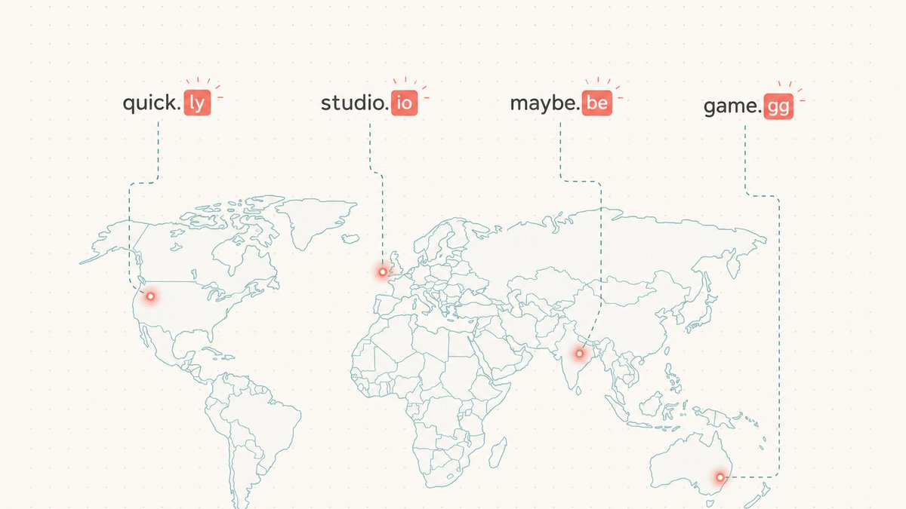

Hay un tipo de dirección web que no se lee, sino que se *decodifica*. Ves las letras, ves los puntos y, de repente, toda la cadena encaja en una sola palabra que atraviesa la puntuación. El más famoso que se ha creado fue `del.icio.us`. Si lo lees despacio, se descompone en partes; si lo lees rápido, simplemente dice "delicious".

Ese truco tiene un nombre. Se llama **domain hack** y es una de las artimañas más antiguas de internet. Esta guía explica qué es realmente un domain hack, por qué las marcas y los inversores de dominios siguen pagando por ellos, los riesgos muy reales que se esconden detrás de los más ingeniosos y cómo evaluar un domain hack como flipper antes de transferir dinero por él.

## Qué es un domain hack

Un domain hack es un nombre de dominio en el que la propia extensión se convierte en parte de la palabra. En lugar de que la dirección *apunte a* una palabra, la dirección *es* la palabra, formada a través del punto. Wikipedia lo define con precisión: [un domain hack es un nombre de dominio que sugiere una palabra, frase o nombre al concatenar dos o más niveles adyacentes de ese dominio](https://en.wikipedia.org/wiki/Domain_hack#:~:text=A%20domain%20hack%20is%20a%20domain%20name%20that%20suggests%20a%20word).

El mecanismo es el [dominio de nivel superior](/en/glossary/tld/) (TLD, por sus siglas en inglés), la parte que va después del último punto. La mayoría de los domain hacks famosos toman prestado un **dominio de nivel superior de código de país** (ccTLD), la extensión de dos letras que se asigna a un país en el DNS global, y la utilizan como si fuera la última sílaba de una palabra en inglés. `del.icio.us` hizo exactamente eso: tomó `.us` (el ccTLD de Estados Unidos), registró `icio.us`, añadió `del` delante como subdominio y el conjunto se leía como "delicious". Analizamos ese caso en detalle en [el caso de estudio de del.icio.us](/en/blog/from-del-icio-us-to-delicious-com/), y sigue siendo el ejemplo de manual.

Funciona porque los ccTLD nunca se diseñaron para ser terminaciones de palabras; es una casualidad de las dos letras que le tocaron a cada país. (Si nunca te has preguntado de dónde vienen estas extensiones, nuestro artículo explicativo sobre [qué es un TLD](/en/blog/what-is-a-tld/) cubre el tema). Un domain hack es lo que ocurre cuando alguien se da cuenta de que el código de dos letras de un país también forma un sufijo útil y decide construir una marca a partir de esa coincidencia.

## Cómo funciona: ccTLD que también funcionan como sufijos en inglés

Un puñado de ccTLD son oro para esto porque sus dos letras son terminaciones de palabras comunes o palabras por sí mismas. El truco —y volveremos a esto con fuerza más adelante— es que cada uno de ellos pertenece a un país real con reglas reales. Estos son los más utilizados, con las direcciones famosas construidas sobre cada uno:

- **`.ly` (Libia).** Este es el motor de la era de los acortadores de enlaces. `.ly` se lee como la terminación del adverbio en inglés "-ly", y como señala Wikipedia, [muchos servicios populares de acortamiento de URL están registrados en el dominio .ly, como bit.ly](https://en.wikipedia.org/wiki/.ly#:~:text=Many%20popular%20URL%20shortening%20services). Bitly es el gigante aquí; según Wikipedia, [Bitly es un servicio de acortamiento de URL y una plataforma de gestión de enlaces](https://en.wikipedia.org/wiki/Bitly#:~:text=Bitly%20is%20a%20URL%20shortening%20service), y despegó cuando [se convirtió en el servicio de acortamiento de URL por defecto en el sitio web el 6 de mayo de 2009](https://en.wikipedia.org/wiki/Bitly#:~:text=default%20URL%20shortening%20service%20on%20the%20website%20on%20May%206%2C%202009) para Twitter.
- **`.be` (Bélgica).** Los enlaces cortos de YouTube residen aquí. Como dice Wikipedia, [YouTube utiliza el domain hack youtu.be para su servicio de acortamiento de URL](https://en.wikipedia.org/wiki/.be#:~:text=YouTube%20uses%20the%20domain%20hack).
- **`.gl` (Groenlandia).** El antiguo acortador de Google, `goo.gl`, se construyó sobre el código de Groenlandia. Wikipedia registra que [en diciembre de 2009, Google lanzó un servicio de acortamiento de URL utilizando el domain hack goo.gl](https://en.wikipedia.org/wiki/.gl#:~:text=Google%20released%20a%20URL%20shortener%20service%20using%20the%20domain%20hack), y que [el servicio se cerró el 30 de marzo de 2019](https://en.wikipedia.org/wiki/.gl#:~:text=The%20service%20was%20shut%20down%20on%2030%20March%202019). (Ese cierre es una historia con moraleja en sí misma, y ya veremos por qué un dominio de enlace retirado es más que una nota al pie de página).
- **`.co` (Colombia).** Twitter envuelve cada enlace saliente en `t.co`. Según Wikipedia, [t.co es un servicio de acortamiento de URL creado por Twitter](https://en.wikipedia.org/wiki/T.co#:~:text=t.co%20is%20a%20URL%20shortening%20service%20created%20by%20Twitter), que funciona en [el dominio de nivel superior de código de país de Internet (ccTLD) asignado a Colombia](https://en.wikipedia.org/wiki/.co#:~:text=is%20the%20Internet%20country%20code%20top%2Dlevel%20domain%20%28ccTLD%29%20assigned%20to%20Colombia). `.co` es uno de los pocos ccTLD que se lee como un fragmento de palabra genérico ('co' de 'company', o simplemente un `.com` más corto), lo que explica en parte por qué se vende tanto.
- **`.am` (Armenia).** Este es el que está detrás del antiguo nombre corto de Instagram. Wikipedia confirma que `.am` es [el ccTLD para Armenia](https://en.wikipedia.org/wiki/.am#:~:text=is%20the%20internet%20country%20code%20top%2Dlevel%20domain%20%28ccTLD%29%20for%20Armenia) y que [el servicio de intercambio de fotos móvil Instagram utiliza el nombre de dominio armenio Instagr.am](https://en.wikipedia.org/wiki/.am#:~:text=the%20mobile%20photo%20sharing%20service%20Instagram%20uses%20the%20Armenian%20domain%20name). Contamos toda esa historia en [el caso de estudio de instagr.am](/en/blog/from-instagr-am-to-instagram-com/).
- **`.me` (Montenegro).** La extensión del espacio de nombres personal. Wikipedia señala que [la mayoría de los nombres de dominio .me se compraron como domain hacks en inglés](https://en.wikipedia.org/wiki/.me#:~:text=Most%20.me%20domain%20names%20were%20purchased%20as%20domain%20hacks), porque "me" se lee como el pronombre en inglés.
- **`.gg` (Guernsey).** El favorito de los videojuegos. Según Wikipedia, [múltiples videojuegos, streamers y sitios web de esports utilizan el dominio de Guernsey (.gg) porque "gg" es un inicialismo común](https://en.wikipedia.org/wiki/.gg#:~:text=Multiple%20video%20games%2C%20streamers%20and%20esports%20websites%20use%20Guernsey%27s%20domain) para "good game".
- **`.sh` (Santa Elena).** Una broma interna de desarrolladores, porque `.sh` también es la extensión de archivo para los scripts de shell de Unix. Wikipedia observa que [dado que la extensión de archivo .sh también es utilizada por los scripts de shell de Unix, este dominio ha sido utilizado para sitios web sobre programas de interfaz de línea de comandos](https://en.wikipedia.org/wiki/.sh#:~:text=Since%20the%20.sh%20filename%20extension%20is%20also%20used%20by%20Unix%20shell%20scripts) — piensa en `brew.sh`, el hogar de Homebrew.
- **`.tv` (Tuvalu) y `.fm` (Estados Federados de Micronesia).** El par de los medios. `.tv` es, en palabras de Wikipedia, [popular, y por lo tanto económicamente valioso, porque TV también resulta ser una abreviatura de la palabra televisión](https://en.wikipedia.org/wiki/.tv#:~:text=because%20TV%20also%20happens%20to%20be%20an%20abbreviation%20of%20the%20word%20television), y `.fm` hace el mismo trabajo para las marcas de radio y audio.

Y luego está el "sufijo accidental" más exitoso de todos: `.io`, el ccTLD del Territorio Británico del Océano Índico, que los desarrolladores leen como I/O (E/S en español). No es estrictamente un hack de formación de palabras como `del.icio.us`, pero es la misma coincidencia en acción: un código de país que casualmente significa algo para la gente que lo escribe. Profundizamos en por qué esa extensión alcanza un precio tan alto en [por qué los dominios .io son caros](/en/blog/why-are-io-domains-expensive/) y en la [página del TLD .io](/en/tld/io/).

## Por qué las marcas y los flippers los valoran

Si dejas de lado el ingenio, un domain hack compite en lo mismo que cualquier gran dominio: es corto, es memorable y transmite significado en menos caracteres que cualquier otro. Un buen hack es una palabra entera en tres o cuatro sílabas de dirección, sin desperdiciar nada.

Para el tipo de producto que vive dentro del texto de otras personas —un acortador de enlaces, un botón para compartir, un enlace de invitación— esa brevedad es todo el producto. Cada carácter en una URL acortada es un carácter que el usuario no tuvo que leer, y el truco del punto como sufijo te da el significado de una palabra por el precio de dos letras. Por eso toda una generación de herramientas de infraestructura —Bitly, el `youtu.be` de YouTube, los enlaces de invitación de Discord en `.gg`— eligió hacks en lugar de largos `.com`. El hack *era* la característica.

Para todos los demás, el atractivo es la capacidad de crear una marca. Un nombre que se lee como una palabra real pero que resuelve en una extensión inusual es distintivo casi por definición, y la distinción es exactamente lo que le falta a una categoría saturada. Eso es también lo que convierte a los hacks en un mercado activo en el [comercio de dominios](/en/glossary/domain-trading/): la oferta de combinaciones limpias, cortas y que forman palabras en un buen ccTLD es genuinamente finita, y la demanda de fundadores que quieren un nombre que no suene como el de los demás no lo es. Un hack potente en una extensión popular es el tipo de activo que los domainers rastrean, de la misma manera que rastrean los `.com` de una sola palabra, y muchos de los mismos fundamentos de [qué hace que un dominio sea valioso](/en/blog/what-makes-a-domain-valuable/) se aplican directamente.

## La trampa: un ccTLD es el país de otro

Esta es la parte que la mayoría de los listados de "10 domain hacks ingeniosos" omiten, y es la parte que separa a un aficionado de alguien que realmente puede valorar uno de estos. **Cuando registras un domain hack, estás alquilando dos letras de territorio soberano, y ese territorio pone las reglas.** Un `.com` se rige por un marco estable y globalmente neutro. Un ccTLD se rige por un país, y los países cambian, restringen y, ocasionalmente, incautan.

El ejemplo más crudo es `.ly`. Es el ccTLD de Libia, y la ley libia se aplica a lo que se aloja en él. En 2010, eso dejó de ser teórico. Como registra Wikipedia, [en octubre de 2010, el dominio del servicio de acortamiento de URL "sex-positive" vb.ly ... fue incautado por las autoridades web libias por no cumplir con la ley de Libia](https://en.wikipedia.org/wiki/.ly#:~:text=the%20domain%20of%20%22sex%2Dpositive%22%20URL%20shortening%20service%20vb.ly), con la explicación del registro reportada como contundente: [la pornografía y el material para adultos no están permitidos bajo la ley libia ... Por lo tanto, eliminamos el dominio](https://en.wikipedia.org/wiki/.ly#:~:text=Pornography%20and%20adult%20material%20aren%27t%20allowed%20under%20Libyan%20Law). El dominio no expiró y no se vendió. Fue confiscado, por lo que apuntaba, bajo reglas que no tenían nada que ver con la internet abierta y todo que ver con la ley de contenido de un país.

El segundo tipo de riesgo es uno que un `.com` realmente no puede tener: el propio código de país puede ser cuestionado. Ese es el problema abierto que pende sobre `.io`. Su existencia depende de que el Territorio Británico del Océano Índico exista como una entidad distinta, y eso es exactamente lo que está cambiando. El Reino Unido y Mauricio han acordado transferir la soberanía del Archipiélago de Chagos; según Wikipedia, [el 22 de mayo de 2025, el acuerdo fue firmado por el Reino Unido y Mauricio](https://en.wikipedia.org/wiki/Chagos_Archipelago_sovereignty_dispute#:~:text=the%20agreement%20was%20signed%20by%20the%20UK%20and%20Mauritius). Wikipedia detalla la consecuencia a nivel de dominio: [después de la transferencia, las reglas actuales de la IANA pueden requerir que el dominio .io sea eliminado gradualmente, lo que tomaría al menos 5 años](https://en.wikipedia.org/wiki/.io#:~:text=current%20IANA%20rules%20may%20require%20the%20.io%20domain%20to%20be%20phased%20out). Nada se ha cerrado, y los plazos son largos e inciertos —exponemos la versión mesurada en [por qué los dominios .io son caros](/en/blog/why-are-io-domains-expensive/)— pero es una categoría de riesgo que simplemente no existe para un `.com`.

Hay un tercer riesgo, más silencioso, y `goo.gl` es el monumento a él: un registro u operador puede simplemente decidir abandonar. Google retiró el servicio `goo.gl` en 2019, y la larga cola de enlaces construidos sobre él ha estado decayendo desde entonces. Un hack es tan duradero como la institución que gestiona tanto la extensión como el servicio sobre ella. La lección para un flipper no es "nunca toques un ccTLD". Es "incluye el país en el precio". Algunos registros son estables y liberales con el registro de terceros; otros se reservan el derecho de rechazar o revocar basándose en reglas locales. Cómo se comporta una extensión dada es un fundamental, no una nota al pie, que es el punto central de entender [cómo el TLD afecta el valor de un dominio](/en/blog/how-tld-affects-domain-value/).

## Cómo detectar y valorar un domain hack como flipper

Si estás comprando o manteniendo hacks en lugar de solo admirarlos, algunas heurísticas prácticas separan los activos de las curiosidades:

1. **¿Forma una palabra real que el mercado quiere?** El valor está en la palabra, no en la ingeniosidad de la construcción. `stud.io`, `rad.io` y `delicious` son palabras que la gente ya busca y por las que paga. Un hack que forma una palabra oscura, o que necesita un subdominio y tres puntos para funcionar, es un rompecabezas, no una marca.
2. **¿Puede alguien decirlo en voz alta y llegar a él?** El defecto fatal de `del.icio.us` nunca fue su apariencia, sino que no podías decirle el nombre a alguien sin deletrear cada punto. Un hack que se lee como una sola palabra limpia al hablar (la extensión desaparece en la palabra) vale mucho más que uno que requiere instrucciones de puntuación. Si para recomendarlo se necesita una lección de ortografía, descuéntale mucho valor.
3. **¿Cuál es la política y la estabilidad del registro?** Antes de valorar un hack en `.ly`, `.io` o cualquier ccTLD, investiga si el registro acepta registros de terceros, qué reglas de contenido se aplican y cuán políticamente estable es el territorio. Esta es la diligencia debida que el registrante de vb.ly no pudo hacer. Un hack hermoso en un ccTLD volátil o restrictivo tiene un descuento que un `.com` nunca tendría.
4. **¿Es la extensión ya un mercado probado para hacks?** `.io`, `.co`, `.me`, `.gg` y `.ly` tienen una demanda establecida, liquidez y un historial de marcas que pagan por ellos. Un ccTLD novedoso sin compradores es un dominio que conservarás para siempre. La liquidez es parte del precio.
5. **¿Existe un `.com` de coincidencia exacta y limpio como alternativa para la misma palabra?** A menudo, la posición más valiosa es poseer *tanto* el hack como el `.com` correspondiente. El hack gana el uso ingenioso y dentro del producto; el `.com` gana el uso fácil de decir en voz alta y para el mercado masivo. Un comprador que necesite ambos pagará por el par.

La versión corta: valora la palabra, pruébala hablada, incluye el país en el precio y comprueba que existan compradores reales para esa extensión. Un domain hack es un gran activo cuando los cuatro factores se alinean y una trampa ingeniosa cuando no lo hacen.

## La perspectiva de Namefi

Cuando un hack premium cambia de manos, la parte difícil no es acordar un precio, es la transferencia. Mover un nombre valioso significa probar quién lo posee, entregarlo sin que el sitio se caiga y confiar en que la otra parte realmente cumpla. Esa es la misma fricción detrás de cualquier [comercio de dominios](/en/glossary/domain-trading/) de alto valor, y es peor para un hack, donde el nombre a menudo *es* infraestructura activa dentro del producto de alguien.

Este es el vacío que [Namefi](https://namefi.io) está diseñado para llenar: la propiedad tokenizada hace que el control de un dominio real de la ICANN sea más fácil de verificar y transferir, con continuidad de DNS para que el nombre siga resolviendo durante el traspaso. Lo ingenioso es divertido. Una transferencia limpia y auditable del activo que subyace al ingenio es lo que te permite realmente comerciar con él.

## Fuentes y lecturas adicionales

- Wikipedia — [Domain hack](https://en.wikipedia.org/wiki/Domain_hack#:~:text=A%20domain%20hack%20is%20a%20domain%20name%20that%20suggests%20a%20word)
- Wikipedia — [.ly (Libia, y la incautación de vb.ly)](https://en.wikipedia.org/wiki/.ly#:~:text=the%20domain%20of%20%22sex%2Dpositive%22%20URL%20shortening%20service%20vb.ly)
- Wikipedia — [Bitly](https://en.wikipedia.org/wiki/Bitly#:~:text=Bitly%20is%20a%20URL%20shortening%20service)
- Wikipedia — [.be (Bélgica / youtu.be)](https://en.wikipedia.org/wiki/.be#:~:text=YouTube%20uses%20the%20domain%20hack)
- Wikipedia — [.gl (Groenlandia / goo.gl)](https://en.wikipedia.org/wiki/.gl#:~:text=Google%20released%20a%20URL%20shortener%20service%20using%20the%20domain%20hack)
- Wikipedia — [T.co (Twitter)](https://en.wikipedia.org/wiki/T.co#:~:text=t.co%20is%20a%20URL%20shortening%20service%20created%20by%20Twitter) · [.co (Colombia)](https://en.wikipedia.org/wiki/.co#:~:text=is%20the%20Internet%20country%20code%20top%2Dlevel%20domain%20%28ccTLD%29%20assigned%20to%20Colombia)
- Wikipedia — [.am (Armenia / instagr.am)](https://en.wikipedia.org/wiki/.am#:~:text=the%20mobile%20photo%20sharing%20service%20Instagram%20uses%20the%20Armenian%20domain%20name)
- Wikipedia — [.me (Montenegro)](https://en.wikipedia.org/wiki/.me#:~:text=Most%20.me%20domain%20names%20were%20purchased%20as%20domain%20hacks)
- Wikipedia — [.gg (Guernsey)](https://en.wikipedia.org/wiki/.gg#:~:text=Multiple%20video%20games%2C%20streamers%20and%20esports%20websites%20use%20Guernsey%27s%20domain)
- Wikipedia — [.sh (Santa Elena)](https://en.wikipedia.org/wiki/.sh#:~:text=Since%20the%20.sh%20filename%20extension%20is%20also%20used%20by%20Unix%20shell%20scripts)
- Wikipedia — [.tv (Tuvalu)](https://en.wikipedia.org/wiki/.tv#:~:text=because%20TV%20also%20happens%20to%20be%20an%20abbreviation%20of%20the%20word%20television)
- Wikipedia — [.io (Territorio Británico del Océano Índico / Eliminación gradual de la IANA)](https://en.wikipedia.org/wiki/.io#:~:text=current%20IANA%20rules%20may%20require%20the%20.io%20domain%20to%20be%20phased%20out)
- Wikipedia — [Disputa de soberanía del Archipiélago de Chagos (acuerdo Reino Unido-Mauricio firmado el 22 de mayo de 2025)](https://en.wikipedia.org/wiki/Chagos_Archipelago_sovereignty_dispute#:~:text=the%20agreement%20was%20signed%20by%20the%20UK%20and%20Mauritius)
