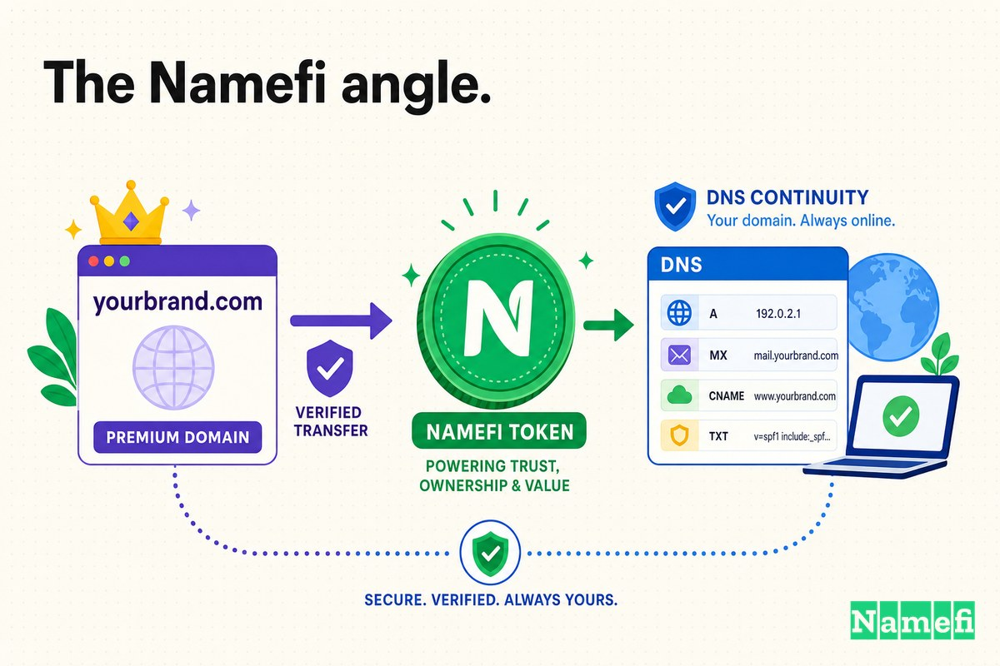

Durante aproximadamente cinco años, uno de los sitios más influyentes de la era Web 2.0 vivió en una dirección que casi no podías pronunciar en voz alta: **del.icio.us**.

El nombre era ingenioso. Era, de hecho, el ejemplo más famoso de un *domain hack* — un truco en el que el propio dominio deletrea una palabra aprovechando un sufijo de código de país. Joshua Schachter registró `icio.us` en el [ccTLD](/es/glossary/cctld/) [.us](/es/tld/us/), puso `del` delante como [subdominio](/es/glossary/subdomain/), y toda la cadena se leía como "delicious" (delicioso). Como explicó uno de los primeros análisis sobre la construcción, [`del` es en realidad un subdominio de `icio.us`](https://www.quickonlinetips.com/archives/2005/02/decoding-the-domain-name-delicious/#:~:text=del%20is%20actually%20a%20subdomain), y ese ensamblaje de subdominio más ccTLD fue, en sus propias palabras, [una forma ingeniosa de registrar un nombre de dominio](https://www.quickonlinetips.com/archives/2005/02/decoding-the-domain-name-delicious/#:~:text=an%20ingenious%20way%20to%20register%20a%20domain%20name).

Para un proyecto personal gestionado por un ingeniero por diversión, ese ingenio era el objetivo. Los puntos eran un guiño cómplice. Decían: esta es una herramienta de hacker, construida por alguien que piensa que la fontanería de la web también es un lugar para ser creativo.

Pero un guiño no escala. Cada punto en `del.icio.us` era un lugar donde un nuevo usuario podía perderse — una coma donde debía ir un punto, una letra que faltaba, una de más. Y el sitio detrás de esos puntos no iba a quedarse como un proyecto personal. Acuñó una categoría, atrajo a cientos de miles de usuarios y fue comprado por Yahoo. En 2008, bajo la propiedad de Yahoo, el dominio más ingenioso de la web fue canjeado por el aburrido y correcto: **Delicious.com**.

Esta es la historia de cuándo un domain hack deja de ser encantador y se convierte en un impuesto — y lo que cuesta arreglarlo después de que millones de personas ya han aprendido a escribir mal tu nombre.

## 2003: un proyecto personal con nombre de código de país

Al principio, los puntos eran gratuitos.

Schachter no se propuso construir una empresa. Construyó una herramienta para sí mismo. Cuando [superó los 20.000 enlaces en 2001](https://www.computerworld.com/article/1588198/del-icio-us-social-bookmarking-phenomenon.html#:~:text=When%20he%20topped%2020%2C000%20links%20in%202001), escribió un programa de un solo usuario para gestionar su propio caos de marcadores, y luego lo reescribió como algo que otras personas pudieran usar. Como relató Computerworld más tarde, [lo reescribió desde cero como un sistema multiusuario y lo lanzó en la web para que otros lo usaran. Lo llamó del.icio.us.](https://www.computerworld.com/article/1588198/del-icio-us-social-bookmarking-phenomenon.html#:~:text=he%20rewrote%20it%20from%20scratch%20as%20a%20multiuser%20system%20and%20launched%20it%20on%20the%20Web%20for%20others%20to%20use.%20He%20called%20it%20del.icio.us.) Según Wikipedia, [en septiembre de 2003, Schachter lanzó la primera versión de Delicious.](https://en.wikipedia.org/wiki/Delicious_(website)#:~:text=In%20September%202003%2C%20Schachter%20released%20the%20first%20version%20of%20Delicious.)

Lo hizo en su tiempo libre. Según Computerworld, [Schachter lo gestionó en su tiempo libre, mientras trabajaba a tiempo completo como analista cuantitativo en Morgan Stanley](https://www.computerworld.com/article/1588198/del-icio-us-social-bookmarking-phenomenon.html#:~:text=Schachter%20ran%20it%20in%20his%20spare%20time%2C%20while%20working%20full%20time%20as%20a%20quantitative%20analyst%20at%20Morgan%20Stanley) — el tipo de origen fuera del horario laboral en el que nadie está haciendo revisiones de marca ni pensando en cómo se verá el nombre en un rótulo de televisión. La idea del etiquetado que hizo famoso al sitio ni siquiera era nativa de él; según Wikipedia, fue [un sistema que desarrolló para organizar los enlaces sugeridos a Memepool](https://en.wikipedia.org/wiki/Joshua_Schachter#:~:text=a%20system%20he%20developed%20for%20organizing%20links%20suggested%20to%20Memepool).

Y el producto funcionó. Sin presupuesto de marketing, se propagó por el ingenio y el boca a boca. Computerworld informó que [sin marketing formal, hoy del.icio.us tiene alrededor de 200.000 usuarios registrados](https://www.computerworld.com/article/1588198/del-icio-us-social-bookmarking-phenomenon.html#:~:text=With%20no%20formal%20marketing%2C%20today%20del.icio.us%20has%20about%20200%2C000%20registered%20users), y Wikipedia le otorga al servicio más que solo usuarios: [el servicio acuñó el término marcadores sociales](https://en.wikipedia.org/wiki/Joshua_Schachter#:~:text=The%20service%20coined%20the%20term%20social%20bookmarking).

Así que aquí está el planteamiento. Una empresa que *nombró una categoría entera* llevaba un dominio diseñado para un pasatiempo de una sola persona. El nombre era un chiste de hacker que accidentalmente se había convertido en una marca.

## El dominio más ingenioso de la web — y el más mal escrito

`del.icio.us` es, incluso ahora, el ejemplo de libro de texto de un domain hack. Wikipedia lo afirma claramente: [el nombre de dominio "del.icio[.us]" era un ejemplo bien conocido de un domain hack, una combinación no convencional de letras para formar una palabra o frase.](https://en.wikipedia.org/wiki/Delicious_(website)#:~:text=domain%20name%20was%20a%20well%2Dknown%20example%20of%20a%20domain%20hack)

El truco era genuinamente elegante. Como explicó el análisis de la construcción, [icio era el nombre de dominio seleccionado y .us era el dominio de nivel superior con código de país registrado (ccTLD), que combinados formaban icio.us](https://www.quickonlinetips.com/archives/2005/02/decoding-the-domain-name-delicious/#:~:text=icio%20was%20the%20selected%20domain%20name%20and%20.us%20was%20the%20registered%20country%20code%20level%20top%20level%20domain), con `del` apilado encima como subdominio. La dirección no *apuntaba* a una palabra. La dirección *era* una palabra. Para una audiencia de ingenieros, eso era irresistible.

El problema es que el resto del mundo no lee DNS por diversión. Esos cuatro puntos convirtieron la marca en un examen de ortografía, y la mayoría de la gente lo suspendía. Cuando el equipo finalmente explicó el cambio de 2008, enumeró los daños: [hemos visto un millón de confusiones y errores ortográficos de "del.icio.us" a lo largo de los años (por ejemplo, "de.licio.us", "del.icio.us.com" y "del.licio.us")](https://domainnamewire.com/2008/08/01/delicious-rebrands-as-deliciouscom-a-lesson-for-entrepreneurs/#:~:text=zillion%20different%20confusions%20and%20misspellings). Cada punto mal colocado era un usuario que no llegaba, un enlace compartido que no se resolvía, una recomendación que moría en el hueco entre escuchar el nombre y escribirlo.

Schachter lo sabía. Lo había sabido casi desde el principio. Como señaló Domain Name Wire, ya en 2004 habló sobre el error al elegir el nombre, citándolo directamente: [me arrepiento un poco de haber usado ese nombre de dominio, porque es casi imposible comentarlo o verificarlo sin sonar ridículo.](https://domainnamewire.com/2008/08/01/delicious-rebrands-as-deliciouscom-a-lesson-for-entrepreneurs/#:~:text=I%20somewhat%20regret%20using%20the%20domain%20name)

Esa frase resume toda la tensión de un domain hack en una sola oración. *Casi imposible de comentar o verificar sin sonar ridículo.* Un nombre que vive en una pantalla puede ser ingenioso y retorcido al mismo tiempo. Un nombre que tiene que sobrevivir siendo dicho en voz alta — en una llamada telefónica, en un bar, en un podcast, a un colega — tiene que ser pronunciable. Los puntos que convirtieron `del.icio.us` en un gran chiste interno lo convirtieron en algo terrible de recomendar.

## 2005: Yahoo compra el pasatiempo

El pasatiempo se convirtió en una adquisición.

El [9 de diciembre de 2005, Yahoo! adquirió Delicious por una suma no revelada](https://en.wikipedia.org/wiki/Joshua_Schachter#:~:text=On%20December%209%2C%202005%2C%20Yahoo%21%20acquired%20Delicious%20for%20an%20undisclosed%20sum) — un precio que Wikipedia indica fue [según Business 2.0 ... 30 millones de dólares](https://en.wikipedia.org/wiki/Joshua_Schachter#:~:text=According%20to%20Business%202.0%2C%20the%20acquisition%20price%20was%20%2430%20million). Delicious era, en ese momento, una joya de la corona de la Web 2.0. TechCrunch describió la era con afecto posteriormente: [érase una vez (quizás alrededor de 2004), el servicio de marcadores sociales Delicious era lo más de lo más en la web](https://techcrunch.com/2016/01/12/delicious-former-web-2-0-darling-is-now-managed-by-new-alliance-rolls-back-most-recent-changes/#:~:text=the%20social%20bookmarking%20service%20Delicious%20was%20the%20hottest%20thing%20on%20the%20web), un sitio que [acertó con todas las palabras de moda de la época (etiquetado colaborativo, folksonomía, AJAX)](https://techcrunch.com/2016/01/12/delicious-former-web-2-0-darling-is-now-managed-by-new-alliance-rolls-back-most-recent-changes/#:~:text=hit%20all%20the%20right%20buzzwords%20of%20the%20time).

Yahoo ahora era propietaria de un producto que definía una categoría. También era propietaria del mayor problema de legibilidad de ese producto. Un proyecto personal sin presupuesto puede llevar un domain hack como insignia. Una propiedad de consumo masivo propiedad de una empresa pública que quiere que *todos* la usen no puede — cada punto es fricción que se interpone entre Yahoo y el crecimiento de mercado masivo que justificó el precio de compra.

Así que la pregunta que Yahoo heredó no era si `del.icio.us` era ingenioso. Todos coincidían en que era ingenioso. La pregunta era si el ingenio valía los millones de usuarios que no podían escribirlo correctamente.

## 2008: cambiando el guiño por la palabra

En el verano de 2008, Yahoo tomó la decisión. Se lanzó un Delicious rediseñado y la marca migró silenciosamente a la dirección que siempre debería haber tenido. Según Wikipedia, [el nuevo diseño entró en funcionamiento el 31 de julio de 2008.](https://en.wikipedia.org/wiki/Delicious_(website)#:~:text=The%20new%20design%20went%20live%20on%20July%2031%2C%202008.)

Domain Name Wire capturó el cambio con precisión: [el sitio de marcadores sociales Delicious ha dado el cambio en su marca, animando a los usuarios a visitar el fácil de recordar Delicious.com en lugar del a menudo mal escrito del.icio.us.](https://domainnamewire.com/2008/08/01/delicious-rebrands-as-deliciouscom-a-lesson-for-entrepreneurs/#:~:text=flipped%20the%20switch%20on%20its%20brand%2C%20encouraging%20users%20to%20visit%20the%20easy%2Dto%2Dremember%20Delicious.com%20instead%20of%20the%20often%20typod%20del.icio.us) Nótese el encuadre: *fácil de recordar* frente a *a menudo mal escrito*. Cinco años y una adquisición después, la razón oficial del cambio era exactamente el problema que Schachter había nombrado en 2004 — los puntos costaban más de lo que valían.

La explicación de por qué cambiaron fue sin sentimentalismos. Como informó Domain Name Wire con las propias palabras del equipo, el objetivo de mudarse a delicious.com era que [facilitará a las personas encontrar el sitio y compartirlo con sus amigos](https://domainnamewire.com/2008/08/01/delicious-rebrands-as-deliciouscom-a-lesson-for-entrepreneurs/#:~:text=will%20make%20it%20easier%20for%20people%20to%20find%20the%20site%20and%20share%20it%20with%20their%20friends). Encontrarlo. Compartirlo. Esos son los dos verbos que un domain hack interrumpe silenciosamente, y son los dos verbos por los que vive y muere un producto en etapa de crecimiento.

Esta es la rara actualización en la que la empresa se movió *hacia* el simple `.com` y se alejó de la cadena ingeniosa — la dirección opuesta al camino habitual de descriptivo a coincidencia exacta. Pero es el mismo movimiento subyacente: desprenderse de un nombre que mostraba el ingenio del fundador a favor de un nombre que todo el mercado pudiera usar sin pensar.

## El dinero se veía diferente entonces

Es fácil, desde aquí, decir que Schachter simplemente debería haber comprado delicious.com en 2003 y haberse saltado los puntos. Eso lee la decisión desde el extremo equivocado.

En 2003, `del.icio.us` no era una decisión de marca. Era una decisión de *pasatiempo*. Schachter no estaba asignando un presupuesto de marketing; estaba registrando un dominio para una herramienta que gestionaba noches y fines de semana mientras mantenía su trabajo diario en Morgan Stanley. El truco no fue un error estratégico — fue un pequeño placer creativo, el tipo de cosa que haces *porque* es solo para ti.

Domain Name Wire hizo exactamente esta concesión, y es la lectura justa: [dado que el sitio Delicious comenzó como un pasatiempo, al fundador Joshua Schachter se le puede perdonar no haber usado un buen nombre de dominio.](https://domainnamewire.com/2008/08/01/delicious-rebrands-as-deliciouscom-a-lesson-for-entrepreneurs/#:~:text=Since%20the%20Delicious%20site%20started%20as%20a%20hobby%2C%20founder%20Joshua%20Schachter%20can%20be%20forgiven%20for%20not%20using%20a%20good%20domain%20name.)

La trampa no es elegir un domain hack cuando eres pequeño. La trampa es *conservarlo* cuando ya no lo eres. El costo de los puntos era casi nulo para un proyecto personal con unos pocos miles de usuarios técnicos que pensaban que el truco era genial. El costo aumentó cada vez que la audiencia se amplió — más allá de los primeros adoptantes, más allá de los 200.000 usuarios registrados, más allá de una adquisición de Yahoo, hacia el mercado masivo que Yahoo quería. La factura de `del.icio.us` no se pagó en 2003. Llegó en 2008, denominada en cada usuario que no podía encontrar un sitio al que le habían dicho que probara.

## Por qué importaba el traslado a Delicious.com

La brecha entre `del.icio.us` y `Delicious.com` parece puntuación. Estratégicamente, es la diferencia entre un nombre que ejecuta ingenio y un nombre que entrega usuarios.

**del.icio.us** es un acertijo: cuatro puntos, un código de país prestado, una cadena que tienes que *descifrar* antes de poder escribirla. **Delicious.com** es simplemente una palabra. Una le pide al oyente que recuerde una estructura inusual. La otra le pide que recuerde una palabra que ya sabe cómo se escribe.

| Antes | Después |
| --- | --- |
| del.icio.us | Delicious.com |
| Un domain hack (el ccTLD .us deletreando una palabra) | Una palabra .com simple y de coincidencia exacta |
| Ingenioso para leer en pantalla | Fácil de decir en voz alta y compartir |
| Cuatro puntos = cuatro lugares para cometer errores tipográficos | Una palabra, una ortografía |
| "de.licio.us", "del.licio.us", "del.icio.us.com" | delicious.com |
| Señala el proyecto personal de un hacker | Señala un producto de consumo masivo |

Esta es la misma lección que en toda actualización de dominio, solo que llegando desde el lado opuesto. La mayoría de las empresas pasan de un nombre *descriptivo* (UberCab, TeslaMotors) a una palabra limpia de coincidencia exacta. Delicious pasó de un nombre *demasiado ingenioso* a la palabra limpia de coincidencia exacta. El destino es idéntico: un dominio que desaparece dentro de la marca en lugar de exigir atención. Un gran dominio es aquel en el que los usuarios no tienen que pensar. `del.icio.us` les hacía pensar en el dominio cada vez.

Y el traslado llevó una advertencia para todos los que observaban. Domain Name Wire expuso la lección más amplia sin rodeos: [lamentablemente, varios emprendedores de la Web 2.0 vieron el éxito de del.icio.us y pensaron que sería genial crear sus propios domain hacks, resultando en nombres de dominio mal elegidos que enviaban mucho tráfico al lugar equivocado.](https://domainnamewire.com/2008/08/01/delicious-rebrands-as-deliciouscom-a-lesson-for-entrepreneurs/#:~:text=Sadly%2C%20a%20number%20of%20web%202.0%20entrepreneurs%20saw%20the%20success%20of%20del.icio.us) El truco que hizo famoso a Delicious también lo convirtió en una plantilla de advertencia — copiada por fundadores que vieron el ingenio y pasaron por alto el costo.

## El momento: cuando "ingenioso" se convirtió en "caro"

La pregunta interesante no es *por qué* Delicious cambió. Es *cuándo*.

La queja fue constante desde el principio — Schachter la nombró en 2004, el año después del lanzamiento. Pero el cambio no ocurrió hasta 2008, después de que la base de usuarios se hubiera disparado y Yahoo hubiera pagado un reportado $30 millones de dólares por la empresa. Los puntos no empeoraron durante esos años. Lo que empeoró fueron las *apuestas*.

Cuando tienes unos pocos miles de usuarios técnicos, un dominio difícil de escribir es una rareza que perdonan. Cuando eres una propiedad de Yahoo que persigue la adopción masiva, el mismo dominio es una fuga en la parte superior del embudo — cada "del-punto-¿qué?" es un usuario que nunca llega. La tasa impositiva sobre los puntos nunca cambió. El tamaño de lo que se estaba gravando creció hasta que la factura fue imposible de ignorar. Para 2008, las matemáticas eran obvias de una manera que simplemente no lo eran en 2003: el costo de cambiar una vez era menor que el costo de ser escrito incorrectamente para siempre.

## El dominio se convirtió en parte del sistema operativo

Los dominios premium no se tratan de prestigio. Se tratan de repetición — y un domain hack falla exactamente en los puntos donde ocurre la repetición.

La dirección principal de un sitio aparece en lugares que ningún equipo de marketing controla:

- En el boca a boca: "deberías probar del-icio-us... no, se escribe con puntos."
- En la barra del navegador, donde un punto equivocado lleva a ninguna parte.
- En los enlaces compartidos entre amigos, donde un error tipográfico falla silenciosamente.
- En la prensa, podcasts y conversaciones, donde un nombre tiene que sobrevivir siendo *dicho*.
- En los primeros treinta segundos de cada nuevo usuario, donde encontrar el sitio es el primer paso.

Cada uno de esos momentos añade fricción o la elimina. `del.icio.us` añadía fricción en todos ellos: el nombre era imposible de decir sin explicación, imposible de compartir sin cuidado, e imposible de encontrar para cualquiera que se equivocara con un punto. `Delicious.com` eliminó la fricción en todos ellos: dices una palabra, escribes una palabra, ya estás allí. Multiplica esa diferencia por cientos de miles de usuarios y cada recomendación que hicieron a un amigo, y el ingenio del truco deja de parecer un activo y empieza a parecer una caseta de peaje que la empresa construyó frente a su propia puerta.

El dominio no hizo popular a Delicious — el etiquetado, el momento oportuno y un producto genuinamente útil lo lograron. Pero cada recomendación pasaba por el nombre, y durante cinco años el nombre tuvo fugas.

## Lo que los fundadores deberían aprender del Caso 18

La conclusión fácil — "nunca uses un domain hack" — es demasiado contundente. Las lecciones más útiles son sobre *para quién estás eligiendo el nombre* y *cuándo el chiste deja de rendir:*

1. **Un nombre ingenioso está bien para un pasatiempo.** `del.icio.us` fue una elección encantadora para una herramienta nocturna y de fines de semana con una audiencia técnica. Domain Name Wire tenía razón al decir que el origen como pasatiempo merece perdón. Si toda tu audiencia está compuesta por personas que apreciarían el truco, el truco es una característica.
2. **Audita el nombre en el momento en que la audiencia se amplíe.** La señal para actualizar no es estética; es demográfica. En el instante en que tus usuarios dejan de ser personas que leen DNS por diversión, un domain hack pasa de encantador a costoso. Schachter lo sintió en 2004. La corrección no llegó hasta 2008.
3. **Un nombre tiene que sobrevivir siendo dicho en voz alta.** La prueba más clara de un dominio no es cómo se ve — es si alguien puede escucharlo y escribirlo correctamente a la primera. Si recomendar tu sitio requiere instrucciones de ortografía, el nombre está gravando tu crecimiento.
4. **Cambia antes de que la factura se acumule.** El costo de cambiar una vez es fijo. El costo de ser escrito incorrectamente escala con cada nuevo usuario. Delicious pagó el costo del cambio tarde, después de años de tráfico perdido. Cuanto antes cambies el guiño por la palabra, menos habrás perdido ya.

El traslado a Delicious.com no salvó a la empresa — el posterior descuido de Yahoo hizo mucho más para determinar su destino de lo que la puntuación jamás pudo. Pero hizo que la marca fuera *encontrable*, y la encontrabilidad es lo que un domain hack ingenioso roba silenciosamente.

## El ángulo de Namefi

Este caso es, en el fondo del ingenio, una pregunta sobre qué activo es el que realmente sostiene el negocio.

Delicious tenía dos nombres: el ingenioso que amaba su fundador y el simple que necesitaban sus usuarios. Durante cinco años funcionó con el ingenioso y pagó silenciosamente por la brecha — en errores tipográficos, en enlaces fallidos, en la fricción de un nombre [casi imposible de comentar o verificar sin sonar ridículo](https://domainnamewire.com/2008/08/01/delicious-rebrands-as-deliciouscom-a-lesson-for-entrepreneurs/#:~:text=I%20somewhat%20regret%20using%20the%20domain%20name). Cerrar esa brecha significó tratar el dominio correcto no como decoración sino como infraestructura central: asegurarlo, trasladar la marca a él de forma limpia y mantener el servicio activo durante el cambio.

[Namefi](https://namefi.io) está construido alrededor de la idea de que los dominios deben comportarse como activos nativos de internet. La propiedad tokenizada puede hacer que el control de dominios sea más fácil de verificar, transferir e integrar en flujos de trabajo modernos mientras permanece compatible con el DNS — convirtiendo las partes complicadas de una actualización como esta (demostrar quién posee qué, mover un nombre de forma segura, mantener el sitio resolviendo todo el tiempo) en algo más cercano a una transacción limpia y auditable. El ingenio de un domain hack es divertido. La aburrida fiabilidad de un nombre que tus usuarios pueden encontrar, compartir y en el que pueden confiar es en lo que realmente funciona el negocio.

`Delicious.com` parece obvio en retrospectiva. Siempre lo hace. Pero la lección llega mucho antes de la retrospectiva: un nombre que ejecuta ingenio está nombrando para el fundador. Un nombre que todo tu mercado puede escribir correctamente está nombrando para el negocio. Cuando la audiencia supera al chiste, el dominio no es decoración — es la parte de la marca que vale la pena cambiar para hacerlo bien.

## Fuentes y lectura adicional

- Wikipedia — [Delicious (sitio web)](https://en.wikipedia.org/wiki/Delicious_(website)#:~:text=In%20September%202003%2C%20Schachter%20released%20the%20first%20version%20of%20Delicious.)
- Wikipedia — [Joshua Schachter](https://en.wikipedia.org/wiki/Joshua_Schachter#:~:text=The%20service%20coined%20the%20term%20social%20bookmarking)
- Computerworld — [Del.icio.us: Social bookmarking phenomenon](https://www.computerworld.com/article/1588198/del-icio-us-social-bookmarking-phenomenon.html#:~:text=With%20no%20formal%20marketing%2C%20today%20del.icio.us%20has%20about%20200%2C000%20registered%20users)
- Domain Name Wire — [Del.icio.us Rebrands as Delicious.com: A Lesson for Entrepreneurs](https://domainnamewire.com/2008/08/01/delicious-rebrands-as-deliciouscom-a-lesson-for-entrepreneurs/#:~:text=flipped%20the%20switch%20on%20its%20brand)
- QuickOnlineTips — [Decoding the Domain Name del.icio.us](https://www.quickonlinetips.com/archives/2005/02/decoding-the-domain-name-delicious/#:~:text=an%20ingenious%20way%20to%20register%20a%20domain%20name)
- TechCrunch — [Delicious, Former Web 2.0 Darling, Is Now Managed By New Alliance](https://techcrunch.com/2016/01/12/delicious-former-web-2-0-darling-is-now-managed-by-new-alliance-rolls-back-most-recent-changes/#:~:text=the%20social%20bookmarking%20service%20Delicious%20was%20the%20hottest%20thing%20on%20the%20web)
