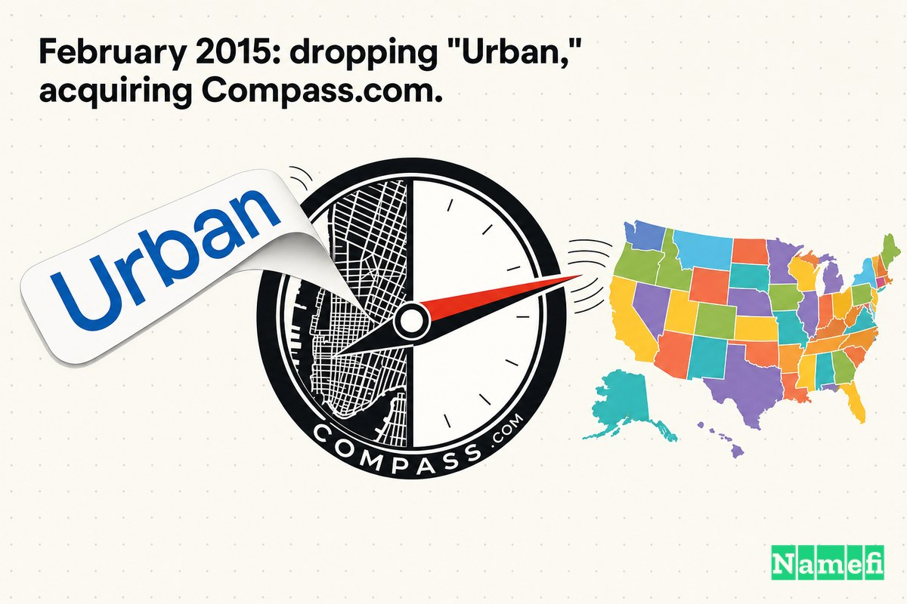
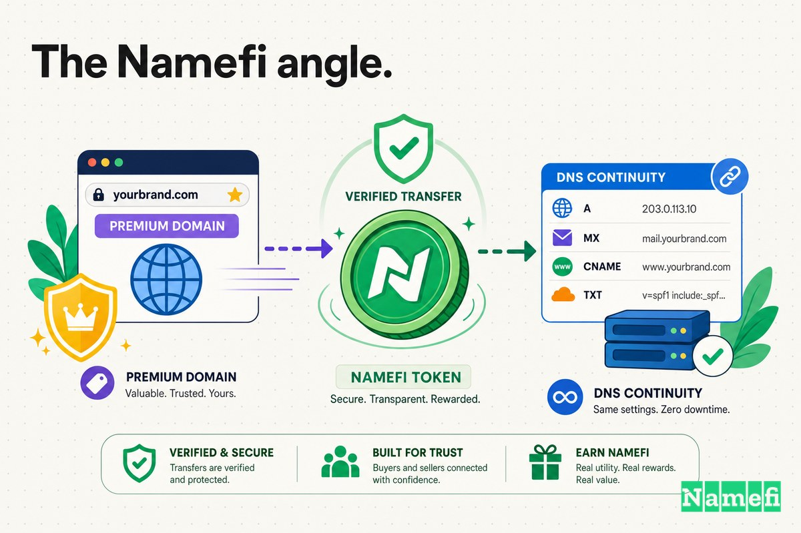

Antes de que Compass se convirtiera en la mayor agencia inmobiliaria residencial de los Estados Unidos, era algo más literal y local: **UrbanCompass.com**, una aplicación para encontrar apartamentos en alquiler en la ciudad de Nueva York.

El nombre original tenía sentido. Cuando Robert Reffkin y Ori Allon crearon el servicio, este hacía una sola cosa muy específica en un lugar muy delimitado. The Daily Beast describió el producto en sus inicios como un servicio que [se lanzó en versión beta el 7 de mayo con el respaldo del alcalde Michael Bloomberg](https://www.thedailybeast.com/start-up-urban-compass-aims-to-drive-apartment-rental-online/#:~:text=launched%20in%20beta%20on%20May%207), ofreciendo una base de datos exhaustiva de alquileres disponibles e información sobre los vecindarios circundantes. El mapa de cobertura era pequeño al principio: [Manhattan y partes de Brooklyn, con más vecindarios de Nueva York por venir más adelante](https://www.thedailybeast.com/start-up-urban-compass-aims-to-drive-apartment-rental-online/#:~:text=Manhattan%20and%20parts%20of%20Brooklyn). La palabra "Urban" (Urbano) te decía exactamente lo que estabas obteniendo: una herramienta de ciudad, para inquilinos de la ciudad.

Para esa primera audiencia, UrbanCompass.com era claro. Explicaba el producto.

Pero la palabra que los fundadores eligieron para anclar su marca fue la misma que finalmente la limitaría. "Urban" significaba *ciudad*. Y una empresa que quería vender casas desde Manhattan hasta Miami, pasando por los suburbios de Texas, no podía seguir siendo una herramienta urbana para siempre.

Así que, en febrero de 2015, Urban Compass hizo dos cosas a la vez: eliminó "Urban" de su nombre y se actualizó al dominio de coincidencia exacta que lo acompañaría en su lanzamiento nacional: **Compass.com**, una dirección que había sido [listada en una subasta en 2013 por 1 millón de dólares estadounidenses](https://smartbranding.com/urbancompass-com-rebrands-to-compass-com/#:~:text=Compass.com%20was%20listed%20in%20an%20auction%20back%20in%202013%20for%20US%24%201%20Million).

## 2012–2014: el "Urban" que hizo el trabajo duro

Al principio, "Urban" era una característica a favor, no un defecto.

La empresa se constituyó en la ciudad de Nueva York en el otoño de 2012. Según Wikipedia, [Compass fue fundada por Ori Allon, Robert Reffkin y Avi Dorfman como Urban Compass, Inc. en la ciudad de Nueva York en octubre de 2012](https://en.wikipedia.org/wiki/Compass,_Inc.#:~:text=founded%20by%20Ori%20Allon). La oficina de emprendimiento de Columbia, donde Reffkin obtuvo dos títulos, contó la misma historia: [Robert Reffkin '00CC, '03BUS fundó Urban Compass con su viejo amigo Ori Allon en octubre de 2012](https://entrepreneurship.columbia.edu/startup/urban-compass/#:~:text=founded%20Urban%20Compass%20with%20his%20long%2Dtime%20friend%20Ori%20Allon%20in%20October%202012).

La dupla era inusual. Reffkin era un [ex ejecutivo de Goldman Sachs](https://www.thedailybeast.com/start-up-urban-compass-aims-to-drive-apartment-rental-online/#:~:text=former%20Goldman%20Sachs%20executive); Allon era un tecnólogo con un historial excepcional de venta de empresas a los nombres más grandes de la tecnología. Allon había escrito el algoritmo de búsqueda que Google compró, y luego construyó una startup de búsqueda social que Twitter adquirió — [contratar a Allon fue parte del trato, y trabajó como director de ingeniería en la oficina de Twitter en Nueva York](https://intheblack.cpaaustralia.com.au/people/ori-allon-the-digital-wizard-who-changed-google-and-twitter/#:~:text=Hiring%20Allon%20was%20part%20of%20the%20deal). Juntos, como lo expresó Columbia, la empresa combinó [la experiencia empresarial de Robert y la formación tecnológica de Ori para ayudar a las personas a encontrar un excelente lugar para vivir](https://entrepreneurship.columbia.edu/startup/urban-compass/#:~:text=Robert%27s%20business%20experience%20and%20Ori%27s%20technology%20background).

Una empresa totalmente nueva que pedía a los neoyorquinos que confiaran en una aplicación para una de las transacciones más estresantes del año necesitaba todas las señales de credibilidad local que pudiera conseguir. "Urban Compass" se las dio. El nombre decía: esto está construido para *tu* ciudad, por personas que entienden *tus* vecindarios. El producto coincidía palabra por palabra con el nombre: una base de datos de alquileres en la ciudad con guías locales integradas.

Pero la ambición ya era más amplia que el nombre. Los fundadores no intentaban construir una búsqueda de alquileres ligeramente mejor para Manhattan. Y el propio modelo estaba cambiando rápidamente: según Wikipedia, [en enero de 2014, Compass anunció que cambiaría su modelo de negocio general al contratar agentes inmobiliarios independientes, recibiendo una parte de la comisión del corredor](https://en.wikipedia.org/wiki/Compass,_Inc.#:~:text=In%20January%202014%2C%20Compass%20announced). El giro de los alquileres a las ventas residenciales llevó a la empresa directamente hacia los límites de su propio nombre. Como lo expresó Reffkin más tarde, [me di cuenta de que los alquileres eran algo muy específico de la ciudad de Nueva York](https://daltxrealestate.com/meet-robert-reffkin-ceo-compass-real-estate-super-millennial/#:~:text=I%20realized%20rentals%20were%20pretty%20specific%20to%20New%20York%20City).

UrbanCompass.com era el dominio adecuado para la primera etapa. Pero era el dominio equivocado para la empresa que se gestaba debajo.

## Febrero de 2015: eliminando "Urban", adquiriendo Compass.com

El rebranding fue deliberado y unió el cambio de nombre y el cambio de dominio en un solo movimiento.

Smart Branding documentó la actualización con claridad: [En febrero de 2015, la marca actualizó su nombre de dominio de UrbanCompass.com al EBM (Exact Brand Match, o coincidencia exacta de marca) Compass.com](https://smartbranding.com/urbancompass-com-rebrands-to-compass-com/#:~:text=In%20February%202015%2C%20the%20brand%20upgraded%20its%20domain%20name%20from%20UrbanCompass.com). El propio liderazgo de marketing de la empresa justificó la lógica en términos de alcance y memorabilidad. Como explicó Matt Spangler, entonces Director de Marketing y Creatividad de Compass: [Compass es un nombre de marca más simple y universalmente memorable que habla directamente de la conexión entre las personas y la tecnología, la cual es tan central para lo que estamos construyendo](https://smartbranding.com/urbancompass-com-rebrands-to-compass-com/#:~:text=Compass%20is%20a%20simpler%2C%20more%20universally%20memorable%20brand%20name).

Lee esa cita con atención. La palabra que hace el trabajo pesado es *universalmente*. "Urban Compass" era una marca de Nueva York. "Compass" era una marca que podía apuntar a cualquier lugar.

## El dominio que ya tenía precio antes de que Compass lo necesitara

Una vez que el nombre pasó a ser "Compass", la dirección obvia era Compass.com. Pero ese dominio no era de los que se descartan fácilmente. Los sustantivos comunes de una sola palabra en inglés son parte de los bienes raíces más disputados en Internet, y "compass" (brújula) —una palabra relacionada con la dirección, la navegación y encontrar tu camino— es un sustantivo tan acorde a la marca como una empresa inmobiliaria podría pedir.

El mercado ya le había puesto una cifra. Antes de que Compass siquiera necesitara el nombre, [Compass.com fue listado en una subasta en 2013 por 1 millón de dólares estadounidenses](https://smartbranding.com/urbancompass-com-rebrands-to-compass-com/#:~:text=Compass.com%20was%20listed%20in%20an%20auction%20back%20in%202013%20for%20US%24%201%20Million). Lo que Compass pagó realmente se mantuvo a puerta cerrada. Como señaló Smart Branding, [la transacción fue privada, por lo que no conocemos la inversión realizada para asegurar el nombre de dominio coincidente](https://smartbranding.com/urbancompass-com-rebrands-to-compass-com/#:~:text=The%20transaction%20was%20private).

Ese hermetismo es en sí mismo la norma para los acuerdos de dominios .com premium de una sola palabra. El listado de subasta de siete cifras es el piso público; el precio de cierre es un número que ambas partes generalmente acuerdan mantener en secreto. De cualquier manera, la señal es clara: eliminar "Urban" no fue gratis. La versión de coincidencia exacta del nombre costó dinero real, porque la palabra "Compass" era valiosa para el mundo mucho antes de ser valiosa para esta empresa.

## El dinero se veía diferente en aquel entonces

Es tentador juzgar la compra de un dominio desde el final de la historia, donde Compass es un nombre familiar y una URL de siete cifras parece un error de redondeo. Pero a principios de 2015, las matemáticas se veían diferentes.

En ese momento, Compass era una joven agencia respaldada por capital de riesgo que acababa de cambiar su modelo de negocio y estaba a punto de apostarlo todo a dejar la única ciudad que entendía. Estaba gastando en ingenieros, en reclutar agentes, en abrir oficinas en nuevos mercados. En ese contexto, invertir (muy plausiblemente) siete cifras en un *nombre de dominio* —no en tecnología, no en reclutamiento de agentes, no en una nueva oficina— era el tipo de partida presupuestaria que un equipo financiero cuestionaría.

La decisión solo tiene sentido si tratas el dominio como infraestructura en lugar de decoración. Compass estaba a punto de pedirle al país entero —no solo a Nueva York— que recordara su nombre. Cada letrero en los jardines, cada firma de correo electrónico de los agentes, cada página de listados, cada mención en la prensa en un nuevo mercado iba a llevar su dirección web. Pagar para que esa dirección fuera la versión limpia, universal y de coincidencia exacta de la marca fue una apuesta a que el nombre se repetiría millones de veces en todo el país, y que cada repetición debía aterrizar en Compass.com, no en UrbanCompass.com.

## Por qué fue importante eliminar "Urban"

La brecha entre UrbanCompass.com y Compass.com es de una sola palabra. Estratégicamente, es la diferencia entre una ciudad y un país.

**UrbanCompass.com** describe algo que ya conoces: una herramienta para navegar por los bienes raíces *urbanos*. **Compass.com** nombra algo sin techo: una marca que podría abrir oficinas en los suburbios, en el Cinturón del Sol (Sun Belt), en mercados de playas de lujo, en cualquier lugar donde la gente compre y venda casas, sea urbano o no. Una palabra te ata a la ciudad. La otra te permite convertirte en la categoría.

| Antes | Después |
| --- | --- |
| UrbanCompass.com | Compass.com |
| Nombra una herramienta de alquileres en la ciudad | Nombra una agencia inmobiliaria sin techo |
| Anclada a mercados "urbanos" | Viaja tanto a suburbios, como al Sun Belt o mercados de lujo |
| Se lee como un producto de Nueva York | Se lee como una marca nacional |
| Añade una palabra a cada mención | Reduce la marca a una sola palabra universal |

Este es el mismo patrón que aparece una y otra vez en las actualizaciones de dominios: los nombres iniciales *explican*, los grandes nombres *poseen*. La versión descriptiva ayuda mientras una empresa todavía tiene que explicarte qué hace y dónde lo hace. La versión de coincidencia exacta ayuda una vez que la empresa está lista para *ser* la opción a la que la gente acude por defecto en cualquier lugar. Eliminar "Urban" no solo acortó el nombre; eliminó el límite geográfico que llevaba implícito. Una agencia nacional no puede vivir en un dominio que dice "ciudad".

## Febrero de 2015: el cambio de nombre que apuntaba a un mapa

El orden de los acontecimientos es lo que hace que este caso sea instructivo. El rebranding no fue una tarea cosmética de limpieza; fue el pistoletazo de salida para la expansión nacional.

Cuando Urban Compass se convirtió en Compass en febrero de 2015, lo hizo explícitamente para deshacerse de un nombre que la encasillaba en núcleos urbanos densos. La nueva identidad llegó junto con los primeros movimientos de la empresa fuera de Nueva York, hacia mercados como Washington, D.C. —el comienzo de un despliegue que finalmente llevaría a Compass a cientos de ciudades y, una década después, la convertiría en una de las agencias inmobiliarias más grandes del país. El nombre y el dominio tenían que cambiar *antes* de que el mapa pudiera hacerlo.

Observa la dependencia. Compass no podía comercializarse de manera creíble como una marca nacional mientras su sitio web vivía en UrbanCompass.com. La marca, el logotipo y el dominio tenían que moverse juntos, y la pieza sobre la que Compass tenía menos control era el dominio, porque alguien más era dueño de Compass.com y el mercado ya lo había valorado en un millón de dólares. Asegurar el nombre de coincidencia exacta fue lo que hizo que la palabra "nacional" sonara real en lugar de aspiracional.

Imagina la alternativa: una empresa diciendo a agentes y vendedores en Texas o Florida que es una agencia inmobiliaria de alcance nacional, mientras sigue enviándolos a un sitio web que incluye la palabra "Urban". El desajuste habría socavado todo el propósito del rebranding. El dominio no era un adorno decorativo para la nueva estrategia. Era el pilar estructural que la sostenía.

## El dominio se convirtió en parte del sistema operativo

Los dominios premium no se tratan de prestigio. Se tratan de repetición.

El dominio principal de una marca de bienes raíces aparece en lugares que el equipo de marketing nunca controla directamente:

- En cada letrero de "Se vende" en cada mercado nuevo.
- En la dirección de correo electrónico y tarjeta de presentación de cada agente.
- En las páginas de listados, resultados de búsqueda y distribución en portales como Zillow.
- En los titulares de prensa a medida que la empresa entra en cada nueva ciudad.
- En cada recomendación de boca en boca —"Puse mi casa a la venta con Compass"— que pasa de un vecino a otro.

Cada una de esas repeticiones añade fricción o la elimina. UrbanCompass.com hacía que cada mención fuera más larga, más atada a la ciudad, más evidentemente algo de Nueva York. Compass.com hizo que cada mención fuera más corta, más limpia y sin barreras geográficas. Multiplica eso por miles de agentes, cientos de mercados y una agencia que se convirtió en una de las más grandes del país, y un dominio de siete cifras deja de parecer un lujo para empezar a verse como la pieza de infraestructura nacional más barata que la empresa haya comprado jamás.

El dominio no construyó la marca de Compass. Pero una vez que Compass.com se convirtió en la dirección, cada repetición futura del nombre se consolidó sobre una base más limpia: una que no requería explicar qué hacía la palabra "Urban" en un mercado suburbano.

## Lo que los fundadores deberían aprender del Caso 8

La conclusión fácil —"elimina la palabra descriptiva y compra tu .com de coincidencia exacta"— es demasiado tosca. Las lecciones más útiles tratan sobre *qué* palabra, *cuándo* y *cuánto cuesta*:

1. **Un dominio descriptivo está bien para empezar.** UrbanCompass.com hizo un trabajo real: logró que una empresa totalmente nueva se sintiera local y confiable para los nerviosos inquilinos de Nueva York. Un modificador como "Urban", "App" o "HQ" es una rampa de acceso razonable, no un fracaso.
2. **Presta atención al momento en que el modificador se convierte en un techo.** Para Compass, la señal fue geográfica. En el instante en que la estrategia se volvió nacional, la palabra "Urban" dejó de describir a la empresa y comenzó a encogerla. Cuando tu nombre describe un territorio más pequeño que al que te estás expandiendo, la actualización es urgente.
3. **Espera que el nombre de coincidencia exacta tenga un precio de mercado.** Los dominios .com comunes de una sola palabra, como Compass.com, no están libres y disponibles sin más. Este fue [listado en una subasta por 1 millón de dólares](https://smartbranding.com/urbancompass-com-rebrands-to-compass-com/#:~:text=Compass.com%20was%20listed%20in%20an%20auction%20back%20in%202013%20for%20US%24%201%20Million) antes de que Compass siquiera lo necesitara. Elabora un presupuesto para el dominio de la misma manera que presupuestarías para cualquier activo estratégico que otra persona ya controle.
4. **Asegura el dominio antes de la expansión, no después.** El cambio de nombre y la migración a Compass.com se dieron *primero*; luego vino el despliegue nacional. El activo lento, caro y en manos de terceros —el dominio— tenía que estar asegurado para que la nueva estrategia tuviera sentido.

La actualización del dominio no hizo que Compass triunfara. El producto, el capital, el reclutamiento de agentes, el momento (timing) y la ejecución importaron mucho más. Pero Compass.com hizo que la reinvención de la empresa —de una aplicación de alquileres en Nueva York a una agencia nacional— fuera *nombrable*, y tuvo que asegurarse en el preciso instante en que "Urban" pasó de ser un activo a ser una barrera.

## El enfoque Namefi

Este caso es, en su esencia, un problema de transferencia de activos disfrazado de branding.

La decisión estratégica nunca estuvo realmente en duda: por supuesto que una empresa que se expande a nivel nacional debería abandonar la palabra "Urban" y apropiarse de Compass.com. Lo difícil fue todo lo que rodeaba al activo: encontrar términos con el propietario de un dominio .com de un millón de dólares y de una sola palabra, acordar un precio sin datos comparables públicos, cerrar el trato bajo un acuerdo de confidencialidad tan estricto que el mundo todavía no sabe cuánto se pagó, transferir el control de manera limpia y sincronizarlo todo para que coincidiera con un rebranding coordinado. Incluso años después, la pregunta más básica sobre el acuerdo —cuánto costó— sigue siendo privada, exactamente el tipo de opacidad que rodea a la mayoría de las transferencias de dominios premium de una sola palabra.

[Namefi](https://namefi.io) está construido sobre la idea de que los dominios deberían comportarse como activos nativos de Internet. La propiedad tokenizada puede hacer que el control de dominios sea más fácil de verificar, transferir e integrar en flujos de trabajo modernos, manteniéndose compatible con el DNS. Esto convierte las partes más complicadas de un acuerdo como este (demostrar quién es el propietario de qué, acordar el valor y moverlo de forma segura) en algo más parecido a una transacción limpia y auditable. Un futuro donde a un .com de una sola palabra se le pueda asignar un precio, colocarse en custodia (escrow) y transferirse sin generar un rastro de papel privado de varios años de duración, resolvería exactamente el tipo de fricción que en este caso costó dinero real superar.

Compass.com parece inevitable ahora porque Compass se volvió enorme. Pero la lección se aplica mucho antes de llegar a esa escala: cuando un nombre va a llevar a la empresa a lo largo de todo un país —y especialmente cuando el nombre antiguo te encierra silenciosamente en una sola ciudad—, el dominio no es una decoración. Es la parte de la marca por la que vale la pena pagar siete cifras para acertar.

## Fuentes y lectura adicional

- Wikipedia — [Compass, Inc.](https://en.wikipedia.org/wiki/Compass,_Inc.#:~:text=founded%20by%20Ori%20Allon)
- Smart Branding — [UrbanCompass.com Upgrades to Compass.com](https://smartbranding.com/urbancompass-com-rebrands-to-compass-com/#:~:text=In%20February%202015%2C%20the%20brand%20upgraded%20its%20domain%20name%20from%20UrbanCompass.com)
- The Daily Beast — [Start-up Urban Compass Aims to Drive Apartment Rental Online](https://www.thedailybeast.com/start-up-urban-compass-aims-to-drive-apartment-rental-online/#:~:text=launched%20in%20beta%20on%20May%207)
- Columbia Entrepreneurship — [Urban Compass](https://entrepreneurship.columbia.edu/startup/urban-compass/#:~:text=founded%20Urban%20Compass%20with%20his%20long%2Dtime%20friend%20Ori%20Allon%20in%20October%202012)
- INTHEBLACK (CPA Australia) — [Ori Allon: the digital wizard who changed Google and Twitter](https://intheblack.cpaaustralia.com.au/people/ori-allon-the-digital-wizard-who-changed-google-and-twitter/#:~:text=Hiring%20Allon%20was%20part%20of%20the%20deal)
- DALTX Real Estate (CandysDirt) — [Meet Robert Reffkin, CEO of Compass Real Estate and Super Millennial](https://daltxrealestate.com/meet-robert-reffkin-ceo-compass-real-estate-super-millennial/#:~:text=I%20realized%20rentals%20were%20pretty%20specific%20to%20New%20York%20City)