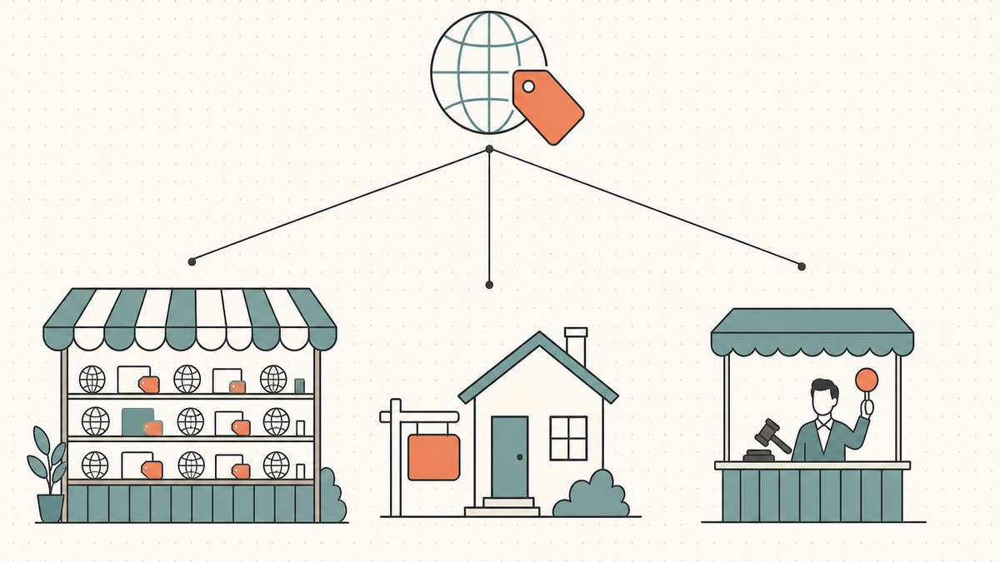
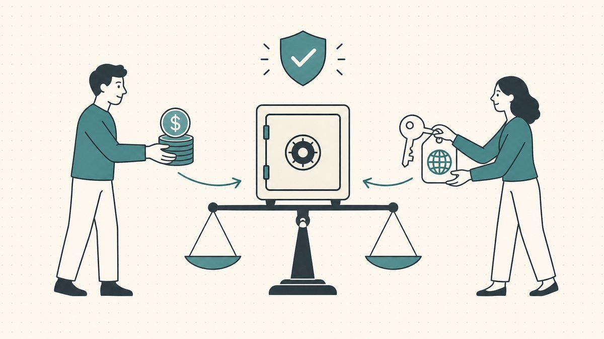

Un dominio que no puedes vender es solo una factura de renovación con un nombre ingenioso. Comprar bien y valorar con honestidad son habilidades previas; esta es donde el dinero realmente llega. La mayor parte de las ganancias en la reventa de dominios se hace o se pierde en la etapa de venta, porque un nombre mediocre bien vendido supera a un gran nombre que nadie puede encontrar. Este es el pilar de venta de nuestra guía sobre [la reventa de dominios (domain flipping)](/es/blog/domain-flipping/), el arco completo desde "soy dueño de este nombre" hasta "los fondos se han liquidado". Cubriremos las dos formas en que los compradores te contactan, cómo establecer un formato de precio, dónde publicar, cuándo un bróker se gana su comisión y cómo cerrar el trato sin ser estafado. Para una lista de verificación paso a paso de una venta individual, combina esta guía con [cómo vender un nombre de dominio que posees](/es/blog/how-to-sell-a-domain-name-you-own/).

## Entrante vs. saliente: los dos caminos hacia un comprador

Toda venta de dominio comienza de una de dos maneras, y saber en qué juego estás participando lo cambia todo a partir de ese momento.

**Ventas entrantes (Inbound)** significa que haces que el nombre sea fácil de encontrar y esperas a que el comprador venga a ti. Una página de destino de "en venta", una publicación en un mercado, un precio visible para cualquiera que escriba el nombre en su navegador. Las ventas entrantes son pasivas, de mayor margen y lentas. El comprador llega ya queriendo el nombre, lo que significa que llega dispuesto a pagar un precio de [usuario final](/es/glossary/end-user/), pero no tienes control sobre *cuándo* sucederá, y la mayoría de los nombres nunca reciben esa llamada.

**Ventas salientes (Outbound)** significa que tú encuentras al comprador y lo contactas primero. Identificas una empresa que se beneficiaría obviamente del nombre, escribes a la persona adecuada e inicias la conversación. El método saliente es activo, más rápido cuando funciona y más difícil de hacer bien. El riesgo es que un contacto en frío con el titular de una [marca registrada](/es/glossary/trademark/) parezca una extorsión, y un contacto torpe a una lista de correo parezca spam. La habilidad está en la precisión: un mensaje bien investigado a un comprador con una necesidad real supera mil envíos masivos.

Los vendedores serios aplican ambas estrategias. Las ventas entrantes capturan a los compradores que ya saben que quieren el nombre; las salientes crean una demanda que nunca habría surgido por sí sola. Comparamos ambos enfoques en profundidad en [ventas de dominios entrantes vs. salientes](/es/blog/inbound-vs-outbound-domain-sales/).

## Establece el formato del precio antes que el precio mismo

Antes de discutir contigo mismo sobre la cifra, decide cómo se presenta esa cifra, porque el formato moldea quién interactúa y cómo se desarrolla la negociación.

- **Comprar ahora (Buy It Now)** pone un precio fijo al nombre. Elimina la fricción, permite que un comprador motivado realice la transacción al instante y transmite confianza. El costo es que limitas tu potencial de ganancia: si fijas el precio de un nombre en $2,000 y un usuario final habría pagado $20,000, el precio fijo deja dinero sobre la mesa.
- **Hacer oferta (Make Offer)** invita a la negociación y revela la intención del comprador. Puede capturar un precio de usuario final que nunca habrías imaginado, pero añade fricción, atrae a ofertantes a la baja y estanca los tratos mientras vas y vienes en la conversación.

No hay una respuesta universalmente correcta; la elección depende del nombre, de tu paciencia y de si buscas volumen o una única gran venta. La fijación de precios también tiene una capa psicológica: el anclaje, los números redondos, la señal que un precio envía sobre quién crees que es el comprador. Desglosamos eso en [la psicología de los precios de dominios: comprar ahora vs. hacer oferta](/es/blog/domain-pricing-psychology-buy-now-vs-make-offer/). Sea cual sea tu elección, recuerda el [diferencial entre usuario final y revendedor](/es/blog/how-to-value-a-domain-name/): el precio que un colega inversor paga por inventario es una fracción de lo que pagará la empresa que *usará* el nombre, y tu formato debe coincidir con el comprador que realmente intentas alcanzar.

## Dónde vender: mercados, estacionamiento y tu propia página

La demanda entrante tiene que aterrizar en algún lugar. El [mercado secundario](/es/glossary/aftermarket/) de dominios existe precisamente para esto. Wikipedia lo define como [el mercado secundario de reventa de nombres de dominio de Internet en el que una parte interesada en adquirir un dominio que ya está registrado ofrece o negocia un precio](https://en.wikipedia.org/wiki/Domain_aftermarket#:~:text=the%20secondary%20resale%20market%20for%20Internet%20domain%20names) para efectuar la transferencia. Es un mercado real y activo: según Wikipedia, [de acuerdo con NameBio, se registraron 144,700 ventas de nombres de dominio por un total de 185 millones de dólares estadounidenses en 2024](https://en.wikipedia.org/wiki/Domain_aftermarket#:~:text=According%20to%20NameBio%2C%20144%2C700%20domain%20name%20sales%20totaling%20US%24185%20million%20were%20recorded%20in%202024), y eso es solo la porción divulgada.

Tus principales lugares de venta:

- **Mercados de reventa (Aftermarket marketplaces).** Estos conectan a compradores y vendedores y se encargan de la infraestructura de la transacción. Wikipedia señala que las transacciones del mercado secundario [son facilitadas por plataformas como Afternic y Sedo](https://en.wikipedia.org/wiki/Domain_aftermarket#:~:text=Transactions%20are%20facilitated%20by%20aftermarket%20platforms%20such%20as%20Afternic%20and%20Sedo), que [proporcionan métodos de comunicación para que compradores y vendedores interactúen, a menudo de forma anónima, para negociar y cerrar una transacción](https://en.wikipedia.org/wiki/Domain_aftermarket#:~:text=provide%20communication%20methods%20for%20buyers%20and%20sellers). Sedo es, en palabras de Wikipedia, [una empresa estadounidense del mercado secundario de dominios](https://en.wikipedia.org/wiki/Sedo#:~:text=an%20American%20domain%20aftermarket%20company). Los mercados te dan alcance y confianza incorporada a cambio de una comisión.
- **Una página de destino de "en venta".** Estacionar el nombre en una página que dice "este dominio está en venta" captura al comprador entrante más valioso de todos: la persona que escribió el nombre directamente porque ya estaba pensando en él.
- **Subastas.** Para nombres con interés competitivo, un formato de [subasta](/es/glossary/auction/) puede llevar el precio más allá de cualquier cifra fija que te hubieras atrevido a establecer.

Cada lugar de venta ofrece un equilibrio diferente entre alcance, comisiones y control. Comparamos los principales en [dónde vender dominios: comparación de mercados](/es/blog/where-to-sell-domains-marketplaces-compared/). Dondequiera que publiques tu dominio, la publicación vive en la capa más amplia del [mercado](/es/glossary/marketplace/) del [comercio de dominios](/es/glossary/domain-trading/), y los mismos fundamentos de [cómo valorar un nombre de dominio](/es/blog/how-to-value-a-domain-name/) deciden si alguien muestra interés.

## Cuándo recurrir a un bróker

Para nombres de alto valor (de cinco cifras en adelante, o un solo nombre estratégico con un comprador obvio), un bróker puede valer su comisión. Un buen bróker aporta relaciones con compradores, distancia en la negociación (el comprador nunca sabe cuánto deseas la venta) y la discreción para acercarse a una gran empresa sin revelar tus intenciones. También evitan que un trato se caiga por las partes incómodas: anclaje de precios, logística del escrow y la entrega.

La contrapartida es la comisión, generalmente un porcentaje significativo de la venta, y la pérdida de control directo. Los brókeres se ganan su sueldo con nombres donde el grupo de compradores es pequeño y las apuestas son altas, no en una reventa de $300 que podrías publicar tú mismo en cinco minutos. Cubrimos cómo elegir uno y qué esperar en [trabajar con brókeres de dominios](/es/blog/working-with-domain-brokers/).

## Cerrar el trato sin ser estafado

Esta es la etapa donde hay dinero real sobre la mesa y la confianza es mínima. El punto muerto clásico: el vendedor no quiere transferir el nombre antes de recibir el pago, y el comprador no quiere pagar antes de recibir el nombre. Ninguno quiere dar el primer paso.

La respuesta estándar es el escrow: un tercero neutral que retiene el dinero hasta que el nombre cambia de manos. Wikipedia define el escrow como [un acuerdo contractual en el que un tercero ... recibe y desembolsa dinero o propiedad para las partes principales de la transacción, dependiendo el desembolso de las condiciones acordadas por las partes](https://en.wikipedia.org/wiki/Escrow#:~:text=a%20contractual%20arrangement%20in%20which%20a%20third%20party). En una transacción de dominio, el comprador financia el escrow, el vendedor transfiere el nombre, el agente de escrow confirma la transferencia y solo entonces se libera el dinero. Explicamos el mecanismo completo en [explicación del escrow de dominios](/es/blog/domain-escrow-explained/) y en la [entrada del glosario sobre escrow](/es/glossary/escrow/).

La transferencia en sí tiene una mecánica que vale la pena conocer antes de prometerle algo a un comprador. Una transferencia de nombre de dominio es, según Wikipedia, [el proceso de cambiar el registrador designado de un nombre de dominio](https://en.wikipedia.org/wiki/Domain_name_transfer#:~:text=the%20process%20of%20changing%20the%20designated%20registrar%20of%20a%20domain%20name). Para mover un nombre entre registradores, el nuevo [registrador](/es/glossary/registrar/) del comprador necesita un [código de autenticación](https://en.wikipedia.org/wiki/Domain_name_transfer#:~:text=supplies%20the%20authentication%20code), el código de autorización o [código EPP](/es/glossary/auth-code/) que el vendedor entrega. Y hay una trampa de tiempo: según Wikipedia, [después de la transferencia, el dominio no puede volver a transferirse durante 60 días](https://en.wikipedia.org/wiki/Domain_name_transfer#:~:text=after%20transfer%2C%20the%20domain%20cannot%20be%20transferred%20again%20for%2060%20days), excepto de vuelta al registrador anterior. Si recientemente moviste un nombre tú mismo, es posible que no puedas transferirlo a un comprador de inmediato, así que verifica el bloqueo antes de comprometerte a una fecha. Para un mapa más profundo de cómo las transferencias salen mal a propósito, nuestro artículo sobre [cómo ocurre realmente el secuestro de dominios](/es/blog/how-domain-hijacking-actually-happens/) es una lectura de advertencia.

Algunos puntos no negociables al cerrar: usa escrow para cualquier cantidad que no sea trivial, verifica que el pago del comprador se haya liquidado realmente (no "pendiente") antes de liberar el código de autorización, y mantén intacta la continuidad del [WHOIS](/es/glossary/whois/) y el DNS para que el nombre siga resolviendo durante la entrega. Nunca cedas el control a cambio de una promesa.

## No vendas un nombre que no puedas vender legalmente

Una advertencia final que pertenece antes, no después, de la venta. Vender un nombre genérico, descriptivo o inventado es un negocio normal. Vender un nombre que se aprovecha de la marca registrada de otra persona no lo es, y te lo pueden quitar bajo la [UDRP](/es/glossary/udrp/) de la [ICANN](/es/glossary/icann/). El titular de una marca registrada puede ganar demostrando, como resume Wikipedia, que [el nombre de dominio es idéntico o confusamente similar a una marca registrada o de servicio en la que el demandante tiene derechos](https://en.wikipedia.org/wiki/Uniform_Domain-Name_Dispute-Resolution_Policy#:~:text=identical%20or%20confusingly%20similar%20to%20a%20trademark%20or%20service%20mark), que no tienes un interés legítimo en él y que fue registrado y utilizado de [mala fe](/es/glossary/bad-faith/); y el panel puede ordenar la entrega del nombre. La lección para los vendedores es simple: la prospección saliente al titular de una marca para un nombre que imita su marca no es un argumento de venta, es una prueba. Vende los nombres que tienes claro derecho a vender. Para el marco completo, consulta [qué es la UDRP](/es/blog/what-is-udrp/).

## Una nota realista sobre las cifras

Las ventas que acaparan titulares son reales pero raras. El récord verificado de una venta divulgada públicamente es Voice.com, que la lista de Wikipedia registra como vendido en [2019 por $30,000,000](https://en.wikipedia.org/wiki/List_of_most_expensive_domain_names#:~:text=Voice.com), superando la venta de Sex.com en [2010 por $13,000,000](https://en.wikipedia.org/wiki/List_of_most_expensive_domain_names#:~:text=Sex.com). Ten en cuenta la letra pequeña: esa lista se [limita a ventas de nombres de dominio puros y solo en efectivo](https://en.wikipedia.org/wiki/List_of_most_expensive_domain_names#:~:text=limited%20to%20pure%20domain%20name%20and%20cash%2Donly%20sales), contando solo tratos de $3 millones o más. Esos son `.com`s de diccionario vendidos a compradores con una necesidad existencial, no un modelo de negocio.

Para el resto de nosotros, vender es un juego de porcentajes. Como regla general de la industria (una estimación, no una estadística medida), la proporción de una cartera registrada a mano que se vende en un año determinado es baja, a menudo en un porcentaje de un solo dígito bajo. La matemática funciona porque el *precio* de la venta rara está muy sesgado: un buen trato de cuatro o cinco cifras financia las renovaciones de muchos nombres que no van a ninguna parte. Es por eso que la disciplina de venta (el formato correcto, el lugar correcto, un contacto limpio, un cierre seguro) es la palanca que realmente mueve tus rendimientos. Valorar la versión [`.com`](/es/tld/com/) frente a la [`.io`](/es/tld/io/), [`.ai`](/es/tld/ai/) o [`.co`](/es/tld/co/) de la misma palabra, y saber a qué comprador le estás vendiendo, es la diferencia entre una publicación y una venta.

## La perspectiva de Namefi

La mayor parte de esta guía trata sobre *encontrar* al comprador. La otra mitad de cada venta es *entregar* el activo, y ahí es donde los tratos de alto valor se vuelven tensos: el punto muerto de "el vendedor transfiere primero" contra "el comprador paga primero" que el escrow existe para resolver. [Namefi](https://namefi.io) está diseñado para reducir esa brecha: la propiedad tokenizada facilita la verificación y transferencia del control de un dominio real de la ICANN, con continuidad del DNS para que el nombre siga resolviendo sin problemas durante la entrega, y Namefi Outbound ayuda a encontrar y contactar a los compradores que realmente querrían un nombre. Para un vendedor, menos fricción en la liquidación significa más tratos que se cierran sobre nombres cuya propiedad es auditable en lugar de aceptada por confianza. Si tienes curiosidad sobre hacia dónde se dirige toda la industria, consulta [cómo los mercados tokenizados reemplazan al escrow](/es/blog/how-tokenized-marketplaces-replace-escrow/).

## Descargo de responsabilidad amigable (¡Léeme!)

> No somos abogados, contadores, asesores financieros ni médicos, y **nada en este artículo constituye asesoramiento legal, financiero, fiscal, contable, médico o de cualquier otro tipo profesional.** Escribimos estas publicaciones para educarnos a nosotros mismos y como una conveniencia para nuestros clientes. La información aquí puede estar desactualizada, ser específica de una geografía o simplemente incorrecta. Nosotros también cometemos errores.
>
> Para cualquier decisión importante, **por favor, consulta a un profesional de verdad (¡en serio!)**. O si no es tu estilo, pregunta a un amigo, a Twitter, a Reddit, a una IA o a un vidente. En resumen: **DOYR - Haz tu propia investigación**. Aprendamos y divirtámonos.

## Fuentes y lecturas adicionales

- Wikipedia — [Domain aftermarket](https://en.wikipedia.org/wiki/Domain_aftermarket#:~:text=the%20secondary%20resale%20market%20for%20Internet%20domain%20names) (definición; volumen de ventas de NameBio en 2024; Afternic y Sedo como facilitadores)
- Wikipedia — [Sedo](https://en.wikipedia.org/wiki/Sedo#:~:text=an%20American%20domain%20aftermarket%20company) (empresa estadounidense del mercado secundario de dominios)
- Wikipedia — [Escrow](https://en.wikipedia.org/wiki/Escrow#:~:text=a%20contractual%20arrangement%20in%20which%20a%20third%20party) (definición de escrow)
- Wikipedia — [Domain name transfer](https://en.wikipedia.org/wiki/Domain_name_transfer#:~:text=the%20process%20of%20changing%20the%20designated%20registrar%20of%20a%20domain%20name) (proceso de transferencia, código de autenticación/EPP, bloqueo de re-transferencia de 60 días)
- Wikipedia — [Uniform Domain-Name Dispute-Resolution Policy](https://en.wikipedia.org/wiki/Uniform_Domain-Name_Dispute-Resolution_Policy#:~:text=identical%20or%20confusingly%20similar%20to%20a%20trademark%20or%20service%20mark) (los tres elementos de una reclamación UDRP)
- Wikipedia — [List of most expensive domain names](https://en.wikipedia.org/wiki/List_of_most_expensive_domain_names#:~:text=Voice.com) (Voice.com $30M/2019, Sex.com $13M/2010; alcance de solo efectivo de más de $3M)