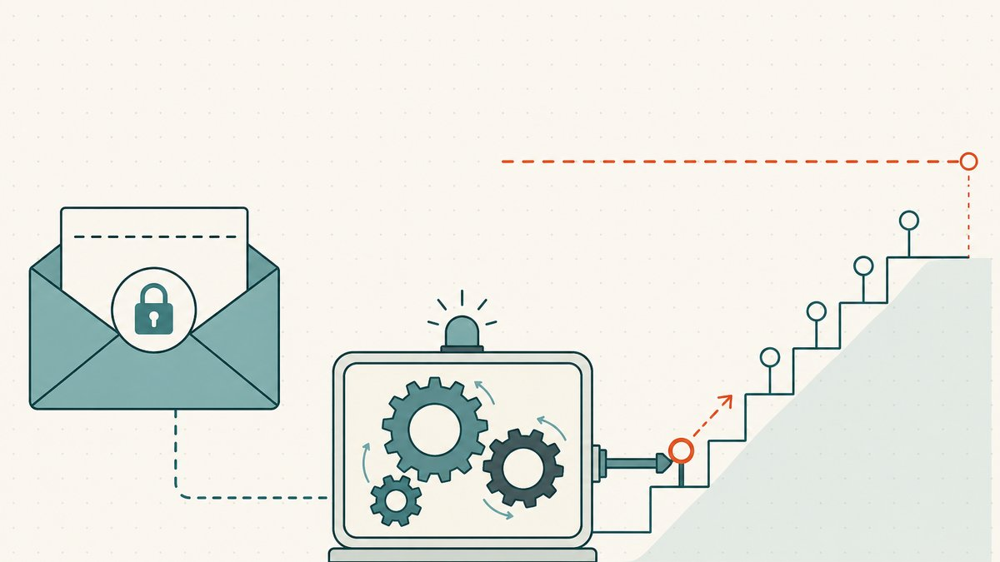

La mayoría de los buenos nombres que alguna vez querrás comprar ya están registrados, y una gran parte de ellos termina pasando, tarde o temprano, por una [subasta](/es/glossary/auction/). Cuando una registración caduca, cuando un domainer liquida su cartera, cuando un registrador captura un nombre en caída sin una [reserva anticipada](/es/glossary/backorder/) detrás, ese nombre acaba en el bloque de subasta y va a parar al mejor postor. Si revendes dominios, gastarás dinero real en estas salas, y la diferencia entre una adquisición rentable y un nombre muerto en tu cuenta es, sobre todo, disciplina en el momento de pujar.

Esta guía cubre cómo funcionan realmente las subastas del [mercado secundario](/es/glossary/aftermarket/), las dos mecánicas de puja que debes entender (puja proxy y sniping), cómo fijar y sostener un máximo firme, cómo leer si la demanda es real y cómo evitar las dos formas en que las subastas te separan de tu dinero: pagar tú mismo de más y dejarte manipular por otro. Forma parte de nuestra serie más amplia sobre [reventa de dominios](/es/blog/domain-flipping/) y se complementa directamente con [cómo encontrar dominios para revender](/es/blog/how-to-find-domains-to-flip/), ya que las subastas son uno de los principales lugares donde los encontrarás.

## De dónde vienen las subastas de dominios

Una subasta de nombres de dominio es la versión formal del negocio de comprar barato y vender caro: [facilita la compra y venta de nombres de dominio actualmente registrados, permitiendo a las personas adquirir de un propietario que desea vender un dominio previamente registrado que se ajuste a sus necesidades](https://en.wikipedia.org/wiki/Domain_name_auction#:~:text=facilitates%20the%20buying%20and%20selling%20of%20currently%20registered). La mayor parte del inventario sobre el que pujarás proviene del flujo de caducidades. Cuando un nombre no se renueva, no regresa de inmediato al pool abierto: los registradores lo encaminan primero a una subasta. Como describe Wikipedia las mecánicas de la [captura de dominios en caída](/es/blog/expired-domains-and-the-drop-cycle/), [registradores minoristas como GoDaddy o eNom retienen los nombres para subastarlos a través de servicios como TDNAM o Snapnames](https://en.wikipedia.org/wiki/Domain_drop_catching#:~:text=Retail%20registrars%20such%20as%20GoDaddy%20or%20eNom%20retain%20names%20for%20auction). Otros registradores entregan el nombre a un intermediario: [algunos registradores no permiten que los dominios caigan de la forma habitual y, en su lugar, introducen un intermediario (por ejemplo, Snapnames y Namejet) que subasta el dominio antes de su eliminación](https://en.wikipedia.org/wiki/Domain_name_speculation#:~:text=introducing%20an%20intermediary).

En la práctica, te encontrarás con tres tipos de plataforma:

- **GoDaddy Auctions**, el mercado de caducidades de mayor volumen, alimentado por nombres que caen del [registrador](/es/glossary/registrar/) más grande del planeta. La mayoría de los listados son nombres caducados con un cronómetro público.
- **NameJet** (y el estrechamente relacionado Snapnames), que funcionan como servicios de reserva anticipada más subasta. Colocas una [reserva anticipada](/es/blog/domain-backorders-and-drop-catching/) sobre un nombre pendiente de eliminación; si más de una persona lo quiere, pasa a una subasta privada entre quienes lo reservaron.
- **Sedo**, más centrada en inventario listado por propietarios que en caducidades. Sedo es una empresa estadounidense del mercado secundario de dominios que [introdujo las subastas de nombres de dominio](https://en.wikipedia.org/wiki/Sedo#:~:text=introduced%20domain%20name%20auctions) en 2006 y sigue siendo un escenario principal para las ventas iniciadas por vendedores y las intermediadas.

La oferta difiere, pero las mecánicas de puja son casi idénticas. Apréndelas una vez y podrás pujar en cualquier lugar.

## Puja proxy: el motor bajo el capó

Casi todas las subastas de dominios funcionan con **puja proxy**, el mismo sistema que hizo famoso eBay. La definición es precisa: la puja proxy [es una implementación de la subasta inglesa de segundo precio que se usa en eBay, en la que el postor ganador paga el precio de la segunda puja más alta más un incremento definido](https://en.wikipedia.org/wiki/Proxy_bid#:~:text=is%20an%20implementation%20of%20an%20English%20second%2Dprice%20auction). Tú introduces lo máximo que estás dispuesto a pagar. El sistema no expone esa cifra; puja en tu nombre por incrementos, solo hasta donde necesite llegar para mantenerse arriba, sin pasar de tu techo.

La consecuencia es el dato más útil de toda la estrategia de subastas, y al principio resulta contraintuitivo: como [el precio pagado se determina únicamente por las pujas de los competidores y no por el importe de la nueva puja](https://en.wikipedia.org/wiki/Proxy_bid#:~:text=the%20price%20paid%20is%20determined%20only%20by%20competitors%27%20bids), lo racional es pujar tu máximo verdadero una sola vez y no volver a tocarlo. No pagas tu máximo a menos que alguien te empuje hasta ahí. Si tu techo es de $1,200 y el segundo postor más alto se queda en $700, ganas a unos $700 más un incremento, no a $1,200. Introducir tu cifra real no la "delata", porque nadie puede verla y el precio lo fija el segundo clasificado.

Por eso subir tu puja de $25 en $25 es un mal hábito. La puja incremental no consigue un mejor precio bajo un sistema proxy; solo te enseña, en tiempo real, cuánto deseas el nombre, que es justamente la información que te hace pagar de más. Decide tu cifra fuera del reloj, introdúcela una vez y deja que la máquina haga el resto.

## Sniping: el momento de pujar y por qué aquí es casi todo ruido

La otra mecánica por la que todos preguntan es el **sniping**: pujar en el último segundo posible. El sniping de subastas es [la práctica, en una subasta en línea con temporizador, de colocar una puja que probablemente supere la puja más alta actual ... lo más tarde posible](https://en.wikipedia.org/wiki/Auction_sniping#:~:text=the%20practice%2C%20in%20a%20timed%20online%20auction). La lógica es sólida en abstracto: pujar tarde no da tiempo a reaccionar a los competidores y [evita las guerras de pujas](https://en.wikipedia.org/wiki/Auction_sniping#:~:text=avoid%20bidding%20wars) y la persecución de pujas, en la que la simple visión de una puja rival arrastra a otros a la pelea.

Dos cosas complican el sniping en las subastas de dominios. Primero, la mayoría de las plataformas serias usan **extensiones antisniping**: una puja colocada en los últimos minutos empuja la hora de cierre unos minutos más adelante, una y otra vez, hasta que nadie puja dentro de la ventana. Eso neutraliza la sorpresa que hace funcionar el sniping, porque no puedes ganarle a un reloj que te espera. Segundo, el sniping es una táctica para *ganar*, no para *pagar menos*. Bajo la puja proxy, hacer sniping con tu máximo verdadero en el último segundo gana el mismo nombre al mismo precio que introducir ese máximo desde temprano.

Así que, en su versión honesta: el sniping tiene un único uso legítimo, que es mantener oculto tu interés para no perseguir tus propias pujas ni avisar a un rival que se alimenta de la competencia. En las plataformas con extensión de subasta no cambia nada del precio. La disciplina que importa no es *cuándo* pujas. Es *qué cifra* estás dispuesto a pujar.

## Fija un máximo firme y luego sostenlo

Antes de colocar una sola puja, anota lo máximo que pagarás por el nombre y trata esa cifra como un muro, no como una sugerencia. Tu máximo no es "lo que el nombre podría valer para el comprador perfecto". Es un cálculo inverso a partir de tu salida: estima un precio de reventa realista, resta la comisión del mercado que pagarás del lado de la venta, resta los años de renovaciones que esperas asumir antes de venderlo, resta el margen que hace que la operación valga la pena, y lo que quede es tu techo de adquisición. (Si flaqueas en la mitad de reventa de ese cálculo, nuestra guía sobre [cómo vender un nombre de dominio que te pertenece](/es/blog/how-to-sell-a-domain-name-you-own/) recorre la salida.)

Luego sostenlo. La arquitectura emocional de una subasta en vivo está diseñada para mover tu muro, y la palabra más cara del [domaining](/es/glossary/domaining/) es "solo". *Solo* un incremento más. *Solo* otros cincuenta dólares. Cada empujoncito parece trivial por separado, y ahí está la trampa: un nombre que valoraste en $800 se convierte en una compra de $1,400 paso indoloro tras paso indoloro, y tu margen desaparece antes de que notes que se fue. El sistema proxy te protege aquí si lo dejas. Introduce tu techo verdadero una vez, aléjate y acepta el resultado. Si pierdes, pierdes ante alguien que valoró el nombre más de lo que tus cifras dicen que vale para ti, lo cual es una victoria disfrazada de derrota.

El patrón perdedor tiene nombre en la teoría de subastas. La **maldición del ganador** es el fenómeno por el cual, entre postores con estimaciones privadas distintas, [el ganador es el postor con la evaluación más optimista del activo y, por lo tanto, tenderá a sobrestimar y a pagar de más](https://en.wikipedia.org/wiki/Winner%27s_curse#:~:text=the%20winner%20is%20the%20bidder%20with%20the%20most%20optimistic%20evaluation). En una sala llena de domainers, quien gana es, por definición, quien valoró el nombre más alto, y ese suele ser el que se equivocó en la valoración por exceso. Un máximo firme es tu defensa estructural contra ser esa persona.

## Lee si la demanda es real

La mitad de no pagar de más consiste en valorar bien el nombre antes de entrar, y una subasta te da señales que deberías aprender a leer en vez de reaccionar a ellas.

**Cuenta los postores únicos, no el número de pujas.** Dos personas decididas pueden subir un nombre con docenas de pujas; eso es un duelo, no un mercado. Muchos postores distintos señalan una demanda amplia y un suelo probable. Un precio fijado por un solo rival persiguiéndote muestra su apetito, no el del mercado.

**Contrasta con las [ventas comparables](/es/glossary/comparable-sales/).** El precio de una subasta en vivo es un único dato ruidoso. Antes de decidir que una cifra es "justa porque alguien más la pujó", ánclate en lo que nombres genuinamente similares (mismo tipo de palabra, misma extensión, mismo caso de uso del comprador) han vendido realmente. Los fundamentos de [cómo encontrar dominios para revender](/es/blog/how-to-find-domains-to-flip/) se aplican directamente a tasar lo que está en el bloque.

**Separa el nombre de las métricas.** A las subastas de caducidades les encanta mostrar antigüedad, backlinks y tráfico, y eso puede ser valor real o spam reciclado, perfiles de enlaces manipulados y tráfico que se evapora en cuanto cae el contenido antiguo. Trata las métricas impresionantes como una razón para investigar, no como una razón para pujar. El valor de reventa para un [usuario final](/es/glossary/end-user/) real suele descansar en la cadena en sí, no en un historial de [SEO](/es/glossary/seo/) que no puedes verificar del todo.

**Averigua por qué está en el bloque.** A veces un [dominio en caída es más valioso](https://en.wikipedia.org/wiki/Domain_name_speculation#:~:text=dropped%20domain%20names%20can%20be%20more%20valuable) por un sitio de alto perfil que solía vivir ahí, y a veces ese historial es justamente el pasivo (un proyecto abandonado, un problema de [marca registrada](/es/glossary/trademark/)) que hizo que el propietario se marchara. Investiga la historia del nombre antes de subir el precio.

## No te dejes manipular: shills y trampas de precio

La otra forma de pagar de más es ser manipulado, y las subastas tienen una manipulación clásica integrada en su estructura. Un **shill** es un postor falso: a las personas que [impulsan los precios en favor del vendedor o del subastador con pujas falsas en una subasta se les llama shills](https://en.wikipedia.org/wiki/Shill#:~:text=drive%20prices%20in%20favor%20of%20the%20seller%20or%20auctioneer%20with%20fake%20bids), fabricando la apariencia de demanda para que un postor real empuje más alto de lo que lo haría de otro modo. El shill bidding está prohibido en toda plataforma reputada, pero ninguna política lo hace desaparecer por completo.

Tu defensa no es detectar shills en el momento, lo cual normalmente no puedes. Tu defensa es que un máximo firme vuelve irrelevante el shilling. Un postor fantasma solo puede dañarte si sus pujas falsas arrastran tu cifra hacia arriba, y tu cifra no se mueve. Si un shill te lleva hasta tu techo y "gana", se ha comprado el nombre a sí mismo, posiblemente debiendo una comisión por el privilegio. Sostén tu muro y la manipulación se estrellará contra él.

Unas cuantas trampas de precio relacionadas que vale la pena nombrar:

- **Precios de reserva y de suelo.** Muchos listados llevan una reserva oculta. Si la reserva se sitúa por encima de tu máximo, retírate: perseguir un suelo no revelado es la forma de hablarte a ti mismo para pasar tu propia cifra.
- **El anclaje de "[Compra inmediata](/es/glossary/buy-it-now/)".** Un precio de Compra inmediata alto está ahí para que la subasta parezca una ganga por comparación. Es un ancla de marketing, no una valoración. Ignóralo y tasa el nombre por sus propios méritos.
- **Tarifas por encima.** Algunas plataformas añaden primas para el comprador o cobran la comisión del lado de la venta, que de forma silenciosa eleva el suelo efectivo de todos. Incorpora el costo total a tu máximo, de modo que la cifra que introduces sea la cifra a la que realmente puedes permitirte ganar.

## Después de ganar: consigue el nombre de forma segura

Ganar es el inicio de la transacción, no el final, y en una victoria de alto valor el traspaso es donde los acuerdos se tuercen. Por eso mismo los sitios de subastas de dominios [suelen ofrecer enlaces a agentes de depósito en garantía](https://en.wikipedia.org/wiki/Domain_name_auction#:~:text=auction%20sites%20often%20provide%20links%20to%20escrow%20agents): un [depósito en garantía](/es/glossary/escrow/) neutral para que el vendedor no transfiera antes de que se confirme el pago y tú no pagues antes de que el nombre sea tuyo. En las subastas de caducidades, el registrador normalmente empuja el nombre a tu cuenta de forma automática; en las victorias de propietario a propietario, insiste en una [transferencia](/es/glossary/cross-registrar-transfer/) correctamente custodiada y confirma que recibes el [código de autorización](/es/glossary/auth-code/). Cubrimos el traspaso seguro en [qué es una cuenta escrow y cómo funciona en la compraventa de dominios](/es/blog/domain-escrow-explained/).

La liquidación es también donde la propiedad tokenizada cambia las cuentas. El clásico punto muerto (ninguna parte quiere moverse primero) es lo que vuelve tenso el [comercio de dominios](/es/glossary/domain-trading/) de alto valor, y es la brecha que [Namefi](https://namefi.io) está diseñada para estrechar: el control de un nombre real de [ICANN](/es/glossary/icann/) se vuelve más fácil de verificar y transferir, con continuidad de [DNS](/es/glossary/dns/) para que un nombre en uso siga resolviendo a lo largo del traspaso. Para un comprador en subasta, menos fricción de liquidación significa que más de los nombres que ganas se cierran de verdad.

## La versión corta

Las subastas premian la preparación y castigan la improvisación. Haz tu valoración antes de que arranque el cronómetro. Fija un máximo firme calculado a partir de una salida realista, no a partir de cuánto deseas el nombre. La puja proxy te permite introducir tu techo verdadero una sola vez sin pagar de más; el sniping en plataformas protegidas por extensión cambia el momento, pero no el precio; y la maldición del ganador, los shills y las anclas de Compra inmediata pierden todo su poder frente a una cifra que te niegas a mover. Gana los nombres que encajan en tus cuentas, deja que los demás vayan a quien quiera pagar de más y liquida a través de un [depósito en garantía](/es/glossary/escrow/) para que la victoria aterrice de verdad en tu cuenta.

## Aviso amistoso (¡Léeme!)

> No somos abogados, contadores, asesores financieros ni médicos, y **nada en este artículo constituye asesoría legal, financiera, fiscal, contable, médica ni de ningún otro tipo profesional.** Escribimos estas publicaciones para aprender nosotros mismos y como una comodidad para nuestros clientes. La información aquí puede estar desactualizada, ser específica de una región o simplemente estar equivocada. Nosotros también cometemos errores.
>
> Para cualquier decisión importante, **consulta a un profesional de verdad (¡en serio!)**. O si eso no va contigo, pregúntale a un amigo, pregunta en Twitter, pregunta en Reddit, pregúntale a una IA o pregúntale a un psíquico. En resumen: **DOYR - Haz tu propia investigación**. Aprendamos y divirtámonos.

## Fuentes y lecturas adicionales

- Wikipedia — [Subasta de nombres de dominio (definición; enlaces a depósito en garantía)](https://en.wikipedia.org/wiki/Domain_name_auction#:~:text=facilitates%20the%20buying%20and%20selling%20of%20currently%20registered)
- Wikipedia — [Puja proxy (modelo de segundo precio de eBay; precio fijado por las pujas de los competidores)](https://en.wikipedia.org/wiki/Proxy_bid#:~:text=is%20an%20implementation%20of%20an%20English%20second%2Dprice%20auction)
- Wikipedia — [Sniping de subastas (puja en el último segundo; evitar guerras de pujas)](https://en.wikipedia.org/wiki/Auction_sniping#:~:text=the%20practice%2C%20in%20a%20timed%20online%20auction)
- Wikipedia — [Maldición del ganador (el postor más optimista paga de más)](https://en.wikipedia.org/wiki/Winner%27s_curse#:~:text=the%20winner%20is%20the%20bidder%20with%20the%20most%20optimistic%20evaluation)
- Wikipedia — [Shill (pujas falsas para impulsar los precios en favor del vendedor)](https://en.wikipedia.org/wiki/Shill#:~:text=drive%20prices%20in%20favor%20of%20the%20seller%20or%20auctioneer%20with%20fake%20bids)
- Wikipedia — [Captura de dominios en caída (GoDaddy/eNom retienen nombres para subasta)](https://en.wikipedia.org/wiki/Domain_drop_catching#:~:text=Retail%20registrars%20such%20as%20GoDaddy%20or%20eNom%20retain%20names%20for%20auction)
- Wikipedia — [Especulación con nombres de dominio (subastas intermediadas de Snapnames/Namejet; nombres en caída)](https://en.wikipedia.org/wiki/Domain_name_speculation#:~:text=introducing%20an%20intermediary)
- Wikipedia — [Sedo (introdujo las subastas de nombres de dominio en 2006)](https://en.wikipedia.org/wiki/Sedo#:~:text=introduced%20domain%20name%20auctions)
