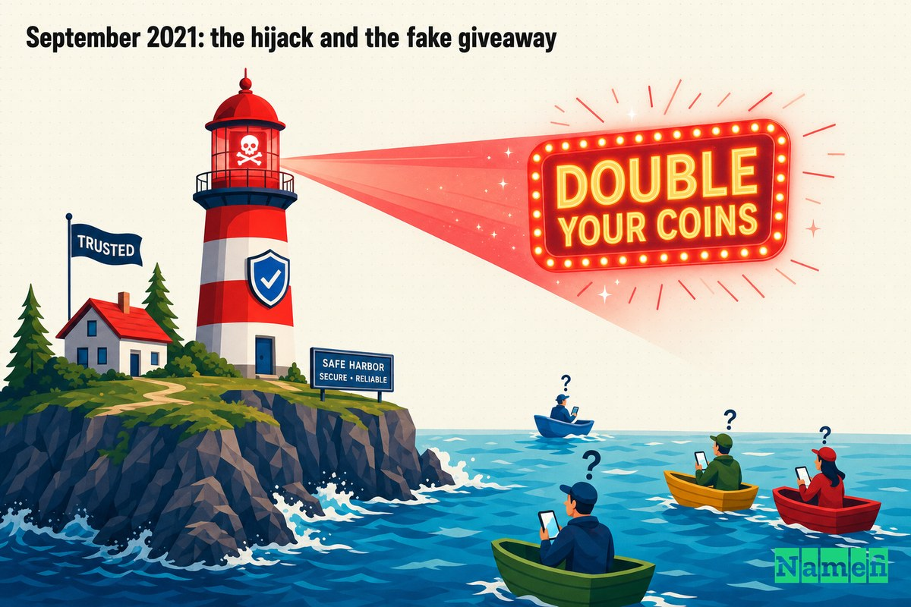
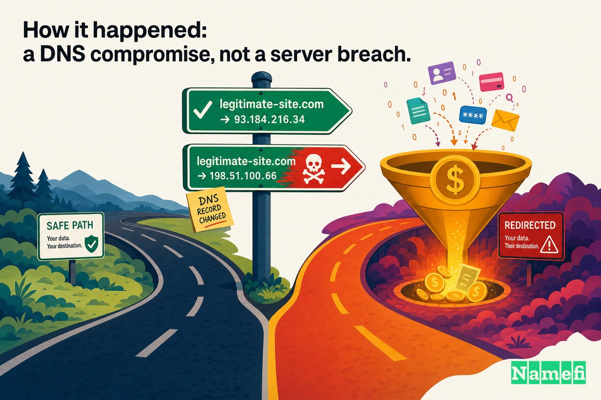
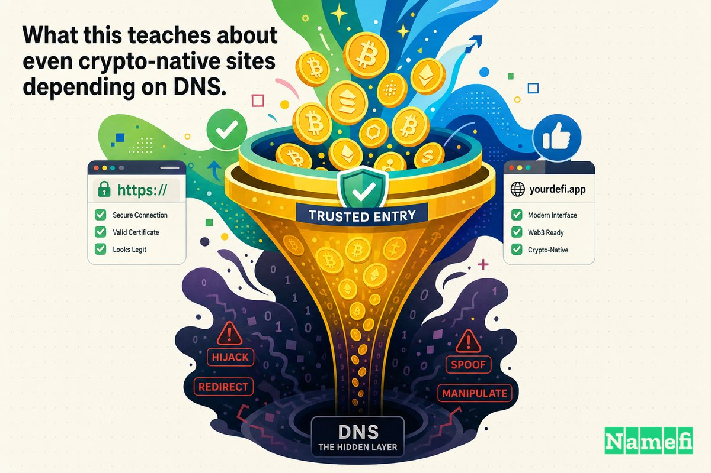

Durante más de una década, si querías una respuesta clara y neutral sobre "qué es Bitcoin y cómo usarlo de forma segura," internet te dirigía a una única dirección: **Bitcoin.org**.

Nunca fue un exchange. Nunca vendió nada. Era lo más parecido a un *felpudo de bienvenida oficial* que el dinero más adversarial y sin confianza del mundo podía tener — un sitio [registrado el 18 de agosto de 2008](https://en.wikipedia.org/wiki/Bitcoin#:~:text=The%20domain%20name%20bitcoin.org%20was%20registered), anterior al bloque génesis en sí mismo, el lugar donde vivía el white paper de Bitcoin y donde se enseñaba a los recién llegados la primera regla del cripto: *sé tu propio banco, y no confíes tus claves a nadie.*

Así que hay una ironía brutal en lo que ocurrió el **jueves 23 de septiembre de 2021**. La lección de seguridad más repetida en todo el mundo cripto — *si alguien promete duplicar tus monedas, es una estafa* — fue transmitida, al revés, desde la propia puerta principal de Bitcoin. Durante unas pocas horas, el sitio web que enseñaba a la gente a no caer en el "duplica tu Bitcoin" *era* la estafa del "duplica tu Bitcoin". Y esto ocurrió no porque alguien haya entrado en un servidor, sino porque alguien tomó el control del **dominio**.

## Un hogar simbólico y de confianza para Bitcoin

Para entender por qué este secuestro dolió tanto, hay que entender qué significaba Bitcoin.org.

Bitcoin no tiene CEO, ni sede central, ni portavoz oficial. Lo que tuvo —durante años— fue un pequeño conjunto de sitios de referencia administrados por la comunidad, y Bitcoin.org era el más destacado de ellos. CryptoPotato lo calificó como [el sitio web más antiguo relacionado con BTC, registrado hace más de 13 años](https://cryptopotato.com/bitcoinorg-hacked-giveaway-scam-promising-users-to-double-their-btc/#:~:text=the%20oldest%20website%20in%20relation%20to). Alojaba recomendaciones de wallets, guías para principiantes y una copia del white paper de Satoshi Nakamoto.

También era, de forma apropiada para Bitcoin, operado por un fantasma. El sitio es mantenido por un operador seudónimo conocido únicamente como **Cobra** — anónimo por principio. Ese principio había sido puesto a prueba recientemente ante los tribunales: apenas meses antes, el autoproclamado "Satoshi" Craig Wright había ganado un caso de derechos de autor en el Reino Unido que obligó a Bitcoin.org a retirar el white paper, con un juez que emitió una [orden que prohibía a Cobra infringir los derechos de autor de Wright en el Reino Unido](https://www.coindesk.com/markets/2021/06/29/uk-court-orders-bitcoinorg-to-remove-white-paper-following-craig-wright-lawsuit#:~:text=injunction%20prohibiting%20Cobra%20from%20infringing). La defensa de Cobra de su propio anonimato fue casi poética: [las normas del tribunal me permitían ser demandado de forma seudónima; sin embargo, no podía defenderme de forma seudónima](https://www.coindesk.com/markets/2021/06/29/uk-court-orders-bitcoinorg-to-remove-white-paper-following-craig-wright-lawsuit#:~:text=the%20court%20rules%20allowed%20for%20me%20to%20be%20sued%20pseudonymously).

El punto es que Bitcoin.org acumulaba *confianza* — del tipo institucional que se supone que un movimiento sin líderes no debería tener, acumulada silenciosamente durante trece años. Esa confianza es exactamente lo que lo convirtió en un objetivo. Una estafa funciona mejor cuanto más creíble es su anfitrión. Y hay muy pocos anfitriones en el mundo cripto más creíbles que el propio nombre de Bitcoin.

Hay una segunda ironía, más aguda, escondida aquí. Todo el ethos de Bitcoin.org era la *autocustodia*: guarda tus propias claves, no confíes en ningún custodio, verifica todo. Un visitante que hubiera interiorizado esa lección jamás entregaría monedas a la cartera de un desconocido a cambio de una promesa. Pero la estafa del sorteo no les pedía que confiaran en un desconocido — les pedía que confiaran en *el propio Bitcoin.org*, la única dirección que durante años se les había dicho que era el lugar seguro para comenzar. El ataque no venció la lección; secuestró al mensajero.

## Septiembre de 2021: el secuestro y el falso sorteo

En la mañana del 23 de septiembre de 2021, los visitantes de Bitcoin.org no vieron guías de wallets. Vieron un modal emergente — una superposición limpia y de aspecto oficial estampada en la página de inicio del sitio de referencia más confiable de Bitcoin.

El mensaje era el truco más antiguo del mundo cripto, revestido de autoridad prestada. Afirmaba que la **Bitcoin Foundation** estaba [devolviendo algo a la comunidad](https://www.coindesk.com/tech/2021/09/23/bitcoinorg-appears-hacked-by-giveaway-scam/#:~:text=giving%20back%20to%20the%20community), decía que la oferta estaba limitada a [los primeros 10,000 usuarios](https://www.coindesk.com/tech/2021/09/23/bitcoinorg-appears-hacked-by-giveaway-scam/#:~:text=first%2010%2C000), y hacía una simple promesa: [¡Envía Bitcoin a esta dirección y te enviaremos el doble de la cantidad de vuelta!](https://www.bleepingcomputer.com/news/security/bitcoinorg-hackers-steal-17-000-in-double-your-cash-scam/#:~:text=Send%20Bitcoin%20to%20this%20address%2C%20and%20we%20will%20send%20double). Un código QR lo hacía sin fricciones. La mecánica, como CoinDesk describió irónicamente el género, es siempre la misma: [estos esquemas hacen falsas promesas de duplicar los fondos de uno después de enviar una cantidad inicial a una dirección de cartera mediante un código QR](https://www.coindesk.com/tech/2021/09/23/bitcoinorg-appears-hacked-by-giveaway-scam/#:~:text=these%20schemes%20give%20false%20promises%20of%20doubling). Y el resultado es siempre el mismo también: [las víctimas, de hecho, no reciben nada a cambio y pierden el cripto que enviaron](https://www.coindesk.com/tech/2021/09/23/bitcoinorg-appears-hacked-by-giveaway-scam/#:~:text=Victims%2C%20in%20fact%2C%20receive%20nothing).

Cobra confirmó la brecha de forma pública y directa, publicando que el sitio [ha sido comprometido. Actualmente investigando cómo los hackers colocaron el modal de estafa en el sitio](https://www.bleepingcomputer.com/news/security/bitcoinorg-hackers-steal-17-000-in-double-your-cash-scam/#:~:text=has%20been%20compromised.%20Currently%20looking%20into%20how%20the%20hackers).

## Lo que perdieron los visitantes

Una estafa de "duplica tu dinero" solo funciona si algunas personas la creen. En un sitio web aleatorio, casi nadie lo haría. En *Bitcoin.org*, algunos sí lo hicieron.

La cartera de la estafa no permaneció vacía. BleepingComputer informó que el [último saldo actualizado de la cartera era de 0.40571238 BTC o aproximadamente $17,000 USD](https://www.bleepingcomputer.com/news/security/bitcoinorg-hackers-steal-17-000-in-double-your-cash-scam/#:~:text=0.40571238%20BTC%20or%20approximately%20US%2417%2C000). CoinDesk, captándolo en directo, señaló que la [dirección de la estafa del sorteo había recibido más de $17,700 en pequeñas transacciones en el momento de la publicación](https://www.coindesk.com/tech/2021/09/23/bitcoinorg-appears-hacked-by-giveaway-scam/#:~:text=received%20over%20%2417%2C700%20in%20small%20transactions).

Diecisiete mil dólares, desaparecidos en una ventana de una noche, en un fraude del que el propio sitio anfitrión te habría advertido. Y recuerda la parte más cruel del diseño de Bitcoin: esas transacciones son definitivas. No hay contracargo, no hay departamento de fraude, no hay "llamar al banco". La misma irreversibilidad que hace poderoso a Bitcoin es la que hizo que la pérdida de cada víctima fuera permanente en el instante en que escaneó el código.

La cifra en dólares casi no importa. El daño real fue a lo que Bitcoin.org pasó trece años construyendo — la suposición de que *esta* dirección, de todas las direcciones, era segura de confiar.

## Cómo ocurrió: un compromiso DNS, no una brecha en el servidor

Aquí está el detalle que convierte esto en una historia de *Domain Mayday* y no en otro cuento de [phishing](/es/glossary/phishing/) más: **los atacantes nunca tuvieron que irrumpir en los servidores de Bitcoin.org.**

Cobra fue tajante en este punto. El servidor de origen, dijo, estaba intacto — [mi servidor real no recibió ningún tráfico durante el hackeo](https://news.bitcoin.com/hackers-compromise-web-portal-bitcoin-org-dns-hijack-replaces-site-with-btc-doubler-scam/#:~:text=my%20actual%20server%20didn%27t%20get%20any%20traffic%20during%20the%20hack). En cambio, el ataque ocurrió una capa más arriba, en la parte de internet que decide *hacia dónde apunta un nombre de dominio*. Los observadores que siguieron el incidente notaron que [la información WHOIS fue actualizada en el momento del hackeo, los nameservers + DNS fueron cambiados](https://news.bitcoin.com/hackers-compromise-web-portal-bitcoin-org-dns-hijack-replaces-site-with-btc-doubler-scam/#:~:text=The%20WHOIS%20info%20was%20updated%20at%20the%20time%20of%20the%20hack). Una vez que controlas los nameservers, controlas la respuesta a la pregunta "¿a qué servidor *es* bitcoin.org?" — y puedes apuntar silenciosamente un nombre de confianza hacia un servidor que tú mismo controlas.

El propio diagnóstico de Cobra señaló la culpa hacia la capa DNS y hacia un cambio reciente de infraestructura. Como él mismo dijo: [Bitcoin.org nunca había sido hackeado. Y luego nos mudamos a Cloudflare, y dos meses después nos hackean.](https://news.bitcoin.com/hackers-compromise-web-portal-bitcoin-org-dns-hijack-replaces-site-with-btc-doubler-scam/#:~:text=Bitcoin.org%20hasn%27t%20been%20hacked%2C%20ever.%20And%20then%20we%20move%20to%20Cloudflare) Su teoría de trabajo era específica y contundente: [los atacantes parecen haber explotado alguna falla en el DNS](https://news.bitcoin.com/hackers-compromise-web-portal-bitcoin-org-dns-hijack-replaces-site-with-btc-doubler-scam/#:~:text=The%20attackers%20just%20seem%20to%20have%20exploited%20some%20flaw%20in%20the%20DNS). Decrypt resumió la lectura predominante de la misma manera: los atacantes [explotaron una falla en la configuración DNS después de que el sitio web se mudara a Cloudflare dos meses antes](https://decrypt.co/81612/bitcoin-org-compromised-fraudulent-crypto-giveaway-advertised/#:~:text=exploited%20a%20flaw%20in%20the%20DNS%20configuration%20after%20the%20website%20moved%20to%20Cloudflare).

Si la causa raíz fue una mala configuración, un compromiso a nivel del [registrador](/es/glossary/registrar/) o algo en el proveedor DNS nunca quedó del todo claro en público — CoinDesk señaló que la [causa raíz del secuestro del sitio web sigue sin confirmarse, aunque algunos han sospechado que se trató de un secuestro DNS](https://www.bleepingcomputer.com/news/security/bitcoinorg-hackers-steal-17-000-in-double-your-cash-scam/#:~:text=root%20cause%20of%20the%20website%20hijack%20remains%20unconfirmed). Pero la *forma* del ataque es inconfundible. La aplicación estaba bien. El código estaba bien. Las claves estaban bien. El **nombre** fue secuestrado, y en la web, controlar el nombre es la mayor parte de la batalla.

## Respuesta y consecuencias

La solución, significativamente, también ocurrió en la capa del dominio.

El sitio no podía simplemente "parcharse" para salir del problema, porque la versión maliciosa activa de Bitcoin.org no se servía desde la infraestructura real de Bitcoin.org. La forma más rápida de detener el sangrado era sacar el propio dominio de servicio. El registrador, **Namecheap**, hizo exactamente eso — según BleepingComputer, [hemos desactivado temporalmente el dominio](https://www.bleepingcomputer.com/news/security/bitcoinorg-hackers-steal-17-000-in-double-your-cash-scam/#:~:text=We%20have%20temporarily%20disabled%20the%20domain). Durante un tiempo, los visitantes no vieron ni una estafa ni una página de inicio; CoinDesk informó que se encontraban con [el mensaje "Este sitio no está disponible".](https://www.coindesk.com/tech/2021/09/23/bitcoinorg-appears-hacked-by-giveaway-scam/#:~:text=This%20site%20can%27t%20be%20reached) La página de referencia más confiable de Bitcoin se quedó a oscuras.

Después de unas pocas horas de investigación, el dominio fue reapuntado correctamente y el sitio fue restaurado a su estado previo al hackeo. La ventana fue corta — un día o menos — y en términos de dólares el robo fue modesto para los estándares del crimen cripto. Pero el incidente golpeó con dureza precisamente por *cuál* sitio era. Un movimiento que se enorgullece de "no confíes, verifica" acababa de ver cómo su propia página canónica de "confía en nosotros" era verificablemente weaponizada contra sus usuarios.

## Lo que esto nos enseña sobre la dependencia del DNS incluso en sitios nativos de cripto

La lección más incómoda del secuestro de Bitcoin.org es que **ser nativo de cripto no te salva casi de nada de esto.**

Bitcoin es descentralizado. Su libro de contabilidad es famosamente difícil de manipular. Sus claves, cuando se guardan correctamente, son solo tuyas. Nada de eso importó aquí — porque la *puerta principal* a todo ello era un nombre de dominio perfectamente ordinario, funcionando sobre el mismo DNS, registrador e infraestructura de nameservers que cualquier tienda de comercio electrónico o panadería local. La [blockchain](/es/glossary/blockchain/) estaba intacta. El sitio web era intocable en la forma que importaba, pero el **nombre que apuntaba a él no lo era.**

Algunas conclusiones duraderas se desprenden de esto:

1. **Tu dominio es parte de tu superficie de ataque — a menudo la parte *más grande*.** Puedes escribir código impecable, guardar tus claves en almacenamiento en frío y reforzar cada servidor, y un atacante que controle tus nameservers o tu cuenta del registrador todavía puede suplantarte completamente. El nombre es la puerta principal, y un nombre secuestrado le permite a un extraño responder en tu lugar.

2. **Los cambios de DNS/registrador son silenciosos y de alto impacto.** Cuando [los nameservers + DNS fueron cambiados](https://news.bitcoin.com/hackers-compromise-web-portal-bitcoin-org-dns-hijack-replaces-site-with-btc-doubler-scam/#:~:text=nameservers%20%2B%20DNS%20changed), nada "se rompió" de una manera que la mayoría de los sistemas de monitoreo detectarían de inmediato — el sitio seguía cargando, solo que desde el lugar equivocado. El bloqueo del registrador, el bloqueo del [registro](/es/glossary/registry/), [DNSSEC](/es/glossary/dnssec/) y el control de acceso estricto en las cuentas del registrador/proveedor DNS no son higiene opcional; son los cerrojos en la puerta que todos olvidan.

3. **La reputación es lo que realmente se roba.** Los atacantes no querían realmente el servidor de $17,000 de Bitcoin.org; querían su *credibilidad*, tomada prestada durante unas pocas horas para hacer creíble una estafa antigua. Cuanto más confiable es tu dominio, más valioso es secuestrarlo — y más cuidado debes tener sobre quién puede cambiar hacia dónde apunta.

4. **La infraestructura "sin confianza" sigue descansando sobre nombres de confianza.** Incluso Bitcoin, el ejemplo canónico de eliminación de intermediarios, llega a sus usuarios a través de DNS — un sistema jerárquico, intermediado y mutable. Descentralizar el dinero no descentraliza la puerta principal.

5. **La velocidad de detección supera a la elegancia de la defensa.** Bitcoin.org sobrevivió esto con una pérdida modesta en gran parte porque la comunidad detectó la estafa rápidamente y el registrador pudo retirar el dominio en pocas horas. Cuanto más tiempo mantiene un nombre secuestrado resolviendo hacia un atacante, mayor es la pérdida — y el daño reputacional — que se acumula. Saber *en el instante* en que el control o el enrutamiento de tu nombre cambia vale más que cualquier candado estático individual.

## El ángulo de Namefi

El secuestro de Bitcoin.org es, en su raíz, un problema de *control y verificabilidad*. La aplicación era sólida. La blockchain era sólida. Lo que falló fue la capa que responde a una pregunta engañosamente simple: **¿quién controla legítimamente este nombre y hacia dónde está permitido que apunte?** Cuando la respuesta a esa pregunta puede reescribirse silenciosamente — nameservers intercambiados, [información WHOIS actualizada en el momento del hackeo](https://news.bitcoin.com/hackers-compromise-web-portal-bitcoin-org-dns-hijack-replaces-site-with-btc-doubler-scam/#:~:text=The%20WHOIS%20info%20was%20updated%20at%20the%20time%20of%20the%20hack) — la confianza se evapora sin importar cuán sólido sea el resto del stack.

[Namefi](https://namefi.io) parte de la idea de que la propiedad y el control de dominios deberían comportarse como un activo de primera clase, verificable y nativo de internet, en lugar de una entrada en una base de datos mutable que un atacante puede editar silenciosamente. La propiedad tokenizada y auditable hace que la pregunta "¿quién controla este dominio, y acaba de cambiar ese control?" sea respondible [on-chain](/es/glossary/on-chain/) — convirtiendo un intercambio silencioso de nameservers en un evento visible y responsable, mientras se mantiene compatible con el DNS del que depende el resto de la web. No hace desaparecer el DNS en sí, pero hace que el *control sobre un nombre* sea más difícil de secuestrar de forma invisible y más fácil de verificar continuamente.

Bitcoin.org pasó trece años enseñando al mundo que el momento peligroso es aquel en que dejas de verificar y empiezas a confiar. Durante unas pocas horas en septiembre de 2021, su propio dominio demostró la lección del modo difícil. La conclusión para todos los demás es más sencilla de lo que parece: tu dominio es tu identidad en internet — cuida el nombre con el mismo cuidado con el que cuidas las claves detrás de él.

## Fuentes y lecturas adicionales

- BleepingComputer — [Bitcoin.org hackers steal $17,000 in 'double your cash' scam](https://www.bleepingcomputer.com/news/security/bitcoinorg-hackers-steal-17-000-in-double-your-cash-scam/)
- CoinDesk — [Bitcoin.org Website Inaccessible After Being Hacked by Apparent Giveaway Scam](https://www.coindesk.com/tech/2021/09/23/bitcoinorg-appears-hacked-by-giveaway-scam/)
- Bitcoin.com News — [Hackers Compromise Web Portal Bitcoin.org — DNS Hijack Replaces Site With BTC Doubler Scam](https://news.bitcoin.com/hackers-compromise-web-portal-bitcoin-org-dns-hijack-replaces-site-with-btc-doubler-scam/)
- Decrypt — [Bitcoin.org Compromised, Fraudulent Crypto Giveaway Advertised](https://decrypt.co/81612/bitcoin-org-compromised-fraudulent-crypto-giveaway-advertised/)
- Cointelegraph — [Bitcoin.org goes offline after suffering scam attack](https://cointelegraph.com/news/bitcoin-org-goes-offline-after-suffering-scam-attack)
- CryptoPotato — [BitcoinOrg Hacked: Giveaway Scam Promising Users to Double Their BTC](https://cryptopotato.com/bitcoinorg-hacked-giveaway-scam-promising-users-to-double-their-btc/)
- NewsBTC — [Bitcoin.org Hacked By Scammers For A Few Minutes. Someone Sent Them 0.4 BTC](https://www.newsbtc.com/news/bitcoin-org-hacked-by-scammers/)
- CoinDesk — [UK Court Orders Bitcoin.org to Remove White Paper Following Craig Wright Lawsuit](https://www.coindesk.com/markets/2021/06/29/uk-court-orders-bitcoinorg-to-remove-white-paper-following-craig-wright-lawsuit)
- Wikipedia — [Bitcoin (historial del dominio bitcoin.org)](https://en.wikipedia.org/wiki/Bitcoin)
