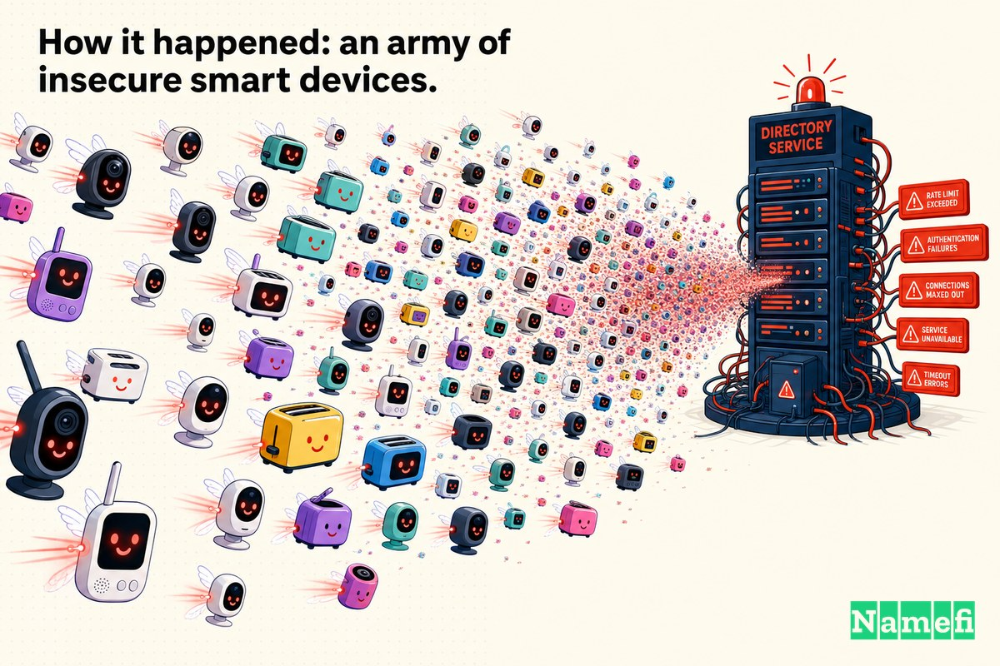
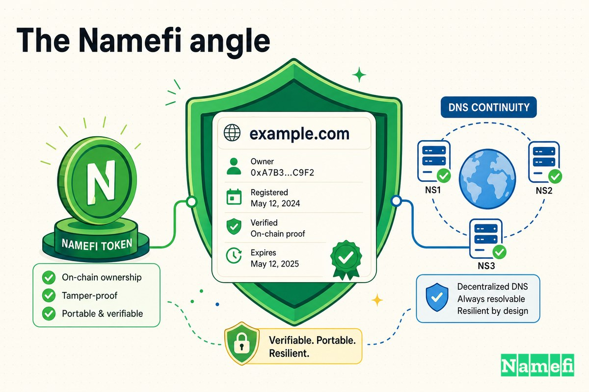

Durante unas pocas horas un viernes de octubre de 2016, internet olvidó cómo encontrarse a sí mismo.

Twitter mostraba una página en blanco. Netflix giraba y se rendía. Reddit, Spotify, GitHub, Airbnb, PayPal — todos ahí, todos en línea, todos funcionando perfectamente en sus propios servidores, y todos completamente inaccesibles. Nada había sido hackeado. No se robaron datos. Los sitios web estaban exactamente donde siempre habían estado. Lo que se rompió fue la parte de internet que *te dice dónde están las cosas*.

El ataque no golpeó a Twitter ni a Netflix. Golpeó a una empresa de la que la mayoría de sus usuarios nunca habían oído hablar: **Dyn**, una firma de New Hampshire que administraba el DNS — la libreta de direcciones de internet — para una gran parte de la web moderna. Y el arma no fue una granja de servidores ni un arsenal de un estado-nación. Fue un enjambre de monitores de bebés hackeados, webcams y routers domésticos: aparatos domésticos ordinarios, reclutados silenciosamente en un ejército llamado **Mirai**.

Este es el **Domain Mayday EP08** — el día en que las cámaras inteligentes inseguras derribaron la guía telefónica de internet.

## DNS: la guía telefónica de internet, y el lugar de Dyn en ella

Cada vez que escribes un nombre de dominio, tu computadora tiene que traducirlo a una dirección IP numérica antes de poder conectarse a cualquier cosa. Esa traducción es el trabajo del [DNS](/es/glossary/dns/), el Sistema de Nombres de Dominio. Es la capa de búsqueda entre el nombre legible para los humanos y la máquina a la que apunta.

Dyn era uno de los grandes proveedores administrados de ese servicio de búsqueda. Cuando un sitio externalizaba su DNS a Dyn, los nameservers de Dyn se convertían en la fuente autoritativa para "¿dónde vive este dominio?" The Register lo expresó claramente durante el ataque: al dejar a Dyn fuera de línea, los resolvers DNS públicos gestionados por Google y los proveedores de internet fueron [incapaces de contactar a Dyn para buscar nombres de host para los usuarios, impidiendo que las personas accedieran a sitios que usaban Dyn para DNS](https://www.theregister.com/2016/10/21/dns_devastation_as_dyn_dies_under_denialofservice_attack/#:~:text=unable%20to%20contact%20Dyn%20to%20lookup%20hostnames).

Esa es la fragilidad silenciosa en el centro de esta historia. Un sitio web puede ser impecable — servidores redundantes, tiempo de actividad perfecto, ingenieros de primera clase — y aun así desaparecer de internet si el único proveedor que responde "¿dónde está?" se apaga. Como resumió posteriormente el CyLab de Carnegie Mellon, los dominios afectados eran [críticamente dependientes de Dyn, un DNS de terceros. En otras palabras, dependían únicamente de Dyn, así que cuando Dyn cayó, ellos también cayeron](https://cylab.cmu.edu/news/2020/10/30-dynattack.html#:~:text=critically%20dependent%20on%20Dyn).

## 21 de octubre de 2016: el ataque llegó en oleadas

El asalto comenzó la mañana del viernes 21 de octubre de 2016, y no llegó como un solo golpe. Llegó en oleadas distintas a lo largo del día.

El registro de Wikipedia del incidente enumera [tres ataques consecutivos de denegación de servicio distribuido](https://en.wikipedia.org/wiki/DDoS_attacks_on_Dyn#:~:text=three%20consecutive%20distributed%20denial%2Dof%2Dservice%20attacks) contra Dyn, comenzando alrededor de las 11:10 UTC. La mecánica fue un clásico de denegación de servicio distribuido: el [ataque DDoS se logró mediante numerosas solicitudes de búsqueda DNS desde decenas de millones de direcciones IP](https://en.wikipedia.org/wiki/DDoS_attacks_on_Dyn#:~:text=numerous%20DNS%20lookup%20requests%20from%20tens%20of%20millions%20of%20IP%20addresses), ahogando los nameservers de Dyn con tanto tráfico basura que las búsquedas legítimas no podían abrirse paso.

Las oleadas fueron lo que lo hizo sentir implacable. The Register, cubriéndolo en vivo, describió el momento en que Dyn parecía recuperarse — y luego no lo hacía: [tras dos horas desde la marea inicial de tráfico basura, Dyn anunció que había mitigado el asalto y que el servicio estaba volviendo a la normalidad. Pero el alivio fue breve: apenas una hora después, el ataque se reanudó](https://www.theregister.com/2016/10/21/dns_devastation_as_dyn_dies_under_denialofservice_attack/#:~:text=After%20two%20hours%20into%20the%20initial%20tidal%20wave). Lo que parecía el final era solo el intervalo entre rondas.

En volumen bruto, el ataque fue enorme para su época — uno de los mayores eventos DDoS vistos hasta ese momento, con The Register caracterizando el pico como [más de 1 Tbps](https://www.theregister.com/2017/11/07/mirai_botnet_sitrep/#:~:text=more%20than%201TBps). (Dyn advirtió que una "tormenta de reintentos" de tráfico legítimo infló algunas estimaciones tempranas, un punto al que volveremos.)

## Qué sitios quedaron a oscuras — y cómo se sintió

Cuando los nameservers de Dyn no podían responder, el fallo se propagó hacia todos los que dependían de ellos. Este no era un rincón oscuro de la web. Era la portada del internet de consumo.

El informe en vivo de The Register nombró algunas de las víctimas directamente: un ataque extraordinario y concentrado sobre Dyn que continuó [perturbando los servicios de internet para cientos de empresas, incluidos gigantes en línea como Twitter, Amazon, AirBnB, Spotify y otros](https://www.theregister.com/2016/10/21/dns_devastation_as_dyn_dies_under_denialofservice_attack/#:~:text=disrupt%20internet%20services%20for%20hundreds%20of%20companies). La lista de servicios afectados de Wikipedia parece un quién es quién de los sitios más grandes de la época: [Airbnb, Amazon.com, CNN, GitHub, Netflix, PayPal, Reddit, Spotify, Twitter](https://en.wikipedia.org/wiki/DDoS_attacks_on_Dyn#:~:text=Airbnb), y docenas más.

Brian Krebs, cuyo propio sitio había sido golpeado por el mismo malware semanas antes, describió la experiencia del consumidor cuando el [ataque comenzó a crear problemas para los usuarios de internet que intentaban acceder a una variedad de sitios, incluyendo Twitter, Amazon, Tumblr, Reddit, Spotify y Netflix](https://krebsonsecurity.com/2016/10/hacked-cameras-dvrs-powered-todays-massive-internet-outage/#:~:text=an%20array%20of%20sites%2C%20including%20Twitter). Para los usuarios comunes, no había ningún error que tuviera sentido. Los sitios simplemente no cargaban — primero a lo largo de la costa este de Estados Unidos, luego extendiéndose a medida que las oleadas posteriores impactaban, alcanzando usuarios a lo largo de EE. UU. y hasta Europa.

## Cómo ocurrió: un ejército de dispositivos inteligentes inseguros

Aquí está la parte que convirtió el ataque a Dyn en un punto de inflexión: la potencia de fuego no vino de computadoras. Vino de *cosas*.

Mirai es un malware que caza dispositivos del Internet de las Cosas — cámaras, routers, DVRs — y los secuestra. Funciona explotando la debilidad más perezosa del hardware de consumo: la contraseña con la que viene el dispositivo de fábrica. Como The Register lo describió, Mirai se propaga por la web, aumentando sus filas de zombis obedientes, [iniciando sesión en dispositivos usando sus contraseñas predeterminadas de fábrica a través de Telnet y SSH](https://www.theregister.com/2016/10/21/dyn_dns_ddos_explained/#:~:text=logging%20into%20devices%20using%20their%20default%2C%20factory%2Dset%20passwords). Krebs describió el mecanismo con igual contundencia: Mirai [rastrea la Web en busca de dispositivos IoT protegidos por poco más que nombres de usuario y contraseñas predeterminados de fábrica, y luego enrola los dispositivos en ataques](https://krebsonsecurity.com/2016/10/hacked-cameras-dvrs-powered-todays-massive-internet-outage/#:~:text=scours%20the%20Web%20for%20IoT%20devices).

Los dispositivos en el corazón del ataque a Dyn eran principalmente webcams y DVRs baratos. Krebs rastreó la botnet hasta [principalmente grabadoras de video digital (DVRs) y cámaras IP comprometidas fabricadas por una empresa china de alta tecnología llamada XiongMai Technologies](https://krebsonsecurity.com/2016/10/hacked-cameras-dvrs-powered-todays-massive-internet-outage/#:~:text=mainly%20compromised%20digital%20video%20recorders) — dispositivos cuyas credenciales predeterminadas, en muchos casos, [un usuario no puede cambiar de manera factible](https://krebsonsecurity.com/2016/10/hacked-cameras-dvrs-powered-todays-massive-internet-outage/#:~:text=A%20user%20cannot%20feasibly%20change%20this%20password) porque la contraseña estaba codificada en el firmware.

Dos cosas convirtieron a Mirai de una molestia en una catástrofe. Primero, el autor del malware había, [a finales de septiembre de 2016, publicado el código fuente, permitiendo efectivamente que cualquiera construyera su propio ejército de ataque](https://krebsonsecurity.com/2016/10/hacked-cameras-dvrs-powered-todays-massive-internet-outage/#:~:text=released%20the%20source%20code%20for%20it). Segundo, la cantidad de dispositivos vulnerables era enorme. Dyn confirmó la firma del ataque: la empresa pudo [confirmar que un volumen significativo del tráfico de ataque se originó en botnets basadas en Mirai](https://www.bankinfosecurity.com/botnet-army-just-100000-iot-devices-disrupted-dyn-a-9486#:~:text=confirm%20that%20a%20significant%20volume%20of%20attack%20traffic%20originated%20from%20Mirai), y Wikipedia describe la botnet como un enjambre de [dispositivos conectados a internet — como impresoras, cámaras IP, gateways residenciales y monitores de bebés — que habían sido infectados con el malware Mirai](https://en.wikipedia.org/wiki/DDoS_attacks_on_Dyn#:~:text=printers%2C%20IP%20cameras%2C%20residential%20gateways%20and%20baby%20monitors).

## Las secuelas: contando el enjambre — y los perpetradores

Cuando se asentó el polvo, incluso la pregunta básica de *qué tan grande fue* resultó ser difícil de responder. El propio análisis post-incidente de Dyn, a través del vicepresidente ejecutivo Scott Hilton, estimó la botnet en [hasta 100.000 endpoints maliciosos](https://www.bankinfosecurity.com/botnet-army-just-100000-iot-devices-disrupted-dyn-a-9486#:~:text=up%20to%20100%2C000%20malicious%20endpoints) — grande, pero menor que los "decenas de millones de IPs" que algunas cifras tempranas sugerían. La discrepancia vino de un bucle de retroalimentación: los ataques maliciosos provenían de al menos una botnet, [con la tormenta de reintentos proporcionando un indicador falso de un conjunto de endpoints significativamente mayor de lo que ahora sabemos que es](https://www.bankinfosecurity.com/botnet-army-just-100000-iot-devices-disrupted-dyn-a-9486#:~:text=with%20the%20retry%20storm%20providing%20a%20false%20indicator). En otras palabras, el comportamiento automático de "intentar de nuevo" propio de internet amplificó el caos.

Las consecuencias legales añadieron un giro. Los tres jóvenes detrás de Mirai — Paras Jha, Josiah White y Dalton Norman — finalmente [se declararon culpables por su papel en la creación, operación y venta de acceso a la "botnet Mirai"](https://cyberscoop.com/mirai-botnet-charges-paris-jha-dalton-norman-josiah-white/#:~:text=pleaded%20guilty%20for%20their%20role%20in%20creating). Pero para el momento del ataque a Dyn, Jha ya había publicado el código fuente públicamente — y los fiscales y periodistas han sido cuidadosos al señalar que los atacantes de Dyn no eran necesariamente el trío original. Como informó CyberScoop, aún [no está claro, por ejemplo, quién estuvo detrás del ataque más mediático vinculado a Mirai contra la empresa de gestión del rendimiento de internet Dyn](https://cyberscoop.com/mirai-botnet-charges-paris-jha-dalton-norman-josiah-white/#:~:text=not%20yet%20clear%2C%20for%20example%2C%20who%20was%20behind). Una vez que el arma fue de código abierto, cualquiera podía apretar el gatillo.

Para Dyn, el daño comercial fue real: en los meses siguientes, miles de dominios trasladaron su DNS a otra parte, una costosa lección sobre la confianza del cliente tras un solo mal día.

## Lo que esto enseña sobre la concentración de proveedores DNS

El ataque a Dyn se recuerda como una historia sobre la seguridad del IoT, y lo es. Pero su lección más profunda es sobre la *arquitectura*: el peligro de enrutar demasiado tráfico de internet a través de un único cuello de botella.

Cada sitio que quedó a oscuras el 21 de octubre había tomado la misma decisión aparentemente razonable — externalizar el DNS a un único proveedor excelente. Individualmente, inteligente. Colectivamente, significó que derribar a una sola empresa podía borrar una fracción significativa de la web de una vez. El veredicto del CyLab fue que las lecciones del ataque [solo han sido aplicadas por un puñado de sitios web que fueron directamente impactados](https://cylab.cmu.edu/news/2020/10/30-dynattack.html#:~:text=have%20only%20been%20acted%20upon%20by%20a%20handful), incluso años después.

La respuesta defensiva es la redundancia: distribuir el DNS autoritativo entre más de un proveedor para que ninguna interrupción singular sea fatal. Dos años después de Dyn, The Register encontró que esto seguía siendo raro y complicado — Cricket Liu de Infoblox señaló que [no ha sido más fácil usar múltiples proveedores de DNS autoritativo, por ejemplo (digamos Dyn más Verisign o Neustar). Poder usar múltiples proveedores marcaría una gran diferencia](https://www.theregister.com/2018/10/11/dns_insecurity_survey/#:~:text=hasn%27t%20gotten%20any%20easier%20to%20use%20multiple%20authoritative%20DNS%20providers). Las conclusiones para cualquiera que dependa de un dominio:

1. **Un dominio tiene más puntos de fallo que su [registrador](/es/glossary/registrar/).** El proveedor que responde "¿hacia dónde apunta este nombre?" es tan fundamental como los servidores detrás de él.
2. **El DNS con un único proveedor es un único punto de fallo.** Un excelente tiempo de actividad en condiciones normales no dice nada sobre el comportamiento ante una inundación de 1 Tbps.
3. **La concentración es conveniente y frágil.** La misma eficiencia que hace atractivo a un proveedor hace que su caída se sienta ampliamente.
4. **La resiliencia es una propiedad de la titularidad, no solo del alojamiento.** Cuando algo se rompe, necesitas controlar la configuración de tu dominio con suficiente claridad para re-enrutar rápidamente.

## El ángulo de Namefi

El ataque a Dyn no robó un solo dominio. No falsificó una transferencia ni secuestró una cuenta de registrador. Y sin embargo, durante unas pocas horas, las personas que *eran propietarias* de esos dominios perdieron efectivamente el control sobre a dónde apuntaban sus nombres — no porque su titularidad estuviera en duda, sino porque la capa operativa por debajo de sus dominios falló de una vez.

Esa brecha — entre *poseer* un nombre y *controlar de manera confiable* hacia dónde resuelve — es exactamente la fisura que explotan ataques como este. Los dominios están entre los activos más valiosos que posee una empresa, y sin embargo su control a menudo reside detrás de una infraestructura centralizada y opaca que el propietario no puede verificar ni reconfigurar rápidamente bajo presión.

[Namefi](https://namefi.io) está construido sobre la idea de que los dominios deben comportarse como activos nativos de internet: titularidad que es criptográficamente verificable y portable, manteniéndose totalmente compatible con DNS. La titularidad de dominios verificable y controlada por el propietario no detiene una botnet — pero empuja al mundo hacia un internet donde el control de un nombre es demostrable, auditable y no depende silenciosamente del peor día de un proveedor. El ataque de Mirai a Dyn es un recordatorio de que un dominio que "posees" es solo tan resiliente como la capa que responde por él. La resiliencia comienza haciendo que la titularidad y el control sean algo que realmente puedas verificar.

## Fuentes y lecturas adicionales

- Krebs on Security — [Hacked Cameras, DVRs Powered Today's Massive Internet Outage](https://krebsonsecurity.com/2016/10/hacked-cameras-dvrs-powered-todays-massive-internet-outage/)
- Wikipedia — [DDoS attacks on Dyn](https://en.wikipedia.org/wiki/DDoS_attacks_on_Dyn)
- The Register — [DNS devastation: Top websites whacked offline as Dyn dies again](https://www.theregister.com/2016/10/21/dns_devastation_as_dyn_dies_under_denialofservice_attack/)
- The Register — [Today the web was broken by countless hacked devices: your 60-second summary](https://www.theregister.com/2016/10/21/dyn_dns_ddos_explained/)
- The Register — [Mirai, Mirai, pwn them all: who's the greatest botnet on the whole?](https://www.theregister.com/2017/11/07/mirai_botnet_sitrep/)
- The Register — [In the two years since Dyn went dark, what have we learned? Not much, it appears](https://www.theregister.com/2018/10/11/dns_insecurity_survey/)
- BankInfoSecurity — [Botnet Army of 'Up to 100,000' IoT Devices Disrupted Dyn](https://www.bankinfosecurity.com/botnet-army-just-100000-iot-devices-disrupted-dyn-a-9486)
- Carnegie Mellon CyLab — [Four years since the Mirai-Dyn attack… is the Internet safer?](https://cylab.cmu.edu/news/2020/10/30-dynattack.html)
- CyberScoop — [Three men plead guilty for roles in Mirai botnet empire](https://cyberscoop.com/mirai-botnet-charges-paris-jha-dalton-norman-josiah-white/)
