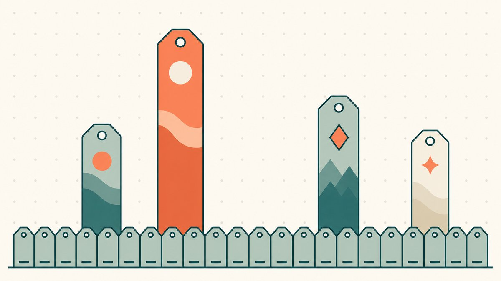
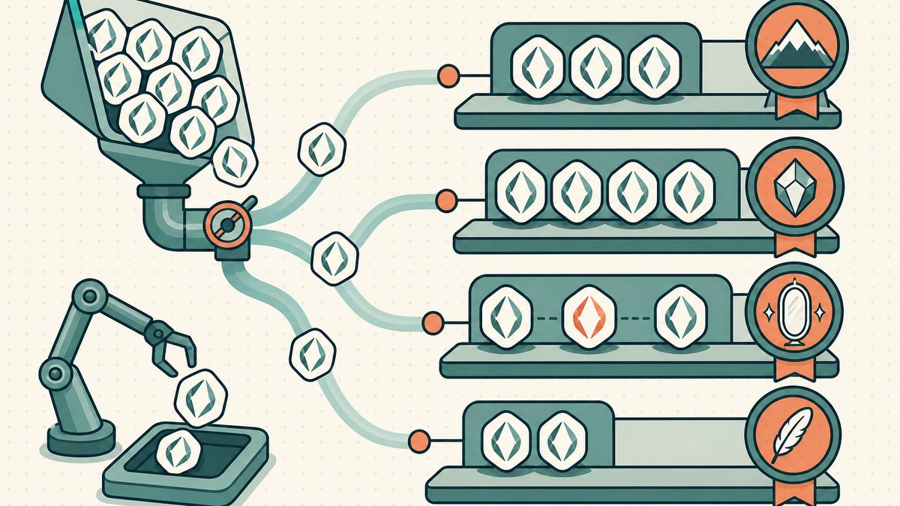

L'évaluation est la compétence qui détermine si un flip rapporte de l'argent. Le sourcing vous dit ce qui est à vendre et la vente transforme un nom en chèque, mais le chiffre du milieu — ce qu'un nom vaut réellement — c'est là que réside la marge. C'est vrai pour un `.com` comme onchain. Le monde onchain peut toutefois fournir ce que le marché secondaire du [DNS](/fr/glossary/dns/) ne peut généralement pas offrir : un historique public et horodaté de propriété et, lorsqu'un protocole de place de marché enregistre la contrepartie, des preuves de transaction auditables. Cela ne constitue pas un registre exhaustif des ventes : certains transferts ne sont pas des ventes, et certains paiements ou termes de la transaction restent offchain. Voici le chapitre évaluation du playbook plus large du [domain flipping](/fr/blog/domain-flipping/), centré sur les deux actifs que vous tradez dans le [domain flipping onchain](/fr/blog/onchain-domain-flipping/) — les noms [ENS](/fr/glossary/ens/) et les domaines ICANN tokenisés.

La méthode est la même que celle qu'utilisent les évaluateurs professionnels et les agents immobiliers : les comps. Comme le définit Wikipédia, [les comparables (ou comps) sont un terme d'évaluation immobilière désignant des biens dont les caractéristiques sont similaires à celles d'un bien de référence dont on cherche la valeur](https://en.wikipedia.org/wiki/Comparables#:~:text=Comparables%20%28or%20comps%29%20is%20a%20real%20estate%20appraisal%20term%20referring%20to%20properties%20with%20characteristics%20that%20are%20similar%20to%20a%20subject%20property). Les domaines n'ont pas de cours coté, vous raisonnez donc à partir du prix auquel des noms similaires se sont récemment vendus. La nuance onchain est qu'une vente déclarée peut souvent être vérifiée au moyen d'événements de place de marché et de paiement propres au protocole, au lieu d'être acceptée sur la seule foi d'une déclaration — mais uniquement lorsque ces événements exposent la contrepartie.

## D'où viennent les comps

Pour les domaines traditionnels, la base de comps canonique est [NameBio](https://namebio.com/), une archive consultable de ventes historiques de [domaines](/fr/glossary/domain-trading/) que vous pouvez filtrer par mot-clé, extension, prix et date. C'est ce qui se rapproche le plus, pour l'aftermarket DNS, d'un flux de prix public : vous recherchez des noms comme celui que vous évaluez, regardez à quel prix ils se sont réellement conclus, et construisez une fourchette défendable à partir des preuves plutôt que d'une intuition. Traitez les chiffres en gros titre comme des estimations — les ventes rapportées penchent vers celles qui valent la peine d'être rapportées, et une base d'affaires conclues ne peut rien vous dire sur les noms qui ne se sont jamais vendus — mais comme point de départ, elle bat tout outil d'évaluation automatisé, ce qui explique pourquoi notre guide sur [comment valoriser un nom de domaine](/fr/blog/how-to-value-a-domain-name/) s'appuie sur les [ventes comparables](/fr/glossary/comparable-sales/) plutôt que sur des algorithmes.

Onchain, les données de comps peuvent être plus riches et sont consultables gratuitement. Un nom ENS ou un domaine tokenisé est un [NFT](/fr/glossary/nft/) sous la norme [ERC-721](/fr/glossary/erc-721/) — que la spécification d'Ethereum décrit comme une [API standard pour les NFT au sein des smart contracts](https://eips.ethereum.org/EIPS/eip-721#:~:text=The%20following%20standard%20allows%20for%20the%20implementation%20of%20a%20standard%20API%20for%20NFTs). Son [événement `Transfer` enregistre un changement de propriété uniquement avec l'expéditeur, le destinataire et l'identifiant du token](https://eips.ethereum.org/EIPS/eip-721#specification) ; il ne qualifie pas le transfert de vente et n'indique aucun prix. La reconstitution d'une vente dépend de la place de marché : l'événement [`OrderFulfilled` de Seaport, par exemple, enregistre des tableaux distincts d'offre et de contrepartie](https://docs.opensea.io/docs/seaport-events-and-errors#orderfulfilled). Les places de marché compatibles peuvent utiliser ces données pour constituer des historiques de ventes, des listings et des floors, mais les transferts entre portefeuilles, les paiements offchain et les lots complexes nécessitent une vérification supplémentaire et peuvent ne pas fournir de comparable exploitable. L'avantage pour l'évaluation réside dans une piste d'audit plus solide, pas dans un registre des ventes automatique ou exhaustif.

## Floor versus premium

Le cadre le plus utile pour une évaluation onchain est floor versus premium, et il colle parfaitement à la façon dont ces actifs s'échangent réellement.

Le **floor** est le nom disponible le moins cher dans une catégorie reconnaissable — le prix demandé le plus bas dans une collection de [place de marché](/fr/glossary/marketplace/). Pour une classe de noms similaires (disons, des noms `.eth` à cinq lettres ou des nombres aléatoires à quatre chiffres), le floor est votre référence : c'est à peu près ce que vaut en ce moment un membre générique et indifférencié de cet ensemble. Les floors évoluent avec le marché et avec le hype, donc tout floor que vous citez est un instantané, pas une constante.

Le **premium** est tout ce qu'un nom spécifique commande au-dessus de ce floor — pour être plus court, un vrai mot du dictionnaire, une marque reconnue ou un petit nombre. L'essentiel du travail d'un évaluateur consiste à justifier le premium : le floor, vous pouvez le lire à l'écran, mais l'écart entre le floor et ce que `crypto.eth` rapporterait est un jugement que vous défendez avec des comps. La discipline consiste à s'ancrer d'abord sur le floor, puis à argumenter le premium à la hausse à partir de ventes comparables, plutôt que de partir d'un chiffre de rêve et de redescendre.

ENS rend cela concret car son propre tarif d'enregistrement est échelonné par longueur. Selon la documentation ENS, un [.eth de 5+ lettres vous coûtera 5 USD par an](https://docs.ens.domains/registry/eth#:~:text=letter%20%60.eth%60%20will%20cost%20you%20%605%20USD%60%20per%20year), tandis que les noms de quatre et trois caractères coûtent plus cher à enregistrer par conception. Ce signal de rareté au niveau du protocole — les noms plus courts coûtent plus cher rien que pour les détenir — vous indique où se concentre le premium avant même que vous ne regardiez une seule vente.

## Rareté ENS et facteurs de club

ENS a une particularité qu'aucune extension DNS ne partage : des paliers de rareté organisés. Les « clubs » sont des ensembles de noms définis purement par la forme, et l'appartenance est un moteur de valeur puissant et lisible.

Les plus connus sont les clubs numériques. Le 999 Club regroupe les 1 000 noms à trois chiffres de `000.eth` à `999.eth` ; le 10k Club regroupe les 10 000 noms à quatre chiffres de `0000.eth` à `9999.eth`. Parce que l'offre de chacun est fixe et minuscule, ils s'échangent comme une série de collection avec un floor visible et une fine traîne de premium. Les nombres sont aussi neutres sur le plan linguistique et difficiles à mal saisir, ce qui fait partie des raisons pour lesquelles ils sont devenus un marché spéculatif à part entière. La même logique s'étend aux chaînes de lettres courtes, aux palindromes et aux noms emoji : plus le motif est rare et lisible, plus le premium au-dessus du floor est épais.

Les ventes plafond montrent jusqu'où s'étend la traîne du premium. La plus grosse vente ENS enregistrée est `paradigm.eth`, que The Block rapporte comme ayant été [achetée en octobre 2021 pour 420 ETH (environ 1,5 million de dollars à l'époque)](https://www.theblock.co/post/155685/ethereum-name-service-records-second-highest-ens-name-sale#:~:text=purchased%20in%20October%202021%20for%20420%20ETH), et `000.eth` — le membre vedette du 999 Club — [a été acheté pour 300 ETH (315 000 $)](https://www.theblock.co/post/155685/ethereum-name-service-records-second-highest-ens-name-sale#:~:text=000.eth%20was%20purchased%20for%20300%20ETH), [ce qui en fait la deuxième plus grosse vente mesurée à la fois en ether et en dollars](https://www.theblock.co/post/155685/ethereum-name-service-records-second-highest-ens-name-sale#:~:text=making%20it%20the%20second%2Dlargest%20sale). Ce sont des cas extrêmes et ils sont libellés en ETH, donc le chiffre en dollars fluctue avec le token — mais ils ancrent le haut de la courbe. Quand vous évaluez un nom de club, vous le situez sur une distribution dont le floor et le plafond sont tous deux observables onchain. Pour situer ces noms par rapport aux autres actifs onchain, voir les [TLD Web3 premium](/fr/blog/premium-web3-tlds/) et la comparaison plus large [ENS vs Unstoppable vs DNS tokenisé](/fr/blog/ens-vs-unstoppable-vs-tokenized-dns/).

## Évaluer un domaine ICANN tokenisé, c'est une évaluation DNS

Voici la ligne que vous ne devez pas brouiller. Un domaine ICANN tokenisé n'est pas un nom ENS avec un label différent — c'est un véritable `.com`, `.xyz` ou `.io` dont la propriété est reflétée sous forme de token, tandis que le nom sous-jacent continue de résoudre partout. Comme le dit notre explication sur [ce que sont les domaines tokenisés](/fr/blog/what-are-tokenized-domains/), ce sont de véritables domaines DNS qui possèdent *en plus* une couche onchain, et non un espace de noms parallèle. La conséquence pratique pour l'évaluation : vous valorisez un `.com` tokenisé comme vous valorisez n'importe quel `.com` — avec des comps DNS issus de NameBio et les fondamentaux habituels de longueur, de demande de mot-clé et de force d'extension — parce que l'acheteur paie pour un nom universellement résolvable, pas pour un handle de portefeuille.

Le jeu de comps se divise donc nettement. Pour évaluer `acme.eth`, vous tirez les ventes ENS et les floors de club, car sa valeur est une identité crypto-native. Pour évaluer un `acme.com` tokenisé, vous tirez les comps `.com`, car sa valeur est une véritable adresse de site web qui se règle simplement onchain. Confondre les deux est l'erreur d'évaluation la plus courante dans ce domaine — un `.com` tokenisé et un `.eth` du même mot racine sont des produits différents avec des acheteurs différents et des comps très différents. Nous parcourons la version trading de cette distinction dans [ENS vs DNS en domain flipping](/fr/blog/ens-vs-dns-domain-flipping/), et la mécanique de pourquoi la tokenisation change le trade dans [comment la tokenisation change le domain flipping](/fr/blog/how-tokenization-changes-domain-flipping/).

## En quoi l'évaluation onchain diffère de l'évaluation DNS

Les entrées se ressemblent, mais quatre choses diffèrent véritablement une fois qu'un nom est un token.

**Les données de comps peuvent être auditées, et non présumées.** Une entrée NameBio est une vente que quelqu'un a choisi de divulguer ; un changement de propriété onchain est un événement de [smart contract](/fr/glossary/smart-contract/) que n'importe qui peut lire, et une vente sur une place de marché peut être vérifiée lorsque le protocole enregistre sa contrepartie. Un simple événement ERC-721 `Transfer` ne suffit pas. Avant de traiter l'événement comme un comparable, vous devez encore identifier le protocole de vente, l'actif de paiement, les éléments regroupés, les composantes offchain et un éventuel wash trading.

**Il existe un floor en direct.** Les noms DNS n'ont pas de floor price ; chacun est sa propre négociation. Une collection de noms onchain en a un, et un floor mouvant change l'évaluation d'heure en heure d'une manière qu'une valorisation `.com` ne fait jamais.

**Une réduction des frictions de règlement est structurelle ; une liquidité de marché accrue ne l'est pas.** Un contrat de place de marché peut échanger le paiement et un token au moyen d'un [transfert atomique](/fr/glossary/atomic-transfer/) — toutes les composantes sont réglées ensemble ou aucune ne l'est —, ce qui réduit les intermédiaires et peut diminuer le délai, le coût et le risque de règlement, comme [l'explique la BRI dans sa présentation du règlement atomique](https://www.bis.org/publ/othp99.htm). Cela améliore la mécanique de règlement, mais n'augmente pas à lui seul la [liquidité des domaines](/fr/glossary/domain-liquidity/) onchain : il ne crée ni demande des acheteurs, ni offre des vendeurs, ni marché bilatéral profond. L'exécution atomique peut supprimer l'agent d'entiercement ou la fenêtre de transfert d'une vente [sous forme de NFT](/fr/blog/selling-domains-as-nfts/). La [Banque fédérale de réserve de New York décrit la liquidité de marché comme multidimensionnelle](https://www.newyorkfed.org/newsevents/speeches/2015/dud150930.html), mesurée notamment par les écarts acheteur-vendeur, la profondeur du marché et l'impact sur les prix ; évaluez ces facteurs séparément de la mécanique de règlement. Nous détaillons le processus de règlement dans [comment les places de marché tokenisées remplacent l'entiercement](/fr/blog/how-tokenized-marketplaces-replace-escrow/).

**Les prix libellés en crypto ajoutent une seconde variable.** La plupart des comps onchain sont cotés en ETH. Un nom « valant 5 ETH » peut osciller de plusieurs milliers de dollars rien que sur les mouvements du token, alors notez toujours si vous évaluez en ETH ou en monnaie fiduciaire — ils racontent des histoires différentes, et traiter un floor en ETH comme un chiffre en dollars stable, c'est ainsi que les évaluations tournent mal.

Le fil conducteur : l'évaluation onchain peut fournir un historique de propriété plus facilement auditable et un règlement plus rapide, ainsi que des données de comps plus riches lorsqu'une place de marché enregistre la contrepartie, mais le savoir-faire de base reste inchangé. Ancrez-vous sur le floor, justifiez le premium avec des ventes comparables vérifiées, et tarifez le bon jeu de comps pour le bon actif. Un `.com` tokenisé sur une plateforme comme [Namefi](https://namefi.io) est évalué comme le véritable domaine qu'il est ; un `.eth` est évalué comme l'objet de collection onchain qu'il est. Trouvez le bon jeu de comps et le reste n'est qu'arithmétique.

## Avertissement amical (À lire !)

> Nous ne sommes ni avocats, ni comptables, ni conseillers financiers, ni médecins, et **rien dans cet article ne constitue un conseil juridique, financier, fiscal, comptable, médical ou tout autre type de conseil professionnel.** Nous écrivons ces articles pour nous instruire nous-mêmes et par commodité pour nos clients. Les informations ici peuvent être obsolètes, spécifiques à une zone géographique, ou tout simplement fausses. Nous faisons des erreurs nous aussi.
>
> Pour toute décision importante, **veuillez consulter un vrai professionnel (sérieusement !)**. Ou si ce n'est pas votre style, demandez à un ami, demandez à Twitter, demandez à Reddit, demandez à une IA, ou demandez à un voyant. En bref : **DOYR - Do Your Own Research (faites vos propres recherches)**. Apprenons et amusons-nous.

## Sources et lectures complémentaires

- Wikipédia — [Comparables (la méthode des comps, l'évaluation par ventes récentes similaires)](https://en.wikipedia.org/wiki/Comparables#:~:text=Comparables%20%28or%20comps%29%20is%20a%20real%20estate%20appraisal%20term%20referring%20to%20properties%20with%20characteristics%20that%20are%20similar%20to%20a%20subject%20property)
- NameBio — [base de données consultable de ventes historiques de noms de domaine](https://namebio.com/)
- Ethereum Improvement Proposals — [ERC-721 : l'événement `Transfer` enregistre `_from`, `_to` et `_tokenId`, pas la contrepartie d'une vente](https://eips.ethereum.org/EIPS/eip-721#specification)
- Documentation OpenSea — [événement `OrderFulfilled` de Seaport avec des tableaux distincts d'offre et de contrepartie](https://docs.opensea.io/docs/seaport-events-and-errors#orderfulfilled)
- Banque des règlements internationaux — [règlement atomique et effets potentiels sur le délai, le coût et le risque de règlement](https://www.bis.org/publ/othp99.htm)
- Banque fédérale de réserve de New York — [les mesures de la liquidité de marché comprennent les écarts acheteur-vendeur, la profondeur du marché et l'impact sur les prix](https://www.newyorkfed.org/newsevents/speeches/2015/dud150930.html)
- Documentation ENS — [tarif du registrar .eth par longueur de nom (5+ lettres = 5 $/an)](https://docs.ens.domains/registry/eth#:~:text=letter%20%60.eth%60%20will%20cost%20you%20%605%20USD%60%20per%20year)
- The Block — [000.eth vendu pour 300 ETH (315 000 $) ; paradigm.eth pour 420 ETH (~1,5 M$, oct. 2021) ; les noms ENS comme NFT sur OpenSea](https://www.theblock.co/post/155685/ethereum-name-service-records-second-highest-ens-name-sale#:~:text=000.eth%20was%20purchased%20for%20300%20ETH)
