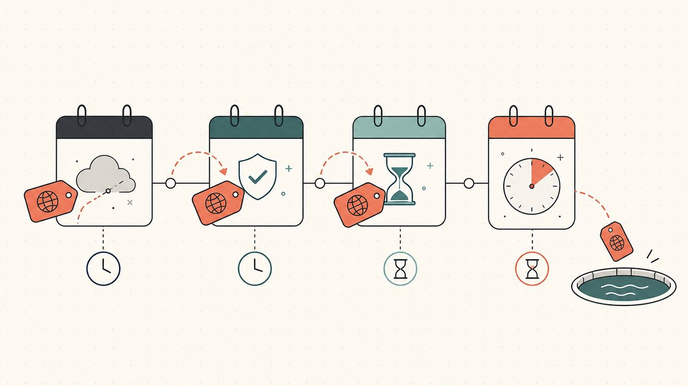

Un nom que vous convoitez est déjà pris. Le propriétaire actuel ne le vend pas, ne répond pas, et pour autant que vous puissiez en juger, ne s''en sert même pas. Alors vous faites la seule chose qu''il vous reste : vous attendez qu''il oublie de le renouveler. À l''instant où cet enregistrement expire et où le nom retombe dans le pool ouvert, vous voulez être celui qui est là pour le saisir.

Voilà tout le jeu qui se cache derrière les backorders et le [drop-catching](/fr/glossary/backorder/). Tous deux sont des façons de parier sur un domaine que vous ne pouvez pas acheter aujourd''hui, sur la chance de pouvoir l''enregistrer à l''instant où il se libère. Ce ne sont pas la même chose, la différence compte, et la plupart du temps, la réponse honnête à « devrais-je payer pour ça ? » est non. Cet explicatif couvre ce qu''est chacun, comment la course se déroule au moment où un nom se libère, les principaux services qui s''en chargent, et l''étroit ensemble de cas où un backorder vaut la peine d''être payé. Il fait partie de la [série de compétences sur le domain flipping](/fr/blog/domain-flipping/), aux côtés de notre pilier sur [comment trouver des domaines à revendre](/fr/blog/how-to-find-domains-to-flip/).

## D''abord, pourquoi un nom « tombe » tout court

Un domaine n''est pas vendu une fois pour toutes et conservé à jamais. Il est [enregistré](/fr/glossary/registrar/) pour une durée et doit être renouvelé, et quand un propriétaire cesse de payer, le nom ne disparaît pas instantanément. Il traverse un cycle de vie fixe de périodes de grâce avant de revenir sur le marché ouvert, et cette chronologie est tout le fondement de l''attrapage d''un nom. Nous couvrons le cycle complet dans [les domaines expirés et le cycle de chute](/fr/blog/expired-domains-and-the-drop-cycle/) ; voici la partie qui compte pour l''attrapage.

Après l''expiration, le [registre](/fr/glossary/registry/) fait passer le nom par une fenêtre de récupération. Comme le décrit Wikipédia, la [Redemption Grace Period](/fr/glossary/redemption-period/) est [an addition to ICANN's Registrar Accreditation Agreement (RAA) which allows a registrant to reclaim their domain name for a number of days after it has expired](https://en.wikipedia.org/wiki/Domain_drop_catching#:~:text=an%20addition%20to%20ICANN%27s%20Registrar%20Accreditation%20Agreement%20%28RAA%29%20which%20allows%20a%20registrant%20to%20reclaim%20their%20domain%20name%20for%20a%20number%20of%20days%20after%20it%20has%20expired). Pendant le rachat, un propriétaire peut encore récupérer le nom, mais pas à bon marché — Wikipédia note que le propriétaire [may be required to pay a fee (typically around US$100)](https://en.wikipedia.org/wiki/Domain_drop_catching#:~:text=may%20be%20required%20to%20pay%20a%20fee%20%28typically%20around%20US%24100%29) pour le réactiver. La durée de cette période dépend de l''extension ; selon Wikipédia, [this length of time varies by TLD, and is usually around 30 to 90 days](https://en.wikipedia.org/wiki/Domain_drop_catching#:~:text=This%20length%20of%20time%20varies%20by%20TLD%2C%20and%20is%20usually%20around%2030%20to%2090%20days).

Ce n''est qu''ensuite que le nom entre dans son compte à rebours final. Comme le formule Wikipédia, [at the end of the "pending delete" phase of 5 days, the domain will be dropped from the ICANN database](https://en.wikipedia.org/wiki/Domain_drop_catching#:~:text=At%20the%20end%20of%20the%20%22pending%20delete%22%20phase%20of%205%20days%2C%20the%20domain%20will%20be%20dropped). Cette [chute](/fr/glossary/pending-delete/) est le moment que tout le monde attend. À l''instant où le nom quitte la base de données, il redevient une chaîne de caractères ordinaire non enregistrée, et celui qui l''enregistre en premier le possède. Le hic, c''est que « le premier » peut être un concours qui se décide en millisecondes.

## Drop-catching : gagner la milliseconde

Le drop-catching, c''est l''approche en force : vous (ou, réalistement, un service agissant pour vous) tentez d''enregistrer le nom à l''instant littéral où il est supprimé. La définition de Wikipédia est claire — le drop catching, aussi appelé domain sniping, est [the practice of registering a domain name once registration has lapsed, immediately after expiry](https://en.wikipedia.org/wiki/Domain_drop_catching#:~:text=is%20the%20practice%20of%20registering%20a%20domain%20name%20once%20registration%20has%20lapsed%2C%20immediately%20after%20expiry).

Vous ne pouvez pas gagner cette course à la main. Les bons noms sont supprimés selon un calendrier prévisible, et une foule de services professionnels martèle le registre à la même seconde que vous. Comme le décrit la littérature sur la spéculation de domaines, [the business of registering the domain names as they are deleted by the registries is known as drop catching. It is a highly competitive business](https://en.wikipedia.org/wiki/Domain_name_speculation#:~:text=The%20business%20of%20registering%20the%20domain%20names%20as%20they%20are%20deleted%20by%20the%20registries%20is%20known%20as%20drop%20catching.%20It%20is%20a%20highly%20competitive%20business), et le concours est d''une rapidité brutale : [the time between a drop and a capture is often measured in seconds or fractions thereof](https://en.wikipedia.org/wiki/Domain_name_speculation#:~:text=The%20time%20between%20a%20drop%20and%20a%20capture%20is%20often%20measured%20in%20seconds%20or%20fractions%20thereof).

C''est pour cela que les services de drop-catching existent et remportent des noms que vous ne pourriez jamais obtenir depuis une page de paiement de [bureau d''enregistrement](/fr/glossary/registrar/) ordinaire. Les attrapeurs sérieux détiennent de nombreuses accréditations de bureau d''enregistrement et exploitent des fermes de serveurs braquées sur la file de suppression du registre. Wikipédia décrit le modèle simplement : ces services [offer to dedicate their servers to securing a domain name upon its availability, usually at an auction price](https://en.wikipedia.org/wiki/Domain_drop_catching#:~:text=offer%20to%20dedicate%20their%20servers%20to%20securing%20a%20domain%20name%20upon%20its%20availability%2C%20usually%20at%20an%20auction%20price). Cette dernière clause est la partie que les débutants ratent. Si un service attrape un nom que plus d''un client voulait, vous ne l''obtenez pas au prix de l''enregistrement — il part en [enchère](/fr/glossary/auction/) parmi les backorderers intéressés, et une capture disputée sur un nom convoité peut se conclure pour des centaines, voire des milliers de dollars. La mécanique de ces guerres d''enchères est une compétence à part entière, couverte dans [comment remporter des enchères de domaines](/fr/blog/how-to-win-domain-auctions/).

## Backorders : réserver votre place avant la chute

Un backorder est la réservation que vous placez à l''avance. Au lieu de tenter frénétiquement d''enregistrer un nom au moment de la chute, vous dites à un service « si ce nom devient disponible, essaie de l''attraper pour moi », généralement contre des frais forfaitaires payés d''avance. Wikipédia formule la différence avec netteté : un backorder donne la priorité, parce que [the owner of the back-order will be given the first opportunity to acquire the domain name before the name is deleted and is open to a free-for-all. In this way back-orders will usually take precedence over drop-catch](https://en.wikipedia.org/wiki/Domain_drop_catching#:~:text=the%20owner%20of%20the%20back%2Dorder%20will%20be%20given%20the%20first%20opportunity%20to%20acquire%20the%20domain%20name).

Sous le capot, un backorder est souvent exécuté par la même machinerie de drop-catching, simplement pointée vers votre demande. La littérature sur la spéculation de domaines décrit comment un réseau de bureaux d''enregistrement met sa puissance de feu en commun : [if the domain is caught by a confederation of registrars attempting to fulfill a domain backorder, then whichever domain registrar caught the domain will register it to the entity who backordered the domain](https://en.wikipedia.org/wiki/Domain_name_speculation#:~:text=If%20the%20domain%20is%20caught%20by%20a%20confederation%20of%20registrars%20attempting%20to%20fulfill%20a%20domain%20backorder). Autrement dit, vous n''achetez pas une garantie. Vous achetez l''accès à la tentative de capture la plus puissante disponible, plus une place dans la file devant la mêlée ouverte.

Il y a un deuxième modèle qu''il vaut la peine de connaître, car il change ceux contre qui vous êtes en concurrence. Certains bureaux d''enregistrement ne laissent jamais un nom tomber dans le pool public. Comme le note la littérature, certains bureaux d''enregistrement [do not allow domains to drop in the normal fashion, instead introducing an intermediary (e.g., Snapnames and Namejet) that auction the domain prior to their deletion](https://en.wikipedia.org/wiki/Domain_name_speculation#:~:text=do%20not%20allow%20domains%20to%20drop%20in%20the%20normal%20fashion%2C%20instead%20introducing%20an%20intermediary). Quand cela arrive, le nom n''atteint jamais la file de suppression du registre pour laquelle vous courriez, et la seule façon de l''obtenir passe par la plateforme d''enchères partenaire de ce bureau d''enregistrement. Savoir si un nom va tomber publiquement ou être détourné vers une enchère d''expiration privée vous indique auprès de quel service placer votre backorder — et parfois que vous ne pouvez pas l''attraper du tout, seulement surenchérir pour l''obtenir.

## Les services qui courent pour vous

La plupart des flippers interagissent avec le drop-catching à travers une poignée de plateformes. Elles se recoupent et se spécialisent par extension, et la bonne dépend de l''endroit où un nom est enregistré et du [TLD](/fr/glossary/tld/) dans lequel il se trouve.

- **DropCatch** est la plateforme de pur drop-catch la plus connue pour le [`.com`](/fr/tld/com/) et les autres gTLD historiques. Vous faites un backorder sur un nom en suppression en attente, le service lance sa flotte de bureaux d''enregistrement sur la suppression, et si plus d''un utilisateur a fait un backorder sur le même nom, cela se règle par enchère. C''est le choix par défaut pour attraper les suppressions publiques à grande échelle.
- **SnapNames** et **NameJet** sont les intermédiaires classiques d''enchères d''expiration — les [Snapnames and Namejet](https://en.wikipedia.org/wiki/Domain_name_speculation#:~:text=instead%20introducing%20an%20intermediary%20%28e.g.%2C%20Snapnames%20and%20Namejet%29) nommés plus haut. Leur force, ce sont les noms qui ne tombent jamais publiquement parce qu''un bureau d''enregistrement partenaire leur achemine d''abord son inventaire expirant. Si un nom que vous convoitez se trouve chez l''un de leurs bureaux d''enregistrement partenaires, c''est là qu''il fera surface.
- **Dynadot** est un bureau d''enregistrement complet qui propose aussi des services de backorder et d''enchères d''expiration, de sorte que vous pouvez réserver une capture au même endroit où vous enregistreriez normalement. Pour mémoire, Wikipédia l''identifie comme [an ICANN-accredited domain registrar and web host company founded by software engineer Todd Han in 2002](https://en.wikipedia.org/wiki/Dynadot#:~:text=is%20an%20ICANN%2Daccredited%20domain%20registrar%20and%20web%20host%20company%20founded%20by%20software%20engineer%20Todd%20Han%20in%202002).
- **Park.io** s''est forgé sa réputation en attrapant des extensions plus récentes et des codes pays — le genre de noms où la couverture d''un attrapeur généraliste est plus mince. Si vous poursuivez un nom sur un TLD moins grand public, un spécialiste est souvent la seule chance réaliste.

Le geste pratique consiste à déterminer, avant de payer qui que ce soit, *comment* un nom précis va devenir disponible. Se dirige-t-il vers une suppression publique de registre (utilisez un drop-catcher), ou son bureau d''enregistrement va-t-il le détourner vers une enchère d''expiration privée (il vous faudra cette plateforme) ? Placer le même backorder auprès de deux services visant la même chute publique est surtout de l''argent gaspillé ; le placer auprès de l''unique service qui contrôle le chemin que prendra votre nom, c''est là toute la compétence.

## Quand un backorder vaut vraiment la peine d''être payé

Les backorders sont peu coûteux à placer et faciles à placer en excès, ce qui est précisément le piège. Voici le filtre honnête.

**Payez pour un backorder quand le nom est véritablement rare et que vous avez un usage précis.** Un `.com` propre en un seul mot, un nom court et brandable, ou un nom en correspondance exacte avec un projet que vous construisez réellement vaut des frais de backorder et même un budget d''enchères modeste, parce que s''il tombe publiquement il sera disputé et vous le perdrez sans attrapeur. C''est aussi vrai pour un nom ancien doté d''un historique réel et vérifiable — des backlinks ou un trafic existants qui survivent au transfert — ce qui constitue un canal d''approvisionnement différent de l''[enregistrement à la main de noms tout neufs à revendre](/fr/blog/hand-registering-domains-to-flip/).

**Passez votre chemin quand le nom n''est pas vraiment rare.** Si une chaîne quasi identique est disponible à l''enregistrement manuel dès maintenant pour le prix d''un enregistrement ordinaire, payer des frais de backorder et risquer une enchère pour la version expirante est généralement un mauvais marché. La chute ne compte que lorsque le nom *précis* est l''actif et qu''aucun substitut ne fera l''affaire.

**Partez du principe que vous pourriez perdre, et fixez votre prix en conséquence.** Un backorder est une tentative, pas un achat. Sur un nom convoité, vous pouvez être surenchéri dans l''enchère post-capture, ou devancé par un service doté de plus de puissance de feu. Budgétisez les frais comme le coût d''un billet de loterie aux chances décentes, pas comme un acompte sur un nom que vous possédez déjà.

**Surveillez la ligne des marques.** Attraper un nom expiré ne blanchit pas son historique. Si la chaîne est la marque de quelqu''un, le fait qu''elle ait expiré ne la rend pas sûre à saisir et à revendre. Le cadre [UDRP](/fr/glossary/udrp/) s''applique toujours, et un nom expiré associé à une [marque commerciale](/fr/glossary/trademark/) est exactement le genre de chose qui déclenche un litige, comme nous le couvrons dans [qu''est-ce que l''UDRP](/fr/blog/what-is-udrp/). Attrapez des noms génériques et brandables, pas des marques tombées en déshérence.

Une dernière note de diligence propre aux noms attrapés : un domaine expiré peut traîner un passif qu''un enregistrement neuf n''aurait jamais, comme un historique de spam ou une pénalité Google. Avant d''enchérir gros, vérifiez son passé dans le [WHOIS](/fr/glossary/whois/) et les archives. L''historique d''un nom se transfère avec lui.

## Après la capture : le posséder pour de bon

Remporter la capture, c''est le début, pas la fin. Le nom atterrit dans un compte chez le bureau d''enregistrement qui l''a attrapé, et le transformer en un actif propre et revendable suppose d''en obtenir un véritable [contrôle](/fr/glossary/domain-ownership/) — le [code d''autorisation](/fr/glossary/auth-code/), la capacité de réaliser un [transfert inter-registrar](/fr/glossary/cross-registrar-transfer/) vers votre bureau d''enregistrement habituel, et la certitude que le [WHOIS](/fr/glossary/whois/) et le DNS sont les vôtres. Ce transfert est l''endroit où les noms de grande valeur deviennent nerveux, car le bras de fer hante chaque [transaction de domaine](/fr/glossary/domain-trading/) : personne ne veut bouger en premier.

C''est cette friction que [Namefi](https://namefi.io) est conçu pour réduire. La propriété tokenisée rend le contrôle d''un véritable domaine [ICANN](/fr/glossary/icann/) plus facile à vérifier et à transférer, avec une continuité DNS pour qu''un nom attrapé continue de résoudre proprement tout au long du transfert. Quand vous le revendez, la mécanique standard — la mise en vente, la fixation du prix et un transfert sous [séquestre](/fr/glossary/escrow/) neutre — est couverte dans [comment vendre un nom de domaine que vous possédez](/fr/blog/how-to-sell-a-domain-name-you-own/) et [le séquestre de domaine expliqué](/fr/blog/domain-escrow-explained/).

## La version courte

Le drop-catching est la course pour enregistrer un nom à l''instant où il est supprimé ; un backorder est votre tentative réservée et prioritaire dans cette course, généralement menée sur la même machinerie. Payez pour un backorder quand le nom *précis* est rare et que vous en avez un usage réel, dirigez-le vers le service qui contrôle la façon dont ce nom va réellement se libérer, et ne traitez jamais une capture comme un achat tant que le nom n''est pas transféré et propre. La plupart du temps, la réponse disciplinée est de le laisser filer — et cette discipline est ce qui sépare un portefeuille d''une facture de renouvellement.

## Avertissement amical (À lire !)

> Nous ne sommes ni avocats, ni comptables, ni conseillers financiers, ni médecins, et **rien dans cet article ne constitue un conseil juridique, financier, fiscal, comptable, médical ou de quelque autre nature professionnelle que ce soit.** Nous écrivons ces articles pour nous instruire nous-mêmes et par commodité pour nos clients. Les informations qui s''y trouvent peuvent être obsolètes, propres à une région, ou tout simplement erronées. Nous faisons des erreurs nous aussi.
>
> Pour toute décision importante, **veuillez consulter un vrai professionnel (sérieusement !)**. Ou si ce n''est pas votre truc, demandez à un ami, demandez à Twitter, demandez à Reddit, demandez à une IA, ou demandez à un voyant. En bref : **DOYR - Do Your Own Research (faites vos propres recherches)**. Apprenons et amusons-nous.

## Sources et lectures complémentaires

- Wikipédia — [Domain drop catching (definition, redemption grace period, pending delete, backorder precedence)](https://en.wikipedia.org/wiki/Domain_drop_catching#:~:text=is%20the%20practice%20of%20registering%20a%20domain%20name%20once%20registration%20has%20lapsed%2C%20immediately%20after%20expiry)
- Wikipédia — [Domain name speculation (drop catching as a competitive business; backorder confederation; expiry-auction intermediaries)](https://en.wikipedia.org/wiki/Domain_name_speculation#:~:text=The%20business%20of%20registering%20the%20domain%20names%20as%20they%20are%20deleted%20by%20the%20registries%20is%20known%20as%20drop%20catching.%20It%20is%20a%20highly%20competitive%20business)
- Wikipédia — [Dynadot (ICANN-accredited registrar, founded 2002)](https://en.wikipedia.org/wiki/Dynadot#:~:text=is%20an%20ICANN%2Daccredited%20domain%20registrar%20and%20web%20host%20company%20founded%20by%20software%20engineer%20Todd%20Han%20in%202002)
