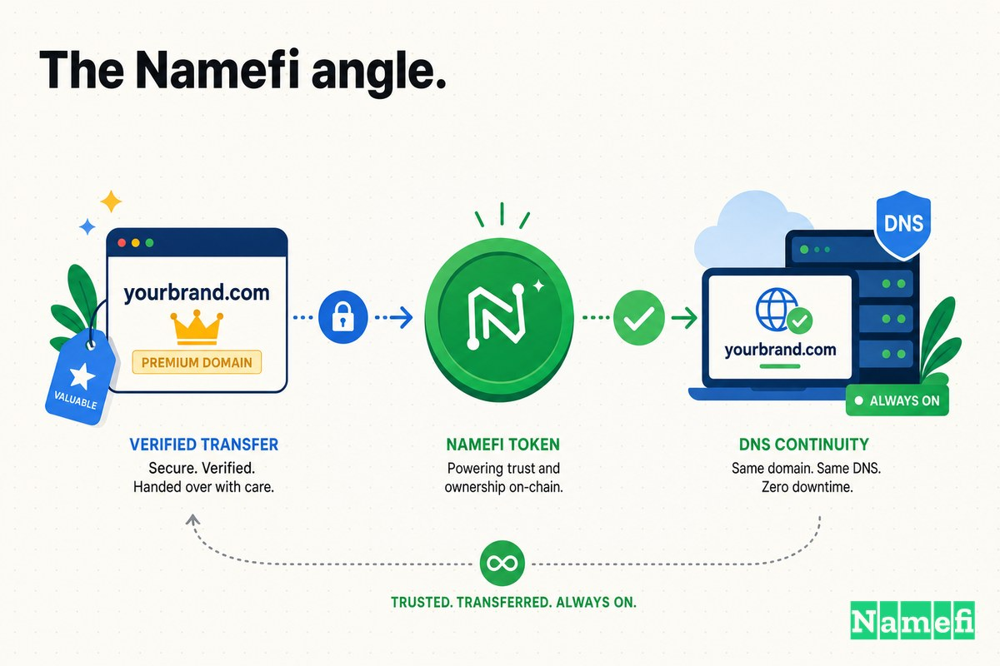

Pendant près de vingt ans, la plus grande entreprise de voyage en ligne du monde a répondu à un nom qui fonctionnait parfaitement dans un pays et presque nulle part ailleurs : **Ctrip.com**.

Le nom était honnête. Lorsque James Liang et trois co-fondateurs ont créé la société à Shanghai en juin 1999, « Ctrip » — le C faisant un clin d'œil à la Chine — décrivait exactement ce qu'elle était : un service de voyage chinois pour les voyageurs chinois. Wikipedia indique que la société [a été fondée sous le nom de Ctrip.com par James Liang, Neil Shen, Min Fan et Qi Ji en juin 1999](https://en.wikipedia.org/wiki/Trip.com_Group#:~:text=founded%20as%20Ctrip.com%20by%20James%20Liang%2C%20Neil%20Shen%2C%20Min%20Fan%2C%20and%20Qi%20Ji%20in%20June%201999). Elle a connu une croissance extraordinaire, et en 2003, elle [a été cotée au NASDAQ](https://en.wikipedia.org/wiki/Trip.com_Group#:~:text=listed%20on%20the%20NASDAQ) lors d'une introduction en bourse pilotée par Merrill Lynch qui a levé 75 millions de dollars US — faisant partie de la première vague d'introductions en bourse d'internet grand public chinois.

En Chine, Ctrip.com était la référence incontournable. C'était la valeur par défaut, le verbe, l'endroit où des centaines de millions de personnes allaient pour réserver un vol ou un hôtel. Mais dès que l'entreprise regardait au-delà de son marché d'origine, le nom devenait un mur. « Ctrip » se lit aisément pour un locuteur mandarin. Pour un voyageur à Londres ou à Séoul, c'est un assemblage de consonnes peu familier qui signale, avant toute chose, qu'il s'agit d'une entreprise *chinoise* — dont le nom sera difficile à épeler, à prononcer ou à mémoriser.

Ainsi, en 2017, le géant chinois du voyage a fait quelque chose qui ressemblait, à première vue, à un acte anodin. Il a acheté un nom de domaine. Pas un concurrent, pas un marché — un seul mot anglais premium suivi d'un `.com` : **Trip.com**. Deux ans plus tard, ce domaine ne serait plus seulement un produit. Il deviendrait le nom de toute la société.

## 1999–2017 : l'entreprise qui dominait la Chine et presque rien d'autre

Au milieu des années 2010, Ctrip avait conquis son marché domestique si complètement qu'il n'y restait presque plus rien à gagner. Elle avait absorbé ou surpassé la plupart de ses concurrents nationaux et était devenue, comme de nombreux médias le décriront plus tard, la plus grande agence de voyage en ligne de Chine — et selon certaines mesures, la plus grande du monde. Mais presque toute cette envergure se trouvait à l'intérieur d'une seule frontière.

Les chiffres étaient éloquents. Comme le rapportait le South China Morning Post, Ctrip [prévoyait de faire passer la proportion de son chiffre d'affaires total provenant de clients internationaux de 2 % à au moins 20 % sur les cinq prochaines années, en s'appuyant sur la marque Trip.com récemment acquise](https://www.scmp.com/tech/article/2156222/china-travel-giant-ctrip-wants-book-bigger-seat-international-markets-tripcom#:~:text=plans%20to%20boost%20the%20proportion%20of%20total%20revenue%20it%20makes%20from%20overseas%20customers%20from%202%20per%20cent%20to%20at%20least%2020%20per%20cent%20over%20the%20next%20five%20years%2C%20using%20its%20recently-acquired%20Trip.com%20brand). Deux pour cent. Une entreprise qui dominait le plus grand marché du voyage sur terre ne représentait, à l'international, qu'une erreur d'arrondi.

L'ambition était déjà mondiale même si les revenus ne l'étaient pas. Liang présentait l'ensemble du secteur comme un jeu d'échelle : le voyage, affirmait-il, [sera finalement un jeu où le gagnant remporte tout](https://www.scmp.com/tech/article/2156222/china-travel-giant-ctrip-wants-book-bigger-seat-international-markets-tripcom#:~:text=travel%20will%20be%20a%20winner%20takes%20all%20game%20in%20the%20end). Et l'objectif était explicite : [prendre une grande part du marché mondial du tourisme et battre des concurrents comme Expedia est désormais un objectif central pour Ctrip](https://www.scmp.com/tech/article/2156222/china-travel-giant-ctrip-wants-book-bigger-seat-international-markets-tripcom#:~:text=Taking%20a%20big%20slice%20of%20the%20global%20tourism%20market%20and%20beating%20competitors%20like%20Expedia%20is%20now%20a%20key%20focus%20for%20Ctrip).

Mais on ne peut pas battre Expedia.com et Booking.com avec une marque que la plupart du monde ne sait pas prononcer. Le nom descriptif ancré en Chine, qui avait été un tremplin parfait à domicile, était désormais un plafond à l'étranger. Ctrip.com était le bon domaine pour les dix-huit premières années — et le mauvais pour l'entreprise qu'elle s'apprêtait à devenir.

## 2017 : l'achat de Trip.com à une startup appelée Gogobot

Ctrip a donc cherché un meilleur nom. Elle a acquis l'un des domaines les plus convoités de toute l'industrie du voyage — `Trip.com` — en achetant la société qui le détenait.

Cette société était Gogobot, une startup de recommandations de voyage basée à San Francisco qui s'était récemment rebaptisée autour de ce domaine. ChinaTravelNews a rendu compte de l'opération sans détour : [Ctrip a récemment finalisé son acquisition de la plateforme de réservation de voyage américaine Trip.com (anciennement Gogobot) qui propose des recommandations de voyage personnalisées](https://www.chinatravelnews.com/article/118274/#:~:text=Ctrip%20has%20recently%20completed%20its%20acquisition%20of%20US%20travel%20booking%20platform%20Trip.com%20%28formerly%20Gogobot%29%20that%20offers%20personalized%20travel%20recommendations). Le prix n'a jamais été divulgué publiquement.

L'essentiel, c'est que Ctrip n'achetait pas vraiment un moteur de recommandations. Elle achetait l'adresse. Avec Trip.com en main, l'entreprise disposait désormais de deux marques mondiales claires en anglais à déployer en parallèle — une structure que les analystes ont immédiatement reconnue. Comme l'a formulé un observateur du secteur, Ctrip pouvait utiliser [Skyscanner pour la méta-recherche et Trip.com pour l'OTA plein service](https://www.chinatravelnews.com/article/118274/#:~:text=Skyscanner%20for%20metasearch%20and%20Trip.com%20for%20full-service%20OTA) : la marque de recherche de voyage achetée en 2016, et désormais la marque de réservation tout juste acquise, toutes deux arborant des noms qu'un voyageur occidental pouvait réellement utiliser.

## L'odyssée de vingt ans du domaine avant Ctrip

Voici ce qui fait de Trip.com un actif aussi extraordinaire : au moment où Ctrip l'a acheté, le domaine avait déjà traversé presque un quart de siècle d'histoire de l'industrie du voyage. Skift a retracé son odyssée complète, et la chaîne de possession se lit comme une carte de toute l'ère du voyage en ligne.

Le domaine a été enregistré pour la première fois en 1996, par un homme que l'entrepreneur originel Antoine Toffa ne se souvient que sous le nom de [« M. Trip » de Trip Software Systems](https://finance.yahoo.com/news/trip-com-nearly-quarter-century-063018580.html#:~:text=Mr.%20Trip%22of%20Trip%20Software%20Systems). Toffa [l'a ensuite acheté en 1998 pour 5 000 dollars](https://finance.yahoo.com/news/trip-com-nearly-quarter-century-063018580.html#:~:text=purchased%20it%20from%20him%20in%201998%20for%20%245%2C000), et a construit un premier site de voyage autour de lui. L'argent important est arrivé rapidement : la société de technologie de voyage Galileo [a acquis le reste de la société en 2000 pour 214,4 millions de dollars en espèces et en actions](https://finance.yahoo.com/news/trip-com-nearly-quarter-century-063018580.html#:~:text=acquired%20the%20rest%20of%20the%20company%20in%202000%20for%20%24214.4%20million%20in%20cash%20and%20stock).

Puis le domaine a traversé un long cycle de mort et de résurrection. Après que Cendant a absorbé Galileo, il [a fermé Trip.com en 2003](https://finance.yahoo.com/news/trip-com-nearly-quarter-century-063018580.html#:~:text=shut%20down%20Trip.com%20in%202003) — la première mort de la marque. En 2009, [Orbitz Worldwide a ressuscité la marque Trip.com](https://finance.yahoo.com/news/trip-com-nearly-quarter-century-063018580.html#:~:text=Orbitz%20Worldwide) en tant que site de méta-recherche, avant qu'elle ne retombe dans l'oubli. Gogobot a finalement acheté l'URL à Expedia pour un montant non divulgué et [a changé de nom pour devenir Trip.com](https://finance.yahoo.com/news/trip-com-nearly-quarter-century-063018580.html#:~:text=Gogobot%20then%20rebranded%20to%20become%20Trip.com). Et finalement, [Ctrip a acquis Gogobot-devenu-Trip.com en 2017](https://finance.yahoo.com/news/trip-com-nearly-quarter-century-063018580.html#:~:text=Ctrip%20acquired%20Gogobot-turned%20Trip.com%20in%202017).

Un domaine qui avait débuté comme un achat à 5 000 dollars en 1998 avait, d'ici 2000, été intégré dans une acquisition de 214,4 millions de dollars. Il avait survécu à trois propriétaires différents et à deux fermetures. Le mot « Trip » suivi de « [.com](/fr/tld/com/) » était tout simplement trop précieux dans le domaine du voyage pour rester enfoui — et une entreprise chinoise en quête du marché mondial était exactement le type d'acheteur motivé pour enfin lui donner une utilisation permanente.

## L'argent avait une autre valeur à l'époque

Il est tentant de regarder Trip.com aujourd'hui — la marque mondiale d'une entreprise valant des dizaines de milliards — et de supposer que l'acheter était une évidence. Ce n'était pas le cas.

Ctrip n'a jamais révélé ce qu'elle a payé Gogobot, et l'opération a été structurée comme une acquisition d'entreprise, non comme un simple achat de domaine, ce qui brouille tout prix unitaire. Mais les comparables historiques racontent comment un domaine de voyage premium accumule de la valeur. La même chaîne de lettres a changé de mains pour 5 000 dollars en 1998 et a été intégrée dans une transaction de 214,4 millions de dollars deux ans plus tard. Le prix de « Trip.com » n'a jamais été lié au coût d'enregistrement d'un domaine. Il était lié à l'intensité du besoin qu'en avait l'acheteur — ce seul mot qui rendait une catégorie entière intelligible.

Et en 2017, Ctrip en avait besoin de manière pressante. C'était une entreprise avec une envergure écrasante à domicile et presque aucune à l'étranger — 2 % du chiffre d'affaires venant de l'international — qui pariait qu'elle pouvait atteindre 20 % et défier Expedia sur le terrain ouvert. Dépenser de l'argent réel pour un *nom*, plutôt que pour des stocks, de la technologie ou du marketing, ne fait sens que si l'on traite le domaine comme le fondement sur lequel tout le reste sera construit. Ctrip s'apprêtait à demander à l'ensemble du monde non chinois d'apprendre une nouvelle marque. La manière la moins coûteuse de faire adhérer cette marque était d'en faire un mot que les voyageurs connaissaient déjà : trip.

## Pourquoi le passage à Trip.com était important

L'écart entre Ctrip.com et Trip.com est d'une lettre. Stratégiquement, c'est la différence entre un champion national et un champion mondial.

**Ctrip.com** signale son origine avant de signaler sa fonction — le « C » est un drapeau, et un drapeau peu familier. **Trip.com** ne signale rien d'autre que l'action pour laquelle vous êtes venu. Il est générique dans le meilleur sens du terme : un nom commun anglais simple que chaque voyageur sur terre comprend déjà, détenant le `.com` en correspondance exacte, et pouvant être épelé du premier coup. Un nom demande au monde d'en apprendre plus sur une entreprise chinoise. L'autre propose simplement de vous aider à faire un voyage.

| Avant | Après |
| --- | --- |
| Ctrip.com | Trip.com |
| Se lit comme « un site de voyage chinois » | Se lit comme « le site de voyage » |
| Origine d'abord : le « C » signale le pays | Fonction d'abord : le mot *est* la catégorie |
| Difficile à épeler, prononcer et mémoriser à l'étranger | Un nom commun anglais que tout le monde connaît déjà |
| Le nom d'un champion national | Le nom d'une catégorie mondiale |

C'est le même schéma qui se retrouve dans les grands changements de domaine : les premiers noms *expliquent qui vous êtes*, les grands noms *s'approprient ce que vous faites*. Ctrip.com était un nom parfait pour conquérir la Chine. Trip.com était le nom pour conquérir partout ailleurs — et l'entreprise ne pouvait pas avoir la deuxième stratégie sans d'abord posséder le deuxième domaine.

## Une marque chinoise s'ingéniant à ne plus apparaître comme telle

Ce qui rend ce cas inhabituel, c'est la délibération avec laquelle Ctrip a entrepris de se défaire de sa propre identité nationale. Il ne s'agissait pas d'un rebranding accidentel. C'était, selon les propres termes de l'entreprise, une opération chirurgicale.

En rapportant le relancement mondial, Marketing-Interactive a décrit l'objectif de Liang dans ses propres mots : il voulait [éliminer toute référence à l'appartenance chinoise de l'entreprise à travers ce qu'il a appelé « un rebranding de l'intérieur vers l'extérieur »](https://www.marketing-interactive.com/ctrip-launches-global-rebrand-to-trip-com#:~:text=He%20wants%20to%20eliminate%20any%20reference%20to%20being%20Chinese-owned%20through%20what%20he%20called%20%E2%80%98an%20inside-out%20rebranding%E2%80%99). La nouvelle marque Trip.com [voit même l'entreprise retirer son emblématique dauphin du logo, et changer la couleur et la police de caractères du logo](https://www.marketing-interactive.com/ctrip-launches-global-rebrand-to-trip-com#:~:text=removing%20its%20iconic%20dolphin%20from%20the%20logo%2C%20and%20changing%20the%20logo%E2%80%99s%20colour%20and%20font) — l'identité visuelle reconstruite pour correspondre au nouveau nom neutre en termes de géographie. Le site relancé a été conçu pour servir directement les voyageurs internationaux : Yicai Global a rapporté que [Trip.com proposera des services de réservation de voyage tout-en-un en 13 langues](https://www.yicaiglobal.com/news/china-leading-online-travel-services-provider-ctrip-goes-through-inside-out-rebranding-unveils-new-global-site#:~:text=Trip.com%20will%20provide%20one-stop%20travel%20booking%20services%20in%2013%20languages) via son site web et son application mobile.

La logique derrière tout cela était toujours la même : l'échelle. Comme Liang l'a dit au SCMP, un seul marché ne suffit pas pour être compétitif — [le marché du voyage est un marché mondial. Si vous n'opérez que sur un seul marché, vous ne pouvez pas réaliser les économies d'échelle nécessaires pour être compétitif](https://www.scmp.com/tech/article/2156222/china-travel-giant-ctrip-wants-book-bigger-seat-international-markets-tripcom#:~:text=The%20travel%20market%20is%20a%20global%20market.%20If%20you%E2%80%99re%20just%20doing%20one%20market%2C%20you%20can%E2%80%99t%20realise%20the%20economies%20of%20scale%20to%20compete). Un nom qui diffusait « entreprise chinoise » à chaque utilisateur occidental créait de la friction exactement dans les marchés où Ctrip voulait des économies d'échelle. Trip.com a effacé cette friction par conception — un mot anglais générique, sans appartenance apparente, qui permettait à une société shanghaïenne de se présenter à un voyageur à Londres comme, tout simplement, un endroit pour réserver un voyage.

## 2019 : le domaine est devenu l'entreprise

Pendant deux ans, Trip.com a été une marque que l'entreprise possédait. Puis elle est devenue le nom que l'entreprise *était*.

En octobre 2019, lors de la célébration de son 20e anniversaire, la société mère a soumis le changement de nom au vote des actionnaires — et il a été approuvé. Xinhua a rapporté que [la plus grande agence de voyage en ligne de Chine, Ctrip, a décidé de changer son nom officiel](http://www.xinhuanet.com/english/2019-10/29/c_138513249.htm#:~:text=China%E2%80%99s%20largest%20online%20travel%20agency%20Ctrip%20has%20decided%20to%20change%20its%20official%20name), et que [les actionnaires de la société ont approuvé le changement de nom de la société de « Ctrip.com International, Ltd. » à « Trip.com Group Limited »](http://www.xinhuanet.com/english/2019-10/29/c_138513249.htm#:~:text=The%20company%E2%80%99s%20shareholders%20have%20approved%20the%20change%20of%20the%20company%20name%20from). Wikipedia consigne le même jalon : [en octobre 2019, les actionnaires ont approuvé la proposition de la société de changer son nom de « Ctrip.com International, Ltd. » à « Trip.com Group Limited »](https://en.wikipedia.org/wiki/Trip.com_Group#:~:text=In%20October%202019%2C%20shareholders%20approved%20the%20company%E2%80%99s%20proposal%20to%20change%20its%20name%20from%20%E2%80%9CCtrip.com%20International%2C%20Ltd.%E2%80%9D%20to%20%E2%80%9CTrip.com%20Group%20Limited.%E2%80%9D).

La justification était entièrement liée à la lisibilité mondiale. Caixin Global a rapporté que Liang [a déclaré que le nouveau nom « peut être facilement mémorisé par les utilisateurs mondiaux », reflétant l'ambition de l'entreprise d'atteindre la notoriété de marque répandue de concurrents internationaux comme Expedia et Priceline](https://www.caixinglobal.com/2019-10-30/ctrip-formalizes-name-change-as-it-eyes-global-expansion-101476945.html#:~:text=said%20the%20new%20name%20%22can%20be%20easily%20remembered%20by%20global%20users%2C%22%20reflecting%20the%20company%27s%20ambition%20to%20achieve%20the%20widespread%20brand%20recognition%20of%20international%20competitors%20like%20Expedia%20and%20Priceline). Le symbole boursier a évolué pour correspondre à la nouvelle identité : comme le note le même article, [son symbole a été changé de « CTRP » à « TCOM »](https://www.caixinglobal.com/2019-10-30/ctrip-formalizes-name-change-as-it-eyes-global-expansion-101476945.html#:~:text=Its%20ticker%20will%20be%20changed%20from%20%22CTRP%22%20to%20%22TCOM.%22).

Notez la séquence, car c'est toute la leçon. Le domaine est venu **en premier** (2017). Le relancement de la marque grand public est venu **en second** (2018). Le changement de nom de l'entreprise est venu **en dernier** (2019). On ne peut pas rebaptiser toute une société cotée en bourse « Trip.com Group » si l'on ne possède pas Trip.com — et Ctrip avait passé deux ans à s'assurer qu'elle le détenait avant de demander aux actionnaires de voter. Fait crucial, le changement de nom n'a pas tué Ctrip : la marque Ctrip est restée vivante pour le marché chinois, tandis que Trip.com devenait la tête de pont à l'international. Le groupe a simplement choisi le nom tourné vers le monde pour la société mère.

## Le domaine est devenu une partie du système d'exploitation

Les domaines premium ne sont pas une question de prestige. Ils sont une question de répétition — et pour une entreprise qui se mondialise, de répétition dans la langue que ses clients parlent réellement.

Le domaine principal d'une entreprise apparaît dans des endroits que l'équipe marketing ne contrôle jamais directement :

- Dans les listes d'applications dans des dizaines de pays.
- Dans les e-mails de confirmation des compagnies aériennes, les bons d'hôtel et les itinéraires.
- Dans les titres de presse et les rapports d'analystes sur chaque marché pénétré.
- Dans les résultats de recherche, les barres de navigation et les recommandations de bouche-à-oreille entre voyageurs.
- Dans le symbole boursier, les présentations aux investisseurs et le nom de l'entreprise elle-même.

Chacune de ces répétitions ajoute ou supprime de la friction. Ctrip.com rendait chaque mention internationale légèrement plus difficile à épeler, légèrement plus étrangère, légèrement plus « un site chinois ». Trip.com faisait de chaque mention un mot anglais ordinaire qu'un voyageur dans l'une de ces 13 langues pouvait absorber sans y réfléchir. Multipliez cela par des centaines de millions d'utilisateurs et chaque marché que Ctrip voulait pénétrer, et un [domaine premium](/fr/glossary/premium-domain/) cesse de ressembler à un achat de prestige et commence à ressembler à une réduction permanente de la résistance à la croissance mondiale.

## Ce que les fondateurs devraient retenir de ce cas

La conclusion facile — « achetez un .com générique » — passe à côté de la vraie structure. Les leçons utiles portent sur *le moment* où un nom descriptif devient un mur, et *dans quel ordre* le démanteler :

1. **Un nom local et descriptif est un atout au démarrage.** « Ctrip » — le C pour Chine — était le bon nom pour conquérir la Chine. Il signalait exactement qui était l'entreprise à exactement l'audience dont elle avait besoin. Un nom ancré géographiquement ou descriptif est une rampe de lancement raisonnable, pas une erreur.
2. **Repérez le moment où le nom cesse de vous décrire et commence à vous limiter.** Pour Ctrip, le signal était structurel : 2 % du chiffre d'affaires à l'étranger, un nom que les clients étrangers ne savaient pas épeler, et une ambition déclarée d'atteindre 20 % et de battre Expedia. Quand votre nom ne fonctionne que sur un seul marché et que vous en voulez tous, le nom est le plafond.
3. **Achetez le domaine avant de miser l'entreprise dessus.** Ctrip a acquis Trip.com en 2017, a relancé la marque grand public en 2018, et n'a rebaptisé la société cotée en bourse qu'en 2019. L'actif lent, coûteux et détenu par un tiers — le domaine — doit être sécurisé *en premier*. L'identité corporative peut suivre.
4. **Un mot générique peut faire un travail qu'un nom habile ne peut pas.** Trip.com gagne précisément parce qu'il n'est *pas* distinctif par son origine — c'est le nom commun simple pour toute la catégorie, détenu en propre au `.com` en correspondance exacte. Pour une stratégie mondiale, le générique appropriable bat le mémorable-mais-étranger.

La mise à niveau du domaine n'a pas fait gagner Trip.com Group. La stratégie de Liang, deux décennies de capacités opérationnelles, l'acquisition de Skyscanner et l'envergure pure ont compté bien davantage. Mais Trip.com a rendu la réinvention de l'entreprise en tant que marque *mondiale* — plutôt que chinoise — réellement *nommable*. Et ce nom devait être acheté des années avant que quiconque hors de Chine puisse l'utiliser.

## L'angle Namefi

Dépouillez le drame de branding, et ce cas est, en son cœur, un problème de transfert et de provenance.

La décision stratégique n'a jamais vraiment été en doute — bien sûr, une entreprise qui poursuit le marché mondial du voyage devrait posséder Trip.com. La partie difficile était tout ce qui entourait l'actif. Trip.com était passé entre les mains d'au moins une demi-douzaine de propriétaires sur deux décennies — un acheteur à 5 000 dollars en 1998, une acquisition à 214,4 millions de dollars en 2000, Cendant, Orbitz, Expedia, Gogobot — chaque transfert enveloppé dans une transaction d'entreprise, chaque prix négocié en privé, chaque passation de main une nouvelle série de « prouvez qui possède ceci et déplacez-le en sécurité ». Un domaine avec autant d'histoire porte autant de friction.

[Namefi](https://namefi.io) est construit autour de l'idée que les domaines devraient se comporter comme des actifs natifs d'internet. La propriété tokenisée peut rendre le contrôle de domaine plus facile à vérifier, à transférer et à intégrer dans des flux de travail modernes tout en restant compatible avec le DNS — transformant la partie la plus complexe d'une transaction comme celle-ci (établir une provenance claire sur une longue chaîne de propriétaires, se mettre d'accord sur la valeur, et transférer le contrôle sans perturber un site actif générant des revenus) en quelque chose qui ressemble davantage à une transaction propre et vérifiable. Un domaine qui a changé de mains six fois en vingt-cinq ans est exactement le type d'actif dont l'historique devrait être lisible en un coup d'œil, et non reconstitué à partir d'anciens communiqués de presse.

Trip.com semble inévitable aujourd'hui parce que Trip.com Group est devenu énorme. Mais la leçon s'applique bien avant cette échelle : quand un nom doit porter une entreprise au-delà des frontières, le domaine n'est pas un ornement. C'est la pièce portante — et pour une marque qui voulait le monde entier, c'était la partie qui méritait d'être poursuivie pendant deux ans avant que le changement de nom ne se produise.

## Sources et lectures complémentaires

- South China Morning Post — [Exclusif : le géant du voyage chinois Ctrip veut se mondialiser avec la marque Trip.com](https://www.scmp.com/tech/article/2156222/china-travel-giant-ctrip-wants-book-bigger-seat-international-markets-tripcom#:~:text=plans%20to%20boost%20the%20proportion%20of%20total%20revenue%20it%20makes%20from%20overseas%20customers%20from%202%20per%20cent%20to%20at%20least%2020%20per%20cent)
- ChinaTravelNews — [Ctrip étend son expansion mondiale en acquérant le site de voyage américain Trip.com](https://www.chinatravelnews.com/article/118274/#:~:text=Ctrip%20has%20recently%20completed%20its%20acquisition%20of%20US%20travel%20booking%20platform%20Trip.com%20%28formerly%20Gogobot%29)
- Skift (via Yahoo Finance) — [L'odyssée de presque un quart de siècle de Trip.com en tant que domaine de voyage incontournable](https://finance.yahoo.com/news/trip-com-nearly-quarter-century-063018580.html#:~:text=purchased%20it%20from%20him%20in%201998%20for%20%245%2C000)
- Marketing-Interactive — [Ctrip lance un rebranding mondial vers Trip.com](https://www.marketing-interactive.com/ctrip-launches-global-rebrand-to-trip-com#:~:text=He%20wants%20to%20eliminate%20any%20reference%20to%20being%20Chinese-owned%20through%20what%20he%20called%20%E2%80%98an%20inside-out%20rebranding%E2%80%99)
- Yicai Global — [Ctrip effectue un « rebranding de l'intérieur vers l'extérieur » et dévoile un nouveau site mondial](https://www.yicaiglobal.com/news/china-leading-online-travel-services-provider-ctrip-goes-through-inside-out-rebranding-unveils-new-global-site#:~:text=Trip.com%20will%20provide%20one-stop%20travel%20booking%20services%20in%2013%20languages)
- Xinhua — [Ctrip change de nom dans le cadre de sa poussée vers la mondialisation](http://www.xinhuanet.com/english/2019-10/29/c_138513249.htm#:~:text=China%E2%80%99s%20largest%20online%20travel%20agency%20Ctrip%20has%20decided%20to%20change%20its%20official%20name)
- Caixin Global — [Ctrip officialise son changement de nom en visant l'expansion mondiale](https://www.caixinglobal.com/2019-10-30/ctrip-formalizes-name-change-as-it-eyes-global-expansion-101476945.html#:~:text=said%20the%20new%20name%20%22can%20be%20easily%20remembered%20by%20global%20users%2C%22)
- Wikipedia — [Trip.com Group](https://en.wikipedia.org/wiki/Trip.com_Group#:~:text=In%20October%202019%2C%20shareholders%20approved%20the%20company%E2%80%99s%20proposal%20to%20change%20its%20name)
