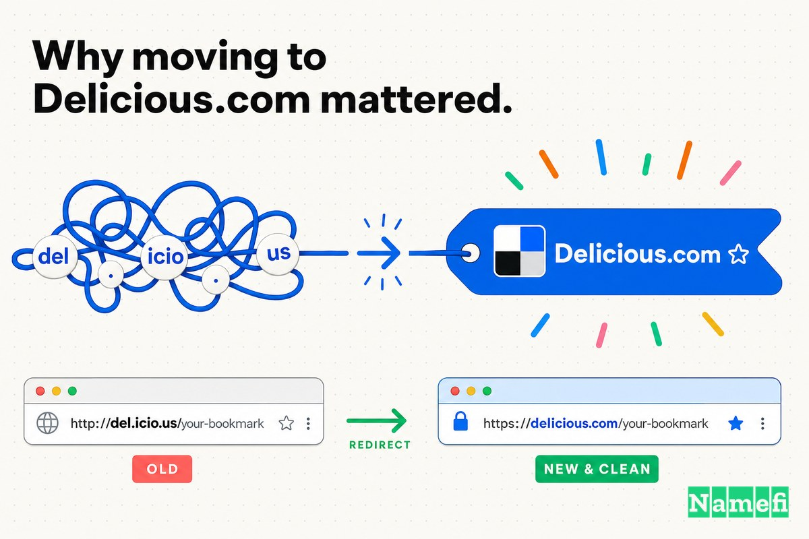

Pendant environ cinq ans, l'un des sites les plus influents de l'ère Web 2.0 a vécu à une adresse qu'on ne pouvait presque pas dire à voix haute : **del.icio.us**.

Le nom était astucieux. C'était, en fait, l'exemple le plus célèbre d'un *hack de domaine* — une astuce où le domaine lui-même épelle un mot en empruntant un suffixe de pays. Joshua Schachter a enregistré `icio.us` sur le [ccTLD](/fr/glossary/cctld/) [.us](/fr/tld/us/), a placé `del` devant en tant que [sous-domaine](/fr/glossary/subdomain/), et l'ensemble lisait « delicious » (délicieux). Comme l'expliquait un premier article décortiquant la construction, [`del` est en réalité un sous-domaine de `icio.us`](https://www.quickonlinetips.com/archives/2005/02/decoding-the-domain-name-delicious/#:~:text=del%20is%20actually%20a%20subdomain), et cet assemblage sous-domaine + ccTLD était, selon ses propres termes, [une façon ingénieuse d'enregistrer un nom de domaine](https://www.quickonlinetips.com/archives/2005/02/decoding-the-domain-name-delicious/#:~:text=an%20ingenious%20way%20to%20register%20a%20domain%20name).

Pour un projet annexe géré par un ingénieur pour le plaisir, cette ingéniosité était le propos même. Les points étaient un clin d'œil. Ils disaient : c'est l'outil d'un hacker, construit par quelqu'un qui pense que le fonctionnement de la plomberie du web est lui-même un espace de créativité.

Mais un clin d'œil ne se dimensionne pas. Chaque point de `del.icio.us` était un endroit où un nouvel utilisateur pouvait se perdre — une virgule là où il fallait un point, une lettre manquante, une lettre en trop. Et le site derrière ces points ne restait pas un projet annexe. Il a inventé une catégorie, attiré des centaines de milliers d'utilisateurs, et a été racheté par Yahoo. En 2008, sous la direction de Yahoo, le domaine le plus astucieux du web a été échangé contre le bon, l'ennuyeux : **Delicious.com**.

Voici l'histoire du moment où un hack de domaine cesse d'être charmant et commence à être une taxe — et ce qu'il en coûte pour le corriger après que des millions de personnes ont déjà appris à mal écrire votre nom.

## 2003 : un projet annexe nommé d'après un code pays

Au début, les points étaient gratuits.

Schachter ne cherchait pas à créer une entreprise. Il construisait un outil pour lui-même. Quand il a [dépassé 20 000 liens en 2001](https://www.computerworld.com/article/1588198/del-icio-us-social-bookmarking-phenomenon.html#:~:text=When%20he%20topped%2020%2C000%20links%20in%202001), il a écrit un programme à utilisateur unique pour gérer ses propres favoris, puis l'a réécrit en quelque chose que d'autres personnes pouvaient utiliser. Comme Computerworld l'a rapporté plus tard, [il l'a réécrit de zéro en tant que système multi-utilisateurs et l'a lancé sur le Web pour que d'autres puissent l'utiliser. Il l'a appelé del.icio.us.](https://www.computerworld.com/article/1588198/del-icio-us-social-bookmarking-phenomenon.html#:~:text=he%20rewrote%20it%20from%20scratch%20as%20a%20multiuser%20system%20and%20launched%20it%20on%20the%20Web%20for%20others%20to%20use.%20He%20called%20it%20del.icio.us.) Selon Wikipedia, [en septembre 2003, Schachter a publié la première version de Delicious.](https://en.wikipedia.org/wiki/Delicious_(website)#:~:text=In%20September%202003%2C%20Schachter%20released%20the%20first%20version%20of%20Delicious.)

Il l'a fait pendant ses loisirs. Selon Computerworld, [Schachter le gérait pendant son temps libre, tout en travaillant à plein temps comme analyste quantitatif chez Morgan Stanley](https://www.computerworld.com/article/1588198/del-icio-us-social-bookmarking-phenomenon.html#:~:text=Schachter%20ran%20it%20in%20his%20spare%20time%2C%20while%20working%20full%20time%20as%20a%20quantitative%20analyst%20at%20Morgan%20Stanley) — le genre d'origine en dehors des heures de bureau où personne ne fait une vérification de marque ni ne réfléchit à la façon dont le nom apparaîtra dans un bandeau télévisé. L'idée de balisage qui a rendu le site célèbre ne lui était même pas native ; selon Wikipedia, c'était [un système qu'il avait développé pour organiser les liens suggérés à Memepool](https://en.wikipedia.org/wiki/Joshua_Schachter#:~:text=a%20system%20he%20developed%20for%20organizing%20links%20suggested%20to%20Memepool).

Et le produit a fonctionné. Sans budget marketing, il s'est répandu grâce à son ingéniosité et au bouche-à-oreille. Computerworld a rapporté que [sans marketing formel, del.icio.us comptait environ 200 000 utilisateurs enregistrés](https://www.computerworld.com/article/1588198/del-icio-us-social-bookmarking-phenomenon.html#:~:text=With%20no%20formal%20marketing%2C%20today%20del.icio.us%20has%20about%20200%2C000%20registered%20users), et Wikipedia crédite le service de plus que des utilisateurs : [le service a inventé le terme « social bookmarking »](https://en.wikipedia.org/wiki/Joshua_Schachter#:~:text=The%20service%20coined%20the%20term%20social%20bookmarking).

Voilà le contexte. Une entreprise qui *a nommé une catégorie entière* portait un domaine conçu pour un hobby d'une seule personne. Le nom était une blague de hacker qui était accidentellement devenue une marque.

## Le domaine le plus astucieux du web — et le plus mal orthographié

`del.icio.us` est, même aujourd'hui, l'exemple classique d'un hack de domaine. Wikipedia l'affirme clairement : [le nom de domaine « del.icio[.us] » était un exemple bien connu d'un hack de domaine, une combinaison non conventionnelle de lettres pour former un mot ou une phrase.](https://en.wikipedia.org/wiki/Delicious_(website)#:~:text=domain%20name%20was%20a%20well%2Dknown%20example%20of%20a%20domain%20hack)

L'astuce était véritablement élégante. Comme l'expliquait l'analyse de la construction, [icio était le nom de domaine sélectionné et .us était le domaine de premier niveau de code pays (ccTLD) enregistré qui, combinés, formaient icio.us](https://www.quickonlinetips.com/archives/2005/02/decoding-the-domain-name-delicious/#:~:text=icio%20was%20the%20selected%20domain%20name%20and%20.us%20was%20the%20registered%20country%20code%20level%20top%20level%20domain), avec `del` posé dessus en tant que sous-domaine. L'adresse ne *pointait pas vers* un mot. L'adresse *était* un mot. Pour un public d'ingénieurs, c'était irrésistible.

Le problème, c'est que le reste du monde ne lit pas le DNS pour le plaisir. Ces quatre points ont transformé la marque en test d'orthographe, et la plupart des gens ont échoué. Quand l'équipe a finalement expliqué le changement de 2008, elle a listé les dégâts : [nous avons vu une infinité de confusions et de fautes d'orthographe de « del.icio.us » au fil des années (par exemple, « de.licio.us », « del.icio.us.com » et « del.licio.us »)](https://domainnamewire.com/2008/08/01/delicious-rebrands-as-deliciouscom-a-lesson-for-entrepreneurs/#:~:text=zillion%20different%20confusions%20and%20misspellings). Chaque point mal placé représentait un utilisateur qui n'arrivait pas, un lien partagé qui ne se résolvait pas, une recommandation qui mourait dans l'écart entre entendre le nom et le taper.

Schachter le savait. Il le savait presque dès le début. Comme l'a noté Domain Name Wire, dès 2004, il parlait de l'erreur de nommage, le citant directement : [je regrette un peu d'avoir utilisé ce nom de domaine, car il est presque impossible d'en parler ou de le vérifier sans avoir l'air stupide.](https://domainnamewire.com/2008/08/01/delicious-rebrands-as-deliciouscom-a-lesson-for-entrepreneurs/#:~:text=I%20somewhat%20regret%20using%20the%20domain%20name)

Cette phrase résume toute la tension d'un hack de domaine en une seule phrase. *Presque impossible d'en parler ou de le vérifier sans avoir l'air stupide.* Un nom qui vit sur un écran peut être à la fois astucieux et tordu. Un nom qui doit survivre à être dit à voix haute — lors d'un appel téléphonique, dans un bar, dans un podcast, à un collègue — doit être prononçable. Les points qui faisaient de `del.icio.us` une excellente blague d'initiés en faisaient quelque chose de terrible à recommander.

## 2005 : Yahoo rachète le hobby

Le hobby est devenu une acquisition.

Le [9 décembre 2005, Yahoo! a acquis Delicious pour une somme non divulguée](https://en.wikipedia.org/wiki/Joshua_Schachter#:~:text=On%20December%209%2C%202005%2C%20Yahoo%21%20acquired%20Delicious%20for%20an%20undisclosed%20sum) — un prix que Wikipedia note comme étant [selon Business 2.0... 30 millions de dollars](https://en.wikipedia.org/wiki/Joshua_Schachter#:~:text=According%20to%20Business%202.0%2C%20the%20acquisition%20price%20was%20%2430%20million). Delicious était, à ce moment-là, un joyau du Web 2.0. TechCrunch a décrit l'époque avec affection plus tard : [il était une fois (vers 2004), le service de bookmarking social Delicious était la chose la plus brûlante du web](https://techcrunch.com/2016/01/12/delicious-former-web-2-0-darling-is-now-managed-by-new-alliance-rolls-back-most-recent-changes/#:~:text=the%20social%20bookmarking%20service%20Delicious%20was%20the%20hottest%20thing%20on%20the%20web), un site qui [cochait toutes les cases des mots à la mode de l'époque (balisage collaboratif, folksonomie, AJAX)](https://techcrunch.com/2016/01/12/delicious-former-web-2-0-darling-is-now-managed-by-new-alliance-rolls-back-most-recent-changes/#:~:text=hit%20all%20the%20right%20buzzwords%20of%20the%20time).

Yahoo possédait maintenant un produit définissant une catégorie. Il possédait aussi le plus grand problème de lisibilité de ce produit. Un projet annexe débrouillard peut porter un hack de domaine comme un insigne. Une propriété grand public appartenant à une société cotée en bourse qui veut que *tout le monde* l'utilise ne le peut pas — chaque point est une friction entre Yahoo et la croissance de masse qui justifiait le prix d'acquisition.

La question que Yahoo a héritée n'était donc pas de savoir si `del.icio.us` était astucieux. Tout le monde s'accordait sur l'ingéniosité. La question était de savoir si l'ingéniosité valait les millions d'utilisateurs qui ne pouvaient pas l'épeler.

## 2008 : échanger le clin d'œil contre le mot

À l'été 2008, Yahoo a tranché. Un Delicious redesigné a été lancé et la marque a discrètement migré vers l'adresse qu'elle aurait toujours dû avoir. Selon Wikipedia, [le nouveau design a été mis en ligne le 31 juillet 2008.](https://en.wikipedia.org/wiki/Delicious_(website)#:~:text=The%20new%20design%20went%20live%20on%20July%2031%2C%202008.)

Domain Name Wire a saisi le changement avec précision : [le site de bookmarking social Delicious a basculé sa marque, encourageant les utilisateurs à visiter le Delicious.com facile à retenir plutôt que le del.icio.us souvent mal orthographié.](https://domainnamewire.com/2008/08/01/delicious-rebrands-as-deliciouscom-a-lesson-for-entrepreneurs/#:~:text=flipped%20the%20switch%20on%20its%20brand%2C%20encouraging%20users%20to%20visit%20the%20easy%2Dto%2Dremember%20Delicious.com%20instead%20of%20the%20often%20typod%20del.icio.us) Notez le cadrage : *facile à retenir* contre *souvent mal orthographié*. Cinq ans et une acquisition plus tard, la raison officielle du changement était exactement le problème que Schachter avait nommé en 2004 — les points coûtaient plus qu'ils ne rapportaient.

L'explication du pourquoi-nous-avons-changé était sans sentimentalisme. Comme Domain Name Wire l'a rapporté d'après les propres mots de l'équipe, tout l'intérêt de passer à delicious.com était qu'il [facilitera pour les gens de trouver le site et de le partager avec leurs amis](https://domainnamewire.com/2008/08/01/delicious-rebrands-as-deliciouscom-a-lesson-for-entrepreneurs/#:~:text=will%20make%20it%20easier%20for%20people%20to%20find%20the%20site%20and%20share%20it%20with%20their%20friends). Le trouver. Le partager. Ce sont les deux verbes qu'un hack de domaine sabote silencieusement, et ce sont les deux verbes dont un produit en phase de croissance dépend pour vivre ou mourir.

C'est la rare mise à niveau où l'entreprise s'est déplacée *vers* le simple `.com` et loin de la chaîne astucieuse — la direction opposée au parcours habituel descriptif-vers-correspondance-exacte. Mais c'est le même mouvement sous-jacent : se débarrasser d'un nom qui exprimait l'intelligence du fondateur au profit d'un nom que l'ensemble du marché pouvait utiliser sans réfléchir.

## L'argent semblait différent à l'époque

Il est facile, avec le recul, de dire que Schachter aurait dû simplement acheter delicious.com en 2003 et éviter les points. Cela lit la décision depuis le mauvais angle.

En 2003, `del.icio.us` n'était pas une décision de marque. C'était une décision de *hobby*. Schachter n'allouait pas un budget marketing ; il enregistrait un domaine pour un outil qu'il gérait soirs et week-ends tout en gardant un emploi à temps plein chez Morgan Stanley. Le hack n'était pas un mauvais choix stratégique — c'était un petit plaisir créatif, le genre de chose que l'on fait *parce que* c'est juste pour soi.

Domain Name Wire a accordé exactement cette indulgence, et c'est la lecture juste : [puisque le site Delicious a commencé comme un hobby, le fondateur Joshua Schachter peut être pardonné de ne pas avoir utilisé un bon nom de domaine.](https://domainnamewire.com/2008/08/01/delicious-rebrands-as-deliciouscom-a-lesson-for-entrepreneurs/#:~:text=Since%20the%20Delicious%20site%20started%20as%20a%20hobby%2C%20founder%20Joshua%20Schachter%20can%20be%20forgiven%20for%20not%20using%20a%20good%20domain%20name.)

Le piège n'est pas de choisir un hack de domaine quand on est petit. Le piège est de le *garder* quand on ne l'est plus. Le coût des points était quasi nul pour un projet annexe avec quelques milliers d'utilisateurs techniques qui trouvaient le hack génial. Le coût a augmenté à chaque fois que l'audience s'est élargie — au-delà des primo-adoptants, au-delà de 200 000 utilisateurs enregistrés, au-delà d'une acquisition par Yahoo, vers le grand public que Yahoo voulait atteindre. La facture de `del.icio.us` n'a pas été payée en 2003. Elle est arrivée à échéance en 2008, libellée en chaque utilisateur qui ne pouvait pas trouver un site qu'on lui avait dit d'essayer.

## Pourquoi le passage à Delicious.com a compté

L'écart entre `del.icio.us` et `Delicious.com` ressemble à de la ponctuation. Stratégiquement, c'est la différence entre un nom qui performe l'ingéniosité et un nom qui délivre des utilisateurs.

**del.icio.us** est une énigme : quatre points, un code pays emprunté, une chaîne qu'il faut *décoder* avant de pouvoir la taper. **Delicious.com** est juste un mot. L'un demande à l'auditeur de retenir une structure inhabituelle. L'autre lui demande de retenir un mot qu'il sait déjà orthographier.

| Avant | Après |
| --- | --- |
| del.icio.us | Delicious.com |
| Un hack de domaine (le ccTLD .us épelant un mot) | Un .com simple, mot en correspondance exacte |
| Astucieux à lire sur un écran | Facile à dire à voix haute et à partager |
| Quatre points = quatre endroits où se tromper | Un mot, une orthographe |
| « de.licio.us », « del.licio.us », « del.icio.us.com » | delicious.com |
| Évoque un projet annexe de hacker | Évoque un produit grand public |

C'est la même leçon que toute mise à niveau de domaine, juste arrivant du côté opposé. La plupart des entreprises passent d'un nom *descriptif* (UberCab, TeslaMotors) à un mot simple en correspondance exacte. Delicious est passé d'un nom *trop astucieux* au mot simple en correspondance exacte. La destination est identique : un domaine qui se fond dans la marque au lieu de réclamer de l'attention. Un excellent domaine est celui auquel les utilisateurs n'ont pas à réfléchir. `del.icio.us` les forçait à réfléchir au domaine à chaque fois.

Et le changement portait un avertissement pour tous ceux qui regardaient. Domain Name Wire a énoncé la leçon plus large sans détour : [malheureusement, un certain nombre d'entrepreneurs Web 2.0 ont vu le succès de del.icio.us et ont pensé qu'il serait cool de créer eux-mêmes des hacks de domaine, ce qui a entraîné des noms de domaine mal choisis qui envoyaient beaucoup de trafic au mauvais endroit.](https://domainnamewire.com/2008/08/01/delicious-rebrands-as-deliciouscom-a-lesson-for-entrepreneurs/#:~:text=Sadly%2C%20a%20number%20of%20web%202.0%20entrepreneurs%20saw%20the%20success%20of%20del.icio.us) Le hack qui a rendu Delicious célèbre en a aussi fait un modèle d'avertissement — copié par des fondateurs qui ont vu l'ingéniosité et manqué le coût.

## Le calendrier : quand « astucieux » est devenu « coûteux »

La question intéressante n'est pas *pourquoi* Delicious a changé. C'est *quand*.

La plainte était constante dès le début — Schachter l'a nommée en 2004, l'année après le lancement. Mais le changement n'est arrivé qu'en 2008, après que la base d'utilisateurs avait explosé et que Yahoo avait payé selon les rapports 30 millions de dollars pour l'entreprise. Les points n'ont pas empiré au fil de ces années. Les *enjeux*, eux, oui.

Quand vous avez quelques milliers d'utilisateurs techniques, un domaine difficile à taper est une particularité qu'ils pardonnent. Quand vous êtes une propriété Yahoo cherchant l'adoption grand public, le même domaine est une fuite en haut du tunnel — chaque « del-point-quoi ? » est un utilisateur qui n'arrive jamais. Le taux de taxation des points n'a jamais changé. La taille de la chose taxée a grossi jusqu'à ce que la facture soit impossible à ignorer. En 2008, le calcul était évident d'une façon qu'il ne l'était simplement pas en 2003 : le coût de changer une fois était inférieur au coût d'être mal orthographié pour toujours.

## Le domaine faisait partie du système d'exploitation

Les domaines premium ne sont pas une question de prestige. Ils parlent de répétition — et un hack de domaine se brise exactement aux points où la répétition se produit.

L'adresse principale d'un site apparaît dans des endroits qu'aucune équipe marketing ne contrôle :

- Dans le bouche-à-oreille : « vous devriez essayer del-icio-us... non, ça s'écrit avec des points. »
- Dans la barre du navigateur, où un mauvais point mène nulle part.
- Dans les liens partagés entre amis, où une faute de frappe échoue silencieusement.
- Dans la presse, les podcasts et les conversations, où un nom doit survivre à être *dit*.
- Dans les trente premières secondes de chaque nouvel utilisateur, où trouver le site est la première étape.

Chacun de ces moments ajoute ou supprime de la friction. `del.icio.us` ajoutait de la friction à tous : le nom était impronçable sans explication, impossible à partager sans soin, et introuvable pour quiconque se trompait de point. `Delicious.com` supprimait la friction à tous : on dit un mot, on tape un mot, on y est. Multipliez ce delta par des centaines de milliers d'utilisateurs et chaque recommandation qu'ils ont faite à un ami, et l'ingéniosité du hack cesse de ressembler à un atout et commence à ressembler à un péage que l'entreprise a construit devant sa propre porte.

Le domaine n'a pas rendu Delicious populaire — le balisage, le timing et un produit véritablement utile l'ont fait. Mais chaque recommandation passait par le nom, et pendant cinq ans le nom fuyait.

## Ce que les fondateurs devraient apprendre du cas 18

La conclusion facile — « n'utilisez jamais un hack de domaine » — est trop tranchante. Les leçons plus utiles concernent *pour qui vous nommez* et *quand la blague cesse de payer pour elle-même* :

1. **Un nom astucieux convient parfaitement à un hobby.** `del.icio.us` était un choix délicieux pour un outil de soirées et de week-ends avec un public technique. Domain Name Wire avait raison : l'origine hobby mérite le pardon. Si tout votre public est composé de personnes qui apprécieraient le hack, le hack est une fonctionnalité.
2. **Auditez le nom dès que l'audience s'élargit.** Le signal pour mettre à niveau n'est pas esthétique ; il est démographique. À l'instant où vos utilisateurs cessent d'être des personnes qui lisent le DNS pour le plaisir, un hack de domaine passe de charmant à coûteux. Schachter l'a ressenti dès 2004. Le correctif n'est arrivé qu'en 2008.
3. **Un nom doit survivre à être dit à voix haute.** Le test le plus clair d'un domaine n'est pas son apparence — c'est si quelqu'un peut l'entendre et le taper correctement du premier coup. Si recommander votre site nécessite des instructions d'orthographe, le nom taxe votre croissance.
4. **Changez avant que la facture ne s'accumule.** Le coût d'un changement unique est fixe. Le coût d'être mal orthographié s'adapte à chaque nouvel utilisateur. Delicious a payé le coût du changement tardivement, après des années de trafic perdu. Plus tôt vous échangez le clin d'œil contre le mot, moins vous avez déjà perdu.

Le passage à Delicious.com n'a pas sauvé l'entreprise — la négligence ultérieure de Yahoo a fait bien plus pour déterminer son destin que la ponctuation ne l'a jamais pu. Mais il a rendu la marque *trouvable*, et la trouvabilité est la seule chose qu'un hack de domaine astucieux vole silencieusement.

## L'angle Namefi

Ce cas est, sous l'ingéniosité, une question de quel actif porte réellement l'entreprise.

Delicious avait deux noms : le spirituel que son fondateur aimait et le simple dont ses utilisateurs avaient besoin. Pendant cinq ans, il a fonctionné avec le spirituel et payé silencieusement l'écart — en fautes de frappe, en partages ratés, dans la friction d'un nom [presque impossible à discuter ou à vérifier sans avoir l'air stupide](https://domainnamewire.com/2008/08/01/delicious-rebrands-as-deliciouscom-a-lesson-for-entrepreneurs/#:~:text=I%20somewhat%20regret%20using%20the%20domain%20name). Combler cet écart signifiait traiter le bon domaine non pas comme une décoration mais comme une infrastructure essentielle : le sécuriser, y migrer la marque proprement, et maintenir le service en ligne pendant le changement.

[Namefi](https://namefi.io) est construit autour de l'idée que les domaines devraient se comporter comme des actifs natifs d'internet. La propriété tokenisée peut rendre le contrôle des domaines plus facile à vérifier, transférer et intégrer dans les flux de travail modernes tout en restant compatible avec le DNS — transformant les parties compliquées d'une mise à niveau comme celle-ci (prouver qui détient quoi, déplacer un nom en toute sécurité, garder le site en résolution pendant tout ce temps) en quelque chose qui ressemble davantage à une transaction propre et auditable. L'ingéniosité d'un hack de domaine est amusante. La fiabilité ennuyeuse d'un nom que vos utilisateurs peuvent trouver, partager et faire confiance est ce sur quoi l'entreprise fonctionne réellement.

`Delicious.com` semble évident avec le recul. C'est toujours le cas. Mais la leçon s'impose bien avant le recul : un nom qui performe l'ingéniosité nomme pour le fondateur. Un nom que l'ensemble de votre marché peut épeler nomme pour l'entreprise. Quand l'audience dépasse la blague, le domaine n'est pas une décoration — c'est la partie de la marque qui vaut la peine de changer pour la réussir.

## Sources et lectures complémentaires

- Wikipedia — [Delicious (site web)](https://en.wikipedia.org/wiki/Delicious_(website)#:~:text=In%20September%202003%2C%20Schachter%20released%20the%20first%20version%20of%20Delicious.)
- Wikipedia — [Joshua Schachter](https://en.wikipedia.org/wiki/Joshua_Schachter#:~:text=The%20service%20coined%20the%20term%20social%20bookmarking)
- Computerworld — [Del.icio.us : phénomène de bookmarking social](https://www.computerworld.com/article/1588198/del-icio-us-social-bookmarking-phenomenon.html#:~:text=With%20no%20formal%20marketing%2C%20today%20del.icio.us%20has%20about%20200%2C000%20registered%20users)
- Domain Name Wire — [Del.icio.us se rebaptise Delicious.com : une leçon pour les entrepreneurs](https://domainnamewire.com/2008/08/01/delicious-rebrands-as-deliciouscom-a-lesson-for-entrepreneurs/#:~:text=flipped%20the%20switch%20on%20its%20brand)
- QuickOnlineTips — [Décoder le nom de domaine del.icio.us](https://www.quickonlinetips.com/archives/2005/02/decoding-the-domain-name-delicious/#:~:text=an%20ingenious%20way%20to%20register%20a%20domain%20name)
- TechCrunch — [Delicious, ancienne chouchoute du Web 2.0, est maintenant gérée par New Alliance](https://techcrunch.com/2016/01/12/delicious-former-web-2-0-darling-is-now-managed-by-new-alliance-rolls-back-most-recent-changes/#:~:text=the%20social%20bookmarking%20service%20Delicious%20was%20the%20hottest%20thing%20on%20the%20web)
