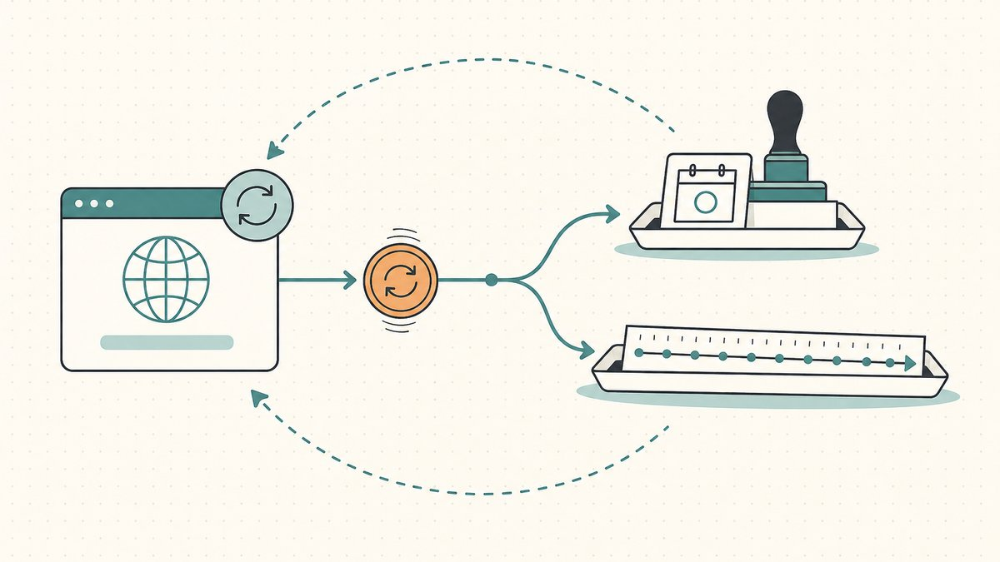

> **À lire avant tout.** Cet article ne constitue **pas** un conseil fiscal, comptable, juridique ou financier. Nous ne sommes pas votre expert-comptable et nous ignorons tout de votre juridiction et de la structure de votre activité. Considérez l''ensemble de ce qui suit comme *une liste de questions et de concepts à soumettre à un vrai professionnel*, et non comme une position sur laquelle vous pouvez vous appuyer. L''avertissement complet figure en bas de page et s''applique avec une force particulière ici.

L''investissement en noms de domaine est une activité à la fiscalité atypique. Vous détenez un actif dont le coût de portage est quasi nul à l''unité, mais qui s''accumule à l''échelle d''un portefeuille ; vous vendez de manière imprévisible ; et ce que vous vendez est un bien incorporel que le code fiscal classait déjà bien avant que le terme « [Domaining](/fr/glossary/domaining/) » n''existe. Il en résulte une poignée de questions que se posent presque tous ceux qui achètent et revendent des domaines à titre lucratif : mes noms sont-ils du stock ou des investissements ? Quelle est ma base de coût ? À quel moment une vente génère-t-elle un revenu ? Puis-je déduire les renouvellements ? Cette FAQ parcourt les concepts en langage clair afin de vous permettre d''avoir une conversation plus affûtée avec votre comptable.

Pour les questions étroitement liées qui se posent dès qu''un nom vit [On-chain](/fr/glossary/on-chain/) — événements de [Frappe](/fr/glossary/minting/), ventes libellées en crypto, dons de tokens, [DeFi (Finance Décentralisée)](/fr/glossary/defi/) [Collatéral](/fr/glossary/collateral/) — consultez l''article complémentaire sur les [questions fiscales et comptables pour les domaines tokenisés](/fr/blog/tax-and-accounting-questions-for-tokenized-domains/). Cet article traite des noms enregistrés classiques. Les deux s''inscrivent dans la discipline du [domain flipping](/fr/blog/domain-flipping/) en tant que compétence, et dans celle de la [gestion de portefeuille de domaines](/fr/blog/domain-portfolio-management/) en tant que pratique.

## Mes domaines sont-ils du stock ou des immobilisations ?

C''est la question qui a le plus de répercussions en aval, et la réponse honnête est « ça dépend de ce que vous faites réellement. » Le code fiscal trace une frontière entre les actifs détenus à titre d''investissement et les biens détenus principalement en vue de leur vente à des clients dans le cadre ordinaire d''une activité commerciale.

Le cas par défaut, pour la plupart des personnes qui possèdent quelques noms, est celui de l''immobilisation. Comme l''IRS l''énonce pour les États-Unis, [presque tout ce que vous possédez et utilisez à des fins personnelles ou d''investissement est une immobilisation](https://www.irs.gov/taxtopics/tc409#:~:text=Almost%20everything%20you%20own%20and%20use%20for%20personal%20or%20investment%20purposes%20is%20a%20capital%20asset). Un domaine acheté en vue de le conserver puis de le revendre à profit ressemble beaucoup à un investissement.

L''exception est celle dont les investisseurs en domaines devraient le plus se préoccuper. Les biens détenus en vue de leur vente à des clients sont traités différemment. L''IRS classe parmi les actifs non-capitaux les [biens détenus principalement pour être vendus à des clients](https://www.irs.gov/publications/p544#:~:text=Property%20held%20mainly%20for%20sale%20to%20customers). Si votre activité atteint le niveau d''un commerce ou d''une entreprise et que vos noms constituent en pratique votre stock, ils peuvent être traités comme des stocks plutôt que comme des immobilisations. Cette distinction est la différence entre le régime des plus-values et celui du revenu ordinaire, et de quel côté vous vous retrouvez dépend de faits tels que le volume, la fréquence, la façon dont vous commercialisez les noms et dont vous les proposez à la vente. C''est la question du négociant versus l''investisseur, et elle est véritablement spécifique aux faits. Ne vous auto-diagnostiquez pas à partir d''un article de blog — y compris celui-ci.

## Pourquoi la distinction stock/immobilisation est-elle si importante ?

Deux raisons. Premièrement, le taux d''imposition. Les immobilisations détenues suffisamment longtemps peuvent bénéficier des taux de plus-values à long terme ; le stock vendu dans le cadre ordinaire d''une activité génère généralement un revenu ordinaire, souvent imposé à un taux plus élevé. Deuxièmement, le calendrier et la nature des pertes, et la question de savoir si des cotisations sociales sur revenus d''activité indépendante entrent en jeu. Une opération de [Trading de domaines](/fr/glossary/domain-trading/) à fort volume qui enregistre et revend constamment ressemble davantage à un négociant ; un détenteur patient d''un petit ensemble de brandables ressemble davantage à un investisseur. Le même nom peut être du stock dans les mains d''une personne et une immobilisation dans celles d''une autre.

C''est aussi pourquoi la [gestion de portefeuille de domaines](/fr/blog/domain-portfolio-management/) et le traitement fiscal sont intimement liés. La façon dont vous gérez votre book — que vous le traitiez comme une détention désinvolte ou comme une opération de vente active — fait partie de ce qui détermine la réponse.

## Quelle est ma base de coût pour un domaine ?

La base de coût est ce que vous utilisez pour calculer le gain ou la perte lors d''une vente ; l''établir correctement est donc l''essentiel du travail comptable. En règle générale, la base commence par ce que vous avez payé pour acquérir le nom, augmenté des coûts d''acquisition.

Pour un nom enregistré directement, c''est simple : les frais d''enregistrement auprès du [Bureau d''enregistrement](/fr/glossary/registrar/). Pour un nom acheté sur le [Marché secondaire](/fr/glossary/aftermarket/), c''est le prix d''achat, et vous devrez prendre en compte les coûts d''acquisition associés tels que les frais de [Séquestre](/fr/glossary/escrow/), les commissions de courtier ou les primes d''[Enchère (hollandaise, anglaise, dynamique)](/fr/glossary/auction/). La question de savoir si chacun de ces éléments est ajouté à la base ou directement en charges est précisément le type de point à confirmer avec un professionnel, car la réponse peut dépendre de votre statut d''investisseur ou de négociant.

La leçon pratique, quelle que soit votre catégorie : documentez la base au moment de l''acquisition, nom par nom, dans un format qui résisterait à un examen plusieurs années plus tard. Conservez le reçu du registrar, la facture de la marketplace, le relevé de transfert par [Code d''autorisation (code EPP, code de transfert)](/fr/glossary/auth-code/), et la date. Un domaine acheté en 2021 et vendu en 2027, c''est long pour reconstituer un chiffre de mémoire. La tenue rigoureuse des bases de coût est l''habitude la plus utile qu''un investisseur en domaines puisse développer, et elle est bon marché si vous commencez dès le premier jour.

## Quand le revenu est-il reconnu — à la vente ou avant ?

Pour la plupart des investisseurs, l''événement imposable est la vente, pas la détention. Le simple fait d''enregistrer un nom, d''observer la hausse de sa valeur marchande, ou de recevoir une offre non sollicitée que vous déclinez ne crée pas, en lui-même, de revenu. Le revenu apparaît généralement lorsque vous cédez effectivement le nom lors d''une [vente](/fr/blog/how-to-sell-a-domain-name-you-own/) et réalisez le gain.

Deux points méritent d''être signalés. Premièrement, la **durée de détention** détermine si un gain est à court ou à long terme si le nom est une immobilisation. La règle générale aux États-Unis : [si vous détenez l''actif plus d''un an avant de le céder, votre plus-value ou moins-value est à long terme](https://www.irs.gov/taxtopics/tc409#:~:text=if%20you%20hold%20the%20asset%20for%20more%20than%20one%20year%20before%20you%20dispose%20of%20it%2C%20your%20capital%20gain%20or%20loss%20is%20long%2Dterm). Pour un flippeur optimisant son rendement après impôt, ce seuil d''un an peut avoir autant d''importance que le prix de vente. Deuxièmement, si vos noms sont du stock plutôt que des immobilisations, la distinction de durée de détention ne vous aidera peut-être pas du tout — les produits constituent un revenu ordinaire que vous ayez détenu le nom deux semaines ou deux ans.

Les montages structurés soulèvent leurs propres questions. Une vente à tempérament, une [Location (Leasing)](/fr/glossary/leasing/) avec option d''achat, ou un arrangement de [Location-vente](/fr/glossary/rent-to-own/) peuvent étaler ou requalifier les revenus sur plusieurs années. Rien de tout cela n''est exotique dans le monde des domaines, et chaque cas est une raison de poser la question avant de signer, pas après.

## Puis-je déduire les renouvellements de domaines ?

C''est la question que se pose tout détenteur d''un portefeuille, car les renouvellements représentent le coût de portage permanent de l''opération entière, et la réponse est le classique « ça dépend. » Deux fils distincts s''y nouent.

Le premier fil est **la question de savoir si l''activité est une entreprise à part entière.** Les déductions courantes pour renouvellements, frais de référencement sur marketplace et autres coûts de portage exigent généralement que vous exerciez une activité avec un véritable but lucratif, et non que vous poursuiviez un hobby. Un vrai business d''investissement en domaines a beaucoup plus facilement le droit de traiter les coûts récurrents comme déductibles qu''une personne détenant quelques noms sur un coup de tête. La façon dont vous traitez les coûts de renouvellement découle de cette classification.

Le second fil est **capitaliser vs. passer en charges.** Certains coûts sont ajoutés à la base de l''actif (récupérés lors de la vente), tandis que certains coûts d''exploitation courants peuvent être déduits l''année de leur paiement. Un nom de domaine est un bien incorporel, et le code fiscal dispose depuis longtemps d''un cadre pour le coût capitalisé de certains incorporels. Selon les règles américaines, [vous devez généralement amortir sur 15 ans les coûts capitalisés des « immobilisations incorporelles de la section 197 » acquises après le 10 août 1993](https://www.irs.gov/businesses/small-businesses-self-employed/intangibles#:~:text=You%20must%20generally%20amortize%20over%2015%20years%20the%20capitalized%20costs%20of%20%E2%80%9Csection%20197%20intangibles%E2%80%9D). La question de savoir si et comment ce cadre s''applique à un domaine donné, et si un renouvellement annuel est un coût courant déductible plutôt que quelque chose à capitaliser, est une vraie question à poser à votre comptable plutôt qu''à deviner. Le montant par nom est faible ; le traitement sur quelques centaines de noms ne l''est pas.

C''est aussi là que [l''économie des renouvellements et votre taux de cession](/fr/blog/domain-renewal-costs-and-sell-through-rate/) rencontrent la planification fiscale. Le calcul des coûts de portage qui vous dit [quand abandonner un domaine](/fr/blog/when-to-drop-a-domain/) est le même calcul que votre comptable doit voir pour comprendre la forme de l''activité.

## Comment tenir la comptabilité d''un portefeuille de domaines ?

Vous n''avez pas besoin d''un logiciel de comptabilité d''entreprise pour suivre un book de domaines, mais vous avez besoin de discipline. Un minimum fonctionnel est un seul registre avec une ligne par nom, capturant : la date d''acquisition, le coût d''acquisition et la source, chaque renouvellement payé avec sa date, les éventuels coûts d''amélioration, la date et le prix de vente, et l''acheteur ou la marketplace. Ce registre est ce qui vous permet de calculer la base, la durée de détention et le gain sur n''importe quel nom en quelques secondes plutôt qu''en fouillant des archives.

Conservez les documents justificatifs à côté : factures du registrar, reçus de marketplace, relevés de séquestre et confirmations de transfert. Si vous vendez sur plusieurs plateformes, rapprochez leurs rapports avec votre propre registre plutôt que de vous fier au chiffre d''une seule plateforme. La même rigueur documentaire qui rend la saison fiscale indolore fait aussi de vous un investisseur plus discipliné, car vous pouvez enfin voir votre vrai [taux de cession](/fr/blog/domain-renewal-costs-and-sell-through-rate/) et votre coût de portage au lieu de les estimer.

## Est-ce que le registrar ou la marketplace s''en occupe pour moi ?

Principalement non. Un [Bureau d''enregistrement](/fr/glossary/registrar/) vous facture et peut envoyer un reçu, mais il ne suit pas votre base ni vos gains. Une marketplace qui négocie une vente peut émettre un formulaire fiscal dans certaines juridictions, et ce formulaire peut ou non refléter l''image complète — il ne connaîtra pas votre base, par exemple. Traitez tout chiffre émis par une plateforme comme une donnée à recouper, et non comme une réponse à accepter. La responsabilité de suivre la base, de classifier l''activité et de déclarer correctement vous appartient.

## Où Namefi s''inscrit-il dans tout cela ?

Des registres propres commencent par une propriété claire. Une partie de ce qui rend la comptabilité de domaines pénible est la reconstruction de qui détenait quoi, quand, et à quel prix, à travers les registrars et les transferts. [Namefi](https://namefi.io) tokenise le contrôle de vrais domaines ICANN, ce qui signifie que la propriété et les transferts sont auditables on-chain plutôt que reconstitués à partir de reçus e-mail épars — une propriété utile lorsque vous devez ensuite démontrer les dates d''acquisition et une chaîne de custody claire. Cela ne remplace pas votre comptable, et la tokenisation d''un nom soulève ses propres questions fiscales (traitées dans l''[article sur la fiscalité des domaines tokenisés](/fr/blog/tax-and-accounting-questions-for-tokenized-domains/)). Mais un enregistrement auditable de l''acquisition et du transfert est exactement le type de preuve qui raccourcit la conversation avec un professionnel.

## Avertissement amical (Lisez-moi !)

> Nous ne sommes pas avocats, experts-comptables, conseillers financiers ou médecins, et **rien dans cet article ne constitue un conseil juridique, financier, fiscal, comptable, médical ou de quelque autre nature professionnelle que ce soit.** Nous rédigeons ces articles pour nous instruire et comme service à nos clients. Les informations ici peuvent être obsolètes, spécifiques à une zone géographique, ou tout simplement erronées. Nous faisons des erreurs aussi.
>
> Pour toute décision importante, **veuillez consulter un vrai professionnel (sérieusement !)**. Ou si ce n''est pas votre style, demandez à un ami, demandez à Twitter, à Reddit, à une IA, ou à un voyant. En bref : **DYOR — Do Your Own Research** (Faites vos propres recherches). Apprenons et amusons-nous.

## Sources et lectures complémentaires

- IRS — [Topic no. 409, Capital gains and losses (capital asset definition; long-term holding period)](https://www.irs.gov/taxtopics/tc409#:~:text=Almost%20everything%20you%20own%20and%20use%20for%20personal%20or%20investment%20purposes%20is%20a%20capital%20asset)
- IRS — [Publication 544, Sales and Other Dispositions of Assets (property held mainly for sale to customers is a noncapital asset)](https://www.irs.gov/publications/p544#:~:text=Property%20held%20mainly%20for%20sale%20to%20customers)
- IRS — [Intangibles (15-year amortization of section 197 intangibles)](https://www.irs.gov/businesses/small-businesses-self-employed/intangibles#:~:text=You%20must%20generally%20amortize%20over%2015%20years%20the%20capitalized%20costs%20of%20%E2%80%9Csection%20197%20intangibles%E2%80%9D)
- Ressources Namefi — [Questions fiscales et comptables pour les domaines tokenisés](/fr/blog/tax-and-accounting-questions-for-tokenized-domains/)
