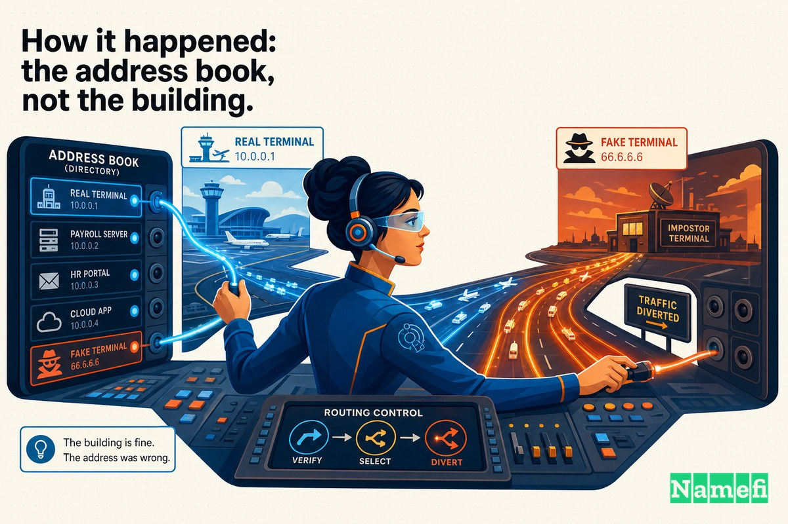
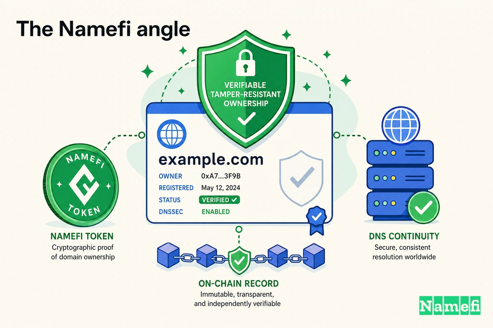

L'avion n'a jamais été retrouvé. En janvier 2015, le site web non plus.

Le matin du 26 janvier 2015, quiconque tapait **malaysiaairlines.com** dans un navigateur n'atteignait pas la compagnie aérienne. Il atteignait un pirate informatique. La page de réservation familière avait disparu, remplacée par l'image d'un lézard en chapeau haut-de-forme et monocle, et par un unique titre cinglant : **« 404 — Avion Introuvable. »** En dessous : *« Piraté par Lizard Squad — Cyber Califat Officiel. »* La barre de titre d'un navigateur affichait simplement : *« ISIS vaincra. »*

C'était une blague sur un cimetière. Moins d'un an auparavant, le vol Malaysia Airlines 370 avait disparu des radars avec 239 personnes à bord. Quatre mois plus tard, le vol 17 avait été abattu dans le ciel au-dessus de l'Ukraine. Maintenant, un groupe d'adolescents avait transformé le deuil de la compagnie en punch line affiché sur sa propre porte d'entrée — sans jamais toucher à ses serveurs.

Ce dernier point résume toute l'affaire. Malaysia Airlines n'a pas été « piratée » au sens où la plupart des gens l'imaginent. Ses systèmes de réservation étaient intacts. Les données passagers n'avaient pas bougé. Ce que les attaquants avaient saisi était quelque chose de plus fondamental et, il s'avère, bien plus facile à voler : le **nom de domaine lui-même** — l'adresse qui indique à l'ensemble d'Internet où « Malaysia Airlines » se trouve.

Il s'agit d'un cas Domain Mayday sur la partie de votre infrastructure à laquelle vous ne pensez probablement jamais — jusqu'à ce qu'elle pointe ailleurs.

## Une compagnie aérienne, c'est son domaine

Pour un transporteur mondial, le site web n'est pas une brochure. C'est la caisse enregistreuse, le comptoir d'enregistrement et le centre d'appels, tous rattachés à une seule chaîne de texte : `malaysiaairlines.com`.

Chaque réservation, chaque connexion au programme de fidélité, chaque lien « gérer mon vol » dans chaque e-mail de confirmation transitent par ce domaine. Quand un passager à Kuala Lumpur ou à Londres le saisit, une chaîne invisible se déclenche : le navigateur demande au [Système de Noms de Domaine](/fr/glossary/dns/) (DNS) « où se trouve malaysiaairlines.com ? », le DNS répond avec une [adresse IP](/fr/glossary/ip-address/), et le navigateur se connecte. La marque de la compagnie, ses revenus et la confiance de ses clients reposent tous sur cette unique recherche renvoyant la *bonne* réponse.

Le DNS est l'annuaire téléphonique d'Internet. C'est aussi, pour la plupart des organisations, la porte la moins surveillée du bâtiment. Vous pouvez dépenser des millions pour renforcer vos serveurs, chiffrer vos bases de données et former votre personnel contre le phishing — tout cela ne sert à rien si quelqu'un peut discrètement modifier la ligne de l'annuaire qui indique où pointe votre nom. Redirigez l'adresse, et vous avez redirigé l'entreprise, sans jamais pénétrer dans le bâtiment.

C'est exactement ce qui s'est passé.

## Le piratage : un lézard là où se trouvait une compagnie aérienne

Le défacement avait été conçu pour une cruauté maximale. L'image d'un lézard en tenue de soirée était la signature de Lizard Squad ; le groupe avait passé le mois de décembre précédent à mettre hors ligne [Xbox Live et le PlayStation Network de Sony](https://techcrunch.com/2015/01/25/malaysia-airlines-site-hacked-by-lizard-squad/#:~:text=Hacker%20group%20Lizard%20Squad%2C%20which%20took%20down%20Xbox%20Live%20and%20the%20Sony%20PlayStation%20Network%20last%20month) pendant les fêtes. En janvier, il s'était enveloppé dans l'imagerie d'un « Cyber Califat », se posant en allié de l'ISIS même si les chercheurs traitaient cette affirmation avec un profond scepticisme.

Le site, tel que les visiteurs le découvraient, [affichait une image d'un lézard en chapeau haut-de-forme et monocle, ainsi que le texte « 404-Avion Introuvable »](https://techcrunch.com/2015/01/25/malaysia-airlines-site-hacked-by-lizard-squad/#:~:text=The%20site%20currently%20displays%20a%20picture%20of%20a%20lizard%20in%20a%20top%20hat%20and%20monocle%2C%20as%20well%20as%20the%20text%20%27404%2DPlane%20Not%20Found%27). Le récit Wikipedia du groupe rapporte la même scène : les utilisateurs étaient [redirigés vers une autre page affichant l'image d'un lézard en tuxedo](https://en.wikipedia.org/wiki/Lizard_Squad#:~:text=Users%20were%20redirected%20to%20another%20page%20bearing%20an%20image%20of%20a%20tuxedo%2Dwearing%20lizard), et la page [portait le titre « 404 - Avion Introuvable », une allusion apparente à la disparition du vol MH370 l'année précédente](https://en.wikipedia.org/wiki/Lizard_Squad#:~:text=The%20page%20also%20carried%20the%20headline%20%22404%20%2D%20Plane%20Not%20Found%22%2C%20an%20apparent%20reference%20to%20the%20airline%27s%20loss%20of%20flight%20MH370%20the%20previous%20year).

La cruauté était intentionnelle. MH370 avait [disparu des radars le 8 mars 2014](https://en.wikipedia.org/wiki/Malaysia_Airlines_Flight_370#:~:text=disappeared%20from%20radar%20on%208%20March%202014), les 239 personnes à bord finalement présumées mortes, et les débris jamais localisés de manière définitive. MH17 avait été [abattu par des forces soutenues par la Russie avec un missile sol-air Buk 9M38 le 17 juillet 2014](https://en.wikipedia.org/wiki/Malaysia_Airlines_Flight_17#:~:text=shot%20down%20by%20Russian%2Dbacked%20forces%20with%20a%20Buk%209M38%20surface%2Dto%2Dair%20missile%20on%2017%20July%202014), tuant les 298 personnes à bord. Apposer « Avion Introuvable » sur la page d'accueil de la compagnie, c'était transformer la pire année de son histoire en arme — et la diffuser à chaque client tentant d'accéder au site.

Puis vint la menace. Le groupe [tweetait qu'il allait « bientôt publier du butin trouvé sur les serveurs de www.malaysiaairlines.com »](https://www.theregister.com/2015/01/26/lizard_squad_threaten_data_dump_after_attack_on_malaysia_airlines_site/#:~:text=Going%20to%20dump%20some%20loot%20found%20on%20www.malaysiaairlines.com%20servers%20soon), et publiait même une capture d'écran qu'il prétendait montrer des itinéraires de passagers. Pour une compagnie déjà noyée sous une année de catastrophes, l'idée que des données clients aient été volées était en soi une catastrophe.

## Comment c'est arrivé : l'annuaire, pas le bâtiment

Voici le cœur technique de l'affaire, et la raison pour laquelle ce cas appartient à une série sur la sécurité des domaines plutôt qu'à une sur les violations de serveurs.

La déclaration propre de Malaysia Airlines, répétée dans l'ensemble des reportages, établissait la distinction avec précision : [Malaysia Airlines confirme que son Système de Noms de Domaine (DNS) a été compromis, les utilisateurs étant redirigés vers un site de pirates lorsque l'URL www.malaysiaairlines.com est saisie](https://techcrunch.com/2015/01/25/malaysia-airlines-site-hacked-by-lizard-squad/#:~:text=Malaysia%20Airlines%20confirms%20that%20its%20Domain%20Name%20System%20%28DNS%29%20has%20been%20compromised%20where%20users%20are%20re%2Ddirected%20to%20a%20hacker%20website). La compagnie a insisté sur le fait que son [site web n'avait pas été piraté et que cette défaillance temporaire n'affectait pas les réservations, les données utilisateurs restant sécurisées](https://techcrunch.com/2015/01/25/malaysia-airlines-site-hacked-by-lizard-squad/#:~:text=Malaysia%20Airlines%20assures%20customers%20and%20clients%20that%20its%20website%20was%20not%20hacked%20and%20this%20temporary%20glitch%20does%20not%20affect%20their%20bookings%20and%20that%20user%20data%20remains%20secured), ajoutant que ses [serveurs web sont intacts](https://www.bankinfosecurity.com/malaysia-airlines-website-hacked-a-7833#:~:text=Malaysia%20Airlines%27%20Web%20servers%20are%20intact).

Les deux affirmations étaient simultanément vraies : le site était hors service, *et* les serveurs allaient bien. Les attaquants n'avaient jamais eu besoin des serveurs. Comme le formulait The Register, [les enregistrements DNS du site ont été altérés de sorte que les internautes sont redirigés vers un site contrôlé par des pirates](https://www.theregister.com/2015/01/26/lizard_squad_threaten_data_dump_after_attack_on_malaysia_airlines_site/#:~:text=DNS%20records%20for%20the%20site%20have%20been%20interfered%20with%20so%20that%20surfers%20are%20being%20redirected%20to%20a%20hacker%2Dcontrolled%20site). Ils ont modifié l'entrée dans l'annuaire, pas le bâtiment vers lequel elle pointait. Même la malveillance était inscrite dans les métadonnées : une vérification [Whois](/fr/glossary/whois/) à l'époque montrait [ISIS vaincra](https://www.computerworld.com/article/1621206/malaysia-airlines-claim-dns-hijacked-site-not-hacked-but-attackers-threaten-data-dump.html#:~:text=ISIS%20will%20prevail) listé comme titre du site.

Où cet annuaire était-il conservé ? Chez le bureau d'enregistrement. Le domaine de la compagnie [semble être enregistré auprès de Web Commerce Communications Limited — alias Webnic — qui possède des bureaux à Singapour, en Malaisie et en Chine](https://www.bankinfosecurity.com/malaysia-airlines-website-hacked-a-7833#:~:text=registered%20with%20Web%20Commerce%20Communications%20Limited%20%2D%20a.k.a.%20Webnic%20%2D%20which%20has%20offices%20in%20Singapore%2C%20Malaysia%20and%20China). Ce nom est important, car Webnic allait bientôt devenir tristement célèbre.

Un mois plus tard, le même bureau d'enregistrement se retrouvait au cœur d'un incident bien plus vaste. Comme le rapportait Brian Krebs, des attaquants avaient [pris le contrôle de Webnic.cc, le bureau d'enregistrement malaisien qui gère les deux domaines et 600 000 autres](https://krebsonsecurity.com/2015/02/webnic-registrar-blamed-for-hijack-of-lenovo-google-domains/#:~:text=seized%20control%20over%20Webnic.cc%2C%20the%20Malaysian%20registrar%20that%20serves%20both%20domains%20and%20600%2C000%20others), puis [exploité leur accès à Webnic.cc pour modifier les enregistrements du système de noms de domaine (DNS)](https://krebsonsecurity.com/2015/02/webnic-registrar-blamed-for-hijack-of-lenovo-google-domains/#:~:text=leverage%20their%20access%20at%20Webnic.cc%20to%20alter%20the%20domain%20name%20system%20%28DNS%29%20records) de **Lenovo** et de **Google Vietnam**. Le mécanisme, selon Krebs, était une [vulnérabilité par injection de commande dans Webnic.cc pour y installer un rootkit](https://krebsonsecurity.com/2015/02/webnic-registrar-blamed-for-hijack-of-lenovo-google-domains/#:~:text=command%20injection%20vulnerability%20in%20Webnic.cc%20to%20upload%20a%20rootkit) — un accès persistant au système même qui contrôle vers où pointent des centaines de milliers de domaines.

Il n'est pas nécessaire de pirater Google pour rediriger google.com.vn. Il n'est pas nécessaire de pirater une compagnie aérienne pour rediriger sa page d'accueil. Il suffit de compromettre la couche qui *détient la réponse* à la question « où se trouve ce domaine ? » — le compte du bureau d'enregistrement et les enregistrements DNS derrière lui. Cette couche se situe en dehors du périmètre que la plupart des entreprises défendent réellement.

## Impact et réponse

Pour la compagnie aérienne, les dommages étaient de nature réputationnelle et opérationnelle plutôt que liés à un vol de données. Les clients tentant de réserver ou de s'enregistrer tombaient sur un défacement. Les gros titres mondiaux associaient les mots « Malaysia Airlines » à « piraté » — une marque déjà en crise, désormais associée à un lézard qui la narguait à propos de son avion disparu.

La compagnie a cherché à maîtriser la situation de la seule façon dont un piratage DNS peut être contenu : en travaillant à travers la couche qui avait été subvertie. Elle a déclaré avoir [résolu le problème avec son fournisseur de services](https://www.infosecurity-magazine.com/news/malaysia-air-site-back-hackers/#:~:text=resolved%20the%20issue%20with%20its%20service%20provider) et que le [système devrait être entièrement rétabli dans les 22 heures](https://www.infosecurity-magazine.com/news/malaysia-air-site-back-hackers/#:~:text=The%20system%20is%20expected%20to%20be%20fully%20recovered%20within%2022%20hours). Ce délai est en lui-même révélateur du fonctionnement du DNS : même après avoir corrigé les enregistrements, la mauvaise réponse peut persister dans des caches à travers le monde jusqu'à son expiration. Un piratage est rapide à commettre et lent à démanteler complètement.

Sur la menace de publication de données, la compagnie a maintenu sa position — réservations non affectées, données utilisateurs sécurisées — et la fuite catastrophique dont le groupe se vantait ne s'est jamais matérialisée telle que décrite. Mais « nous n'avons pas vraiment été victimes d'une violation, les attaquants ont seulement contrôlé toute notre identité publique pendant près d'une journée » est un message difficile à faire passer auprès du grand public voyageur. Pour un client regardant « 404 — Avion Introuvable », la distinction entre une violation de serveur et un piratage DNS est invisible. Le site était la compagnie. Et pendant une journée, le site appartenait à quelqu'un d'autre.

## Ce que cela enseigne sur le DNS comme porte d'entrée

Le piratage de Malaysia Airlines est une leçon classique précisément parce que *rien n'a été compromis* au sens conventionnel du terme. Les enseignements s'appliquent à presque toutes les organisations en ligne :

1. **Votre domaine est un point de défaillance unique que vous ne contrôlez pas seul.** Le bureau d'enregistrement détient l'enregistrement maître de l'endroit où pointe votre nom. Si la sécurité de leur compte — ou de leur logiciel — est compromise, vos serveurs parfaitement sécurisés deviennent sans importance. Webnic l'a prouvé deux fois en un mois, avec une compagnie aérienne, puis avec Google et Lenovo.

2. **Un piratage DNS ne nécessite aucune violation de vos systèmes.** Les attaquants ont redirigé l'annuaire, pas le bâtiment. Les défenses qui surveillent vos serveurs, votre code et votre réseau peuvent passer à côté d'une attaque qui se déroule entièrement au niveau de la couche de nommage.

3. **Verrouillez les enregistrements qui peuvent déplacer votre nom.** Le Verrouillage de Registre et les verrous au niveau du bureau d'enregistrement existent précisément pour empêcher les modifications non autorisées de vos enregistrements DNS et de vos serveurs de noms — ils ajoutent une étape manuelle, hors bande, avant que quiconque puisse repointer votre domaine. Pour un domaine à haute valeur, ils ne sont pas optionnels.

4. **Adoptez [DNSSEC](/fr/glossary/dnssec/) et la 2FA chez le bureau d'enregistrement.** Une authentification forte sur le compte du bureau d'enregistrement et la signature DNSSEC sur la zone augmentent le coût de l'échange silencieux d'enregistrements qui a défiguré Malaysia Airlines.

5. **La récupération est plus lente que l'attaque.** Les TTL et les caches mondiaux signifient qu'un piratage survit à sa correction. Planifiez pour la fenêtre de nettoyage, pas seulement pour le correctif.

Le résumé inconfortable : la plupart des entreprises gardent le bâtiment et laissent un post-it sur la porte d'entrée indiquant à tout le monde dans quel bâtiment entrer. Changez le post-it, et vous avez déplacé l'entreprise.

## L'angle Namefi

Le piratage de Malaysia Airlines est, en son essence, une question de *qui est autorisé à modifier l'endroit où un nom pointe* — et de la facilité avec laquelle cette autorité peut être silencieusement volée au niveau du bureau d'enregistrement. L'attaque n'a pas vaincu la cryptographie ni craqué une base de données. Elle a vaincu le plan de contrôle doux basé sur les comptes qui décide du fait le plus important concernant un domaine : vers quoi il se résout.

[Namefi](https://namefi.io) est construit sur l'idée que la propriété et le contrôle des domaines devraient se comporter comme un actif vérifiable et natif d'Internet, plutôt que comme une ligne dans la base de données d'un bureau d'enregistrement qu'un seul compte compromis peut réécrire. La propriété tokenisée rend la question « qui contrôle ce domaine, et ce contrôle vient-il de changer de mains ? » auditable et infalsifiable, tout en restant compatible avec le DNS. La défense contre un piratage n'est pas seulement des mots de passe plus forts — c'est rendre les modifications non autorisées *visibles et prouvables* plutôt que silencieuses.

Malaysia Airlines n'a jamais perdu ses serveurs. Elle a perdu la réponse à une seule question — *vers quoi pointe ce nom ?* — pendant environ une journée. L'avion n'a jamais été retrouvé. Le site web n'aurait jamais dû être perdu non plus. La leçon de Domain Mayday est que l'annuaire fait partie du périmètre, et le jour où vous l'oubliez est le jour où un lézard en chapeau haut-de-forme s'installe à votre porte d'entrée.

## Sources et lectures complémentaires

- TechCrunch — [Malaysia Airlines Site Hacked By Lizard Squad](https://techcrunch.com/2015/01/25/malaysia-airlines-site-hacked-by-lizard-squad/)
- The Register — [Lizard Squad threatens Malaysia Airlines with data dump](https://www.theregister.com/2015/01/26/lizard_squad_threaten_data_dump_after_attack_on_malaysia_airlines_site/)
- BankInfoSecurity — [Malaysia Airlines Website Hacked](https://www.bankinfosecurity.com/malaysia-airlines-website-hacked-a-7833)
- Computerworld — [Malaysia Airlines claim DNS hijacked, site not hacked, but attackers threaten data dump](https://www.computerworld.com/article/1621206/malaysia-airlines-claim-dns-hijacked-site-not-hacked-but-attackers-threaten-data-dump.html)
- Infosecurity Magazine — [Malaysia Airlines Site Back Up as Hackers Threaten Data Dump](https://www.infosecurity-magazine.com/news/malaysia-air-site-back-hackers/)
- Krebs on Security — [Webnic Registrar Blamed for Hijack of Lenovo, Google Domains](https://krebsonsecurity.com/2015/02/webnic-registrar-blamed-for-hijack-of-lenovo-google-domains/)
- Help Net Security — [Lenovo.com hijacking made possible by compromise of Webnic registrar](https://www.helpnetsecurity.com/2015/02/26/lenovocom-hijacking-made-possible-by-compromise-of-webnic-registrar/)
- ABC News — [Malaysia Airlines Hit by Lizard Squad Hack Attack](https://abcnews.go.com/Technology/malaysia-airlines-hit-lizard-squad-hack-attack/story?id=28489244)
- NBC News — [Lizard Squad Claims It Hacked Malaysia Airlines Website](https://www.nbcnews.com/storyline/isis-terror/lizard-squad-claims-it-hacked-malaysia-airlines-website-n293461)
- IT Security Guru — [Lizard Squad hijacks Malaysia Airline DNS](https://www.itsecurityguru.org/2015/01/26/lizard-squad-hijacks-malaysia-airline-dns/)
- Wikipedia — [Lizard Squad](https://en.wikipedia.org/wiki/Lizard_Squad)
- Wikipedia — [Malaysia Airlines Flight 370](https://en.wikipedia.org/wiki/Malaysia_Airlines_Flight_370)
- Wikipedia — [Malaysia Airlines Flight 17](https://en.wikipedia.org/wiki/Malaysia_Airlines_Flight_17)
