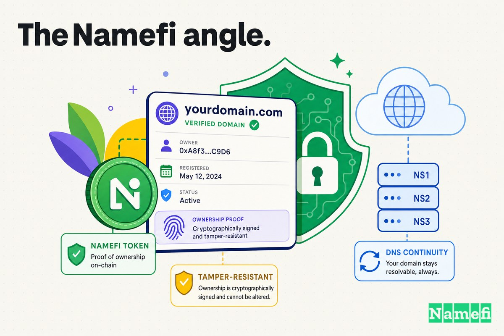

Pendant plus de quinze ans, l'un des plus anciens fournisseurs d'accès à Internet commerciaux des États-Unis vivait à une seule adresse : **panix.com**. Puis, au cours d'un long week-end férié en janvier 2005, quelqu'un s'en est emparé.

Pas en piratant un serveur. Pas en devinant un mot de passe. Il a rempli un formulaire de transfert, payé avec une carte de crédit volée, et attendu qu'une toute nouvelle règle de l'[ICANN](/fr/glossary/icann/) fasse le reste. En quelques heures, la propriété de panix.com avait été transférée à une entreprise en Australie, son DNS redirigé vers un hébergeur au Royaume-Uni, et sa messagerie reroutée via le Canada — tout cela tandis que les personnes qui géraient réellement Panix dormaient un samedi soir, sans avoir reçu le moindre avertissement.

Voici l'histoire de la façon dont un document administratif, et non une faille technique, a détourné le plus ancien FAI de New York — et comment le nettoyage a contribué à réécrire les règles qui régissent qui est autorisé à déplacer un domaine.

## Un FAI pionnier dont l'ensemble de l'activité reposait sur un seul domaine

Panix — Public Access Networks Corporation — n'était pas une petite histoire. Fondé en 1989, c'était, selon Wikipedia, le [troisième plus ancien FAI au monde après The World et NetCom](https://en.wikipedia.org/wiki/Panix_(ISP)#:~:text=third%2Doldest%20ISP%20in%20the%20world%20after%20The%20World%20and%20NetCom). C'était un pilier de l'internet commercial naissant à New York : comptes shell, messagerie, hébergement web, connexions dial-up puis haut débit que des milliers de New-Yorkais utilisaient pour se connecter.

Et comme presque toutes les entreprises internet d'alors et d'aujourd'hui, l'identité de Panix *était* son domaine. Les boîtes aux lettres des clients se terminaient par `@panix.com`. Les serveurs web répondaient à `www.panix.com`. L'ensemble de l'entreprise — sa marque, son accessibilité, ce qui faisait qu'un email d'un client arrivait réellement à destination — dépendait des enregistrements DNS attachés à un seul nom. Perdre le contrôle de ce nom, ce n'est pas perdre un actif marketing. C'est perdre le système nerveux de l'entreprise.

C'est exactement ce qui s'est passé.

## Janvier 2005 : le transfert frauduleux

Le récit juridique est précis sur la date. Comme le cabinet d'avocats Davis Wright Tremaine l'a résumé à l'époque, [le vendredi 14 janvier 2005, un piratage très médiatisé s'est produit lorsque le nom de domaine « panix.com », appartenant au fournisseur d'accès à Internet new-yorkais du même nom, a été transféré sans autorisation à un tiers](https://www.dwt.com/insights/2005/01/guarding-against-domain-name-hijacking#:~:text=On%20Friday%2C%20Jan.%2014%2C%202005%2C%20a%20high%2Dprofile%20hijacking%20occurred).

Aux premières heures de ce week-end, les conséquences étaient déjà visibles. The Register, qui rendait compte de l'incident au fur et à mesure, a décrit la redirection en une seule phrase qui ressemble encore à un schéma de braquage : [la propriété de panix.com a été transférée à une entreprise en Australie, les enregistrements DNS réels ont été transférés à une entreprise au Royaume-Uni, et le courrier de Panix.com a été redirigé vers une autre entreprise au Canada](https://www.theregister.com/2005/01/17/panix_domain_hijack/#:~:text=The%20ownership%20of%20panix.com%20was%20moved%20to%20a%20company%20in%20Australia).

Slashdot, où la nouvelle a éclaté auprès de la communauté technique au sens large le 16 janvier, a été direct : [Panix, le plus ancien fournisseur d'accès à Internet commercial de New York, a eu son nom de domaine « panix.com » détourné par des personnes inconnues](https://it.slashdot.org/story/05/01/16/0027213/new-yorks-oldest-isp-gets-domain-jacked).

Le détail le plus accablant, du point de vue de Panix, était le silence. L'entreprise [fondée en 1989 et plus ancien FAI commercial de New York, a déclaré qu'elle n'avait reçu, pas plus que son registraire, aucune notification des modifications proposées](https://www.theregister.com/2005/01/17/panix_domain_hijack/#:~:text=neither%20it%20nor%20its%20registrar%20received%20any%20notification%20of%20the%20proposed%20changes). Le transfert qui a dépossédé le domaine était, pour le propriétaire légitime, complètement invisible jusqu'à ce qu'il soit déjà effectué.

## La perturbation : le web et la messagerie hors ligne pendant plusieurs jours

Un domaine détourné n'est pas un interrupteur marche/arrêt propre — c'est une extinction lente et désagréable, et les pires dommages concernent la messagerie.

Lorsque vous contrôlez le DNS d'un domaine, vous contrôlez où son courrier est distribué. En reconfigurant les enregistrements de messagerie de panix.com, les pirates se sont transformés en bureau de poste pour toute la base de clientèle d'un FAI. Les messages entrants — factures, réinitialisations de mot de passe, correspondance professionnelle, courrier personnel — ont cessé d'arriver chez Panix et ont commencé à affluer vers un serveur contrôlé par les attaquants. InfoWorld, qui rendait compte après que la poussière soit retombée, a noté que le piratage [a privé certains clients de Panix d'accès à la messagerie pendant deux jours](https://www.infoworld.com/article/2211412/australian-company-takes-blame-for-panix-domain-hijack.html), et que certains de ces clients ont peut-être perdu une centaine de messages ou plus au cours du week-end.

Le courrier mal acheminé lors d'un piratage n'est pas simplement retardé. Une grande partie est perdue — renvoyé, abandonné, ou silencieusement avalé par un serveur qui n'était jamais censé le recevoir. Pour un fournisseur dont les clients mesuraient la valeur du service à « mon email est-il arrivé ? », des jours de courrier mal acheminé constituaient une panne proche du pire des scénarios.

Et les clients ne pouvaient rien faire. Le problème ne se trouvait pas sur les machines de Panix, qui fonctionnaient parfaitement. Il était dans la table de routage mondiale du [Système de Noms de Domaine](/fr/glossary/dns/), à laquelle on avait dit — par un [registraire](/fr/glossary/registrar/) en Australie, agissant sur une demande frauduleuse — que panix.com appartenait désormais à quelqu'un d'autre.

## Comment c'est arrivé : la faille de transfert à approbation automatique

Voici ce qui fait de Panix une affaire emblématique plutôt qu'un simple mauvais week-end : personne n'a pénétré par effraction. Le système a fonctionné exactement comme prévu. La conception était la vulnérabilité.

Les mécanismes ont fonctionné à travers une chaîne d'intermédiaires. Le domaine de Panix était enregistré chez **Dotster**, un registraire à Vancouver, dans l'État de Washington. Le transfert frauduleux a été initié via un compte chez **Fibranet Services Ltd.**, un [revendeur](/fr/glossary/reseller/) basé au Royaume-Uni, qui l'a soumis à **Melbourne IT**, un grand registraire en Australie. Comme InfoWorld l'a rapporté, [une erreur de Melbourne IT Ltd. a permis à des fraudeurs utilisant des cartes de crédit volées de prendre le contrôle de Panix.com](https://www.infoworld.com/article/2211412/australian-company-takes-blame-for-panix-domain-hijack.html) — le compte utilisé pour le transfert était [frauduleux et créé avec des cartes de crédit volées](https://www.infoworld.com/article/2211412/australian-company-takes-blame-for-panix-domain-hijack.html).

Mais la fraude à la carte de crédit n'a servi qu'à ouvrir le compte. Ce qui a réellement déplacé le domaine, c'est une politique. L'ICANN avait introduit un nouveau processus de transfert inter-registraires qui n'était entré en vigueur que quelques semaines auparavant, en novembre 2004, fondé sur un principe d'*approbation par défaut*. Comme The Register l'a expliqué, selon le nouveau cadre [ces règles, entrées en vigueur le novembre précédent, signifient que les demandes de transfert inter-registraires sont automatiquement approuvées après cinq jours à moins d'être contrordonnées par le propriétaire du domaine](https://www.theregister.com/2005/01/19/panix_hijack_more/#:~:text=automatically%20approved%20after%20five%20days%20unless%20countermanded%20by%20the%20domain%20owner).

Relisez cela, car c'est toute l'histoire. Le silence signifiait *oui*. Si le propriétaire légitime ne faisait rien — parce que, par exemple, il n'avait jamais reçu la notification — le transfert se produisait de lui-même. Davis Wright Tremaine a décrit le même piège du côté juridique : les nouvelles règles [rendent sans doute les transferts frauduleux plus faciles à réaliser car, selon ces règles, les domaines sont automatiquement transférés à moins que le propriétaire ne contrordonne la demande de transfert dans les cinq jours](https://www.dwt.com/insights/2005/01/guarding-against-domain-name-hijacking#:~:text=automatically%20transferred%20unless%20the%20owner%20countermands%20the%20transfer%20request%20within%20five%20days).

Ajoutez les défaillances et le tableau est sombre. Le registraire *acquéreur* (Melbourne IT, via Fibranet) a accepté une demande appuyée par une carte volée et, selon son propre aveu ultérieur, [n'a pas correctement vérifié la demande](https://www.dwt.com/insights/2005/01/guarding-against-domain-name-hijacking#:~:text=failed%20to%20properly%20verify%20the%20request). Le registraire *cédant* (Dotster) et le propriétaire légitime (Panix) n'ont reçu aucune notification effective et n'ont donc jamais rien contrordonné. Et le défaut de la politique — approuver sauf objection — a transformé cette absence d'objection en un vol accompli. Aucun pare-feu n'a été franchi. La paperasse était l'attaque.

## La récupération, et les réformes de politique qu'elle a déclenchées

La récupération, une fois les humains impliqués, a été rapide — et c'est en soi une accusation, car cela prouvait que le transfert n'aurait jamais dû être approuvé en premier lieu.

Dès le dimanche, [Panix avait récupéré son domaine Panix.com auprès de la société australienne d'hébergement et d'enregistrement de domaines Melbourne IT, où le domaine dérobé était stationné](https://www.theregister.com/2005/01/17/panix_domain_hijack/#:~:text=Panix%20had%20recovered%20its%20Panix.com%20domain), et l'avait redirigé vers son emplacement naturel chez Dotster. La correction au niveau du [registre](/fr/glossary/registry/) a été presque instantanée ; le nettoyage mondial ne l'était pas, car le DNS n'oublie pas sur commande. Comme The Register l'a noté, les serveurs racines ont été mis à jour rapidement, mais la nature distribuée du DNS signifiait qu'il faudrait jusqu'à 24 heures avant que la normalité soit pleinement rétablie — les caches du monde entier devaient expirer avant que chaque utilisateur voie le vrai panix.com à nouveau.

Melbourne IT, à son crédit, ne s'est pas caché. Deux jours plus tard, The Register a rapporté qu'[un registraire de domaines australien a admis sa part dans le détournement de nom de domaine du week-end précédent](https://www.theregister.com/2005/01/19/panix_hijack_more/#:~:text=An%20Australian%20domain%20registrar%20has%20admitted%20to%20its%20part), attribuant la défaillance à une étape de vérification dans son processus de transfert qui n'avait pas été effectuée, et s'engageant à ce que la faille ayant permis l'erreur soit fermée.

Mais la conséquence la plus importante était structurelle. Panix est devenu l'exemple de référence dans la réflexion plus large sur la sécurité des transferts qui a suivi. Le Comité consultatif sur la sécurité et la stabilité de l'ICANN a publié un rapport de 2005, [*Domain Name Hijacking: Incidents, Threats, Risks, and Remedial Actions*](https://itp.cdn.icann.org/en/files/security-and-stability-advisory-committee-ssac-reports/hijacking-report-12-07-2005-en.pdf), examinant précisément cette catégorie de défaillance — des registraires acceptant des transferts sans confirmer que le demandeur était réellement le titulaire. Les correctifs durables qui ont renforcé le système remontent directement à des week-ends comme celui-là :

- **Verrous de registraire par défaut.** Un domaine réglé sur `clientTransferProhibited` refuse simplement tout transfert jusqu'à ce que le verrou soit retiré par le titulaire légitime. Ce qui était autrefois une option obscure est devenu, pour de nombreux registraires, l'état par défaut — un frein que la règle d'approbation automatique ne pouvait pas contourner.
- **Codes auth (codes de transfert EPP).** Les transferts de [gTLD](/fr/glossary/gtld/) modernes exigent un [code d'autorisation](/fr/glossary/auth-code/) secret que le registraire *cédant* ne libère qu'au titulaire vérifié, de sorte qu'un registraire acquéreur ne peut plus retirer un domaine sur simple papier.
- **Une [Politique de transfert ICANN](https://www.icann.org/en/contracted-parties/accredited-registrars/resources/domain-name-transfers/policy) documentée** avec des obligations de confirmation plus strictes et un canal de contact d'urgence pour inverser exactement ce type de transfert frauduleux rapidement.

Le piratage de Panix n'a pas inventé ces mécanismes à lui seul, mais il est devenu l'affaire vers laquelle tout le monde pointait lorsqu'il fallait argumenter qu'ils étaient nécessaires.

## Ce que cela enseigne sur les verrous de transfert et la vérification

En faisant abstraction des dates et des noms de registraires, Panix laisse quelques leçons durables.

1. **L'autorisation par défaut est une décision de sécurité, et généralement la mauvaise.** Le choix de conception le plus dangereux en 2005 était que *le silence équivaut au consentement*. Un transfert qui s'effectue quand le propriétaire ne fait rien suppose que le propriétaire surveille toujours et est toujours joignable. Ni l'un ni l'autre n'est vrai pendant un week-end férié.
2. **L'identité doit être vérifiée par la partie qui cède l'actif, pas seulement par celle qui le prend.** Le registraire acquéreur voulait l'affaire et avait toutes les raisons de dire oui. La vraie sécurité n'est venue que lorsque le registraire *cédant* devait libérer un code auth à un titulaire vérifié — plaçant la vérification là où l'actif réside réellement.
3. **Activez le verrou.** `clientTransferProhibited` est la protection la moins chère et la plus efficace qu'un propriétaire de domaine possède contre cette attaque précise, et elle ne coûte rien. Un domaine verrouillé ne peut pas être silencieusement transféré, quelle que soit la convaincante que soit la paperasse. Verrouillez vos noms importants et laissez-les verrouillés.
4. **Votre domaine est votre point de défaillance unique.** Les serveurs de Panix n'ont jamais été compromis, et pourtant l'entreprise était effectivement hors ligne. Lorsqu'un seul enregistrement dans un registre peut rediriger toute votre présence web et messagerie, cet enregistrement mérite plus de protection que vos serveurs.
5. **Surveillez les notifications.** La fenêtre de cinq jours pour contrordonner ne protège que le propriétaire qui reçoit — et lit — réellement la notification de transfert. Un email de titulaire obsolète, un contact administratif non surveillé, ou un week-end férié transforme une soupape de sécurité en une défaillance silencieuse.

## L'angle Namefi

Le piratage de Panix est, en son cœur, un problème d'*autorité*. La question « qui est autorisé à déplacer ce domaine ? » était résolue par une chaîne de revendeurs et un minuteur d'approbation par défaut plutôt que par une preuve solide et vérifiable de propriété. Une carte de crédit volée et cinq jours de silence suffisaient à convaincre le système qu'un inconnu dans un autre hémisphère représentait un FAI à New York.

[Namefi](https://namefi.io) part du postulat inverse : que le contrôle d'un domaine doit être prouvable, pas supposé. En représentant la propriété d'un domaine sous la forme d'un actif tokenisé, sur chaîne, qui reste compatible avec le DNS, l'acte de « qui détient ce nom » devient cryptographiquement vérifiable et auditable — un enregistrement qui ne peut pas être silencieusement écrasé par un registraire acceptant de mauvais documents. Les transferts s'effectuent quand la clé du titulaire les autorise, pas quand une horloge de cinq jours s'écoule sans surveillance. Le défaut est *refuser*, et le consentement doit être démontré, pas simplement non-contesté.

Rien de tout cela n'existait en 1989 quand Panix a été fondé — ni même en 2005, quand le piratage s'est produit. Mais cela pointe vers la leçon que ce week-end a enseignée à toute l'industrie : un domaine est trop important pour être gouverné par le silence. La propriété devrait être quelque chose que vous pouvez prouver à la demande — et quelque chose qu'un inconnu ne peut pas prendre simplement parce que vous ne surveilliez pas votre boîte de réception pendant un long week-end.

## Sources et lectures complémentaires

- The Register — [Panix récupère après un détournement de domaine](https://www.theregister.com/2005/01/17/panix_domain_hijack/)
- The Register — [Piratage de Panix.com : une entreprise australienne assume la responsabilité](https://www.theregister.com/2005/01/19/panix_hijack_more/)
- Davis Wright Tremaine — [Se protéger contre le détournement de nom de domaine](https://www.dwt.com/insights/2005/01/guarding-against-domain-name-hijacking)
- InfoWorld — [Une entreprise australienne assume la responsabilité du piratage du domaine Panix](https://www.infoworld.com/article/2211412/australian-company-takes-blame-for-panix-domain-hijack.html)
- Slashdot — [Le plus ancien FAI de New York se fait voler son domaine](https://it.slashdot.org/story/05/01/16/0027213/new-yorks-oldest-isp-gets-domain-jacked)
- Wikipedia — [Panix (FAI)](https://en.wikipedia.org/wiki/Panix_(ISP))
- Wikipedia — [Détournement de domaine](https://en.wikipedia.org/wiki/Domain_hijacking)
- ICANN SSAC — [Domain Name Hijacking: Incidents, Threats, Risks, and Remedial Actions (2005)](https://itp.cdn.icann.org/en/files/security-and-stability-advisory-committee-ssac-reports/hijacking-report-12-07-2005-en.pdf)
- ICANN — [Politique de transfert](https://www.icann.org/en/contracted-parties/accredited-registrars/resources/domain-name-transfers/policy)
- Archives de la liste de diffusion NANOG — [discussion sur le transfert de panix.com et les remèdes de l'ICANN](https://diswww.mit.edu/charon/nanog/77162)
