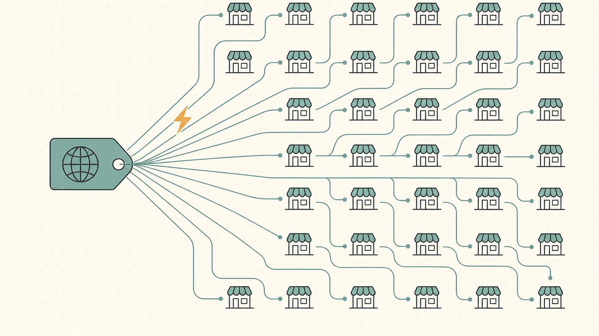
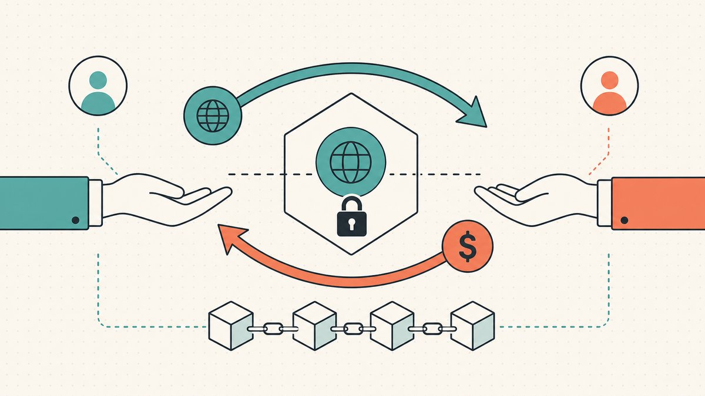
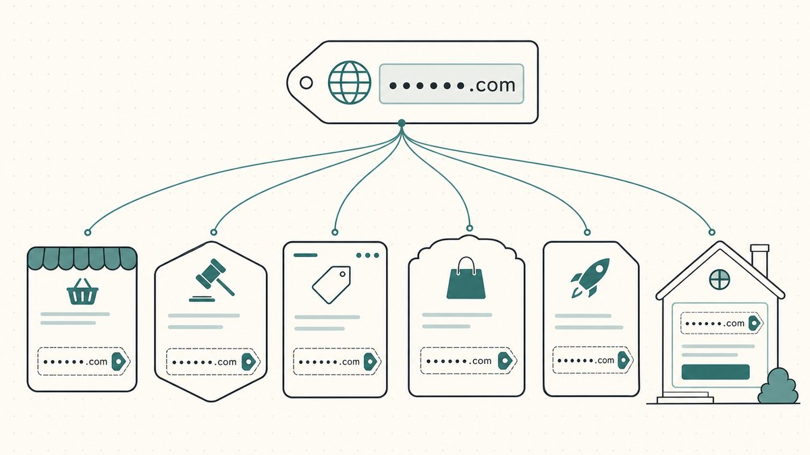

Une annonce n'est pas une vente, mais une annonce au mauvais endroit est la garantie de ne pas vendre. Une fois que vous avez décidé de vendre — un sujet traité dans notre article phare sur [comment vendre des domaines pour en tirer profit](/fr/blog/how-to-sell-domains-for-profit/), qui fait partie de notre guide plus large sur le [domain flipping](/fr/blog/domain-flipping/) — la question suivante est purement pratique : sur quelle plateforme l'annoncer ? La réponse est rarement « sur une seule ». La plupart des domainers actifs listent le même nom à plusieurs endroits à la fois, car chaque place de marché atteint une clientèle différente. Cet article compare les principales plateformes selon les quatre critères qui déterminent réellement une vente : la portée, les frais, la rapidité du transfert et la manière dont le nom change de mains une fois que quelqu'un clique sur « acheter ».

Commençons par la taille du marché que vous vous apprêtez à intégrer. Le [marché secondaire des domaines](/fr/glossary/marketplace/) (ou *aftermarket*) est, selon Wikipédia, [le marché de revente secondaire pour les noms de domaine Internet dans lequel une partie intéressée par l'acquisition d'un domaine déjà enregistré fait une offre ou négocie un prix](https://en.wikipedia.org/wiki/Domain_aftermarket#:~:text=the%20secondary%20resale%20market%20for%20Internet%20domain%20names) pour le transférer. C'est un marché réel et liquide : selon NameBio, comme le rapporte Wikipédia, [144 700 ventes de noms de domaine totalisant 185 millions de dollars américains ont été enregistrées en 2024](https://en.wikipedia.org/wiki/Domain_aftermarket#:~:text=According%20to%20NameBio%2C%20144%2C700%20domain%20name%20sales%20totaling%20US%24185%20million%20were%20recorded%20in%202024) — et cela ne représente que la partie déclarée des transactions.

## Les quatre critères qui différencient les places de marché

Avant de parler des plateformes, parlons des critères. Lorsque vous comparez les plateformes, vous comparez en réalité quatre variables :

- **La portée.** Combien d'acheteurs voient votre annonce, et via combien de canaux partenaires. Une place de marché qui syndique votre nom à d'autres registrars le met en avant auprès de personnes effectuant une recherche au moment de l'achat sur un site que vous ne visiterez jamais.
- **Les frais.** La commission que la plateforme prélève lorsqu'un nom est vendu, plus les éventuels frais d'annonce ou de transaction. Ils varient d'environ un dixième de la vente à, sur certains canaux, un cinquième — et le taux affiché dépend souvent de si l'acheteur est arrivé directement ou via un partenaire.
- **Le transfert rapide.** Si la passation est automatisée ou non. Le point de friction dans toute vente est le [transfert](/fr/glossary/cross-registrar-transfer/) — faire parvenir le [code d'autorisation](/fr/glossary/auth-code/) à l'acheteur et déplacer le nom entre les registrars. Les grands réseaux automatisent désormais ce processus pour que le paiement et le transfert se fassent quasi instantanément.
- **Le règlement.** Comment l'argent et le nom sont réellement échangés sans que l'une ou l'autre des parties ne se fasse léser. Traditionnellement, c'est un service de [séquestre (escrow)](/fr/glossary/escrow/) ; [on-chain](/fr/glossary/on-chain/), c'est un [smart contract](/fr/glossary/smart-contract/). Dans tous les cas, c'est là que la confiance se joue.

Gardez ces quatre éléments en tête et les places de marché se classeront rapidement d'elles-mêmes.

## Afternic : la portée et le réseau de transfert rapide

Afternic est le champion de la distribution. Tout son argumentaire repose sur la syndication : vous listez une fois, et le nom se propage à travers un vaste réseau de vitrines de registrars pour que les acheteurs le trouvent où qu'ils fassent leurs achats. Afternic annonce une [distribution mondiale via plus de 100 revendeurs](https://www.afternic.com/domain-reseller-network#:~:text=100%2B%20resellers) et [125 millions de recherches qualifiées chaque mois](https://www.afternic.com/domain-reseller-network#:~:text=125%20million%20qualified%20searches%20each%20month) sur ce réseau. C'est cette ampleur qui en fait le premier choix de la plupart des revendeurs de domaines.

Afternic appartient à GoDaddy — la [marque verbale Afternic est une marque déposée de GoDaddy Operating Company](https://www.afternic.com/domain-reseller-network#:~:text=The%20Afternic%20word%20mark%20is%20a%20registered%20trademark%20of%20GoDaddy) — ce qui est important car GoDaddy est le plus grand [registrar](/fr/glossary/registrar/) au monde, avec, selon Wikipédia, [plus de 62 millions de domaines enregistrés](https://en.wikipedia.org/wiki/GoDaddy#:~:text=over%2062%20million%20registered%20domains) et 20 millions de clients. Lister sur Afternic connecte votre nom à cet entonnoir de vente.

L'autre fonctionnalité d'Afternic à comprendre est le **Fast Transfer** (transfert rapide). Selon les propres termes d'Afternic, c'est [un service offert par Afternic qui permet aux propriétaires de domaines de vendre leurs domaines rapidement et facilement en permettant des transferts de domaine immédiats à l'acheteur](https://www.afternic.com/fast-transfer#:~:text=a%20service%20offered%20by%20Afternic%20that%20allows%20domain%20owners%20to%20sell%20their%20domains%20quickly%20and%20easily) ; activez cette option pour un nom éligible et [le transfert se produit automatiquement et instantanément](https://www.afternic.com/fast-transfer#:~:text=the%20transfer%20happens%20automatically%20and%20instantly), le paiement étant libéré dès que l'acheteur paie. Le bémol sur les frais : les taux diffèrent selon le canal, et les noms vendus via des registrars partenaires entraînent une commission plus élevée que les ventes directes, alors lisez la grille tarifaire actuelle avant de vous baser sur un chiffre.

## Sedo : la place de marché européenne historique

Sedo est l'autre poids lourd, et celui qui a les racines les plus profondes. Wikipédia le décrit comme [une société américaine de marché secondaire de domaines dont le siège est à Cambridge, Massachusetts](https://en.wikipedia.org/wiki/Sedo#:~:text=an%20American%20domain%20aftermarket%20company), bien que son centre de gravité ait toujours été européen — elle a été [fondée en 2000 par trois étudiants allemands](https://en.wikipedia.org/wiki/Sedo#:~:text=founded%20in%202000%20by%20three%20German%20college%20students). Depuis deux décennies et demie, c'est l'une des deux plateformes que Wikipédia cite en disant que les transactions du marché secondaire [sont facilitées par des plateformes telles qu'Afternic et Sedo](https://en.wikipedia.org/wiki/Domain_aftermarket#:~:text=Transactions%20are%20facilitated%20by%20aftermarket%20platforms%20such%20as%20Afternic%20and%20Sedo).

En pratique, Sedo est fort là où Afternic est plus faible. Il gère une activité [d'enchères](/fr/glossary/auction/) très active, a une véritable portée auprès des acheteurs européens et internationaux, et sa place de marché permet aux acheteurs et aux vendeurs d'[interagir, souvent de manière anonyme, pour négocier et conclure une transaction](https://en.wikipedia.org/wiki/Domain_aftermarket#:~:text=interact%2C%20often%20anonymously) — utile lorsque vous ne voulez pas qu'un acheteur potentiel sache à quel point vous voulez vendre. Sedo gère également son propre processus de transfert et de séquestre, et comme Afternic, sa commission est un pourcentage de la vente avec un minimum déclaré. La pratique courante est de lister à la fois sur Sedo et Afternic, et non sur l'un ou l'autre.

## Dan : la place de marché qui est devenue Afternic

C'est ici qu'un guide écrit il y a seulement deux ans vous induirait en erreur. Dan.com a été, pendant un certain temps, la plateforme préférée de nombreux domainers — un processus de paiement épuré, des frais transparents, une expérience utilisateur à côté de laquelle les autres semblaient maladroites. Mais Dan n'existe plus en tant que place de marché indépendante. Dans le message d'adieu de Dan.com, [en 2022, nous avons rejoint GoDaddy](https://dancom.medium.com/farewell-from-dan-com-eb8256625430#:~:text=in%202022%2C%20we%20joined%20GoDaddy), et depuis lors, GoDaddy a [travaillé à intégrer les fonctionnalités et la philosophie qui définissaient Dan.com dans Afternic](https://dancom.medium.com/farewell-from-dan-com-eb8256625430#:~:text=integrate%20the%20features%20and%20philosophy%20that%20defined%20Dan.com%20into%20Afternic). La plateforme a été mise hors service : selon le même avis, [la plateforme Dan.com sera officiellement retirée le 27 juin 2025](https://dancom.medium.com/farewell-from-dan-com-eb8256625430#:~:text=the%20Dan.com%20platform%20will%20officially%20retire%20on%20June%2027%2C%202025).

Donc, « vendre sur Dan » en 2026 signifie vendre sur Afternic. Nous gardons Dan dans ce comparatif car vous le verrez encore recommandé dans d'anciens guides et fils de discussion — ce conseil est obsolète. La leçon plus large que chaque [revendeur](/fr/glossary/reseller/) devrait retenir : une place de marché est une contrepartie, et les contreparties sont rachetées, fusionnées et abandonnées. Ne construisez pas tout votre processus de vente autour des particularités d'une seule plateforme.

## L'option on-chain : les places de marché tokenisées

Il existe une nouvelle catégorie qui change la question du règlement plutôt que celle de la portée. Sur une place de marché tokenisée, le contrôle du domaine est représenté par un jeton (token) on-chain, et la transaction est réglée via un smart contract au lieu d'un agent de séquestre humain. Le problème de confiance est le plus ancien du secteur : le vendeur ne transférera pas avant d'être payé, l'acheteur ne paiera pas avant de recevoir le nom. Les plateformes traditionnelles répondent avec un service de séquestre — un tiers qui, comme le dit Wikipédia, [reçoit et débourse de l'argent ou des biens pour les parties principales de la transaction, le décaissement dépendant des conditions convenues](https://en.wikipedia.org/wiki/Escrow#:~:text=receives%20and%20disburses%20money%20or%20property%20for%20the%20primary%20transacting%20parties). Un smart contract peut appliquer la même garantie « aucune partie n'agit en premier » par le code, libérant le nom et les fonds de manière atomique.

La portée est plus faible et la catégorie est jeune, ce n'est donc pas encore un remplacement pour une annonce sur Afternic. Mais pour les noms de grande valeur où le risque lié au règlement est la partie la plus effrayante, c'est une véritable alternative, et c'est là qu'une partie de l'industrie se dirige. Nous traçons cette trajectoire dans [comment les places de marché tokenisées remplacent le séquestre](/fr/blog/how-tokenized-marketplaces-replace-escrow/), avec les subtilités fiscales dans [questions de fiscalité et de comptabilité pour les domaines tokenisés](/fr/blog/tax-and-accounting-questions-for-tokenized-domains/).

[Namefi](https://namefi.io) est une option dans cette catégorie. La propriété tokenisée rend le contrôle d'un vrai domaine [ICANN](/fr/glossary/icann/) plus facile à vérifier et à transférer, avec une continuité DNS pour que le nom continue de se résoudre correctement pendant la passation — pas d'heures sombres où un site en ligne tombe en panne au milieu de la transaction. Ce n'est pas la plateforme pour échanger un nom enregistré manuellement à 200 $ ; c'est la plateforme pour la transaction où vous passeriez autrement une semaine à envoyer des e-mails nerveux à un agent de séquestre.

## Comment lister sur plusieurs plateformes à la fois

La bonne stratégie pour la plupart des noms est la largeur, pas la loyauté. Voici la version pratique :

1. **Listez sur Afternic et Sedo.** Entre les deux, vous couvrez les deux plus grands réseaux de portée ainsi que les acheteurs européens et ceux qui fréquentent les enchères. C'est la base pour tout nom que vous voulez vraiment vendre.
2. **Activez le transfert rapide lorsque c'est possible.** Opter pour le Fast Transfer d'Afternic (ou l'équivalent sur d'autres plateformes) pour un nom éligible supprime l'étape la plus lente et la plus susceptible de faire échouer une vente : la passation manuelle. Sachez simplement que l'éligibilité au transfert rapide exige souvent que le nom soit chez un registrar participant, alors vérifiez.
3. **Attention aux conflits de prix.** Si vous listez le même nom sur plusieurs plateformes, gardez le prix d'[achat immédiat](/fr/blog/domain-pricing-psychology-buy-now-vs-make-offer/) cohérent. Un acheteur qui voit 4 000 $ sur un site et 3 000 $ sur un autre ne pense pas « bonne affaire », il pense « amateur », et il attendra que vous cédiez.
4. **Ajoutez votre propre page de vente.** Une page de destination sur le nom lui-même capte l'acheteur le plus précieux : celui qui a tapé le domaine directement. C'est de la pure demande [entrante](/fr/blog/inbound-vs-outbound-domain-sales/) à la marge la plus élevée, sans commission de place de marché.
5. **Réservez la voie on-chain pour les noms qui le justifient.** Pour les transactions à cinq chiffres et plus où le règlement est le risque, une place de marché tokenisée ou un processus de séquestre géré par un [courtier](/fr/blog/working-with-domain-brokers/) a toute sa place.

Une mise en garde sur la syndication : lorsqu'un nom est listé à plusieurs endroits, vous devez les maintenir synchronisés. Le jour où un nom est vendu, retirez-le immédiatement de toutes les autres plateformes, et ne listez jamais un nom que vous ne pouvez pas transférer actuellement — les noms récemment déplacés sont soumis à un verrouillage de registrar, un piège que nous couvrons dans [comment vendre un nom de domaine que vous possédez](/fr/blog/how-to-sell-a-domain-name-you-own/) et dans [comment le détournement de domaine se produit réellement](/fr/blog/how-domain-hijacking-actually-happens/).

## Un mot rapide sur quelle extension se vend où

Le choix de la plateforme interagit avec l'[extension](/fr/glossary/tld/). Les réseaux de portée de masse sont conçus pour le [.com](/fr/tld/com/) et les alternatives populaires — [.io](/fr/tld/io/), [.ai](/fr/tld/ai/), [.co](/fr/tld/co/), [.xyz](/fr/tld/xyz/), [.app](/fr/tld/app/) — et c'est là que leur syndication trouve réellement des acheteurs. Un [ccTLD](/fr/glossary/cctld/) de niche ou nouveau pourrait mieux se vendre via un forum spécialisé ou une vente directe que sur une place de marché générique, simplement parce que les acheteurs se rassemblent ailleurs. Pour comprendre comment l'extension façonne à la fois la valeur et la liquidité, consultez [pourquoi les domaines .io sont chers](/fr/blog/why-are-io-domains-expensive/) et le tableau du volume d'enregistrement dans [part de marché des ccTLD par volume d'enregistrement](/fr/blog/cctld-market-share-by-registration-volume/).

Et gardez le réalisme de notre article phare en tête. Les trophées les plus médiatisés — Voice.com à [30 000 000 $ en 2019](https://en.wikipedia.org/wiki/List_of_most_expensive_domain_names#:~:text=Voice.com) et Sex.com à [13 000 000 $ en 2010](https://en.wikipedia.org/wiki/List_of_most_expensive_domain_names#:~:text=Sex.com) — figurent sur une liste explicitement [limitée aux ventes de noms de domaine purs et uniquement en espèces](https://en.wikipedia.org/wiki/List_of_most_expensive_domain_names#:~:text=This%20list%20is%20limited%20to%20pure%20domain%20name%20and%20cash%2Donly%20sales) de 3 millions de dollars ou plus. Ce ne sont pas les concurrents de votre annonce sur une place de marché. La plateforme ne fait pas la valeur du nom ; elle décide simplement combien d'acheteurs pertinents le verront.

## Avertissement amical (Lisez-moi !)

> Nous ne sommes ni avocats, ni comptables, ni conseillers financiers, ni médecins, et **rien dans cet article ne constitue un conseil juridique, financier, fiscal, comptable, médical ou de toute autre nature professionnelle.** Nous écrivons ces articles pour nous informer et pour la commodité de nos clients. Les informations ici peuvent être obsolètes, spécifiques à une géographie, ou tout simplement erronées. Nous faisons aussi des erreurs.
>
> Pour toute décision importante, **veuillez consulter un vrai professionnel (sérieusement !)**. Ou si ce n'est pas votre style, demandez à un ami, demandez à Twitter, demandez à Reddit, demandez à une IA, ou demandez à un médium. En bref : **FVRR - Faites Vos Propres Recherches**. Apprenons et amusons-nous.

## Sources et lectures complémentaires

- Wikipedia — [Domain aftermarket](https://en.wikipedia.org/wiki/Domain_aftermarket#:~:text=the%20secondary%20resale%20market%20for%20Internet%20domain%20names) (définition ; volume NameBio 2024 ; Afternic et Sedo comme facilitateurs ; négociation anonyme)
- Afternic — [Domain Reseller Network](https://www.afternic.com/domain-reseller-network#:~:text=100%2B%20resellers) (plus de 100 revendeurs ; 125 millions de recherches mensuelles ; propriété de GoDaddy) et [Fast Transfer](https://www.afternic.com/fast-transfer#:~:text=a%20service%20offered%20by%20Afternic%20that%20allows%20domain%20owners%20to%20sell%20their%20domains%20quickly%20and%20easily)
- Wikipedia — [Sedo](https://en.wikipedia.org/wiki/Sedo#:~:text=an%20American%20domain%20aftermarket%20company) (société de marché secondaire américaine, Cambridge MA ; fondée en 2000)
- Wikipedia — [GoDaddy](https://en.wikipedia.org/wiki/GoDaddy#:~:text=over%2062%20million%20registered%20domains) (plus de 62 millions de domaines enregistrés)
- Dan.com — [Farewell from Dan.com](https://dancom.medium.com/farewell-from-dan-com-eb8256625430#:~:text=the%20Dan.com%20platform%20will%20officially%20retire%20on%20June%2027%2C%202025) (a rejoint GoDaddy en 2022 ; intégré à Afternic ; retiré le 27 juin 2025)
- Wikipedia — [Escrow](https://en.wikipedia.org/wiki/Escrow#:~:text=receives%20and%20disburses%20money%20or%20property%20for%20the%20primary%20transacting%20parties) (définition)
- Wikipedia — [List of most expensive domain names](https://en.wikipedia.org/wiki/List_of_most_expensive_domain_names#:~:text=Voice.com) (Voice.com 30 M$/2019, Sex.com 13 M$/2010 ; portée des ventes de domaines purs, en espèces, de plus de 3 M$)
