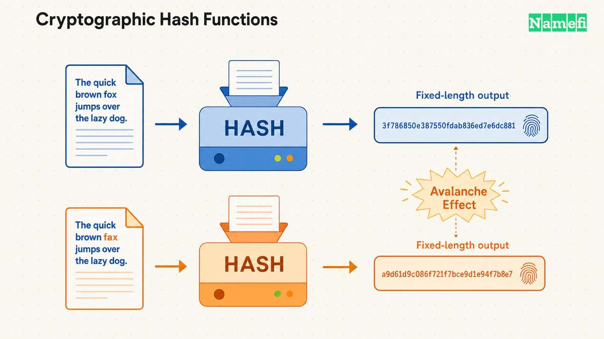
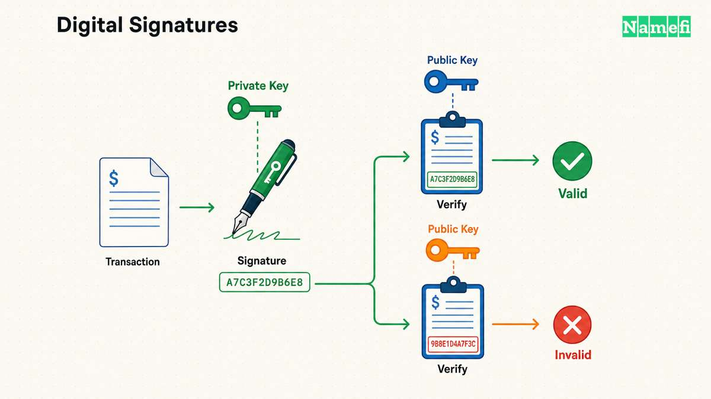
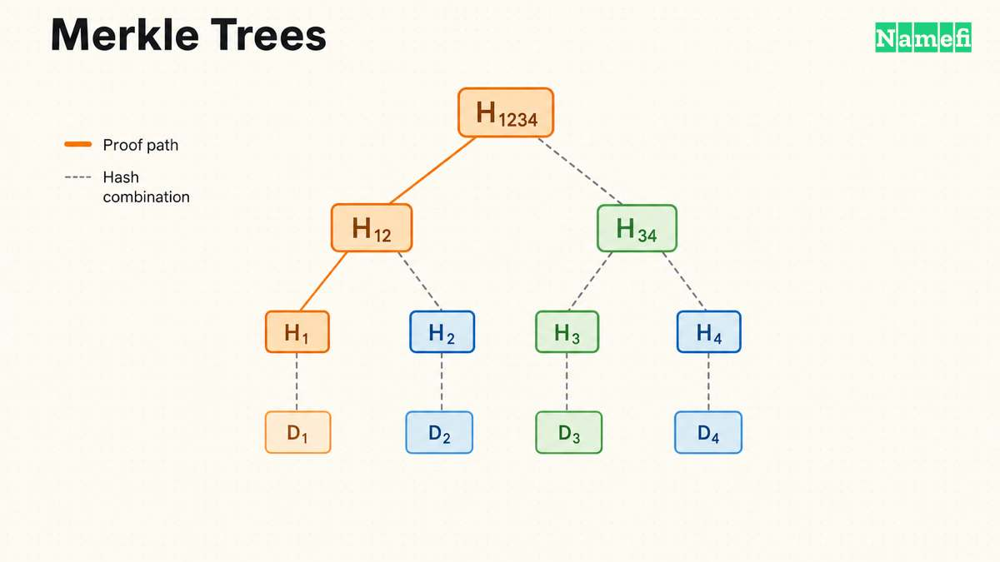

ब्लॉकचेन का हर दावा—“यह ट्रांज़ैक्शन अंतिम है,” “यह एड्रेस इस एसेट का मालिक है,” “इस इतिहास में बदलाव नहीं किया गया है”—आखिरकार कुछ क्रिप्टोग्राफ़िक प्रिमिटिव्स पर निर्भर करता है, जिनमें से हर एक का काम सीमित और स्पष्ट रूप से परिभाषित है। इनमें से कोई भी ब्लॉकचेन का आविष्कार नहीं है। हैश फ़ंक्शन, डिजिटल सिग्नेचर और मर्कल ट्री Bitcoin से दशकों पहले मौजूद थे। ब्लॉकचेन ने इन्हें ऐसी प्रणाली में जोड़ा, जहाँ इनमें से किसी भी दावे को सही मानने के लिए किसी एक पक्ष पर भरोसा करना ज़रूरी नहीं होता।

यह गाइड उन प्रिमिटिव्स को समझाती है जो वास्तव में यह जिम्मेदारी उठाते हैं: डेटा का फ़िंगरप्रिंट बनाने वाले [हैश फ़ंक्शन](/hi/glossary/hash-function/), ट्रांज़ैक्शन को अधिकृत करने वाले [डिजिटल सिग्नेचर](/hi/glossary/digital-signature/), विशाल डेटासेट के अलग-अलग हिस्सों को सत्यापित करने योग्य बनाने वाले [मर्कल ट्री](/hi/glossary/merkle-tree/), इन सिग्नेचरों के पीछे काम करने वाला एलिप्टिक-कर्व गणित, और कमिटमेंट स्कीम—वह आधारभूत घटक जो आगे [ज़ीरो-नॉलेज प्रूफ़](/hi/glossary/zero-knowledge-proof/) तक ले जाता है। इनमें से हर एक को समझना यह जानने का सबसे तेज़ तरीका है कि ब्लॉकचेन अंदरूनी तौर पर वास्तव में क्या करता है।

---

## क्रिप्टोग्राफ़िक हैश फ़ंक्शन (SHA-256, Keccak)

एक [हैश फ़ंक्शन](/hi/glossary/hash-function/) किसी भी आकार का इनपुट लेकर नियतात्मक तरीके से निश्चित आकार का आउटपुट—एक “डाइजेस्ट”—बनाता है। इसकी खासियत यह है कि इनपुट का केवल एक बिट पलटने पर भी आउटपुट पूरी तरह बदल जाता है, और समान हैश आउटपुट देने वाले दो अलग इनपुट ढूँढना संगणकीय रूप से अव्यावहारिक होता है। यही गुण, जिसे कोलिज़न रेज़िस्टेंस कहते हैं, हैश को मनचाहे आकार के डेटा के लिए एक छोटा और छेड़छाड़ का पता लगाने वाला फ़िंगरप्रिंट बनाता है।

Bitcoin हर जगह SHA-256 का इस्तेमाल करता है: हर नए ब्लॉक हेडर में पिछले हेडर का SHA256(SHA256()) हैश शामिल करके हेडरों को जोड़ा जाता है। इसलिए किसी पुराने ब्लॉक को बदलने पर उसका हैश बदल जाता है और उसके बाद आने वाला हर हेडर अमान्य हो जाता है ([Bitcoin डेवलपर गाइड](https://developer.bitcoin.org/devguide/block_chain.html#:~:text=Each%20block%20also%20stores%20the%20hash%20of%20the%20previous%20block%27s%20header%2C%20chaining%20the%20blocks%20together))। यही डबल-SHA-256 संरचना ट्रांज़ैक्शन को हैश करके ब्लॉक के [मर्कल ट्री](/hi/glossary/merkle-tree/) में रखती है ([Bitcoin.org संदर्भ](https://developer.bitcoin.org/reference/block_chain.html#:~:text=A%20SHA256%28SHA256%28%29%29%20hash%20in%20internal%20byte%20order))।

इसके विपरीत Ethereum अपने सामान्य-उद्देश्य हैश के रूप में Keccak-256 को मानकीकृत करता है। यह मूल Keccak प्रस्तुति है और बाद में आए NIST SHA-3 मानक से अलग है। हर अकाउंट एड्रेस, अकाउंट की [पब्लिक की](/hi/glossary/public-key/) के Keccak-256 हैश के आखिरी 20 बाइट लेकर निकाला जाता है ([ethereum.org](https://ethereum.org/en/developers/docs/accounts/#:~:text=You%20get%20a%20public%20address%20for%20your%20account%20by%20taking%20the%20last%2020%20bytes%20of%20the%20Keccak-256%20hash%20of%20the%20public%20key))। यही फ़ंक्शन Ethereum की स्थिति को स्टोर करने वाले [मर्कल पैट्रिशिया ट्राइ](https://ethereum.org/en/developers/docs/data-structures-and-encoding/patricia-merkle-trie/#:~:text=key%20%3D%3D%20keccak256%28rlp%28value%29%29) में हर जगह इस्तेमाल होने वाली की/वैल्यू कंटेंट एड्रेसिंग का आधार भी है।

हैशिंग ही ब्लॉक हेडरों को बिखरे हुए रिकॉर्डों के समूह के बजाय एक चेन में जोड़ती है: किसी हेडर को बदलने पर उसका हैश बदल जाता है और उसके बाद के हेडरों में मौजूद संदर्भ टूट जाते हैं। बाद का काम दोबारा करने और ईमानदार नेटवर्क से आगे निकलने की अतिरिक्त ज़रूरत खास तौर पर Bitcoin की Proof of Work सहमति पर लागू होती है। वहाँ किसी पुराने ब्लॉक को बदलने वाले हमलावर को उस ब्लॉक का Proof of Work और उसके बाद का पूरा काम फिर से करना पड़ता है, फिर ईमानदार चेन की बराबरी करनी पड़ती है ([Bitcoin श्वेतपत्र, §4](https://bitcoin.org/bitcoin.pdf))। अन्य ब्लॉकचेन अलग सहमति नियमों के तहत इतिहास की प्रामाणिकता सुनिश्चित करके उसे अंतिम रूप देते हैं, इसलिए केवल हैश से जोड़ना उस Proof of Work की लागत पैदा नहीं करता। हेडर हैश का यह जुड़ाव ही वह शाब्दिक कारण है जिसके चलते इस डेटा संरचना को **ब्लॉकचेन** कहा जाता है।

---

## पब्लिक-की क्रिप्टोग्राफी और डिजिटल सिग्नेचर (ECDSA, EdDSA, BLS)

ब्लॉकचेन में लॉगिन फ़ॉर्म नहीं होता, इसलिए उसे यह साबित करने के लिए दूसरा तरीका चाहिए कि “यह ट्रांज़ैक्शन सच में इस अकाउंट के मालिक की ओर से आया है।” [पब्लिक-की क्रिप्टोग्राफी](/hi/glossary/public-key/) यह काम एक की-पेयर से करती है: गुप्त रखी जाने वाली [प्राइवेट की](/hi/glossary/private-key/) और स्वतंत्र रूप से साझा की जा सकने वाली पब्लिक की। प्राइवेट की से ट्रांज़ैक्शन पर हस्ताक्षर करने पर एक [डिजिटल सिग्नेचर](/hi/glossary/digital-signature/) बनता है, जिसे कोई भी पब्लिक की के आधार पर सत्यापित कर सकता है। इससे प्राइवेट की उजागर किए बिना ही प्राधिकरण साबित हो जाता है।

Ethereum अकाउंट secp256k1 कर्व पर Elliptic Curve Digital Signature Algorithm, यानी ECDSA, का इस्तेमाल करके प्राइवेट की से पब्लिक की निकालते हैं। Bitcoin भी इसी कर्व का इस्तेमाल करता है ([ethereum.org अकाउंट दस्तावेज़](https://ethereum.org/en/developers/docs/accounts/#:~:text=The%20public%20key%20is%20generated%20from%20the%20private%20key%20using%20the%20Elliptic%20Curve%20Digital%20Signature%20Algorithm); [EIP-2, secp256k1 सिग्नेचर मैलिएबिलिटी सुधार](https://eips.ethereum.org/EIPS/eip-2#:~:text=secp256k1n%2F2))। ECDSA सिग्नेचर का सत्यापन तेज़ है और दशकों से इसकी गहन जाँच हुई है, लेकिन नई डिज़ाइनों के संदर्भ में इसकी एक व्यावहारिक सीमा है: अलग-अलग ECDSA सिग्नेचर कुशलतापूर्वक एग्रीगेट नहीं होते, इसलिए हजारों सिग्नेचर सत्यापित करने के लिए हजारों अलग जाँच करनी पड़ती हैं।

EdDSA और BLS सिग्नेचर इसी कमी को पूरा करते हैं। EdDSA—जिसका इस्तेमाल Solana और Stellar जैसी चेन करती हैं—एक अलग कर्व संरचना का उपयोग करता है, जो नियतात्मक है और उन कुछ कार्यान्वयन संबंधी खामियों से बचाता है जिनके कारण पहले ECDSA में नॉन्स के दोबारा इस्तेमाल वाली गड़बड़ियाँ हुई हैं। BLS सिग्नेचर इससे भी आगे जाते हैं: इनमें इस्तेमाल होने वाले कर्वों के गणितीय पेयरिंग गुण के कारण कई BLS सिग्नेचरों को एक एग्रीगेट सिग्नेचर में जोड़ा जा सकता है, जो उन सभी को एक साथ सत्यापित करता है। Ethereum की Proof of Stake सहमति लेयर इसी पर निर्भर है—वैलिडेटर BLS कुंजियों से अटेस्टेशन पर हस्ताक्षर करते हैं, ताकि बीकन चेन लाखों वैलिडेटरों के वोट को इतने छोटे सिग्नेचरों में एग्रीगेट कर सके कि उन्हें तेज़ी से सत्यापित किया जा सके। यही बड़े पैमाने पर Proof of Stake को व्यावहारिक बनाता है ([ethereum.org, *बीकन चेन*](https://eth2book.info/capella/part2/building_blocks/signatures/#:~:text=BLS%20signatures%20can%20be%20aggregated%20together%2C%20making%20them%20efficient%20to%20verify%20at%20large%20scale))। Ethereum EVM प्रीकंपाइल के रूप में BLS12-381 कर्व ऑपरेशन भी उपलब्ध कराता है, खास तौर पर ताकि स्मार्ट कॉन्ट्रैक्ट में BLS सिग्नेचर का सत्यापन किया जा सके ([EIP-2537](https://eips.ethereum.org/EIPS/eip-2537#:~:text=Add%20functionality%20to%20efficiently%20perform%20operations%20over%20the%20BLS12-381%20curve%2C%20including%20those%20for%20BLS%20signature%20verification))।

---

## मर्कल ट्री

एक [मर्कल ट्री](/hi/glossary/merkle-tree/) ब्लॉकचेन को हजारों ट्रांज़ैक्शन का सार एक ही 32-बाइट हैश में रखने देता है, और इसके लिए हर प्रतिभागी को हर ट्रांज़ैक्शन स्टोर करने के लिए बाध्य नहीं होना पड़ता। लीफ़ अलग-अलग डेटा आइटम—जैसे ट्रांज़ैक्शन या अकाउंट स्थिति—के हैश होते हैं। हैश की हर जोड़ी को जोड़कर फिर से हैश किया जाता है, और यह प्रक्रिया तब तक दोहराई जाती है जब तक केवल एक हैश, यानी रूट, बाकी न रह जाए ([Bitcoin डेवलपर गाइड](https://developer.bitcoin.org/devguide/block_chain.html#:~:text=Copies%20of%20each%20transaction%20are%20hashed%2C%20and%20the%20hashes%20are%20then%20paired%2C%20hashed%2C%20paired%20again%2C%20and%20hashed%20again%20until%20a%20single%20hash%20remains%2C%20the%20merkle%20root%20of%20a%20merkle%20tree))। यह रूट सीधे ब्लॉक हेडर में स्टोर होता है, जिससे फ़ुल नोड बहुत कम अतिरिक्त जगह में ब्लॉक की पूरी सामग्री के प्रति कमिट कर सकता है।

इसका लाभ प्रूफ़ के आकार में मिलता है। यह दिखाने के लिए कि कोई ट्रांज़ैक्शन किसी ब्लॉक में शामिल है, आपको पूरा ब्लॉक नहीं चाहिए—सिर्फ़ वह ट्रांज़ैक्शन और एक “मर्कल ब्रांच” चाहिए, यानी उस लीफ़ से रूट तक के पथ में आने वाले सिबलिंग हैश। n ट्रांज़ैक्शन के लिए आम तौर पर इनकी संख्या log₂(n) हैश के क्रम की होती है। यही Simplified Payment Verification (SPV) का आधार है: केवल ब्लॉक हेडर रखने वाला लाइटवेट क्लाइंट भी पूरे ब्लॉकचेन को डाउनलोड किए बिना किसी खास ट्रांज़ैक्शन की मर्कल ब्रांच को हेडर के रूट से मिलाकर सत्यापित कर सकता है कि वह ट्रांज़ैक्शन हुआ था ([Bitcoin डेवलपर गाइड](https://developer.bitcoin.org/devguide/operating_modes.html#:~:text=the%20merkle%20root%20in%20the%20block%20header%20along%20with%20a%20merkle%20branch%20can%20prove%20to%20the%20SPV%20client%20that%20the%20transaction%20in%20question%20is%20embedded%20in%20a%20block%20in%20the%20block%20chain))।

Ethereum इस अवधारणा को मर्कल पैट्रिशिया ट्राइ के जरिए आगे बढ़ाता है। यह मर्कल ट्री और प्रीफ़िक्स (रेडिक्स) ट्राइ का मिश्रण है, जिसका उपयोग सिर्फ़ ट्रांज़ैक्शन की सूची नहीं, बल्कि अकाउंट की पूरी स्थिति स्टोर करने के लिए किया जाता है। हर ब्लॉक हेडर में तीन अलग ट्राइ रूट—`stateRoot`, `transactionsRoot` और `receiptsRoot`—होते हैं, और हर एक को स्वतंत्र रूप से साबित किया जा सकता है ([ethereum.org](https://ethereum.org/en/developers/docs/data-structures-and-encoding/patricia-merkle-trie/#:~:text=From%20a%20block%20header%20there%20are%203%20roots%20from%203%20of%20these%20tries))। इसी के कारण कोई स्मार्ट कॉन्ट्रैक्ट या लाइट क्लाइंट पूरी चेन को दोबारा चलाए बिना किसी एक अकाउंट बैलेंस या स्टोरेज स्लॉट को सत्यापित कर सकता है।

---

## एलिप्टिक-कर्व क्रिप्टोग्राफी

एलिप्टिक-कर्व क्रिप्टोग्राफी (ECC) वह गणितीय आधार है जिस पर ECDSA, EdDSA और BLS काम करते हैं। क्लासिक RSA की तरह बड़ी संख्याओं के गुणनखंड निकालने की कठिनाई पर निर्भर होने के बजाय ECC, एलिप्टिक-कर्व डिस्क्रीट लॉगरिदम समस्या की कठिनाई पर निर्भर करता है: यदि कर्व पर कोई बिंदु किसी आधार बिंदु को कई बार स्वयं में जोड़कर प्राप्त किया गया हो, तो यह पता लगाना संगणकीय रूप से अव्यावहारिक है कि उसे कितनी बार जोड़ा गया था—हालाँकि आगे की दिशा में उस बिंदु की गणना करना आसान है। यही विषमता—एक दिशा में आसान और उलटी दिशा में कठिन—प्राइवेट की से सुरक्षित रूप से हस्ताक्षर करने और उससे निकली पब्लिक की को सुरक्षित रूप से प्रकाशित करने योग्य बनाती है।

खास कर्व और सिग्नेचर स्कीम का चुनाव मायने रखता है। Bitcoin और Ethereum दोनों secp256k1 का इस्तेमाल करते हैं। यह Standards for Efficient Cryptography Group द्वारा मानकीकृत एक Koblitz कर्व है, जिसके 256-बिट पैरामीटर का व्यापक अध्ययन किया गया है ([SEC 2: अनुशंसित एलिप्टिक कर्व डोमेन पैरामीटर](https://www.secg.org/sec2-v2.pdf))। अन्य इकोसिस्टम अलग समझौते करते हैं: Ed25519, Edwards25519 कर्व पर आधारित EdDSA की एक विशिष्ट सिग्नेचर स्कीम है ([RFC 8032, §5.1](https://www.rfc-editor.org/rfc/rfc8032.html#section-5.1)), और RFC 8032 इसे लगभग 128-बिट के क्लासिकल सुरक्षा स्तर पर रखता है ([§8.5](https://www.rfc-editor.org/rfc/rfc8032.html#section-8.5))। BLS12-381 एक पेयरिंग-फ्रेंडली कर्व है, जिसे BLS सिग्नेचर एग्रीगेशन जैसे ऑपरेशन के लिए चुना गया है, और EIP-2537 इसके लिए 120 बिट से अधिक सुरक्षा बताता है ([EIP-2537](https://eips.ethereum.org/EIPS/eip-2537#motivation))। ये अनुमान “प्रति की-बिट समान सुरक्षा” का दावा नहीं हैं: इन प्रणालियों में अलग-अलग ग्रुप, एनकोडिंग और धारणाएँ इस्तेमाल होती हैं, और केवल कुंजी की नाममात्र लंबाई अपने आप में सुरक्षा-स्तर नहीं है। उदाहरण के लिए, NIST 128-बिट के क्लासिकल सुरक्षा स्तर को सामान्य ECC की 256–383-बिट कुंजियों और RSA की 3072-बिट कुंजियों के बराबर मानता है ([NIST SP 800-57 भाग 1, संशोधन 5, तालिका 2](https://nvlpubs.nist.gov/nistpubs/SpecialPublications/NIST.SP.800-57pt1r5.pdf#page=67))। इससे यह समझने में मदद मिलती है कि ब्लॉकचेन अकाउंट के लिए एलिप्टिक-कर्व प्रणालियाँ डिफ़ॉल्ट क्यों बन गईं।

---

## कमिटमेंट स्कीम (ज़ीरो-नॉलेज तक पहुँचने का सेतु)

कमिटमेंट स्कीम आपको किसी वैल्यू को “लॉक” करने देती है—आप ऐसा कुछ प्रकाशित करते हैं जो आपको किसी खास डेटा से बाँधता है, लेकिन डेटा को खुद उजागर नहीं करता। बाद में आप कमिटमेंट को “ओपन” करके साबित कर सकते हैं कि वह डेटा क्या था। रोज़मर्रा की उपमा एक सीलबंद लिफ़ाफ़ा है: आप आज किसी को सीलबंद लिफ़ाफ़ा देकर यह प्रमाण दे सकते हैं कि आपने जवाब पहले ही तय कर लिया था, उन्हें वह जवाब दिखाए बिना। बाद में आप जब चाहें उसे खोल सकते हैं, और एक बार सील हो जाने के बाद अंदर का जवाब बदल नहीं सकते।

यह छोटा प्रिमिटिव लग सकता है, लेकिन ज़्यादातर ज़ीरो-नॉलेज प्रूफ़ प्रणालियों का आधार यही है। उदाहरण के लिए, Ethereum की ब्लॉब-आधारित डेटा-अवेलेबिलिटी डिज़ाइन हर ब्लॉब को एक छोटे क्रिप्टोग्राफ़िक कमिटमेंट में संक्षिप्त करने के लिए KZG पॉलिनोमियल कमिटमेंट का इस्तेमाल करती है। KZG प्रूफ़ उस कमिटमेंट के आधार पर किसी इवैल्युएशन या सैंपल किए गए सेल की प्रामाणिकता साबित कर सकता है, लेकिन वह अकेला यह साबित नहीं करता कि पूरा ब्लॉब उपलब्ध है। उपलब्धता सहमति लेयर के वितरण और सैंपलिंग नियमों से आती है, जबकि KZG मिले हुए डेटा की अखंडता जाँचता है ([EIP-4844](https://eips.ethereum.org/EIPS/eip-4844#consensus-layer-validation); [EIP-7594, PeerDAS](https://eips.ethereum.org/EIPS/eip-7594#networking))। यह अंतर वेरिफ़ायर को ब्लॉब के किसी छोटे हिस्से की जाँच करने देता है, बिना इस गलतफ़हमी के कि एक छोटा इवैल्युएशन प्रूफ़ पूरे ब्लॉब के प्रकाशित होने का प्रमाण है। वास्तव में मर्कल रूट खुद एक सरल कमिटमेंट स्कीम है: वह अपने रूट हैश के जरिए पूरे डेटासेट के प्रति कमिट करता है, और मर्कल ब्रांच वह “ओपनिंग” है जो उसका एक हिस्सा उजागर करती है। ZK-rollup अधिक उन्नत कमिटमेंट स्कीम—पॉलिनोमियल और वेक्टर कमिटमेंट—पर आधारित होते हैं, ताकि ट्रांज़ैक्शन निष्पादन के पूरे बैच को ऐसे प्रूफ़ में संक्षिप्त किया जा सके जिसे ऑन-चेन सत्यापित करना सस्ता हो। इस विषय को [परफेक्ट बनाम कंप्यूटेशनल ज़ीरो-नॉलेज](/hi/blog/perfect-vs-computational-zero-knowledge/) में विस्तार से समझाया गया है।

---

## तुलना: ब्लॉकचेन क्रिप्टोग्राफ़िक प्रिमिटिव्स

| प्रिमिटिव | वह कौन-सा गुण देता है | ऑन-चेन कहाँ इस्तेमाल होता है | क्लासिकल बनाम पोस्ट-क्वांटम जोखिम |
|---|---|---|---|
| हैश फ़ंक्शन (SHA-256, Keccak-256) | कोलिज़न-रेज़िस्टेंट फ़िंगरप्रिंटिंग; ब्लॉक को आपस में चेन करना | ब्लॉक हैशिंग, एड्रेस निकालना, मर्कल रूट | मौजूदा आउटपुट आकारों पर क्लासिकल रूप से मज़बूत; हैश-आधारित स्कीम आम तौर पर आज के एलिप्टिक-कर्व सिग्नेचरों की तुलना में क्वांटम हमले के प्रति अधिक सहनशील मानी जाती हैं |
| डिजिटल सिग्नेचर—ECDSA | प्राइवेट/पब्लिक की-पेयर के जरिए ट्रांज़ैक्शन का प्राधिकरण | Bitcoin और Ethereum अकाउंट सिग्नेचर | क्लासिकल रूप से सुरक्षित; पर्याप्त क्षमता वाला बड़े पैमाने का क्वांटम कंप्यूटर एलिप्टिक-कर्व-आधारित स्कीम को तोड़ सकता है, इसलिए NIST ने पोस्ट-क्वांटम विकल्प मानकीकृत किए हैं ([NIST, 2024](https://www.nist.gov/news-events/news/2024/08/nist-releases-first-3-finalized-post-quantum-encryption-standards#:~:text=A%20sufficiently%20capable%20quantum%20computer%2C%20though%2C%20would%20be%20able%20to%20sift%20through%20a%20vast%20number%20of%20potential%20solutions%20to%20these%20problems%20very%20quickly%2C%20thereby%20defeating%20current%20encryption)) |
| डिजिटल सिग्नेचर—EdDSA / BLS | नियतात्मक हस्ताक्षर (EdDSA); कुशल सिग्नेचर एग्रीगेशन (BLS) | Solana/Stellar सिग्नेचर (EdDSA); Ethereum वैलिडेटर अटेस्टेशन (BLS) | ECDSA जैसी ही अंतर्निहित एलिप्टिक-कर्व धारणा—लंबी अवधि में वही क्वांटम जोखिम |
| मर्कल ट्री | बड़े डेटासेट के लिए छोटा कमिटमेंट; छोटे इन्क्लूज़न प्रूफ़ | ब्लॉक हेडर, लाइट-क्लाइंट (SPV) सत्यापन, Ethereum की स्टेट/ट्रांज़ैक्शन/रसीद ट्राइ | केवल अंतर्निहित हैश फ़ंक्शन के कोलिज़न रेज़िस्टेंस पर निर्भर, इसलिए कोई नया जोखिम जोड़ने के बजाय उसी हैश की क्वांटम जोखिम-प्रोफ़ाइल अपनाता है |
| एलिप्टिक-कर्व क्रिप्टोग्राफी | छोटी की और सिग्नेचर के लिए गणितीय आधार | secp256k1 (Bitcoin, Ethereum), Ed25519, BLS12-381 | भविष्य के बड़े पैमाने के क्वांटम कंप्यूटर के सामने ECDSA/EdDSA/BLS की तरह ही असुरक्षित; पोस्ट-क्वांटम माइग्रेशन शोध का यह प्रमुख कारण है |
| कमिटमेंट स्कीम | अभी किसी वैल्यू से बँधना और उसे पहले से उजागर किए बिना बाद में खोलना/साबित करना | Ethereum डेटा अवेलेबिलिटी में KZG कमिटमेंट; सरल कमिटमेंट के रूप में मर्कल रूट; ZK-rollup का आधारभूत घटक | सुरक्षा उस अंतर्निहित हैश या एलिप्टिक-कर्व धारणा पर निर्भर है जिससे स्कीम बनाई गई है |

---

## यह टोकनाइज़्ड डोमेन से कैसे जुड़ता है

जब आप किसी डोमेन को [टोकनाइज़](/hi/glossary/tokenize/) करते हैं, तो इनमें से हर प्रिमिटिव सीधे काम आता है। स्वामित्व को दर्शाने वाला [NFT](/hi/glossary/nft/) चेन के अकाउंट और टोकन-प्राधिकरण नियमों से सुरक्षित होता है। अगर उसे कोई बाहरी स्वामित्व वाला अकाउंट (EOA) होल्ड करता है, तो उस अकाउंट की प्राइवेट की अकाउंट की कार्रवाइयों को अधिकृत करती है; कॉन्ट्रैक्ट अकाउंट की कोई प्राइवेट की नहीं होती और उसका नियंत्रण उसके कोड से होता है ([ethereum.org, *Ethereum अकाउंट्स*](https://ethereum.org/en/developers/docs/accounts/#account-types))। ERC-721 टोकन के मामले में अनुमोदित एड्रेस या ऑपरेटर भी ट्रांसफर शुरू कर सकता है ([ERC-721](https://eips.ethereum.org/EIPS/eip-721#specification))। इसीलिए स्वयं नियंत्रित EOA स्वामित्व के लिए [हार्डवेयर वॉलेट](/hi/glossary/hardware-wallet/) और [सीड फ्रेज़](/hi/glossary/seed-phrase/) की सावधानीपूर्वक कस्टडी अहम है, जबकि स्मार्ट-कॉन्ट्रैक्ट और कस्टोडियल वॉलेट अलग प्राधिकरण और भरोसे की सीमाएँ जोड़ते हैं। डोमेन का स्वामित्व रिकॉर्ड उसी मर्कल-कमिटेड स्टेट में रहता है जो चेन पर हर दूसरे अकाउंट बैलेंस और [स्मार्ट कॉन्ट्रैक्ट](/hi/glossary/smart-contract/) को सुरक्षित करती है। ठीक इसी से टोकनाइज़्ड डोमेन को किसी अन्य ऑन-चेन एसेट की तरह छेड़छाड़ का पता लगाने की क्षमता मिलती है—उसे ट्रांसफर और सत्यापित किया जा सकता है, और रजिस्ट्रार का डेटाबेस स्वामित्व का इकलौता स्रोत बने बिना उसका स्वामित्व साबित किया जा सकता है।

इन प्रिमिटिव्स को समझने से यह भी साफ़ होता है कि टोकनाइज़ेशन क्या बदलता है और क्या नहीं: डोमेन के DNS रिकॉर्ड और रजिस्ट्री की स्थिति अब भी ICANN के नियमों के अनुसार चलते हैं, लेकिन उसके स्वामित्व का प्रमाण अब लॉगिन से सुरक्षित [रजिस्ट्रार](/hi/glossary/registrar/) अकाउंट के बजाय ऊपर बताई गई क्रिप्टोग्राफी पर चलता है। विस्तृत तस्वीर के लिए [ब्लॉकचेन सहमति तंत्र](/hi/blog/blockchain-consensus-mechanisms/) और [ब्लॉकचेन स्केलिंग दृष्टिकोण](/hi/blog/blockchain-scaling-approaches/) पढ़ें, या [namefi.io](https://namefi.io) पर टोकनाइज़ करना शुरू करें।

---

## स्रोत और आगे पढ़ने के लिए

- Bitcoin डेवलपर गाइड—[ब्लॉकचेन](https://developer.bitcoin.org/devguide/block_chain.html), पिछले हेडर के SHA256(SHA256()) के जरिए चेनिंग
- Bitcoin—[Bitcoin: A Peer-to-Peer Electronic Cash System](https://bitcoin.org/bitcoin.pdf), Proof of Work के तहत इतिहास को फिर से लिखना और संचयी काम
- Bitcoin डेवलपर संदर्भ—[ब्लॉकचेन](https://developer.bitcoin.org/reference/block_chain.html), मर्कल रूट की संरचना
- Bitcoin डेवलपर गाइड—[ऑपरेटिंग मोड्स](https://developer.bitcoin.org/devguide/operating_modes.html), SPV और मर्कल ब्रांच
- ethereum.org—[Ethereum अकाउंट्स](https://ethereum.org/en/developers/docs/accounts/), ECDSA और Keccak-256 से एड्रेस निकालना; EOA और कॉन्ट्रैक्ट अकाउंट का नियंत्रण
- ethereum.org—[मर्कल पैट्रिशिया ट्राइ](https://ethereum.org/en/developers/docs/data-structures-and-encoding/patricia-merkle-trie/), स्टेट/ट्रांज़ैक्शन/रसीद रूट
- ethereum.org—[Danksharding](https://ethereum.org/en/roadmap/danksharding/), KZG पॉलिनोमियल कमिटमेंट
- EIP-4844—[Shard Blob Transactions](https://eips.ethereum.org/EIPS/eip-4844), ब्लॉब कमिटमेंट, प्रूफ़ और सहमति लेयर पर उपलब्धता
- EIP-7594—[PeerDAS](https://eips.ethereum.org/EIPS/eip-7594), सेल प्रूफ़ और डेटा-अवेलेबिलिटी सैंपलिंग
- ERC-721—[नॉन-फंजिबल टोकन मानक](https://eips.ethereum.org/EIPS/eip-721), टोकन स्वामित्व, अनुमोदन और ऑपरेटर
- EIP-2—[Homestead हार्ड-फ़ोर्क बदलाव](https://eips.ethereum.org/EIPS/eip-2), secp256k1 सिग्नेचर की सीमाएँ
- EIP-2537—[BLS12-381 कर्व ऑपरेशन के लिए प्रीकंपाइल](https://eips.ethereum.org/EIPS/eip-2537)
- RFC 8032—[Edwards-Curve Digital Signature Algorithm (EdDSA)](https://www.rfc-editor.org/rfc/rfc8032.html), Ed25519 की स्कीम, कर्व और सुरक्षा स्तर
- SEC 2: अनुशंसित एलिप्टिक कर्व डोमेन पैरामीटर—[secg.org](https://www.secg.org/sec2-v2.pdf)
- NIST SP 800-57 भाग 1, संशोधन 5—[की मैनेजमेंट के लिए अनुशंसा](https://csrc.nist.gov/pubs/sp/800/57/pt1/r5/final), ECC और RSA के तुलनीय सुरक्षा स्तर
- *The Eth2 Book*—[सिग्नेचर और BLS एग्रीगेशन](https://eth2book.info/capella/part2/building_blocks/signatures/)
- NIST—[NIST ने पहले 3 अंतिम रूप दिए गए पोस्ट-क्वांटम एन्क्रिप्शन मानक जारी किए](https://www.nist.gov/news-events/news/2024/08/nist-releases-first-3-finalized-post-quantum-encryption-standards)
