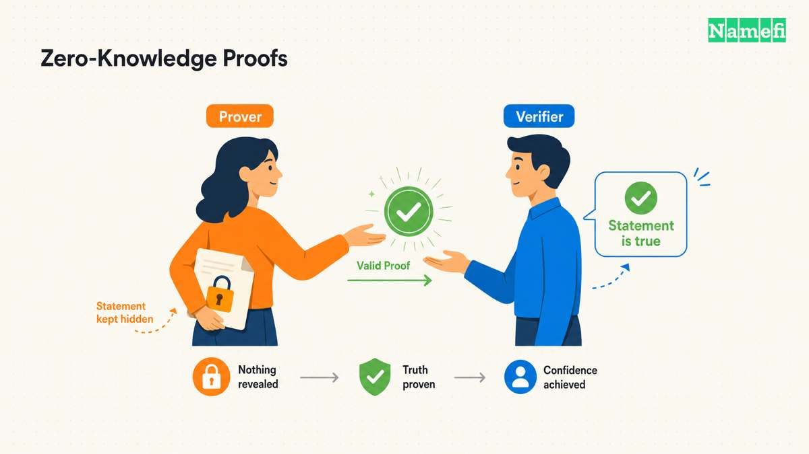
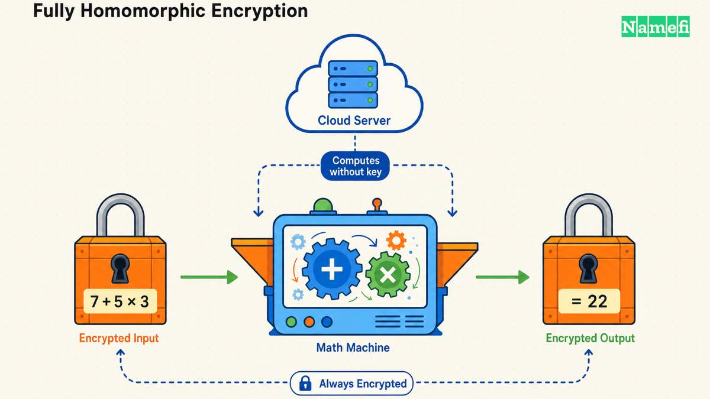
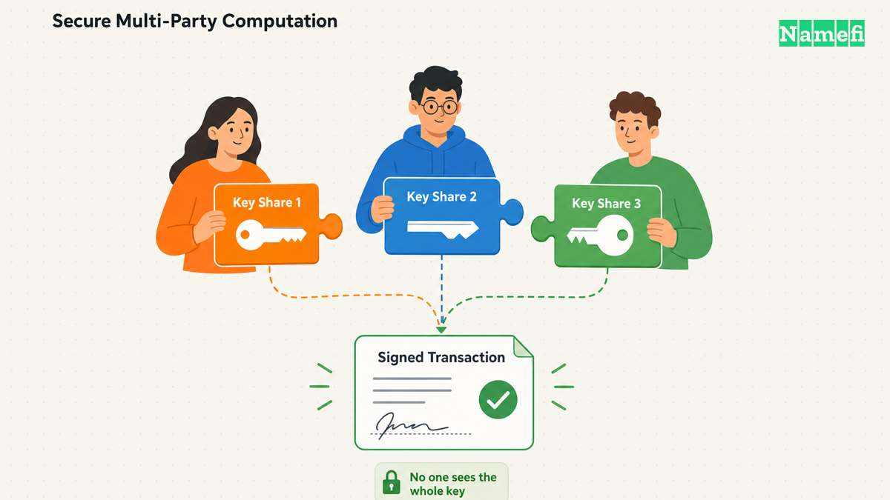

सार्वजनिक [ब्लॉकचेन](/hi/glossary/blockchain/) पर होने वाला हर ट्रांज़ैक्शन डिफ़ॉल्ट रूप से किसी भी देखने वाले को दिखाई देता है। बैलेंस, ट्रांसफ़र की रकम और लेनदेन के दूसरे पक्ष खुले लेजर में हमेशा के लिए दर्ज रहते हैं। यही पारदर्शिता ब्लॉकचेन की विश्वसनीयता की गारंटी का आधार है, लेकिन यह एक जोखिम भी है: कोई बैंक अपने ग्राहकों के बैलेंस प्रकाशित नहीं करता, और कोई व्यवसाय नहीं चाहेगा कि प्रतिस्पर्धी उसके सप्लायर को किए गए भुगतान या कर्मचारियों के वेतन का ब्योरा पढ़ सकें।

ब्लॉकचेन गोपनीयता तकनीकें इस अंतर को पाटने के लिए बनाई गई हैं, वह भी उन गुणों को छोड़े बिना जो चेन को उपयोगी बनाते हैं—सत्यापन-योग्यता, विकेंद्रीकरण और किसी विश्वसनीय मध्यस्थ के बिना अनजान पक्षों के बीच लेनदेन की क्षमता। आज पाँच तकनीकें इस क्षेत्र में प्रमुख हैं: [ज़ीरो-नॉलेज प्रूफ़](/hi/glossary/zero-knowledge-proof/), [पूर्ण होमोमॉर्फिक एन्क्रिप्शन](/hi/glossary/fully-homomorphic-encryption/) (FHE), [सुरक्षित बहु-पक्षीय संगणना](/hi/glossary/secure-multiparty-computation/) (MPC), [विश्वसनीय निष्पादन परिवेश](/hi/glossary/trusted-execution-environment/) (TEE), और स्टेल्थ एड्रेस के साथ रिंग सिग्नेचर। हर तकनीक पहेली के किसी अलग हिस्से को छिपाती है, अलग विश्वास संबंधी धारणा पर निर्भर करती है और अलग मात्रा में कंप्यूटिंग संसाधन मांगती है। यह गाइड इन पाँचों को समझाती और साथ-साथ तुलना करती है, ताकि [Web3](/hi/glossary/web3/) पर काम करने वाला—या उसके बारे में सीखने वाला—कोई भी व्यक्ति समझ सके कि सही विकल्प चुनना क्यों मायने रखता है।

---

## ज़ीरो-नॉलेज प्रूफ़

[ज़ीरो-नॉलेज प्रूफ़](/hi/glossary/zero-knowledge-proof/) (ZKP) एक पक्ष—*प्रूवर*—को दूसरे पक्ष—*वेरिफ़ायर*—के सामने यह साबित करने देता है कि कोई कथन सही है, जबकि उस कथन के बारे में कोई दूसरी जानकारी उजागर नहीं होती। Ethereum का डेवलपर दस्तावेज़ इसे सरल शब्दों में बताता है: “ज़ीरो-नॉलेज प्रूफ़ किसी कथन को बताए बिना उसकी वैधता साबित करने का तरीका है,” जहाँ “दावा साबित करने की कोशिश करने वाला पक्ष ‘प्रूवर’ होता है, जबकि दावे की वैधता जाँचने की ज़िम्मेदारी ‘वेरिफ़ायर’ की होती है” ([ethereum.org](https://ethereum.org/en/zero-knowledge-proofs/#:~:text=A%20zero%2Dknowledge%20proof%20is,without%20revealing%20the%20statement%20itself))।

किसी प्रूफ़ सिस्टम को वास्तविक ज़ीरो-नॉलेज प्रोटोकॉल माने जाने के लिए तीन गुण पूरे करने होते हैं: completeness (ईमानदार वेरिफ़ायर सही दावे को स्वीकार करता है), soundness (बेईमान प्रूवर प्रूफ़ सिस्टम में निर्धारित सीमित error probability को छोड़कर ईमानदार वेरिफ़ायर से ग़लत दावा स्वीकार नहीं करा सकता), और स्वयं zero-knowledge, यानी “वेरिफ़ायर किसी कथन की वैधता या अमान्यता के अलावा उसके बारे में कुछ नहीं सीखता” ([ethereum.org](https://ethereum.org/en/zero-knowledge-proofs/))। व्यावहारिक रूप से प्रूफ़ एक witness (वह गोपनीय जानकारी जिसे प्रूवर जानता है), एक challenge (वेरिफ़ायर का प्रश्न), और ऐसे response से बनता है जो वेरिफ़ायर को witness देखे बिना प्रूवर के ज्ञान की जाँच करने देता है।

**यह क्या छिपाता है:** मूल डेटा या संगणना—सिर्फ़ यह प्रूफ़ सामने आता है कि दावा सही है।

**आज इसका उपयोग कैसे होता है:** ब्लॉकचेन स्केलिंग में ZKP का सबसे बड़ा प्रोडक्शन उपयोग ZK-rollup हैं। वे ट्रांज़ैक्शन को “ऐसे बैच में बंडल (या ‘रोल अप’) करते हैं जिन्हें ऑफ़चेन निष्पादित किया जाता है,” फिर एक validity proof बनाते हैं जिसे Ethereum बैच के स्टेट बदलाव को अंतिम रूप देने से पहले सत्यापित करता है ([ethereum.org](https://ethereum.org/en/developers/docs/scaling/zk-rollups/#:~:text=ZK%2Drollups%20bundle%20))। Matter Labs का बनाया zkSync Era “अपनी zkEVM से संचालित EVM-compatible ZK Rollup” है ([ethereum.org](https://ethereum.org/en/developers/docs/scaling/zk-rollups/)), जबकि StarkWare का Starknet एक validity rollup है जो EVM की जगह अपनी Cairo VM चलाता है (Solidity कॉन्ट्रैक्ट को अलग से ब्रिज किया जाता है)। L2BEAT दोनों को ऐसे rollup के रूप में ट्रैक करता है जिन्हें optimistic rollup में इस्तेमाल होने वाली fraud-proof challenge window के बजाय validity proof सुरक्षित करते हैं ([l2beat.com](https://l2beat.com/scaling/summary))। गोपनीयता के क्षेत्र में [Zcash](https://z.cash/technology/) ने shielded transaction के लिए zk-SNARK (Zero-Knowledge Succinct Non-Interactive Arguments of Knowledge) की शुरुआत की, जिसमें “उपयोगकर्ताओं के एड्रेस, उनके ट्रांज़ैक्शन की रकम” और अन्य विवरण एन्क्रिप्टेड रहते हैं, जबकि नेटवर्क फिर भी ट्रांज़ैक्शन की वैधता की पुष्टि कर सकता है ([z.cash](https://z.cash/technology/))।

**समझौता:** ZK प्रूफ़ बनाना संगणना के लिहाज़ से महँगा है—प्रूविंग सर्किट बैच के हर ट्रांज़ैक्शन से गुज़रते हैं और उसकी जाँच दोबारा चलाते हैं—इसलिए प्रूविंग में लगने वाला समय और हार्डवेयर की लागत वास्तविक सीमाएँ हैं, भले ही ऑनचेन सत्यापन सस्ता और तेज़ हो। इसकी सुरक्षा प्रूफ़ सिस्टम की cryptographic assumptions, सुरक्षित parameter generation, और circuit व protocol के सही implementation पर टिकी है; कुछ प्रूफ़ सिस्टम में एक बार होने वाला trusted setup समारोह भी इसका हिस्सा है। Ethereum का दस्तावेज़ बताता है कि setup entropy से समझौता ग़लत प्रूफ़ बनाना संभव कर सकता है और implementation की त्रुटियाँ security model को कमज़ोर कर सकती हैं ([ethereum.org](https://ethereum.org/en/zero-knowledge-proofs/#trust-assumptions))।

---

## पूर्ण होमोमॉर्फिक एन्क्रिप्शन (FHE)

[पूर्ण होमोमॉर्फिक एन्क्रिप्शन](/hi/glossary/fully-homomorphic-encryption/) एक अलग तरीका अपनाता है: छिपे डेटा के बारे में कोई तथ्य साबित करने के बजाय यह आपको *एन्क्रिप्टेड डेटा पर सीधे संगणना* करने देता है और ऐसा एन्क्रिप्टेड परिणाम देता है जिसे डिक्रिप्ट करने पर वही उत्तर मिलता है जो प्लेनटेक्स्ट पर संगणना करने से मिलता। FHE शोध और इंफ़्रास्ट्रक्चर की प्रमुख कंपनियों में से एक Zama इसे इस तरह बताती है: “FHE बिना डिक्रिप्शन के डेटा प्रोसेसिंग संभव बनाता है—कंपनियाँ उपयोगकर्ता का डेटा देखे बिना सेवाएँ देती हैं, जबकि उपयोगकर्ताओं के लिए कार्यक्षमता पहले जैसी रहती है” ([zama.org](https://www.zama.org/introduction-to-homomorphic-encryption))।

**यह क्या छिपाता है:** संगणना के मूल इनपुट, बीच की स्थिति और आउटपुट—चाबी रखने वाले के अलावा हर किसी को केवल ciphertext दिखाई देता है, यहाँ तक कि संगणना करने वाले पक्ष को भी।

**ऊपरी स्तर पर यह कैसे काम करता है:** FHE स्कीम lattice-आधारित गणित से बने ciphertext में plaintext मानों को encode करती हैं, फिर जोड़ और गुणा के एन्क्रिप्टेड समकक्ष तय करती हैं ताकि मनचाहे circuit ciphertext पर चल सकें। ब्लॉकचेन पर इसका अर्थ है कि smart contract शामिल रकम देखे बिना token भेज सकता है या logic का मूल्यांकन कर सकता है—Zama के अपने उदाहरण के अनुसार, “ब्लॉकचेन ने Alice के पास पर्याप्त धन होने की पुष्टि की, लेकिन उसने वास्तविक रकम कभी नहीं देखी” ([zama.org](https://www.zama.org/introduction-to-homomorphic-encryption#:~:text=The%20blockchain%20verified%20Alice%20has%20sufficient%20funds%20without%20ever%20seeing%20the%20actual%20amounts))। Zama यह भी कहती है कि lattice-आधारित FHE स्कीम “स्वाभाविक रूप से post-quantum resilient” हैं, जो क्रिप्टोग्राफ़िक जोखिम के बारे में दीर्घकालिक सोच रखने वाले किसी भी व्यक्ति के लिए महत्वपूर्ण है ([zama.org](https://www.zama.org/introduction-to-homomorphic-encryption))।

**उदाहरण प्रोजेक्ट:** [Zama](https://www.zama.org/) open-source FHE लाइब्रेरी (TFHE-rs, Concrete) और EVM चेन में गोपनीय smart-contract execution जोड़ने के लिए इस्तेमाल होने वाला fhEVM बनाती है। [Fhenix](https://cofhe-docs.fhenix.zone/) खास तौर पर इस उद्देश्य से बनाया गया ब्लॉकचेन है कि “डेवलपर Fully Homomorphic Encryption का उपयोग करके गोपनीयता-संरक्षक smart contract बना सकें,” जिससे “संवेदनशील डेटा पूरी संगणना के दौरान एन्क्रिप्टेड रहता है”; इसमें client-side encryption के लिए JavaScript लाइब्रेरी (Cofhejs) और on-chain encrypted operation के लिए Solidity FHE लाइब्रेरी है ([cofhe-docs.fhenix.zone](https://cofhe-docs.fhenix.zone/))।

**समझौता:** FHE की विशिष्ट गारंटी यह है कि supported computation इनपुट या बीच के मानों को डिक्रिप्ट किए बिना चल सकती है, लेकिन इसकी वास्तविक सुरक्षा फिर भी स्कीम और parameter की पसंद पर निर्भर करती है; इसी कारण HomomorphicEncryption.org स्कीम-विशिष्ट security table और parameter-selection guidance प्रकाशित करता है ([HomomorphicEncryption.org](https://homomorphicencryption.org/security-guidelines/))। Plaintext execution के मुकाबले यह बहुत बड़े अंतर से इस सूची का सबसे अधिक संगणना मांगने वाला तरीका भी है। इसी वजह से आज FHE-आधारित चेन हर ट्रांज़ैक्शन के बजाय गोपनीयता की दृष्टि से महत्वपूर्ण logic को इससे चलाती हैं, और FHE के लिए hardware acceleration शोध की सक्रिय होड़ बना हुआ है।

---

## सुरक्षित बहु-पक्षीय संगणना (MPC)

[सुरक्षित बहु-पक्षीय संगणना](/hi/glossary/secure-multiparty-computation/) एक संबंधित लेकिन अलग समस्या हल करती है: किसी एक पक्ष के एन्क्रिप्टेड डेटा पर संगणना करने के बजाय, इनपुट का अपना-अपना गोपनीय हिस्सा रखने वाले *कई* पक्ष अपने व्यक्तिगत इनपुट एक-दूसरे को बताए बिना मिलकर किसी function की गणना करते हैं। औपचारिक परिभाषा के अनुसार MPC “क्रिप्टोग्राफी का वह उप-क्षेत्र है जिसका लक्ष्य ऐसे तरीके बनाना है जिनमें पक्ष अपने इनपुट गोपनीय रखते हुए उन पर मिलकर कोई function compute कर सकें,” ताकि तीन प्रतिभागियों के मामले में “Alice, Bob और Charlie यह बताए बिना F(x, y, z) जान सकें कि कौन कितना कमाता है” ([Wikipedia](https://en.wikipedia.org/wiki/Secure_multi-party_computation#:~:text=Secure%20multi%2Dparty%20computation%20))।

**यह क्या छिपाता है:** हर पक्ष का व्यक्तिगत इनपुट दूसरे सभी पक्षों से—सिर्फ़ पहले से सहमत आउटपुट सामने आता है, और किसी एक प्रतिभागी को कभी पूरा रहस्य नहीं दिखता।

**विश्वास संबंधी धारणा:** MPC के लिए कोई सार्वभौमिक corruption threshold नहीं है। Complete network के लिए classic BGW result में passive fault के विरुद्ध privacy `t < n/2` तक मिलती है, जबकि Byzantine fault के विरुद्ध robustness `t < n/3` तक मिलती है ([ACM](https://doi.org/10.1145/62212.62213))। ये सीमाएँ उस protocol model का वर्णन करती हैं, हर MPC का नहीं: broadcast मानने पर perfectly secure protocol `t < n/2` तक पहुँच सकते हैं ([TCC 2021](https://www.iacr.org/archive/tcc2021/130420196/130420196.pdf)), जबकि computational SPDZ protocol अपने preprocessing model में `n - 1` तक corrupt party के साथ active security देता है ([IACR](https://eprint.iacr.org/2011/535))। Dishonest-majority की यह गारंटी security with abort है—कोई corrupt participant संगणना को रोक सकता है—न कि fairness या guaranteed output ([PoPETs](https://petsymposium.org/popets/2024/popets-2024-0053.php))। इसलिए किसी वास्तविक deployment को protocol, passive या active corruption model, synchrony और channel/setup assumptions (broadcast सहित), और honest या dishonest majority की धारणा स्पष्ट करनी चाहिए।

**आज इसका उपयोग कैसे होता है—threshold-signature custody:** ब्लॉकचेन में MPC का सबसे दिखाई देने वाला उपयोग private key को स्वतंत्र पक्षों में बाँटना है, ताकि किसी एक device या व्यक्ति के पास कभी पूरी key न हो। Custody infrastructure provider Fireblocks इसे सीधे बताता है: “Multi-party computation (MPC) एक क्रिप्टोग्राफ़िक तरीका है जो private key को अलग-अलग हिस्सों में बाँटकर कई स्वतंत्र पक्षों में वितरित करता है,” और सबसे महत्वपूर्ण बात यह कि “पूरी key किसी भी समय एक जगह पर कभी इकट्ठी नहीं होती” ([fireblocks.com](https://www.fireblocks.com/what-is-mpc#:~:text=Multi%2Dparty%20computation%20))। ट्रांज़ैक्शन पर हस्ताक्षर करते समय endpoints का एक quorum ट्रांज़ैक्शन की अलग-अलग जाँच करता है और partial signature देता है; “private key किसी भी समय इकट्ठी नहीं होती,” इसलिए “अगर एक endpoint से समझौता हो भी जाए...तो दूसरी जगह रखे key share अलग-अलग किसी काम के नहीं होते” ([fireblocks.com](https://www.fireblocks.com/what-is-mpc))। यह threshold-signature pattern अब अधिकतर संस्थागत crypto custody और कई multi-signer wallet का आधार है।

**समझौता:** MPC एक device पर रखी एक private key से पैदा होने वाले single point of failure से बचाता है, लेकिन इसमें पक्षों के बीच संचार के अतिरिक्त दौर (latency) जुड़ते हैं और सावधानी से protocol design करना पड़ता है। इसकी गारंटी चुने गए protocol की cryptographic, corruption और network assumptions और पक्षों की परिचालनात्मक स्वतंत्रता जितनी ही मज़बूत होती है; MPC एकल key holder को हटा सकता है, लेकिन system design से भरोसे को ख़त्म नहीं करता।

---

## विश्वसनीय निष्पादन परिवेश (TEE)

[विश्वसनीय निष्पादन परिवेश](/hi/glossary/trusted-execution-environment/) एक और रास्ता अपनाता है: पूरी संगणना के दौरान डेटा को एन्क्रिप्टेड रखने के बजाय, यह संगणना को chip के hardware-संरक्षित हिस्से—*secure enclave*—में अलग कर देता है, जिसे मशीन का अपना operating system भी नहीं देख सकता। सबसे प्रसिद्ध implementation Intel का SGX (Software Guard Extensions) है, जिसे Wikipedia “कुछ Intel central processing unit (CPU) में बने instruction code का एक ऐसा समूह” बताता है जो trusted execution environment को लागू करता है ([Wikipedia](https://en.wikipedia.org/wiki/Software_Guard_Extensions#:~:text=Intel%20Software%20Guard%20Extensions))। तकनीकी रूप से “SGX में CPU memory के एक हिस्से (enclave) को encrypt करता है,” इसलिए “enclave से निकलने वाले data और code को CPU के भीतर उसी समय decrypt किया जाता है, जिससे दूसरे code उन्हें जाँच या पढ़ नहीं पाते,” जिनमें “operating system और उसके नीचे के hypervisor जैसे अधिक privilege वाले code” भी शामिल हैं ([Wikipedia](https://en.wikipedia.org/wiki/Software_Guard_Extensions))।

**यह क्या छिपाता है:** enclave के भीतर का data और code उसी मशीन पर चल रही हर दूसरी process से, compromised OS से भी—यह तब उपयोगी है जब server operator पर भरोसा किए बिना किसी खास code के execution पर भरोसा करना हो।

**विश्वास संबंधी धारणा:** भेद को इस तरह नहीं बाँटा जा सकता कि ZKP, FHE और MPC “शुद्ध गणित” पर टिके हैं, जबकि TEE केवल vendor पर भरोसे पर टिका है। व्यवहार में लागू cryptographic system अपनी बताई गई hardness assumptions, parameters या setup, सही implementation और—MPC के मामले में—protocol के participant व communication model पर भी निर्भर करते हैं। TEE इस system trust में hardware-backed isolation और attestation जोड़ता है। Intel SGX के trusted computing base को SGX के security objectives पूरे करने के लिए ज़रूरी hardware, CPU firmware और platform software के रूप में परिभाषित करता है; attestation किसी relying party को enclave की identity और platform के patch level का आकलन करने देता है ([Intel](https://www.intel.com/content/www/us/en/security-center/technical-details/sgx-attestation-technical-details.html))। यह trust boundary परीक्षा से गुज़र चुकी है: SGX “side-channel attack से सुरक्षा नहीं देता,” और शोधकर्ताओं ने कई बार व्यावहारिक हमले दिखाए हैं—2017 में “उसी system पर चल रहे SGX enclave से पाँच मिनट के भीतर RSA key” निकालने से लेकर 2018 के Foreshadow attack तक, जो “speculative execution और buffer overflow को मिलाकर SGX को bypass करता है”; इसके बाद Plundervolt, LVI, SGAxe और ÆPIC Leak जैसी दूसरी vulnerabilities भी सामने आईं ([Wikipedia](https://en.wikipedia.org/wiki/Software_Guard_Extensions#:~:text=While%20this%20can%20mitigate%20many%20kinds%20of%20attacks%2C%20it%20does%20not%20protect%20against%20side%2Dchannel%20attacks))। इसी इतिहास के कारण TEE को आम तौर पर क्रिप्टोग्राफ़िक रूप से अचूक गारंटी के बजाय एक व्यावहारिक और तेज़ मध्य मार्ग कहा जाता है।

**उदाहरण प्रोजेक्ट:** [Oasis Protocol](https://oasis.net/technology) का Sapphire network hardware enclave के भीतर smart contract चलाता है ताकि उपयोगकर्ता “hardware-संरक्षित enclave के भीतर code चला सकें,” जहाँ “data server operator से भी encrypted रहता है,” जबकि “हर execution ऐसा cryptographic proof बनाता है जिसे उपयोगकर्ता बिना अंधा भरोसा किए verify कर सकते हैं”—इससे ऐसे “confidential smart contract” मिलते हैं जो “EVM compatibility और composability” बनाए रखते हैं ([oasis.net](https://oasis.net/technology))। Secret Network और restaking से जुड़े कई privacy product भी TEE पर आधारित हैं; अक्सर वे defense in depth के लिए इसे दूसरी तकनीकों के साथ इस्तेमाल करते हैं।

**समझौता:** TEE लगभग native speed पर चलते हैं—FHE या भारी ZK proving से बहुत तेज़—इसलिए latency के प्रति संवेदनशील application के लिए आकर्षक हैं। लेकिन इस गति के साथ एक व्यापक hardware-and-software trusted computing base आता है, जिसका side-channel breach का वास्तविक और दर्ज इतिहास है। इसलिए तुलना विभिन्न system assumptions के बीच है, hardware trust और assumptions से मुक्त “शुद्ध cryptography” के बीच नहीं।

---

## रिंग सिग्नेचर और स्टेल्थ एड्रेस

तकनीकों की आखिरी जोड़ी एक सीमित लेकिन बहुत व्यावहारिक लक्ष्य की रक्षा करती है: ट्रांज़ैक्शन ऑनचेन दिखाई देने के बावजूद उसे *किसने भेजा* और *किसने पाया*, यह छिपाना। इन दोनों तकनीकों का प्रमुख प्रोडक्शन उदाहरण [Monero](https://www.getmonero.org/) है।

**रिंग सिग्नेचर** भेजने वाले को छिपाते हैं। Monero का अपना दस्तावेज़ बताता है कि “रिंग सिग्नेचर एक प्रकार का digital signature है जिसे users के किसी group का कोई भी member कर सकता है, जहाँ हर member के पास key होती है,” और “यह निर्धारित करना computationally infeasible होना चाहिए कि signature बनाने के लिए group के किस member की key इस्तेमाल हुई थी” ([getmonero.org](https://www.getmonero.org/resources/moneropedia/ring-signatures.html#:~:text=a%20ring%20signature%20is%20a%20type%20of%20digital%20signature))। व्यावहारिक रूप से Monero ट्रांज़ैक्शन वास्तविक खर्चकर्ता की key को “gamma distribution method से blockchain से निकाली गई” decoy public key के साथ मिलाता है, ताकि “संभावित signer की ‘ring’ में सभी ring member समान और वैध हों” और “बाहरी पर्यवेक्षक यह न बता सके कि signature group के संभावित signers में से कौन आपके account से संबंधित है” ([getmonero.org](https://www.getmonero.org/resources/moneropedia/ring-signatures.html))।

**स्टेल्थ एड्रेस** पाने वाले को छिपाते हैं। एक public address को बार-बार इस्तेमाल करने के बजाय, “sender recipient की ओर से हर transaction के लिए random one-time address [बनाता है],” जिससे आने वाले payment “blockchain पर unique address में जाते हैं, जहाँ उन्हें recipient के प्रकाशित address या किसी और transaction के address से वापस नहीं जोड़ा जा सकता” ([getmonero.org](https://www.getmonero.org/resources/moneropedia/stealthaddress.html#:~:text=They%20allow%20and%20require%20the%20sender%20to%20create%20random%20one%2Dtime%20addresses))। Recipient private view key से payment के लिए chain scan करता है और private spend key से उन्हें आगे भेजता है, इसलिए “सिर्फ़ sender और receiver तय कर सकते हैं कि payment कहाँ भेजा गया था” ([getmonero.org](https://www.getmonero.org/resources/moneropedia/stealthaddress.html))।

**यह क्या छिपाता है:** sender की पहचान (ring signature) और recipient की पहचान (stealth address); transaction की *रकम* एक अलग mechanism (Confidential Transactions / RingCT) छिपाता है, जिसे इन दोनों तकनीकों में शामिल नहीं किया गया है।

**समझौता:** दोनों तकनीकें सामान्य hardware पर बिना proving overhead या enclave dependency के कुशलता से चलती हैं, इसलिए सक्रिय payment network के लिए उपयुक्त हैं। लेकिन उनका trust model इस बात पर निर्भर करता है कि decoy set को सांख्यिकीय रूप से वास्तविक signer से अलग न किया जा सके—कमज़ोर decoy selection या blockchain-analysis heuristic ने शुरुआती ring-signature deployment में ऐतिहासिक रूप से anonymity set को छोटा किया है, इसलिए parameter की पसंद (ring size, decoy distribution) उतनी ही महत्वपूर्ण है जितनी मूल primitive।

---

## पाँचों तरीकों की तुलना

| तकनीक | यह क्या छिपाती है | विश्वास संबंधी धारणा | प्रदर्शन की लागत | आज की परिपक्वता | उदाहरण प्रोजेक्ट |
|---|---|---|---|---|---|
| ज़ीरो-नॉलेज प्रूफ़ | मूल डेटा/संगणना; केवल प्रूफ़ की वैधता सामने आती है | प्रूफ़ सिस्टम की assumptions, parameters और circuit/protocol implementation; कुछ सिस्टम में trusted setup | प्रूफ़ बनाना महँगा; सत्यापन सस्ता | बड़े पैमाने पर प्रोडक्शन में (rollup, shielded payment) | zkSync, Starknet, Zcash |
| पूर्ण होमोमॉर्फिक एन्क्रिप्शन | संगणना के दौरान पूरा डेटा, संगणना करने वाले provider से भी | स्कीम की hardness assumptions और सुरक्षित parameter व implementation की पसंद | बहुत ज़्यादा compute overhead | शुरुआती प्रोडक्शन; hardware-acceleration पर सक्रिय शोध | Zama, Fhenix |
| सुरक्षित बहु-पक्षीय संगणना | हर पक्ष का व्यक्तिगत इनपुट | protocol-विशिष्ट corruption threshold, network/setup model और प्रतिभागियों की स्वतंत्रता | मध्यम; संचार के अतिरिक्त दौर | परिपक्व और custody में व्यापक रूप से लागू | Fireblocks और दूसरे threshold-signature custodian |
| विश्वसनीय निष्पादन परिवेश | OS सहित हर दूसरी process से data/code | attest किया गया enclave code, hardware, firmware और software TCB, तथा उसकी patch state | लगभग native speed | प्रोडक्शन में, लेकिन side-channel attack का दर्ज इतिहास | Intel SGX, Oasis Sapphire |
| रिंग सिग्नेचर और स्टेल्थ एड्रेस | sender और recipient की पहचान | decoy set की सांख्यिकीय indistinguishability | कम; सामान्य hardware पर कुशल | परिपक्व, एक दशक से अधिक समय से सक्रिय | Monero |

कोई एक तकनीक हर पहलू में सबसे अच्छी नहीं है—इसीलिए मौजूदा शोध में उन्हें साथ इस्तेमाल करने का चलन बढ़ रहा है, जैसे MPC संगणना की शुद्धता सत्यापित करने के लिए ZK प्रूफ़, या defense in depth के लिए FHE के साथ TEE।

---

## इसका टोकनाइज़्ड डोमेन से संबंध

[टोकनाइज़्ड डोमेन](/hi/glossary/tokenize/) में ऑनचेन मौजूद किसी भी दूसरी asset की तरह डिफ़ॉल्ट पारदर्शिता होती है: ownership transfer, bid और metadata update सार्वजनिक रूप से पढ़े जा सकते हैं। यह अधिकतर एक उपयोगी गुण है—provenance और ownership history ही [टोकनाइज़्ड डोमेन](/hi/blog/what-are-tokenized-domains/) को कारोबार-योग्य asset के रूप में विश्वसनीय बनाते हैं—लेकिन इसका अर्थ यह भी है कि किसी domain portfolio की holdings और sale price chain पर नज़र रखने वाले हर व्यक्ति को दिखाई देती हैं।

इस गाइड की गोपनीयता तकनीकें दिखाती हैं कि domain-as-NFT infrastructure आगे कहाँ जा सकता है: MPC-आधारित threshold custody पहले से domain NFT रखने वाले संस्थागत [वॉलेट](/hi/glossary/wallet/) को वैसे ही सुरक्षित करती है जैसे दूसरी digital asset को; ZK प्रूफ़ आगे चलकर bidder को अपना पूरा balance बताए बिना यह साबित करने दे सकते हैं कि वह offer वहन कर सकता है; और confidential-computation तकनीकें registrar या marketplace को buyer की पूरी पहचान उजागर किए बिना eligibility rule की जाँच करने दे सकती हैं। इनमें से कोई भी क्षमता आज domain tokenization में लागू नहीं है, लेकिन इनके मूल primitive वही हैं जो अभी DeFi और custody infrastructure में अरबों डॉलर सुरक्षित कर रहे हैं।

---

## स्रोत और आगे पढ़ने की सामग्री

- [ज़ीरो-नॉलेज प्रूफ़ — ethereum.org](https://ethereum.org/en/zero-knowledge-proofs/)
- [ZK-Rollup — ethereum.org](https://ethereum.org/en/developers/docs/scaling/zk-rollups/)
- [L2BEAT स्केलिंग सारांश](https://l2beat.com/scaling/summary)
- [Zcash तकनीक का परिचय](https://z.cash/technology/)
- [होमोमॉर्फिक एन्क्रिप्शन का परिचय — Zama](https://www.zama.org/introduction-to-homomorphic-encryption)
- [सुरक्षा दिशानिर्देश — HomomorphicEncryption.org](https://homomorphicencryption.org/security-guidelines/)
- [Fhenix cofhe दस्तावेज़](https://cofhe-docs.fhenix.zone/)
- [सुरक्षित बहु-पक्षीय संगणना — Wikipedia](https://en.wikipedia.org/wiki/Secure_multi-party_computation)
- [गैर-क्रिप्टोग्राफ़िक fault-tolerant distributed computation के completeness theorem — ACM](https://doi.org/10.1145/62212.62213)
- [कुशल perfectly secure computation — TCC 2021](https://www.iacr.org/archive/tcc2021/130420196/130420196.pdf)
- [Somewhat homomorphic encryption से multi-party computation (SPDZ) — IACR](https://eprint.iacr.org/2011/535)
- [Fairness के साथ SPDZ सुरक्षा का विस्तार — PoPETs](https://petsymposium.org/popets/2024/popets-2024-0053.php)
- [MPC क्या है? — Fireblocks](https://www.fireblocks.com/what-is-mpc)
- [Software Guard Extensions (SGX) — Wikipedia](https://en.wikipedia.org/wiki/Software_Guard_Extensions)
- [Intel SGX attestation के तकनीकी विवरण](https://www.intel.com/content/www/us/en/security-center/technical-details/sgx-attestation-technical-details.html)
- [Oasis Protocol तकनीक](https://oasis.net/technology)
- [रिंग सिग्नेचर — Monero Moneropedia](https://www.getmonero.org/resources/moneropedia/ring-signatures.html)
- [स्टेल्थ एड्रेस — Monero Moneropedia](https://www.getmonero.org/resources/moneropedia/stealthaddress.html)
