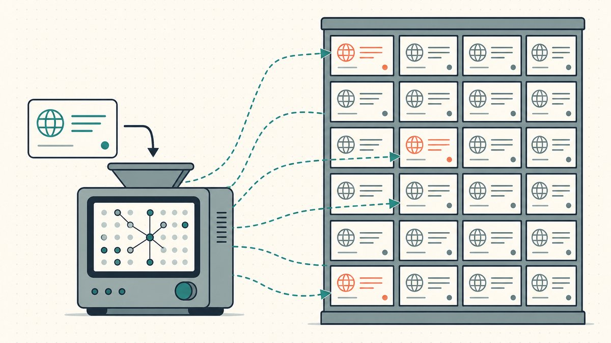

किसी मूल्यांकन टूल में एक डोमेन पेस्ट करें और आपको लगभग एक सेकंड में एक नंबर मिल जाता है। यह आधिकारिक लगता है — एक स्पष्ट डॉलर का आंकड़ा, जिसके नीचे अक्सर तुलनीय बिक्रियों की एक सूची होती है। नए फ़्लिपर उस नंबर को जवाब मानते हैं। अनुभवी लोग इसे एक बहुत लंबी बातचीत की पहली पंक्ति मानते हैं।

Estibot और GoDaddy के मूल्यांकनकर्ता दोनों ही उस काम में अच्छे हैं जिसके लिए उन्हें बनाया गया है, और उस एक चीज़ में वास्तव में बुरे हैं जो ज़्यादातर वास्तविक बिक्रियों का फैसला करती है। यह गाइड बताता है कि दो प्रमुख टूल वास्तव में कैसे काम करते हैं, वे कहाँ सहमत हैं, कहाँ वे अलग हैं, और — वह हिस्सा जो मायने रखता है — वह विशिष्ट ब्लाइंड स्पॉट जो वे साझा करते हैं जिसे कोई भी मशीन लर्निंग ठीक नहीं कर सकता। यह हमारे मूल्यांकन स्तंभ, [एक डोमेन नाम का मूल्यांकन कैसे करें](/en/blog/how-to-value-a-domain-name/), का एक साथी है, और व्यापक [डोमेन फ़्लिपिंग](/en/blog/domain-flipping/) श्रृंखला का हिस्सा है।

## एक स्वचालित मूल्यांकनकर्ता वास्तव में क्या कर रहा है

पर्दे के पीछे, दोनों प्रमुख टूल एक ही काम कर रहे हैं: कीमत को प्रभावित करने वाले मूल सिद्धांतों पर प्रशिक्षित एक मॉडल का उपयोग करके पिछली बिक्रियों के एक बड़े डेटाबेस के मुकाबले आपके नाम को स्कोर करना। वे पैटर्न-मैचर हैं, भविष्यवक्ता नहीं।

GoDaddy इस रेसिपी के बारे में सीधा है। इसके मूल्यांकन टूल का [एल्गोरिदम डोमेन मूल्यों का अनुमान लगाने के लिए मालिकाना मशीन लर्निंग और वास्तविक बाज़ार बिक्री डेटा का उपयोग करता है](https://www.godaddy.com/resources/skills/godaddy-domain-name-value-appraisal-tool#:~:text=algorithm%20uses%20proprietary%20machine%20learning%20and%20real%20market%20sales%20data%20to%20estimate%20domain%20values), और यह पूरी कवायद को इस तरह से फ्रेम करता है जिसे हर फ़्लिपर को आत्मसात करना चाहिए: [एक डोमेन नाम के मूल्य को ऑनलाइन रियल एस्टेट की तरह सोचें](https://www.godaddy.com/resources/skills/godaddy-domain-name-value-appraisal-tool#:~:text=Think%20of%20a%20domain%20name%27s%20value%20like%20online%20real%20estate)। यह सही मानसिक मॉडल है। एक रियल-एस्टेट कॉम्प टूल आपके जैसे घरों को ढूंढता है जो हाल ही में बिके हैं, फिर समायोजन करता है। एक डोमेन मूल्यांकनकर्ता नामों के साथ भी ऐसा ही करता है।

Estibot इस विधि का अधिक विस्तृत वर्णन करता है। यह [एक डोमेन नाम के मूल्य की गणना करने के लिए एक सांख्यिकीय रूप से व्युत्पन्न मॉडल पर निर्भर करता है जो सौ से अधिक आंतरिक और बाहरी डोमेन विशेषताओं पर आधारित है](https://www.estibot.com/methodology#:~:text=relies%20on%20a%20statistically%20derived%20model), और वे विशेषताएँ दो बाल्टियों में विभाजित होती हैं। [आंतरिक विशेषताओं में डोमेन की लंबाई, एक्सटेंशन, शब्द गणना, उच्चारण शामिल हैं](https://www.estibot.com/methodology#:~:text=Internal%20attributes%20include%20domain%20length%2C%20extension%2C%20word%20count%2C%20pronunciation) — वे चीजें जो आप नाम से ही पढ़ सकते हैं। [बाहरी विशेषताएँ तीसरे पक्ष के डेटा को संदर्भित करती हैं जैसे कि एक डोमेन की खोज लोकप्रियता, टाइप-इन रैंक](https://www.estibot.com/methodology#:~:text=External%20attributes%20refer%20to%20third%20party%20data%20such%20as%20a%20domain%27s%20search%20popularity) — नाम के आसपास मांग के संकेत। फिर मॉडल तुलना करता है: [एक विशिष्ट डोमेन नाम की विशेषताओं की तुलना पहले बेचे गए डोमेन नामों से की जाती है और मूल्यांकन उस तुलना पर आधारित होता है](https://www.estibot.com/methodology#:~:text=are%20then%20compared%20to%20those%20of%20previously%20sold%20domain%20names)।

ध्यान दें कि दोनों कार्यप्रणालियाँ उन [मूल्य कारकों](/en/blog/how-to-value-a-domain-name/) का कितनी बारीकी से पालन करती हैं जिन्हें कोई भी मानव मूल्यांकनकर्ता पहले से ही तौलता है: लंबाई, शब्द, [एक्सटेंशन](/en/glossary/tld/), कीवर्ड की मांग, ब्रांड बनाने की क्षमता। इन टूल ने कोई गुप्त फ़ॉर्मूला नहीं खोजा है। उन्होंने स्पष्ट फ़ॉर्मूले को स्वचालित कर दिया है और इसे एक बड़े बिक्री डेटाबेस के विरुद्ध चलाया है जिसे आप हाथ से नहीं खोज सकते।

## Estibot और GoDaddy कहाँ सहमत हैं

बुनियादी बातों पर, दोनों टूल शायद ही कभी लड़ते हैं, क्योंकि वे एक ही संकेत पढ़ रहे हैं।

दोनों छोटेपन को पुरस्कृत करते हैं। GoDaddy नियम को स्पष्ट रूप से बताता है — [मूल रूप से, एक डोमेन जितना छोटा होता है, उसका मूल्य उतना ही अधिक होता है](https://www.godaddy.com/resources/skills/godaddy-domain-name-value-appraisal-tool#:~:text=Basically%2C%20the%20shorter%20a%20domain%2C%20the%20higher%20the%20value) — और Estibot लंबाई को एक मुख्य आंतरिक विशेषता के रूप में सूचीबद्ध करता है। दोनों एक्सटेंशन को भारी महत्व देते हैं, यही कारण है कि एक ही स्ट्रिंग [`.com`](/en/tld/com/) पर एक बजट [TLD](/en/glossary/tld/) की तुलना में बहुत अलग नंबर लौटाती है, और क्यों एक डेवलपर का नाम [`.io`](/en/tld/io/) पर या एक AI ब्रांड [`.ai`](/en/tld/ai/) पर शब्दकोश के सुझाव से अलग स्कोर करता है। दोनों विशिष्टता को ध्यान में रखते हैं; GoDaddy कहता है कि टूल [समीकरण में विशिष्टता (अन्य चीजों के अलावा) को ध्यान में रखता है](https://www.godaddy.com/resources/skills/godaddy-domain-name-value-appraisal-tool#:~:text=factors%20uniqueness%20%28among%20other%20things%29%20into%20the%20equation)। और दोनों ही भावनाओं के बजाय वास्तविक बिक्री पर टिके रहते हैं, जो कि सबसे महत्वपूर्ण काम है जो वे अच्छी तरह से करते हैं।

उस काम के लिए जिसकी ज़्यादातर फ़्लिपर्स को वास्तव में ज़रूरत होती है — सौ नामों की सूची को "गहनता से देखने लायक" और "इसे छोड़ दो" में छाँटना — यह समझौता ठीक वही है जो आप चाहते हैं। जब दोनों टूल स्वतंत्र रूप से कहते हैं कि एक नाम संभावित रूप से चार-अंकीय संपत्ति है, तो यह एक वास्तविक संकेत है जिस पर कार्रवाई करने लायक है।

## वे कहाँ अलग होते हैं

असहमति शांत होती है लेकिन वे आपको प्रत्येक टूल के पूर्वाग्रह के बारे में कुछ सिखाती हैं।

सबसे बड़ा व्यावहारिक अंतर डेटाबेस और वेटिंग है। प्रत्येक टूल अपने स्वयं के बिक्री के कॉर्पस पर प्रशिक्षित होता है और अपने स्वयं के मॉडल को ट्यून करता है, इसलिए *संख्याएँ* अलग हो जाती हैं, भले ही *दिशा* सहमत हो। एक ही नाम के लिए एक टूल का आंकड़ा दूसरे के कई गुना होना आम बात है, खासकर सीमांत या असामान्य नामों पर जहां टिकने के लिए कुछ साफ कॉम्प्स होते हैं। कोई भी "सही" नहीं है — वे दो मॉडलों से दो अनुमान हैं, और उनके बीच का अंतर अपने आप में जानकारी है। एक नाम जहां दो टूल मोटे तौर पर सहमत होते हैं, वह एक ऐसा नाम है जिसकी कीमत बाजार पहले लगा चुका है। एक नाम जहां वे बहुत दूर हैं, वह एक ऐसा नाम है जिसके कॉम्प्स कम या विरोधाभासी हैं, जिसका आमतौर पर मतलब है कि *आपको* वास्तविक मूल्यांकन का काम करना होगा।

दूसरा अंतर यह है कि वे नंबर के साथ क्या पेश करते हैं। GoDaddy आपको [तुलनीय डोमेन नाम बिक्री](https://www.godaddy.com/resources/skills/godaddy-domain-name-value-appraisal-tool#:~:text=providing%20you%20with%20comparable%20domain%20name%20sales) दिखाने पर ज़ोर देता है ताकि आप नामित सौदों के मुकाबले अनुमान की जाँच कर सकें — यह उपयोगी है, क्योंकि कॉम्प्स हेडलाइन के आंकड़े से ज़्यादा मायने रखते हैं। Estibot विशेषताओं की चौड़ाई और बाहरी मांग डेटा (खोज लोकप्रियता, टाइप-इन रैंक) पर ज़ोर देता है, जो इसे वास्तविक ट्रैफ़िक या कीवर्ड खिंचाव वाले नामों को फ़्लैग करने में मज़बूत बनाता है। यदि आप कॉम्प्स को स्वयं पढ़ने में सबसे ज़्यादा रुचि रखते हैं, तो यह एक टूल की ताकत है; यदि आप कीवर्ड नामों पर मांग संकेतों की परवाह करते हैं, तो यह दूसरे की है।

इसका निष्कर्ष "Estibot का उपयोग करें" या "GoDaddy का उपयोग करें" नहीं है। यह है कि दोनों को चलाएं, दो नंबरों को एक सीमा के सिरों के रूप में मानें, और इस पर ध्यान दें कि वे *क्यों* असहमत हैं।

## वह ब्लाइंड स्पॉट जो वे साझा करते हैं: अंतिम उपयोगकर्ता

यहाँ वह चीज़ है जो कोई भी मूल्यांकन टूल नहीं कर सकता, चाहे वह कितना भी बिक्री डेटा ग्रहण कर ले। **यह उस एक खरीदार को नहीं देख सकता जो बिक्री को संभव बनाता है।**

हर स्वचालित मूल्यांकन आपके जैसे नामों के लिए *औसत* बाज़ार के बारे में एक बयान है। लेकिन डोमेन औसत बाज़ार को नहीं बेचे जाते हैं। वे एक विशिष्ट खरीदार को, एक विशिष्ट क्षण में, एक विशिष्ट कारण के लिए बेचे जाते हैं जिसे जानने का मॉडल के पास कोई तरीका नहीं है। एक क्षेत्रीय दंत चिकित्सक जो अपने शहर का सटीक-मिलान [`.com`](/en/tld/com/) चाहता है। एक वित्त पोषित स्टार्टअप जिसने पिछली तिमाही में रीब्रांड किया और उसे *इस* तिमाही में आपके एक-शब्द के नाम की ज़रूरत है। एक कंपनी जो चुपचाप एक प्रतियोगी के खिलाफ बचाव कर रही है जो उसी स्ट्रिंग के चक्कर लगा रहा है। इसमें से कुछ भी नहीं — इरादा, समय, रणनीतिक उपयुक्तता, तात्कालिकता — एक ऐसी विशेषता है जिसे कोई भी मॉडल नाम से पढ़ सकता है। यह [अंतिम-उपयोगकर्ता और पुनर्विक्रेता मूल्य निर्धारण](/en/blog/end-user-vs-reseller-domain-pricing/) के बीच का अंतर है, और पैसा ठीक यहीं है।

यही कारण है कि एक स्वचालित नंबर और एक वास्तविक बिक्री ऐसा लग सकता है जैसे वे अलग-अलग संपत्तियों का वर्णन कर रहे हैं। टूल नाम की कीमत इन्वेंट्री के रूप में लगाता है; अंतिम उपयोगकर्ता इसकी कीमत अपने व्यवसाय के सामने के दरवाजे के रूप में लगाता है। एक कामकाजी नियम के रूप में — न कि एक मापा गया आँकड़ा — फ़्लिपर नियमित रूप से देखते हैं कि वास्तविक अंतिम-उपयोगकर्ता बिक्री मशीन के अनुमान से काफी ऊपर होती है, और नियमित रूप से थोक फ़्लिप को इसके नीचे बंद होते देखते हैं। विचलन दोनों दिशाओं में चलता है, जो यह बताता है कि टूल कभी भी वास्तविक लेनदेन की कीमत नहीं लगा रहा था। यह भीड़ की कीमत लगा रहा था। बिक्री एक व्यक्ति से होती है।

वह ब्लाइंड स्पॉट कोई बग नहीं है जिसे पैच किया जाना है। यह संरचनात्मक है। वह जानकारी जो पाँच-अंकीय सौदे को अंतिम रूप देती है — एक अजनबी का रोडमैप, बजट और समय सीमा — किसी भी बिक्री डेटाबेस में मौजूद नहीं है, इसलिए यह उस पर प्रशिक्षित किसी भी मॉडल में नहीं हो सकती है।

## कॉम्प्स को पढ़ना, सिर्फ नंबर को नहीं

किसी भी टूल का सबसे मूल्यवान आउटपुट आमतौर पर हेडलाइन का आंकड़ा नहीं होता है। यह उसके नीचे की तुलनीय बिक्री होती है।

एक अकेला नंबर आपको उस पर टिकने के लिए लुभाता है। कॉम्प्स आपको मूल्यांकनकर्ता का असली काम करने के लिए मजबूर करते हैं: संरचनात्मक रूप से आपके जैसे नामों को ढूंढें — समान लंबाई वर्ग, समान कीवर्ड परिवार, समान एक्सटेंशन — और उन्होंने जो हासिल किया है, उसके *प्रसार* को पढ़ें, फिर समायोजित करें। कच्चा माल बड़े पैमाने पर मौजूद है; विकिपीडिया के डोमेन आफ्टरमार्केट अवलोकन के अनुसार, [NameBio के अनुसार, 2024 में 144,700 डोमेन नाम बिक्री कुल US$185 मिलियन दर्ज की गई](https://en.wikipedia.org/wiki/Domain_aftermarket#:~:text=According%20to%20NameBio%2C%20144%2C700%20domain%20name%20sales%20totaling%20US%24185%20million%20were%20recorded%20in%202024)। यह एक गहरा सार्वजनिक रिकॉर्ड है, और यह वही कुआँ है जिससे टूल पानी खींचते हैं।

दो चेतावनियाँ इसे ईमानदार रखती हैं। सार्वजनिक रिकॉर्ड प्रकट, निम्न-से-मध्य-बाज़ार सौदों की ओर झुका हुआ है, इसलिए प्रीमियम नामों के लिए कॉम्प्स व्यवस्थित रूप से कम हैं — बड़ी निजी बिक्री अक्सर कभी सामने नहीं आती हैं। और कोई भी दो डोमेन वास्तव में समान नहीं होते हैं, इसलिए हर कॉम्प को समायोजन की आवश्यकता होती है; एक भोला-भाला मिलान खुशी-खुशी `flowers.com` को `flowerz.net` के साथ जोड़ देगा और आपको गुमराह करेगा। इसे अच्छी तरह से करना अपने आप में एक कौशल है, यही वजह है कि हमने [तुलनीय डोमेन बिक्री कैसे पढ़ें](/en/blog/how-to-read-comparable-domain-sales/) लिखा। टूल आपको कॉम्प्स सौंपता है। उन्हें सही ढंग से पढ़ना आप पर है।

## इन टूल का वास्तव में उपयोग कैसे करें

एक साथ रखने पर, एक व्यावहारिक वर्कफ़्लो सामने आता है:

1.  **दोनों के साथ तेज़ी से छाँटें।** संभावित चार-अंकीय-प्लस नामों को शोर से अलग करने के लिए Estibot और GoDaddy के माध्यम से एक सूची चलाएँ। यह वह काम है जिसमें टूल वास्तव में महान हैं, और यह ज़्यादातर दिनों में ज़्यादातर मूल्य है।
2.  **दो नंबरों को एक सीमा मानें, कीमत नहीं।** जहाँ वे सहमत हों, दिशा पर भरोसा करें। जहाँ वे तेजी से अलग हों, यह आपका संकेत है कि कॉम्प्स कम हैं और नाम को मानवीय निर्णय की आवश्यकता है।
3.  **कॉम्प्स पढ़ें, हेडलाइन को नज़रअंदाज़ करें।** टूल द्वारा सामने लाई गई नामित बिक्री को निकालें, अपने नाम के संरचनात्मक रूप से सबसे करीब वालों को ढूंढें, और [प्रसार](/en/blog/how-to-read-comparable-domain-sales/) से अपना खुद का अनुमान बनाएं। एकल संख्या आउटपुट का सबसे कम विश्वसनीय हिस्सा है।
4.  **एक्सटेंशन के वास्तविक व्यवहार को शामिल करें।** एक मॉडल अक्षरों को स्कोर करता है; यह हमेशा एक ccTLD की *स्थिरता* का मूल्य निर्धारण नहीं करता है जिसकी रजिस्ट्री प्रतिबंधित कर सकती है या जिसका देश का दर्जा प्रवाह में है। [TLD मूल्य को कैसे प्रभावित करता है](/en/blog/how-tld-affects-domain-value/) एक मौलिक बात है, फुटनोट नहीं।
5.  **कभी भी किसी खरीदार को एक टूल नंबर को तथ्य के रूप में उद्धृत न करें।** एक अंतिम उपयोगकर्ता दस सेकंड में उसी मुफ्त टूल को चला सकता है। मशीन के आंकड़े पर निर्भर रहना आपकी कीमत को मशीन की कल्पना तक सीमित कर देता है, और उस एक चीज़ को नज़रअंदाज़ कर देता है — उनकी ज़रूरत — जो प्रीमियम को सही ठहराती है।

एक-पंक्ति संस्करण: स्वचालित मूल्यांकनकर्ताओं का उपयोग *पहले फ़िल्टर के रूप में करें, कभी भी अंतिम सत्य के रूप में नहीं*। वे आपको बताते हैं कि कौन से नाम आपके ध्यान के योग्य हैं। वे आपको यह नहीं बता सकते कि आपका खरीदार क्या भुगतान करेगा, क्योंकि वे आपके खरीदार से कभी नहीं मिले हैं।

## एक नंबर से एक बंद सौदे तक

एक अच्छा मूल्यांकन — टूल-सहायता प्राप्त, कॉम्प-जाँचा हुआ, अंतिम-उपयोगकर्ता-समायोजित — आपको बताता है कि क्या माँगना है। यह आपको भुगतान नहीं दिलाता। यह एक अलग समस्या है, और यह वह जगह है जहाँ उच्च-मूल्य [डोमेन ट्रेडिंग](/en/glossary/domain-trading/) वास्तव में घबरा जाती है: खरीदार नाम को नियंत्रित करने से पहले पैसा तार नहीं करना चाहता, और विक्रेता पैसा आने से पहले नाम जारी नहीं करना चाहता। वह गतिरोध मूल्य निर्धारण के बाद आता है और यह वह जगह है जहाँ सौदे चुपचाप मर जाते हैं। हम [आपके स्वामित्व वाले डोमेन नाम को कैसे बेचें](/en/blog/how-to-sell-a-domain-name-you-own/) में यांत्रिकी को और [डोमेन एस्क्रो समझाया गया](/en/blog/domain-escrow-explained/) में तटस्थ-तृतीय-पक्ष वर्कफ़्लो को कवर करते हैं।

यह वह अंतर है जिसे पाटने के लिए [Namefi](https://namefi.io) बनाया गया है। एक वास्तविक [ICANN](/en/glossary/icann/) डोमेन को टोकनाइज़ करना स्वामित्व को सत्यापित करना और स्थानांतरित करना आसान बनाता है, इसलिए समापन पर हैंडऑफ़ ऑडिट करने योग्य होता है और नाम परिवर्तन के माध्यम से हल होता रहता है। अपने पहले फ़िल्टर के रूप में टूल के साथ नाम की ईमानदारी से कीमत लगाएं — फिर व्यापार को ही सुरक्षित बनाएं।

## मैत्रीपूर्ण अस्वीकरण (मुझे पढ़ें!)

> हम वकील, लेखाकार, वित्तीय सलाहकार या डॉक्टर नहीं हैं, और **इस लेख में कुछ भी कानूनी, वित्तीय, कर, लेखा, चिकित्सा, या किसी अन्य प्रकार की पेशेवर सलाह नहीं है।** हम इन पोस्टों को खुद को शिक्षित करने और अपने ग्राहकों की सुविधा के लिए लिखते हैं। यहाँ दी गई जानकारी पुरानी, भूगोल-विशिष्ट, या बस गलत हो सकती है। हम भी गलतियाँ करते हैं।
>
> किसी भी महत्वपूर्ण निर्णय के लिए, **कृपया एक वास्तविक पेशेवर से परामर्श करें (गंभीरता से!)**। या अगर यह आपकी पसंद नहीं है, तो किसी दोस्त से पूछें, ट्विटर से पूछें, रेडिट से पूछें, एआई से पूछें, या किसी मानसिक से पूछें। संक्षेप में: **DOYR - अपनी खुद की रिसर्च करें**। आइए सीखें और मज़े करें।

## स्रोत और आगे पढ़ने के लिए

- GoDaddy — [Domain Name Value & Appraisal tool](https://www.godaddy.com/resources/skills/godaddy-domain-name-value-appraisal-tool#:~:text=algorithm%20uses%20proprietary%20machine%20learning%20and%20real%20market%20sales%20data%20to%20estimate%20domain%20values) (machine learning + real market sales data; shorter = higher value; online real estate framing; comparable sales)
- Estibot — [Methodology](https://www.estibot.com/methodology#:~:text=relies%20on%20a%20statistically%20derived%20model) (statistically derived model over 100+ internal/external attributes, compared to previously sold domains)
- Wikipedia — [Domain aftermarket](https://en.wikipedia.org/wiki/Domain_aftermarket#:~:text=According%20to%20NameBio%2C%20144%2C700%20domain%20name%20sales%20totaling%20US%24185%20million%20were%20recorded%20in%202024) (NameBio 2024 sales volume)
