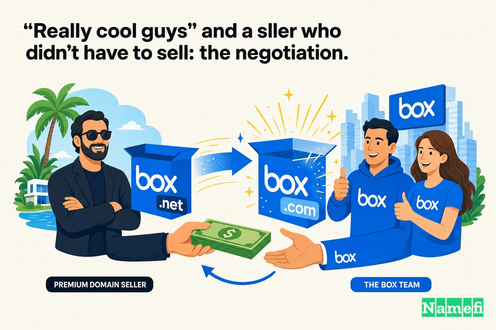
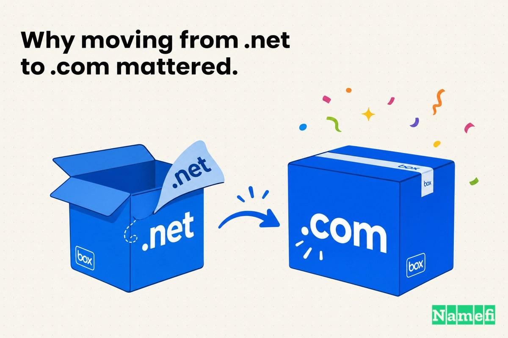
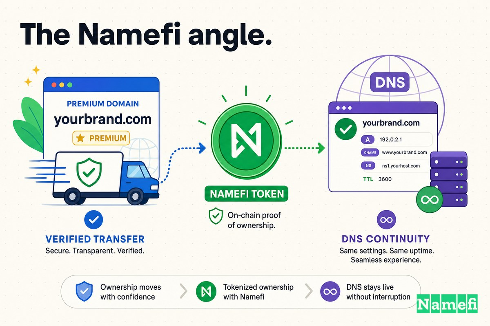

Box के अरबों डॉलर की एंटरप्राइज़ सॉफ़्टवेयर कंपनी बनने से पहले, इसका पता थोड़ा कम प्रभावशाली था: **Box.net**।

यह नाम एक विकल्प नहीं, बल्कि काम चलाने का एक तरीका (workaround) था। जब [2003 में यूनिवर्सिटी ऑफ़ सदर्न कैलिफ़ोर्निया के बिज़नेस स्टूडेंट आरोन लेवी (Aaron Levie) के साथ Box.com का आइडिया शुरू हुआ](https://en.wikipedia.org/wiki/Box_(company)#:~:text=The%20idea%20for%20Box.com%20started%20in%202003%20with%20Aaron%20Levie), तो एकदम सटीक (clean exact-match) नाम — Box.com — पहले से ही किसी के पास था। इसलिए वह कंपनी जो आगे चलकर [Box, Inc. (पूर्व में Box.net)](https://en.wikipedia.org/wiki/Box_(company)#:~:text=Box%2C%20Inc.%20(formerly%20Box.net)) बनने वाली थी, उसने वही किया जो अनगिनत स्टार्टअप्स तब करते हैं जब .com उपलब्ध नहीं होता: उन्होंने अगला सबसे अच्छा TLD चुना, Box.net पर लॉन्च किया और अपना प्रोडक्ट मार्केट में उतारा।

"Box.net" ही क्यों? क्योंकि Box.com किसी और का था — विशेष रूप से, प्रीमियम-डोमेन होल्डिंग कंपनी डिजिमीडिया (Digimedia) का, जिसे तरबूज की खेती करने वाले एक पूर्व किसान चलाते थे। जिस exact match डोमेन के बारे में हर किसी ने *मान लिया* था कि वह कंपनी का ही है, वह वास्तव में एक डोमेन इन्वेस्टर के पोर्टफोलियो में पड़ा था। वह तब तक पहुँच से बाहर था जब तक कि Box के पास उसे पाने के लिए नकद और कोई ठोस कारण नहीं आ गया।

अपने शुरुआती दौर में, .net ने अच्छी तरह काम किया। [2005 में, लेवी ने अपने पुराने दोस्त और को-फाउंडर डायलन स्मिथ (Dylan Smith) के साथ फुल-टाइम Box पर काम करने के लिए पढ़ाई छोड़ दी](https://en.wikipedia.org/wiki/Box_(company)#:~:text=In%202005%2C%20Levie%20dropped%20out%20of%20school%20to%20work%20on%20Box%20full-time%20with%20long-time%20friend%20and%20cofounder%20Dylan%20Smith), और [लेवी व स्मिथ के साथ को-फाउंडर जेफ़ क्विस्सर (Jeff Queisser) और सैम घोड्स (Sam Ghods) भी जुड़ गए](https://en.wikipedia.org/wiki/Box_(company)#:~:text=Levie%20and%20Smith%20were%20joined%20by%20cofounders%20Jeff%20Queisser%20and%20Sam%20Ghods)। बिज़नेस मॉडल सरल कंज़्यूमर स्टोरेज था: [लोग हमें महीने के $2.99 देते थे, और हम उन्हें 1GB स्टोरेज देते थे](https://nira.com/box-history/#:~:text=People%20would%20pay%20us%20%242.99%20a%20month%2C%20we%E2%80%99d%20give%20them%201GB%20of%20storage), जैसा कि लेवी ने बाद में बताया। एक वर्णनात्मक (descriptive) और उपलब्ध डोमेन ने उस शुरुआती प्रोडक्ट को बखूबी संभाला।

फिर, 2011 में, Box ने आखिरकार **Box.com** खरीद ही लिया। जैसा कि Domain Name Wire ने रिपोर्ट किया, [फाइल शेयरिंग सर्विस Box.net ने डिजिमीडिया के स्कॉट डे (Scott Day) से Box.com डोमेन नाम खरीदा](https://domainnamewire.com/2012/03/25/really-cool-guys-at-digimedia-sold-box-com-for-about-1-million/#:~:text=file%20sharing%20service%20Box.net%20bought%20the%20Box.com%20domain%20name%20from%20Scott%20Day%20at%20Digimedia) — और [कंपनी ने यह डोमेन $900,000 से $999,000 के बीच खरीदा](https://domainnamewire.com/2012/03/25/really-cool-guys-at-digimedia-sold-box-com-for-about-1-million/#:~:text=the%20company%20bought%20the%20domain%20for%20between%20%24900%2C000%20and%20%24999%2C000)।

यह कहानी है कि कैसे एक स्टार्टअप ने .net जैसे एक जुगाड़ (workaround) के साथ शुरुआत की, अपने पहले छह साल एक वास्तविक ब्रांड के रूप में विकसित होने में बिताए, और आखिरकार ".net" को हटाने के लिए लगभग एक मिलियन डॉलर का भुगतान किया — ठीक उसी समय जब इसने "Box.net" कहलाना बंद कर दिया और केवल **Box** बन गया।

## 2005: वह .net जुगाड़ जिसने प्रोडक्ट लॉन्च करवाया

शुरुआत में, ".net" एक मजबूरी थी, कोई रणनीति नहीं।

प्रोडक्ट का आइडिया एक वास्तविक समस्या से आया जिसे लेवी ने करीब से देखा था। सार्वजनिक इतिहास के अनुसार, [2004 में, जब उनका मुख्य विषय (major) अभी भी तय नहीं था, लेवी ने लॉस एंजिल्स में पैरामाउंट पिक्चर्स में इंटर्नशिप स्वीकार की। पैरामाउंट में अपने समय के दौरान ही लेवी ने पहली बार देखा कि स्टूडियो के लिए बड़ी फाइलें शेयर करना कितना मुश्किल था](https://nira.com/box-history/#:~:text=In%202004%2C%20with%20his%20major%20still%20undecided%2C%20Levie%20accepted%20an%20internship%20at%20Paramount%20Pictures)। इसका समाधान ऑनलाइन फाइल स्टोरेज और शेयरिंग था — इंटरनेट पर मौजूद एक "बॉक्स (box)"। नाम एकदम सही था। लेकिन .com उपलब्ध नहीं था।

इसलिए Box ने Box.net पर लॉन्च किया। एक गीगाबाइट के लिए प्रति माह कुछ डॉलर देने वाले शुरुआती ग्राहकों (early adopters) के लिए, TLD से शायद ही कोई फर्क पड़ता था:

- ब्रांड शब्द अभी भी "Box" था — छोटा, यादगार और अपना बनाने योग्य।
- प्रोडक्ट नाम से मेल खाता था: ऑनलाइन, आपकी फ़ाइलों के लिए एक बॉक्स।
- इसे समझाने की लागत (cost to explain) कम थी, जो तब बहुत मायने रखती थी जब कंपनी के पास कोई ब्रांड इक्विटी और लगभग कोई पैसा नहीं था।

पैसा, वास्तव में, स्थापना के समय सबसे बड़ी बाधा थी। सर्विस को ऑनलाइन करने के लिए, [लेवी और स्मिथ ने ऑनलाइन पोकर में जीते गए $15,000 का इस्तेमाल किया, जिसे स्मिथ ने सर्वर स्पेस किराए पर लेने के लिए बचाया था](https://nira.com/box-history/#:~:text=Levie%20and%20Smith%20used%20%2415%2C000%20in%20online%20poker%20winnings%20that%20Smith%20had%20been%20saving%20to%20rent%20server%20space)। पहला असली चेक अब एक मशहूर शुरुआती समर्थक (backer) की ओर से आया था: [2005 में मार्क क्यूबन (Mark Cuban) द्वारा सीड फंडिंग में $350,000 के निवेश तक, फाउंडर्स अपने स्वयं के पैसे और दोस्तों तथा परिवार के सदस्यों के समर्थन पर निर्भर थे](https://en.wikipedia.org/wiki/Box_(company)#:~:text=Mark%20Cuban%20invested%20%24350%2C000%20in%20seed%20funding%20in%202005)। पोकर की जीत और एक सिंगल एंजेल चेक से फंड की गई कंपनी, एक डोमेन इन्वेस्टर के पोर्टफोलियो से प्रीमियम .com निकालने में अपना रनवे (runway) खर्च नहीं करने वाली थी। Box.net वह पता था जिसे वे अफोर्ड कर सकते थे।

और सबसे अहम बात, कंपनी को वैसे भी सटीक (clean) वर्ज़न नहीं मिल सकता था। Box.com यूं ही बिना इस्तेमाल के नहीं पड़ा था — यह इंटरनेट पर सबसे प्रसिद्ध प्रीमियम-डोमेन पोर्टफोलियो में से एक का क्यूरेटेड एसेट (curated asset) था। Box.net कोई ब्रांडिंग की शान नहीं था; यह सबसे अच्छा उपलब्ध पता था जबकि Box.com एक ऐसे प्राइस टैग के पीछे इंतज़ार कर रहा था जिसे वह युवा स्टार्टअप अभी सही ठहरा (justify) नहीं सकता था।

## 2011: वह डोमेन खरीदना जिसे वे हमेशा से चाहते थे

2011 तक, Box के सामने एक ऐसी समस्या थी जो केवल सफलता ही पैदा करती है: एक *बेहतर* पता सामने ही था, और कंपनी आखिरकार .net के स्तर से कहीं आगे बढ़ चुकी थी।

Box ने सस्ते कंज़्यूमर स्टोरेज से एंटरप्राइज़ की ओर एक बड़ा पिवट (pivot) कर लिया था। अपग्रेड के समय तक, TechCrunch ने Box को [एक एंटरप्राइज़ क्लाउड स्टोरेज प्लेटफॉर्म जो कोलैबोरेशन, सोशल और मोबाइल कार्यक्षमता के साथ आता है](https://techcrunch.com/2011/09/28/box-net/#:~:text=cloud%20storage%20platform%20for%20the%20enterprise%20that%20comes%20with%20collaboration%2C%20social%20and%20mobile%20functionality) के रूप में वर्णित किया, और रिपोर्ट किया कि [Box, जिसके 7 मिलियन उपयोगकर्ता हैं और जो 300 मिलियन डॉक्युमेंट्स स्टोर करता है](https://techcrunch.com/2011/09/28/box-net/#:~:text=Box%2C%20which%20has%207%20million%20users%20and%20stores%20300%20million%20documents), उसे [फॉर्च्यून 500 के 77% सहित 100,000 व्यवसायों द्वारा अपनाया जा चुका है](https://techcrunch.com/2011/09/28/box-net/#:~:text=100%2C000%20businesses%2C%20including%2077%25%20of%20the%20Fortune%20500)। फॉर्च्यून 500 की अधिकांश कंपनियों को अपना प्रोडक्ट बेचने वाली कंपनी के लिए ऐसा डोमेन अब सही नहीं था जो किसी शौकिया फाइल होस्ट (hobbyist file host) जैसा लगे।

इसलिए उन्होंने वह exact match डोमेन खरीद लिया। बेचने वाले एक विशेषज्ञ (specialist) थे: [तरबूज किसान स्कॉट डे (Scott Day) ने डिजिमीडिया की स्थापना की थी। वह Watermelons.com की खरीद के साथ डोमेन व्यवसाय में आए थे](https://domainnamewire.com/2012/03/25/really-cool-guys-at-digimedia-sold-box-com-for-about-1-million/#:~:text=Watermelon%20farmer%20Scott%20Day%20founded%20Digimedia)। सालों बाद, एक डोमेन गाइड ने इस सौदे का एक लाइन में सारांश दिया: [2011 में, इंटरनेट कंपनी Box के मालिकों ने Box.net से Box.com में अपग्रेड करने के लिए लगभग 1 मिलियन डॉलर का भुगतान किया](https://jamesnames.com/guide/digimedia/#:~:text=In%202011%2C%20the%20owners%20of%20the%20Internet%20company%20Box%20paid%20close%20to%20%241%20million%20to%20upgrade%20from%20Box.net%20to%20Box.com)।

लगभग एक मिलियन डॉलर कोई वैनिटी URL (दिखावे वाला URL) नहीं था। यह आखिरकार उस सटीक पते का मालिक बनने की कीमत थी जो उस ब्रांड से मेल खाता था जिसे उपयोगकर्ता पहले से ही टाइप कर रहे थे।

## "सच में बेहतरीन लोग" और एक विक्रेता जिसे बेचने की कोई मजबूरी नहीं थी: बातचीत (negotiation)

Box.com को खरीदने में छह साल लगने का कारण वही है जो ज़्यादातर प्रीमियम-डोमेन सौदों के धीमे होने का कारण होता है: मालिक को इसे बेचने की कोई जल्दी या मजबूरी नहीं थी।

डिजिमीडिया कोई स्क्वैटर (squatter) नहीं है जो किसी टाइपो पर बैठा हो। यह एक प्रोफेशनल पोर्टफोलियो है जिसने इंटरनेट पर कुछ सबसे जेनेरिक और मूल्यवान एक-शब्द (one-word) वाले डोमेन रखे और बेचे हैं। Box.com को बेचना उनकी शर्तों पर हुआ एक लेन-देन था, कोई हताशा में किया गया सौदा (desperate flip) नहीं। इसकी कीमत से यह झलकता है — एक सामान्य अंग्रेजी शब्द के .com रूप के लिए $900,000 से $999,000 के बीच की रकम।

जो बात ध्यान देने योग्य है, वह यह है कि विक्रेता के पास ज्यादा पावर (leverage) होने के बावजूद, यह सौदा कितना *सौहार्दपूर्ण (cordial)* था। CNET लेखक [रैफे नीडलमैन (Rafe Needleman) ने Box के CEO आरोन लेवी के साथ डोमेन नाम पर चर्चा की](https://domainnamewire.com/2012/03/25/really-cool-guys-at-digimedia-sold-box-com-for-about-1-million/#:~:text=CNET%20writer%20Rafe%20Needleman%20discussed%20the%20domain%20name%20with%20Box%20CEO%20Aaron%20Levie), और इसका निष्कर्ष काफी गर्मजोशी भरा था: [डिजिमीडिया के साथ बातचीत के बारे में, लेवी ने कहा कि डिजिमीडिया के लोग 'सच में बेहतरीन (really cool)' थे](https://domainnamewire.com/2012/03/25/really-cool-guys-at-digimedia-sold-box-com-for-about-1-million/#:~:text=Levie%20said%20the%20Digimedia%20guys%20were)। यहाँ शैंपेन और मुकदमों का कोई ड्रामा नहीं था — बस अच्छी खासी पूंजी वाला एक खरीदार था जो ठीक-ठीक जानता था कि उसे क्या चाहिए, और एक पेशेवर विक्रेता था जो ठीक-ठीक जानता था कि उसके पास क्या है।

और Box इसे इतनी शिद्दत से चाहता था कि वे अपनी सीमा से आगे जाने को भी तैयार थे। उसी रिपोर्टिंग के अनुसार, [अगर लेवी को जरूरत पड़ती तो वे डोमेन के लिए और अधिक खर्च करने को तैयार थे](https://domainnamewire.com/2012/03/25/really-cool-guys-at-digimedia-sold-box-com-for-about-1-million/#:~:text=Levie%20was%20prepared%20to%20spend%20more%20for%20the%20domain%20if%20he%20had%20to)। यह इस बात का सबूत है कि यह कोई दिखावटी (cosmetic) खरीदारी नहीं थी। एक फाउंडर जिसने पहले ही अच्छा-खासा एंटरप्राइज़ फंड जुटा लिया हो, और जो लगभग सात-आंकड़ों (seven-figure) की मांग से *ऊपर* भुगतान करने को तैयार हो, उसने यह तय कर लिया था कि exact-match .com एक बुनियादी ढांचा (infrastructure) है — कोई सजावट (decoration) नहीं।

किसी आम स्क्वैटर (squatter) की कहानी से इसका अंतर ड्रामे की अनुपस्थिति है, और यही मुख्य बात है। जब विक्रेता एक वैध (legitimate) पोर्टफोलियो हो और खरीदार असली पैसे वाली एक असली कंपनी हो, तो "बातचीत" ज्यादातर एक ऐसे एसेट के लिए सही कीमत खोजने (price discovery) के बारे में होती है जिसकी कोई सार्वजनिक तुलना (public comparables) मौजूद न हो। यहाँ टकराव (friction) दुश्मनी का नहीं — बल्कि वैल्युएशन (मूल्यांकन) का होता है।

## तब उस पैसे की अहमियत अलग थी

पीछे मुड़कर देखने पर ~$1 मिलियन के इस सौदे को बहुत सस्ता (bargain) कहना आसान लगता है। Box न्यूयॉर्क स्टॉक एक्सचेंज (New York Stock Exchange) में पब्लिक हुआ और एक मल्टीबिलियन-डॉलर एंटरप्राइज़ सॉफ़्टवेयर कंपनी बन गया; Box.com अब इसकी सबसे शांत, सबसे स्थायी संपत्तियों में से एक है। इसके मुकाबले, एक मिलियन डॉलर तो बस एक राउंडिंग एरर (rounding error) जैसा लगता है।

लेकिन इसका आकलन उस समय के हिसाब से किया जाना चाहिए जब इसे खर्च किया गया था।

2011 में, Box एक तेजी से बढ़ती हुई लेकिन अभी भी एक निजी (private) कंपनी थी, जो एंटरप्राइज़ मार्केट में अपना दबदबा कायम करने के लिए भारी खर्च कर रही थी। यह एक ऐसी कंपनी थी जिसे सिर्फ छह साल पहले पोकर की जीत और $350,000 के एंजेल चेक से बूटस्ट्रैप (bootstrapped) किया गया था। डोमेन डील के समय के आसपास, [Box ने ग्रोथ कैपिटल में $50 मिलियन और जुटाए थे](https://techcrunch.com/2011/09/28/box-net/#:~:text=Box%20just%20raised%20another%20%2450%20million%20in%20growth%20capital) — यह पैसा सेल्स टीम, इंफ्रास्ट्रक्चर और एंटरप्राइज़ फीचर्स को फंड करने के लिए जुटाया गया था, न कि URLs के लिए।

उस संदर्भ में, एक *डोमेन नाम* पर लगभग $1 मिलियन खर्च करना — न कि इंजीनियरों, डेटा सेंटरों या एंटरप्राइज़ सेल्स प्रतिनिधियों पर — एक बड़ा पूंजी-आवंटन (capital-allocation) निर्णय था। यह तभी समझ में आता है जब आप exact-match .com को इंफ्रास्ट्रक्चर के रूप में मानें: एक ऐसा पता जहाँ हर CIO, हर प्रेस मेंशन, हर इंटीग्रेशन पार्टनर और हर फॉर्च्यून 500 प्रोक्योरमेंट फॉर्म पहुँचेगा। Box यह दांव लगा रहा था कि बड़े एंटरप्राइज़ से उनकी फाइलों पर भरोसा करने के लिए कहने वाली कंपनी को .net पर नहीं रहना चाहिए।

## .net से .com पर जाना क्यों मायने रखता था

Box.net और Box.com के बीच का अंतर तीन अक्षरों (characters) का है। रणनीतिक रूप से, यह "वह वर्ज़न जो उपलब्ध था" और "वह वर्ज़न जिसे हर कोई असली मानता है" के बीच का अंतर है।

**Box.net** एक विकल्प (fallback) का संकेत देता है — वह पता जो आप तब लेते हैं जब .com चला जाता है। **Box.com** डिफ़ॉल्ट, कैनोनिकल (canonical) और उस पते का संकेत देता है जिसे एक उपयोगकर्ता बिना सोचे टाइप करता है। किसी कंज़्यूमर टॉय (consumer toy) के लिए, इस अंतर के साथ काम चल सकता है। लेकिन फॉर्च्यून 500 कंपनियों को भरोसा और स्थायित्व बेचने वाली कंपनी के लिए, यह एक खामोश और लगातार लगने वाला टैक्स है।

| पहले (Before) | बाद में (After) |
| --- | --- |
| Box.net | Box.com |
| एक फॉलबैक (fallback) TLD जैसा लगता है | एक प्रामाणिक (canonical) पते जैसा लगता है |
| वह वर्ज़न जो आप तब लेते हैं जब .com उपलब्ध नहीं होता | वह वर्ज़न जिसे हर कोई असली मानता है |
| हल्की सी शंका - "क्या यही आधिकारिक लोग (official guys) हैं?" | एंटरप्राइज़ खरीदारों के लिए डिफ़ॉल्ट भरोसा |
| गलती से Box.com टाइप करना आसान है — और कहीं और पहुँच जाना | वह पता जिसका यूज़र्स पहले ही अनुमान लगा लेते हैं कि वह आप तक ले जाएगा |

यही पैटर्न हर डोमेन अपग्रेड में देखने को मिलता है: शुरुआती पते बस *काम चलाते* हैं, महान पते *अधिकार* जताते हैं। एक अलग TLD — .net, .io, .co — या एक डिस्क्रिप्टिव मॉडिफायर (descriptive modifier) शुरुआत करने का एक एकदम सही और तार्किक जरिया (on-ramp) है जब exact-match .com उपलब्ध न हो या उसे खरीदना बजट से बाहर हो। यह अपग्रेड तब फलदायी साबित होता है जब ब्रांड काफी मजबूत हो जाता है, और कंपनी के पास अपने खुद के नाम के प्रामाणिक (canonical) वर्ज़न पर दावा करने के लिए पर्याप्त पूंजी आ जाती है।

Box के लिए, .net कभी भी उनकी महत्वाकांक्षा (aspiration) नहीं था। यह वह पता था जिसे कंपनी 2005 में अफोर्ड कर सकती थी, और इसे केवल इसलिए रखा गया था क्योंकि Box.com एक ऐसे प्राइस टैग के पीछे था जिसे एक पोकर-फंडेड स्टार्टअप सही ठहरा (justify) नहीं सकता था।

## डोमेन ने कंपनी की बराबरी कर ली

इसकी टाइमिंग ही सब कुछ बयां करती है। डोमेन और कॉर्पोरेट पहचान एक साथ आगे बढ़े।

Box ने अपने पहले छह साल एक ऐसी कंपनी के रूप में बिताए जिसका प्रोडक्ट, ब्रांड और महत्वाकांक्षा सब "Box" कहते थे, जबकि इसका पता "Box.net" कहता था — एक ऐसा बेमेल (mismatch) जो उतने ही अधिक एंटरप्राइज़ ग्राहकों के जुड़ने से और भी अजीब होता गया। 2011 के अपग्रेड ने इसे सुलझा दिया: कंपनी ने Box.com को सुरक्षित कर लिया, और उसी दौर में यह आधिकारिक तौर पर [Box, Inc. (पूर्व में Box.net)](https://en.wikipedia.org/wiki/Box_(company)#:~:text=Box%2C%20Inc.%20(formerly%20Box.net)) बन गई — पहचान से ".net" को हटाना तभी मुमकिन हुआ जब नए डोमेन ने इसे संभव बनाया।

इसके विकल्प की कल्पना करें: एक कंपनी फॉर्च्यून 500 के 77% ग्राहकों को अपने डॉक्युमेंट्स पर भरोसा करने के लिए मना रही है, जबकि उसका प्रामाणिक वेब पता Box.net बना हुआ है और Box.com कहीं और निर्देशित (point) करता है। ब्रांड तब तक "Box" के इर्द-गिर्द पूरी तरह से मजबूत (consolidate) नहीं हो सकता जब तक कि वह Box.com का मालिक न हो। एक सटीक, सिंगल-वर्ड पहचान स्थापित होने से पहले इस धीमे, बाहरी रूप से स्वामित्व वाले (externally-owned) और महंगे हिस्से — यानी डोमेन — को सुरक्षित करना ज़रूरी था।

इसीलिए यह अपग्रेड केवल दिखावटी (cosmetic) नहीं था। यह वह क्षण था जब प्रोडक्ट का नाम, कंपनी का नाम, और उसका पता आखिरकार वही तीन अक्षर बन गए, उसी TLD पर जिसकी सभी को उम्मीद थी।

## डोमेन ऑपरेटिंग सिस्टम का हिस्सा बन गया

प्रीमियम डोमेन केवल प्रतिष्ठा (prestige) के बारे में नहीं होते हैं। वे दोहराव (repetition) के बारे में होते हैं — और, एक एंटरप्राइज़ वेंडर के लिए, विश्वास के बारे में होते हैं।

किसी कंपनी का मुख्य डोमेन उन जगहों पर दिखाई देता है जिन्हें मार्केटिंग टीम सीधे तौर पर कभी कंट्रोल नहीं करती:

- किसी ग्राहक को भेजे गए हर कर्मचारी के ईमेल पते और हस्ताक्षर में।
- सिक्योरिटी रिव्यू, प्रोक्योरमेंट फॉर्म (procurement forms) और वेंडर ऑनबोर्डिंग (vendor onboarding) में।
- प्रेस हेडलाइंस, एनालिस्ट रिपोर्ट्स और इंटीग्रेशन डायरेक्टरीज़ में।
- सर्च रिज़ल्ट्स और ब्राउज़र बार्स में।
- एक एडमिन द्वारा दूसरे एडमिन को दी गई हर मौखिक सिफारिश (spoken recommendation) में।

इनमें से हर एक दोहराव या तो घर्षण (friction) बढ़ाता है या इसे दूर करता है। Box.net ने हर ज़िक्र के साथ एक हल्का सा सवाल खड़ा किया — *क्या .net असली है, या कोई Box.com भी है जिसका मुझे इस्तेमाल करना चाहिए?* — और गलती से पते को Box.com टाइप करना और ऐसे पार्किंग पेज पर पहुंचना बेहद आसान बना दिया जो कंपनी का नहीं था। Box.com ने हर ज़िक्र को प्रामाणिक (canonical) और खुद-सुधारने वाला (self-correcting) बना दिया: जो पता लोग पहले ही अनुमान लगाते थे वह अब असली कंपनी तक ले जाता था।

इसे 7 मिलियन उपयोगकर्ताओं, 100,000 व्यवसायों और अधिकांश फॉर्च्यून 500 से गुणा करें — वे खरीदार जिनके लिए "क्या यह वेंडर अपने खुद के .com का मालिक भी है?" एक वास्तविक, भले ही अनकहा, भरोसे का संकेत (trust signal) है — और लगभग $1 मिलियन एक विलासिता (luxury) जैसा दिखना बंद हो जाता है। यह रुकावटों (drag) में स्थायी कमी, और साथ ही एंटरप्राइज़-स्तर की विश्वसनीयता में अंतर (credibility gap) को दूर करने जैसा लगता है।

## संस्थापकों (Founders) को केस 17 से क्या सीखना चाहिए

इससे आसान निष्कर्ष निकालना — "पहले ही दिन अपना exact-match .com खरीद लें" — गलत होगा। Box ऐसा *नहीं कर सकता था*; .com एक क्यूरेटेड प्रीमियम एसेट था और कंपनी पोकर की जीत से फंडेड थी। अधिक उपयोगी सबक इस बात पर निर्भर करते हैं कि आप किस स्टेज (staging) पर क्या करते हैं:

1. **लॉन्च करने के लिए एक अलग TLD ठीक है।** Box.net ने एक कंज़्यूमर प्रोडक्ट, एक एंटरप्राइज़ पिवट, लाखों उपयोगकर्ताओं और ग्रोथ कैपिटल में $50 मिलियन का सफर तय किया। कोई .net, .io, या .co — या एक डिस्क्रिप्टिव मॉडिफायर (descriptive modifier) — कोई विफलता नहीं है। जब .com किसी और के पास हो या महंगा हो, तो यह शुरुआत करने का एक तार्किक ज़रिया (on-ramp) है।
2. **उस पल पर नज़र रखें जब TLD आपको नुकसान पहुँचाने लगे।** Box का सिग्नल कोई सुंदरता (aesthetic) से जुड़ा नहीं था। यह .net से फॉर्च्यून 500 को अपना प्रोडक्ट बेचना था — यह वह क्षण था जब "हमारे पास जो पता है" और "खरीदार जिस पते पर भरोसा करते हैं" के बीच का अंतर विश्वसनीयता का टैक्स (credibility tax) बन गया।
3. **exact-match .com को इंफ्रास्ट्रक्चर के रूप में मानें, और इसके लिए बजट बनाएं।** अपग्रेड करने का निर्णय आसान था। लगभग $1 मिलियन — जिसमें फाउंडर [ज़रूरत पड़ने पर और अधिक खर्च करने को तैयार थे](https://domainnamewire.com/2012/03/25/really-cool-guys-at-digimedia-sold-box-com-for-about-1-million/#:~:text=Levie%20was%20prepared%20to%20spend%20more%20for%20the%20domain%20if%20he%20had%20to) — वास्तविक लागत थी, जिसका भुगतान ग्रोथ कैपिटल से किया गया।
4. **पेशेवर कीमतों की उम्मीद करते हुए पेशेवर विक्रेताओं से खरीदें।** यहाँ मुक़दमा करने के लिए कोई स्क्वैटर नहीं था — बस डिजिमीडिया था, जो एक वैध पोर्टफोलियो था जिसके पास एक-शब्द वाला .com था। बातचीत [सौहार्दपूर्ण](https://domainnamewire.com/2012/03/25/really-cool-guys-at-digimedia-sold-box-com-for-about-1-million/#:~:text=Levie%20said%20the%20Digimedia%20guys%20were) थी; कीमत ही एकमात्र अड़चन (friction) थी।

डोमेन अपग्रेड ने Box को जीत नहीं दिलाई। प्रोडक्ट, एंटरप्राइज़ पिवट, टाइमिंग और एग्ज़ीक्यूशन (execution) कहीं अधिक मायने रखते थे। लेकिन Box.com ने आखिरकार कंपनी के नाम, प्रोडक्ट और पते को एक समान बना दिया — और हर ग्राहक इंटरैक्शन से इस खामोश सवाल को हटा दिया कि "एक एंटरप्राइज़ वेंडर .net पर क्यों है?"।

## Namefi का नज़रिया (The Namefi Angle)

Box की कहानी, मूल रूप से, एक ट्रांसफर-और-वैल्यूएशन (मूल्यांकन) की समस्या है।

रणनीतिक निर्णय (strategic decision) पर वास्तव में कभी कोई संदेह नहीं था — ज़ाहिर है कि Box नामक कंपनी को Box.com का मालिक होना ही चाहिए। सबसे कठिन हिस्सा इस एसेट से जुड़ी अन्य बातें थीं: यह पहचानना कि .com एक प्रीमियम पोर्टफोलियो के अंदर मौजूद है, बिना किसी सार्वजनिक तुलनीय (public comparables) डेटा वाले एक-शब्द के डोमेन की कीमत पर सहमत होना, लगभग सात-आंकड़ों (seven-figure) की मांग से [और भी अधिक भुगतान करने के लिए तैयार रहना](https://domainnamewire.com/2012/03/25/really-cool-guys-at-digimedia-sold-box-com-for-about-1-million/#:~:text=Levie%20was%20prepared%20to%20spend%20more%20for%20the%20domain%20if%20he%20had%20to), और 100,000 व्यवसायों द्वारा उपयोग की जा रही लाइव सर्विस को बाधित किए बिना स्पष्ट रूप से डोमेन का नियंत्रण (control) स्थानांतरित करना। साल इसलिए नहीं बीते क्योंकि *निर्णय* लेना मुश्किल था, बल्कि इसलिए बीते क्योंकि *एग्ज़ीक्यूशन (execution)* — एक प्रीमियम एसेट की प्राइसिंग और ट्रांसफरिंग — मुश्किल थी।

[Namefi](https://namefi.io) इस विचार पर आधारित है कि डोमेन को इंटरनेट-नेटिव एसेट्स (internet-native assets) की तरह व्यवहार करना चाहिए। टोकनाइज़्ड ओनरशिप (Tokenized ownership) डोमेन कंट्रोल को वेरिफाई करने, ट्रांसफर करने और आधुनिक वर्कफ़्लो में इंटीग्रेट करने को आसान बना सकती है, जबकि यह DNS के साथ भी कम्पैटिबल रहती है — इस तरह के सौदे के सबसे पेचीदा हिस्सों (यह साबित करना कि वास्तव में एक प्रीमियम डोमेन को कौन कंट्रोल करता है, मूल्य पर सहमत होना, और इसे सुरक्षित रूप से ट्रांसफर करना) को एक साफ़, ऑडिटेबल (auditable) ट्रांज़ेक्शन के करीब बदल देती है।

Box.com अब अपरिहार्य (inevitable) लगता है क्योंकि Box बहुत बड़ा बन गया है। लेकिन इसका सबक उस मुकाम पर पहुँचने से बहुत पहले ही मिल जाता है: जब कोई नाम बिज़नेस को आगे ले जाने वाला हो — ख़ासकर एक ऐसा बिज़नेस जो बड़े एंटरप्राइज़ से उस पर भरोसा करने के लिए कह रहा हो — तो exact-match .com कोई सजावट नहीं है। यह ब्रांड का वह हिस्सा है जिसके लिए आखिरकार सही चीज़ पाने के लिए लगभग एक मिलियन डॉलर और इससे भी अधिक भुगतान करने की इच्छा रखना पूरी तरह से जायज़ है।

## स्रोत (Sources) और आगे की पढ़ाई (Further reading)

- विकिपीडिया (Wikipedia) — [Box, Inc.](https://en.wikipedia.org/wiki/Box_(company)#:~:text=Box%2C%20Inc.%20(formerly%20Box.net))
- विकिपीडिया (Wikipedia) — [Box, Inc. (alt title)](https://en.wikipedia.org/wiki/Box,_Inc.)
- Domain Name Wire — [डिजिमीडिया के "सच में बेहतरीन" लोगों ने Box.com लगभग 1 मिलियन डॉलर में बेचा](https://domainnamewire.com/2012/03/25/really-cool-guys-at-digimedia-sold-box-com-for-about-1-million/#:~:text=file%20sharing%20service%20Box.net%20bought%20the%20Box.com%20domain%20name%20from%20Scott%20Day%20at%20Digimedia)
- James Names — [डिजिमीडिया कौन है? (Box.net से Box.com अपग्रेड)](https://jamesnames.com/guide/digimedia/#:~:text=In%202011%2C%20the%20owners%20of%20the%20Internet%20company%20Box%20paid%20close%20to%20%241%20million%20to%20upgrade%20from%20Box.net%20to%20Box.com)
- TechCrunch — [क्लाउड स्टोरेज कंपनी Box.net ने क्रॉस-प्लेटफॉर्म सिंक; सेल्सफोर्स चैटर इंटीग्रेशन और बहुत कुछ लॉन्च किया](https://techcrunch.com/2011/09/28/box-net/#:~:text=cloud%20storage%20platform%20for%20the%20enterprise)
- TechCrunch — [Box.net ने Increo Solutions का अधिग्रहण किया](https://techcrunch.com/2009/10/06/box-net-acquires-increo-solutions-to-expand-document-collaboration-and-sharing/)
- Nira — [कैसे Box ने एंटरप्राइज़ पर जीत हासिल की और एक दशक में 1.7 बिलियन डॉलर की कंपनी बन गई](https://nira.com/box-history/#:~:text=People%20would%20pay%20us%20%242.99%20a%20month%2C%20we%E2%80%99d%20give%20them%201GB%20of%20storage)
- विकिपीडिया (Wikipedia) — [Aaron Levie](https://en.wikipedia.org/wiki/Aaron_Levie)
- विकिपीडिया (Wikipedia) — [Rafe Needleman](https://en.wikipedia.org/wiki/Rafe_Needleman)
- डिजिमीडिया (Digimedia) — [DIGIMEDIA प्रीमियम डोमेन नाम](https://www.digimedia.com/)