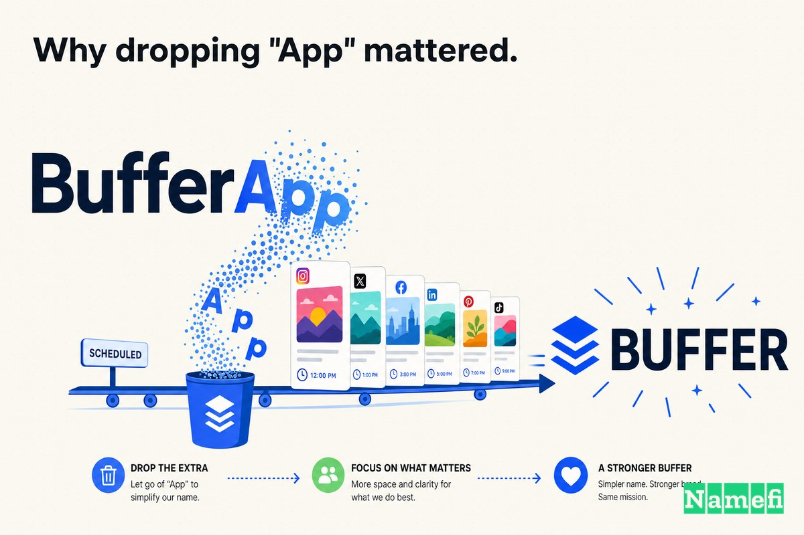
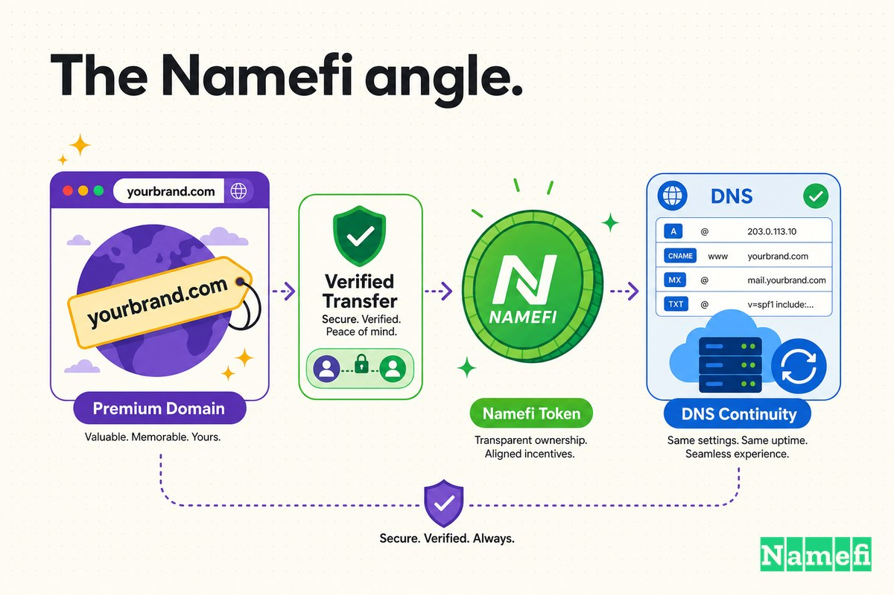

सोशल-मीडिया टूल बनने से पहले, Buffer एक लंबे नाम से जाना जाता था: **BufferApp.com**।

"App" ब्रांडिंग का विकल्प नहीं था। यह एक उपाय था। जब Joel Gascoigne ने 2010 के अंत में Buffer का पहला संस्करण लॉन्च किया, तो साफ exact-match डोमेन — Buffer.com — पहले से ही किसी और के नाम पर था, जो कंपनी के अस्तित्व में आने से वर्षों पहले रजिस्टर हो चुका था। इसलिए जो प्रोडक्ट "Buffer" कहलाना चाहता था, वह "Buffer, the app" के रूप में लॉन्च हुआ।

पहला नाम उससे भी अजीब था। Buffer के अपने बयान के अनुसार, [हमने मूल रूप से bfffr.com से शुरुआत की थी, जब Joel ने 2010 के अंत में Buffer लॉन्च किया](https://buffer.com/resources/acquired-buffer-com/#:~:text=we%20originally%20started%20out%20with%20bfffr.com%2C%20when%20Joel%20launched%20Buffer%20in%20late%202010) — उस दौर के स्टार्टअप्स की फैशन में बिना स्वर का एक विचित्र नाम। इसे कोई बोल नहीं सकता था। Joel ने [इसे bufferapp.com में बदल दिया, ताकि चीजें अधिक स्पष्ट हों](https://buffer.com/resources/acquired-buffer-com/#:~:text=to%20make%20things%20more%20clear%20and%20worry%20less%20about%20not%20having%20the%20exact%20domain%20of%20your%20startup%27s%20name) — और साथ ही, [अपने स्टार्टअप के नाम का exact डोमेन न होने की चिंता कम करने के लिए](https://buffer.com/resources/acquired-buffer-com/#:~:text=to%20make%20things%20more%20clear%20and%20worry%20less%20about%20not%20having%20the%20exact%20domain%20of%20your%20startup%27s%20name)।

वह आखिरी वाक्यांश पूरी कहानी का सारांश है। BufferApp.com एक ऐसे डोमेन की चिंता को दूर करने का तरीका था जो कंपनी के पास नहीं था — जब तक कि वह न होना ही बड़ी समस्या नहीं बन गई।

यह कहानी है कि Buffer ने आखिरकार Buffer.com कैसे हासिल किया: 624 दिनों का एक अभियान, जो एक ऐसी कंपनी द्वारा चलाया गया जो transparency के प्रति इतनी प्रतिबद्ध थी कि उसने विक्रेता को अपना बैंक बैलेंस दिखाया — और फिर एक ऐसे मोड़ में जिसने सबको चौंका दिया, वह एकमात्र संख्या बताने से इनकार कर दिया जो इंटरनेट सबसे ज्यादा जानना चाहता था।

## 2010: नाम में "app" जो असली काम करता था

Buffer छोटे और ठोस रूप से शुरू हुआ। Wikipedia के अनुसार, [Buffer का विकास अक्टूबर 2010 में बर्मिंघम, यूनाइटेड किंगडम में सह-संस्थापक Joel Gascoigne द्वारा शुरू हुआ](https://en.wikipedia.org/wiki/Buffer_%28application%29#:~:text=Buffer%20began%20its%20development%20in%20October%202010%20in%20Birmingham%2C%20United%20Kingdom%20by%20co-founder%20Joel%20Gascoigne), और [30 नवंबर 2010 को Buffer का प्रारंभिक संस्करण लॉन्च किया गया](https://en.wikipedia.org/wiki/Buffer_%28application%29#:~:text=On%20November%2030%2C%202010%2C%20the%20initial%20version%20of%20Buffer%20was%20launched)। प्रोडक्ट एक सीमित काम करता था: यह आपको सोशल पोस्ट को एक बार में नहीं बल्कि एक शेड्यूल पर कतार में लगाने देता था। Joel ने बाद में तारीख खुद कन्फर्म की, लिखा: [मैंने Buffer को 30 नवंबर 2010 को लॉन्च किया](https://buffer.com/resources/10-years/#:~:text=I%20launched%20Buffer%20on%20November%2030th%2C%202010)।

इसके तुरंत बाद, Joel के साथ सह-संस्थापक Leo Widrich जुड़े, और [जुलाई 2011 में, सह-संस्थापकों ने स्टार्टअप को यूनाइटेड किंगडम से सैन फ्रांसिस्को ले जाने का फैसला किया](https://en.wikipedia.org/wiki/Buffer_%28application%29#:~:text=In%20July%202011%2C%20the%20cofounders%20decided%20to%20move%20the%20startup%20venture%20from%20the%20United%20Kingdom%20to%20San%20Francisco)। जो टीम अपने वेतन और राजस्व को खुलकर ब्लॉग करने के लिए प्रसिद्ध होने वाली थी, वह शुरुआत में दो प्रवासी और एक शेड्यूलिंग टूल था जो एक ऐसे डोमेन पर रह रहा था जिसके नाम पर एक अतिरिक्त शब्द था।

उस पहले चरण के लिए, BufferApp.com बिल्कुल ठीक था। "App" बताता था कि यह क्या है। इसने कंपनी को वह डोमेन मिलने का इंतजार किए बिना अपने असली नाम से लॉन्च करने दिया जो मिल नहीं सकता था। modifier एक रैंप था, विफलता नहीं — ठीक वैसा उचित समाधान जैसा एक युवा स्टार्टअप करता है जब असली शब्द पहले से ले लिया गया हो।

## समस्या: दुनिया गलत दरवाजे पर दस्तक देती रही

BufferApp.com पर लॉन्च करने की परेशानी यह है कि दुनिया आपका डोमेन याद नहीं रखती। वह अनुमान लगाती है। और वह साफ वाला अनुमान लगाती है।

जैसे-जैसे Buffer बढ़ा, यह अनुमान लगाना एक देनदारी बन गया। कंपनी की अपनी कहानी में, [अधिक से अधिक लोग सोचने लगे कि buffer.com हमारा डोमेन है](https://buffer.com/resources/acquired-buffer-com/#:~:text=more%20and%20more%20people%20thought%20that%20buffer.com%20was%20our%20domain) — एक भ्रम जो [Buffer के बड़े होने के साथ-साथ अधिक से अधिक होने वाली घटना बन जाती](https://buffer.com/resources/acquired-buffer-com/#:~:text=would%20become%20more%20of%20an%20ongoing%20occurrence%20as%20Buffer%20grew%20bigger)। हर नया यूजर, हर प्रेस उल्लेख, हर मुंह-जुबानी सिफारिश लोगों को Buffer.com की ओर ले जाती — एक ऐसा डोमेन जिसे Buffer नियंत्रित नहीं करता था।

यही modifier डोमेन का छुपा हुआ टैक्स है। BufferApp.com उन सभी के लिए बिल्कुल काम करता था जो इसे सही-सही टाइप करते थे। लेकिन ब्रांड जितना बड़ा होता गया, उतना ही *bare* शब्द — जो कंपनी के पास नहीं था — वह नाम बन गया जिसे लोग मान लेते और पहले टाइप करते थे। modifier ने लॉन्च के समय Buffer को धीमा नहीं किया। यह बड़े पैमाने पर चुपचाप ध्यान लीक कर रहा था।

इसका समाधान rebranding नहीं था। प्रोडक्ट पहले से ही Buffer कहलाता था। बस उसके पते को उसके नाम से मिलाने की जरूरत थी।

## अभियान: एक शब्द के लिए 624 दिन

Buffer.com खरीदना कोई लेनदेन नहीं था। यह एक अभियान था।

डोमेन की गहरी जड़ें थीं: [Buffer.com मूल रूप से Company corp के स्वामित्व में था और 1997 में रजिस्टर हुआ था](https://buffer.com/resources/acquired-buffer-com/#:~:text=Buffer.com%20was%20originally%20owned%20and%20registered) — Buffer के अस्तित्व से पहले, Joel के कुछ भी बनाने से पहले, लगभग दो दशकों तक किसी और के हाथों में। इसे मुक्त करने के लिए हफ्तों नहीं, सालों में मापे गए धैर्य की आवश्यकता थी।

Buffer ने समयरेखा सटीक रूप से दर्ज की। [पहले संपर्क और प्रभावी डोमेन ट्रांसफर के बीच बीता समय: 624 दिन (5 जून 2013 – 19 फरवरी 2015)](https://buffer.com/resources/acquired-buffer-com/#:~:text=Time%20elapsed%20between%20first%20contact%20and%20effective%20domain%20transfer%3A%20624%20days%20%28June%205th%202013%20%E2%80%93%20Feb%2019th%202015%29)। पहले ईमेल से लेकर डोमेन के आखिरकार ट्रांसफर होने तक करीब दो साल। रणनीतिक निर्णय — *बेशक* Buffer कहलाने वाला प्रोडक्ट Buffer.com पर होना चाहिए — पहले दिन से स्पष्ट था। सौदे में जो कठिन था वह mechanics था: सही व्यक्ति को खोजना, सौदा करने के लिए पर्याप्त भरोसा बनाना, बिना किसी सार्वजनिक तुलना के कीमत पर सहमत होना, और asset को बिना किसी बाधा के साफ-साफ ट्रांसफर करना।

और खरीदार के पास भरपूर नकदी नहीं थी। Buffer एक लाभदायक लेकिन किफायती स्टार्टअप था, और इस खरीद के लिए प्रतिबद्ध होने का मतलब था [हमारी उपलब्ध नकदी का एक बड़ा हिस्सा](https://buffer.com/resources/acquired-buffer-com/#:~:text=large%20portion%20of%20our%20available%20cash) एक अकेले अमूर्त asset पर खर्च करना। जैसा कि टीम ने कहा, यह [एक virtual asset के लिए भी — हमारी उपलब्ध नकदी के एक बड़े हिस्से के लिए asset खरीदने की खोज करना काफी नई बातचीत थी](https://buffer.com/resources/acquired-buffer-com/#:~:text=quite%20a%20new%20discussion%20to%20explore%20purchasing%20an%20asset%E2%80%94even%20a%20virtual%20one%E2%80%94for%20a%20large%20portion%20of%20our%20available%20cash)। इस आकार की कंपनी के लिए, एक डोमेन कोई line item नहीं था। यह एक दांव था।

सौदे ने एक आंतरिक पहली बार भी मजबूर किया: Buffer ने इससे पहले कभी ऐसा कुछ नहीं खरीदा था। 2015 में अभी भी एक ऐसी चीज पर गंभीर पैसा खर्च करना अजीब लगता था जिसका कोई भौतिक रूप नहीं था। एक डोमेन inventory नहीं है, equipment नहीं है, कोई hire नहीं है — यह शुद्ध अमूर्त है। और फिर भी, एक ऐसी कंपनी के लिए जिसका पूरा अस्तित्व ऑनलाइन था, Buffer.com [हमारी पहचान का एक बहुत महत्वपूर्ण हिस्सा](https://buffer.com/resources/acquired-buffer-com/#:~:text=a%20very%20important%20component%20of%20our%20identity) था।

## "App" हटाना क्यों मायने रखता था

BufferApp.com और Buffer.com के बीच की दूरी तीन अक्षरों की है। रणनीतिक रूप से, यह *एक चीज जो आप डाउनलोड करते हैं* और *ब्रांड खुद* के बीच की दूरी है।

**BufferApp.com** एक सॉफ्टवेयर का नाम रखता है — एक app, कई में से एक, जो आप install करते हैं। **Buffer.com** कंपनी, क्रिया, श्रेणी का नाम रखता है। एक किसी प्रोडक्ट की ओर इशारा करता है; दूसरा बस *ब्रांड ही है*। जैसे-जैसे Buffer एक शेड्यूलिंग टूल से एक व्यापक publishing-and-analytics platform में बढ़ा, "App" पते में बनी एक सीमा बन गई।

| पहले | बाद |
| --- | --- |
| BufferApp.com | Buffer.com |
| एक downloadable "app" का नाम रखता है | ब्रांड का ही नाम रखता है |
| एक workaround modifier वहन करता है | बस शब्द के अलावा कुछ नहीं वहन करता |
| संकेत देता है "असली नाम ले लिया गया था" | संकेत देता है "यह canonical home है" |
| अनुमान लगाने वालों को उस डोमेन पर leak करता है जो आपके पास नहीं | हर उस व्यक्ति को capture करता है जो साफ नाम का अनुमान लगाता है |

यह domain upgrades में बार-बार आने वाला pattern है: शुरुआती नाम *qualify* करते हैं; महान नाम *own* करते हैं। "App," "HQ," "Cab," या "Get" जैसा modifier उस समय शुरुआत करने का उचित तरीका है जब साफ शब्द किसी और के पास हो। यह तब drag बन जाता है जब कंपनी इतनी बड़ी हो जाती है कि bare word ही destination होना चाहिए — क्योंकि ठीक तभी सबसे ज्यादा लोग इसे टाइप करना शुरू करते हैं।

Buffer के लिए, संकेत अचूक था: customers पहले से ही Buffer.com को front door मान रहे थे। upgrade ने बस front door को वाकई अंदर ले जाने वाला बना दिया।

modifier के मायने होने का एक दूसरा, शांत कारण भी है। "App" एक कंपनी को पुराना बनाता है। 2010 में, हर चीज पर "App" लगाना यह संकेत था कि आप current हैं; एक दशक बाद, यह startup इतिहास के एक विशेष पल का जीवाश्म लगता है — जैसे "2.0" या "i-" कुछ भी अंततः हो गया। एक डोमेन ब्रांडिंग का एक हिस्सा है जिसे आप पुराना दिखने का सबसे कम खर्च कर सकते हैं, क्योंकि यह हर ईमेल और हर लिंक पर हमेशा के लिए छपा होता है। Buffer.com उस तरह से कालातीत है जैसा BufferApp.com कभी नहीं हो सकता था।

## transparency की पृष्ठभूमि: विक्रेता को अपना बैंक अकाउंट दिखाना

यहीं पर Buffer की कहानी हर दूसरे domain deal से अलग हो जाती है।

Buffer radical transparency के लिए प्रसिद्ध है। 2013 से, कंपनी ने अपनी टीम के वेतन और वित्त को खुलकर प्रकाशित किया है — इसका public transparency dashboard सीधे कहता है कि वे [transparency की शक्ति में विश्वास करते हैं जो विश्वास बनाने, हमें उच्च मानक पर जवाबदेह रखने, और हमारे उद्योग को आगे बढ़ाने के लिए है](https://buffer.com/transparency#:~:text=the%20power%20of%20transparency%20to%20build%20trust%2C%20hold%20us%20accountable%20to%20a%20high%20standard%2C%20and%20push%20our%20industry%20forward), और नोट करता है कि [2013 से, हम Buffer के वित्त और हमारी टीम के वेतन के साथ खुले रहे हैं](https://buffer.com/transparency#:~:text=Since%202013%2C%20we%27ve%20been%20open%20with%20Buffer%27s%20finances%20and%20our%20team%27s%20salaries)। अधिकांश कंपनियां anonymity की दीवार के पीछे से domain खरीद negotiate करती हैं — burner emails, brokers, undisclosed buyers — ठीक इसलिए ताकि विक्रेता यह न माप सके कि वे कितना afford कर सकते हैं।

Buffer ने इसका उल्टा किया। टीम ने तय किया कि high-stakes acquisition में भी, वह अपने मूल्यों के प्रति सच्चा रहेगा। उनके शब्दों में: [इसलिए हमारे किसी भी इरादे को छुपाने के बजाय, हम यथासंभव transparent रहे — एक बिंदु तक जहाँ हमने बाद में मालिकों को हमारा बैंक अकाउंट भी दिखाया](https://buffer.com/resources/acquired-buffer-com/#:~:text=we%20later%20on%20even%20showed%20the%20owners%20our%20bank%20account)। उन्होंने सचमुच अपना balance sheet प्रिंट करके share किया: [गुरुवार को, हमने अपना balance sheet print किया; उस दिन हमारे बैंक में $844,386 थे](https://buffer.com/resources/acquired-buffer-com/#:~:text=On%20Thursday%2C%20we%20printed%20our%20balance%20sheet%3B%20we%20had%20%24844%2C386%20in%20the%20bank%20that%20day)।

सोचिए यह कितना असामान्य है। मानक playbook अपना बटुआ छुपाना है ताकि विक्रेता उसके अनुसार कीमत न लगाए। Buffer ने जानबूझकर बटुआ खोला — और जानते हुए कि इसकी कीमत चुकानी होगी। शुरू से, टीम ने स्वीकार किया कि [transparent approach का मतलब शायद यह होगा कि हम डोमेन के लिए उससे ज्यादा रकम चुका रहे होंगे जो हम दूसरी रणनीतियों से बचा सकते थे](https://buffer.com/resources/acquired-buffer-com/#:~:text=the%20transparent%20approach%20would%20likely%20mean%20we%20would%20be%20paying%20a%20higher%20amount%20for%20the%20domain%20than%20we%20could%20have%20gotten%20away%20with)। उन्होंने (संभवतः) अधिक भुगतान करने के बदले में खुद को वैसा ही रहने का चुनाव किया जैसा उन्होंने कहा था। जब सौदा बंद हुआ, Buffer ने विक्रेता का नाम लेकर धन्यवाद किया: [हमें यह घोषणा करते हुए खुशी है कि अब हमारे पास buffer.com है, और हम Bob के बहुत आभारी हैं जो इस लेनदेन में इतने बढ़िया partner रहे!](https://buffer.com/resources/acquired-buffer-com/#:~:text=we%20now%20own%20buffer.com%2C%20and%20are%20very%20thankful%20to%20Bob)

## पैसा तब अलग दिखता था — और वह एकमात्र संख्या जो Buffer ने छुपाई

इस मामले के केंद्र में एक दिलचस्प विडंबना है। वह कंपनी जो CEO pay, revenue, और व्यक्तिगत वेतन नाम सहित खुलकर blog करती है — "सब कुछ share करो" की संरक्षक संत — ने Buffer.com के लिए चुकाई गई कीमत *नहीं* बताई।

Buffer ने इस चूक के बारे में स्पष्ट रूप से कहा, यह बताते हुए कि [पिछले मालिक भी इस लेनदेन की कीमत share करने में सहज नहीं थे](https://buffer.com/resources/acquired-buffer-com/#:~:text=the%20previous%20owner%20also%20wasn%27t%20comfortable%20in%20sharing%20the%20price%20of%20this%20transaction)। दूसरे शब्दों में, transparency की एक सीमा किसी और की privacy पर होती है। Buffer अपनी किताबें विक्रेता को दिखाएगा; यह विक्रेता के सौदे को दुनिया के सामने नहीं खोलेगा।

उस खामोशी ने एक शून्य बनाया, और domain press उसे भरने दौड़ी। बहुचर्चित "$600,000" का आंकड़ा Buffer से नहीं बल्कि एक बाहरी analyst से आता है: Inc42 ने [एक कहानी प्रकाशित की कि BufferApp.com ने domain name Buffer.com $600,000 में खरीदा](https://www.thedomains.com/2015/03/14/report-bufferapp-buys-buffer-com-for-600000-it-took-almost-2-years/#:~:text=published%20a%20story%20about%20how%20BufferApp.com%20purchased%20the%20domain%20name%20Buffer.com%20for%20%24600%2C000), एक अनुमान जो लेखक ने Buffer के सार्वजनिक वित्त से reverse-engineer किया। The Domains ने रिपोर्ट उठाते हुए, यह नोट करने की सावधानी बरती कि [BufferApp.com ने अपने blog post में Buffer.com के लिए चुकाई गई कीमत का उल्लेख नहीं किया](https://www.thedomains.com/2015/03/14/report-bufferapp-buys-buffer-com-for-600000-it-took-almost-2-years/#:~:text=BufferApp.com%20did%20not%20mention%20the%20price%20it%20paid%20for%20Buffer.com%20in%20their%20blog%20post)। इसलिए $600,000 को एक शिक्षित अनुमान के रूप में मानें, न कि disclosed तथ्य के रूप में — जो खुद में पूरे मामले की सबसे Buffer जैसी बात है।

लेकिन एक domain खरीद का मूल्यांकन uncertainty के समय पर किया जाना चाहिए, न कि कहानी के अंत से। सटीक आंकड़ा जो भी हो, यह $844,386 के बैलेंस के मुकाबले [हमारी उपलब्ध नकदी का एक बड़ा हिस्सा](https://buffer.com/resources/acquired-buffer-com/#:~:text=large%20portion%20of%20our%20available%20cash) था। एक लाभदायक-लेकिन-छोटे स्टार्टअप के लिए, बैंक खाते का एक meaningful हिस्सा एक शब्द पर खर्च करना एक वास्तविक allocation निर्णय था — runway और headcount को एक पते के लिए trade किया गया। यह केवल hindsight में आसान लगता है, जब Buffer social tooling में एक household name बन गया।

## "App" हटाना क्यों मायने रखता था — timing

operations का क्रम ही इस मामले को instructive बनाता है।

अनुक्रम पर ध्यान दें। नाम पहले तय हुआ — "Buffer," 2010 में जब tool एक बिल्कुल नया experiment था तब चुना गया। प्रोडक्ट एक placeholder पर लॉन्च हुआ: bfffr.com, फिर जल्दी से [bufferapp.com, ताकि चीजें अधिक स्पष्ट हों](https://buffer.com/resources/acquired-buffer-com/#:~:text=to%20make%20things%20more%20clear%20and%20worry%20less%20about%20not%20having%20the%20exact%20domain%20of%20your%20startup%27s%20name)। बाद में, एक बार जब भ्रम [Buffer के बड़े होने के साथ एक ongoing occurrence बन गया](https://buffer.com/resources/acquired-buffer-com/#:~:text=would%20become%20more%20of%20an%20ongoing%20occurrence%20as%20Buffer%20grew%20bigger), तो कंपनी ने 19 फरवरी 2015 को, पहले संपर्क के [624 दिन](https://buffer.com/resources/acquired-buffer-com/#:~:text=624%20days) बाद, exact match को आखिरकार हासिल किया।

dependency एक दिशा में चलती है। Buffer को लॉन्च करने के लिए Buffer.com की जरूरत नहीं थी। उसे Buffer.com की जरूरत तब थी जब ब्रांड modifier से बड़ा हो गया — जब दुनिया के पर्याप्त लोग पहले से ही साफ शब्द टाइप कर रहे थे। upgrade vanity के बारे में नहीं था; यह हर उस user की leak रोकने के बारे में था जो Buffer.com टाइप करता और किसी और को पाता। खरीद का समय *उस* पल पर रखना — जब bare word वह नाम बन चुका था जिसे लोग मान लेते थे — यही वह था जिसने एक nice-to-have को worth-it में बदला।

## डोमेन operating system का हिस्सा बन गया

Premium domains एक unglamorous कारण से मायने रखते हैं: repetition।

एक कंपनी का core domain हर उस जगह दिखाई देता है जिसे marketing team सीधे control नहीं कर सकती — email addresses, press links, browser bars, search results, app listings, और हर spoken recommendation में। हर repetition या तो friction जोड़ती है या हटाती है। BufferApp.com ने सभी से अतिरिक्त शब्द याद रखने को कहा, और चुपचाप भूलने वालों को एक ऐसे डोमेन पर भेजा जो Buffer के पास नहीं था। Buffer.com ने कुछ नहीं माँगा और सभी को capture किया।

यही पूरे 624-दिन के अभियान का गहरा मूल बिंदु है। acquisition ने नहीं बदला कि प्रोडक्ट क्या करता था। इसने बदला कि नाम का हर भविष्य का उल्लेख कहाँ उतरता था। एक बार जब Buffer.com पता था, तो कंपनी ने अपने audience की प्रवृत्ति के खिलाफ लड़ना बंद कर दिया। सबसे common अनुमान — bare word — आखिरकार घर पर पहुँचा। उसे वर्षों की वृद्धि में गुणा करें, और एक डोमेन जिसकी कीमत बैंक खाते का एक बड़ा हिस्सा थी, वह expense नहीं बल्कि infrastructure लगने लगती है।

## Case 19 से founders को क्या सीखना चाहिए

आसान निष्कर्ष — "हमेशा लॉन्च से पहले अपना exact-match [.com](/hi/tld/com/) खरीद लो" — गलत है, क्योंकि Buffer सचमुच नहीं कर सकता था; डोमेन 1997 से registered था। अधिक उपयोगी सबक modifiers, timing, और negotiate करने के तरीके के बारे में हैं:

1. **एक modifier एक ठीक on-ramp है।** "App" ने Buffer को Buffer.com के किसी और के portfolio में रहते हुए अपने असली नाम से लॉन्च करने दिया। BufferApp.com पर launch करना विफलता नहीं था; यह शुरू करने का एक उचित तरीका था बिना उस डोमेन के इंतजार किए जो कभी free न हो।
2. **उस क्षण पर नजर रखें जब modifier leak करना शुरू करे।** संकेत ego नहीं था — यह था कि [अधिक से अधिक लोग सोचने लगे कि buffer.com हमारा डोमेन है](https://buffer.com/resources/acquired-buffer-com/#:~:text=more%20and%20more%20people%20thought%20that%20buffer.com%20was%20our%20domain)। जब दुनिया पहले से ही साफ नाम का अनुमान लगा रही है, तो upgrade अपनी लागत खुद निकाल लेता है।
3. **अभियान को हफ्तों में नहीं, सालों में बजट करें।** Buffer का सौदा [624 दिन](https://buffer.com/resources/acquired-buffer-com/#:~:text=624%20days) का था। लंबे समय के मालिकों द्वारा रखे exact-match domains आपकी timeline पर नहीं चलते। जल्दी शुरू करें, धैर्य रखें, और इसे एक transaction नहीं बल्कि एक relationship के रूप में मानें।
4. **तय करें कि आपके negotiating values क्या हैं — और उसकी कीमत के साथ जिएं।** Buffer ने अपना बैंक अकाउंट दिखाने तक transparent रहना चुना, यह जानते हुए कि [शायद इसका मतलब होगा कि हम domain के लिए उससे ज्यादा रकम चुका रहे होंगे](https://buffer.com/resources/acquired-buffer-com/#:~:text=the%20transparent%20approach%20would%20likely%20mean%20we%20would%20be%20paying%20a%20higher%20amount%20for%20the%20domain%20than%20we%20could%20have%20gotten%20away%20with)। यह एक defensible विकल्प है — लेकिन एक जानबूझकर, एक कीमत के साथ।

domain upgrade ने Buffer को जीताया नहीं। Product, timing, content marketing, और खुलेपन की संस्कृति कहीं अधिक मायने रखी। लेकिन Buffer.com ने जीत को *पाना* आसान बनाया — और हर उस व्यक्ति की slow leak को समाप्त किया जो obvious नाम का अनुमान लगाता था।

## Namefi का नजरिया

transparency theater के नीचे, Buffer की कहानी एक transfer समस्या है।

रणनीतिक निर्णय कभी संदिग्ध नहीं था — *बेशक* Buffer कहलाने वाला प्रोडक्ट Buffer.com पर होना चाहिए था। कठिन हिस्सा asset के चारों ओर की हर चीज थी: 1997 में registered एक डोमेन के लंबे समय के मालिक को खोजना, सौदा करने के लिए पर्याप्त भरोसा बनाना, बिना किसी सार्वजनिक तुलना के कीमत पर सहमत होना, और live product को बाधित किए बिना control को साफ-साफ transfer करना। उस काम में [624 दिन](https://buffer.com/resources/acquired-buffer-com/#:~:text=624%20days) लगे — और यहाँ तक कि एक कंपनी जो अपना balance sheet print करती है, कीमत बताने में असमर्थ रही, क्योंकि domain deals की friction-heavy, trust-dependent प्रकृति value का इतना हिस्सा opaque रखती है।

[Namefi](https://namefi.io) इस विचार के आधार पर बना है कि domains को internet-native assets की तरह व्यवहार करना चाहिए। Tokenized ownership domain control को verify, transfer, और modern workflows में integrate करना आसान बना सकता है जबकि [DNS](/hi/glossary/dns/) के साथ compatible रहे — इस तरह के deal के slow, trust-heavy हिस्से (यह confirm करना कि कौन क्या owns करता है, terms पर सहमत होना, और asset को safely move करना) को एक clean, auditable transaction के करीब कुछ में बदल सकता है। एक ऐसी दुनिया जहाँ ownership और transfer on-chain provable हैं, वह एक ऐसी दुनिया है जहाँ 624-दिन का अभियान burner emails, printed bank statements, और दो साल के धैर्य पर निर्भर नहीं करना पड़ता।

Buffer.com अब obvious लगता है क्योंकि Buffer बड़ा हो गया। लेकिन सबक बिल्कुल शुरुआत में उतरता है: जब एक नाम business को carry करने वाला है, तो domain decoration नहीं है। यह आपके audience को किसी अजनबी के पते पर leak करने और उस एक शब्द को own करने के बीच का अंतर है जिसे हर कोई पहले से ही टाइप करता है।

## स्रोत और आगे पढ़ने के लिए

- Buffer — [We Have Acquired Buffer.com: Here's How and Why We Did It](https://buffer.com/resources/acquired-buffer-com/#:~:text=we%20originally%20started%20out%20with%20bfffr.com%2C%20when%20Joel%20launched%20Buffer%20in%20late%202010)
- Buffer — [We Have Acquired Buffer.com (the 624-day timeline)](https://buffer.com/resources/acquired-buffer-com/#:~:text=Time%20elapsed%20between%20first%20contact%20and%20effective%20domain%20transfer%3A%20624%20days%20%28June%205th%202013%20%E2%80%93%20Feb%2019th%202015%29)
- Buffer — [We Have Acquired Buffer.com (showing the bank account)](https://buffer.com/resources/acquired-buffer-com/#:~:text=we%20later%20on%20even%20showed%20the%20owners%20our%20bank%20account)
- Buffer — [Transparency dashboard](https://buffer.com/transparency#:~:text=Since%202013%2C%20we%27ve%20been%20open%20with%20Buffer%27s%20finances%20and%20our%20team%27s%20salaries)
- Buffer — [Reflecting on 10 Years of Building Buffer](https://buffer.com/resources/10-years/#:~:text=I%20launched%20Buffer%20on%20November%2030th%2C%202010)
- Wikipedia — [Buffer (application)](https://en.wikipedia.org/wiki/Buffer_%28application%29#:~:text=Buffer%20began%20its%20development%20in%20October%202010%20in%20Birmingham%2C%20United%20Kingdom%20by%20co-founder%20Joel%20Gascoigne)
- The Domains — [Report: BufferApp Buys Buffer.com For $600,000 & It Took Almost 2 Years](https://www.thedomains.com/2015/03/14/report-bufferapp-buys-buffer-com-for-600000-it-took-almost-2-years/#:~:text=published%20a%20story%20about%20how%20BufferApp.com%20purchased%20the%20domain%20name%20Buffer.com%20for%20%24600%2C000)
- Inc42 — [Buffer Domain Bought At $600,000 And I Know The Reasons!](https://inc42.com/resources/buffer-domain-bought-at-600000-and-i-know-the-reasons/)
