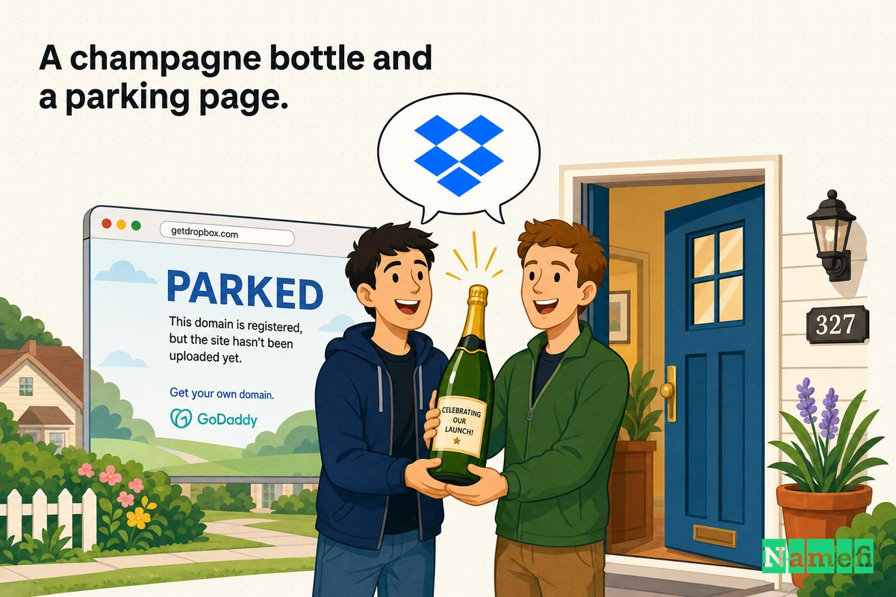
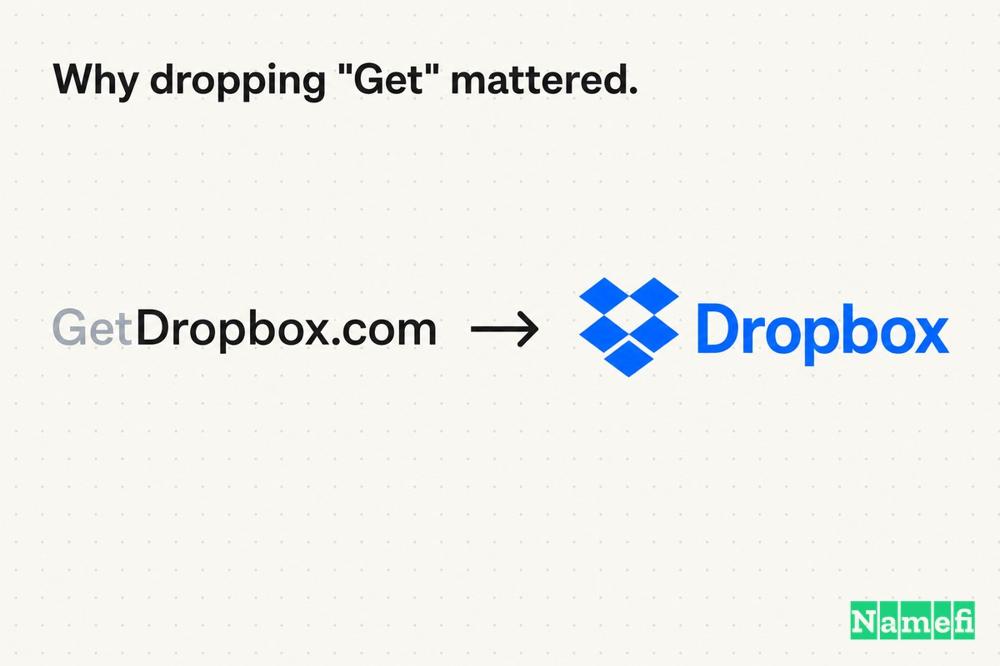
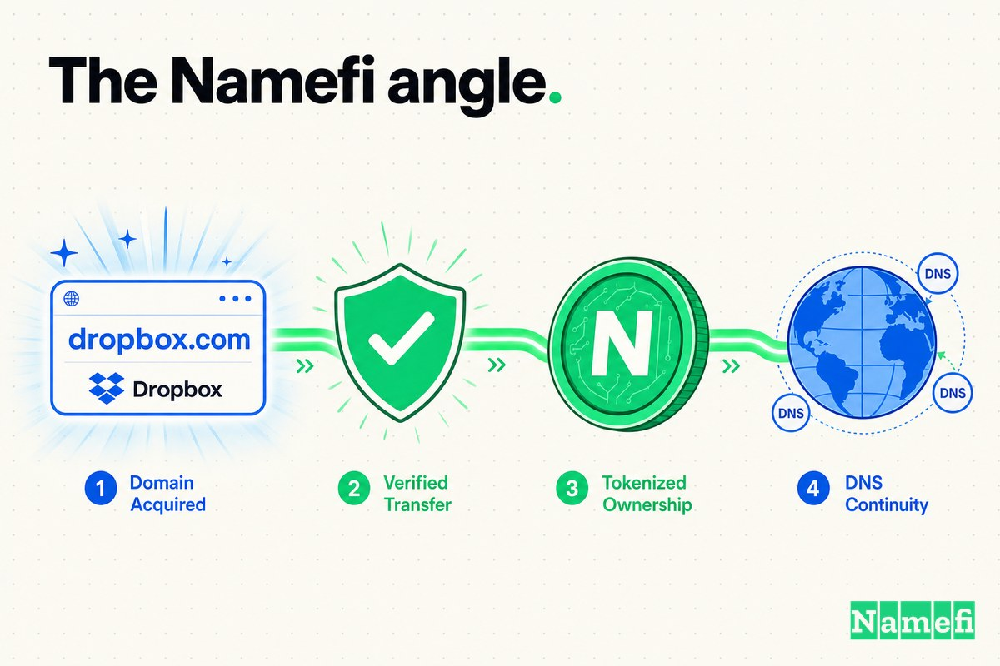

इससे पहले कि Dropbox "क्लाउड में डालो" का पर्याय बनता, वह एक थोड़े लंबे पते पर रहता था: **GetDropbox.com**।

यह नाम एक मजबूरी थी, कोई पसंद नहीं। जब Drew Houston ने Dropbox का Y Combinator आवेदन भरा — वह प्रसिद्ध [YC W07](https://www.ycombinator.com/library/6S-on-starting-and-scaling-dropbox-yc-w07) Winter 2007 बैच — कंपनी का वेब पता पहले से ही [http://www.getdropbox.com/](https://finance.yahoo.com/news/heres-paperwork-drew-houston-filed-112526277.html#:~:text=http%3A%2F%2Fwww.getdropbox.com%2F) था, और वहीं उन्होंने डेमो और इंस्टॉलर होस्ट किया था। आवेदन में समीक्षकों को [getdropbox.com पर एक स्क्रीनकास्ट](https://finance.yahoo.com/news/heres-paperwork-drew-houston-filed-112526277.html#:~:text=getdropbox.com) और उसी डोमेन पर डाउनलोड करने योग्य बिल्ड की ओर भी इशारा किया गया था।

"Get" क्यों? क्योंकि Dropbox.com किसी और के पास था। वह एक्जैक्ट-मैच डोमेन जिसके बारे में सभी *मानते थे* कि कंपनी के पास है, वह किसी और के अकाउंट में पार्क था — और सालों तक पहुंच से बाहर था। तो Dropbox ने वही किया जो अनगिनत स्टार्टअप तब करते हैं जब साफ .com उपलब्ध न हो: आगे एक क्रिया जोड़ी और उत्पाद लॉन्च कर दिया।

अपने शुरुआती, तेजी से बढ़ते दौर में यह काम आया। उत्पाद का विचार Houston की उस अब-प्रसिद्ध परेशानी से आया जो [बोस्टन से न्यूयॉर्क जाने वाली Chinatown बस](https://finance.yahoo.com/news/had-no-idea-become-drew-163000802.html#:~:text=Chinatown%20bus%2C%20forgot%20my%20thumb%20drive) में हुई, जहां वे अपना थंब ड्राइव भूल गए और उन्होंने तय किया कि वे यह समस्या दोबारा नहीं चाहते। समाधान था एक ऐसा फोल्डर जो हर जगह सिंक हो — और एक ऐसा डोमेन जो, "Get" हो या न हो, आपको बताता था कि करना क्या है।

फिर अक्टूबर 2009 में, Dropbox ने आखिरकार **Dropbox.com** खरीद लिया। मालिक ने [नकद में $300,000 लिया](https://domainnamewire.com/2018/09/19/dropbox-domain-name/#:~:text=He%20took%20%24300%2C000%20in%20cash) — उस प्रस्ताव के बदले में जो इसके बजाय स्टॉक भी हो सकता था।

यह कहानी है कि कैसे एक स्टार्टअप ने एक वर्णनात्मक डोमेन पर लॉन्च किया, एक स्क्वाटर और ट्रेडमार्क उलझन से लड़कर एक्जैक्ट मैच हासिल किया, और सीखा कि डोमेन अपग्रेड का सबसे महंगा हिस्सा शायद ही कभी निर्णय होता है — असली चुनौती तो ट्रांसफर है।

## 2007: वह वर्णनात्मक डोमेन जिसने एक उत्पाद को लॉन्च किया

शुरुआत में, "Get" एक बग नहीं, एक फीचर था।

Dropbox की [स्थापना 2007 में MIT के छात्रों Drew Houston और Arash Ferdowsi ने की](https://en.wikipedia.org/wiki/Dropbox#:~:text=Dropbox%20was%20founded%20in%202007%20by%20MIT%20students%20Drew%20Houston%20and%20Arash%20Ferdowsi), [सीड एक्सेलेरेटर Y Combinator से शुरुआती फंडिंग](https://en.wikipedia.org/wiki/Dropbox#:~:text=initial%20funding%20from%20seed%20accelerator%20Y%20Combinator) के साथ। इसके पीछे की कॉर्पोरेट इकाई को तब भी Dropbox नहीं कहा जाता था: [Houston ने मई 2007 में Evenflow, Inc. की स्थापना Dropbox के पीछे की कंपनी के रूप में की](https://en.wikipedia.org/wiki/Dropbox#:~:text=Houston%20founded%20Evenflow%2C%20Inc.%20in%20May%202007%20as%20the%20company%20behind%20Dropbox)।

उत्पाद जानबूझकर सरल था। Houston के अपने आवेदन में इसे सीधे शब्दों में बताया गया था: Dropbox आपकी टीम के कंप्यूटरों में फाइलें स्वचालित रूप से और OS में एकीकृत होकर सिंक करता है। शुरुआती उपयोगकर्ताओं के लिए, एक वर्णनात्मक डोमेन वास्तव में काम करता था:

- "GetDropbox" एक कॉल टू एक्शन की तरह पढ़ा जाता था: यह डाउनलोड करो, बॉक्स लो।
- यह उत्पाद से बिल्कुल मेल खाता था — एक dropbox जो आप *get* कर सकते थे।
- इसे समझाने में कुछ नहीं लगता था, जो तब मायने रखता था जब कंपनी का कोई ब्रांड मूल्य नहीं था।

और महत्वपूर्ण बात, कंपनी के पास वैसे भी साफ वर्जन नहीं हो सकता था। GetDropbox.com कोई ब्रांडिंग की चमक नहीं थी; यह सबसे अच्छा उपलब्ध पता था जब Dropbox.com किसी और के हाथ में था। प्रसिद्ध डेमो वीडियो — वह जिसकी [बीटा वेटिंग लिस्ट रातोरात 5,000 से 75,000 लोगों तक पहुंच गई](https://techcrunch.com/2011/10/19/dropbox-minimal-viable-product/#:~:text=Our%20beta%20waiting%20list%20went%20from%205%2C000%20people%20to%2075%2C000%20people%20literally%20overnight) — ने उस बाढ़ को सीधे GetDropbox.com पर भेजा। वर्णनात्मक डोमेन ने एक वायरल लॉन्च को बखूबी संभाला।

## 2009: वह डोमेन खरीदना जो सबको लगता था पहले से उनका है

2009 तक, GetDropbox.com के पास एक ऐसी समस्या थी जो केवल सफलता पैदा करती है: *बेहतर* पता वहीं था, और सभी मान लेते थे कि Dropbox के पास पहले से है।

था नहीं। जैसा TechCrunch ने उस समय कहा था, [Dropbox सालों से GetDropbox.com का उपयोग कर रहा था](https://techcrunch.com/2009/10/13/dropbox-acquires-the-domain-everyone-thought-it-had-dropbox-com/#:~:text=Dropbox%20has%20been%20using%20the%20domain), जबकि Dropbox.com कहीं और इशारा करता था। एक्जैक्ट-मैच डोमेन पर वास्तविक, आकस्मिक ट्रैफिक आ रहा था — Compete के अनुसार [Dropbox.com पर पिछले महीने लगभग 60,000 यूनीक विजिटर्स](https://techcrunch.com/2009/10/13/dropbox-acquires-the-domain-everyone-thought-it-had-dropbox-com/#:~:text=Dropbox.com%20had%20nearly%2060%2C000%20unique%20visitors%20last%20month) आए — लोग स्पष्ट URL टाइप करके ऐसे पेज पर पहुंच रहे थे जो Dropbox नहीं था।

जब सौदा अक्टूबर 2009 में अंत में बंद हुआ, [Dropbox ने dropbox.com डोमेन $300,000 नकद में हासिल किया](https://en.wikipedia.org/wiki/Timeline_of_Dropbox#:~:text=Dropbox%20acquires%20the%20dropbox.com%20domain%20for%20%24300%2C000%20in%20cash)। वह डोमेन जो कंपनी से ट्रैफिक दूर भेजता था, अब [उसकी वेबसाइट की ओर फॉरवर्ड करने लगा](https://domainnamewire.com/2009/10/14/dropbox-buys-dropbox-com-domain-name/#:~:text=which%20forwards%20to%20its%20web%20site), और उसी महीने, [Evenflow, Inc. का नाम बदलकर Dropbox, Inc. कर दिया गया](https://en.wikipedia.org/wiki/Dropbox#:~:text=Evenflow%2C%20Inc.%20was%20renamed%20Dropbox%2C%20Inc) — कॉर्पोरेट पहचान डोमेन के साथ तालमेल बैठाने लगी।

$300,000 कोई वैनिटी URL नहीं था। यह वह कीमत थी जो उस पते का मालिक बनने के लिए चुकाई गई जिसे उपयोगकर्ता पहले से आपका मानते थे।

## एक शैम्पेन की बोतल और एक पार्किंग पेज: बातचीत

इसमें सालों — और एक मुकदमा — लगने का कारण यह था कि मालिक को बेचना जरूरी नहीं था, और शुरुआत में वे बेचना नहीं चाहते थे।

सालों बाद, Houston ने यह कहानी सीधे सुनाई। Dropbox ने [GetDropbox.com से शुरुआत की लेकिन स्पष्ट रूप से "get" हटाना चाहता था,](https://domainnamewire.com/2018/09/19/dropbox-domain-name/#:~:text=They%20started%20with%20GetDropbox.com%20but%20obviously%20wanted%20to%20drop%20the%20%E2%80%98get%E2%80%99) और संस्थापकों ने पुराने तरीके से एक्जैक्ट मैच की कोशिश की। [डोमेन मालिक द्वारा कई बार मना करने के बाद, Houston और उनके सह-संस्थापक शैम्पेन की बोतल लेकर उस व्यक्ति के घर गए](https://domainnamewire.com/2018/09/19/dropbox-domain-name/#:~:text=Houston%20and%20his%20co-founder%20drove%20to%20the%20guy%E2%80%99s%20house%20with%20a%20bottle%20of%20champagne)। आकर्षण से सौदा नहीं हुआ।

फिर बाजी गलत दिशा में पलट गई। जैसे-जैसे Dropbox बढ़ता गया, मालिक को असली कंपनी के लिए बीटा रिक्वेस्ट आने लगीं, उन्होंने Whois प्राइवेसी जोड़ी, और पेज को विज्ञापनों के साथ पार्क कर दिया। Houston के अनुसार, [विज्ञापन उनके सभी प्रतिस्पर्धियों के थे](https://domainnamewire.com/2018/09/19/dropbox-domain-name/#:~:text=the%20ads%20were%20for%20all%20of%20their%20competitors)। TechCrunch ने भी यही पुष्टि की: प्रतिवादी ने [पेज पर Dropbox के प्रतिस्पर्धियों के विज्ञापन](https://techcrunch.com/2009/10/13/dropbox-acquires-the-domain-everyone-thought-it-had-dropbox-com/#:~:text=ads%20for%20Dropbox%20competitors%20on%20the%20page) दिखाने शुरू कर दिए थे।

इसने एक नामकरण की पसंद को ट्रेडमार्क समस्या में बदल दिया। Justia के रिकॉर्ड दिखाते हैं कि [Evenflow (Dropbox की मूल कंपनी) और Domains by Proxy, Inc. के बीच ट्रेडमार्क विवाद](https://techcrunch.com/2009/10/13/dropbox-acquires-the-domain-everyone-thought-it-had-dropbox-com/#:~:text=trademark%20dispute%20between%20Evenflow) हुआ, और Wikipedia इस युग को स्पष्ट रूप से सारांशित करता है: [Domains by Proxy, Inc. और Evenflow के बीच ट्रेडमार्क विवाद](https://en.wikipedia.org/wiki/Dropbox#:~:text=trademark%20disputes%20between%20Domains%20by%20Proxy%2C%20Inc.%20and%20Evenflow) के कारण, Dropbox का आधिकारिक डोमेन अक्टूबर 2009 तक GetDropbox.com ही रहा। जब Dropbox ने [कानूनी कार्रवाई शुरू की](https://techcrunch.com/2009/10/13/dropbox-acquires-the-domain-everyone-thought-it-had-dropbox-com/#:~:text=after%20Dropbox%20began%20to%20take%20legal%20action), प्राइवेसी शील्ड ने नियंत्रण स्क्वाटर को वापस दे दिया, मुकदमे ने विक्रेता पर दबाव बनाया, और — जैसा Houston ने कहा — इससे [डोमेन बेचने के लिए आगे बातचीत हुई](https://domainnamewire.com/2018/09/19/dropbox-domain-name/#:~:text=That%20led%20to%20further%20discussions%20to%20sell%20the%20domain)।

जो सौदा शैम्पेन से नहीं हो सका, वह मुकदमे से हो गया। और समापन का विवरण वह है जो संस्थापक और विक्रेता दोनों याद रखते हैं: जब बातचीत ने अंततः शर्तें तय कीं, [Dropbox ने नकद या स्टॉक की पेशकश की। उन्होंने $300,000 नकद लिया](https://domainnamewire.com/2018/09/19/dropbox-domain-name/#:~:text=Dropbox%20offered%20him%20cash%20or%20stock.%20He%20took%20%24300%2C000%20in%20cash)। एक पार्क किए डोमेन को होल्ड करने वाले किसी के लिए यह एक तर्कसंगत विकल्प था — निश्चित पैसा लो। सिवाय इसके कि निश्चित पैसा महंगा विकल्प था: Houston ने बाद में नोट किया कि [स्टॉक आज के मूल्यांकन पर "सैकड़ों करोड़" के लायक होता](https://domainnamewire.com/2018/09/19/dropbox-domain-name/#:~:text=the%20stock%20would%20be%20worth%20%E2%80%98hundreds%20of%20millions%E2%80%99)। विक्रेता ने अक्षरों की एक निष्क्रिय श्रृंखला की कीमत लगाई; खरीदार एक ऐसी कंपनी में इक्विटी की पेशकश कर रहा था जो बहु-अरब डॉलर के मूल्यांकन पर IPO करेगी।

## पैसा तब अलग दिखता था

पिछले नजरिए से $300,000 को सस्ता कहना आकर्षक लगता है। Dropbox अरबों की कीमत वाली सार्वजनिक कंपनी बनी, और Dropbox.com उसकी सबसे शांत, स्थायी संपत्तियों में से एक है। उसके सामने, $300,000 एक गोलाई की त्रुटि जैसी लगती है।

लेकिन इसे उस समय के नजरिए से आंका जाना चाहिए जब यह खर्च किया गया था।

2009 के अंत में, Dropbox अभी भी एक युवा स्टार्टअप था जो यह साबित कर रहा था कि वह बढ़ सकता है। इसका Series A मामूली और हाल का था: [अक्टूबर 2008 में Sequoia के नेतृत्व में $6 मिलियन का राउंड, जिसमें Accel ने भी भाग लिया](https://techcrunch.com/2009/11/24/dropbox-sequoia-funding#:~:text=Dropbox%20did%20close%20a%20Series%20A%20funding%20round%2C%20but%20it%20was%20for%20%246%20million)। डोमेन डील के आसपास, कंपनी ने [हाल ही में 3 मिलियन उपयोगकर्ताओं को हासिल किया था, केवल दो महीने बाद 2 मिलियन उपयोगकर्ताओं का आंकड़ा पार करने के](https://techcrunch.com/2009/11/24/dropbox-sequoia-funding#:~:text=They%E2%80%99ve%20also%20recently%20hit%203%20million%20users)। तेजी से बढ़ रही थी, हां — लेकिन अभी भी वेंचर मनी सोच-समझकर खर्च कर रही थी।

उस संदर्भ में, *एक डोमेन नाम* पर $300,000 — इंजीनियर नहीं, सर्वर नहीं, मार्केटिंग नहीं — एक वास्तविक पूंजी-आवंटन निर्णय था। यह तभी समझ आता है जब आप एक्जैक्ट-मैच डोमेन को इंफ्रास्ट्रक्चर मानें: वह पता जिस पर भविष्य के हर साइनअप, प्रेस उल्लेख, और मुंह-जबानी सिफारिश उतरेगी। Dropbox दांव लगा रहा था कि नाम लाखों बार टाइप किया जाएगा, और उन हर कीस्ट्रोक को GetDropbox.com या किसी प्रतिस्पर्धी के पार्किंग पेज के बजाय साफ तरीके से Dropbox.com पर पहुंचना चाहिए।

## "Get" हटाना क्यों मायने रखता था

GetDropbox.com और Dropbox.com के बीच का अंतर एक छोटी-सी क्रिया है। रणनीतिक रूप से, यह एक निर्देश और एक पहचान का अंतर है।

**GetDropbox.com** आपको कुछ करने के लिए कहता है — जाओ उत्पाद लो। **Dropbox.com** बस उत्पाद *है*। एक डाउनलोड लिंक जैसा पढ़ा जाता है; दूसरा एक कंपनी, एक श्रेणी, और अंततः एक क्रिया जैसा।

| पहले | बाद |
| --- | --- |
| GetDropbox.com | Dropbox.com |
| कॉल टू एक्शन की तरह पढ़ा जाता है | ब्रांड की तरह पढ़ा जाता है |
| किसी चीज़ को लाने का संकेत देता है | खुद चीज़ का नाम देता है |
| लॉन्च-युग की संरचना वहन करता है | लॉन्च से परे जाता है |
| गलत टाइप या याद रखना आसान | वह पता जो उपयोगकर्ता पहले से अनुमान लगाते हैं |

यही पैटर्न डोमेन अपग्रेड में बार-बार दिखता है: शुरुआती नाम *समझाते* या *निर्देश देते* हैं, महान नाम *स्वामित्व* जमाते हैं। "Get," "The," या "Motors" जैसा एक संशोधक एक बिल्कुल उचित ऑन-रैंप है जब एक्जैक्ट मैच लिया हुआ हो या कंपनी अभी अनजान हो। अपग्रेड तब फल देता है जब ब्रांड इतना मजबूत हो कि नाम बस श्रेणी होना चाहिए — और जब कंपनी अंततः साफ डोमेन हासिल कर सके।

Dropbox के लिए, "Get" कभी सपना नहीं था; Houston ने कहा कि वे [स्पष्ट रूप से "get" हटाना चाहते थे।](https://domainnamewire.com/2018/09/19/dropbox-domain-name/#:~:text=obviously%20wanted%20to%20drop%20the%20%E2%80%98get%E2%80%99) यह पहले दिन से ही एक ढांचा था, जो केवल इसलिए रखा गया क्योंकि बेहतर पता बंद था।

## डोमेन कंपनी के साथ तालमेल बैठा गया

यहां का क्रम ही सब कुछ बताता है। डोमेन और कॉर्पोरेट पहचान एक साथ, एक ही महीने में बदले।

Dropbox ने अपने पहले दो साल **Evenflow, Inc.** के रूप में GetDropbox.com पर Dropbox नाम का उत्पाद चलाते हुए बिताए — कानूनी नाम, उत्पाद नाम, और वेब पते के बीच तीन-तरफा बेमेल। अक्टूबर 2009 के अधिग्रहण ने तीनों को एक साथ सुलझाया: कंपनी ने Dropbox.com हासिल किया, उसे लाइव उत्पाद से जोड़ा, और [Evenflow, Inc. का नाम बदलकर Dropbox, Inc. किया](https://en.wikipedia.org/wiki/Dropbox#:~:text=Evenflow%2C%20Inc.%20was%20renamed%20Dropbox%2C%20Inc)।

विकल्प की कल्पना करें: Dropbox, Inc. नाम की कंपनी जिसका कैनोनिकल वेब पता अभी भी GetDropbox.com है, जबकि Dropbox.com उसके प्रतिस्पर्धियों के विज्ञापन दिखाता है। ब्रांड पूरी तरह तब तक नहीं जुड़ सकता जब तक डोमेन नहीं जुड़ता। धीरे-धीरे, बाहरी स्वामित्व में, मुकदमेबाजी से — वह हिस्सा जो डोमेन था — साफ पहचान लॉक होने से पहले सुरक्षित होना जरूरी था।

इसीलिए अपग्रेड सतही नहीं था। यह वह क्षण था जब उत्पाद का नाम, कंपनी का नाम, और पता अंततः एक ही शब्द बन गए।

## डोमेन ऑपरेटिंग सिस्टम का हिस्सा बन गया

प्रीमियम डोमेन प्रतिष्ठा के बारे में नहीं हैं। वे दोहराव के बारे में हैं।

किसी कंपनी का मुख्य डोमेन ऐसी जगहों पर दिखता है जिन पर मार्केटिंग टीम सीधे नियंत्रण नहीं रखती:

- डेस्कटॉप क्लाइंट में और हर "आपकी फाइलें Dropbox में हैं" प्रॉम्प्ट में।
- ईमेल पतों और कर्मचारी हस्ताक्षरों में।
- प्रेस हेडलाइन, App Store लिस्टिंग, और विश्लेषक रिपोर्टों में।
- सर्च रिजल्ट और ब्राउजर बार में।
- एक उपयोगकर्ता से दूसरे को हर मौखिक सिफारिश में।

उन हर दोहरावों में से प्रत्येक या तो घर्षण जोड़ता है या हटाता है। GetDropbox.com ने हर उल्लेख को थोड़ा लंबा, थोड़ा ज्यादा निर्देशात्मक, थोड़ा ज्यादा "Dropbox.com" के रूप में गलत टाइप होने की संभावना वाला बनाया — जो अक्टूबर 2009 तक उपयोगकर्ता को प्रतिस्पर्धी के पार्किंग पेज पर भेजता था। Dropbox.com ने हर उल्लेख को छोटा, सटीक, और स्व-सुधारक बनाया: वह पता जो लोग *पहले से अनुमान लगाते थे* अब असली चीज़ पर पहुंचाने लगा।

इसे लाखों उपयोगकर्ताओं द्वारा स्पष्ट URL टाइप करने से गुणा करें — वही उपयोगकर्ता जो पहले से [एक महीने में लगभग 60,000 विज़िट](https://techcrunch.com/2009/10/13/dropbox-acquires-the-domain-everyone-thought-it-had-dropbox-com/#:~:text=Dropbox.com%20had%20nearly%2060%2C000%20unique%20visitors%20last%20month) उस डोमेन पर कर रहे थे जो Dropbox के पास था ही नहीं — और $300,000 विलासिता नहीं लगता। यह ड्रैग में एक स्थायी कमी जैसा लगता है, साथ में उस ट्रैफिक की वापसी जो कंपनी हर एक दिन खो रही थी।

## संस्थापकों को केस 6 से क्या सीखना चाहिए

आसान निष्कर्ष — "पहले दिन ही अपना एक्जैक्ट-मैच .com खरीदो" — गलत है। Dropbox *नहीं कर सकता था*; डोमेन लिया हुआ था और मालिक बेचना नहीं चाहता था। अधिक उपयोगी सबक चरणबद्धता के बारे में हैं:

1. **एक वर्कअराउंड डोमेन पर लॉन्च करना ठीक है।** GetDropbox.com ने एक वायरल डेमो, एक YC बैच, एक Series A, और तीन मिलियन उपयोगकर्ताओं को संभाला। "Get," "The," या "App" संशोधक कोई विफलता नहीं है — यह एक उचित ऑन-रैंप है जब साफ मैच उपलब्ध न हो।
2. **वह क्षण देखें जब वर्कअराउंड आपको नुकसान पहुंचाने लगे।** अपग्रेड का संकेत सौंदर्यशास्त्र नहीं था। यह Dropbox.com पर लीक हो रहा ट्रैफिक, किसी अजनबी के इनबॉक्स में पहुंचने वाली बीटा रिक्वेस्ट, और उस पते पर प्रतिस्पर्धी के विज्ञापन थे जिसे उपयोगकर्ता आपका मानते थे।
3. **एक्जैक्ट-मैच डोमेन को इंफ्रास्ट्रक्चर मानें, और ट्रांसफर को कठिन हिस्सा मानने की उम्मीद रखें।** "Get" हटाने का निर्णय आसान था। शैम्पेन, सालों का "नहीं," Whois प्राइवेसी, एक पार्किंग पेज, और एक ट्रेडमार्क मुकदमा — यह वास्तविक लागत थी।
4. **पहचान को एकजुट करने से पहले डोमेन सुरक्षित करें।** Dropbox ने Evenflow का नाम बदलकर Dropbox, Inc. किया *उसी महीने* जब उसे Dropbox.com मिला — क्योंकि कॉर्पोरेट पहचान एक दोपहर में बदल सकती है, लेकिन डोमेन में मुकदमा लग सकता है।

डोमेन अपग्रेड ने Dropbox को नहीं जिताया। उत्पाद, समय, वायरल डेमो, और निष्पादन कहीं अधिक मायने रखते थे। लेकिन Dropbox.com ने कंपनी के नाम, उत्पाद, और पते को आखिरकार एक-दूसरे से सहमत कराया — और ब्रांड को अपने प्रतिस्पर्धियों को ट्रैफिक लीक करने से रोका।

## Namefi का कोण

Dropbox की कहानी, मूलतः, एक ट्रांसफर समस्या है।

रणनीतिक निर्णय कभी वास्तव में संदेह में नहीं था — निश्चित रूप से Dropbox नाम की कंपनी को Dropbox.com का मालिक होना चाहिए। कठिन हिस्सा संपत्ति के आसपास की हर चीज़ थी: Whois प्राइवेसी के पीछे छुपे मालिक को ढूंढना, मना किया जाना, उसके घर तक जाना, डोमेन को प्रतिस्पर्धी विज्ञापनों से हथियार बनते देखना, बातचीत के लिए दबाव बनाने को मुकदमा दाखिल करना, कोई सार्वजनिक तुलनीय मूल्य न होते हुए कीमत पर सहमत होना, और एक जीवित, तेजी से बढ़ते उत्पाद को बाधित किए बिना नियंत्रण स्थानांतरित करना। सालों की मेहनत अपग्रेड *तय करने* में नहीं, बल्कि अपग्रेड को सुरक्षित रूप से *क्रियान्वित करने* में गई।

[Namefi](https://namefi.io) इस विचार के आधार पर बनाया गया है कि डोमेन इंटरनेट-नेटिव संपत्तियों की तरह व्यवहार करने चाहिए। टोकनाइज्ड स्वामित्व डोमेन नियंत्रण को सत्यापित करना, स्थानांतरित करना, और आधुनिक वर्कफ्लो में एकीकृत करना आसान बना सकता है, जबकि DNS के साथ संगत रहता है — इस तरह के सौदे के सबसे जटिल हिस्सों (यह साबित करना कि प्राइवेसी-शील्डेड डोमेन पर वास्तव में कौन नियंत्रण रखता है, और उसे सुरक्षित रूप से स्थानांतरित करना) को एक साफ, ऑडिट करने योग्य लेनदेन के करीब बनाता है।

Dropbox.com आज अनिवार्य लगता है क्योंकि Dropbox बहुत बड़ा बन गया। लेकिन सबक उस पैमाने से बहुत पहले स्पष्ट होता है: जब एक नाम व्यवसाय को वहन करने वाला है, तो डोमेन सजावट नहीं है। यह ब्रांड का वह हिस्सा है जो एक मुकदमे, शैम्पेन की एक बोतल, और $300,000 के लायक है — ताकि इसे अंततः सही किया जा सके।

## स्रोत और आगे पढ़ने के लिए

- Y Combinator — [Dropbox शुरू करने और स्केल करने पर (YC W07)](https://www.ycombinator.com/library/6S-on-starting-and-scaling-dropbox-yc-w07)
- Yahoo Finance / Business Insider — [यह Drew Houston का 2007 का Y Combinator Dropbox के लिए आवेदन है](https://finance.yahoo.com/news/heres-paperwork-drew-houston-filed-112526277.html#:~:text=http%3A%2F%2Fwww.getdropbox.com%2F)
- Yahoo Finance — [Dropbox के संस्थापक बताते हैं कि उनका $10 बिलियन का स्टार्टअप Chinatown बस पर कैसे बना](https://finance.yahoo.com/news/had-no-idea-become-drew-163000802.html#:~:text=Chinatown%20bus%2C%20forgot%20my%20thumb%20drive)
- TechCrunch — [Dropbox ने वह डोमेन हासिल किया जो सबको लगता था उसके पास है: Dropbox.com](https://techcrunch.com/2009/10/13/dropbox-acquires-the-domain-everyone-thought-it-had-dropbox-com/#:~:text=Dropbox%20has%20been%20using%20the%20domain)
- TechCrunch — [Dropbox ने अक्टूबर 2008 में $6 मिलियन का Sequoia-नेतृत्व Series A उठाया](https://techcrunch.com/2009/11/24/dropbox-sequoia-funding#:~:text=Dropbox%20did%20close%20a%20Series%20A%20funding%20round%2C%20but%20it%20was%20for%20%246%20million)
- TechCrunch — [Dropbox कैसे Minimal Viable Product के रूप में शुरू हुआ](https://techcrunch.com/2011/10/19/dropbox-minimal-viable-product/#:~:text=Our%20beta%20waiting%20list%20went%20from%205%2C000%20people%20to%2075%2C000%20people%20literally%20overnight)
- Domain Name Wire — [Dropbox ने Dropbox.com डोमेन नाम कैसे पाया](https://domainnamewire.com/2018/09/19/dropbox-domain-name/#:~:text=He%20took%20%24300%2C000%20in%20cash)
- Domain Name Wire — [Dropbox ने Dropbox.com डोमेन नाम खरीदा](https://domainnamewire.com/2009/10/14/dropbox-buys-dropbox-com-domain-name/#:~:text=which%20forwards%20to%20its%20web%20site)
- Wikipedia — [Dropbox](https://en.wikipedia.org/wiki/Dropbox#:~:text=trademark%20disputes%20between%20Domains%20by%20Proxy%2C%20Inc.%20and%20Evenflow)
- Wikipedia — [Dropbox की समयरेखा](https://en.wikipedia.org/wiki/Timeline_of_Dropbox#:~:text=Dropbox%20acquires%20the%20dropbox.com%20domain%20for%20%24300%2C000%20in%20cash)
- Hacker News — [चर्चा: Dropbox ने वह डोमेन हासिल किया जो सबको लगता था उसके पास है](https://news.ycombinator.com/item?id=880522)
