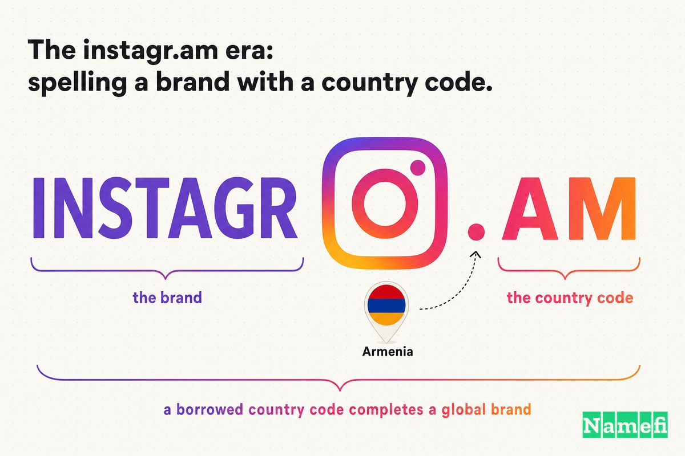
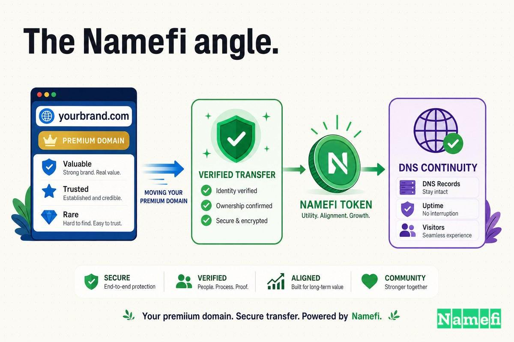

इससे पहले कि Instagram एक अरब उपयोगकर्ताओं का प्लेटफ़ॉर्म, तस्वीरें लेने की क्रिया, और फेसबुक द्वारा खरीदे गए सबसे मूल्यवान ऐप्स में से एक बने, उसका एक ऐसा नाम था जो चतुर इंजीनियरिंग का भी एक टुकड़ा था: **instagr.am**।

वह पता न तो कोई टाइपिंग की गलती थी और न ही कोई रीडायरेक्ट ट्रिक। यह एक *डोमेन हैक* था — एक डोमेन नाम जहाँ एक्सटेंशन स्वयं ही शब्द को पूरा करता है। विकिपीडिया इस रूप को सटीक रूप से परिभाषित करता है: एक डोमेन हैक वह होता है [जो किसी शब्द, वाक्यांश या नाम को उस डोमेन के दो या अधिक आसन्न स्तरों को जोड़कर सुझाता है](https://en.wikipedia.org/wiki/Domain_hacks#:~:text=a%20domain%20name%20that%20suggests%20a%20word%2C%20phrase%2C%20or%20name), और वह Instagram के उदाहरण को एक पाठ्यपुस्तक मामले के रूप में नामित करता है: [instagr.am फोटो-शेयरिंग सेवा "Instagram" का नाम स्पेल करने के लिए ccTLD .am (आर्मेनिया) का उपयोग करता है](https://en.wikipedia.org/wiki/Domain_hacks#:~:text=instagr.am%20makes%20use%20of%20the%20ccTLD%20.am%20%28Armenia%29%20to%20spell%20the%20name)।

इसे फिर से पढ़ें। अपना ही ब्रांड स्पेल करने के लिए, एक सैन फ्रांसिस्को फोटो ऐप ने **आर्मेनिया** के कंट्री-कोड टॉप-लेवल डोमेन को उधार लिया — एक देश जो लगभग 7,000 मील दूर है। Instagram में "am" तकनीकी रूप से येरेवन में रहता था।

एक भीड़ भरे App Store में लॉन्च कर रहे एक छोटे स्टार्टअप के लिए, यह हैक एक वरदान था। यह छोटा था, एकदम सटीक था, एक शब्द की तरह पढ़ा जाता था, और — सबसे महत्वपूर्ण — यह *उपलब्ध* था जब स्पष्ट पता, Instagram.com, नहीं था।

लेकिन एक उधार का कंट्री कोड एक उधार की नींव है। लॉन्च के कुछ महीनों के भीतर, Instagram ने चुपचाप जाकर असली चीज़ खरीद ली। कंपनी ने [जनवरी 2011 में डोमेन के लिए $100,000 चुकाने का निर्णय किया](http://domainincite.com/19813-instagram-paid-chinese-cyberquatter-100000-for-instagram-com-facebook-lawsuit-reveals#:~:text=made%20the%20decision%20to%20pay%20%24100%2C000%20for%20the%20domain%20in%20January%202011), और **Instagram.com** पर एकीकृत हो गई — इससे पहले कि दुनिया के अधिकांश लोगों ने यह नाम भी सुना हो।

यह स्टार्टअप इतिहास के सबसे चतुर लॉन्च डोमेन की कहानी है — और उस कंपनी ने इसे क्यों नहीं रखा जिसने इसे बनाया था।

## अक्टूबर 2010: वह लॉन्च जो अपनी सफलता के बोझ तले दब गया

Instagram एक पिवट से निकला था। Kevin Systrom और Mike Krieger एक लोकेशन-बेस्ड चेक-इन ऐप बना रहे थे जिसे Burbn कहा जाता था; जब उन्होंने इसे फोटो, फिल्टर और शेयरिंग तक सीमित कर दिया, तो आधुनिक ऐप उभरा। विकिपीडिया के अनुसार, [Instagram को iOS के लिए अक्टूबर 2010 में Kevin Systrom और ब्राज़ीलियाई सॉफ्टवेयर इंजीनियर Mike Krieger द्वारा लॉन्च किया गया था](https://en.wikipedia.org/wiki/Instagram#:~:text=Instagram%20was%20launched%20for%20iOS%20in%20October%202010%20by%20Kevin%20Systrom%20and%20the%20Brazilian%20software%20engineer%20Mike%20Krieger)। एक बाद के डोमेन विवाद के लिए [WIPO](/hi/glossary/wipo/) रिकॉर्ड सटीक तिथि तय करता है: [Instagram को 6 अक्टूबर 2010 को लॉन्च किया गया था](https://www.wipo.int/amc/en/domains/decisions/text/2014/d2014-1550.html#:~:text=Instagram%20was%20launched%20on%20October%206%2C%202010)।

स्वागत तत्काल और अभूतपूर्व था। विकिपीडिया की समयरेखा दर्ज करती है कि [लॉन्च के दिन 25,000 से अधिक उपयोगकर्ताओं ने पंजीकरण किया, और लॉन्च के बाद कुछ ही दिनों में 100,000 से अधिक](https://en.wikipedia.org/wiki/Timeline_of_Instagram#:~:text=Over%2025%2C000%20users%20registered%20on%20launch%20day)। Entrepreneur का इतिहास बताता है कि Systrom और Krieger ने एक दिन पहले केवल [80 प्रारंभिक उपयोगकर्ताओं](https://www.entrepreneur.com/science-technology/how-instagram-went-from-idea-to-1-billion-in-less-than-two/223310#:~:text=launch%20the%20Instagram%20photo-sharing%20iPhone%20app%20with%2080%20initial%20users) के साथ लॉन्च किया था — और कुछ ही घंटों में ट्रैफ़िक के कारण [साइट कई बार क्रैश हो गई](https://www.entrepreneur.com/science-technology/how-instagram-went-from-idea-to-1-billion-in-less-than-two/223310#:~:text=The%20site%20crashed%20multiple%20times)। वृद्धि रुकी नहीं: Instagram [दो महीनों में 10 लाख पंजीकृत उपयोगकर्ताओं तक और एक साल में 1 करोड़ तक पहुँच गया](https://en.wikipedia.org/wiki/Instagram#:~:text=reaching%201%20million%20registered%20users%20in%20two%20months%2C%2010%20million%20in%20a%20year), और [सितंबर 2011 के नए डिज़ाइन ने नए और लाइव फिल्टर जोड़े](https://en.wikipedia.org/wiki/Instagram#:~:text=In%20September%202011%2C%20a%20new%20version%20of%20the%20app%20included%20new%20and%20live%20filters) जिसने सौंदर्यशास्त्र को पक्का किया।

उस सभी विस्फोटक शुरुआती अपनाने के दौरान, लोग जो ब्रांड टाइप करते और शेयर करते थे वह instagr.am था।

## instagr.am का युग: एक कंट्री कोड के साथ एक ब्रांड की स्पेलिंग

यह समझने के लिए कि instagr.am इतना आकर्षक क्यों था, आपको यह समझना होगा कि `.am` वास्तव में क्या है। यह कोई सामान्य एक्सटेंशन नहीं है। विकिपीडिया के अनुसार, `.am` [आर्मेनिया के लिए इंटरनेट कंट्री कोड टॉप-लेवल डोमेन (ccTLD) है](https://en.wikipedia.org/wiki/.am#:~:text=the%20internet%20country%20code%20top-level%20domain), जिसे 1994 में पेश किया गया और [ISOC-AM, इंटरनेट सोसायटी के स्थानीय अध्याय द्वारा संचालित](https://en.wikipedia.org/wiki/.am#:~:text=operated%20by%20ISOC-AM%2C%20the%20local%20chapter%20of%20the%20Internet%20Society) किया जाता है। यह ब्रांडिंग के रूप में काम करने का कारण उदार पंजीकरण नीति और उपयोगी अंत है: [दुनिया में कोई भी व्यक्ति .am](https://en.wikipedia.org/wiki/.am#:~:text=any%20person%20in%20the%20world%20can%20register%20a%20.am) डोमेन पंजीकृत कर सकता है, और एक्सटेंशन को ["am" में समाप्त होने वाले अंग्रेजी शब्द बनाने की क्षमता](https://en.wikipedia.org/wiki/.am#:~:text=the%20ability%20to%20form%20English%20words%20ending%20in%20%22am%22) के लिए सराहा जाता है। Instagram अच्छी संगति में था; उसी विकिपीडिया पृष्ठ पर स्ट्रीमिंग सेवा Stre.am और संगीतकार will.i.am जैसे साथी `.am` हैक्स सूचीबद्ध हैं।

2010 के स्टार्टअप के लिए, आकर्षण स्पष्ट था:

- **यह एकदम सटीक था।** "instagr" + "[.am](/hi/tld/am/)" पूर्ण ब्रांड की तरह पढ़ा जाता है, बिना कुछ अतिरिक्त समझाने की ज़रूरत के — बिना फंडिंग के लॉन्च का सबसे महत्वपूर्ण लक्ष्य।
- **यह छोटा और शेयर करने योग्य था।** एक फोटो ऐप इस बात पर निर्भर करता है कि लिंक कितनी आसानी से पास होती है। instagr.am प्रिंट, टेक्स्ट और ट्वीट करने के लिए काफी संक्षिप्त था।
- **यह अभी उपलब्ध था।** Instagram.com पहले से किसी और के पास थी, और एक बिल्कुल नए ऐप के पास न तो पहले दिन इसे छुड़ाने के लिए पैसे थे और न ही प्रभाव।

हैक ने Instagram को *ऐसा लगने दिया* जैसे वह अपने सटीक-मिलान वाले नाम का मालिक है — वास्तव में उसका मालिक बनने से बहुत पहले। यही पूरी चाल थी — और जब कंपनी छोटी थी तब यह बखूबी काम किया।

समस्या यह है कि एक उधार की नींव का क्या मूल्य है एक बार जब आप छोटे नहीं रहते।

## एक चतुर ccTLD हैक में पकड़

एक कंट्री कोड पर बना डोमेन हैक शांत निर्भरताओं का एक समूह लेकर चलता है जो एक साधारण `.com` में नहीं होती।

पहला, **आप किसी और के नेमस्पेस में मेहमान हैं।** `.am` की नीतियाँ, मूल्य निर्धारण और स्थिरता आर्मेनिया की [रजिस्ट्री](/hi/glossary/registry/) द्वारा निर्धारित होती हैं, आपके द्वारा नहीं। यह तब तक ठीक है जब तक आपका ब्रांड अरबों का न हो और आपका पता दुनिया के दूसरी तरफ की रजिस्ट्री को जवाब देता हो।

दूसरा, **हैक एक टाइपो की तरह पढ़ा जा सकता है।** "instagr.am" एक आकस्मिक उपयोगकर्ता को गलत टाइप किए गए "instagram" की तरह लगता है। लोग बिंदु छोड़ देते हैं, `.com` मान लेते हैं, और आदतन "instagram.com" टाइप करते हैं — जिसका अर्थ है कि हर शेयर ट्रैफ़िक उस व्यक्ति को लीक करती है जो स्पष्ट पते का मालिक है।

तीसरा — और यह वह हिस्सा है जिसे संस्थापक कम आंकते हैं — **जब तक कोई और उसे रखता था, तब तक स्पष्ट पता एक देनदारी था।** जबकि Instagram instagr.am पर बढ़ रहा था, Instagram.com एक पार्किंग पेज था। WIPO के बाद के रिकॉर्ड में नोट किया गया है कि [22 जनवरी 2011 तक, instagram.com से जुड़ी वेबसाइट एक पार्किंग पेज की ओर इशारा कर रही थी जो शिकायतकर्ता की सेवाओं जैसे फोटो और iPhone ऐप्स से संबंधित लिंक प्रदर्शित करती थी](https://www.wipo.int/amc/en/domains/decisions/text/2014/d2014-1550.html#:~:text=by%20January%2022%2C%202011%2C%20the%20website%20connected%20to)। दूसरे शब्दों में, एक तीसरा पक्ष Instagram के अपने नाम और गति से कमाई कर रहा था।

डोमेन-इतिहास के लेख उसी सबक पर पहुँचते हैं। एक पूर्वावलोकन Bloomberg Businessweek का हवाला देते हुए बताता है कि शुरुआती Instagram में वास्तविक कंपनी के उपकरणों का अभाव था — [यहाँ तक कि एक स्थायी वेब पता भी नहीं, क्योंकि यह अभी भी instagr.am का उपयोग कर रहा था](https://www.domaingravity.com/instagr.am-Instagram.com.htm#:~:text=not%20even%20a%20permanent%20web%20address%20since%20it%20was%20still%20using%20instagr.am) — और निष्कर्ष निकालता है कि इस तरह के हैक आमतौर पर [द्वितीयक URL](https://www.domaingravity.com/instagr.am-Instagram.com.htm#:~:text=secondary%20URLs) होने चाहिए, जिसमें उच्चारण योग्य, डिफ़ॉल्ट-टाइप किया गया `.com` वास्तविक घर के रूप में हो।

एक चतुर हैक एक बेहतरीन सामने का दरवाज़ा है। यह एक स्थायी पते के रूप में ज़ोखिम भरा है।

## उस समय पैसे अलग तरह से दिखते थे

$100,000 का मूल्यांकन कहानी के अंत से करना लुभावना है, जहाँ Instagram दसियों अरबों का है और एकदम-सटीक `.com` के लिए एक लाख डॉलर एक छोटी राशि लगती है।

लेकिन जनवरी 2011 पर वापस जाएं। Instagram कुछ महीने पुराना था। उसके पास एक हिट ऐप और एक क्रैश-प्रवण सर्वर था, लेकिन कोई राजस्व नहीं, एक छोटी टीम, और एक ऐसा भविष्य जो एक ऐसे बाज़ार में बिल्कुल भी गारंटीशुदा नहीं था जहाँ फोटो ऐप साप्ताहिक रूप से आते और जाते थे। उस पृष्ठभूमि के विरुद्ध, एक डोमेन के लिए $100,000 नकद — जब आपके पास instagr.am पर एक काम करने वाला पता पहले से ही था — एक वास्तविक आवंटन निर्णय था, कोई स्पष्ट निर्णय नहीं।

और सौदा स्वयं भी साफ नहीं था। एक बाद के Facebook मुकदमे की रिपोर्टिंग ने खुलासा किया कि विक्रेता एक चीनी पंजीयक था; [खरीद Sedo द्वारा संसाधित की गई थी, सौदे की एक प्रति के अनुसार जो साक्ष्य के रूप में दायर की गई थी](http://domainincite.com/19813-instagram-paid-chinese-cyberquatter-100000-for-instagram-com-facebook-lawsuit-reveals#:~:text=The%20purchase%20was%20processed%20by%20Sedo%2C%20according%20to%20a%20copy%20of%20the%20deal)। वर्षों बाद यह लेनदेन गंभीर हो गया: जैसा कि एक रिपोर्ट में कहा गया, [Murong की माँ और बहनें चीन में उसके और Instagram के खिलाफ मुकदमा कर रही हैं, यह दावा करते हुए कि उसके पास डोमेन बेचने का अधिकार नहीं था](http://domainincite.com/19813-instagram-paid-chinese-cyberquatter-100000-for-instagram-com-facebook-lawsuit-reveals#:~:text=Murong%27s%20mother%20and%20sisters%20are%20suing%20her%20and%20Instagram%20in%20China)। Instagram ने अपना नाम खरीदा था — और फिर भी यह मुकदमेबाजी में फँस गया कि वास्तव में किसका क्या था।

यही लगभग हर प्रीमियम-डोमेन कहानी के पीछे का अस्वाभाविक सच है: रणनीतिक निर्णय ("हमें Instagram.com का मालिक होना चाहिए") आसान हिस्सा है। स्वच्छ स्वामित्व सिद्ध करना और संपत्ति को सुरक्षित रूप से स्थानांतरित करना कठिन हिस्सा है।

## Instagram.com पर जाना क्यों मायने रखता था

instagr.am और Instagram.com के बीच का अंतर एक बिंदु और दो अक्षर है। रणनीतिक रूप से, यह अपना नाम किराए पर लेने और उसके मालिक होने के बीच का अंतर है।

**instagr.am** आर्मेनिया के नेमस्पेस में एक चतुर मेहमान है — एकदम सटीक, लेकिन उधार लिया हुआ, आसानी से गलत टाइप होने वाला, और हमेशा के लिए उस `.com` से प्रतिस्पर्धा करता है जिसे लोग सहजता से टाइप करते हैं। **Instagram.com** डिफ़ॉल्ट गंतव्य है, वह पता जिसे किसी स्पष्टीकरण की ज़रूरत नहीं, वह जो अपने ब्रांड के ट्रैफ़िक को लीक करने के बजाय कैप्चर करता है।

| पहले | बाद में |
| --- | --- |
| instagr.am | Instagram.com |
| आर्मेनिया के `.am` कंट्री कोड को उधार लेता है | वैश्विक डिफ़ॉल्ट `.com` का मालिक है |
| नीतियाँ एक विदेशी रजिस्ट्री द्वारा निर्धारित | कंपनी द्वारा स्वयं नियंत्रित |
| एक संभावित टाइपो की तरह पढ़ा जाता है | प्रामाणिक ब्रांड की तरह पढ़ा जाता है |
| ट्रैफ़िक उसे लीक करता है जो instagram.com का मालिक है | उस ट्रैफ़िक को कैप्चर करता है जो उपयोगकर्ता सहजता से टाइप करते हैं |
| एक चतुर सामने का दरवाज़ा | एक स्थायी घर |

यह वही पैटर्न है जो डोमेन अपग्रेड में बार-बार दिखता है: शुरुआती नाम (और शुरुआती हैक) *समझाते* और *सुधार करते* हैं; महान डोमेन *मालिक होते* हैं। हैक उस कंपनी के लिए परफेक्ट ऑन-रैम्प था जिसे अपने से बड़ा दिखने की ज़रूरत थी। `.com` वह था जिसकी उसे ज़रूरत थी एक बार जब वह वास्तव में हैक से बड़ी हो गई।

## समय: हैक के पक्के होने से पहले अपग्रेड करें

घटनाओं का क्रम ही शिक्षाप्रद हिस्सा है। Instagram ने अपना पता ठीक करने के लिए प्रसिद्ध होने तक इंतज़ार नहीं किया। ऐप अक्टूबर 2010 में लॉन्च हुआ; कंपनी [जनवरी 2011](http://domainincite.com/19813-instagram-paid-chinese-cyberquatter-100000-for-instagram-com-facebook-lawsuit-reveals#:~:text=made%20the%20decision%20to%20pay%20%24100%2C000%20for%20the%20domain%20in%20January%202011) तक Instagram.com पर चली गई — लगभग एक तिमाही में, जब यह अभी भी अपने पहले लाखों उपयोगकर्ताओं के माध्यम से दौड़ रही थी।

वह समय ही सबक है। कैनोनिकल डोमेन *इतनी जल्दी खरीदें कि साफ़ संस्करण अभी भी वह बन सके जिसे दुनिया याद रखे*, लेकिन *इतनी देर से कि आप वास्तव में जानते हों कि ब्रांड इसके लायक है*। अपने पहले महीनों में जाने से, Instagram ने यह सुनिश्चित किया कि जैसे-जैसे वह बढ़ती गई — [दो महीनों में 10 लाख उपयोगकर्ताओं तक और एक साल में 1 करोड़ तक](https://en.wikipedia.org/wiki/Instagram#:~:text=reaching%201%20million%20registered%20users%20in%20two%20months%2C%2010%20million%20in%20a%20year) — उन उपयोगकर्ताओं ने जो पता सीखा, लिंक किया और टाइप किया वह Instagram.com था, न कि हैक।

जब तक Facebook पहुँचा — [9 अप्रैल 2012 को, Facebook, Inc. (अब Meta Platforms) ने Instagram को $1 बिलियन नकद और स्टॉक में खरीदा](https://en.wikipedia.org/wiki/Instagram#:~:text=On%20April%209%2C%202012%2C%20Facebook%2C%20Inc.%20%28now%20Meta%20Platforms%29%20bought%20Instagram%20for%20%241%20billion) — वह ब्रांड जो वह खरीद रहा था वह एक `.com` पर रहता था जिसे कंपनी पूरी तरह नियंत्रित करती थी, न कि एक कंट्री कोड जिसे वह केवल किराए पर लेती थी।

## डोमेन ऑपरेटिंग सिस्टम का हिस्सा बन गया

प्रीमियम डोमेन प्रतिष्ठा के बारे में नहीं हैं। वे दोहराव के बारे में हैं।

एक कोर डोमेन उन जगहों पर दिखाई देता है जहाँ मार्केटिंग टीम सीधे कभी नहीं छूती:

- हर शेयर की गई फोटो लिंक और एम्बेड में।
- प्रेस हेडलाइन और App Store लिस्टिंग में।
- ईमेल पतों और कर्मचारी हस्ताक्षरों में।
- खोज परिणामों और ब्राउज़र एड्रेस बार में।
- हर बोली गई सिफारिश में — "इसे Instagram पर डालो" — एक व्यक्ति से दूसरे तक पहुँचती है।

इनमें से हर दोहराव या तो घर्षण जोड़ता है या हटाता है। instagr.am ने लोगों से एक असामान्य जगह पर एक असामान्य बिंदु याद रखने के लिए कहा, और `.com` टाइप करने के सहज आवेग का विरोध करने के लिए। Instagram.com ने कुछ नहीं माँगा। यह *सहज आवेग ही* था।

हैक ने Instagram की वृद्धि नहीं बनाई — फिल्टर, समय, और iPhone कैमरे ने बनाई। लेकिन एक बार Instagram.com पता बन जाने के बाद, नाम का हर भविष्य का दोहराव एक ऐसी नींव पर जुड़ता गया जिसकी कंपनी वास्तव में मालिक थी, बिना किसी उधार कंट्री कोड को समझाने के और बिना किसी पार्किंग पेज के जो उसके ट्रैफ़िक को स्किम कर रहा हो।

## संस्थापकों को Case 11 से क्या सीखना चाहिए

आसान निष्कर्ष — "डोमेन हैक कभी उपयोग न करें" — गलत है। हैक *अच्छा* था। अधिक उपयोगी सबक इस बारे में हैं कि इसका उपयोग कैसे करें बिना उसमें फँसे:

1. **एक डोमेन हैक एक बेहतरीन लॉन्च सामने का दरवाज़ा है।** instagr.am एकदम सटीक, छोटा, शेयर करने योग्य, और उपलब्ध था जब `.com` नहीं था। पूर्व-फंडिंग लॉन्च के लिए, यह एक वास्तविक बढ़त है, विफलता नहीं।
2. **जानें कि आप क्या उधार ले रहे हैं।** एक [ccTLD](/hi/glossary/cctld/) हैक का मतलब है कि एक विदेशी रजिस्ट्री आपकी नीतियाँ और मूल्य निर्धारण तय करती है। यह छोटे पैमाने पर ठीक है और एक बार जब आपका ब्रांड मूल्यवान हो जाए तो यह देनदारी बन जाती है। हैक को [एक द्वितीयक URL](https://www.domaingravity.com/instagr.am-Instagram.com.htm#:~:text=secondary%20URLs) के रूप में मानें, स्थायी घर के रूप में नहीं।
3. **जल्दी कैनोनिकल `.com` सुरक्षित करें — जबकि साफ़ नाम अभी भी वह बन सकता है जिसे लोग याद रखते हैं।** Instagram ने अपने पहले महीनों में Instagram.com खरीदा, प्रसिद्ध होने के बाद नहीं। साफ़ नाम को कैनोनिकल बनाने की खिड़की संकरी है।
4. **लेन-देन के लिए बजट बनाएं, सिर्फ कीमत के लिए नहीं।** रणनीतिक निर्णय स्पष्ट है; स्वच्छ स्वामित्व नहीं है। Instagram ने $100,000 चुकाए और *फिर भी* बेचने के अधिकार के बारे में बहु-वर्षीय स्वामित्व विवाद में फँस गया।

डोमेन अपग्रेड ने Instagram को जीत नहीं दिलाई। उत्पाद, समय, और सभी की जेब में मौजूद कैमरा कहीं अधिक मायने रखते थे। लेकिन instagr.am से Instagram.com पर जाना ही था जिसने ब्रांड को केवल *चतुर* के बजाय *स्वामित्व योग्य* बनाया — और कंपनी ने यह हैक के उस चीज़ में सख्त होने से पहले किया जिसे दुनिया याद रखती।

## Namefi का दृष्टिकोण

यह मामला, अपने मूल में, एक हस्तांतरण-और-स्वामित्व समस्या है जो ब्रांडिंग की वेशभूषा में है।

किसी ने यह संदेह नहीं किया कि Instagram नामक कंपनी को Instagram.com का मालिक होना चाहिए। कठिन हिस्सा संपत्ति के आसपास की हर चीज़ थी: एकदम-सटीक `.com` को एक तीसरे पक्ष से छुड़ाना जो उसे पार्क कर रहा था, कीमत पर सहमत होना, एक [मार्केटप्लेस](/hi/glossary/marketplace/) के माध्यम से नियंत्रण साफ़ तरीके से स्थानांतरित करना, और — वर्षों बाद — यह बचाव करना कि वास्तव में किसे बेचने का अधिकार था जब [विक्रेता के रिश्तेदारों ने सौदे पर विवाद किया](http://domainincite.com/19813-instagram-paid-chinese-cyberquatter-100000-for-instagram-com-facebook-lawsuit-reveals#:~:text=Murong%27s%20mother%20and%20sisters%20are%20suing%20her%20and%20Instagram%20in%20China)। एक $100,000 की खरीद प्रमाण-पत्र प्रश्नों की एक लंबी पूंछ में बदल गई।

[Namefi](https://namefi.io) इस विचार के आधार पर बना है कि डोमेन को इंटरनेट-नेटिव संपत्तियों की तरह व्यवहार करना चाहिए। टोकनाइज़्ड स्वामित्व डोमेन नियंत्रण को सत्यापित करना, स्थानांतरित करना और DNS के साथ संगत रहते हुए आधुनिक वर्कफ़्लो में एकीकृत करना आसान बना सकता है — इस तरह के सौदे के सबसे जटिल हिस्सों (यह साबित करना कि कोई वास्तव में एक नाम का मालिक कौन है, मूल्य पर सहमत होना, और इसे बिना बहु-वर्षीय कागजी निशान के सुरक्षित रूप से स्थानांतरित करना) को एक स्वच्छ, लेखापरीक्षा योग्य लेनदेन के करीब कुछ में बदल देता है।

Instagram.com अब अनिवार्य लगती है क्योंकि Instagram विशाल हो गया। लेकिन सबक उस पैमाने से बहुत पहले आता है: एक चतुर डोमेन हैक आपको लॉन्च कर सकता है, फिर भी जब एक नाम व्यवसाय को वहन करने वाला हो, तो डोमेन सजावट नहीं है और यह एक विदेशी रजिस्ट्री से केवल *किराए पर* लेने की कोई चीज़ नहीं है। यह ब्रांड का वह हिस्सा है जिसे खरीदने, सुरक्षित करने और साबित करने योग्य है कि आप मालिक हैं।

## स्रोत और आगे पढ़ने के लिए

- Wikipedia — [Domain hacks](https://en.wikipedia.org/wiki/Domain_hacks#:~:text=instagr.am%20makes%20use%20of%20the%20ccTLD%20.am%20%28Armenia%29%20to%20spell%20the%20name)
- Wikipedia — [.am](https://en.wikipedia.org/wiki/.am#:~:text=any%20person%20in%20the%20world%20can%20register%20a%20.am)
- Wikipedia — [Instagram](https://en.wikipedia.org/wiki/Instagram#:~:text=Instagram%20was%20launched%20for%20iOS%20in%20October%202010%20by%20Kevin%20Systrom%20and%20the%20Brazilian%20software%20engineer%20Mike%20Krieger)
- Wikipedia — [Timeline of Instagram](https://en.wikipedia.org/wiki/Timeline_of_Instagram#:~:text=Over%2025%2C000%20users%20registered%20on%20launch%20day)
- DomainIncite — [Instagram paid Chinese cybersquatter $100,000 for instagram.com, Facebook lawsuit reveals](http://domainincite.com/19813-instagram-paid-chinese-cyberquatter-100000-for-instagram-com-facebook-lawsuit-reveals#:~:text=made%20the%20decision%20to%20pay%20%24100%2C000%20for%20the%20domain%20in%20January%202011)
- WIPO Arbitration and Mediation Center — [Instagram, LLC v. Zhou Murong, Case No. D2014-1550](https://www.wipo.int/amc/en/domains/decisions/text/2014/d2014-1550.html#:~:text=Instagram%20was%20launched%20on%20October%206%2C%202010)
- Entrepreneur — [How Instagram Went From Idea to $1 Billion in Less Than Two Years](https://www.entrepreneur.com/science-technology/how-instagram-went-from-idea-to-1-billion-in-less-than-two/223310#:~:text=launch%20the%20Instagram%20photo-sharing%20iPhone%20app%20with%2080%20initial%20users)
- Domain Gravity — [instagr.am to Instagram.com](https://www.domaingravity.com/instagr.am-Instagram.com.htm#:~:text=not%20even%20a%20permanent%20web%20address%20since%20it%20was%20still%20using%20instagr.am)
