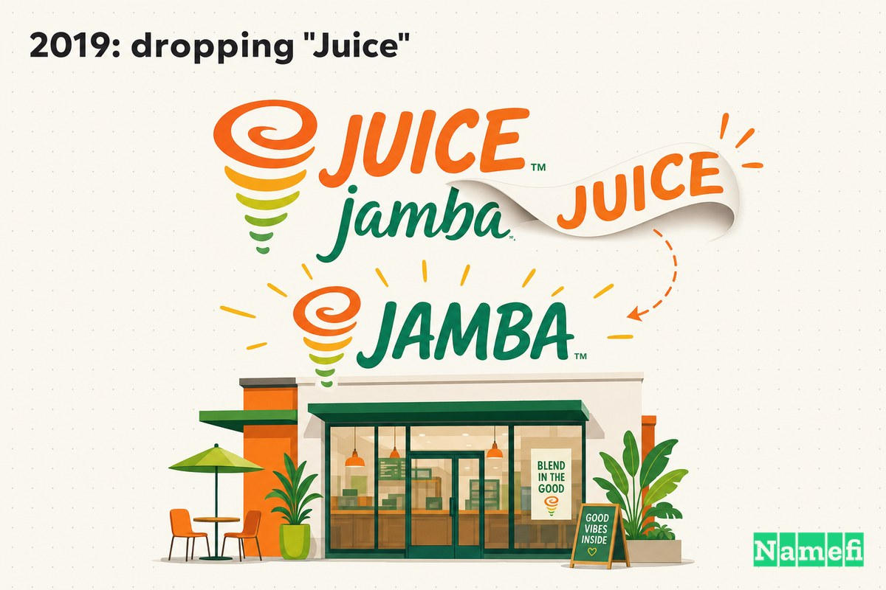
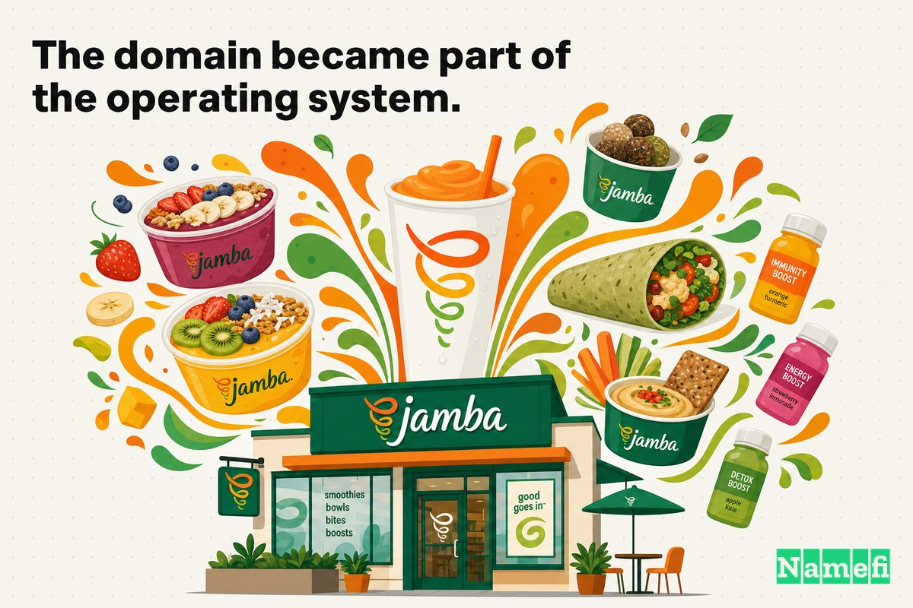
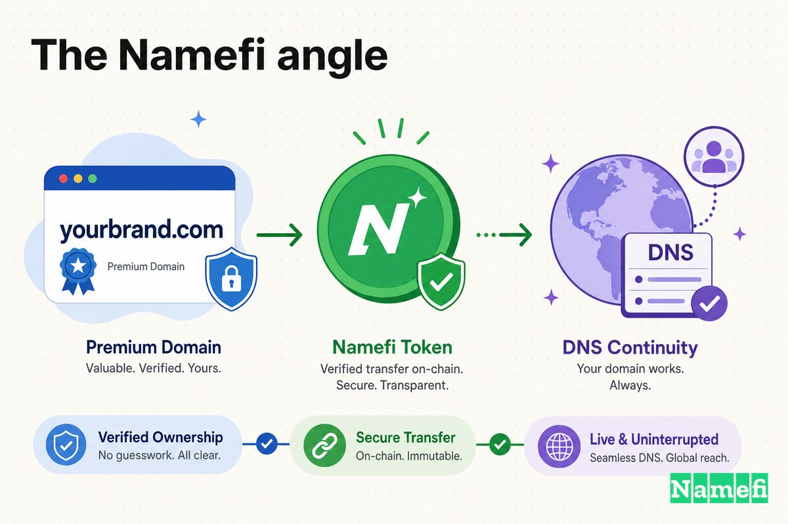

उनतीस वर्षों तक, अमेरिका की सबसे प्रसिद्ध स्मूदी चेन में से एक ने अपने नाम में ही बता दिया कि वह क्या बेचती है: **Jamba Juice**, जो **JambaJuice.com** पर उपलब्ध थी।

नाम ईमानदार था। जब Kirk Perron ने 1990 में सैन लुइस ओबिस्पो में पहला स्टोर खोला, तो यह कंपनी के खुद के बाद के शब्दों में — [एक छोटी जूस की दुकान थी जिसके पीछे एक बड़ा विचार था](https://www.foxnews.com/food-drink/jamba-juice-drops-jamba)। मूल साइनबोर्ड पर "Jamba" भी नहीं लिखा था। उस पर लिखा था *Juice Club*। "Juice" शब्द वास्तविक काम करता था: यह एक जिज्ञासु राहगीर को ठीक-ठीक बताता था कि अंदर क्या है, एक ऐसी श्रेणी में — ताजे मिश्रित पेय — जिसे 1990 के दशक की शुरुआत में अधिकांश अमेरिकियों ने कभी नहीं देखा था।

फिर, 2019 में, लगभग तीन दशकों तक खुद को समझाने के बाद, कंपनी ने वह शब्द हटा दिया जिसने उसे परिभाषित किया था। Jamba Juice सीधे **Jamba** बन गई।

तर्क यह था कि "Juice" ने व्यवसाय का वर्णन करना बंद कर दिया था — और उसे सीमित करने लगा था। चेन अब कटोरे, पौधे-आधारित स्नैक्स और बूस्ट बेच रही थी, केवल मिश्रित पेय नहीं, और "juice" शब्द एक अधिक चीनी-सचेत युग में चुपचाप एक देनदारी में बदल गया था।

लेकिन यहाँ वह विवरण है जो इस मामले को इस श्रृंखला की लगभग हर दूसरी कहानी से अलग बनाता है: **Jamba को अपना सटीक-मिलान डोमेन खरीदना नहीं पड़ा।** Tesla के विपरीत, जिसने Tesla.com के लिए $11 मिलियन चुकाए, या Uber के विपरीत, जिसने Uber.com के लिए इक्विटी का व्यापार किया, Jamba के पास **दशकों से Jamba.com** था — स्नैपशॉट रिकॉर्ड दिखाता है कि साइट जनवरी 1999 में ही [Welcome to Jamba.com](http://web.archive.org/web/19990125090358/http://jamba.com:80/) पढ़ते हुए लाइव थी। जब रीब्रांड आया, तो नाम परिवर्तन का सबसे कठिन, सबसे महंगा हिस्सा पहले से ही हो चुका था।

## 1990–1995: वह Juice Club जो Jamba Juice बना

शुरुआत में, "Juice" प्रमुख शब्द भी नहीं था — "Club" था।

Kirk Perron एक साइकिल चालक थे जो स्वस्थ खाने को आसान बनाना चाहते थे। उन्होंने [1990 में कॉलेज में एक सीनियर प्रोजेक्ट के रूप में Jamba Juice की शुरुआत की](https://www.legacy.com/news/kirk-perron-2020-jamba-juice-founder), पहला स्थान खोला — जिसे तब **Juice Club** कहा जाता था — सैन लुइस ओबिस्पो, कैलिफोर्निया में। कंपनी के अपने इतिहास के अनुसार, [पहला रेस्तरां, जिसका नाम Juice Club था, 31 मार्च, 1990 को सैन लुइस ओबिस्पो, कैलिफोर्निया में खोला गया](https://en.wikipedia.org/wiki/Jamba_Juice)।

"Jamba" नाम पाँच साल बाद आया। 1995 में, [चेन का नाम बदलकर Jamba Juice कर दिया गया, जो पूर्वी अफ्रीकी भाषा के 'उत्सव' शब्द से लिया गया था](https://en.wikipedia.org/wiki/Jamba_Juice)। यह शब्द, अधिकांश विवरणों के अनुसार, [स्वाहिली शब्द "jama" का संकेत है, जिसका अर्थ है "उत्सव मनाना,"](https://www.mashed.com/677372/the-swahili-word-jambas-name-was-derived-from/) — एक जानबूझकर संकेत कि ब्रांड केवल एक पेय से अधिक था; यह एक भावना के बारे में था।

लेकिन उस 1995 के निर्णय की संरचना पर ध्यान दें। संस्थापकों ने एक समृद्ध, अधिक उत्तेजक शब्द चुनने के बाद भी "Juice" को मार्की पर रखा। "Jamba" भावना लेकर चलता था; "Juice" स्पष्टीकरण लेकर चलता था। एक युवा चेन के लिए जो अभी भी अमेरिका को सिखा रही थी कि स्मूदी क्या होती है, स्पष्टीकरण रहना जरूरी था। JambaJuice.com वह पता था जो स्टोरफ्रंट से शब्द-दर-शब्द मेल खाता था।

## 2019: "Juice" को हटाना

2019 तक, स्पष्टीकरण एक बंधन बन गया था।

6 जून, 2019 को, कंपनी ने घोषणा की कि वह "Juice" हटा रही है। नई पहचान सिर्फ **Jamba** थी, और [नया टैगलाइन है "Smoothies. Juices. Bowls."](https://www.foxnews.com/food-drink/jamba-juice-drops-jamba) — एक पंक्ति जो चुपचाप आपको पूरी रणनीति बताती है। Juice अभी भी मेनू पर है; यह बस अब मेनू नहीं रहा।

दो ताकतों ने यह बदलाव प्रेरित किया। पहली थी धारणा। जैसा कि एक व्यापक रूप से उद्धृत विवरण ने कहा, "Juice" हाल के वर्षों में एक ["गंदा शब्द" बन गया था क्योंकि उपभोक्ताओं को पता चला कि ये पेय वास्तव में कितने "चीनी-युक्त और कैलोरी-भरे" हैं](https://www.mashed.com/332198/this-is-why-jamba-changed-its-name/)। एक नाम जो कभी "स्वस्थ" का संकेत देता था, दो दशक बाद, "चीनी" का संकेत दे रहा था।

दूसरी ताकत सरल थी: मेनू शब्द से बड़ा हो गया था। ब्रांड अध्यक्ष Geoff Henry इसके बारे में स्पष्ट थे: [वास्तविकता यह है कि बहुत से ग्राहक नहीं जानते कि Jamba कटोरे भी प्रदान करता है](https://www.foxnews.com/food-drink/jamba-juice-drops-jamba)। कंपनी ने [कटोरे, बूस्ट और चलते-फिरते मिनी स्नैक्स](https://www.mashed.com/332198/this-is-why-jamba-changed-its-name/) जोड़े थे, संपूर्ण-खाद्य सामग्री के आसपास पुनर्गठन किया और हाई-फ्रुक्टोज कॉर्न सिरप और कृत्रिम एडिटिव हटाए। "Juice" शब्द उसके नाम में पके हुए के साथ, स्टोर जो आधा बेचते थे वह सक्रिय रूप से छिपा रहा था।

रीब्रांड केवल एक नाम नहीं था। जैसा कि Restaurant Dive ने रिपोर्ट किया, कंपनी ने [ताजा रीब्रांड का अनावरण किया, स्मूदी से अधिक को उजागर किया](https://www.restaurantdive.com/news/jamba-unveils-fresh-rebrand-that-spotlights-more-than-smoothies/556411/), नए नाम के साथ एक ताजा लोगो, नए डिज़ाइन के स्टोर, एक नया ऐप और व्यापक डिलीवरी जोड़ी। लेकिन भार वहन करने वाला परिवर्तन वह शब्द था जो चला गया।

## पृष्ठभूमि: एक $200M बिक्री ने मंच तैयार किया

रीब्रांड शून्य में नहीं हुआ। यह स्वामित्व में बदलाव के बाद आया।

अगस्त 2018 में, Jamba, Inc. अटलांटा-आधारित Focus Brands द्वारा अधिग्रहण के लिए सहमत हुई। सौदा: [Focus Brands Jamba का अधिग्रहण $13 प्रति शेयर नकद में करेगी, जिसकी कुल कीमत लगभग $200 मिलियन है](https://www.beveragedaily.com/Article/2018/08/07/Jamba-Juice-acquired-by-Focus-Brands-for-200m/), एक लेनदेन [जिसे 2018 की तीसरी तिमाही में अंतिम रूप देने की उम्मीद थी](https://www.beveragedaily.com/Article/2018/08/07/Jamba-Juice-acquired-by-Focus-Brands-for-200m/)।

नया स्वामित्व उस पहचान प्रश्न को उठाने के लिए प्रेरित करता है जिसे संस्थापक वर्षों तक टालते हैं। बिक्री बंद होने के कुछ महीनों के भीतर, 29 साल पुराना "Juice" चला गया था। रीब्रांड Focus Brands का पहला बड़ा सार्वजनिक बयान था कि Jamba क्या होने वाली है — और यह कहने का सबसे सरल, सबसे स्पष्ट तरीका कि "हम अब केवल juice से अधिक हैं" "Juice" कहना बंद करना था।

Kirk Perron, जिस संस्थापक ने पहली जगह "Jamba" चुना था, उस एकल शब्द में ब्रांड को पूरी तरह विकसित होते देखने के लिए जीवित नहीं रहे जिसे उन्होंने चुना था। वे [20 जून को निधन हो गए](https://www.legacy.com/news/kirk-perron-2020-jamba-juice-founder) 2020 में, पाम स्प्रिंग्स में। वह शब्द जिसे उन्होंने स्वाहिली से "उत्सव" का अर्थ देने के लिए उधार लिया था, उस वर्णनात्मक लेबल से लंबे समय तक जीवित रहा जो एक चौथाई सदी तक उसके साथ चला था।

## उस समय पैसे अलग दिखते थे

एक शब्द हटाने को एक मुफ्त निर्णय मानना आसान है। यह नहीं है।

Jamba के अधिकांश जीवन के लिए, "Juice" को रखना *सस्ता* और *सुरक्षित* विकल्प था। 1990 और 2000 के दशक में, चेन अभी भी श्रेणी जागरूकता बना रही थी। हर नए बाजार में उसके ग्राहक थे जिन्हें सबसे सरल संभव शब्दों में बताने की जरूरत थी कि स्टोर क्या करता है। "Juice" हर साइन, कप और URL पर मुद्रित एक मुफ्त व्याख्याकार था। इसे हटाने का मतलब — भ्रम में — उससे अधिक परिष्कृत दिखने के लिए भुगतान करना होता जितना बाजार की आवश्यकता थी।

2019 तक गणित पलट गया था। श्रेणी परिपक्व थी; किसी को "smoothie" को अब परिभाषित करने की जरूरत नहीं थी। वह शब्द जो कभी स्पष्टता खरीदता था अब पहुँच की कीमत चुका रहा था, 800-से-अधिक-इकाई ब्रांड को एक उत्पाद लाइन पर सीमित कर रहा था जो पहले ही आगे बढ़ चुकी थी। वही शब्द, अपरिवर्तित, चुपचाप संपत्ति से देनदारी में बदल गया था — Jamba के कारण नहीं, बल्कि इसके आसपास की दुनिया के कारण।

यही वास्तविक सबक है जो समय में छिपा है। आपके नाम में एक वर्णनात्मक शब्द स्थायी रूप से अच्छा या स्थायी रूप से बुरा नहीं होता। यह अच्छा है जब तक आपको अभी भी खुद को समझाना है, और जिस क्षण आपको नहीं करना होता, यह गिट्टी बन जाता है। कौशल वह दिन नोटिस करना है जब व्यापार पलटता है।

## "Juice" हटाने का महत्व क्यों था

JambaJuice.com और Jamba.com के बीच का अंतर एक शब्द है। रणनीतिक रूप से, यह एक उत्पाद और एक ब्रांड के बीच का अंतर है।

**JambaJuice.com** एक ऐसी चीज का वर्णन करता है जिसे आप ऑर्डर करते हैं: juice। **Jamba.com** कुछ ऐसी चीज को नाम देता है जिसमें अधिक गुंजाइश है — एक वेलनेस ब्रांड जो स्मूदी, कटोरे, पौधे-आधारित स्नैक्स, बूस्ट और जो भी अगला दशक माँगे, बेच सकता है, बिना अपने नाम में एक संज्ञा के जो आधे मेनू के खिलाफ तर्क दे। एक शब्द आपको एक एकल, तेजी से जांची जाने वाली श्रेणी से बाँधता है। दूसरा ब्रांड को अपने दम पर खड़े होने देता है।

| पहले | बाद में |
| --- | --- |
| JambaJuice.com | Jamba.com |
| एक juice उत्पाद का नाम | एक वेलनेस ब्रांड का नाम |
| एक मेनू श्रेणी से बँधा हुआ | स्मूदी, कटोरे और उससे परे यात्रा करता है |
| "Juice" लेकर चलता है — एक नकारात्मक होता शब्द | शब्द में पकी हुई चीनी संबद्धता को हटाता है |
| छिपाता है कि स्टोर कटोरे बेचते हैं | पूर्ण मेनू को खुद बोलने देता है |

यह वही पैटर्न है जो इन केस स्टडीज में बार-बार आता है: शुरुआती नाम *समझाते* हैं, परिपक्व नाम *स्वामित्व* करते हैं। वर्णनात्मक संस्करण तब मदद करता है जब एक कंपनी को अभी भी बाजार को सिखाना होता है कि वह क्या करती है। सटीक-मिलान संस्करण तब मदद करता है जब कंपनी इतनी बड़ी हो जाती है — और इतनी व्यापक — कि नाम को केवल ब्रांड *होना* चाहिए। Jamba के पास दोनों पते पहले से थे; 2019 में उसने आखिरकार छोटे को प्राथमिक बनाया।

जैसा कि ब्रांड अध्यक्ष Geoff Henry ने बदलाव के बाद कंपनी की महत्वाकांक्षा को बताया, [हम आने वाले दशकों तक अपने ग्राहकों की वेलनेस यात्रा में शामिल होने के लिए उत्सुक हैं](https://www.mashed.com/332198/this-is-why-jamba-changed-its-name/) — एक "वेलनेस" फ्रेमिंग जिसे "Juice" शब्द कभी नहीं ले जा सकता था।

## डोमेन ऑपरेटिंग सिस्टम का हिस्सा बन गया

प्रीमियम डोमेन प्रतिष्ठा के बारे में नहीं हैं। वे पुनरावृत्ति के बारे में हैं — और उन शब्दों को हटाने के बारे में जिन्हें आप अब दोहराना नहीं चाहते।

किसी कंपनी का मुख्य डोमेन उन जगहों पर दिखाई देता है जिन्हें मार्केटिंग टीम कभी सीधे नियंत्रित नहीं करती:

- हर कप, बैग और रसीद पर।
- ऐप स्टोर और ऑर्डर स्क्रीन पर।
- प्रेस हेडलाइन और फ्रेंचाइज दस्तावेज में।
- ईमेल पतों और कर्मचारी हस्ताक्षरों में।
- हर बोली गई सिफारिश में — "चलो Jamba चलते हैं" — एक व्यक्ति से दूसरे व्यक्ति तक।

उन सभी पुनरावृत्तियों में से प्रत्येक या तो घर्षण जोड़ती है या उसे हटाती है। JambaJuice.com ने प्रत्येक उल्लेख को लंबा बनाया और इसे एक एकल, तेजी से भारी होते शब्द से जोड़ा। Jamba.com ने प्रत्येक उल्लेख को छोटा, स्वच्छ और श्रेणी-मुक्त बनाया — "bowls" और "boosts" और "plant-based" को नाम के साथ सह-अस्तित्व में रहने देता है बजाय उससे लड़ने के।

और महत्वपूर्ण बिंदु: **Jamba वह स्विच तुरंत कर सकती थी, क्योंकि उसके पास पहले से ही गंतव्य था।** उसके अपने SEC फाइलिंग में स्पष्ट भाषा में सूचीबद्ध है कि [कंपनी ने कई इंटरनेट डोमेन नाम पंजीकृत और बनाए रखे हैं, जिनमें "jamba.com" और "jambajuice.com" शामिल हैं।](https://www.sec.gov/Archives/edgar/data/1316898/000114420414014228/v369380_10k.htm) — 2019 के रीब्रांड से वर्षों *पहले* रिकॉर्ड पर एक वाक्य। नाम परिवर्तन का महंगा, धीमा हिस्सा — सटीक-मिलान .com सुरक्षित करना — 1990 के दशक के अंत से चुपचाप संभाला जा चुका था।

क्या Jamba.com के लिए कोई सार्वजनिक कीमत है? नहीं। क्योंकि संख्या पर रखने के लिए कोई हेडलाइन अधिग्रहण नहीं था। Jamba ने नाम खुद पंजीकृत और रखा, इसलिए ग्यारह-मिलियन-डॉलर के Tesla.com सौदे या Uber.com के लिए इक्विटी ट्रेड के विपरीत, बस कोई सार्वजनिक बिक्री आंकड़ा नहीं है — और हम एक का आविष्कार नहीं करेंगे। यहाँ कहानी यह नहीं है कि डोमेन की कीमत क्या थी। यह है कि इसे जल्दी रखने से रीब्रांड को लागू करना लगभग मुफ्त हो गया।

## संस्थापकों को Case 16 से क्या सीखना चाहिए

आसान सबक — "वर्णनात्मक शब्द हटाएँ" — अधिक टिकाऊ सीख से चूक जाता है। Jamba का मामला वास्तव में *समय* और *दूरदर्शिता* के बारे में है:

1. **एक वर्णनात्मक शब्द शुरुआत में ठीक है — यहाँ तक कि स्मार्ट भी।** "Juice" ने 29 साल का ईमानदार काम किया, एक युवा श्रेणी को सिखाते हुए कि स्टोर क्या बेचते थे। आपके नाम में एक विशेषण एक ऑन-रैंप है, पाप नहीं।
2. **उस दिन के लिए देखते रहें जब शब्द संपत्ति से देनदारी में पलट जाए।** Jamba के लिए, "Juice" नहीं बदला — उपभोक्ता धारणा बदली, और मेनू ने उसे पछाड़ दिया। उन्नयन का संकेत वह है जब आपका अपना नाम उस कंपनी की तुलना में एक छोटी, या अधिक पुरानी, कंपनी का वर्णन करता है जो आप बन गए हैं।
3. **सटीक-मिलान .com को जल्दी रखें, इससे पहले कि आपको इसकी आवश्यकता हो।** यह Jamba कहानी का शांत नायक है। दशकों तक Jamba.com रखकर, कंपनी ने एक संभावित महंगी, बहु-वर्षीय डोमेन खोज को उसी दिन के स्विच में बदल दिया। आपके ब्रांड का सटीक-मिलान डोमेन खरीदने का सबसे सस्ता समय वह है जो आपके ब्रांड की कीमत से काफी पहले है जिससे विक्रेता लालची हो जाए।
4. **रीब्रांड केवल उतना ही वास्तविक है जितना उसका पता।** घोषणा करना कि आप "Jamba" हैं जबकि अभी भी ग्राहकों को JambaJuice.com पर भेजना पूरे बिंदु को कमजोर कर देता। क्योंकि डोमेन पहले से हाथ में था, नया नाम तुरंत, पूरी तरह वास्तविक था।

डोमेन अपग्रेड ने Jamba को जीतने या हारने नहीं बनाया; उत्पाद, स्वामित्व और निष्पादन कहीं अधिक मायने रखते थे। लेकिन दशकों पहले Jamba.com रखने का मतलब था कि जब रणनीति ने आखिरकार एक शब्द हटाने की माँग की, तो कंपनी इसे स्वच्छ रूप से कर सकती थी — कोई बातचीत नहीं, कोई NDA नहीं, कोई आठ-अंकीय चेक नहीं।

## Namefi का कोण

इस श्रृंखला के अधिकांश मामले स्थानांतरण की समस्याएँ हैं: एक कंपनी को एक डोमेन की जरूरत है जो किसी और के पास है, और नाटक उसे हासिल करने में है। Jamba इसका विपरीत है — और उतना ही शिक्षाप्रद। यहाँ नाटक *दूरदर्शिता* है: एक संस्थापक जिसने, दशकों पहले जब यह मायने रखता था, सुनिश्चित किया कि ब्रांड का सटीक-मिलान .com पहले से पोर्टफोलियो में था।

वह दूरदर्शिता वास्तव में वही व्यवहार है जिसे अच्छा डोमेन बुनियादी ढाँचा आसान और सस्ता बनाना चाहिए। बीस वर्षों तक एक रणनीतिक डोमेन रखने का कठिन हिस्सा विचार नहीं है — यह रखरखाव है: पंजीकरण चालू रखना, कॉर्पोरेट परिवर्तनों (एक संस्थापक के स्टार्टअप, एक सार्वजनिक कंपनी, Focus Brands द्वारा $200 मिलियन अधिग्रहण) में स्वामित्व स्पष्ट रूप से साबित करना, और जिस दिन रणनीति की माँग हो उस दिन एक लंबे समय तक रखे गए नाम को प्राथमिक स्थिति में बढ़ावा देने में सक्षम होना, बिना कुछ लाइव तोड़े।

[Namefi](https://namefi.io) इस विचार के आसपास बनाया गया है कि डोमेन को इंटरनेट-नेटिव संपत्ति की तरह व्यवहार करना चाहिए। टोकनाइज्ड स्वामित्व डोमेन नियंत्रण को सत्यापित करना, रखना, स्थानांतरित करना और DNS के साथ संगत रहते हुए आधुनिक वर्कफ्लो में एकीकृत करना आसान बना सकता है — एक रणनीतिक डोमेन को *रखने* (और हर कॉर्पोरेट मोड़ के माध्यम से यह साबित करना कि आप अभी भी इसके मालिक हैं) के शांत, बहु-दशक के काम को एक स्वच्छ, ऑडिट करने योग्य, प्रोग्राम करने योग्य संपत्ति के करीब कुछ में बदलते हुए।

Jamba.com अब स्पष्ट लगता है क्योंकि Jamba उसमें बड़ी हुई। लेकिन सबक उससे बहुत पहले उतरता है: सबसे स्मार्ट डोमेन कदम हमेशा एक नाटकीय खरीद नहीं होता। कभी-कभी यह सटीक-मिलान नाम को बीस वर्षों तक चुपचाप रखना होता है — ताकि जब आप आखिरकार अतिरिक्त शब्द हटाएँ, तो बचा-खुचा काम केवल साइन से उसे उतारना हो।

## स्रोत और आगे पढ़ें

- Fox News — [Jamba Juice drops 'juice' to become 'Jamba'](https://www.foxnews.com/food-drink/jamba-juice-drops-jamba)
- Mashed — [This Is Why Jamba Changed Its Name](https://www.mashed.com/332198/this-is-why-jamba-changed-its-name/)
- Mashed — [The Swahili Word Jamba's Name Was Derived From](https://www.mashed.com/677372/the-swahili-word-jambas-name-was-derived-from/)
- Restaurant Dive — [Jamba unveils fresh rebrand, spotlights more than smoothies](https://www.restaurantdive.com/news/jamba-unveils-fresh-rebrand-that-spotlights-more-than-smoothies/556411/)
- BeverageDaily — [Jamba Juice acquired by Focus Brands for $200m](https://www.beveragedaily.com/Article/2018/08/07/Jamba-Juice-acquired-by-Focus-Brands-for-200m/)
- U.S. SEC — [Jamba, Inc. Form 10-K (intellectual property / domain names)](https://www.sec.gov/Archives/edgar/data/1316898/000114420414014228/v369380_10k.htm)
- Legacy.com — [Kirk Perron (1964–2020), Jamba Juice founder](https://www.legacy.com/news/kirk-perron-2020-jamba-juice-founder)
- Wikipedia — [Jamba Juice](https://en.wikipedia.org/wiki/Jamba_Juice)
- Internet Archive (Wayback Machine) — [jamba.com, archived January 25, 1999](http://web.archive.org/web/19990125090358/http://jamba.com:80/)
