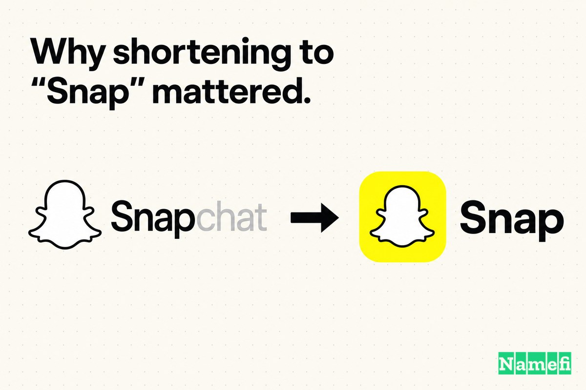
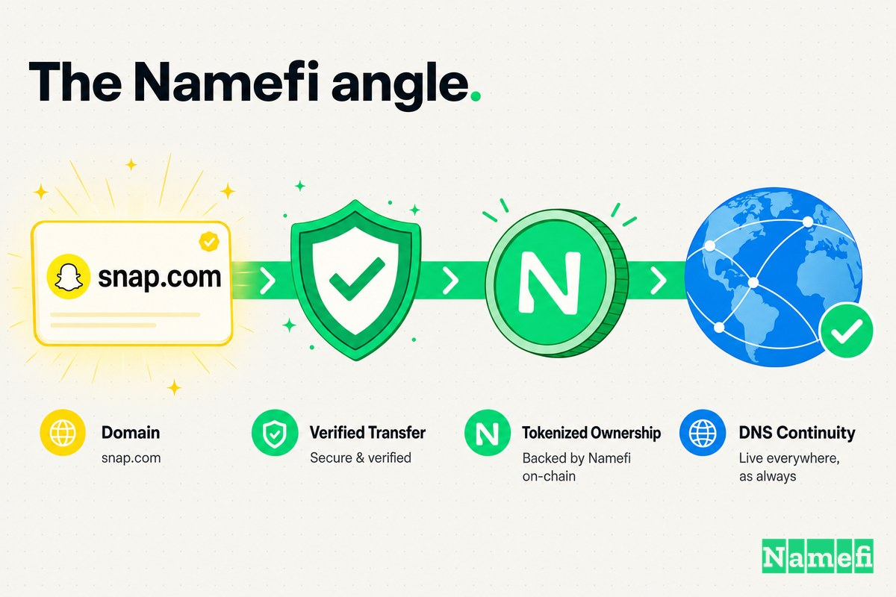

इससे पहले कि Snap Inc. एक सार्वजनिक रूप से कारोबार करने वाली "कैमरा कंपनी" बनती, वह एक अकेला ऐप था जिसका नाम सीधे-सादे तरीके से खुद को समझाता था: **Snapchat**। उत्पाद आपको बताता था कि वह क्या करता है। आप एक snap लेते थे, chat करते थे, और snap गायब हो जाता था। नाम और क्रिया एक ही थे।

किशोरों के लिए बने एक मैसेजिंग ऐप के लिए यह एक फायदा था। "Snapchat" ने खुद को एक शब्द में समझा दिया, और Snapchat.com ठीक वहीं ले जाता था जहाँ आप उम्मीद करते थे। नाम ने वास्तविक काम किया: उसने बताया कि यह क्षणिक, चंचल और संवादात्मक था — कोई और स्थायी, संग्रहालयी सोशल नेटवर्क नहीं।

लेकिन महत्वाकांक्षा जनता को दिखने से बहुत पहले ही ऐप से आगे निकल गई। 2016 तक कंपनी हार्डवेयर बना रही थी, augmented reality के साथ प्रयोग कर रही थी, और खुद को chat के बजाय camera के इर्द-गिर्द पुनर्परिभाषित कर रही थी। एक नाम जो एक उत्पाद को पूरी तरह से परिभाषित करता था, वह चुपचाप उस कंपनी की छत बन गया था जो एक से कहीं ज़्यादा बनना चाहती थी।

तो कंपनी ने दो काम किए, सालों के अंतर पर, जो एक साथ फिट होते हैं। पहले, चुपचाप, उसने exact-match **Snap.com** खरीदा — एक डोमेन जिसका उसके पास अभी कोई सार्वजनिक उपयोग नहीं था। फिर, सितंबर 2016 में, उसने अपना कॉर्पोरेट नाम बदला और उस छोटे डोमेन को एक नई पहचान का मुख्य द्वार बनने दिया। जब [Snapchat के पीछे की कंपनी ने अपना नाम Snapchat Inc. से बदलकर सिर्फ Snap Inc. कर दिया](https://m.gsmarena.com/snapchat_changes_company_name_to_snap_inc_announces_spectacles-blog-20696.php#:~:text=the%20company%20behind%20Snapchat%20is%20changing%20its%20name%20from%20Snapchat%20Inc.%20to%20just%20Snap%20Inc.), तो जिस डोमेन की उसे ज़रूरत थी वह पहले ही खरीदा जा चुका था।

उस डोमेन के लिए कथित कीमत — बाद में एक SEC फाइलिंग में सामने आई, कभी आधिकारिक रूप से पुष्टि नहीं हुई — **[$5 मिलियन](https://www.thedomains.com/2017/02/02/snap-pay-5million-snap-com/#:~:text=There%20is%20a%20%245%20million%20number%20for%20domain%20names)** थी।

## 2011–2016: वह ऐप जिसका नाम ही उत्पाद था

शुरुआत में, "Snapchat" एक फीचर था, बाधा नहीं।

पूरा आइडिया शब्द के अंदर ही था। एक "snap" कंटेंट की इकाई था; "chat" माध्यम था। Snapchat.com शब्द-दर-शब्द ऐप से मेल खाता था, जो कि एक शुरुआती उपभोक्ता उत्पाद ठीक यही चाहता है: नाम सुनने, ऐप ढूँढने और यह समझने के बीच शून्य अनुवाद लागत कि वह क्या करता है। मौखिक प्रचार से हाई स्कूलों और कॉलेजों में फैलने वाले उत्पाद के लिए, खुद को समझाने वाला नाम एक ग्रोथ फीचर था।

यह घनिष्ठ जुड़ाव ही वह कारण है जिसकी वजह से नाम अंततः सीमित बन गया। "Snapchat" सिर्फ एक कंपनी का नाम नहीं है — यह एक *व्यवहार* का नाम है। यह मैसेजिंग कहता है। यह गायब होने वाली तस्वीरें कहता है। यह एक विशिष्ट ऐप कहता है। और कंपनी की योजनाएँ उस एकल व्यवहार से तेज़ी से आगे बढ़ रही थीं।

2016 तक, Snap केवल ऐप बनाने वाला नहीं रहा। वह अपना खुद का हार्डवेयर शिप करने वाला था, खुद को camera को एक मूलभूत तत्व के रूप में स्थापित करने वाला था, और निवेशकों को बताने वाला था कि वह लोगों के दुनिया को कैप्चर करने के तरीके को फिर से आविष्कार करने का इरादा रखता है। जो कंपनी "chat" शब्द से खुद को परिभाषित करती थी, वह ऐसी चीज़ बन रही थी जिसे "chat" अब समेट नहीं सकता था। Snapchat.com पहले चरण के लिए सही डोमेन था — और आने वाली कंपनी को नाम देने के लिए गलत डोमेन।

## सितंबर 2016: रीब्रांड और Snap.com का वह पल

24 सितंबर, 2016 को, कंपनी ने यह बदलाव सार्वजनिक किया। [कंपनी का नाम इसकी स्थापना के समय Snapchat Inc. था, लेकिन 24 सितंबर, 2016 को इसे Snap Inc. के रूप में रीब्रांड किया गया, ताकि Spectacles उत्पाद को कंपनी के नाम के अंतर्गत शामिल किया जा सके।](https://en.wikipedia.org/wiki/Snap_Inc.#:~:text=The%20company%20was%20named%20Snapchat%20Inc.%20at%20its%20inception%2C%20but%20it%20was%20rebranded%20Snap%20Inc.%20on%20September%2024%2C%202016) इसका कारण एक उत्पाद खुलासा था: Snap ने **Spectacles** का अनावरण किया, [एक ऐसा सनग्लास जिसमें 115 डिग्री व्यू के साथ बिल्ट-इन वीडियो कैमरा है](https://m.gsmarena.com/snapchat_changes_company_name_to_snap_inc_announces_spectacles-blog-20696.php#:~:text=Spectacles%20are%20a%20pair%20of%20sunglasses%20that%20have%20a%20built-in%20video%20camera%20in%20them%20with%20a%20115%20degree%20view)।

रीब्रांड कोई छोटा-मोटा बदलाव नहीं था। The Drum ने [एक व्यापक रीब्रांड का वर्णन किया जिसमें वेब डोमेन और सोशल मीडिया अकाउंट Snap Inc. के रूप में नामित किए गए](https://www.thedrum.com/news/2016/09/24/snapchat-rebrands-snap-inc-after-camera-spectacles-unveil#:~:text=a%20sweeping%20rebrand%20that%20saw%20web%20domains%20and%20social%20media%20counts%20renamed%20as%20Snap%20Inc)। और नए नाम के लिए स्पष्ट तर्क यह था कि पुराना नाम अब बहुत छोटा हो गया था। Evan Spiegel का तर्क था कि [अब जब हम Spectacles जैसे अन्य उत्पाद विकसित कर रहे हैं, तो हमें एक ऐसे नाम की ज़रूरत है जो सिर्फ एक उत्पाद से परे हो](https://www.thedrum.com/news/2016/09/24/snapchat-rebrands-snap-inc-after-camera-spectacles-unveil#:~:text=Now%20that%20we%20are%20developing%20other%20products%2C%20like%20Spectacles%2C%20we%20need%20a%20name%20that%20goes%20beyond%20just%20one%20product)।

यही एक डोमेन अपग्रेड का पूरा सिद्धांत एक वाक्य में समेटा हुआ है: *एक नाम जो सिर्फ एक उत्पाद से परे हो*। ऐप Snapchat रहा। कंपनी Snap बन गई। और नई कॉर्पोरेट पहचान को खड़े होने के लिए उस छोटे, exact-match पते की ज़रूरत थी। Snap Inc. का होमपेज तुरंत [खुद को एक कैमरा कंपनी के रूप में प्रस्तुत करता है](https://www.itsnicethat.com/news/snapchat-renamed-snap-inc-launches-spectacles-sunglasses-260916#:~:text=The%20Snap%20Inc.%20homepage%20bills%20itself%20as%20a%20camera%20company) — एक विवरण जो Snapchat.com नाम के डोमेन पर हास्यास्पद लगता।

महत्वपूर्ण बात यह है कि महंगा, धीमे-से-हासिल होने वाला हिस्सा पहले ही हो चुका था। Snap ने दो साल पहले ही Snap.com चुपचाप हासिल कर लिया था। रीब्रांड एक प्रेस रिलीज़ की गति से आगे बढ़ सका क्योंकि डोमेन कोई रुकावट नहीं था।

## विक्रेता का पक्ष: Idealab, एक SEC फाइलिंग, और एक अघोषित कीमत

Tesla.com की ज़ोरदार, दशक-लंबी कहानी के विपरीत, Snap.com की खरीद उस समय लगभग अदृश्य थी। कोई प्रेस रिलीज़ नहीं, कोई संस्थापक ट्वीट नहीं, कोई पुष्टि की गई कीमत नहीं। इस कहानी को उल्टे क्रम में जोड़ना पड़ा।

डोमेन का पिछला मालिक **Idealab** था, Bill Gross का लंबे समय से चला आ रहा तकनीकी इनक्यूबेटर, जिसने सालों तक Snap.com अपने पास रखा था। डोमेन शोधकर्ताओं ने सार्वजनिक WHOIS रिकॉर्ड के माध्यम से हस्तांतरण का पता लगाया: [DomainTools पर WHOIS इतिहास के अनुसार, Snap.com नवंबर 2014 के मध्य में Idealab से बदला](https://www.thedomains.com/2017/02/02/snap-pay-5million-snap-com/#:~:text=According%20to%20the%20WHOIS%20history%20at%20DomainTools%2C%20Snap.com%20changed%20from%20Idealab%20in%20mid-November%20of%202014) — गोपनीयता-संरक्षित और फिर कॉर्पोरेट रजिस्ट्रार अकाउंट में — एक ऐसी कंपनी द्वारा चुपचाप अधिग्रहण की क्लासिक छाप जो अपना इरादा ज़ाहिर नहीं करना चाहती थी।

कीमत तब सामने आई जब Snap ने IPO के लिए फाइलिंग की। वित्तीय दस्तावेज़ों में दबा हुआ एक डोमेन-नाम लाइन आइटम था जिसे डोमेन निवेशकों ने तुरंत पहचाना। जैसा कि विश्लेषण में कहा गया, [डोमेन नामों के लिए $5 मिलियन का एक आँकड़ा है, कल्पना नहीं कर सकते कि कंपनी द्वारा कोई और डोमेन खरीद होगी जो इस संख्या को समझा सके](https://www.thedomains.com/2017/02/02/snap-pay-5million-snap-com/#:~:text=There%20is%20a%20%245%20million%20number%20for%20domain%20names%2C%20can%27t%20imagine%20any%20other%20domain%20purchases%20by%20the%20company%20that%20would%20account%20for%20this%20number)। परिशोधन अनुसूची एक बड़ी एकल खरीद के अनुरूप थी: [यह नवंबर/दिसंबर 2014 में एकल $5 मिलियन सौदे के साथ लगभग पूरी तरह से मेल खाती है](https://www.thedomains.com/2017/02/02/snap-pay-5million-snap-com/#:~:text=this%20lines%20up%20almost%20perfectly%20with%20a%20single%20%245%20million%20deal%20in%20November%2FDecember%202014)।

यहाँ सटीक रहना ज़रूरी है, क्योंकि तथ्य मायने रखते हैं: **Snap ने कभी सार्वजनिक रूप से Snap.com की कीमत की पुष्टि नहीं की।** $5 मिलियन का आँकड़ा SEC फाइलिंग के परिशोधन गणित और WHOIS टाइमिंग से एक सुविचारित अनुमान है, कोई घोषित संख्या नहीं। इस कहानी का ईमानदार संस्करण यह है कि सार्वजनिक रिकॉर्ड के सावधानीपूर्वक पाठन से यह दृढ़ता से संकेत मिलता है कि नवंबर 2014 के आसपास Idealab को लगभग $5 मिलियन का भुगतान किया गया — और Snap में किसी ने भी रिकॉर्ड पर इसके विपरीत कभी नहीं कहा।

यह भी एक पैटर्न है। सबसे महत्वपूर्ण डोमेन सौदों में से कई वे होते हैं जिन्हें खरीदार संपत्ति को लॉक करने तक सबसे अधिक गुप्त रखने की कोशिश करता है।

## उस समय पैसे अलग तरह से दिखते थे

आज की नज़र से, Snap.com के लिए $5 मिलियन छोटा लगता है। Snap 2017 में दसियों अरब डॉलर के मूल्यांकन पर सार्वजनिक हुआ। उस पैमाने पर, एक डोमेन खरीद तो गोलाई की गलती है।

लेकिन सौदे का मूल्यांकन उस समय किया जाना चाहिए जब यह हुआ था, IPO के दूसरी तरफ से नहीं।

2014 के अंत में, Snapchat अभी भी एक जंगली रूप से लोकप्रिय लेकिन अप्रमाणित ऐप था। उसने प्रसिद्ध रूप से एक कथित अरब-डॉलर के अधिग्रहण प्रस्ताव को ठुकरा दिया था, उसके पास कोई सार्वजनिक हार्डवेयर नहीं था, और वह कोई लाभ और IPO नज़दीक न होने के बावजूद बढ़ने के लिए पैसे जला रहा था। *एक डोमेन नाम* पर $5 मिलियन खर्च करना — इंजीनियरों पर नहीं, सर्वर पर नहीं, यूज़र अधिग्रहण पर नहीं — एक ऐसी लाइन आइटम थी जिसकी एक वित्त टीम जाँच-पड़ताल करती। अभी न तो Spectacles था, न "Snap Inc.", न कोई सार्वजनिक कारण कि कंपनी को Snap.com की भी ज़रूरत थी।

यही इस खरीद को दिलचस्प बनाता है। Snap ने डोमेन *उससे पहले* खरीदा जब उसके पास इसके उपयोग का कोई कारण था। अधिग्रहण तभी समझ में आता है जब आप इसे विकल्प मूल्य खरीदने के रूप में पढ़ें: छोटी, exact-match ब्रांड संपत्ति को तब सुरक्षित करना जब वह उपलब्ध और अपेक्षाकृत सस्ती थी, उस भविष्य के लिए जिसमें कंपनी एक से अधिक ऐप से ज़्यादा होना चाहेगी। दो साल बाद, जब रीब्रांड आया, तो वह विकल्प तुरंत फलीभूत हुआ। कठिन, महंगा, बाहरी रूप से स्वामित्व वाला हिस्सा पहले से ही हाथ में था।

## "Snap" में छोटा होना क्यों मायने रखता था

Snapchat.com और Snap.com के बीच का अंतर एक अक्षर है। रणनीतिक रूप से, यह एक व्यवहार और एक श्रेणी के बीच का अंतर है।

**Snapchat.com** एक क्रिया का नाम लेता है: आप snap करते हैं, आप chat करते हैं। यह एक डोमेन पहने हुए एक क्रिया है। **Snap.com** एक *कंपनी* का नाम लेता है — एक ऐसा कंटेनर जो एक ऐप, कैमरा चश्मे की एक जोड़ी, एक AR प्लेटफॉर्म, और कंपनी जो कुछ भी बनाने का फैसला करे उसके लिए काफी बड़ा है। एक बताता है कि उत्पाद क्या करता है; दूसरा किसी एकल उत्पाद से बँधने से इनकार करता है।

| पहले | बाद में |
| --- | --- |
| Snapchat.com | Snap.com |
| एक ऐप का नाम लेता है | बिना किसी छत के एक कंपनी का नाम लेता है |
| "मैसेजिंग / गायब होने वाली chat" का अर्थ रखता है | ऐप, हार्डवेयर और AR के पार काम करता है |
| एक उत्पाद जैसा पढ़ता है | एक पैरेंट ब्रांड जैसा पढ़ता है |
| कंपनी को "chat" से जोड़ता है | कंपनी को "एक कैमरा कंपनी" बनने की आज़ादी देता है |

यही वह पैटर्न है जो डोमेन अपग्रेड में बार-बार आता है: शुरुआती नाम *समझाते हैं*, महान नाम *स्वामित्व लेते हैं*। "Snapchat" तब सही नाम था जब कंपनी एक ऐप थी जिसे आपको बताना था कि वह क्या करती है। "Snap" बेहतर नाम बन गया जब कंपनी चाहती थी कि ब्रांड बस श्रेणी *हो*। दो साल पहले की डोमेन खरीद ने ही कंपनी को बिना किसी घर्षण के एक से दूसरे में जाने दिया।

## 2014 फिर 2016: पहले डोमेन, फिर नाम बदलना

Snap.com को एक आभूषण खरीदारी से ज़्यादा बनाने वाला विवरण यह क्रम है: डोमेन *पहले* आया, और कॉर्पोरेट रीब्रांड दो साल बाद।

नवंबर 2014 में, Snap.com चुपचाप हाथ बदला। कोई घोषणा नहीं थी क्योंकि अभी घोषणा करने के लिए कुछ था ही नहीं — ऐप Snapchat फल-फूल रहा था और "Snap Inc." का अस्तित्व नहीं था। डोमेन एक धारित संपत्ति के रूप में पड़ा रहा।

फिर सितंबर 2016 में सार्वजनिक कहानी आई। Spectacles का खुलासा कंपनी का नाम बदलने का अवसर बन गया, और [नए उत्पाद का अनावरण 24 सितंबर, 2016 को हुआ और 10 नवंबर, 2016 को इसे रिलीज़ किया गया](https://en.wikipedia.org/wiki/Spectacles_%28product%29#:~:text=The%20new%20product%20was%20unveiled%20on%20September%2024%2C%202016%2C%20and%20released%20on%20November%2010%2C%202016)। हार्डवेयर को एक ऐसे कंपनी नाम की ज़रूरत थी जो ऐप का नाम न हो, और कंपनी के नाम को एक exact-match डोमेन की ज़रूरत थी जो ऐप का डोमेन न हो।

विकल्प की कल्पना करें। Snap घोषणा करता है कि वह अब "Snap Inc., एक कैमरा कंपनी" है, $130 के कैमरा चश्मे का अनावरण करता है — और कॉर्पोरेट साइट अभी भी Snapchat.com पर रहती है, जबकि कोई और Snap.com रखता है और दबाव में अपनी कीमत बताता है। रीब्रांड अजीब और अधूरा होता, या अंतिम समय की बातचीत का बंधक। इसके बजाय, क्योंकि धीमा, महंगा, बाहरी स्वामित्व वाला हिस्सा 2014 में सुरक्षित हो गया था, 2016 का नाम बदलाव साफ-सुथरे तरीके से हो सका। डोमेन ने नेतृत्व किया; पहचान ने अनुसरण किया।

## डोमेन ऑपरेटिंग सिस्टम का हिस्सा बन गया

प्रीमियम डोमेन प्रतिष्ठा के बारे में नहीं हैं। वे पुनरावृत्ति के बारे में हैं।

किसी कंपनी का मूल डोमेन उन जगहों पर दिखता है जहाँ मार्केटिंग टीम सीधे कभी नियंत्रण नहीं करती:

- ऐप स्टोर में, ऐप की कंपनी का नाम, और डेवलपर पेज।
- Spectacles की पैकेजिंग, Snapbot साइनेज, और उत्पाद PR में।
- "Snap" कंपनी बनाम "Snapchat" ऐप के बारे में प्रेस हेडलाइन और विश्लेषक नोट्स में।
- ईमेल पतों, कर्मचारी हस्ताक्षरों और भर्ती में।
- हर निवेशक डेक, S-1 पृष्ठ, और मौखिक उल्लेख में।

इनमें से हर पुनरावृत्ति या तो घर्षण जोड़ती है या हटाती है। Snap.com पर न रहकर Snapchat.com पर रहने वाली Snap नाम की एक कंपनी हर बार एक छोटा अनुवाद मजबूर करती: *कंपनी Snap है, लेकिन साइट Snapchat-dot-com है।* Snap.com उस अंतर को मिटा देता है। जब Snap ने जनता को बताया कि वह अब [एक कैमरा कंपनी है](https://www.itsnicethat.com/news/snapchat-renamed-snap-inc-launches-spectacles-sunglasses-260916#:~:text=The%20Snap%20Inc.%20homepage%20bills%20itself%20as%20a%20camera%20company), तो पता संदेश से शब्द-दर-शब्द मेल खाता था।

डोमेन ने Snap का ब्रांड नहीं बनाया — यह काम ऐप, कैमरा और संस्कृति ने किया। लेकिन एक बार जब Snap.com पता बन गया, तो कंपनी के नाम की हर भविष्य की पुनरावृत्ति एक साफ, exact-match नींव पर निर्मित हुई, न कि किसी ऐप के नाम को पीछे खींचते हुए।

## संस्थापकों को Case 12 से क्या सीखना चाहिए

आसान सबक — "अपना छोटा .com खरीदें" — अधिक उपयोगी संरचना से चूक जाता है। Snap का सबक *क्रम और शांत समय* के बारे में है:

1. **एक शाब्दिक, खुद को समझाने वाला डोमेन शुरू करने का एक अच्छा तरीका है।** Snapchat.com ऐप से पूरी तरह मेल खाता था और उत्पाद को मौखिक प्रचार से फैलाता था। एक वर्णनात्मक नाम एक ऑन-रैंप है, विफलता नहीं।
2. **देखें कब उत्पाद का नाम कंपनी की छत बन जाए।** अपग्रेड करने का संकेत सौंदर्यशास्त्र नहीं था — यह रणनीतिक था। एक बार जब "chat" महत्वाकांक्षा (हार्डवेयर, कैमरा, AR) का वर्णन नहीं कर सका, तो ऐप का नाम कंपनी का नाम भी नहीं हो सकता था।
3. **सार्वजनिक ज़रूरत से पहले exact-match डोमेन खरीदें।** Snap ने 2014 में, चुपचाप, रीब्रांड से दो साल पहले Snap.com हासिल किया। धीमी, बाहरी स्वामित्व वाली संपत्ति को जल्दी सुरक्षित करना — बिना अपना इरादा ज़ाहिर किए — ही भविष्य का नाम बदलना सस्ता और साफ बनाता है।
4. **डोमेन को रीनेम का नेतृत्व करने दें, उसके पीछे न चलने दें।** जब रीब्रांड आया, तो कॉर्पोरेट पहचान एक दिन में बदल गई क्योंकि महंगा हिस्सा पहले से लॉक था। पहले डोमेन, फिर घोषणा।

डोमेन अपग्रेड ने Snap को जीत नहीं दिलाई। उत्पाद, पूंजी, संस्कृति और समय कहीं अधिक मायने रखते थे — और Snap के बाद के वर्ष दिखाते हैं कि परफेक्ट डोमेन का मालिक होना कुछ भी गारंटी नहीं देता। लेकिन Snap.com ने "एक कैमरा कंपनी" के रूप में कंपनी के पुनर्आविष्कार को *नामांकनीय* बनाया, और इसे उन वर्षों से पहले खरीदा गया जब कंपनी के बाहर कोई भी नहीं जानता था क्यों।

## Namefi का पक्ष

Snap की कहानी, अपने मूल में, एक शांत ट्रांसफर समस्या है।

रणनीतिक निर्णय वास्तव में कभी संदेह में नहीं था — एक कंपनी जो Snap कहलाना चाहती थी उसे Snap.com का मालिक होना चाहिए था। कठिन हिस्सा संपत्ति के आसपास की सब चीज़ें थीं: यह पहचानना कि Idealab जैसा एक दीर्घकालिक धारक उसे नियंत्रित करता है, निजी तौर पर बातचीत करना, बिना किसी सार्वजनिक तुलना के कीमत पर सहमत होना, लाखों डॉलर स्थानांतरित करना, नियंत्रण साफ-सुथरे तरीके से ट्रांसफर करना, और यह सब *चुपचाप* करना ताकि रीब्रांड कंपनी के अपने शेड्यूल पर प्रकट हो सके न कि विक्रेता के। यह तथ्य कि कीमत बाद में ही सामने आई, SEC फाइलिंग से रिवर्स-इंजीनियर की गई, दिखाता है कि ये सौदे अभी भी कितने अपारदर्शी और मैनुअल हैं।

[Namefi](https://namefi.io) इस विचार पर बना है कि डोमेन को इंटरनेट-नेटिव संपत्तियों की तरह व्यवहार करना चाहिए। टोकनाइज़्ड स्वामित्व डोमेन नियंत्रण को सत्यापित करना, ट्रांसफर करना और आधुनिक वर्कफ्लो में एकीकृत करना आसान बना सकता है, DNS के साथ संगत रहते हुए — इस तरह के सौदे के सबसे कठिन हिस्सों (यह साबित करना कि कौन क्या रखता है, शर्तों पर सहमत होना, और संपत्ति को सुरक्षित रूप से स्थानांतरित करना) को एक साफ, ऑडिट योग्य लेनदेन के करीब बनाता है।

Snap.com अब अपरिहार्य लगता है क्योंकि Snap एक सार्वजनिक कंपनी बन गई। लेकिन सबक उस पैमाने से बहुत पहले मिलता है: जब एक नाम कंपनी को वहन करने वाला हो — न कि केवल उत्पाद को — तो डोमेन सजावट नहीं है। यह ब्रांड का वह हिस्सा है जिसे चुपचाप, सालों पहले खरीदने लायक है, ताकि रीब्रांड बस *पता* हो सके।

## स्रोत और आगे पढ़ने के लिए

- GSMArena — [Snapchat changes company name to Snap Inc., announces Spectacles](https://m.gsmarena.com/snapchat_changes_company_name_to_snap_inc_announces_spectacles-blog-20696.php#:~:text=the%20company%20behind%20Snapchat%20is%20changing%20its%20name%20from%20Snapchat%20Inc.%20to%20just%20Snap%20Inc.)
- Wikipedia — [Snap Inc.](https://en.wikipedia.org/wiki/Snap_Inc.#:~:text=The%20company%20was%20named%20Snapchat%20Inc.%20at%20its%20inception%2C%20but%20it%20was%20rebranded%20Snap%20Inc.%20on%20September%2024%2C%202016)
- Wikipedia — [Spectacles (product)](https://en.wikipedia.org/wiki/Spectacles_%28product%29#:~:text=The%20new%20product%20was%20unveiled%20on%20September%2024%2C%202016%2C%20and%20released%20on%20November%2010%2C%202016)
- The Drum — [Snapchat rebrands as Snap Inc after camera 'Spectacles' unveil](https://www.thedrum.com/news/2016/09/24/snapchat-rebrands-snap-inc-after-camera-spectacles-unveil#:~:text=Now%20that%20we%20are%20developing%20other%20products%2C%20like%20Spectacles%2C%20we%20need%20a%20name%20that%20goes%20beyond%20just%20one%20product)
- It's Nice That — [Snapchat renamed Snap Inc. and launches Spectacles sunglasses](https://www.itsnicethat.com/news/snapchat-renamed-snap-inc-launches-spectacles-sunglasses-260916#:~:text=The%20Snap%20Inc.%20homepage%20bills%20itself%20as%20a%20camera%20company)
- TechCrunch — [Snap Inc says cameras define smartphones in IPO filing's tiny letter to investors](https://techcrunch.com/2017/02/02/snap-letter/#:~:text=Snap%20Inc.%20is%20a%20camera%20company.)
- TheDomains.com — [Did Snap pay $5 million for Snap.com?](https://www.thedomains.com/2017/02/02/snap-pay-5million-snap-com/#:~:text=According%20to%20the%20WHOIS%20history%20at%20DomainTools%2C%20Snap.com%20changed%20from%20Idealab%20in%20mid-November%20of%202014)
- Social Media Today — [Snapchat Launches Spectacles, Re-Brands as "Snap Inc."](https://www.socialmediatoday.com/social-business/snapchat-launches-spectacles-re-brands-snap-inc)
- Marketing Dive — [Snap Inc. touts vision as camera company on investor roadshow](https://www.marketingdive.com/news/snap-inc-touts-vision-as-camera-company-on-investor-roadshow/436540/)
