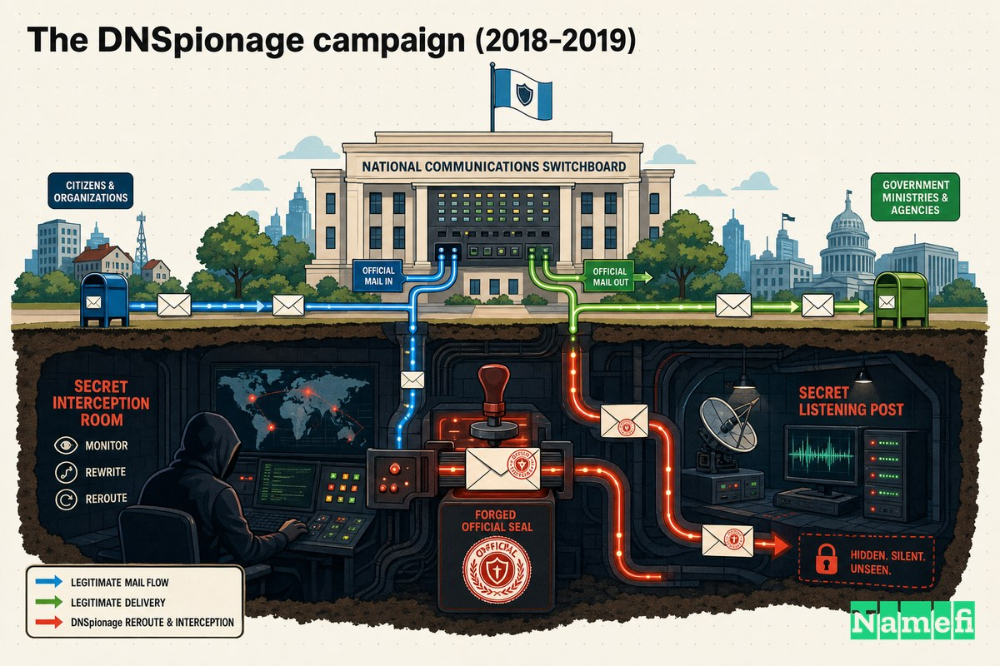
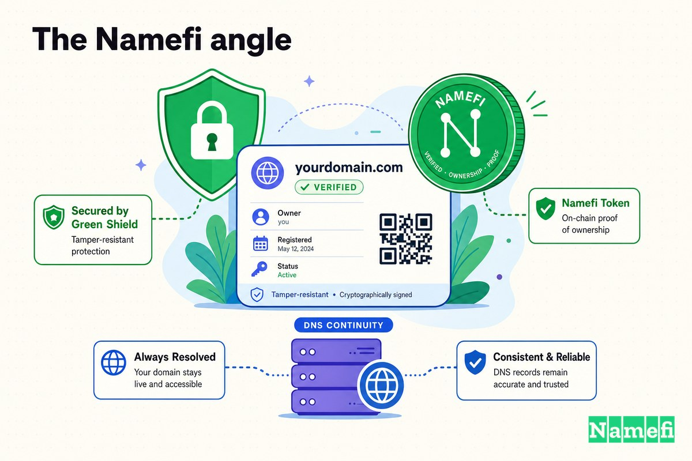

अधिकांश डोमेन आपदाएँ इस बारे में होती हैं कि कोई नाम *किसका* है। यह घटना इस बारे में थी कि उसे *कौन नियंत्रित करता है* — और 2018 के अंत में कुछ महीनों तक, मध्य पूर्व में दर्जनों सरकारी डोमेन के लिए इसका जवाब था: वे सरकारें नहीं।

कोई वेब सर्वर का उल्लंघन नहीं हुआ था। होम पेज पर कोई मालवेयर नहीं था। कोई विरूपण नहीं, कोई फिरौती का नोट नहीं, एप्लिकेशन लॉग में कोई स्पष्ट प्रमाण नहीं। हमलावरों को इमारतों में सेंध लगाने की जरूरत ही नहीं पड़ी। वे उस एकमात्र दरवाजे से अंदर आए जिसकी लगभग कोई रखवाली नहीं करता: **DNS रिकॉर्ड** जो बताता है कि किसी डोमेन के ईमेल और वेबसाइट वास्तव में कहाँ हैं। उन्होंने उसे संपादित किया — चुपचाप, वैध क्रेडेंशियल के साथ, एक वैध TLS प्रमाणपत्र के पीछे — और दुनिया का ट्रैफ़िक बिना किसी शिकायत के नए निर्देशों का पालन करने लगा।

Cisco Talos ने इसे **DNSpionage** नाम दिया। यह रिकॉर्ड पर सबसे स्पष्ट प्रदर्शनों में से एक है कि डोमेन नाम प्रणाली केवल पाइपलाइन नहीं है। यह राष्ट्रीय सुरक्षा का बुनियादी ढांचा है।

## DNS को शासन के हथियार के रूप में

यह समझने के लिए कि DNSpionage ने सरकारों को क्यों हिला दिया, आपको यह याद करना होगा कि DNS वास्तव में क्या करता है।

जब भी आप किसी मंत्रालय को मेल भेजते हैं, कॉर्पोरेट VPN में लॉग इन करते हैं, या वेबमेल पेज लोड करते हैं, तो आपका डिवाइस पहले DNS से एक सवाल पूछता है: *इस नाम का IP पता क्या है?* DNS जो भी जवाब देता है, आप उस पर भरोसा करते हैं। आपका मेल क्लाइंट वहाँ कनेक्ट होता है। आपका VPN वहाँ प्रमाणित होता है। आपका ब्राउज़र वहाँ सत्र सौंपता है। DNS पूरे इंटरनेट की पता पुस्तिका है, और लगभग कोई भी यह जाँच नहीं करता कि पता पुस्तिका संपादित तो नहीं की गई।

यही वह गुण है जिसका DNSpionage ने फायदा उठाया। यदि आप रिकॉर्ड बदल सकते हैं — एन्क्रिप्शन नहीं तोड़ना, पासवर्ड फ़ाइल नहीं क्रैक करना, बस *पॉइंटर* बदलना — तो आप किसी लक्ष्य और उनकी भरोसेमंद सेवाओं के बीच अदृश्य रूप से खड़े हो सकते हैं। ईमेल आपके जरिए जाता है। VPN लॉगिन आपके जरिए जाता है। और क्योंकि पीड़ित का अपना डोमेन नाम ब्राउज़र बार में दिखता रहता है, कुछ भी गलत नहीं लगता।

यह एप्लिकेशन के नीचे की परत पर जासूसी है। यह भी, असुविधाजनक रूप से, वह परत है जिसे अधिकांश सुरक्षा कार्यक्रम हल समस्या मानते हैं।

## DNSpionage अभियान (2018–2019)

**27 नवंबर, 2018** को, Cisco Talos ने अपनी पहली रिपोर्ट प्रकाशित की। शुरुआती पंक्ति विशिष्ट थी: "[Cisco Talos ने हाल ही में लेबनान और संयुक्त अरब अमीरात (UAE) को लक्षित करने वाला एक नया अभियान खोजा है जो .gov डोमेन के साथ-साथ एक निजी लेबनानी एयरलाइन कंपनी को प्रभावित करता है](https://blog.talosintelligence.com/dnspionage-campaign-targets-middle-east/#:~:text=Cisco%20Talos%20recently%20discovered%20a%20new%20campaign%20targeting%20Lebanon%20and%20the%20United%20Arab%20Emirates)।"

अभियान के दो चेहरे थे। एक काफी सामान्य मालवेयर ऑपरेशन था: "[यह विशेष अभियान दो नकली, दुर्भावनापूर्ण वेबसाइटों का उपयोग करता है जिनमें नौकरी पोस्टिंग होती हैं जिनका उपयोग एम्बेडेड मैक्रोज़ के साथ दुर्भावनापूर्ण Microsoft Office दस्तावेज़ों के माध्यम से लक्ष्यों को समझौता करने के लिए किया जाता है](https://blog.talosintelligence.com/dnspionage-campaign-targets-middle-east/#:~:text=This%20particular%20campaign%20utilizes%20two%20fake%2C%20malicious%20websites%20containing%20job%20postings)।" चारा साइटें वास्तविक भर्तीकर्ताओं का नाटक करती थीं — "[hr-wipro[.]com (wipro.com पर पुनर्निर्देशन के साथ) और hr-suncor[.]com (suncor.com पर पुनर्निर्देशन के साथ)](https://blog.talosintelligence.com/dnspionage-campaign-targets-middle-east/#:~:text=hr%2Dwipro)" — और एक कस्टम रिमोट-एक्सेस टूल गिराती थीं जो विशिष्ट रूप से DNS के माध्यम से अपने कमांड सर्वर से बात कर सकता था।

लेकिन दूसरा चेहरा वह है जिसने इतिहास बनाया। Talos के शब्दों में: "[एक अलग अभियान में, हमलावरों ने वैध .gov और निजी कंपनी के डोमेन के DNS को पुनर्निर्देशित करने के लिए उसी IP का उपयोग किया](https://blog.talosintelligence.com/dnspionage-campaign-targets-middle-east/#:~:text=the%20attackers%20used%20the%20same%20IP%20to%20redirect%20the%20DNS%20of%20legitimate)।" वास्तविक सरकारी [नेमसर्वर](/hi/glossary/nameserver/) को हमलावरों के स्वामित्व वाली मशीनों की ओर निर्देशित किया गया था: "[लेबनान और UAE में सार्वजनिक क्षेत्र से संबंधित कई नेमसर्वर, साथ ही लेबनान की कुछ कंपनियाँ, जाहिर तौर पर समझौता किए गए थे, और उनके नियंत्रण में होस्टनाम को हमलावर-नियंत्रित IP पतों की ओर इंगित किया गया था](https://blog.talosintelligence.com/dnspionage-campaign-targets-middle-east/#:~:text=Multiple%20nameservers%20belonging%20to%20the%20public%20sector)।"

नकली नौकरी साइटें वह हिस्सा था जो सामान्य साइबर अपराध जैसा दिखता था। DNS पुनर्निर्देशन वह हिस्सा था जो शासन-कला जैसा दिखता था।

जब तक स्वतंत्र शोधकर्ताओं ने धागा खींचना समाप्त किया, दायरा दो देशों से बहुत बड़ा था। Brian Krebs, हमलावर IP पतों से पीछे की ओर काम करते हुए, ने पाया कि "[2018 के अंतिम कुछ महीनों में DNSpionage के पीछे हैकर्स ने 50 से अधिक मध्य पूर्वी कंपनियों और सरकारी एजेंसियों के DNS इंफ्रास्ट्रक्चर के प्रमुख घटकों को समझौता करने में सफलता पाई](https://krebsonsecurity.com/2019/02/a-deep-dive-on-the-recent-widespread-dns-hijacking-attacks/#:~:text=in%20the%20last%20few%20months%20of%202018%20the%20hackers%20behind%20DNSpionage%20succeeded)।"

## कौन थे लक्ष्य, और दाँव पर क्या था

पीड़ितों की सूची किसी क्षेत्र के तंत्रिका तंत्र के नक्शे जैसी दिखती है: विदेश मंत्रालय, नागरिक उड्डयन, दूरसंचार वाहक, इंटरनेट इंफ्रास्ट्रक्चर, और एक राष्ट्रीय वित्त मंत्रालय का वेबमेल। ये यादृच्छिक निशान नहीं हैं। ये वे स्थान हैं जहाँ से किसी राष्ट्र के रहस्य तारों से गुजरते हैं।

Talos की पहली रिपोर्ट के दो महीने बाद, FireEye (अब Mandiant) ने अपना स्वयं का विश्लेषण प्रकाशित किया और जिम्मेदारी का निर्धारण स्पष्ट लेकिन सावधानीपूर्वक किया। FireEye के अनुसार, "[प्रारंभिक शोध से पता चलता है कि जिम्मेदार अभिनेता या अभिनेताओं का ईरान से संबंध है](https://www.theregister.com/2019/01/10/fireeye_iran_dns_hijacking/#:~:text=initial%20research%20suggests%20the%20actor%20or%20actors%20responsible%20have%20a%20nexus%20to%20Iran)।" FireEye के निष्कर्षों पर रिपोर्टिंग करते हुए, SecurityWeek ने नोट किया कि फर्म ने "[मध्यम विश्वास](https://www.securityweek.com/iran-linked-dns-hijacking-attacks-target-organizations-worldwide/#:~:text=moderate%20confidence)" के साथ आकलन किया कि ईरान हमलों के पीछे था, तकनीकी सबूत और इस तथ्य के आधार पर कि अभियान ईरानी सरकार के हितों के अनुरूप था।

दाँव सीधे लक्ष्यों से जुड़े थे। जब आप किसी विदेश मंत्रालय के ईमेल को सादे पाठ में पढ़ सकते हैं, तो आप डेटा नहीं चुरा रहे — आप लगभग वास्तविक समय में एक सरकार के मन को पढ़ रहे हैं। इसीलिए DNS परत पर एक क्रेडेंशियल-हार्वेस्टिंग अभियान को ठीक से धोखाधड़ी के रूप में नहीं बल्कि राज्य के खिलाफ खुफिया संग्रह के रूप में समझा जाता है।

## यह कैसे हुआ: DNS रिकॉर्ड + वैध प्रमाणपत्र + नकली नौकरी साइटें

यहाँ वह हिस्सा है जिस पर धीमे होकर ध्यान देना उचित है, क्योंकि तकनीक सबसे बुरे तरीके से सुरुचिपूर्ण है। तीन चालें थीं।

**पहली चाल: पता पुस्तिका की चाबियाँ प्राप्त करें।** हमलावरों ने DNS क्रिप्टोग्राफी को क्रैक नहीं किया। वे लॉग इन हुए। FireEye ने दो रास्ते बताए: "[एक तरीके में समझौता किए गए क्रेडेंशियल का उपयोग करके DNS प्रदाता के प्रशासन इंटरफ़ेस में लॉग इन करना और ईमेल ट्रैफ़िक को इंटरसेप्ट करने के प्रयास में DNS A रिकॉर्ड बदलना शामिल है। दूसरे तरीके में पीड़ित के डोमेन रजिस्ट्रार खाते को हैक करने के बाद DNS NS रिकॉर्ड बदलना शामिल है](https://www.securityweek.com/iran-linked-dns-hijacking-attacks-target-organizations-worldwide/#:~:text=One%20method%20involves%20logging%20into%20a%20DNS%20provider)।" चोरी किए गए [रजिस्ट्रार](/hi/glossary/registrar/) और DNS-होस्ट क्रेडेंशियल मास्टर कुंजी थे। जो भी रजिस्ट्रार लॉगिन रखता है वह डोमेन रखता है — और डोमेन उस पर इंगित हर चीज को रखता है।

**दूसरी चाल: ट्रैफ़िक को पुनर्निर्देशित करें ताकि वह अभी भी काम करे।** किसी सरकार के मेल सर्वर को अपने IP पर निर्देशित करना सामान्यतः चीजें तोड़ देता और अलार्म बजाता। इसलिए हमलावरों ने प्रॉक्सी का उपयोग किया। ट्रैफ़िक को पकड़ने के बाद वास्तविक गंतव्य की ओर रिले किया गया, इसलिए उपयोगकर्ताओं ने एक काम करने वाला इनबॉक्स और एक काम करने वाला VPN देखा। FireEye ने तीसरे वेरिएंट का वर्णन इस प्रकार किया: "[उपयोगकर्ताओं को हमलावर-नियंत्रित इंफ्रास्ट्रक्चर पर पुनर्निर्देशित किया गया था](https://www.securityweek.com/iran-linked-dns-hijacking-attacks-target-organizations-worldwide/#:~:text=users%20were%20redirected%20to%20attacker%2Dcontrolled%20infrastructure)।" अवरोधन एक मैन-इन-द-मिडल था जो चुपचाप फॉरवर्ड करता था — अदृश्य ठीक इसलिए क्योंकि कुछ भी विफल नहीं हुआ।

**तीसरी चाल: हरे पैडलॉक को हराएं।** आधुनिक सेवाएँ TLS का उपयोग करती हैं, जिसे जैसे ही ट्रैफ़िक गलत सर्वर पर पहुँचे तो प्रमाणपत्र चेतावनी देनी चाहिए। हमलावरों ने इस अंतराल को अपने स्वयं के वैध प्रमाणपत्र बनाकर बंद किया। Talos ने पाया कि "[प्रत्येक DNS समझौते के दौरान, अभिनेता ने पुनर्निर्देशित डोमेन के लिए सावधानीपूर्वक Let's Encrypt प्रमाणपत्र उत्पन्न किए](https://blog.talosintelligence.com/dnspionage-campaign-targets-middle-east/#:~:text=During%20each%20DNS%20compromise%2C%20the%20actor%20carefully%20generated)।" क्योंकि वे अब डोमेन के लिए DNS को नियंत्रित करते थे, वे एक प्रमाणपत्र प्राधिकरण को नियंत्रण *साबित* कर सकते थे — और स्वचालित डोमेन सत्यापन ने उन्हें एक वैध प्रमाणपत्र दे दिया। FireEye ने तरीकों में समान पैटर्न की पुष्टि की: "[दोनों मामलों में हमलावरों ने संदेह उठाने से बचने के लिए Let's Encrypt प्रमाणपत्रों का उपयोग किया](https://www.securityweek.com/iran-linked-dns-hijacking-attacks-target-organizations-worldwide/#:~:text=in%20both%20cases%20the%20attackers%20used%20Let%E2%80%99s%20Encrypt%20certificates)।"

Krebs के सारांश में परिणाम पूर्ण था: "[इन DNS हाइजैक ने हमलावरों के लिए लक्षित डोमेन (जैसे webmail.finance.gov.lb) के लिए SSL एन्क्रिप्शन प्रमाणपत्र प्राप्त करने का मार्ग भी प्रशस्त किया, जिसने उन्हें इंटरसेप्ट किए गए ईमेल और VPN क्रेडेंशियल को डिक्रिप्ट करने और उन्हें सादे पाठ में देखने की अनुमति दी](https://krebsonsecurity.com/2019/02/a-deep-dive-on-the-recent-widespread-dns-hijacking-attacks/#:~:text=these%20DNS%20hijacks%20also%20paved%20the%20way%20for%20the%20attackers%20to%20obtain%20SSL%20encryption%20certificates)।" ईमेल और VPN लॉगिन, पूरे समय वैध पैडलॉक के साथ, कैप्चर किए गए और पठनीय।

ध्यान दें कि क्या *आवश्यक नहीं* था। कोई जीरो-डे नहीं। पीड़ित के अपने सर्वर पर कोई मालवेयर नहीं। कोई पराजित फ़ायरवॉल नहीं। हमला पूरी तरह "मैं इस डोमेन का मालिक हूँ" और "मैं साबित कर सकता हूँ कि इसके रिकॉर्ड को अभी कौन नियंत्रित करता है" के बीच के अंतराल में रहा। वह अंतराल वहीं था जहाँ DNSpionage रहा — और यह अधिकांश संगठनों की सोच से व्यापक है।

## प्रतिक्रिया: CISA आपातकालीन निर्देश 19-01

Talos और FireEye के संयुक्त खुलासों ने वाशिंगटन में भारी असर डाला। **22 जनवरी, 2019** को, अमेरिकी साइबर सुरक्षा और इंफ्रास्ट्रक्चर सुरक्षा एजेंसी ने **आपातकालीन निर्देश 19-01, "DNS इंफ्रास्ट्रक्चर छेड़छाड़ को कम करें"** जारी किया — CISA द्वारा कभी जारी किया गया पहला आपातकालीन निर्देश, और पूरे संघीय नागरिक सरकार पर बाध्यकारी एक दुर्लभ निर्देश।

निर्देश का निदान शोध से बिल्कुल मेल खाता था। समकालीन रिपोर्टिंग में उद्धृत के अनुसार, CISA ने चेतावनी दी कि "[हमलावरों ने वेब और मेल ट्रैफ़िक को पुनर्निर्देशित और इंटरसेप्ट किया है, और अन्य नेटवर्क सेवाओं के लिए भी ऐसा कर सकते हैं](https://www.bleepingcomputer.com/news/security/dhs-issues-emergency-directive-to-prevent-dns-hijacking-attacks/#:~:text=redirected%20and%20intercepted%20web%20and%20mail%20traffic)," और अभिनेताओं ने "[सरकारी DNS डोमेन के प्रभारी प्रशासकों के खातों से समझौता किया था](https://www.bleepingcomputer.com/news/security/dhs-issues-emergency-directive-to-prevent-dns-hijacking-attacks/#:~:text=compromised%20the%20accounts%20of%20administrators)।"

फिर इसने 10 दिन की समयसीमा पर चार कार्रवाइयाँ निर्देशित कीं — और वे हमलावर की तीन चालों में से प्रत्येक के प्रत्यक्ष खंडन जैसी पढ़ी जाती हैं:

1. **अपने DNS रिकॉर्ड की ऑडिट करें** — सत्यापित करें कि आधिकारिक और द्वितीयक सर्वरों पर कुछ भी छेड़छाड़ नहीं किया गया है।
2. **DNS खाता पासवर्ड बदलें** — हर उस क्रेडेंशियल को रोटेट करें जो DNS संपादित कर सकता है।
3. **सभी DNS व्यवस्थापक खातों में बहु-कारक प्रमाणीकरण जोड़ें** — ताकि चोरी किया गया पासवर्ड अकेले मास्टर कुंजी न रहे।
4. **प्रमाणपत्र पारदर्शिता लॉग की निगरानी करें** — अपने डोमेन के लिए जारी किए गए उन प्रमाणपत्रों की तलाश करें जो आपने कभी अनुरोध नहीं किए।

चौथा आइटम संकेत है। CISA केवल एजेंसियों को दरवाजा बंद करने के लिए नहीं कह रहा था; यह उन्हें सार्वजनिक प्रमाणपत्र लेजर देखने के लिए कह रहा था इस सबूत के लिए कि किसी ने पहले से चाबी की कॉपी का उपयोग किया है। DNSpionage ने प्रमाणपत्र पारदर्शिता को एक आला PKI सुविधा से राष्ट्र-राज्य [DNS हाइजैकिंग](/hi/glossary/dns-hijacking/) के लिए अग्रिम पंक्ति की पहचान उपकरण में बदल दिया था।

Krebs ने इस क्षण की असामान्यता को सरल रूप से व्यक्त किया: "[अमेरिकी गृह सुरक्षा विभाग ने सभी अमेरिकी संघीय नागरिक एजेंसियों को अपने इंटरनेट डोमेन रिकॉर्ड के लिए लॉगिन क्रेडेंशियल को सुरक्षित करने का आदेश देते हुए एक दुर्लभ आपातकालीन निर्देश जारी किया](https://krebsonsecurity.com/2019/02/a-deep-dive-on-the-recent-widespread-dns-hijacking-attacks/#:~:text=issued%20a%20rare%20emergency%20directive%20ordering%20all%20U.S.%20federal%20civilian%20agencies)।"

DNSpionage ने इसे प्रेरित करने में अकेले काम नहीं किया। एक समानांतर, और भी आक्रामक ऑपरेशन जिसे Talos ने **Sea Turtle** कहा — जिसे Talos ने "[एक डोमेन नाम रजिस्ट्री संगठन का पहला ज्ञात मामला जिसे साइबर जासूसी ऑपरेशन के लिए समझौता किया गया था](https://www.networkworld.com/article/967285/cisco-talos-details-exceptionally-dangerous-dns-hijacking-attack.html#:~:text=first%20known%20case%20of%20a%20domain%20name%20registry%20organization%20that%20was%20compromised)" बताया, जो "[13 अलग-अलग देशों में लगभग 40 अलग-अलग संगठनों](https://www.networkworld.com/article/967285/cisco-talos-details-exceptionally-dangerous-dns-hijacking-attack.html#:~:text=approximately%2040%20different%20organizations%20across%2013%20different%20countries)" को प्रभावित करता था — ने दाँव को और ऊँचा किया। Talos ने दोनों को अलग रखने में सावधानी बरती; अपने अप्रैल 2019 के अनुवर्ती में उसने नोट किया कि DNSpionage का व्यवहार "[Sea Turtle जैसे अधिक चिंताजनक अभियानों से इस अभिनेता को अलग करता रहेगा](https://blog.talosintelligence.com/dnspionage-brings-out-karkoff/#:~:text=will%20likely%20continue%20to%20distinguish%20this%20actor%20from%20more%20concerning%20campaigns%20like%20Sea%20Turtle)।" साथ में, दोनों अभियानों ने अलग-अलग कोणों से एक ही बात साबित की: DNS आपूर्ति श्रृंखला राज्य संघर्ष का एक मंच बन गई थी।

## यह DNS को राष्ट्रीय-सुरक्षा इंफ्रास्ट्रक्चर के रूप में क्या सिखाता है

DNSpionage में मालवेयर नाटक की कमी और असुविधाजनक सबक की भरमार है। कुछ जो ध्यान रखने योग्य हैं:

- **रजिस्ट्रार खाता एक ताज की मणि है।** एक डोमेन के नीचे सब कुछ — मेल, वेब, VPN, सिंगल साइन-ऑन, प्रमाणपत्र जारी करना — उसके DNS को संपादित करने वाले किसी भी व्यक्ति के भरोसे को विरासत में लेता है। उस खाते पर एक पासवर्ड और बिना दूसरे कारक के एक छोटा अंतराल नहीं है; यह पूरा किला है जिसका द्वार खुला है। CISA के पहले निर्देश *क्रेडेंशियल* के बारे में थे, फ़ायरवॉल के बारे में नहीं, ठीक इसी कारण से।
- **एक वैध प्रमाणपत्र वैधता का प्रमाण नहीं है।** हरा पैडलॉक साबित करता है कि ट्रैफ़िक *जो भी अभी डोमेन को नियंत्रित करता है* को एन्क्रिप्ट किया गया है। यदि कोई हमलावर DNS को नियंत्रित करता है, तो स्वचालित डोमेन सत्यापन खुशी से उन्हें एक वास्तविक प्रमाणपत्र जारी करेगा। TLS में भरोसा DNS में भरोसे से उधार लिया गया है — और DNS अधिकांश लोगों की धारणा से नरम है।
- **DNS हमले डिज़ाइन से अदृश्य हैं।** क्योंकि प्रॉक्सी वास्तविक ट्रैफ़िक को फॉरवर्ड करती है, पीड़ित की सेवाएँ काम करती रहती हैं। जाँच करने के लिए कोई आउटेज नहीं है। एकमात्र बाहरी संकेत एक सार्वजनिक CT लॉग में दिखने वाला प्रमाणपत्र हो सकता है — इसीलिए उन लॉग की निगरानी रातोरात वैकल्पिक से अनिवार्य हो गई।
- **डोमेन नियंत्रण एक राष्ट्रीय-सुरक्षा नियंत्रण है।** जब विदेश मंत्रालय के DNS को संपादित करने वाली इकाई एक शत्रुतापूर्ण राज्य है, तो "IT संचालन" और "जवाबी खुफिया" के बीच का अंतर ढह जाता है। इंटरनेट की पता पुस्तिका रणनीतिक क्षेत्र है।

मूल धागा एक एकल प्रश्न है जिसका कोई भी परिचालन उपकरण वास्तविक समय में जवाब नहीं देता: **अभी वास्तव में इस डोमेन को कौन नियंत्रित करता है, और क्या मैं साबित कर सकता हूँ कि यह चुपचाप नहीं बदला?** DNSpionage काम किया क्योंकि वह प्रश्न इतना कठिन था कि एक पूरे क्षेत्र की सरकारें उत्तर नहीं दे सकीं।

## Namefi का दृष्टिकोण

DNSpionage, अपने मूल में, एक **उत्पत्ति** की समस्या है। हमलावरों ने कभी भी लक्षित डोमेन का स्वामित्व नहीं किया। उन्होंने उन क्रेडेंशियल को चुराकर उनका नियंत्रण उधार लिया जो रजिस्ट्रार और DNS-होस्ट पैनल को चुप्पी से, अप्रमाणित संपादन करने देते थे — और सिस्टम में कुछ भी इस बात पर ध्यान नहीं दिया कि नियंत्रण में *पक्ष* बदल गया था।

[Namefi](https://namefi.io) इस आधार पर बना है कि [डोमेन स्वामित्व](/hi/glossary/domain-ownership/) और नियंत्रण एक अपारदर्शी रजिस्ट्रार लॉगिन के अंदर बंद रहने के बजाय **सत्यापन योग्य, पोर्टेबल और छेड़छाड़-स्पष्ट** होना चाहिए। टोकनाइज्ड स्वामित्व "इस नाम को कौन नियंत्रित करता है" को एक ऐसा तथ्य बनाता है जिसे आप जाँच और ऑडिट कर सकते हैं, न कि एक सेटिंग जो किसी पासवर्ड के पीछे दफ्न है जो पहले से ही किसी और के हाथों में हो सकता है। यह रजिस्ट्रार-खाता स्वच्छता या बहु-कारक प्रमाणीकरण की जगह नहीं लेता — CISA की सलाह बिल्कुल सही है — लेकिन यह उस गहरे अंतराल पर हमला करता है जिसका DNSpionage ने फायदा उठाया: यह *साबित* करने की कठिनाई, स्वतंत्र और निरंतर रूप से, कि किसी डोमेन को नियंत्रित करने वाला पक्ष वह पक्ष है जिसे होना चाहिए।

DNSpionage का सबक यह नहीं है कि DNS किसी विदेशी तरीके से नाजुक है। यह है कि किसी डोमेन के बारे में सबसे महत्वपूर्ण तथ्य — उसे कौन नियंत्रित करता है — के बीच में बहुत लंबे समय तक केवल एक चोरी किया हुआ पासवर्ड खड़ा था। उस तथ्य को सत्यापन योग्य बनाना ही पूरा बिंदु है।

## स्रोत और आगे पढ़ें

- Cisco Talos — [DNSpionage Campaign Targets Middle East](https://blog.talosintelligence.com/dnspionage-campaign-targets-middle-east/) (27 नवंबर, 2018)
- Cisco Talos — [DNSpionage brings out the Karkoff](https://blog.talosintelligence.com/dnspionage-brings-out-karkoff/) (23 अप्रैल, 2019)
- Krebs on Security — [A Deep Dive on the Recent Widespread DNS Hijacking Attacks](https://krebsonsecurity.com/2019/02/a-deep-dive-on-the-recent-widespread-dns-hijacking-attacks/) (18 फरवरी, 2019)
- The Register — [Baddies linked to Iran fingered for DNS hijacking to read Middle Eastern regimes' emails](https://www.theregister.com/2019/01/10/fireeye_iran_dns_hijacking/) (10 जनवरी, 2019)
- SecurityWeek — [Iran-Linked DNS Hijacking Attacks Target Organizations Worldwide](https://www.securityweek.com/iran-linked-dns-hijacking-attacks-target-organizations-worldwide/) (10 जनवरी, 2019)
- BleepingComputer — [DHS Issues Emergency Directive to Prevent DNS Hijacking Attacks](https://www.bleepingcomputer.com/news/security/dhs-issues-emergency-directive-to-prevent-dns-hijacking-attacks/) (जनवरी 2019)
- Network World — [Cisco Talos details exceptionally dangerous DNS hijacking attack](https://www.networkworld.com/article/967285/cisco-talos-details-exceptionally-dangerous-dns-hijacking-attack.html) (17 अप्रैल, 2019)
- Network World — [Cisco: DNSpionage attack adds new tools, morphs tactics](https://www.networkworld.com/article/967303/cisco-dnspionage-attack-adds-new-tools-morphs-tactics.html)
- CERT-IST — [DNSpionage and DNS data hijacking](https://www.cert-ist.com/public/en/SO_detail?format=html&code=dnspionage)
- CISA — [Emergency Directive 19-01: Mitigate DNS Infrastructure Tampering](https://www.cisa.gov/news-events/directives/ed-19-01-mitigate-dns-infrastructure-tampering-closed) (22 जनवरी, 2019)
