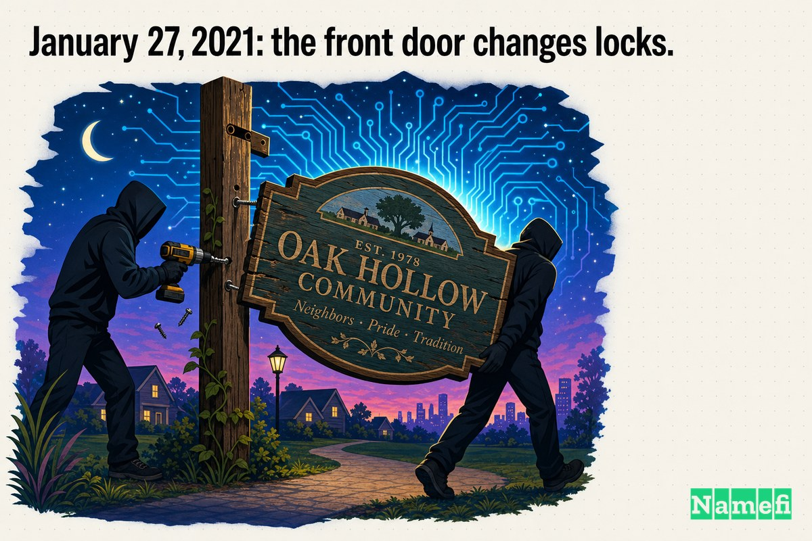
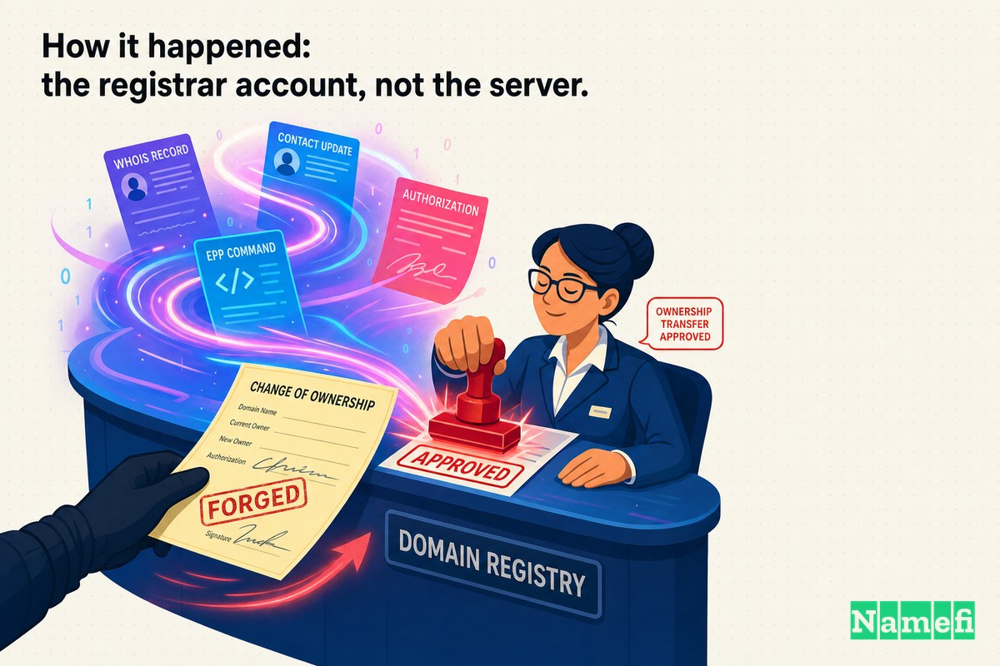
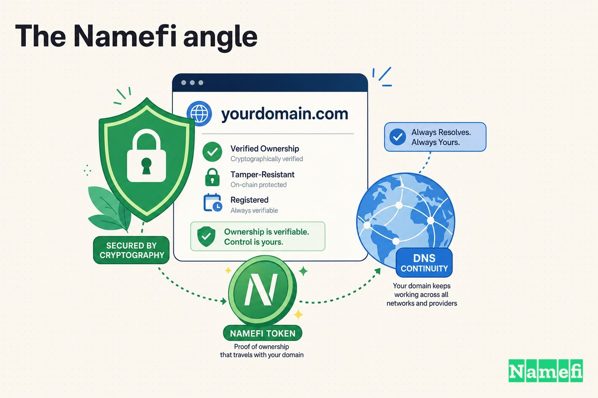

कुछ डोमेन ऐसे इंफ्रास्ट्रक्चर होते हैं जो बस एक नाम की तरह दिखते हैं। **perl.com** उनमें से एक है। यह कोई मार्केटिंग एसेट या कोई ऐसा ब्रांड नहीं है जिसे किसी ने पिछले साल बनाया हो — यह इंटरनेट फर्नीचर का एक टुकड़ा है जिसके इर्द-गिर्द Perl प्रोग्रामिंग कम्युनिटी वेब के शुरुआती दिनों से रहती आई है, दस्तावेज़ीकरण, लेखों और भाषा के सार्वजनिक चेहरे का एकमात्र प्रमुख द्वार।

तो जब 27 जनवरी 2021 की सुबह यह मुख्य द्वार अचानक किसी और का हो गया, तो यह कोई चतुर ब्रांड चाल या सहमति से हुई बिक्री नहीं थी। यह एक चोरी थी। डोमेन को महीनों पहले ही उसके असली मालिक के नियंत्रण से चुपके से निकाल लिया गया था, [रजिस्ट्रार](/hi/glossary/registrar/)ों के बीच उछाला गया था, और एक ऐसे IP पते पर इंगित किया गया था जिसका मैलवेयर वितरित करने का इतिहास था। कम्युनिटी के नेटवर्क ऑपरेटरों ने इसे सीधे शब्दों में कहा: ["The perl.com domain was hijacked this morning, and is currently pointing to a parking site."](https://log.perl.org/2021/01/perlcom-hijacked.html#:~:text=The%20perl.com%20domain%20was%20hijacked%20this%20morning%2C%20and%20is%20currently%20pointing%20to%20a%20parking%20site.)

यह हमारी Domain Mayday श्रृंखला की EP19 की कहानी है: कैसे एक तीस साल पुराना कम्युनिटी डोमेन बिना किसी सर्वर को तोड़े चुराया गया, और इसे वापस पाने में क्या लगा।

## 90 के दशक की शुरुआत से रखा गया एक डोमेन

चोरी को समझने के लिए, आपको यह समझना होगा कि सेटअप कितना सामान्य था — और वह सामान्यता ही कमज़ोरी थी।

perl.com किसी कठोर कॉर्पोरेट तिजोरी में नहीं था। यह उस तरह से रखा गया था जैसे अधिकांश पुराने डोमेन रखे जाते हैं: एक भरोसेमंद व्यक्ति द्वारा, एक मुख्यधारा के रजिस्ट्रार पर, बिना किसी नाटक के साल दर साल नवीनीकृत। साइट के संपादक, brian d foy, ने बाद में घटना के अपने विवरण में वंशावली का वर्णन किया: ["This domain was registered in the early 90s, Tom Christiansen was given control of it shortly after that, and basically kept paying the registration fees."](https://www.perl.com/article/the-hijacking-of-perl-com/#:~:text=This%20domain%20was%20registered%20in%20the%20early%2090s%2C%20Tom%20Christiansen%20was%20given%20control%20of%20it%20shortly%20after%20that%2C%20and%20basically%20kept%20paying%20the%20registration%20fees.)

इंटरनेट के सबसे महत्वपूर्ण नामों के एक बड़े हिस्से की यही प्रोफ़ाइल है। एक व्यक्ति, एक रजिस्ट्रार लॉगिन, और तीन दशकों तक चुपचाप बिल भरते रहना। यह परफेक्ट काम करता है — ठीक उसी समय तक जब रजिस्ट्रार अकाउंट खुद ही निशाना बन जाए।

## 27 जनवरी 2021: मुख्य द्वार के ताले बदल गए

पहला सार्वजनिक अलार्म उन लोगों की तरफ से आया जो Perl कम्युनिटी का इंफ्रास्ट्रक्चर चलाते हैं। Perl NOC (नेटवर्क ऑपरेशंस सेंटर) ब्लॉग ने पोस्ट किया कि डोमेन को "इस सुबह" हाईजैक किया गया है और अब यह कहीं और इंगित हो रहा है जहाँ नहीं होना चाहिए। एक साधारण पार्किंग पेज से भी बदतर, ऑपरेटरों ने चेतावनी दी कि ["there are some signals that it may be related to sites that have distributed malware in the past."](https://log.perl.org/2021/01/perlcom-hijacked.html#:~:text=there%20are%20some%20signals%20that%20it%20may%20be%20related%20to%20sites%20that%20have%20distributed%20malware%20in%20the%20past.)

brian d foy ने उसी दिन इसे सार्वजनिक रूप से उठाया। घटना पर रिपोर्टिंग ने समय को स्पष्ट शब्दों में पुष्टि की: ["On January 27th, Perl programming author and Perl.com editor brian d foy tweeted that the perl.com domain was suddenly registered under another person."](https://www.bleepingcomputer.com/news/security/perlcom-domain-stolen-now-using-ip-address-tied-to-malware/#:~:text=On%20January%2027th%2C%20Perl%20programming%20author%20and%20Perl.com%20editor%20brian%20d%20foy)

कम्युनिटी की प्रतिक्रिया तेज़ और व्यावहारिक थी। रिकवरी का काम शुरू होते ही, NOC ने पाठकों को एक बैकअप पर रीडायरेक्ट किया: ["If you're looking for the content, you can visit perldotcom.perl.org."](https://log.perl.org/2021/01/perlcom-hijacked.html#:~:text=you%20can%20visit%20perldotcom.perl.org) कैनोनिकल नाम चला गया था, लेकिन सामग्री सुलभ रही।

## जो खतरे में था: मैलवेयर से जुड़ा IP

एक चोरी हुआ डोमेन उस विश्वास के अनुपात में खतरनाक होता है जो वह वहन करता है — और perl.com बहुत अधिक विश्वास वहन करता था। लाखों डेवलपर, ट्यूटोरियल, CPAN टूलिंग, और वेब भर में पुराने लिंक सब उसकी तरफ इशारा करते थे। जो भी नाम को नियंत्रित करता था वह नियंत्रित करता था कि यह सारा विश्वास किस पर जाकर रुकता है।

और नए मालिक ने इसे किसी हानिरहित जगह पर इंगित नहीं किया। जैसा BleepingComputer ने दस्तावेज़ीकरण किया, ["The domain name perl.com was stolen and now points to an IP address associated with malware campaigns."](https://www.bleepingcomputer.com/news/security/perlcom-domain-stolen-now-using-ip-address-tied-to-malware/#:~:text=The%20domain%20name%20perl.com%20was%20stolen%20and%20now%20points%20to%20an%20IP%20address%20associated%20with%20malware%20campaigns.)

तकनीकी फिंगरप्रिंट विशिष्ट थे। DNS रिकॉर्ड इस तरह से फिर से लिखे गए कि ["the IP addresses assigned to the domain were changed from 151.101.2.132 to the Google Cloud IP address 35.186.238[.]101."](https://www.bleepingcomputer.com/news/security/perlcom-domain-stolen-now-using-ip-address-tied-to-malware/#:~:text=the%20IP%20addresses%20assigned%20to%20the%20domain%20were%20changed%20from%20151.101.2.132%20to%20the%20Google%20Cloud%20IP%20address) उस गंतव्य का एक अतीत था: ["In 2019, the IP address 35.186.238[.]101 was tied to a domain distributing a malware executable for the now-defunct Locky ransomware."](https://www.bleepingcomputer.com/news/security/perlcom-domain-stolen-now-using-ip-address-tied-to-malware/#:~:text=In%202019%2C%20the%20IP%20address%2035.186.238%5B.%5D101%20was%20tied%20to%20a%20domain%20distributing%20a%20malware%20executable%20for%20the%20now%2Ddefunct%20Locky%20ransomware.)

इन दो तथ्यों को मिलाकर देखें तो खतरा स्पष्ट है। एक नाम जिस पर डेवलपर सहज रूप से भरोसा करते हैं, अचानक मैलवेयर इतिहास वाले IP पर रिज़ॉल्व हो रहा है — यह ठीक उस तकनीकी, सुरक्षा-सचेत दर्शकों को धोखा देने के लिए एकदम सटीक सेटअप है जिन्हें आमतौर पर बेवकूफ बनाना मुश्किल होता है।

## कैसे हुआ: रजिस्ट्रार अकाउंट, न कि सर्वर

यहाँ वह हिस्सा है जो इस घटना को एक फुटनोट की बजाय एक पाठ्यपुस्तक का मामला बनाता है: किसी ने perl.com के वेब सर्वर को हैक नहीं किया, और किसी ने DNS पासवर्ड का अनुमान नहीं लगाया। हमला एक परत ऊपर, रजिस्ट्रार पर हुआ — वह कंपनी जो इस बारे में आधिकारिक रिकॉर्ड रखती है कि नाम का मालिक कौन है।

अपने पोस्ट-मॉर्टम में, brian d foy ने कार्यकारी सिद्धांत का सीधे वर्णन किया: ["We think that there was a social engineering attack on Network Solutions, including phony documents and so on."](https://www.perl.com/article/the-hijacking-of-perl-com/#:~:text=We%20think%20that%20there%20was%20a%20social%20engineering%20attack%20on%20Network%20Solutions%2C%20including%20phony%20documents%20and%20so%20on.) प्रेस ने भी इसे उसी तरह से तैयार किया: चोरी ["a social engineering attack that convinced registrar Network Solutions to alter the domain's records without valid authorization."](https://www.theregister.com/2021/03/02/perl_domain_theft/#:~:text=a%20social%20engineering%20attack%20that%20convinced%20registrar%20Network%20Solutions%20to%20alter%20the%20domain%27s%20records%20without%20valid%20authorization) थी।

सबसे अधिक परेशान करने वाला विवरण समयरेखा है। कम्युनिटी ने जनवरी में ही *ध्यान दिया*, लेकिन वास्तविक समझौता कहीं अधिक पुराना था। डोमेन अटॉर्नी John Berryhill द्वारा सामने लाई गई फोरेंसिक जांच ने असली तारीख को महीनों पीछे धकेल दिया; जैसा perl.com के अकाउंट में दर्ज है, ["John Berryhill provided some forensic work in Twitter that showed the compromise actually happened in September."](https://www.perl.com/article/the-hijacking-of-perl-com/#:~:text=John%20Berryhill%20provided%20some%20forensic%20work%20in%20Twitter%20that%20showed%20the%20compromise%20actually%20happened%20in%20September.) SecurityWeek ने हमलावर के धैर्य की पुष्टि की: ["The attack, he explains, took place in September 2020"](https://www.securityweek.com/hackers-control-perlcom-domain-months-hijack/#:~:text=The%20attack%2C%20he%20explains%2C%20took%20place%20in%20September%202020) — किसी के प्रभाव देखने से लगभग चार महीने पहले।

इतना लंबा इंतजार क्यों? क्योंकि डोमेन ट्रांसफर के नियम धैर्य को पुरस्कृत करते हैं। ["ICANN prohibits the transfer of a domain for 60 days following the updating of contact info."](https://www.securityweek.com/hackers-control-perlcom-domain-months-hijack/#:~:text=ICANN%20prohibits%20the%20transfer%20of%20a%20domain%20for%2060%20days%20following%20the%20updating%20of%20contact%20info.) एक हमलावर जो सितंबर में चुपचाप रजिस्ट्रार अकाउंट पर कब्ज़ा कर लेता है, तुरंत डोमेन को नहीं ले जा सकता — तो वे उस पर बैठे रहे, घड़ी चलने दी, और लॉक समाप्त होते ही अपनी चाल चली।

जब वे अंततः चले, तो उन्होंने रिकवरी को कठिन बनाने के लिए नाम को रजिस्ट्रारों और सीमाओं के पार धोया। The Register ने पहले चरण का दस्तावेज़ीकरण किया: ["The domain was transferred to the BizCN registrar in December, but the nameservers were not changed."](https://www.theregister.com/2021/03/02/perl_domain_theft/#:~:text=The%20domain%20was%20transferred%20to%20the%20BizCN%20registrar%20in%20December%2C%20but%20the%20nameservers%20were%20not%20changed) BleepingComputer ने उसी पथ को भौगोलिक रूप से ट्रेस किया: डोमेन ["was stolen in September 2020 while at Network Solutions, transferred to a registrar in China on Christmas Day"](https://www.bleepingcomputer.com/news/security/perlcom-domain-stolen-now-using-ip-address-tied-to-malware/#:~:text=stolen%20in%20September%202020%20while%20at%20Network%20Solutions%2C%20transferred%20to%20a%20registrar%20in%20China%20on%20Christmas%20Day) जनवरी में अंतिम चरण से पहले, जब ["The domain was transferred again in January to another registrar, Key Systems, GmbH."](https://www.theregister.com/2021/03/02/perl_domain_theft/#:~:text=The%20domain%20was%20transferred%20again%20in%20January%20to%20another%20registrar%2C%20Key%20Systems%2C%20GmbH.)

और फिर उन्होंने नकदी निकालने की कोशिश की। नाम को नए सिरे से स्थानांतरित करके, ["the unauthorized registrant tried to sell the domain for $190,000 on domain market Afternic."](https://www.theregister.com/2021/03/02/perl_domain_theft/#:~:text=the%20unauthorized%20registrant%20tried%20to%20sell%20the%20domain%20for%20%24190%2C000%20on%20domain%20market%20Afternic.) तीस साल पुरानी एक कम्युनिटी एसेट, कागज़ात के ज़रिए चुराई गई, पुराने फर्नीचर की तरह बिक्री के लिए सूचीबद्ध।

## रिकवरी: कागज़ात को वापस पलटने के लिए हफ्तों के कागज़ात

वही मशीनरी जिसने चोरी को संभव बनाया — रजिस्ट्रार, [रजिस्ट्री](/hi/glossary/registry/), और स्वामित्व रिकॉर्ड — वापसी का एकमात्र रास्ता भी था। न कोई सर्वर था जिसे फिर से सुरक्षित करना हो और न कोई पैच लगाना था। किसी को रजिस्ट्रार और रजिस्ट्री चेन के ज़रिए *साबित* करना था कि Tom Christiansen असली मालिक हैं और नया "मालिक" एक धोखेबाज है।

वह काम कुछ ही दिनों में शुरू हो गया। 30 जनवरी तक, Perl NOC ने रिपोर्ट किया कि ["Network Solutions is working with Tom Christiansen, the rightful registrant, on the recovery of the Perl.com domain."](https://log.perl.org/2021/01/perlcom-hijacked.html#:~:text=Network%20Solutions%20is%20working%20with%20Tom%20Christiansen%2C%20the%20rightful%20registrant%2C%20on%20the%20recovery%20of%20the%20Perl.com%20domain.) यह प्रयास ["ultimately led to the restoration of the domain to its previous owner, Tom Christiansen, in early February."](https://www.theregister.com/2021/03/02/perl_domain_theft/#:~:text=restoration%20of%20the%20domain%20to%20its%20previous%20owner%2C%20Tom%20Christiansen%2C%20in%20early%20February.)

लेकिन "बहाल" का मतलब "ठीक" नहीं था। brian d foy का अपना वर्णन राहत और अधूरे काम दोनों को पकड़ता है: ["The Perl.com domain is back in the hands of Tom Christiansen and we're working on the various security updates so this doesn't happen again."](https://www.perl.com/article/the-hijacking-of-perl-com/#:~:text=The%20Perl.com%20domain%20is%20back%20in%20the%20hands%20of%20Tom%20Christiansen%20and%20we%27re%20working%20on%20the%20various%20security%20updates%20so%20this%20doesn%27t%20happen%20again.) क्योंकि डोमेन मैलवेयर से जुड़े IP पर इंगित रहा था, सुरक्षा उत्पादों ने इसे ब्लैकलिस्ट कर दिया था और कुछ [DNS रिज़ॉल्वर](/hi/glossary/dns-resolver/) इसे सिंकहोल कर रहे थे। रजिस्ट्री रिकॉर्ड के सही होने के बाद भी, इंटरनेट की प्रतिष्ठा प्रणालियों में नाम को फिर से विश्वसनीय होने में अतिरिक्त सप्ताह लगे — एक लंबी पूंछ जिसने पूरे मामले को लगभग दो महीनों तक खींचा।

foy के शब्दों में मुख्य बात लगभग कम आँकी गई लगती है: ["For a week we lost control of the Perl.com domain."](https://www.perl.com/article/the-hijacking-of-perl-com/#:~:text=For%20a%20week%20we%20lost%20control%20of%20the%20Perl.com%20domain.) एक सप्ताह की सक्रिय चोरी; उससे पहले महीनों का गुप्त समझौता; बाद में हफ्तों की सफाई।

## यह रजिस्ट्रार अकाउंट सुरक्षा और लंबे समय से रखे गए डोमेन के बारे में क्या सिखाता है

perl.com की चोरी इसलिए इतनी शिक्षाप्रद है क्योंकि यहाँ कुछ भी असामान्य नहीं हुआ। इसे सरल करें और सबक असहजता से सामान्य हैं:

1. **आपका रजिस्ट्रार अकाउंट असली मुकुट मणि है।** हर कोई अपने सर्वर और DNS होस्ट को सख्त करता है। लेकिन डोमेन का *स्वामित्व रिकॉर्ड* रजिस्ट्रार पर रहता है, और वह अकाउंट अक्सर एक पासवर्ड और एक सपोर्ट टीम के अलावा किसी चीज़ से सुरक्षित नहीं होता जिसे बदलावों के लिए राजी किया जा सकता है। perl.com वहाँ चुराया गया, न कि एज पर।

2. **सोशल इंजीनियरिंग तकनीकी नियंत्रणों को हरा देती है।** कोई exploit नहीं, पीड़ित की तरफ कोई मैलवेयर नहीं — बस ["phony documents and so on"](https://www.perl.com/article/the-hijacking-of-perl-com/#:~:text=including%20phony%20documents%20and%20so%20on.) जो एक असली रिकॉर्ड को स्थानांतरित करने के लिए पर्याप्त रूप से प्रेरक थे। आपके खुद के लॉगिन पर टू-फैक्टर ऑथेंटिकेशन मदद नहीं करता अगर रजिस्ट्रार के *इंसान* इसे ओवरराइड करने के लिए राजी हो सकते हैं।

3. **लंबे समय से रखे गए डोमेन आसान निशाने होते हैं।** 90 के दशक की शुरुआत में पंजीकृत और तीस साल तक ऑटोपायलट पर नवीनीकृत नाम में पुरानी संपर्क जानकारी, मानवीय विफलता का एकल बिंदु, और एक मालिक जो रोज़ [WHOIS](/hi/glossary/whois/) रिकॉर्ड नहीं देखता, जमा होते जाते हैं। शांत स्थिरता ही वह चीज़ है जो सितंबर के समझौते को जनवरी तक अनदेखा रहने देती है।

4. **ट्रांसफर नियम दोनों तरफ काटते हैं।** अपडेट के बाद 60-दिन का [ट्रांसफर लॉक](/hi/glossary/transfer-lock/) जो मालिकों की *रक्षा* करने वाला था, हमलावर का प्रतीक्षा कक्ष बन गया। धैर्य और रजिस्ट्रारों और सीमाओं के पार लॉन्डरिंग ने एक त्वरित समाधान को एक बहु-पक्षीय, बहु-सप्ताह की रिकवरी में बदल दिया।

5. **रिकवरी चोरी से धीमी है।** नाम चुराने में एक जाली दस्तावेज़ लगा। इसे वापस पाने में रजिस्ट्रार, एक रजिस्ट्री, असली मालिक के साक्ष्य, और फिर ब्लॉकलिस्ट और रिज़ॉल्वर के साथ प्रतिष्ठा पुनर्निर्माण के सप्ताह लगे। चोरी एक लेनदेन है; मुआवज़ा अनेक हैं।

निराशाजनक सारांश: perl.com जैसे डोमेन के लिए, आपके पासवर्ड की ताकत उससे कम मायने रखती है कि क्या आपके रजिस्ट्रार को उसे नजरअंदाज करने के लिए धोखा दिया जा सकता है।

## Namefi का नज़रिया

perl.com की चोरी का हर कदम एक कमज़ोरी पर टिका था: स्वामित्व *किसी और के अकाउंट में एक रिकॉर्ड* था, जिसे कोई भी सही सपोर्ट एजेंट को राजी करके बदल सकता था। हमलावर को कभी मालिक की चाबियों की ज़रूरत नहीं थी। उन्हें रजिस्ट्रार के भरोसे की ज़रूरत थी — और एक जाली पर्ची एक तीस साल पुरानी संपत्ति को दुनिया भर में स्थानांतरित करने और बिक्री के लिए सूचीबद्ध करने के लिए पर्याप्त थी।

[Namefi](https://namefi.io) विपरीत आधार पर बनाया गया है: कि [डोमेन स्वामित्व](/hi/glossary/domain-ownership/) क्रिप्टोग्राफिक रूप से सत्यापन योग्य होना चाहिए और चुपचाप फिर से लिखना मुश्किल होना चाहिए। डोमेन नियंत्रण को एक टोकनाइज़्ड, [ऑन-चेन](/hi/glossary/on-chain/) एसेट के रूप में प्रस्तुत करके जो DNS के साथ संगत रहती है, "इस नाम का मालिक कौन है?" का आधिकारिक उत्तर रजिस्ट्रार के डेटाबेस में एक बदलने वाली लाइन नहीं रहती जिसे एक आश्वस्त करने वाला फोन कॉल बदल सके। ट्रांसफर हस्ताक्षरित, ऑडिटेबल इवेंट बन जाते हैं न कि बैक-ऑफिस कागज़ात — और एक धोखाधड़ी वाले "स्वामित्व परिवर्तन" के पास चलने के लिए कोई शांत दरवाज़ा नहीं होता।

यह perl.com को रातोरात अचोरी नहीं बनाता; रजिस्ट्रार और रजिस्ट्री अभी भी चेन का हिस्सा हैं। लेकिन यह उस सटीक विफलता मोड पर हमला करता है जिसने इस घटना को परिभाषित किया — *तीस सालों तक एक नाम के लिए भुगतान करने* और *यह साबित करने में सक्षम होने, छेड़छाड़-प्रतिरोधी रूप से, कि यह आपका है* के बीच का अंतराल — और यह उस खिड़की को सिकोड़ता है जहाँ कोई भी आपत्ति करने से पहले एक चोरी हुए डोमेन को लॉन्डर किया जा सकता है।

perl.com को अपना मुख्य द्वार वापस मिल गया। इस कड़े सवाल के साथ जो यह एपिसोड पीछे छोड़ जाता है वह यह है कि ताला कभी भी ऐसी चीज़ क्यों था जिसे सही कागज़ात के साथ कोई अजनबी खोल सकता था।

## स्रोत और आगे की पढ़ाई

- The Perl NOC — [perl.com hijacked](https://log.perl.org/2021/01/perlcom-hijacked.html)
- perl.com (brian d foy) — [The Hijacking of Perl.com](https://www.perl.com/article/the-hijacking-of-perl-com/)
- BleepingComputer — [Perl.com domain stolen, now using IP address tied to malware](https://www.bleepingcomputer.com/news/security/perlcom-domain-stolen-now-using-ip-address-tied-to-malware/)
- The Register — [Perl.com theft blamed on social engineering attack](https://www.theregister.com/2021/03/02/perl_domain_theft/)
- SecurityWeek — [Hackers Controlled Perl.com Domain Months Before Hijack](https://www.securityweek.com/hackers-control-perlcom-domain-months-hijack/)
- Security Affairs — [Attackers took over the Perl.com domain in September 2020](https://securityaffairs.com/115208/cyber-crime/perl-com-hijack-september.html)
- The Daily Swig (PortSwigger) — [Domain for popular programming website Perl.com stolen in 'hack'](https://portswigger.net/daily-swig/domain-for-popular-programming-website-perl-com-stolen-in-hack)
- Slashdot — [Perl.com Domain Stolen, Now Using IP Address of Past Malware Campaigns](https://developers.slashdot.org/story/21/01/31/0220252/perlcom-domain-stolen-now-using-ip-address-of-past-malware-campaigns)
- INCIBE-CERT — [The perl.com domain has been hijacked](https://www.incibe.es/en/incibe-cert/publications/cybersecurity-highlights/perlcom-domain-has-been-hijacked)
- GIGAZINE — [Perl.com editors tell the truth about the Perl.com domain hijacking case](https://gigazine.net/gsc_news/en/20210303-hijacking-of-perl-com/)
