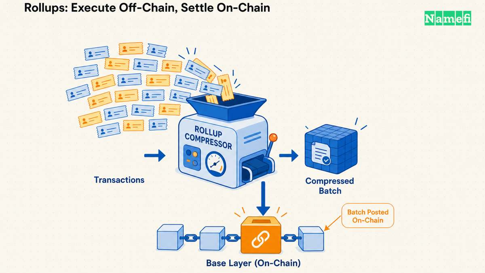
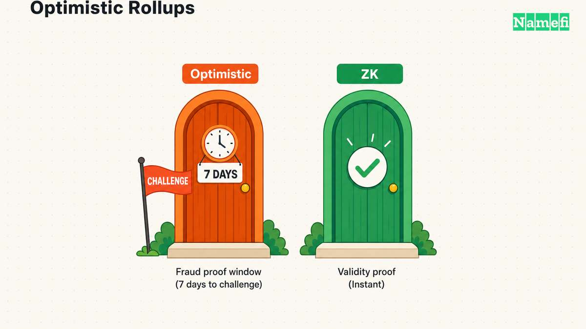
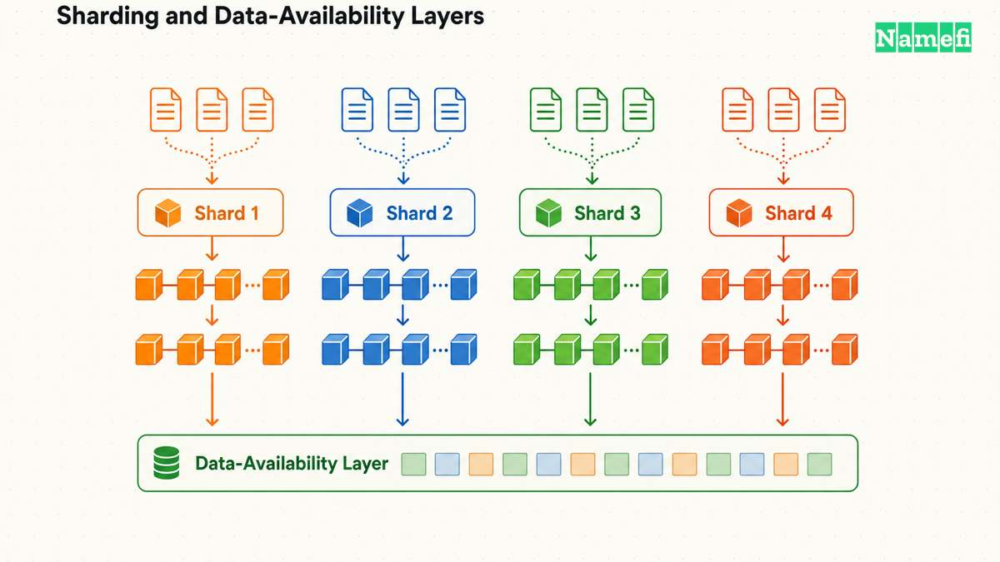

Ethereumメインネットは毎秒約15件のトランザクションを処理します。Visaのような決済ネットワークは毎秒数万件を処理します。この差が、ブロックチェーンにスケーリングが必要な理由です。つまり、すべての参加者にベースチェーン上の全トランザクションを検証させることなく、より多くの処理をこなす方法が必要なのです。過去数年で業界は、[ロールアップ](/ja/glossary/rollup/)、サイドチェーン、ペイメントチャネル、シャーディングといういくつかの異なる手法に収れんしてきました。それぞれがセキュリティ、分散性、コストの間で異なるトレードオフを取ります。

本ガイドでは主要なスケーリング手法を取り上げ、それぞれの仕組みを説明して横並びで比較します。次にプロジェクトのドキュメントで目にしたとき、その違いを明確に理解できるようになります。

---

## スケーラビリティのトリレンマ

Vitalik Buterinが提唱した**スケーラビリティのトリレンマ**は、この分野の大部分を支える思考モデルです。ブロックチェーンは三つの特性を同時に求めます。「スケーラビリティ：通常の単一ノードが検証できる量を超えるトランザクションをチェーンが処理できること」、「分散性：少数の大規模な中央集権的主体への信頼に依存せずチェーンを運用できること」、「セキュリティ：参加ノードの大部分が攻撃を試みてもチェーンが耐えられること」です。しかし従来の設計で実現できるのは三つのうち二つだけです（[vitalik.eth.limo](https://vitalik.eth.limo/general/2021/04/07/sharding.html#:~:text=Scalability%3A%20the%20chain%20can%20process%20more%20transactions%20than%20a%20single%20regular%20node)）。Bitcoinと初期のEthereumは、スループットよりも分散性とセキュリティを選びました。少数の高性能なバリデーターに依存する高TPSチェーンはスケーラビリティとセキュリティを得る一方、分散性を犠牲にします。単純なマルチチェーン設計はスケールしながら分散性を維持できますが、攻撃者が一つのチェーンを侵害するだけで済む場合、安全性を失います。

以下の手法はすべて、実質的に同じ問いへの答えです。三角形の残り二つの頂点を手放さずに、どうすればスループットを高められるのでしょうか。

## ロールアップ：オフチェーンで実行し、オンチェーンで決済する

**[ロールアップ](/ja/glossary/rollup/)**はレイヤー1（L1）の外でトランザクションを実行し、その後、圧縮された要約と基礎となるトランザクションデータをベースチェーンへ投稿します。この種のシステムを追跡する代表的なサービスであるL2BEATは、ロールアップを「Ethereumに定期的に状態コミットメントを投稿するL2」と定義しています。そのコミットメントは「有効性証明によって検証されるか、オプティミスティックに受け入れられ、一定の不正証明期間内に不正証明メカニズムで異議を申し立てることができます」（[l2beat.com](https://l2beat.com/scaling/summary)）。データとコミットメントの両方がL1に記録されるため、誰でもEthereumだけからロールアップの状態を再構築できます。これにより、ユーザーに新たなバリデーター集合を信頼させるのではなく、ロールアップがL1のセキュリティを継承できます。これは、現在多くの人が利用する[レイヤー2](/ja/glossary/layer-2/)ネットワークの基盤技術です。Base、Arbitrum、Optimism、zkSync、Starknetはいずれもロールアップです。

ロールアップは、オフチェーン実行が正しかったことを証明する方法によって二つの系統に分かれます。

### オプティミスティックロールアップ

[オプティミスティックロールアップ](/ja/glossary/optimistic-rollup/)は「オフチェーンのトランザクションを有効と仮定し、トランザクションのバッチに対する有効性証明を公開しません」（[ethereum.org](https://ethereum.org/en/developers/docs/scaling/optimistic-rollups/#:~:text=Optimistic%20rollups%20assume%20offchain%20transactions%20are%20valid%20and%20don%27t%20publish%20proofs%20of%20validity)）。運用者はトランザクションをバッチ化してオフチェーンで実行し、圧縮データをEthereumに投稿します。その後、フルノードを実行する誰もが不正証明でバッチに異議を申し立てられる期間が始まります。L2からL1へ資金を引き出すには、「約七日間続く異議申し立て期間が終了する」まで待つ必要があります（[ethereum.org](https://ethereum.org/en/developers/docs/scaling/optimistic-rollups/#:~:text=the%20challenge%20period%E2%80%94lasting%20roughly%20seven%20days%E2%80%94elapses)）。この一週間の期間があるため、通常のオプティミスティックロールアップからの出金には約一週間かかります。ただし、手数料を支払ってより速く出金できる第三者の流動性プロバイダーを利用する場合は除きます。

オプティミスティックロールアップに必要なのは完全な暗号学的証明パイプラインではなく不正証明システムだけなので、歴史的にはその上で汎用スマートコントラクトをサポートしやすいという利点がありました。**Arbitrum**、**Optimism**、そしてethereum.orgが「OP Stackで構築されたオプティミスティックロールアップ」と説明するCoinbaseのロールアップ**Base**（[ethereum.org](https://ethereum.org/en/layer-2/#:~:text=Base%20is%20an%20Optimistic%20Rollup%20built%20with%20the%20OP%20Stack)）は、現在、利用量が最も多いオプティミスティックロールアップです。

### ZKロールアップ

[ZKロールアップ](/ja/glossary/zk-rollup/)は逆の方法を取ります。有効性を仮定して異議申し立て期間を設ける代わりに、各バッチとともに、バッチの状態遷移が正しいことを示す暗号学的証明である有効性証明を提出します。Ethereumがその証明をオンチェーンで検証するため、「ZKロールアップからEthereumへ資金を移動する際に遅延はありません。ZKロールアップのコントラクトが有効性証明を検証すると出金トランザクションが実行されるためです」（[ethereum.org](https://ethereum.org/en/developers/docs/scaling/zk-rollups/#:~:text=There%20are%20no%20delays%20when%20moving%20funds%20from%20a%20ZK%2Drollup%20to%20Ethereum)）。ZKロールアップは「一つのバッチで数千件のトランザクションを処理し、メインネットには最小限の要約データだけを投稿できます」（[ethereum.org](https://ethereum.org/en/developers/docs/scaling/zk-rollups/#:~:text=ZK%2Drollups%20can%20process%20thousands%20of%20transactions%20in%20a%20batch)）。使用する証明システムには、zk-SNARK（小さな証明と高速な検証）やzk-STARK（透明性があり、信頼されたセットアップが不要）などがあります。**zkSync Era**、**Starknet**（「STARKとCairo VMを基盤とする汎用ZKロールアップ」）（[ethereum.org](https://ethereum.org/en/layer-2/#:~:text=Starknet%20is%20a%20general%20purpose%20ZK%20Rollup%20based%20on%20STARKs%20and%20the%20Cairo%20VM)）、**Linea**が代表的なZKロールアップです。Polygon zkEVMとScrollも、既存のEthereumスマートコントラクトをZK証明可能な環境で実行するためにzkEVMを実装しています。

トレードオフは、有効性証明の生成には大量の計算が必要であり、完全なEVM等価性を実現するには不正証明システムより技術的に難しいことです。ZKロールアップの方が高速なファイナリティを提供するにもかかわらず、オプティミスティックロールアップが先に主流へ普及した理由の一つです。

## サイドチェーン

**サイドチェーン**は「Ethereumとは独立して稼働し、双方向ブリッジでEthereumメインネットに接続された別個のブロックチェーン」です。ロールアップとは異なり、「サイドチェーンは独自のコンセンサスメカニズムを使用し、Ethereumのセキュリティ保証を受けられません」（[ethereum.org](https://ethereum.org/en/developers/docs/scaling/sidechains/#:~:text=A%20sidechain%20uses%20a%20separate%20consensus%20mechanism%20and%20doesn%27t%20benefit%20from%20Ethereum%27s%20security%20guarantees)）。これがレイヤー2との本質的な違いです。サイドチェーンはEthereumではなく独自のバリデーター集合に従うため、継承されるセキュリティと引き換えに、独立した設計の自由度と、通常はより低い手数料や短いブロック時間を得ます。

最もよく知られた例が**Polygon PoS**です。Polygonの製品ページでは、「Ethereumで最も利用されているサイドチェーンであり、数十億規模の価値を保護してきた実績があり、ほぼ即時のトランザクションと1セント未満の手数料を提供する」と説明されています（[polygon.technology](https://polygon.technology/polygon-pos)）。セキュリティを担うのはEthereumではなく、独自のプルーフ・オブ・ステークのバリデーター集合です。**Gnosis Chain**（旧xDai）も広く利用されるサイドチェーンで、SkaleやMetis Andromedaも含まれます。異なる、通常はより小規模なバリデーター集合を信頼するため、サイドチェーンのセキュリティはその集合の強さに限られます。無効な状態をL1に固定されたデータから原理上検出して元に戻せるロールアップとは、実質的に異なる保証です。

## ステートチャネルとペイメントチャネル

**ステートチャネル**では、二者以上の参加者が共有コントラクトに資金をロックし、署名済みの更新を直接交換することでオフチェーン取引を行えます。そのため、「チャネル参加者はチャネルを開閉するための二件のオンチェーントランザクションだけを提出しながら、任意の回数のオフチェーントランザクションを実行できます」（[ethereum.org](https://ethereum.org/en/developers/docs/scaling/state-channels/#:~:text=Channel%20peers%20can%20conduct%20an%20arbitrary%20number%20of%20offchain%20transactions%20while%20only%20submitting%20two%20onchain%20transactions)）。ペイメントチャネルは単純な残高移転に特化したもので、「二人のユーザーが共同で管理する『双方向台帳』と表現するのが最も適切」です（[ethereum.org](https://ethereum.org/en/developers/docs/scaling/state-channels/#:~:text=A%20payment%20channel%20is%20best%20described%20as%20a%20%E2%80%9Ctwo%2Dway%20ledger%E2%80%9D%20collectively%20maintained%20by%20two%20users)）。参加者間ではオフチェーンで即時に何度でも取引でき、チャネルを開いて担保をロックするときと、閉じて最終残高を決済するときだけベースチェーンに触れます。

最もよく知られた実装はBitcoinの**Lightning Network**です。公式サイトでは、「ブロックチェーンのスマートコントラクト機能を利用し、参加者のネットワーク全体で即時決済を可能にする分散型ネットワーク」と説明されています。インターネット上でデータパケットをルーティングするように支払いをルーティングする「双方向ペイメントチャネル」で構成されます（[lightning.network](https://lightning.network/)）。ただし、チャネルがスケールできるのは、*開いているチャネルで相互につながる経路がある参加者間のトランザクション*だけです。チャネルを開くには資金を事前に拠出する必要があり、チャネルネットワークを大規模に機能させるには流動性のルーティングも必要です。誰でも任意のスマートコントラクトを実行できる汎用ロールアップには、こうした制約はありません。

## シャーディングとデータ可用性レイヤー

**シャーディング**はブロックチェーンの検証作業を、複数の並列なノード部分集合（「シャード」）に分割し、単一ノードがネットワーク全体のトランザクション負荷を処理しなくても済むようにします。Vitalik Buterinは、無作為に抽出したバリデーター委員会が異なるシャードを並列に検証することで、シャーディングはトリレンマの「三つすべてを実現する手法」だと論じています（[vitalik.eth.limo](https://vitalik.eth.limo/general/2021/04/07/sharding.html#:~:text=Sharding%20is%20a%20technique%20that%20gets%20you%20all%20three)）。すべてのノードに全シャードの完全なデータをダウンロードさせずにシャーディングを安全にする技術が、[データ可用性](/ja/glossary/data-availability/)サンプリング（DAS）です。これは「個々のノードに過大な負担をかけず、ネットワークがデータの可用性を確認する方法」です（[ethereum.org](https://ethereum.org/en/developers/docs/data-availability/#:~:text=Data%20availability%20sampling%20is%20a%20way%20for%20the%20network%20to%20check%20that%20data%20is%20available%20without%20putting%20too%20much%20strain%20on%20any%20individual%20node)）。ライトノードはブロックデータから無作為に選ばれた小さな断片だけをダウンロードし、消失訂正符号によって完全なデータが公開されたと高い確度で判断できます。

同じデータ可用性の問題はロールアップにも直接当てはまるため、専用のデータ可用性レイヤーが独立したインフラ分野として登場しています。**Celestia**は、「ロールアップとL2がCelestiaを、誰もがダウンロードできるようトランザクションデータを公開して利用可能にするネットワークとして使用する」ことに特化したモジュール型ブロックチェーンです（[celestia.org](https://celestia.org/what-is-celestia/#:~:text=Rollups%20and%20L2s%20use%20Celestia%20as%20a%20network%20for%20publishing%20and%20making%20transaction%20data%20available%20for%20anyone%20to%20download)）。ロールアップはEthereumメインネットの代わりに、より安価で目的特化型のDAレイヤーへデータを投稿できます。EigenLayerのリステーキング基盤上に構築された**EigenDA**は、DAレイヤーの保護にも参加するEthereumステーカーによってセキュリティが確保される同種のサービスです。Ethereum L1ではなく外部DAレイヤーへデータを公開するロールアップは、「純粋な」ロールアップではなく、*バリディウム（validium）*または*オプティミウム（optimium）*と呼ばれることがあります。L2BEATでは、これらをロールアップや他のL2ソリューションと並ぶ別カテゴリーとして追跡しています（[l2beat.com](https://l2beat.com/scaling/summary)）。これらはデータ公開コストを下げる代わりに、L1に固定されたセキュリティ保証の一部を手放します。

## 各手法の比較

| 手法 | 計算の実行場所 | L1のセキュリティを継承するか | データ可用性 | 主なトレードオフ | 例 |
|---|---|---|---|---|---|
| オプティミスティックロールアップ | オフチェーン（L2） | はい — データと不正証明をL1に投稿 | 完全なデータをL1に投稿 | 約7日間の出金異議申し立て期間 | Arbitrum, Optimism, Base |
| ZKロールアップ | オフチェーン（L2） | はい — データと有効性証明をL1に投稿 | 完全なデータをL1に投稿 | 証明生成のコストが高く、完全なEVM等価性の実現がより困難 | zkSync, Starknet, Linea |
| サイドチェーン | 独立したチェーン | いいえ — 独自のコンセンサスとバリデーター | 独自チェーンに保持し、L1には投稿しない | セキュリティは独自バリデーター集合の強さに限定 | Polygon PoS, Gnosis Chain |
| ステート／ペイメントチャネル | 参加者間のオフチェーン | 間接的 — 資金をL1にロック | 公開せず、最終状態のみオンチェーンに記録 | チャネルで接続された参加者間の取引だけをスケールし、資金の事前ロックが必要 | Lightning Network |
| シャーディング／DAレイヤー | 並列シャードまたは別個のDAネットワーク | 場合による — L1シャーディングは継承するが、外部DAレイヤーは新たな信頼仮定を追加 | データ可用性サンプリングで検証 | 外部DAはコストを削減する一方、L1外の依存関係を追加 | Ethereumのシャーディングロードマップ, Celestia, EigenDA |

あらゆる軸で優位に立つ単一の手法はありません。そのため、本番システムでは複数の手法を組み合わせることが増えています。例えば、データをEthereumではなくCelestiaに投稿するZKロールアップは、一方のレイヤーから有効性証明のセキュリティを、もう一方から安価なデータ可用性を得ます。

---

## トークン化ドメインとの関係

[トークン化ドメイン](/ja/glossary/tokenized-domain/)では、ミント、移転、DNS更新、担保操作のすべてがオンチェーントランザクションであり、そのコストとファイナリティまでの時間は決済先によって変わるため、スケーリングの選択が重要です。オプティミスティックロールアップで確認されたトークン化`.com`の移転は、L2上では安価かつ高速に見えますが、そのロールアップトランザクションが[ファイナライズするのは、ロールアップブロックがEthereumに受け入れられた後です](https://ethereum.org/en/developers/docs/scaling/optimistic-rollups/#:~:text=transactions%20conducted%20on%20the%20rollup%20are%20only%20final%20after%20the%20rollup%20block%20is%20accepted%20on%20Ethereum)。高速出金ブリッジによって、ロールアップの状態がL1上でより早くファイナライズされるわけではありません。出金時には、流動性プロバイダーが[保留中のL2出金の所有権を引き受け、L1上でユーザーに先払いします](https://ethereum.org/en/developers/docs/scaling/optimistic-rollups/#:~:text=A%20liquidity%20provider%20assumes%20ownership%20of%20a%20pending%20L2%20withdrawal%20and%20pays%20the%20user%20on%20L1)。通常は手数料がかかり、正規の出金は引き続き異議申し立て期間の終了を待ちます。同じ移転をZKロールアップで行うと、有効性証明が記録された時点でL1に対してファイナライズします。サイドチェーンはさらに安価になり得ますが、サイドチェーン上だけに存在するドメインNFTはEthereumではなく、そのサイドチェーンのより小規模なバリデーター集合のセキュリティを継承します。こうしたトレードオフを理解することは、ドメインがオンチェーンで表現されたときに実際に何を所有しているのかを理解することの一部であり、[Web3の基礎](/ja/topics/web3-foundations/)全般に通じるデューデリジェンスの習慣でもあります。

---

## 出典と参考資料

- [ブロックチェーンのスケーラビリティの限界 — Vitalik Buterin](https://vitalik.eth.limo/general/2021/04/07/sharding.html)
- [レイヤー2 — ethereum.org](https://ethereum.org/en/layer-2/)
- [オプティミスティックロールアップ — ethereum.org](https://ethereum.org/en/developers/docs/scaling/optimistic-rollups/)
- [ZKロールアップ — ethereum.org](https://ethereum.org/en/developers/docs/scaling/zk-rollups/)
- [サイドチェーン — ethereum.org](https://ethereum.org/en/developers/docs/scaling/sidechains/)
- [ステートチャネル — ethereum.org](https://ethereum.org/en/developers/docs/scaling/state-channels/)
- [データ可用性 — ethereum.org](https://ethereum.org/en/developers/docs/data-availability/)
- [L2BEATスケーリング概要](https://l2beat.com/scaling/summary)
- [Celestiaとは？ — celestia.org](https://celestia.org/what-is-celestia/)
- [Lightning Network](https://lightning.network/)
- [Polygon PoS — polygon.technology](https://polygon.technology/polygon-pos)
