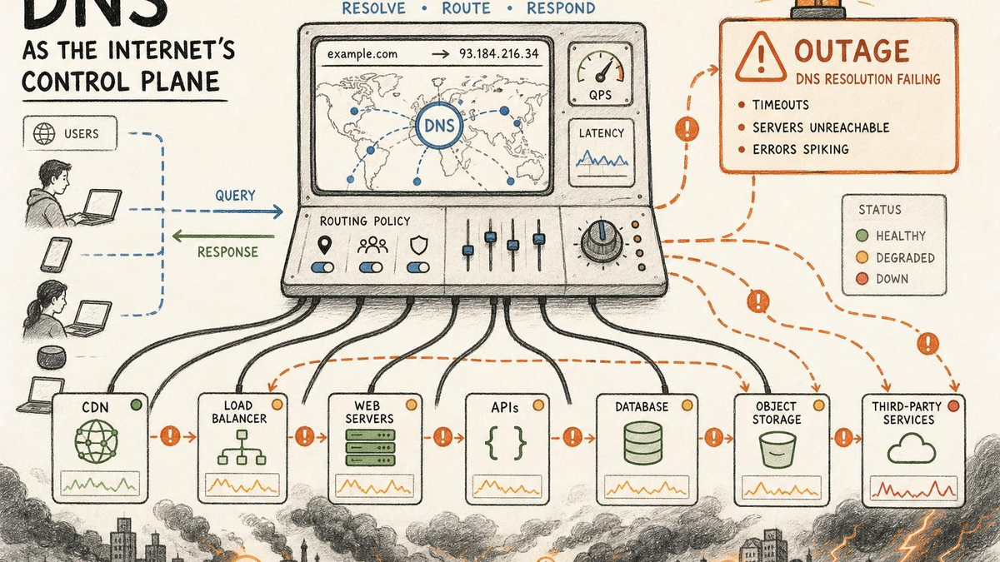

2025年10月20日、インターネットの一部が不調な朝を迎えた。Amazon Web Services（AWS）は、米バージニア北部のデータセンタークラスター（US-EAST-1）で障害が発生したと報告した。数時間にわたり、多くの人気アプリやサービスが低速または利用不能な状態に陥った。[Vercel](https://downdetector.com/status/vercel/)、[Figma](https://downdetector.in/status/figma/)、[Venmo](https://downdetector.in/status/venmo/)、[Snapchat](https://downdetector.com/status/snapchat/) などがその一例だ。ニュースメディアや監視サービスは世界中から数百万件のユーザー報告を記録し、一部の Amazon サービス自体も断続的な障害を起こした。

しかし Namefi のお客様は穏やかな一日を過ごした。私たちのシステムは通常どおり稼働し続けた。それは偶然ではなく、DNS 解決を地域的な問題に対して耐障害性のあるものにするエンジニアリングと運用の厳密さに多大な投資を続けてきた結果である。

Namefi エンジニアリングチームは、重大インシデントのたびに今回のような世界規模の障害を検証し、教訓を引き出している。以下は、現時点で明らかになっていることをまとめたものだ。

*注記：本稿執筆時点では、インシデントはまだ進行中である。この記事は随時更新される可能性がある。誤りや修正すべき点があれば、[namefi.io](http://namefi.io) の dev-team までご連絡いただけると幸いだ。*

## AWS で実際に何が起きたのか——専門用語を使わずに説明する

すべてのアプリやウェブサイトは、接続先を「調べる」手段を必要とする。インターネットのその住所録が DNS——[ドメインネームシステム](/ja/glossary/dns/)の略——だ。10月20日、AWS 内部でネーミングの問題が発生し、一部のコンピューターが重要な AWS データベースサービスを名前で見つけられなくなった。住所録が正しい情報を適切なタイミングで提供できなければ、健全なシステム同士であっても互いに通信できなくなる。

AWS は数時間以内に直接的なネーミング問題を修正し、その後も一日をかけてバックログの解消とシステムの正常化を進めた。太平洋時間の午後遅くには、AWS はすべてのサービスが正常に稼働していると発表したが、一部のサービスの回復にはさらに時間を要した。

## 影響を受けたのは誰か（そして今日のインターネットについて何を示すか）

影響の範囲は広く、日常的なユーザーにとっても身近なものだった。Snapchat や Reddit といったコンシューマー向けアプリ、Zoom や Signal などのコミュニケーションツール、Fortnite や Roblox などのゲームプラットフォームが障害を報告した。金融サービスでは Coinbase と Robinhood で中断が発生し、英国では HMRC（税務ポータル）や Lloyds/Halifax/バンク・オブ・スコットランドグループ傘下の銀行など、複数の公共向けサービスが障害に見舞われた。Vodafone や BT のテレコム顧客向けアプリも影響を受けたが、コアネットワーク自体は正常に稼働していた。

Amazon 自身のサービスも例外ではなかった。Amazon.com、Prime Video、Alexa、Ring がそれぞれ障害を経験し、AWS が親会社のコンシューマーサービスといかに深く結びついているかを改めて示した。Downdetector などのリアルタイム追跡サービスは世界中から数百万件のユーザー問題報告を記録し、いかに多くの日常アプリが AWS 上に成り立っているかを浮き彫りにした。また、障害の時間帯には Apple Music などのエンターテインメントアプリや大手ブランドのモバイルアプリにも波及効果が報告されている。

## 内部で何が起きていたか

AWS のタイムラインによれば、US-EAST-1 における DynamoDB API の DNS 解決障害が根本にある。直接の引き金となったのは、ネットワークロードバランサー（NLB）の正常性を監視する EC2 内部サブシステムの誤作動であり、その影響が DynamoDB エンドポイントへの不正な名前解決という形で外部に表出した。AWS は太平洋夏時間（PDT）午前 2 時 24 分に DNS 問題を緩和し、午後 3 時 01 分にすべてのサービスが正常であると宣言した。その後も午後中はバックログの解消が続いた。（[Amazon](https://www.aboutamazon.com/news/aws/aws-service-disruptions-outage-update)、[Reuters](https://www.reuters.com/business/retail-consumer/amazons-cloud-unit-reports-outage-several-websites-down-2025-10-20/)）

独立したネットワークテレメトリによれば、より広域なインターネットのルーティング異常（例えば BGP インシデント）は確認されていない。これは、障害が公開インターネット上ではなく AWS のコントロールプレーン内部に留まっていたという結論と一致する。（[ThousandEyes](https://www.thousandeyes.com/blog/aws-outage-analysis-october-20-2025)）

## 修正後も「長い尾」が続いた理由——DNS の挙動が説明する

- **キャッシュ（ネガティブキャッシュを含む）。** リゾルバーは TTL（time-to-live）と呼ばれる期間、回答を保存する。また、標準仕様に従い、失敗の応答もキャッシュする。インシデント中にリゾルバーが「見つからない」というレスポンスをキャッシュしていた場合、AWS が発信元を修正した後も、タイマーが切れるまでその失敗応答を返し続ける可能性がある。（標準仕様：[RFC 2308](https://datatracker.ietf.org/doc/html/rfc2308)、[RFC 9520](https://www.rfc-editor.org/rfc/rfc9520) で更新）
- **コントロールプレーンとデータプレーン。** クラウドプラットフォームはオーケストレーション（コントロールプレーン）と安定した状態での処理（データプレーン）を分離している。名前解決を壊すコントロールプレーンの一時的な不具合は、それ自体は健全な処理パスをブロックしうる。クライアントが引き続きエンドポイントを名前で発見する必要があるためだ。AWS 自身の耐障害性ガイダンスはこれらのプレーンを区別し、コントロールシステムのより高い複雑性と変更頻度を指摘している。（[AWS ホワイトペーパー](https://docs.aws.amazon.com/whitepapers/latest/aws-fault-isolation-boundaries/control-planes-and-data-planes.html)）
- **US-EAST-1 の中心性。** US-EAST-1 は多くのグローバル機能が依存するコンポーネントをホストしており、この集中度が、地域的なネーミング障害がグローバルな影響として感じられた理由を説明する。（概要報告：[Reuters](https://www.reuters.com/business/retail-consumer/amazons-cloud-unit-reports-outage-several-websites-down-2025-10-20/)）

## 中小のインターネット企業が学べること

このようなインシデントは一つのシンプルな考えを浮き彫りにする。**ネーミング層こそが安全層である。** ユーザーをどこに誘導するか、次にどのデータセンターを試みるか、障害時にトラフィックをどう制御するか——これらすべては DNS を経由して行われる。そのレイヤーを独立・冗長・変更に強い形で構築することで、復旧を速め、障害の影響を小さくできる。

## DNS が重要な理由と Namefi の位置づけ

教訓は「クラウドが脆弱だ」ということではなく、単一のネーミング・コントロールパスへの依存がリスクを集中させるということだ。現代のインターネットチームは、DNS をトラフィックのための独立した耐障害性のあるステアリング層として扱い、問題が起きる前に代替エンドポイントを準備することでそのリスクを低減している。堅牢な DNS が整備されていれば、プロバイダーが障害を抱えているときでも、アプリケーションはルートを切り替え、グレースフルデグレードを行い、より速く復旧する能力を維持できる。

この思想こそが Namefi が存在する理由だ。Namefi のプラットフォームは、ドメインと DNS の耐障害性をプロダクトとして提供し、ベストプラクティス・精密に設計された TTL・通信インターフェースを統合している。その結果として生まれるネーミング層は、基盤となるクラウドが回復・スロットリング・バックログ解消を続けている最中でも、適切なルーティング判断を下し続けるよう設計されている。Namefi を採用したチームは、この姿勢をすぐに手に入れられるとともに、問題を経験している可能性のある同一プレーンに制御を縛り付けることなく、それを観察・調整するための運用ツールも得られる。

10月20日のようなインシデントが発生したとき、この分離こそが地図を無傷に保つ。

## 参考資料・さらなる読み物

- Amazon — 公式インシデントのタイムラインと復旧手順（緩和：PDT 午前 2:24、全サービス正常：PDT 午後 3:01、復旧中の EC2 スロットリング）。（[Amazon](https://www.aboutamazon.com/news/aws/aws-service-disruptions-outage-update)）
- Reuters — EC2 内部の NLB ヘルスモニタリングサブシステムの根本原因、影響範囲、数百万件のユーザー報告、バックログ解消。（[Reuters](https://www.reuters.com/business/retail-consumer/amazons-cloud-unit-reports-outage-several-websites-down-2025-10-20/)）
- ThousandEyes — US-EAST-1 に焦点を当てたテレメトリ、DynamoDB への DNS、より広範なルーティング異常がないこと。（[ThousandEyes](https://www.thousandeyes.com/blog/aws-outage-analysis-october-20-2025)）
- The Verge / Tom's Guide — 公開タイムライン、本イベントがサイバー攻撃ではなく DNS／コントロールプレーン障害であることの確認、影響を受けたプラットフォームの例。（[The Verge](https://www.theverge.com/news/802486/aws-outage-alexa-fortnite-snapchat-offline)）
- IETF / Cloudflare Docs — DNS ネガティブキャッシュの挙動（RFC 2308、RFC 9520）およびマルチプロバイダー権威DNSデプロイメントにおけるマルチサイナー DNSSEC パターン（RFC 8901、オペレーターガイド）。（[RFC Editor](https://www.rfc-editor.org/rfc/rfc8901)、[RFC Editor](https://www.rfc-editor.org/rfc/rfc9520)）
