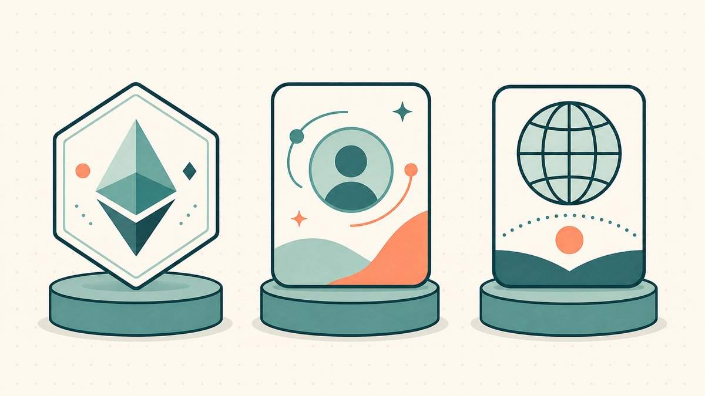
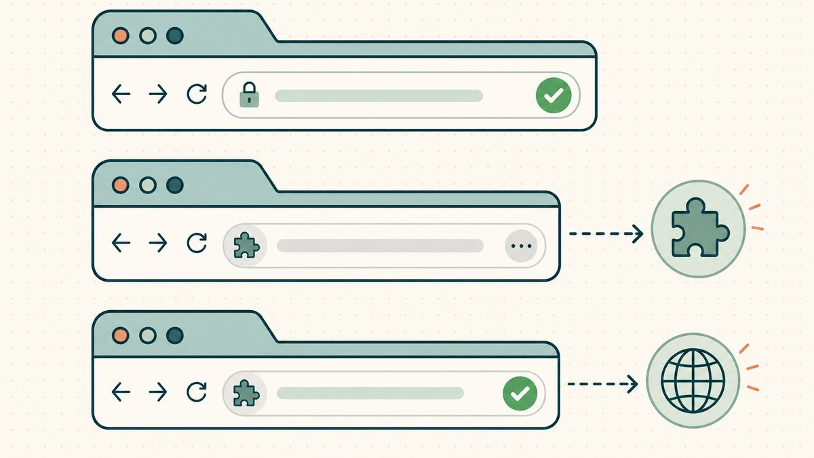
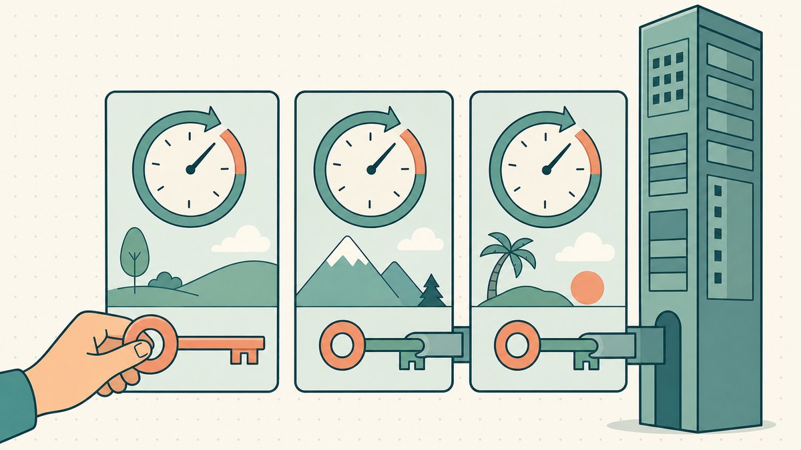

オンチェーンでドメインをフリッピングするなら、まず「自分がどの種類の『オンチェーン名前』を売買しているのか」を明確にする必要があります。多くの人が同一視している三つのカテゴリは、実際には異なる資産です。その違いによって、ブラウザでその名前が解決できるかどうか、来年に更新料が発生するかどうか、そして実際に誰がそれを管理しているかが決まります。本記事では三者を正面から比較します。[ENS](/ja/glossary/ens/)（`.eth`）、[Unstoppable Domains](https://unstoppabledomains.com)（`.crypto`、`.x`、`.nft`）、そして[Namefi](https://namefi.io)で[トークン化](/ja/glossary/tokenize/)できるトークン化済み実ICANN [DNS](/ja/glossary/dns/)ドメイン（`.com`／`.io`／`.xyz` など）です。

三者に共通点が一つあります。いずれも名前の所有権を[ウォレット](/ja/glossary/wallet/)内のトークンとして保持できる点です。しかし転売に影響するあらゆる点で違いがあります。一つだけ覚えるとすれば、これです。ENSとUnstoppableの名前はICANNルートの「外側」に存在しますが、トークン化DNSドメインはICANNドメインそのものにトークンが付加されたものです。この一事実が、名前解決・更新料・管理権限のすべてに連鎖的な影響を与えます。

## 各サービスの実態

**ENS** は[Ethereum](/ja/glossary/ethereum/)上のネーミングシステムです。公式ドキュメントでは明快に説明されています。[ENSは「alice.eth」のような人間が読める名前を、Ethereumアドレス、コンテンツハッシュ、メタデータなどの機械可読識別子にマッピングします](https://docs.ens.domains/learn/protocol#:~:text=maps%20human%2Dreadable%20names)。`.eth`名はEthereum上でトークンとして発行され、[他のERC721トークンと同様に名前を移転できます](https://docs.ens.domains/registry/eth/#:~:text=transfer%20their%20name%20just%20like%20with%20any%20other%20ERC721%20token)。つまり仕組みとしては[ERC-721](/ja/glossary/erc-721/) [NFT](/ja/glossary/nft/)です。重要な点として、`.eth`はICANNから委任されたものではなく、ENSがオンチェーンで独自に作成した名前空間です。

**Unstoppable Domains** は`.crypto`、`.x`、`.nft`、`.dao`などブロックチェーンネイティブな名前を販売しています。これらの[ドメイン名はEthereumブロックチェーン上でNFTとしてミントできます](https://coinmarketcap.com/academy/glossary/unstoppable-domains#:~:text=minted%20as%20a%20non%2Dfungible%20token)。同社はそれをユーザーのウォレットに格納し、サポートドキュメントには[Web3ドメインはデジタル資産（NFT）としてユーザーの暗号資産ウォレットに保存され、完全にユーザーが所有します](https://support.unstoppabledomains.com/support/solutions/articles/48001181690-what-are-nft-domains-#:~:text=stored%20in%20your%20crypto%20wallet%20as%20digital%20assets)と記載されています。`.eth`と同様に、これらのTLDはICANNルートには含まれません。

**トークン化DNSドメイン**はまったく異なる性質を持ちます。その基礎資産は通常のICANNドメインです。認定[レジストラ](/ja/glossary/registrar/)を通じて登録された`example.com`や`yourname.io`といったドメインに、所有権を反映するオンチェーントークンが付与されます。仕組みの詳細は[トークン化ドメインとは何か](/ja/blog/what-are-tokenized-domains/)で解説していますが、要点はこうです。新しい名前空間を作るのではなく、一つの名前に二つの同期されたレイヤーを持たせるということです。カテゴリの位置づけについてはさらに[トークン化ドメイン vs web3ドメイン](/ja/blog/tokenized-domain-vs-web3-domain/)で詳しく説明しています。

## ブラウザでの名前解決：実際に使えるか？

これが最も明確な分かれ目であり、フリッパーにとっては勝負を決める要素です。名前解決こそが、多くのエンドバイヤーが実際に対価を支払っている機能だからです。

トークン化された`.com`は、通常の`.com`が解決できるあらゆる場所で解決できます。あらゆるブラウザ、メールクライアント、CDN、証明書認証局において機能します。なぜなら、それは普通の`.com`そのものだからです。訪問者側に特別な設定は不要です。

ENSとUnstoppableの名前は、単独ではこの基準を満たせません。Unstoppableは率直に認めています。[ChromeとFirefoxでのドメイン解決には当社の拡張機能をダウンロードできます](https://support.unstoppabledomains.com/support/solutions/articles/48001181690-what-are-nft-domains-#:~:text=you%20can%20download)というように、BraveやOperaなどわずかな暗号資産対応ブラウザでのみネイティブ解決が可能です。ENSの`.eth`名も、リゾルバー・ゲートウェイ・拡張機能なしでは標準ブラウザで同じ状況です。これはエンジニアリング上の欠点ではなく、ICANNの外で自由にイテレーションできるよう設計上意図された選択です。ただしこれはターゲットバイヤーを変えます。普通のChromeで名前が開くことを期待する一般市場ではなく、主として[web3](/ja/glossary/web3/)ユーザーやウォレットネイティブな層に販売することになります。

一点補足しておくべき点があります。ENSはDNSから離れるのではなく、DNSに橋を架ける方向で設計されています。ドキュメントには[ENSはDNS名をサポートしており、ユーザーは](https://docs.ens.domains/learn/dns#:~:text=supports%20DNS%20names)[DNSSEC](/ja/glossary/dnssec/)経由でDNS名をENSにインポートできる](https://docs.ens.domains/learn/dns#:~:text=supports%20DNS%20names)と記載されています。つまり`.com`オーナーは自分の本物の名前をENSに反映させることができますが、それはDNS名が通常のインターネットで解決しているのであって、ENSがオンチェーンのアイデンティティレイヤーを付加しているに過ぎません。これによって`.eth`自体が標準ブラウザで解決できるようになるわけではありません。

## 更新料：来年も費用がかかるか？

更新モデルは三者が明確に分岐する点であり、保有コストに直撃し、フリッパーが痛い思いをしやすい箇所でもあります。

ENSの`.eth`名には年会費があります。公式レジストラのドキュメントには料金が明示されています。[5文字以上の.ethは年間5ドル、4文字は年間160ドル、3文字は年間640ドルかかり](https://docs.ens.domains/registry/eth/#:~:text=letter%20%60.eth%60%20will%20cost%20you)、[この料金はETHで支払われます](https://docs.ens.domains/registry/eth/#:~:text=This%20fee%20is%20paid%20in%20ETH)。支払いを忘れると猶予期間がありますが、ENSの規定によれば[名前の有効期限から90日後（猶予期間終了後）、その名前はTemporary Premium Auctionに入ります](https://docs.ens.domains/registry/eth/#:~:text=90%20days%20after%20a%20name%20expires)。短く価値の高い`.eth`名では、更新料が無視できない固定費になります。

Unstoppable Domainsは正反対のモデルを打ち出しています。一括購入のみです。ドキュメントにはWeb3ドメインは[取り上げられることなく、更新も不要で、生涯にわたってあなたのもの](https://support.unstoppabledomains.com/support/solutions/articles/48001181690-what-are-nft-domains-#:~:text=don%27t%20require%20renewals%2C%20and%20are%20yours%20for%20life)だと記載されています。年間費用がないことはバイ・アンド・ホールド型のフリッパーには魅力的ですが、「生涯にわたって」という表現はプロトコルの意図を示すものであり、ICANNによる保証ではありません。これらの名前はそれを解決する仕組みが存続する間だけ機能します。

トークン化DNSドメインは通常のICANN経済に従います。レジストラへの年次更新料を支払い、gTLDの登録は最長10年まで設定できます。これは継続的なコストですが、すべての`.com`投資家がすでに予算に組み込んでいる、よく理解された費用と同じです。トークン化によって二重の更新料が発生することはなく、トークンはその下にある一つのDNS登録を追跡するだけです。

## 実際に誰が名前を管理しているか

「セルフカストディ」は三者すべてで曖昧に使われているため、各レイヤーで「管理」が何を意味するかを正確に理解する必要があります。

ENSとUnstoppableの場合、オンチェーンの管理は純粋にユーザーのものです。[秘密鍵](/ja/glossary/private-key/)を持つ者が名前を持ち、レジストラがサポートチケットを通じて取り戻すことはできません。これが[カストディアル所有](/ja/glossary/custodial-ownership/)をウォレットカストディに置き換えることの真の魅力です。ただし「名前」が意味を持つのは、それを解決するシステムがその名前を認識している範囲内においてのみです。トークンを管理していても、それを解決できる場所がブラウザ拡張機能といくつかのdAppのみであれば、管理は本物ですが、その*影響範囲*は採用状況によって制約されます。

トークン化DNSドメインの管理は層を成しています。ウォレット内のトークンがオンチェーンの所有と移転を管理し、基礎となる名前は実際のICANNドメインとして存続します。つまりすべての`.com`と同様に、更新・ICANNポリシー・[UDRP](/ja/glossary/udrp/)紛争といった現実の規則に従い続けます。信頼性の高いトークン化プラットフォームは二つのレイヤーを常に同期させるため、トークンを移転するとドメインも移転し、ハンドオーバー中もDNS継続性が保たれてライブサイトが停止することはありません。ウォレットネイティブな管理と、インターネット全体がすでに認識している名前の両方を手に入れられます。このトレードオフは正直なものです。資産は現実の規則に従う本物のドメインであるため、「システムの外側にいる」わけではありません。カストディの問題については[ウォレット喪失後のトークン化ドメインの回復](/ja/blog/recovering-a-tokenized-domain-after-wallet-loss/)でさらに詳しく解説しています。

## 流動性と販売場所

三者はすべて（あるいはそれに近い形で）[ERC-721](/ja/glossary/erc-721/)スタイルのNFTであるため、NFT[マーケットプレイス](/ja/glossary/marketplace/)に出品でき、[アトミック](/ja/glossary/atomic-transfer/)なバイヤーが支払いと受取を同時に行うスワップで移転できます。第三者の[エスクロー](/ja/glossary/escrow/)エージェントが取引の途中で資産を保持する必要はありません。この共通の仕組みこそがオンチェーンドメインのフリッピングを魅力的にしている点であり、[トークン化マーケットプレイスがエスクローを不要にする仕組み](/ja/blog/how-tokenized-marketplaces-replace-escrow/)で詳しく解説しています。

ただしバイヤー層は異なります。ENSは三者の中で最も深い二次流通市場を持ちます。プレミアムな`.eth`名は大きな金額で取引されてきました。CoinGeckoによれば[過去最高額の暗号資産ドメインは「paradigm.eth」で、2021年10月9日に151万ドル（420 ETH）で売却されました](https://www.coingecko.com/research/publications/most-expensive-crypto-domains#:~:text=paradigm.eth%22%2C%20which%20sold%20for)。またThe Blockは[Ethereum Name Service（ENS）ドメイン「000.eth」が300 ETH（31万5,000ドル）で購入されたと報じました](https://www.theblock.co/post/155685/ethereum-name-service-records-second-highest-ens-name-sale#:~:text=000.eth%20was%20purchased%20for%20300%20ETH)。これらは実際の数字ですが、DNS世界における`Voice.com`と同様に外れ値として扱うべきです。上限が存在することは示しますが、典型的な名前の取引価格を反映するものではありません。「フロア価格」として引用される数値はいずれも動的な推定であり、確定した事実ではありません。

トークン化DNSドメインは異なるより大きなバイヤー層を対象とします。あらゆるブラウザで解決できる本物のドメインと、ウォレットネイティブな所有権の両方を求める人々です。名前をどのブラウザでも開け、メールを受信でき、SSL証明書を取得できながら、NFTとして売却する選択肢も手放したくないというバイヤー層です。

## どれをフリッピングするか

一概にどれが勝者とは言えません。自分のバイヤーに合ったものを選ぶことが重要です。

- **ENS `.eth`のフリッピング**は、短い数字や単語の名前をオンチェーンアイデンティティとして重視するクリプトネイティブな層に販売する場合に適しています。保有価値のある名前の年間更新料を許容できることが前提です。
- **Unstoppableの名前のフリッピング**は、更新不要でウォレット優先のweb3アイデンティティを求めるバイヤーに向いており、標準ブラウザでの解決性が優先事項でない場合に有効です。その名前空間の評価については[プレミアムweb3 TLD](/ja/blog/premium-web3-tlds/)を参照してください。
- **トークン化DNSドメインのフリッピング**は、最大のバイヤープールと「実際に機能する」名前を求める場合に最適です。保有・設定・オンチェーン売却が可能で、誰でもアクセスできる実ICANN `.com`／`.io`／`.xyz`を対象とします。まずは[.comをトークン化する方法](/ja/blog/how-to-tokenize-your-com/)から始め、プラットフォーム選びに悩む場合は[ドメイントークン化プラットフォームの選び方](/ja/blog/choosing-a-domain-tokenization-platform/)で判断基準を確認してください。

これら全体が旧来のエスクロー・信頼モデルを超える理由については、[ドメインフリッピング](/ja/blog/domain-flipping/)のハブがスキル全体を体系的にまとめており、[ドメインをトークン化する理由](/ja/blog/why-tokenize-domains/)でアップサイドを詳しく解説しています。どのカテゴリを取引するにしても、価格を提示する前にウォレット内の資産の性質を把握してください。名前解決・更新料・管理権限は細部ではなく、商品そのものだからです。

## 免責事項（必ずお読みください！）

> 筆者は弁護士・会計士・ファイナンシャルアドバイザー・医師ではなく、**本記事のいかなる内容も法律・財務・税務・会計・医療その他の専門的アドバイスを構成しません。** これらの記事は自己学習および顧客向けの参考情報として執筆しています。記載内容は古くなっている場合、特定の地域にのみ適用される場合、あるいは単純に誤っている場合があります。私たちも間違いを犯します。
>
> 重要な意思決定については**実際の専門家に相談してください（本当に！）**。それが難しければ、友人・Twitter・Reddit・AI・占い師に聞くのも一案です。要するに、**DOYR（自分でリサーチせよ）**。一緒に学び、楽しみましょう。

## 出典・参考資料

- ENS Docs — [ENSプロトコル：人間が読める名前をアドレスにマッピング](https://docs.ens.domains/learn/protocol#:~:text=maps%20human%2Dreadable%20names)
- ENS Docs — [ETHレジストラ：.ethの移転はERC721トークンと同様；年間料金（5 / 160 / 640ドル）；料金はETHで支払い；90日間猶予](https://docs.ens.domains/registry/eth/#:~:text=transfer%20their%20name%20just%20like%20with%20any%20other%20ERC721%20token)
- ENS Docs — [ENSはDNSSEC経由でDNS名のインポートをサポート](https://docs.ens.domains/learn/dns#:~:text=supports%20DNS%20names)
- Unstoppable Domains Support — [Web3ドメインはウォレット内にNFTとして保存；更新不要で生涯所有；ChromeとFirefoxにはブラウザ拡張機能が必要](https://support.unstoppabledomains.com/support/solutions/articles/48001181690-what-are-nft-domains-#:~:text=stored%20in%20your%20crypto%20wallet%20as%20digital%20assets)
- CoinMarketCap — [Unstoppable DomainのNFTはEthereumブロックチェーン上でミント](https://coinmarketcap.com/academy/glossary/unstoppable-domains#:~:text=minted%20as%20a%20non%2Dfungible%20token)
- CoinGecko Research — [最高額暗号資産ドメイン：paradigm.ethが151万ドル（420 ETH）で売却、2021年10月9日](https://www.coingecko.com/research/publications/most-expensive-crypto-domains#:~:text=paradigm.eth%22%2C%20which%20sold%20for)
- The Block — [000.ethが300 ETH（31万5,000ドル）で購入、ENS史上2番目の高額取引](https://www.theblock.co/post/155685/ethereum-name-service-records-second-highest-ens-name-sale#:~:text=000.eth%20was%20purchased%20for%20300%20ETH)
