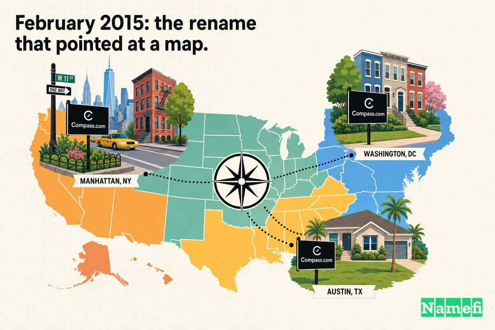

Compassが米国最大の住宅不動産仲介会社になるよりずっと前、それはもっと文字通りの、もっとローカルなものだった——ニューヨーク市で賃貸物件を探すためのアプリ、**UrbanCompass.com**である。

元の名前には理由があった。Robert ReffkinとOri Allonがこのサービスを立ち上げたとき、それはひとつの狭い場所でひとつの狭いことをするものだった。The Daily Beastは初期プロダクトを、[5月7日にマイケル・ブルームバーグ市長の推薦を得てベータ版をローンチした](https://www.thedailybeast.com/start-up-urban-compass-aims-to-drive-apartment-rental-online/#:~:text=launched%20in%20beta%20on%20May%207)サービスと報じ、空き物件の包括的なデータベースと周辺地域の情報を提供するとした。カバレッジマップは最初は小さく、[マンハッタンとブルックリンの一部で、その後ニューヨークの他の地域へ拡大予定](https://www.thedailybeast.com/start-up-urban-compass-aims-to-drive-apartment-rental-online/#:~:text=Manhattan%20and%20parts%20of%20Brooklyn)だった。「Urban」という言葉は、ユーザーが何を得られるかを正確に伝えていた——都市居住者のための都市ツールだと。

その最初のユーザー層にとって、UrbanCompass.comは明快だった。プロダクトの説明そのものだった。

しかし、創業者たちがブランドの核として選んだ言葉は、やがてそのブランドの上限をも決定づける言葉になった。「Urban」は*都市*を意味した。そして、マンハッタンからマイアミ、テキサスの郊外まで住宅を売りたい会社は、都市ツールのままでいることはできなかった。

そこで2015年2月、Urban Compassは二つのことを同時に行った——名前から「Urban」を外すこと、そして全国展開の看板を担う[完全一致ドメイン](/ja/glossary/exact-match-domain/)へのアップグレード——**Compass.com**、[2013年のオークションで100万米ドルで出品されていた](https://smartbranding.com/urbancompass-com-rebrands-to-compass-com/#:~:text=Compass.com%20was%20listed%20in%20an%20auction%20back%20in%202013%20for%20US%24%201%20Million)アドレスだ。

## 2012〜2014年：「Urban」が実際に機能していた時代

当初、「Urban」は欠陥ではなく機能だった。

同社は2012年秋にニューヨーク市で設立された。Wikipediaによれば、[Compassは2012年10月、Ori Allon、Robert Reffkin、Avi DorfmanによってUrban Compass, Inc.としてニューヨーク市で創業された](https://en.wikipedia.org/wiki/Compass,_Inc.#:~:text=founded%20by%20Ori%20Allon)。Reffkinが2つの学位を取得したコロンビア大学のアントレプレナーシップ・オフィスも同じ事実を伝えている——[Robert Reffkin '00CC, '03BUSは2012年10月、長年の友人Ori AllonとともにUrban Compassを創業した](https://entrepreneurship.columbia.edu/startup/urban-compass/#:~:text=founded%20Urban%20Compass%20with%20his%20long%2Dtime%20friend%20Ori%20Allon%20in%20October%202012)。

この組み合わせは異色だった。Reffkinは[ゴールドマン・サックスの元幹部](https://www.thedailybeast.com/start-up-urban-compass-aims-to-drive-apartment-rental-online/#:~:text=former%20Goldman%20Sachs%20executive)であり、Allonはテクノロジーの世界で大手企業への売却実績を持つ稀有な技術者だった。AllonはGoogleが買収した検索アルゴリズムを書き、その後Twitterが買収したソーシャル検索スタートアップを立ち上げた——[Allonの採用は買収の一部であり、彼はTwitterのニューヨークオフィスでエンジニアリング・ディレクターとして勤務した](https://intheblack.cpaaustralia.com.au/people/ori-allon-the-digital-wizard-who-changed-google-and-twitter/#:~:text=Hiring%20Allon%20was%20part%20of%20the%20deal)。コロンビア大学が表現したように、同社は[Robertのビジネス経験とOriのテクノロジーのバックグラウンドを組み合わせ、人々が素晴らしい住まいを見つける手助けをする](https://entrepreneurship.columbia.edu/startup/urban-compass/#:~:text=Robert%27s%20business%20experience%20and%20Ori%27s%20technology%20background)という存在だった。

ニューヨーカーに対して、年間で最もストレスのかかる取引のひとつをアプリで信頼してもらおうとする新興企業には、地元としての信頼性を示すシグナルが必要だった。「Urban Compass」はそれを実現した。この名前は「これはあなたの街のために、あなたの街を理解する人たちによって作られた」と伝えていた。プロダクトは名前に一言一句忠実だった——地元ガイド付きの都市賃貸データベースである。

しかし、野心はすでに名前を超えていた。創業者たちはマンハッタンの賃貸検索を少し改善しようとしていたわけではなかった。ビジネスモデル自体も急速に変化していた——Wikipediaによれば、[2014年1月、Compassは独立した不動産エージェントと契約を結び、仲介手数料の一部を得る形でビジネスモデルを変更すると発表した](https://en.wikipedia.org/wiki/Compass,_Inc.#:~:text=In%20January%202014%2C%20Compass%20announced)。賃貸から住宅売買へのピボットは、会社を自社名の限界へと真っ直ぐに向かわせた。Reffkinは後にこう語っている——[賃貸はニューヨーク市に特化したものだと気づいた](https://daltxrealestate.com/meet-robert-reffkin-ceo-compass-real-estate-super-millennial/#:~:text=I%20realized%20rentals%20were%20pretty%20specific%20to%20New%20York%20City)と。

UrbanCompass.comは最初のフェーズに適したドメインだった。しかしその名の下にある会社には、間違ったドメインだった。

## 2015年2月：「Urban」の削除とCompass.comの取得

リブランドは意図的なものであり、名前の変更とドメインの変更を一つの動きにまとめた。

Smart Brandingはこのアップグレードを端的に記録している——[2015年2月、ブランドはドメイン名をUrbanCompass.comからEBM（完全ブランド一致）のCompass.comへアップグレードした](https://smartbranding.com/urbancompass-com-rebrands-to-compass-com/#:~:text=In%20February%202015%2C%20the%20brand%20upgraded%20its%20domain%20name%20from%20UrbanCompass.com)。当時Compassのマーケティングおよびクリエイティブ責任者だったMatt Spangerは、リーチと記憶のしやすさという観点からその論理を説明した——[Compassはよりシンプルで、より普遍的に記憶しやすいブランド名であり、私たちが構築しているものの核心にある、人とテクノロジーのつながりを直接体現している](https://smartbranding.com/urbancompass-com-rebrands-to-compass-com/#:~:text=Compass%20is%20a%20simpler%2C%20more%20universally%20memorable%20brand%20name)。

この言葉をよく読むと、重要なのは*普遍的に*という副詞だ。「Urban Compass」はニューヨークのブランドだった。「Compass」はどこへでも向けることができるブランドだった。

## Compassが必要とする前から値段がついていたドメイン

名前が「Compass」になれば、明らかなアドレスはCompass.comだ。しかしそのドメインは捨て値ではなかった。英語の一般的な単一単語は、インターネット上で最も争われる不動産のひとつであり、「compass」——方向、ナビゲーション、道を見つけることを意味する言葉——は、不動産会社が望めるほぼ最高にブランドらしい名詞だ。

市場はすでに値をつけていた。Compassがその名前を必要とするより前に、[Compass.comは2013年のオークションで100万米ドルで出品されていた](https://smartbranding.com/urbancompass-com-rebrands-to-compass-com/#:~:text=Compass.com%20was%20listed%20in%20an%20auction%20back%20in%202013%20for%20US%24%201%20Million)。Compassが実際に支払った金額は非公開だ。Smart Brandingが指摘するように、[取引は非公開であり、一致するドメイン名を確保するために支払われた金額は不明である](https://smartbranding.com/urbancompass-com-rebrands-to-compass-com/#:~:text=The%20transaction%20was%20private)。

この秘密保持自体、プレミアムな一語[.com](/ja/tld/com/)取引では標準的だ。7桁の[オークション](/ja/glossary/auction/)出品価格は公開された下限額にすぎず、成約価格は双方が口を閉ざすことが多い。いずれにせよ、シグナルは明確だ——「Urban」を外すことはタダではなかった。名前の完全一致バージョンには相応のコストがかかった。なぜなら「Compass」という言葉は、この会社にとって価値を持つ前から世界にとって価値を持っていたからだ。

## 当時、資金調達の文脈は違っていた

ドメイン購入をストーリーの末尾から判断したくなる気持ちはわかる——Compassが誰もが知る名前となり、7桁のURLが誤差の範囲に見える地点から振り返れば。しかし2015年初頭、その計算は違って見えた。

当時Compassは、ビジネスモデルを変えたばかりで、知っている唯一の都市を離れてすべてを賭けようとしている、若いベンチャー支援の仲介会社だった。エンジニアの採用、エージェントの獲得、新市場でのオフィス開設に資金を投じていた。そのような状況で、テクノロジーでも、エージェント採用でも、新オフィスでもなく*ドメイン名*に（十中八九）7桁の金額を投じることは、財務チームが首をかしげる類の費目だったはずだ。

この意思決定が意味をなすのは、ドメインを装飾品ではなくインフラとして扱う場合のみだ。Compassはニューヨークだけでなく全国に対して自社の名前を覚えてもらおうとしていた。すべての庭先の看板、すべてのエージェントのメール署名、すべての物件ページ、新市場でのすべてのプレスメンションが、そのウェブアドレスを運ぶことになる。そのアドレスをブランドのクリーンで普遍的な完全一致バージョンにするために支払うことは、その名前が全国で何百万回も繰り返されるという賭けだった——そしてその繰り返しのたびに、UrbanCompass.comではなくCompass.comへ着地すべきだという賭けだった。

## 「Urban」を外すことが重要だった理由

UrbanCompass.comとCompass.comの差は一語だ。戦略的には、それは一都市と一国の差だ。

**UrbanCompass.com**はあなたがすでに知っているものを説明する——*都市*の不動産をナビゲートするツールだと。**Compass.com**は天井のない何かを命名する——郊外にも、サンベルトにも、高級ビーチマーケットにも、都市か否かを問わず人々が家を売買するあらゆる場所にオフィスを開けるブランドだ。一語は都市に縛りつける。もう一方はカテゴリーそのものになることを可能にする。

| 変更前 | 変更後 |
| --- | --- |
| UrbanCompass.com | Compass.com |
| 都市の賃貸ツールを表している | 上限のない仲介ブランドを表している |
| 「都市」市場に縛られている | 郊外・サンベルト・高級市場にも展開できる |
| ニューヨーク発のプロダクトに見える | 全国ブランドに見える |
| 毎回の言及に一語多く加わる | ブランドを一つの普遍的な言葉に凝縮する |

これはドメインアップグレードに繰り返し現れるパターンだ——初期の名前は*説明し*、優れた名前は*所有する*。説明的なバージョンは、会社がまだ何をどこでやっているかを伝える必要がある段階で役立つ。完全一致バージョンは、会社がどこでも人々がデフォルトで手を伸ばす存在へと成長した時点で力を発揮する。「Urban」を外したことは名前を短くしただけでなく、そこに組み込まれていた地理的な上限を取り除いた。全国規模の仲介会社は「都市」を冠したドメインには住めない。

## 2015年2月：地図を指し示した改名

出来事の順序こそが、このケースを示唆に富むものにしている。リブランドは外見上の整理ではなかった——全国展開のスターターピストルだった。

Urban CompassがCompassになった2015年2月、それは密集した都市中心部に縛りつけるその名を捨てるために行われた。新しいアイデンティティは、ワシントンD.C.など、ニューヨーク以外の市場への最初の進出と同時に登場した——これは最終的にCompassを数百の都市へと運び、10年後には全国最大級の仲介会社のひとつにする展開の始まりだった。名前とドメインは、地図が広がる*前に*変わらなければならなかった。

この依存関係に注目してほしい。ウェブサイトがUrbanCompass.comにある間は、Compassは自社を全国ブランドとして信頼性を持って売り込むことができなかった。ブランド、ロゴ、ドメインは一緒に動く必要があった——そしてCompassが最もコントロールできない部分がドメインだった。なぜならCompass.comを所有していたのは他者であり、市場はすでにそれに100万ドルの値をつけていたからだ。完全一致の名前を確保することが、「全国」を願望ではなく現実として聞こえるようにした。

別のシナリオを想像してほしい——テキサスやフロリダのエージェントや売り手に全国規模の仲介会社だと伝えながら、「Urban」という言葉が入ったウェブサイトに誘導する会社を。そのミスマッチはリブランド全体の意図を損なっていただろう。ドメインは新戦略の上に乗った装飾品ではなかった。それは新戦略の荷重を支える柱だった。

## ドメインはオペレーティングシステムの一部になった

プレミアムドメインはプレステージのためではない。繰り返しのためだ。

不動産ブランドの基幹ドメインは、マーケティングチームが直接コントロールしない場所に登場する：

- 新規市場のすべての「売り出し中」庭先看板
- すべてのエージェントのメールアドレスと名刺
- 物件ページ、検索結果、Zillow/ポータルへの連携配信
- 会社が各新都市に参入する際のプレスの見出し
- 「Compassで売り出した」というすべての口コミ——隣人から隣人へ

これらの繰り返しのひとつひとつが、摩擦を加えるか取り除くかのどちらかだ。UrbanCompass.comは各言及を長く、より都市限定的で、明らかにニューヨーク的なものにした。Compass.comは各言及を短く、クリーンで、地理にとらわれないものにした。それを何千人ものエージェント、何百もの市場、全国最大級に成長した仲介会社に掛け合わせれば、7桁のドメインは贅沢品ではなく、会社が購入した最も安価な全国インフラに見えてくる。

ドメインがCompassのブランドを構築したわけではない。しかしCompass.comがアドレスになった瞬間から、名前が繰り返されるたびに、郊外市場で言い訳の必要な「Urban」を含まないクリーンな土台の上に、すべてが積み重なっていった。

## 創業者がケース8から学ぶべきこと

簡単な教訓——「説明的な言葉を外して完全一致の.comを買え」——は粗すぎる。より実用的な教訓は、*どの*言葉を、*いつ*、*いくらで*外すかについてだ：

1. **説明的なドメインは最初は問題ない。** UrbanCompass.comは実際に機能していた——不安を抱えるニューヨークの賃貸希望者に、真新しい会社をローカルで信頼できる存在として感じさせた。「Urban」「App」「HQ」のような修飾語は、失敗ではなく合理的な出発点だ。
2. **修飾語が上限になる瞬間を見逃さない。** Compassにとってそのシグナルは地理的なものだった。戦略が全国へ向いた瞬間、「Urban」という言葉は会社を説明することをやめ、縮小し始めた。自社名が移行先よりも小さな領域を説明するようになったとき、アップグレードは急務だ。
3. **完全一致の名前には市場価格があると覚悟する。** Compass.comのような一般的な一語.comは無料で転がっていない。このドメインはCompassが必要とする前に[オークションで100万ドルで出品されていた](https://smartbranding.com/urbancompass-com-rebrands-to-compass-com/#:~:text=Compass.com%20was%20listed%20in%20an%20auction%20back%20in%202013%20for%20US%24%201%20Million)。他者がすでにコントロールする戦略的資産と同様に、ドメインの予算を立てること。
4. **拡大の後ではなく前にドメインを確保する。** 改名とCompass.comへの移行は*先に*行われ、その後に全国展開が続いた。時間のかかる、外部所有の高価な資産——ドメイン——は、新戦略が意味を持つためにロックダウンされなければならなかった。

ドメインアップグレードがCompassを勝者にしたわけではない。プロダクト、資本、エージェント採用、タイミング、実行力がはるかに重要だった。しかしCompass.comは、会社の再発明——ニューヨークの賃貸アプリから全国規模の仲介会社へ——を*名指しできるもの*にした。そして「Urban」が資産から柵へと変わった瞬間に確保されなければならなかった。

## Namefiの視点

このケースは本質的に、ブランディングの衣をまとった移転の問題だ。

戦略的な判断はほぼ自明だった——全国展開する会社が「Urban」を外してCompass.comを所有すべきことは当然だ。難しかったのはその周辺のすべてだ——100万ドルの一語.comの所有者との条件交渉、公開比較可能事例なしでの価格合意、世界が今でも支払額を知らないほど厳しい守秘義務協定の下での取引完了、クリーンなコントロールの移転、そして協調されたリブランドとタイミングを合わせること。何年経った今でも、この取引に関する最も基本的な問い——いくら支払ったか——は非公開のままであり、まさにほとんどのプレミアム一語ドメイン移転を取り巻く不透明さだ。

[Namefi](https://namefi.io)は、ドメインがインターネットネイティブな資産として振る舞うべきだという考えのもとに構築されている。トークン化された所有権は、ドメインのコントロールを[DNS](/ja/glossary/dns/)との互換性を保ちながら、検証・移転・現代のワークフローへの統合を容易にする——このような取引の最も厄介な部分（誰が何を所有するかの証明、価値の合意、安全な移転）を、クリーンで監査可能なトランザクションに近づける。一語.comが複数年の非公開の書類仕事なしに値付け・エスクロー・移転できる未来は、まさにこのケースが実際のコストを払って乗り越えようとした摩擦だ。

Compass.comは今では必然に見える——Compassが巨大になったから。しかし教訓はそのスケールにはるかに届く前に成立する——名前がビジネスを全国に運ぶことになるとき、特に古い名前が静かに一つの都市に囲い込むとき、ドメインは装飾品ではない。7桁を投じて正しく確保する価値のあるブランドの一部だ。

## 出典と参考資料

- Wikipedia — [Compass, Inc.](https://en.wikipedia.org/wiki/Compass,_Inc.#:~:text=founded%20by%20Ori%20Allon)
- Smart Branding — [UrbanCompass.com Upgrades to Compass.com](https://smartbranding.com/urbancompass-com-rebrands-to-compass-com/#:~:text=In%20February%202015%2C%20the%20brand%20upgraded%20its%20domain%20name%20from%20UrbanCompass.com)
- The Daily Beast — [Start-up Urban Compass Aims to Drive Apartment Rental Online](https://www.thedailybeast.com/start-up-urban-compass-aims-to-drive-apartment-rental-online/#:~:text=launched%20in%20beta%20on%20May%207)
- Columbia Entrepreneurship — [Urban Compass](https://entrepreneurship.columbia.edu/startup/urban-compass/#:~:text=founded%20Urban%20Compass%20with%20his%20long%2Dtime%20friend%20Ori%20Allon%20in%20October%202012)
- INTHEBLACK (CPA Australia) — [Ori Allon: the digital wizard who changed Google and Twitter](https://intheblack.cpaaustralia.com.au/people/ori-allon-the-digital-wizard-who-changed-google-and-twitter/#:~:text=Hiring%20Allon%20was%20part%20of%20the%20deal)
- DALTX Real Estate (CandysDirt) — [Meet Robert Reffkin, CEO of Compass Real Estate and Super Millennial](https://daltxrealestate.com/meet-robert-reffkin-ceo-compass-real-estate-super-millennial/#:~:text=I%20realized%20rentals%20were%20pretty%20specific%20to%20New%20York%20City)
