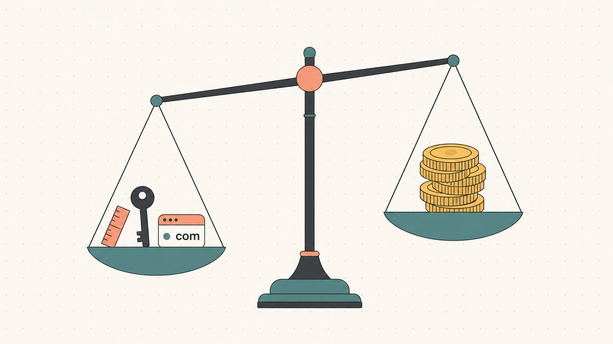
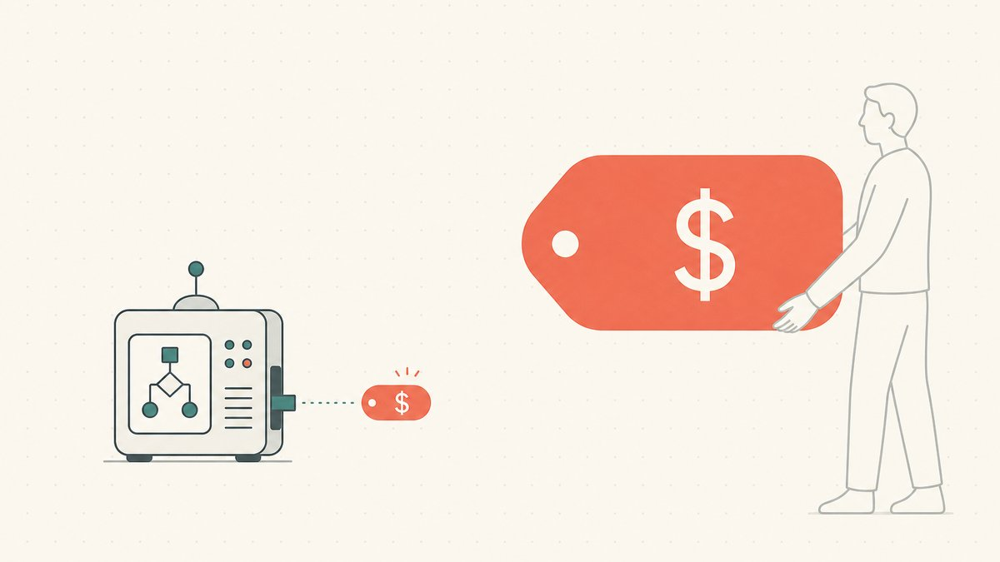

ドメインを所有していれば、いつか必ずこの問いにぶつかる。「*自分のドメインはいくらの価値があるのか？*」新参のドメインフリッパーが資産を購入した直後に最初に問い、売り出す直前に最後に問うのがこの問いだ。まるで検索すれば一発で答えが出てくるかのように思えるかもしれない。名前を入力すれば数字が返ってくる、と。

そうはいかない。正直な答えは不快だが、受け入れてしまえば解放感をもたらしてくれる。**ドメインの価値は、[エンドユーザー](/ja/glossary/end-user/)が実際に支払う金額であり、それ以外はすべて推定に過ぎない。** ツールが示す数字も、類似売買事例も、自分の直感も、すべては「たった一つの実際の取引」を予測しようとする試みに過ぎない。このガイドでは、プロがその推定値をどのように構築するかを解説する。価値を左右する要素、自動ツールが有効な場面と機能しない場面、[類似売買事例](/ja/blog/how-to-read-comparable-domain-sales/)の読み方、そして同じドメイン名に二つのまったく異なる価格が付く理由だ。本稿は[ドメインフリッピング](/ja/blog/domain-flipping/)に関する包括的なガイドにおける「査定」の柱となる記事である。

## ドメインにとっての「価値」とは何か

要素の話に入る前に、まず枠組みを整理しておこう。ドメインには株式の株価のような機械的・内在的な価値は存在しない。「yourname.com が4,200ドル」と一元的に表示する中央取引所はどこにも存在しない。代わりに存在するのは、大型取引の多くが一対一で交渉され、多くの取引が公開されることのない、流動性の低いプライベート市場だ。

このことは公開記録を見れば一目瞭然だ。Wikipediaの[最も高額なドメイン名の一覧](https://en.wikipedia.org/wiki/List_of_most_expensive_domain_names)が記録しているのは、[300万米ドル以上の価値を持つ売買のみ](https://en.wikipedia.org/wiki/List_of_most_expensive_domain_names#:~:text=most%20expensive%20domain%20name%20sales%2C%20with%20values%20of%20%243%20million)であり、[純粋なドメイン名の現金のみの売買に限定されている](https://en.wikipedia.org/wiki/List_of_most_expensive_domain_names#:~:text=limited%20to%20pure%20domain%20name%20and%20cash%2Donly%20sales)——ウェブサイトのコンテンツや株式を含まない。その閾値を下回る取引や、NDAに包まれた取引は、公開台帳には単純に存在しない。つまり「価値」とは常に、まだ会ったことのない買い手についての、確率加重された推測にすぎない。査定の仕事は、その推測を少しでも外れにくくすることだ。

## ドメインの価格を実際に動かす要素

人間による査定であれ自動査定であれ、評価するのはおおよそ同じいくつかの基本要素だ。これらを体得すれば、ほとんどのドメイン名は素早く分類できる。

**長さ。** 短いほど良い、これはほぼ例外がない。文字数が少ないほど記憶しやすく、入力しやすく、口頭で伝えやすく、名刺にも収まりやすい。単語一つ、または短い二語からなる名前が最上位に位置し、長くてハイフン入り、もしくは数字が埋め込まれた文字列は最下位に落ちる。

**単語そのもの。** これが最も大きなレバーであり、三つのテストがある。ランダムな文字の組み合わせではなく、*実在する*単語または確立した用語であるか？*検索されている*か——つまり、実際に人が探していて、その背後に商業的需要があるか？そして*音声で伝わる*か——声に出して言ったとき、相手がスペルを確認せずに正確にたどり着けるか？この三つすべてを満たす名前（`cars`、`loans`、`cloud`）は、どれも満たさない名前とは別の資産クラスだ。

**拡張子。** `.com` は依然として、ウェブ全体が比較基準とするデフォルトだ。Wikipediaによれば、`.com` は [*commercial*（商業）の略](https://en.wikipedia.org/wiki/.com#:~:text=it%20is%20short%20for%20commercial)であり、[最大のトップレベルドメインに成長した](https://en.wikipedia.org/wiki/.com#:~:text=It%20has%20grown%20into%20the%20largest%20top%2Dlevel%20domain)とされており、約1億6000万件が登録されている。この普及度こそが、`.com` が他の[TLD](/ja/glossary/tld/)の同じ名前よりも一般的にプレミアムを要求できる理由だ——人が何も考えずに入力し、デフォルトと思い込むのが `.com` だから。他の拡張子も文脈によっては高い価値を持ちうる（開発者向けブランドなら[`.io`](/ja/tld/io/)、AI企業なら[`.ai`](/ja/tld/ai/)、スタートアップが保険として持つ[`.co`](/ja/tld/co/)など）が、`.com` とそれ以外の差は現実のお金の差だ。そのメカニズムは[TLDがドメイン価値に与える影響](/ja/blog/how-tld-affects-domain-value/)で詳しく解説している。

**キーワードと商業的意図。** 取引に結びついた単語は、趣味に関連した単語よりも価値が高い。`insurance`、`mortgage`、`casino` は常に高額なのは、各クリックがオーナーにとって実収益に変換されうるからだ。名前が金銭の動くタイミングに近いほど、エンドユーザーはその正面玄関を手に入れるために高い金額を払う。これが[SEO](/ja/glossary/seo/)価値とブランド価値が重なり合う場所だ。

**ブランド性。** 価値のある名前がすべて辞書に載っている単語というわけではない。短く、発音しやすく、造語であっても（`Stripe`、`Zillow`、[商標登録](/ja/glossary/trademark/)がしやすい類の名前）、それが所有しやすく独自性があるという理由でまさに重宝される。ブランド性とは、正確なキーワード名が入手できないか、手の届かない価格になっているときにスタートアップが対価を払う価値だ。

**拡張子の安定性。** フリッパーが苦労して学ぶ、より微妙な要素——拡張子の*耐久性*も価格の一部だ。国別コードTLDは一国の統治下に置かれており、`.com` にはないリスクをはらんでいる。典型例が、チャゴス諸島の主権移転後に[`.io`](/ja/tld/io/)の行方をめぐる未解決の問いだ。これについては[.ioドメインが高額な理由](/ja/blog/why-are-io-domains-expensive/)と[ccTLD市場シェア分析](/ja/blog/cctld-market-share-by-registration-volume/)で取り上げている。文字だけでなく、国自体も価格に織り込むこと。

## 自動査定ツール：何に有効で、どこで機能しなくなるか

ほとんどの人が最初にすることは、ドメイン名を自動査定ツールに貼り付けることだ——GoDaddyの評価ツール、Estibot、あるいは数多くある「ドメイン価格計算機」のいずれかに。これらは確かに役立つが、実際に何をしているのかを理解しておくと有益だ。GoDaddyは自社ツールについて明確に説明している。その[アルゴリズムは独自の機械学習と実際の市場売買データを使用してドメインの価値を推定し、類似ドメイン名の売買事例を提供する](https://www.godaddy.com/resources/skills/godaddy-domain-name-value-appraisal-tool#:~:text=algorithm%20uses%20proprietary%20machine%20learning%20and%20real%20market%20sales%20data%20to%20estimate%20domain%20values)、つまり、過去の大量の売買事例データベースと上記の基本要素に照らして名前をスコアリングしているのだ。

そのため、自動ツールはいくつかの特定の用途には優れている。大量のリストを素早くトリアージする、ある名前が4桁の価値なのか2桁の価値なのかを大まかに確認する、そして自分では見つけられなかった[類似売買事例](/ja/glossary/comparable-sales/)を見つけ出す。*最初のフィルター*としての役割は果たす。

機能しなくなる部分こそが最も重要なことだ——それは**エンドユーザー**への対応だ。アルゴリズムは、特定の地域の歯科医がその町の完全一致の `.com` を切実に欲しがっていること、あるいは資金を調達したスタートアップが今四半期にリブランドして一語のドメインが必要だということを知らない。意図も、タイミングも、戦略的な適合性も——2,000ドルの名前を40,000ドルの売却に変える人間的要素を見ることができない。業界の経験則として、自動査定は価格としてではなく、大まかな方向性を示すレンジとして扱うのが最善だ。経験豊富なフリッパーは、実際の売却が機械の数字を大きく上回ることも下回ることも、どちらの方向にも日常的に経験している。ツールを使って名前を*範囲で把握する*のであって、*価格を決める*ためではない。主要ツールの違いと各ツールが最も強みを発揮する場面については、[ドメイン査定ツール比較](/ja/blog/domain-appraisal-tools-compared/)を参照されたい。

## 類似売買事例：価格を現実に根ざかせる

自動ツールが最初のフィルターなら、類似売買事例（「コンプ」）こそプロが実際に価格を現実に根ざかせる手段だ。不動産鑑定士が使うロジックと同じだ。*類似した*資産が最近いくらで売れたかを見つけ出し、自分の資産との違いに応じて調整する。

公開売買記録がその原材料だ。NameBioが標準的なリファレンスとなっている。Wikipediaのドメインアフターマーケット概要によれば、[NameBioによると、2024年には144,700件のドメイン名売買が記録され、総額は1億8,500万米ドルに達した](https://en.wikipedia.org/wiki/Domain_aftermarket#:~:text=According%20to%20NameBio%2C%20144%2C700%20domain%20name%20sales%20totaling%20US%24185%20million%20were%20recorded%20in%202024)。自分のドメインと構造的に似た名前——同じ長さのクラス、同じキーワードファミリー、同じ拡張子——を検索して、それらがどのような価格帯で売れたかを把握する。

コンプを正直に使うために二つの注意点がある。第一に、**公開記録は開示されたものと低〜中価格帯に偏っている。** 高額ドメインの一覧が示すように、大型のプライベート取引はしばしば一切公開されないため、プレミアムな名前の視認できるコンプは系統的に薄い。第二に、**二つのドメインがまったく同一であることは決してない**から、すべてのコンプには調整が必要だ——単純なマッチングでは `flowers.com` と `flowerz.net` が対になってしまうが、両者はまったく異なる。技は調整にあり、それが[類似ドメイン売買事例を正しく読む方法](/ja/blog/how-to-read-comparable-domain-sales/)について専用ガイドを書いた理由だ。

有名な売買事例をアンカーとして引用するときは、頼る前にその数字を検証すること。見出しになった数字は見つけやすいが間違えやすい。公開された売買における検証済みの最高値はVoice.comで、Wikipediaの一覧によれば[2019年に3,000万ドルで売却された](https://en.wikipedia.org/wiki/List_of_most_expensive_domain_names#:~:text=Voice.com)。この取引について[CoinDesk はBlock.OneがVoice.comに3,000万ドルを支払ったと報じた](https://www.coindesk.com/markets/2019/06/19/blockone-paid-30-million-for-a-domain#:~:text=Block.One%20paid%20%2430%20million%20for%20Voice.com)——買い手はBlock.One、売り手はMicroStrategyだ。同一覧には[Sex.comが2010年に1,300万ドル](https://en.wikipedia.org/wiki/List_of_most_expensive_domain_names#:~:text=Sex.com)、[Hotels.comが2001年に1,100万ドル](https://en.wikipedia.org/wiki/List_of_most_expensive_domain_names#:~:text=Hotels.com)といった過去の代表例も含まれる。これらは外れ値であり、普通の名前のコンプではない——しかし、記憶ではなく出典が必要な数字だ。

## エンドユーザー価格とリセラー価格：一つの名前に二つの数字が存在する理由

これは新参フリッパーを最も混乱させる概念なので、正確に理解しておこう。同じドメインには、*誰が買うか*によって二つの正当な、まったく異なる価格が存在する。

- **エンドユーザー（リテール）価格**とは、その名前を実際に*使用する*企業が支払う金額だ。転売目的で資産を買っているのではなく、自社の正面玄関を買っており、その名前が*自社の*事業にとっていくらの価値があるかで価格を測る。これが高い数字だ。
- **[リセラー](/ja/glossary/reseller/)（ホールセール）価格**とは、後で利益を出して転売しなければならないことを知りながら別の投資家が支払う金額だ。在庫を買っているので、自分のマージン、保有コスト、売れ残るリスクを価格に織り込む。これが低い数字だ。

両者の差が**スプレッド**であり、これがフリッピングのビジネスモデル全体だ——ホールセールかその近辺で買い、リテールで売る。経験則として（固定した法則ではない）、エンドユーザー価格はホールセール価格の数倍に達することが多い——だからこそ、同じ文字列に対してリセラーのコンプとエンドユーザーのコンプが別の資産を描写しているように見える。ある意味では、その通りだ。二つの異なる*買い手*に価格をつけているのだから。査定をするときは、常にどちらの数字を推定しているかを問うこと。ホールセールフリップに正しい価格はエンドユーザー売却には間違っており、逆もまた然り。詳細なメカニズムは[エンドユーザー価格とリセラードメイン価格](/ja/blog/end-user-vs-reseller-domain-pricing/)で、そして価値を成立した取引に変換することについては[所有ドメイン名の売り方](/ja/blog/how-to-sell-a-domain-name-you-own/)で掘り下げている。

## よくある査定ミス

ほとんどの失敗した価値評価は、繰り返し現れる短いリストの失敗パターンから生まれる。

**希望を価格にする。** 最も一般的なミス——見つけた一つの天文学的なコンプに固執して、百個の平凡なコンプを無視することだ。Voice.comは3,000万ドルで売れた。あなたの二語の `.net` が突然100万ドルの名前になったわけではない。コンプの*分布全体*に合わせて価格を設定すること。夢のような頂点の一点にではない。

**更新費用を無視する。** ドメインは一度きりの購入ではなく、サブスクリプションだ。保有するすべての名前は毎年費用がかかり、プレミアム拡張子や[レジストリ](/ja/glossary/registry/)のティアが高い名前は更新費用が嵩む。「500ドルで買って転売できる」名前も、年90ドルの保有コストで5年間売れ残れば、見た目ほどの勝利ではない。すべての査定において保有コストを差し引くこと。

**トラフィックと価値を混同する——そして、それが*本当に*価値になるときを見落とす。** これは両方向に作用する。[タイプインのトラフィック](/ja/glossary/type-in-traffic/)や既存の検索順位は、実際に対価を払える価値になりうる——QuinStreetがCarInsurance.comを[現金4,970万ドルで買収した](https://www.globenewswire.com/news-release/2010/11/08/433738/12254/en/QuinStreet-Announces-Acquisition-of-CarInsurance-com-Inc.html#:~:text=for%20%2449.7%20million%20in%20cash)とき、Domain Name Wireは[その価値は主としてサイトが受けるオーガニックトラフィックと、それがどれだけリードに変換されるかにある](https://domainnamewire.com/2010/11/09/quinstreet-bought-carinsurance-com-for-the-organic-traffic/#:~:text=the%20value%20comes%20primarily%20from%20the%20organic%20traffic)と報じた。ただしその意味するところに注意が必要だ。その時点で、あなたはドメイン名ではなく*ビジネス*——トラフィック、リード、コンバージョン——を鑑定していることになる。ミスは、停車中の駐車ドメインに、さも*そのトラフィックがある*かのように価格をつけることだ。価値が訪問者にあるなら訪問者を評価して検証する。価値が名前にあるなら名前を評価する。片方を黙って価格に乗せて、もう片方を実際に提供する、ということをしないこと。

## 価値が分かったら：クロージング時の取引を守る

査定は「いくら」に答えてくれる。それに続く、より難しい運用上の問いには答えてくれない——5桁や6桁の名前で、双方がどうやって互いを傷つけずに実際に取引するのか？買い手は資産を本当にコントロールする前に送金しなければならない。売り手は代金を確認する前にコントロールを手放さなければならない。この信頼のギャップが、高額な[ドメイントレード](/ja/glossary/domain-trading/)においてリスクが生まれる場所であり、価格を正確に把握することとは別の、その後に来る問題だ。（[TeslaMotors.comからTesla.comへ](/ja/blog/from-teslamotors-com-to-tesla-com/)の買収でそのギャップが現実の形で現れるのを目の当たりにしてきた。）

このギャップを埋めるために[Namefi](https://namefi.io)は構築された。本物の[ICANN](/ja/glossary/icann/)ドメインをトークン化することで、所有権の確認と移転が容易になり、クロージング時の引き渡しが監査可能になり、変更を通じてもドメインの解決が維持される——査定が数字を教え、クリーンな移転が合意後の双方を守る。名前を正直に評価し、そして取引を安全にする。

## 出典・関連情報

- Wikipedia — [最も高額なドメイン名の一覧](https://en.wikipedia.org/wiki/List_of_most_expensive_domain_names#:~:text=most%20expensive%20domain%20name%20sales%2C%20with%20values%20of%20%243%20million)（Voice.com 3,000万ドル/2019年、Sex.com 1,300万ドル/2010年、Hotels.com 1,100万ドル/2001年；300万ドル以上の公開・現金取引のみ対象）
- GlobeNewswire — [QuinStreet Announces Acquisition of CarInsurance.com, Inc.](https://www.globenewswire.com/news-release/2010/11/08/433738/12254/en/QuinStreet-Announces-Acquisition-of-CarInsurance-com-Inc.html#:~:text=for%20%2449.7%20million%20in%20cash)（現金4,970万ドル）
- Domain Name Wire — [QuinStreet Bought CarInsurance.com for the Organic Traffic](https://domainnamewire.com/2010/11/09/quinstreet-bought-carinsurance-com-for-the-organic-traffic/#:~:text=the%20value%20comes%20primarily%20from%20the%20organic%20traffic)
- CoinDesk — [Block.One Paid $30 Million for a Domain (Voice.com)](https://www.coindesk.com/markets/2019/06/19/blockone-paid-30-million-for-a-domain#:~:text=Block.One%20paid%20%2430%20million%20for%20Voice.com)
- GoDaddy — [Domain Name Value & Appraisal: a domain valuation tool](https://www.godaddy.com/resources/skills/godaddy-domain-name-value-appraisal-tool#:~:text=algorithm%20uses%20proprietary%20machine%20learning%20and%20real%20market%20sales%20data%20to%20estimate%20domain%20values)（機械学習＋実際の市場売買データ）
- Wikipedia — [Domain aftermarket](https://en.wikipedia.org/wiki/Domain_aftermarket#:~:text=According%20to%20NameBio%2C%20144%2C700%20domain%20name%20sales%20totaling%20US%24185%20million%20were%20recorded%20in%202024)（NameBio 2024年売買量）
- Wikipedia — [.com](https://en.wikipedia.org/wiki/.com#:~:text=It%20has%20grown%20into%20the%20largest%20top%2Dlevel%20domain)（最大のTLD；*commercial*の略）
