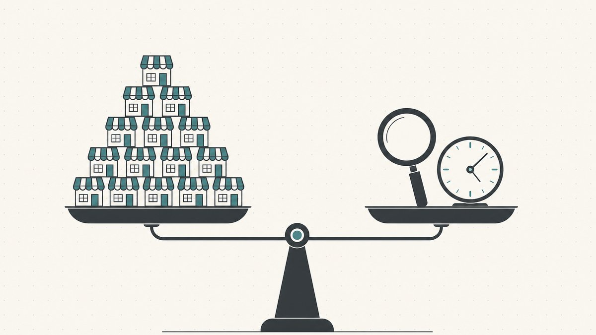

ドメインが売れる方法は二つしかない。買い手があなたを見つけるか、あなたが買い手を見つけるか、それだけだ。インバウンドとは、買い手がブラウザにドメイン名を入力し、売り出し中のページを見つけて連絡してくることを指す。アウトバウンドとは、あなたがそのドメインを必要としている会社を見つけ出し、先に連絡を取ることだ。価格形式、マーケットプレイスの選択、エスクローといった販売にまつわるその他すべての要素は、どちらのゲームをプレイしているかの下流に位置している。

新しいフリッパーのほとんどは一方しかやらない。ドメインを掲載してパークして待つ——完全なインバウンド——を繰り返し、そこそこ良いポートフォリオから一年間何も生まれないことに首をひねる。着実に在庫を動かす売り手は、両方を意図的に使い分け、どのドメインがどちらのレーンに属するかを知っている。この解説記事は[ドメインフリッピング](/ja/blog/domain-flipping/)シリーズの一部であり、[ドメインを利益のために売る方法](/ja/blog/how-to-sell-domains-for-profit/)のプレイブックの補完として位置づけている。各手法を定義し、どちらがいつ機能するかを示し、労力対リターンを比較し、ドメインごとに判断するための方法を提供する。

## インバウンド：ドメインを見つけやすくして買い手に来てもらう

インバウンド販売とは、ドメインを発見されやすい状態にして待つことだ。仕組みはシンプルだ：ドメイン自体に売り出し中のランディングページを設置し、[アフターマーケット](/ja/glossary/aftermarket/)マーケットプレイスに掲載し、直接入力してきた人が見られる価格を表示する。一度設定すれば、眠っている間も機能し続ける。

インバウンドが機能するのは、成熟した流動性の高い[マーケットプレイス](/ja/glossary/marketplace/)が代わりに買い手を探してくれるからだ。ドメインアフターマーケットとは、Wikipediaによれば[すでに登録済みのドメインを取得しようとする当事者が入札や交渉を通じて価格を決定し、移転を行うインターネットドメイン名のセカンダリー転売市場](https://en.wikipedia.org/wiki/Domain_aftermarket#:~:text=the%20secondary%20resale%20market%20for%20Internet%20domain%20names)だ。その規模は相当なもので、Wikipediaによれば[NameBioによると、2024年には14万4,700件のドメイン名売買が記録され、総額は1億8,500万米ドルに上った](https://en.wikipedia.org/wiki/Domain_aftermarket#:~:text=According%20to%20NameBio%2C%20144%2C700%20domain%20name%20sales%20totaling%20US%24185%20million%20were%20recorded%20in%202024)が、これは公開分の一部にすぎない。これらの取引はその性質上ほとんどがインバウンドであり、[AfternicやSedoのようなアフターマーケットプラットフォームが仲介](https://en.wikipedia.org/wiki/Domain_aftermarket#:~:text=Transactions%20are%20facilitated%20by%20aftermarket%20platforms%20such%20as%20Afternic%20and%20Sedo)し、あなたの掲載情報を買い手が既に訪れる場所に届けてくれる。

インバウンドで得られるもの：

- **高い利益率。** 自分で訪れてきた買い手は通常、すでにそのドメインを欲しいと思っている[エンドユーザー](/ja/glossary/end-user/)であり、[リセラー](/ja/glossary/reseller/)の卸売価格ではなくエンドユーザー価格を喜んで支払う状態にある。[エンドユーザーとリセラーの価格差](/ja/blog/end-user-vs-reseller-domain-pricing/)こそが、インバウンドが非常に収益性の高い理由だ。
- **継続的な手間がかからない。** ランディングページと掲載情報を一度設定すれば作業は完了だ。メールを書く必要はなく、インフラを維持するだけでいい。
- **クリーンな意図。** 買い手が先にノックしてきたのだから、ハラスメントと非難されることはない。インバウンドは、アウトバウンドを難しくする[商標](/ja/glossary/trademark/)リスクやスパムのリスクを回避できる。

インバウンドのコストは、タイミングへのコントロール権の喪失と、待ち続ける残酷な算数だ。買い手がいつ現れるかを選べないし、ほとんどのドメインには誰も現れない。業界でよく言われるルールオブサム——測定された統計ではなく、あくまで目安だが——として、手作業で登録したポートフォリオの年間[売却率](/ja/glossary/sell-through-rate/)は一桁台の低い数字であることが多い。そのため、[更新コスト対売却率](/ja/blog/domain-renewal-costs-and-sell-through-rate/)の計算が、ポートフォリオが投資なのかサブスクリプションなのかを決めることになる。インバウンドは忍耐の投資だ：優良なドメインはやがて買い手を見つけるが、平凡なものは永遠に更新し続けることになる。

インバウンドの技術は、買い手が訪れたとき、「購入する」までの道のりに摩擦がないようにすることだ。それは、スパムだらけのパーキングページではなく、本物の[売り出し中ランディングページ](/ja/blog/domain-for-sale-landing-pages/)を用意することであり、[ドメイン販売の場所：マーケットプレイス比較](/ja/blog/where-to-sell-domains-marketplaces-compared/)から適切な場所に掲載することであり、ターゲットとする買い手に合った価格形式を選ぶことだ。[Buy It Now（今すぐ購入）か Make Offer（オファー制）か](/ja/blog/domain-pricing-psychology-buy-now-vs-make-offer/)の判断は主にインバウンドに関わる問題だ。なぜなら、訪れてきた買い手がどう関与するかを左右するからだ。

## アウトバウンド：買い手を見つけて先に連絡する

アウトバウンドは方向を逆にする。待つのではなく、あなたが保有するドメインから明らかに恩恵を受けるであろう会社、個人、またはプロジェクトを特定し、適切な担当者を探し出して、自分から会話を始める。アフターマーケットを検索しようとは思わない理想的な買い手に向けてドメインを売る方法だ——彼らはそのドメインの存在を知らないか、売りに出ていることを知らないのだから。

アウトバウンドの背景にある論理は、そもそもそのドメインを所有する論理と同じだ。ドメイン投資とはWikipediaの言葉を借りれば[後で利益として売却する意図を持って、汎用インターネットドメイン名を投資として識別・登録・取得する行為](https://en.wikipedia.org/wiki/Domain_name_speculation#:~:text=is%20the%20practice%20of%20identifying%20and%20registering%20or%20acquiring%20generic%20Internet%20domain%20names%20as%20an%20investment)だ。アウトバウンドは「後で売る」の能動的バージョンにすぎない：利益があなたを見つけるのを待つのではなく、自分で取りに行く。

アウトバウンドが機能するとき、それが機能する理由は：

- **スピードが速い。** 動機付けられた、よく絞り込まれた見込み客は、インバウンドが要求する数ヶ月ではなく数日でクローズできる。需要のイベントを待つのではなく、あなたが作り出す。
- **検索しない買い手にリーチできる。** 地方の企業、資金調達済みのスタートアップ、ブランドリニューアル中の企業——こういう人たちはドメインを必要としているが、Sedoを閲覧しているわけではない。アウトバウンドが、そのドメインが利用可能であることを伝える唯一の手段だ。典型的なアップサイドは、[teslamotors.comからtesla.com](/ja/blog/from-teslamotors-com-to-tesla-com/)への移行のように、ぎこちないドメイン名を使い続ける企業の例だ：アップグレードが*必要な*買い手は対価を支払う——しかし誰かがシンプルな[.com](/ja/tld/com/)が入手可能だと教えてくれた場合に限り。
- **隠れた価値を引き出す。** インバウンドでは何年も売れないでいるドメインが、特定の一人の買い手にとってはずっと心のどこかで欲しいと思っていたものである可能性がある。

アウトバウンドのコストは労力とリスクであり、どちらも現実的だ。労力については、精度がすべてだ。真の買い手を調査し、適切な担当者を探し出し、読む価値のあるメッセージを書くのは、量でスケールしないスローな手作業だ。リスクについては、アウトバウンドのやり方が悪ければ積極的な損害を与える。キーワードマッチしたリストに一斉送信すればスパマーだ。さらに悪いことに、自分のドメインがその商標に似ている商標保有者に連絡すれば、あなたの「セールスピッチ」が不利な証拠になりかねない。[ICANN](/ja/glossary/icann/)の紛争ポリシーのもとでは、商標保有者は申立人が権利を有する商標またはサービスマークと[同一または混同を生じさせるほど類似している](https://en.wikipedia.org/wiki/Uniform_Domain-Name_Dispute-Resolution_Policy#:~:text=identical%20or%20confusingly%20similar%20to%20a%20trademark%20or%20service%20mark)こと、正当な利益がないこと、そして[「悪意」において登録・使用されている](https://en.wikipedia.org/wiki/Uniform_Domain-Name_Dispute-Resolution_Policy#:~:text=registered%20and%20the%20domain%20name%20is%20being%20used%20in%20%22bad%20faith%22)ことを示すことでドメインを奪取できる。商標保有者への不要な申し出は、その証拠として読まれかねないものだ。これが[ドメイニング](/ja/glossary/domaining/)と[サイバースクワッティング](/ja/glossary/cybersquatting/)の境界線であり、Wikipediaによるとサイバースクワッティングとは[他者の商標の信用から利益を得る悪意をもって、インターネットドメイン名を登録・売買・使用する行為](https://en.wikipedia.org/wiki/Cybersquatting#:~:text=is%20the%20practice%20of%20registering%2C%20trafficking%20in%2C%20or%20using%20an%20Internet%20domain%20name%2C%20with%20a%20bad%20faith%20intent)と定義される。アウトバウンドするのは、汎用的・説明的・創造的なドメインに限ること。他者のブランドに依存したドメインには絶対にやってはいけない。完全なフレームワークは[UDRPとは何か](/ja/blog/what-is-udrp/)に詳しい。

正しくやれば、アウトバウンドとは一人の本当のニーズを持つ買い手への、よく調査された一通のメッセージだ。その一通のメールは千通の一斉送信に勝り、それがセールスパーソンと迷惑行為者の違いだ。

## 労力対リターンのトレードオフ

二つを並べると、トレードオフはクリアだ。

| | インバウンド | アウトバウンド |
|---|---|---|
| 先に動くのは | 買い手 | あなた |
| スピード | 遅く、予測不能 | ターゲットを絞れば速い |
| 一件あたりの労力 | 低い（一度設定するだけ） | 高い（一件ずつ調査が必要） |
| スケールの方法 | ポートフォリオの規模と掲載数 | あなたの時間と判断力 |
| 主なリスク | ドメインが売れない | スパムまたは商標侵害と見なされる |
| 買い手のタイプ | すでにドメインを欲しいと思っている | 売りに出ていることを知らない |

インバウンドはレバレッジだ：ストアフロントを一度構築すれば、ポートフォリオ内のすべてのドメインが追加コストなしにそのチャンネルで機能する。弱点は、買い手がたまたまあなたの特定のドメインを欲しいと思うかどうかに完全に依存しており、それを強制することはできない点だ。

アウトバウンドは労働だ：それぞれの良いアウトリーチはカスタムの調査プロジェクトであるため、スケールしない。その強みは、インバウンドでは絶対に売れないドメインにも効果があり、運任せで待つのではなく、*今四半期*どのドメインを動かすかを自分で決められる点だ。

どちらかだけを選ぶのは間違いだ。正しいモデルは、**インバウンドはポートフォリオ全体に対するデフォルトであり、アウトバウンドは最上位の案件のために取っておくメスだ**、ということだ。インバウンドはすでにドメインを欲しいと知っている買い手を捕捉し、アウトバウンドは自然には決して生まれなかった需要を作り出す。実際の[ドメイン取引](/ja/glossary/domain-trading/)において、本格的な売り手は保有するすべてのドメインでインバウンドを走らせ、買い手の名前を挙げられる少数の案件でアウトバウンドを行う。

## ドメインごとに判断する方法

ポートフォリオに対してインバウンドかアウトバウンドかを選ぶのではない。それぞれのドメインごとに選ぶのだ。いくつかの質問で素早く仕分けできる：

1. **特定の買い手の名前を挙げられるか？** 明らかにこのドメインを欲しいと思う実在の会社や個人を指し示せるなら、それはアウトバウンドの候補だ。「いつかの誰か」としか言えないなら、インバウンドのドメインだ——掲載して待て。
2. **どれくらいの価値があるか？** アウトバウンドの調査コストは、ある程度の価格以上でなければ回収できない。3万円のドメインにカスタムキャンペーンをかける価値はない——掲載してインバウンドに任せろ。数百万円規模の可能性があるドメインなら、何時間もの買い手調査か、すでに人脈を持つ[ブローカー](/ja/blog/working-with-domain-brokers/)を使うことが正当化される。
3. **汎用的なドメインか、それとも商標に触れているか？** クリーンな汎用ドメインは自信を持ってアウトバウンドせよ。商標に似たものは絶対にアウトバウンドするな——それは販売チャンネルではなく、UDRPの申立が待っているだけだ。
4. **どれだけ待てるか？** 早急にこのドメインを動かす必要があるなら、アウトバウンドが唯一のレバーだ。最高の価格を求めて待てるなら、インバウンドのエンドユーザープレミアムは通常、急いだアウトバウンドの割引を上回る。

高価値なドメインの場合、二つのチャンネルを重ねる。自分で来る買い手が取引できるようにインバウンドでドメインを掲載し、特定した買い手に向けたアウトバウンドを並行して走らせる。先に食いついた方が勝ちで、リスクを倍にすることなく確率を倍にできる。買い手が動いてから実際の売却を進めるためのステップバイステップの仕組み（価格設定、エスクロー、認証コードの引き渡し）については、[自分が所有するドメインを売る方法](/ja/blog/how-to-sell-a-domain-name-you-own/)と合わせて参照してほしい。

## Namefiの観点から

どちらの経路で買い手が来るにせよ、取引はまだクローズしなければならず、高額な取引ではクロージングが緊張する局面だ。どちらのチャンネルでも膠着状態は同じだ：売り手は代金を受け取る前には移転したくないし、買い手は名義を受け取る前には支払いたくない、どちらも先に動きたくない。そのような摩擦が[エスクロー](/ja/glossary/escrow/)が存在する理由であり、ドメインの価値が高くなるほど摩擦は鋭くなる——つまり、アウトバウンドで動かすような案件まさにその時だ。

[Namefi](https://namefi.io)はこのギャップを埋めるために作られている。トークン化された所有権により、実際のICANNドメインの管理権の確認と移転が容易になり、引き渡し中も[DNS](/ja/glossary/dns/)が継続稼働するためドメインは解決し続ける。決済摩擦が少なくなればより多くの取引がクローズされる——コールドメールで連絡した買い手は、見知らぬ人に先に信頼してもらうことを求めるのではなく、クリーンで監査可能な移転を提供できるときの方がはるかに成約しやすい。Namefiはまた、このレーンに特化した**アウトバウンド**ワークフローを提供し、そのドメインを最も必要としている買い手の前に適切なドメインを届ける支援をしている。

## 免責事項（必ずお読みください）

> 私たちは弁護士、会計士、ファイナンシャルアドバイザー、または医師ではなく、**この記事の内容は法律、財務、税務、会計、医療、その他いかなる種類の専門的なアドバイスでもありません。** これらの投稿は自己学習のために作成しており、お客様への利便性として提供しています。ここに記載されている情報は古くなっている、特定の地域にのみ適用される、または単純に間違っている可能性があります。私たちもミスをします。
>
> 重要な決断を行う場合は、**実際の専門家に相談してください（本気で！）**。それが好みでなければ、友人、Twitter、Reddit、AI、または占い師に聞いてください。要するに：**DOYR — Do Your Own Research（自分でリサーチしよう）**。一緒に学んで楽しみましょう。

## 参考資料と参考文献

- Wikipedia — [Domain aftermarket（定義；NameBioの2024年販売データ；AfternicとSedo）](https://en.wikipedia.org/wiki/Domain_aftermarket#:~:text=the%20secondary%20resale%20market%20for%20Internet%20domain%20names)
- Wikipedia — [Domain name speculation（ドメイニングの定義）](https://en.wikipedia.org/wiki/Domain_name_speculation#:~:text=is%20the%20practice%20of%20identifying%20and%20registering%20or%20acquiring%20generic%20Internet%20domain%20names%20as%20an%20investment)
- Wikipedia — [Uniform Domain-Name Dispute-Resolution Policy（UDRPクレームの三要件）](https://en.wikipedia.org/wiki/Uniform_Domain-Name_Dispute-Resolution_Policy#:~:text=identical%20or%20confusingly%20similar%20to%20a%20trademark%20or%20service%20mark)
- Wikipedia — [Cybersquatting（定義）](https://en.wikipedia.org/wiki/Cybersquatting#:~:text=is%20the%20practice%20of%20registering%2C%20trafficking%20in%2C%20or%20using%20an%20Internet%20domain%20name%2C%20with%20a%20bad%20faith%20intent)
