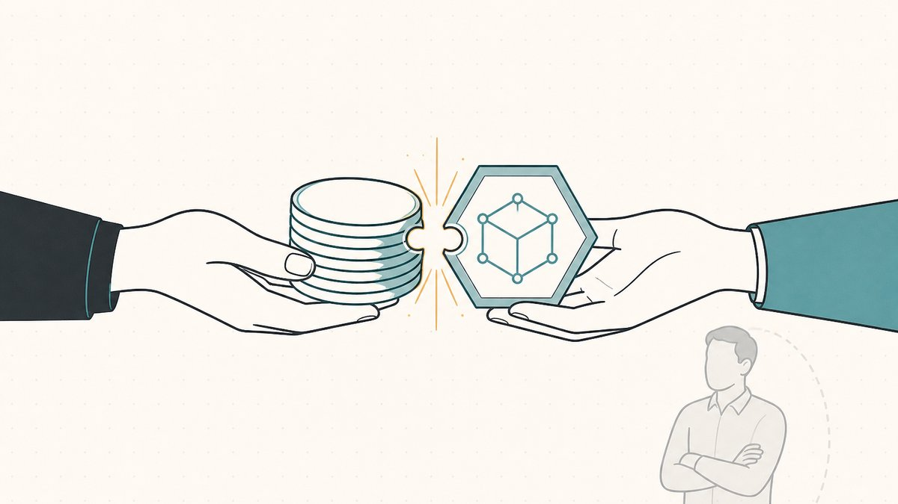
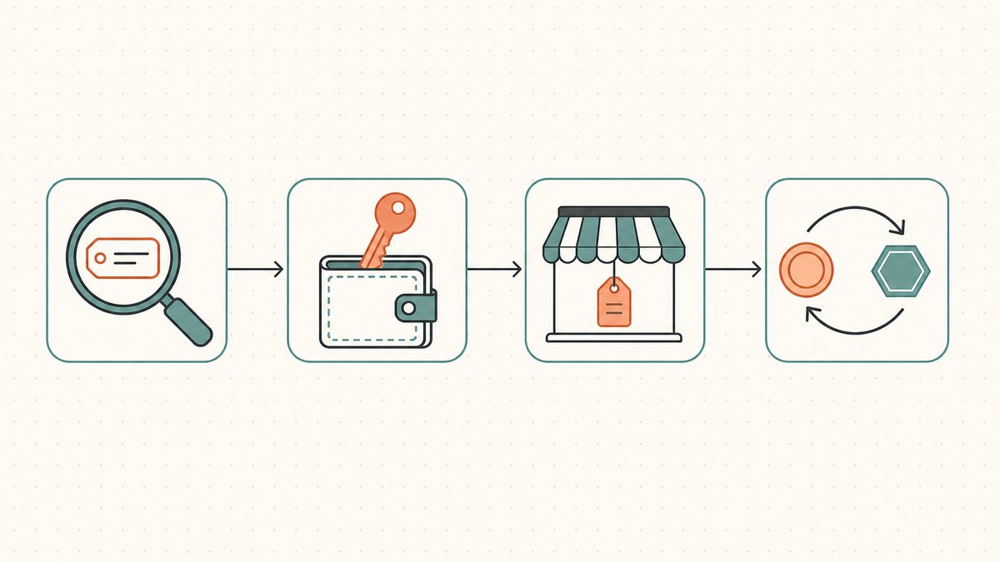

ドメインフリッピングの構造は単純だ——安く名前を仕入れ、それを必要とする買い手を見つけ、高く売る。この取引の古典的な形は、[レジストラ](/ja/glossary/registrar/)、二次流通マーケットプレイス、そして移転完了まで資金を預かるエスクロー代理人を通じて行われる。オンチェーン・ドメインフリッピングは、この「安く買って高く売る」という本質を[ブロックチェーン](/ja/glossary/blockchain/)上に移植したものだ。ドメイン名そのものが[ウォレット](/ja/glossary/wallet/)に保有するトークンとなり、他の[NFT](/ja/glossary/nft/)と同様に取引できる。

「名前をトークンにする」というこの一点の変化が、取引のほぼすべてのステップを塗り替える。保管・リスティング・決済が、レジストラのアカウント操作から、自分が直接コントロールするオンチェーン取引へと変わる。本ガイドでは、オンチェーン・ドメインフリッピングとは何かを説明し、「オンチェーンネーム」として売買できる2種類の資産の重要な違いを整理したうえで、取引の全プロセス——取得・保管・リスティング・決済——を順を追って解説する。これは、より広い[ドメインフリッピング](/ja/blog/domain-flipping/)戦略のオンチェーン柱に当たる内容だ。

## 「オンチェーン・ドメインフリッピング」とは何か

通常のフリッピングでは、所有権はレジストラのデータベースに存在する。アカウントにログインすると、レジストラのレコードによって自分がそのドメインを管理していることが示され、買い手への移転はレジストラが仲介するアカウント間・レジストラ間の[移転](/ja/glossary/atomic-transfer/)として行われる。資産そのものは本物だが、自分で直接保有しているわけではない——あくまでそのドメインを指し示すアカウントを持っているにすぎない。

オンチェーン・フリッピングでは、そのアカウントを[トークン](/ja/glossary/tokenize/)に置き換える。ドメイン名は[ERC-721](/ja/glossary/erc-721/)規格のNFTとして表現される。Ethereumの仕様では、これを[スマートコントラクト内のNFTに対する標準APIの実装を可能にする規格](https://eips.ethereum.org/EIPS/eip-721#:~:text=The%20following%20standard%20allows%20for%20the%20implementation%20of%20a%20standard%20API%20for%20NFTs)と定義しており、その概要では[非代替性トークン（NFT）、別称デジタル証書](https://eips.ethereum.org/EIPS/eip-721#:~:text=non%2Dfungible%20tokens%2C%20also%20known%20as%20deeds)のための標準インターフェースと呼んでいる。「証書（deeds）」という言葉がすべてを物語っている——トークンはドメインの権原証書であり、誰か別の者が管理するレコードの受領証ではなく、自分のウォレットに直接存在する。トークンを保有している者がドメインを支配し、支配権の移転はサポートチケットではなく[スマートコントラクト](/ja/glossary/smart-contract/)の呼び出しで完結する。

この特性こそが、オンチェーンのドメイン名が流動性のある資産クラスとして取引される理由だ。アートやコレクティブルと同じ[NFTマーケットプレイス](/ja/glossary/marketplace/)にリスト掲載でき、数分で決済が完了し、公開・監査可能な所有履歴が残る。フリッピングの形は、レジストラ移転というよりも、デジタル資産向けのレールの上で行われる[ドメイン取引](/ja/glossary/domain-trading/)に近い。

## オンチェーンネームの2種類——混同しないこと

売買を始める前に最も重要なのは、「オンチェーン・ドメイン」という言葉が、フリッパーにとって全く異なる挙動を示す2つの本質的に異なる資産を指しているという点を正しく理解することだ。

第一は、[Web3](/ja/glossary/web3/)ネイティブのネームだ。その典型が[ENS](/ja/glossary/ens/)（`.eth`）である。これらのネームは完全にEthereum上に存在する。[ICANN](/ja/glossary/icann/)のルートには属さないため、`vitalik.eth`はリゾルバやブリッジなしでは一般的なブラウザでは解決されない。その価値はウォレット・アイデンティティと暗号ネイティブな命名にある。ENSは公開された登録市場でもあり、ENSのドキュメントによれば、[5文字以上の.ethは年間5ドル](https://docs.ens.domains/registry/eth#:~:text=letter%20%60.eth%60%20will%20cost%20you%20%605%20USD%60%20per%20year)で取得でき、4文字・3文字のネームは設計上より高く設定されている。また登録済みのネームは[他のERC-721トークンと同様に移転可能](https://docs.ens.domains/registry/eth#:~:text=just%20like%20with%20any%20other%20ERC721%20token)だ。この低くて透明な登録フロアこそ、短いプレミアム`.eth`ネームが独自の投機市場を形成した理由に他ならない。

第二は、**トークン化されたICANNドメイン**だ——実際の`.com`、`.xyz`、`.io`の所有権をNFTとしてミラーリングしたもので、基盤となるDNS名は引き続き世界中で解決される。[トークン化ドメインとは何か](/ja/blog/what-are-tokenized-domains/)の解説記事で説明している通り、これらは並行したネームスペースではなく、オンチェーン表現も持つ*本物の*DNSドメインだ。フリッパーにとって、この違いは具体的な意味を持つ。トークン化された`.com`は、従来のインターネットが持つ普遍的な解決性・メール・証明書サポートを備えている。一方、ENSネームは暗号ネイティブなユーティリティを持つが、ウェブサイトとして機能させるにはブリッジが必要だ。どちらもオンチェーンでフリッピングできるが、同じ商品ではなく、買い手が対価として求めているものも異なる。両者の比較は[トークン化ドメインとWeb3ドメインの違い](/ja/blog/tokenized-domain-vs-web3-domain/)で直接行っている。

第三のカテゴリとして、Unstoppable DomainsなどのプラットフォームによるWeb3 TLDがある。これはトークン化されたICANNドメインよりもENSに近い。[プレミアムWeb3 TLDs](/ja/blog/premium-web3-tlds/)のガイドでそれらの位置づけを解説している。3つを明確に区別すれば、それぞれを正しく価格設定できる。

## レジストラ二次流通フリッピングとの違い

両者の仕組みが最も大きく乖離するのが決済の段階だ。従来のフリッピングでは緊張が走る場面でもある。レジストラの世界では、売り手と買い手が膠着状態に陥る——売り手は入金前には移転したくない、買い手はドメインを受け取る前には支払いたくない。そのため、第三者の[エスクロー](/ja/glossary/escrow/)代理人が双方の間に立つ必要がある。この古典的なワークフローは[ドメインエスクロー解説](/ja/blog/domain-escrow-explained/)で詳しく取り上げている。

オンチェーンでは、その膠着状態を単一のアトミックトランザクションに凝縮できる。NFT向けに構築されたマーケットプレイスプロトコルは、支払いと移転を同時に、さもなければ何も起こらないという形で実行できる。OpenSeaの注文プロトコルであるSeaportは、自らを[NFTを安全かつ効率的に売買するためのマーケットプレイスプロトコル](https://github.com/ProjectOpenSea/seaport#:~:text=marketplace%20protocol%20for%20safely%20and%20efficiently%20buying%20and%20selling%20NFTs)と称しており、実際の効果として、買い手の支払いと売り手のトークンが一回の決済ステップで交換される。代理人が取引の途中で資産を保有するのではなく、コントラクトがスワップを強制執行する。これが、トークン化マーケットプレイスが[エスクローを代替する](/ja/blog/how-tokenized-marketplaces-replace-escrow/)と言う際の仕組みだ。

その他の主な違い：

- **保管は自分の責任。** レジストラのアカウントの代わりに、資産はウォレットに存在する。プラットフォームのロックインやアカウント凍結リスクがなくなる反面、[鍵の管理](/ja/glossary/custodial-ownership/)の全責任が自分に移る——鍵を失えばドメインも失う。
- **流動性が広がる。** トークン化されたドメイン名は、ドメイン専用の二次流通マーケットだけでなく、他のERC-721資産と並んで汎用NFTマーケットプレイスにリスト掲載できる。それにより、閲覧者と入札者の母数が広がる。
- **来歴が公開されている。** 過去の全売買・移転履歴がオンチェーンで可視化されているため、買い手はマーケットプレイスの言葉を信じることなく履歴を確認できる。鑑定や盗品でないことの証明に有用だ。

## 取引のステップごとの解説：取得・保管・リスティング・決済

### 取得

オンチェーンネームのソーシングは、他のフリッピングと同じ——割安な資産を探す——が、チャネルが異なる。ENSネームはENS登録市場か二次流通NFTマーケットプレイスから入手できる。登録手数料は誰でもオンチェーンで読み取れるため、フロアは透明だ。トークン化されたICANNドメインは、割安だと判断している実在の`.com`を[登録またはトークン化](/ja/blog/how-to-tokenize-your-com/)するか、すでにトークン化されているものを購入することで入手できる。規律は[ドメイン取引](/ja/glossary/domain-trading/)全般と同じだ——誰も買わないような名前に入れ込まず、入手時に払い過ぎない。なぜなら取得価格がそのままマージンを決定するからだ。

### 保管

これがレジストラ・フリッピングには存在しないステップであり、新規フリッパーが軽視しがちな部分だ。名前がNFTになった瞬間、*自分自身*が保管システムになる。ホットウォレットはアクティブトレードに便利だが、最もリスクが高い。ハードウェアウォレットや[マルチシグ](/ja/glossary/multi-sig/)構成は利便性を犠牲にする代わりに、数ヶ月保有する資産をより強固に保護する。マルチシグが本当に正解かは検討の余地がある——[マルチシグウォレットは実際にセキュリティを改善するのか](/ja/blog/do-multisig-wallets-actually-improve-security/)で詳しく検討している。また鍵を失えばドメインを失うリスクがあるため、必要になる前にリカバリー計画を持っておくこと。[ウォレット喪失後のトークン化ドメインの回復](/ja/blog/recovering-a-tokenized-domain-after-wallet-loss/)では何ができて何ができないかを解説している。

### リスティング

オンチェーンネームのリスティングは、パークドドメインに「売却中」のランディングページを設置する行為ではなく、マーケットプレイス上でのアクションだ。NFTマーケットプレイス上で固定の即決価格かオークションを直接設定し、リスティング自体がオンチェーン（またはマーケットプレイス署名）の注文となる——どの買い手でもフィルできる状態だ。トークン化されたICANNドメインの場合は、通常のセールスページのファネルという選択肢も残っており、違いはクロージングがエスクロー手続きではなくトークンスワップで行われる点だ。トークン化ドメイン特有の話として、[DNS継続性](/ja/blog/dns-on-tokenized-domains/)がここで重要になる。よく構築されたトークン化ドメインは、所有権移転の間も問題なく解決され続けるため、売却中にサイトが止まることがない。

### 決済

決済こそ、オンチェーンの仕組みが報われる瞬間だ。買い手が注文をフィルすると、支払いとトークン移転が同時に実行され、一回の確定トランザクションで所有権が移動する。ENSネームの場合はここで終わり——新たな保有者が`.eth`ネームを支配する。トークン化されたICANNドメインの場合、トークン移転が証書となり、プラットフォームが基盤のDNS登録を同期させることで、買い手は解決可能な本物のドメインを手に入れる。いずれの場合も、どちらかの当事者が先に動く必要はなく、代理人が途中で資産を保有することもない。

## 数字の現実

オンチェーン・フリッピングは宝くじではなくポートフォリオゲームだ——保有する名前の大半は売れず、利益が発生した案件が維持コストを賄う。ただし、ヘッドラインを飾った取引はこのカテゴリが注目を集める理由を示している。The Blockによれば、これまでで最高値をつけたENSネームは[paradigm.ethで、2021年10月に420 ETH（当時約150万ドル）で購入された](https://www.theblock.co/post/155685/ethereum-name-service-records-second-highest-ens-name-sale#:~:text=paradigm.eth%2C%20which%20was%20purchased%20in%20October%202021%20for%20420%20ETH)。同レポートでは、[000.ethが2022年7月に300 ETH（31万5000ドル）で購入された](https://www.theblock.co/post/155685/ethereum-name-service-records-second-highest-ens-name-sale#:~:text=000.eth%20was%20purchased%20for%20300%20ETH)とも報告している。

これらを事業モデルではなく外れ値として扱うこと。`.com`の超高額売却に適用される現実確認が、オンチェーンネームにはさらに増幅して当てはまる——オンチェーンネームの価格は暗号資産市場のボラティリティに乗る。ETH建てのフロアは、ひとつの名前も動かずにドル換算で半分になる可能性がある。ハイライトリールではなく、冷静な鑑定こそがオンチェーン・ポートフォリオを黒字に保つ鍵だ。

## Namefiの位置づけ

ウォレット保有の権原・アトミック決済・エスクロー不要という、クリーンなオンチェーン・フリップのワークフローは、まさに[Namefi](https://namefi.io)が*実際の*ICANNドメインに対して提供することを目指して構築されたものだ。トークン化された所有権により、`.com`の支配権はNFTのように監査可能かつ移転可能になる。一方でDNS継続性により移転中もドメインの解決は維持されるため、フリッパーはオンチェーンの流動性を得ながらも、買い手が実際に対価を払う「普遍的な解決性」を手放さずに済む。既に保有しているドメインをこのモデルに移行したい場合は、[.comをトークン化する方法](/ja/blog/how-to-tokenize-your-com/)のウォークスルーを参照し、プラットフォームのトレードオフについては[ドメイン・トークン化プラットフォームの選び方](/ja/blog/choosing-a-domain-tokenization-platform/)を参照されたい。

## 免責事項（必ずお読みください）

> 当社は弁護士・会計士・ファイナンシャルアドバイザー・医師ではありません。また**本記事のいかなる内容も、法律・金融・税務・会計・医療その他いかなる種類の専門的アドバイスも構成しません。** これらの投稿は自社の学習を目的として、また顧客への利便として作成しています。掲載情報は古くなっている場合、特定地域にのみ適用される場合、または単純に誤りが含まれる場合があります。私たちも間違いを犯します。
>
> 重要な判断を行う際には、**必ず実際の専門家に相談してください（本当に！）**。あるいはそれが好みでない方は、友人・Twitter・Reddit・AI・占い師に尋ねてみてください。要は：**DOYR——自分でリサーチすること**。一緒に学び、楽しみましょう。

## 出典および参考資料

- Ethereum Improvement Proposals — [ERC-721 Non-Fungible Token Standard（NFT、別称「証書」）](https://eips.ethereum.org/EIPS/eip-721#:~:text=non%2Dfungible%20tokens%2C%20also%20known%20as%20deeds)
- ENS ドキュメント — [ETH Registrar（登録価格；ERC-721トークンとしての移転）](https://docs.ens.domains/registry/eth#:~:text=letter%20%60.eth%60%20will%20cost%20you%20%605%20USD%60%20per%20year)
- ProjectOpenSea — [Seaport（NFTを安全かつ効率的に売買するためのマーケットプレイスプロトコル）](https://github.com/ProjectOpenSea/seaport#:~:text=marketplace%20protocol%20for%20safely%20and%20efficiently%20buying%20and%20selling%20NFTs)
- The Block — [ENSドメイン000.ethが300 ETHで売却；paradigm.ethは420 ETHで最大のENS売却として残る](https://www.theblock.co/post/155685/ethereum-name-service-records-second-highest-ens-name-sale#:~:text=000.eth%20was%20purchased%20for%20300%20ETH)
