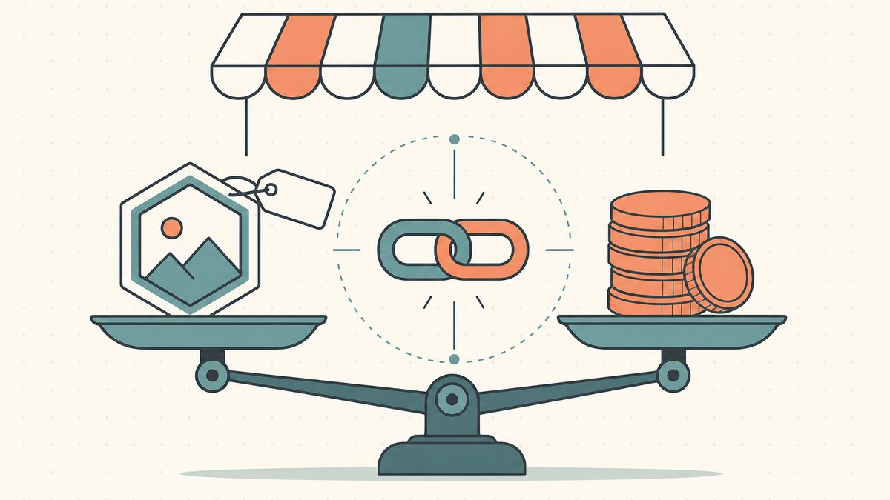
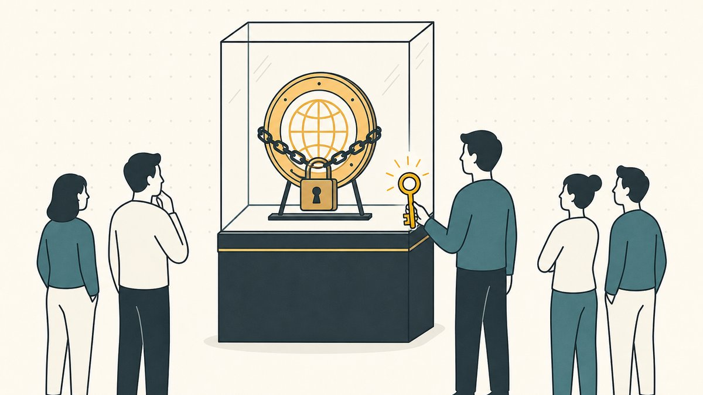
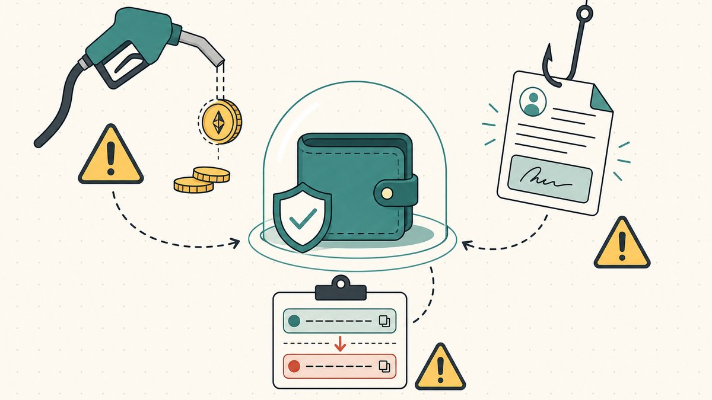

従来のドメイン売買には、構造的な信頼の問題がある。売り手は入金前に移管したくない。買い手は名義が自分のアカウントに届く前に送金したくない。[エスクロー](/ja/glossary/escrow/)業界全体が、この双方の不信を埋める存在として成立してきた。ドメインを[NFT](/ja/glossary/nft/)として売却すると、この膠着状態は根本から変わる。実在するICANNドメインの所有権が[オンチェーン](/ja/glossary/on-chain/)トークンでもある場合、そのドメインは資金の移動と同じトランザクション内で出品・価格設定・引き渡しができる資産になる。支払いと移管の間に資産を預かる仲介者は不要だ。

このガイドはその流動性レイヤーを解説する。[ドメイン](/ja/glossary/domain-trading/)NFTを出品したとき実際に何が起きるか、マーケットプレイスの仕組み、公開出品ではなく買い手限定プライベート出品を使うべき場面、ロイヤルティの挙動、そしてオンチェーン取引の利益を静かに削るガス代と詐欺の落とし穴を取り上げる。これは[ドメインフリッピング](/ja/blog/domain-flipping/)シリーズの一部であり、トークン化されたドメインとは何かをすでに理解していることを前提とする。まだであれば、まず[トークン化ドメインとは何か](/ja/blog/what-are-tokenized-domains/)から始めてほしい。

## 実際に何を売っているのか

最初に、この記事全体の前提となる重要な区別を整理しておく。トークン化ドメインは[ENS](/ja/glossary/ens/)ネームやUnstoppableネームとは別物であり、売却行為の意味もまったく異なる。

- **[ENS](https://ens.domains) `.eth` ネーム**はEthereum上にのみ存在する。ENS対応の[ウォレット](/ja/glossary/wallet/)やアプリを通じて名前解決されるが、一般のブラウザのアドレスバーからは解決されない。ENSは文字数で登録料を設定しており、ENSドキュメントによれば[5文字以上の`.eth`は年間5米ドル](https://docs.ens.domains/registry/eth#:~:text=a%20%605%2B%60%20letter%20%60.eth%60%20will%20cost%20you%20%605%20USD%60%20per%20year)、[4文字は年間160米ドル](https://docs.ens.domains/registry/eth#:~:text=A%20%604%60%20letter%20%60160%20USD%60%20per%20year)、[3文字は年間640米ドル](https://docs.ens.domains/registry/eth#:~:text=and%20a%20%603%60%20letter%20%60640%20USD%60%20per%20year)となっている。
- **Unstoppableネーム**（`.crypto`、`.x`など）は、ICANNルートの外でミントされた[Web3](/ja/glossary/web3/)ネームだ。
- **トークン化ICANNドメイン**が本シリーズの対象だ。すべてのブラウザで名前解決される実在の`example.com`であり、かつそのコントロールを表すトークンがウォレットに存在する。3者の詳細な比較は[トークン化ドメインとWeb3ドメインの違い](/ja/blog/tokenized-domain-vs-web3-domain/)を参照してほしい。

以下で説明するマーケットプレイスの仕組みはいずれにも適用される。すべてNFTだからだ。しかし移転される*価値*はまったく異なる。ENSネームを売却すると、買い手が得るのはオンチェーン上のアイデンティティのみだ。トークン化された`.com`を売却すると、買い手が得るのは、引き渡し中もDNSが機能し続けるユニバーサルに解決可能なビジネス資産だ。洗練された出品フローに惑わされて、一方を他方と同じ価格帯で設定してしまわないよう注意してほしい。

## ドメインNFTが流動性を持つ仕組み

取引されるドメインNFTのほぼすべては[ERC-721](/ja/glossary/erc-721/)トークンだ。Wikipediaによれば、これは[Ethereumブロックチェーン上でユニークな非代替性トークン（NFT）を作成・管理するためのルールとインターフェースの集合を定義する技術的フレームワーク](https://en.wikipedia.org/wiki/ERC-721#:~:text=is%20a%20technical%20framework%2C%20defining%20a%20set%20of%20rules%20and%20interfaces%20for%20creating%20and%20managing%20unique)だ。標準トークンであることが流動性の源泉だ。ERC-721に対応した[マーケットプレイス](/ja/glossary/marketplace/)、ウォレット、[スマートコントラクト](/ja/glossary/smart-contract/)であれば、そのドメインが特別扱いを必要とすることなく、出品・エスクロー・担保として利用できる。

この標準化こそが流動性の全体像だ。従来のドメインはレジストラまたはドメインマーケットプレイスが許可する場所でしか売れない。ドメインNFTはERC-721が理解される場所ならどこでも売れる。今日それはNFTエコノミーの大半を意味する。これがトークン化によって取引の構造が変わる根本理由であり、[トークン化がドメインフリッピングの経済をどう変えるか](/ja/blog/how-tokenized-marketplaces-replace-escrow/)でより詳しく解説している。

## マーケットプレイスへの出品：SeaportとOpenSea

NFT取引の主要な基盤は[Seaport](https://docs.opensea.io/docs/seaport)と[OpenSea](https://opensea.io)だが、この2つが異なるレイヤーであることを理解しておくと役立つ。SeaportはプロトコルでありOpenSeaはその上に構築されたひとつのストアフロントだ。OpenSea自身のドキュメントによれば、[Seaportはブロックチェーン上でNFTを安全かつ効率的に売買するためのマーケットプレイスプロトコル](https://docs.opensea.io/docs/seaport#:~:text=Seaport%20is%20a%20marketplace%20protocol%20for%20safely%20and%20efficiently%20buying%20and%20selling%20NFTs)であり、[SeaportはOpenSeaウェブサイトを動かしている](https://docs.opensea.io/docs/seaport#:~:text=Seaport%20powers%20the%20OpenSea%20website)。OpenSea上のすべての注文はSeaportを通じて処理される。

売り手にとって重要なメンタルモデルは、Seaportの双方向構造だ：**オファー**と**コンシデレーション**。オファーは売り手が提供するもの（ドメインNFT）。コンシデレーションは売り手が求めるもの（ETHまたはステーブルコインでの価格、プラス各関係者に送金される手数料やロイヤルティ）。この注文に一度署名すれば、買い手が履行するまで何も動かない。買い手が履行したとき、プロトコルは1つのアトミックなステップで双方を決済する。売り手のトークンと買い手の支払いが同一トランザクション内でスワップされるか、どちらも実行されないかのどちらかだ。このアトミック性こそが[アトミックトランスファー](/ja/glossary/atomic-transfer/)特性であり、エスクローを置き換える。一方が支払い済みで他方がまだ引き渡していないという時間的な窓は存在しない。

実際の出品は2段階の手順であり、多くの売り手は一度経験すれば慣れる：

1. **承認。** あるウォレットから初めて出品するとき、売却が発生した際にマーケットプレイスのコントラクトがそのトークンを移動できるよう承認に署名する。これにはガス代がかかる。同じコレクションの別のトークンを以降に出品する際は、通常ガス代は不要だ。
2. **出品注文。** 実際の注文、すなわち価格・通貨・期間に署名する。多くのマーケットプレイスでこの署名は**ガス不要**だ。メッセージに署名するだけでトランザクションを送信するわけではないため、固定価格での出品作成やキャンセルは通常、誰かが購入するまでコストがかからない。

実際的な帰結として、固定価格購入のガス代は通常売り手ではなく買い手が負担する。OpenSeaの売り手ガイドには明示されており、[固定価格アイテムの購入時はバイヤーがガス代を負担する](https://opensea.io/learn/nft/how-to-sell-nfts#:~:text=Buyers%20pay%20gas%20fees%20when%20purchasing%20a%20fixed%2Dprice%20item)一方、[オファーを受け入れる場合は売り手がガス代を負担する](https://opensea.io/learn/nft/how-to-sell-nfts#:~:text=Sellers%20pay%20gas%20fees%20when%20accepting%20offers)とある。つまり出品して待てばガス代は買い手が払い、受け取ったオファーを積極的に承諾すれば売り手が払う。このガス代の非対称性は、ネットワークが混雑しているときの売り方の判断に影響する。

## 買い手限定プライベート出品

誰にでも売れるコモディティなドメインなら公開出品で構わない。しかし実際のドメイン取引の多くは、まずオフマーケットで交渉される。メールや電話で価格が合意されてから、その*特定の買い手*との決済をスムーズかつトラストレスに行う手段が必要になる。そのような名前を公開出品するのは誤りだ。マーケットプレイスを監視している第三者が、合意済みの価格で買い手より先に購入してしまうリスクがある。

その対策が**買い手限定（プライベート）出品**であり、Seaportはコンシデレーションに必要な受取人を指定できるためこれをネイティブにサポートしている。OpenSeaでは出品フロー内でこれを設定できる。ガイドによれば、[特定の買い手のためにアイテムを予約できる。そのためには「予約」をクリックして相手のウォレットアドレスを入力する](https://opensea.io/learn/nft/how-to-sell-nfts#:~:text=reserve%20the%20item%20for%20a%20specific%20buyer.%20To%20do%20so%2C%20click)。その注文を履行できるのは指定されたウォレットだけだ。他の誰もが出品を見ることはできるが購入はできない。

これはブローカー経由の買い手限定決済に相当するオンチェーンの仕組みであり、Namefiがオファー主導の販売で採用しているパターンだ。価格は人間同士で交渉し、決済はプライベート出品として行う。合意した買い手だけがアトミックスワップを完結できる。オフマーケット取引のプライバシーとオンチェーン取引のエスクロー不要の確定性を両立できる。ただし送付先のウォレットアドレスは絶対に正確に確認すること。1文字でも間違えれば、5桁の価値を持つドメインを誰もコントロールできないアドレスに予約してしまうことになる。

## ロイヤルティ：売却後も継続するのか

一部のドメインNFTにはロイヤルティが設定されている。転売のたびにオリジナルの発行者やクリエイターに一定割合が送金される仕組みだ。この標準は[EIP-2981](https://eips.ethereum.org/EIPS/eip-2981)であり、コントラクトが[NFTが売買または再売買されるたびにNFTクリエイターまたは権利保有者に支払われるロイヤルティ金額をシグナルできる](https://eips.ethereum.org/EIPS/eip-2981#:~:text=to%20signal%20a%20royalty%20amount%20to%20be%20paid%20to%20the%20NFT%20creator%20or%20rights%20holder%20every%20time%20the%20NFT%20is%20sold%20or%20re%2Dsold)ためのものだと、仕様自身が説明している。

フリッパーが把握すべき2点がある。第1に、EIP-2981はロイヤルティを*シグナル*するだけであり、*強制*しない。ロイヤルティが実際に支払われるかはマーケットプレイスのポリシー次第であり、業界は2022〜2023年にかけてロイヤルティをほぼ任意のものにした。次の転売でロイヤルティが尊重されると仮定してリターンをモデル化しないこと。尊重されない可能性がある。第2に、ロイヤルティはフリッパーにとって双方向にコストを生む。売却時に支払うロイヤルティは利益率への実際のコストであり、プラットフォーム手数料はその上に積み重なる。OpenSeaのガイドによれば、ストアフロントは通常[売り手に1%の手数料を請求する](https://opensea.io/learn/nft/how-to-sell-nfts#:~:text=OpenSea%20typically%20charges%20a%201%25%20fee%20to%20the%20seller)とあり、クリエイター報酬が適用される場合もその収益から差し引かれる。確認前にマーケットプレイスが表示する手数料の内訳を読むこと。それが*自分の手取り*の見積もりであり、そのフリップが割に合ったかどうかを決める数字だ。

## ガス代と詐欺の落とし穴

オンチェーンの流動性は本物だが、新たなリスクの領域も伴う。主な2つはガス代と詐欺だ。

**ガス代。** Ethereumは計算処理に対して料金を徴収する。ethereum.orgによれば、[ガスとはEthereumネットワーク上で特定の操作を実行するために必要な計算量を計測する単位](https://ethereum.org/en/developers/docs/gas/#:~:text=Gas%20refers%20to%20the%20unit%20that%20measures%20the%20amount%20of%20computational%20effort)であり、ETHで支払われる。ネットワークが混雑している日に4桁の価格のドメインを取引する場合、承認＋決済のガス代が利益の相当部分を占めることがある。低価格のドメインであれば売却額を超えることさえある。2つの対策：承認はネットワークが静かなときに済ませておくこと、そしてEthereumメインネットではなく手数料の低いチェーンへの出品を検討すること。小規模なドメインを扱うフリッパーにとって、Ethereumメインネットだけでなく、Baseなどでのトークン化ドメインが意味を持つ理由の一つがここにある。

**詐欺。** オンチェーンの世界には固有の詐欺の類型があり、ドメインNFTはその標的になりやすい：

- **ウォレットアドレスのすり替え。** マルウェアやクリップボードハイジャッカーが貼り付けたアドレスを静かに置き換える。署名する前に、買い手または送付先アドレスの先頭と末尾の文字を必ず別の情報源と照合すること。
- **悪意ある「承認」署名。** 偽のマーケットプレイスやフィッシングサイトが、コントラクトにトークンへの広範な権限を付与する承認への署名を求めることがある。署名が何を承認するものか正確に理解できなければ、署名しないこと。予期しない承認リクエストは敵対的なものとして扱うこと。
- **偽造出品。** 詐欺師が本物のトークン化ドメインであるかのように、よく似せたトークンをミントして出品する。買い手は発行者が公開しているコントラクトアドレスと照合して確認すること。売り手は自分の正規の出品が買い手に発見されるものであることを確認すること。カストディとプロベナンスが重要な理由の一つがここにあり、詳しくは[ウォレット紛失後のトークン化ドメインの回復](/ja/blog/recovering-a-tokenized-domain-after-wallet-loss/)と、[マルチシグウォレットはセキュリティを実際に向上させるか](/ja/blog/do-multisig-wallets-actually-improve-security/)での[マルチシグ](/ja/glossary/multi-sig/)設定の必要性を参照してほしい。
- **偽の「サポート」。** 正規の関係者からシードフレーズや「検証」署名を求めるDMが届くことはない。シードフレーズは自分の手元から離れることがあってはならない。以上。

共通するテーマがある。オンチェーン決済は*取引*における相手方リスクを取り除き、代わりに*自分のウォレット*における運用リスクに置き換える。エスクローエージェントがいなくなった。誤字のある転送を以前ならば人間が気づいていた。その責任は今や自分にある。

## フリッパーにとっての意味

ドメインをNFTとして売却することで、ドメインは真の意味で流動性を持つ資産になる。ERC-721トークンとして、ガス不要で出品し、アトミックに決済し、特定の買い手のみに予約し、単一のレジストラのアフターマーケットではなく深いマーケットプレイスエコシステム全体を通じて移動できる。従来の売買を定義していたエスクローの膠着状態は概ね解消される。その代わりに求められるのはオンチェーンリテラシーだ。何に署名しているか、ガスにいくらかかるか、どの相手が本物かを理解すること。

トークン化されたドメインが取引の経済学をどう変えるかの全体像については、[ドメインフリッピング](/ja/blog/domain-flipping/)がその起点であり、[ドメインをトークン化する理由](/ja/blog/why-tokenize-domains/)がオンチェーンレイヤーを加える根拠を論じている。実際のブラウザで解決されるドメインを使ってエンドツーエンドの売却を試したい場合、[Namefi](https://namefi.io)はまさにこのために構築されている。引き渡し中もDNSが解決し続けるトークン化された`.com`をオンチェーンで出品・決済できる。

## 免責事項（必ずお読みください）

> 私たちは弁護士でも会計士でも金融アドバイザーでも医師でもなく、**本記事のいかなる内容も、法的・財務的・税務的・会計的・医学的、またはその他の専門的アドバイスを構成しません。** これらの記事は自己学習および顧客への参考情報として執筆しています。情報が古くなっている、特定の地域にのみ当てはまる、または単純に誤っている可能性があります。私たちも間違いを犯します。
>
> 重要な判断を行う場合は、**必ず専門家にご相談ください（本当に！）**。それが合わなければ、友人に聞く、Twitter（X）で聞く、Redditで聞く、AIに聞く、占い師に聞くのも自由です。要するに：**DYOR - Do Your Own Research（自分でリサーチしよう）**。一緒に学んで楽しみましょう。

## 出典・参考資料

- OpenSea Docs — [Seaport（マーケットプレイスプロトコル；OpenSeaを動かす；オファー/コンシデレーションモデル）](https://docs.opensea.io/docs/seaport#:~:text=Seaport%20is%20a%20marketplace%20protocol%20for%20safely%20and%20efficiently%20buying%20and%20selling%20NFTs)
- OpenSea — [NFTの売り方（特定の買い手への予約；ガス代負担者；売り手1%手数料）](https://opensea.io/learn/nft/how-to-sell-nfts#:~:text=Buyers%20pay%20gas%20fees%20when%20purchasing%20a%20fixed%2Dprice%20item)
- Wikipedia — [ERC-721（Ethereum上の非代替性トークン標準）](https://en.wikipedia.org/wiki/ERC-721#:~:text=is%20a%20technical%20framework%2C%20defining%20a%20set%20of%20rules%20and%20interfaces%20for%20creating%20and%20managing%20unique)
- Ethereum Improvement Proposals — [EIP-2981（NFTロイヤルティ標準）](https://eips.ethereum.org/EIPS/eip-2981#:~:text=to%20signal%20a%20royalty%20amount%20to%20be%20paid%20to%20the%20NFT%20creator%20or%20rights%20holder%20every%20time%20the%20NFT%20is%20sold%20or%20re%2Dsold)
- ENS Docs — [.eth登録料（文字数別：年間$5 / $160 / $640）](https://docs.ens.domains/registry/eth#:~:text=a%20%605%2B%60%20letter%20%60.eth%60%20will%20cost%20you%20%605%20USD%60%20per%20year)
- ethereum.org — [ガスと手数料（ガスの定義）](https://ethereum.org/en/developers/docs/gas/#:~:text=Gas%20refers%20to%20the%20unit%20that%20measures%20the%20amount%20of%20computational%20effort)
