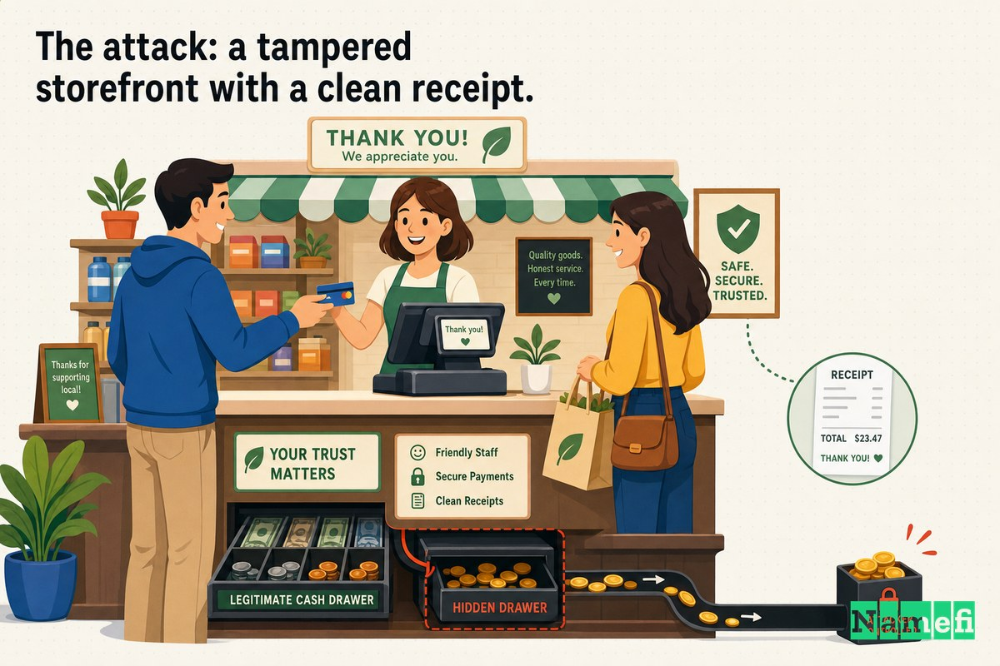
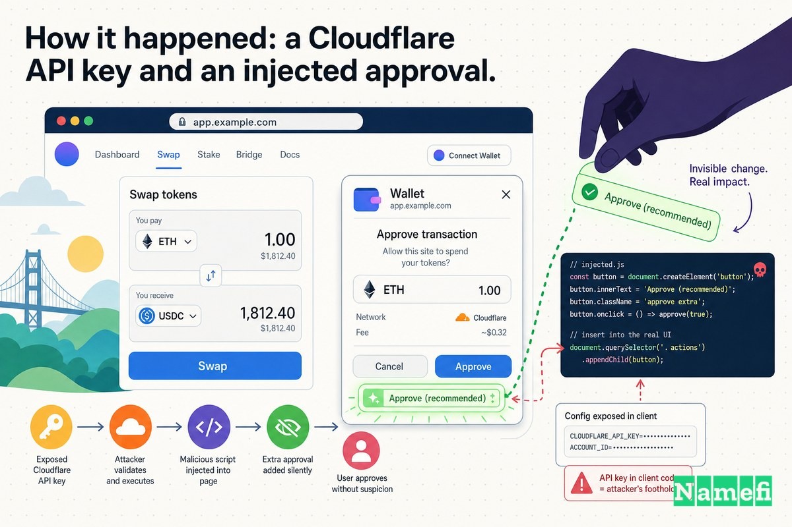
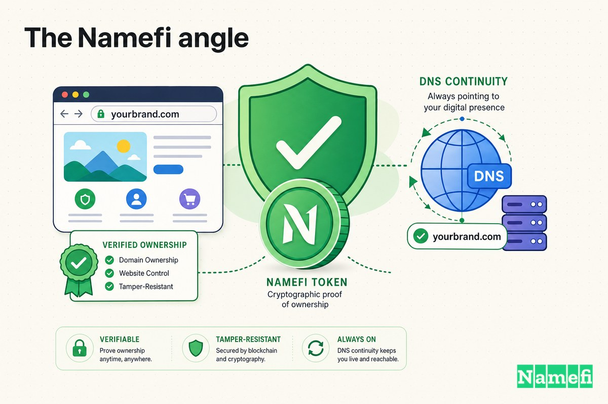

監査は問題なしだった。コントラクトも正常だった。それでも資金は消えた。

2021年12月2日前後、Bitcoin を分散型金融に組み込むことを目的とした[DeFi](/ja/glossary/defi/)プロジェクトBadgerDAOは、ユーザーの資金のうち約**1億2000万ドル**を失った。フラッシュローンの仕掛けも、再入攻撃のバグも、ボールトへの巧妙な数学的エクスプロイトも存在しなかった。[スマートコントラクト](/ja/glossary/smart-contract/)は設計通りに動作した。攻撃者はコントラクトを破る必要がなかった——なぜなら、攻撃者はコントラクトを攻撃しなかったからだ。

攻撃したのは、*ウェブサイト*だった。

何者かが、app.badger.comのフロントエンドに悪意あるスクリプトをひそかに埋め込んでいた。ページを読み込んだすべてのユーザーの目には、普段使い慣れた信頼できるdAppと変わらなく映った。しかし操作を行おうとすると、ページはユーザーの[ウォレット](/ja/glossary/wallet/)に対して、見えない形でたった1つの追加許可を求めてきた。そして「承認」をクリックした瞬間、トークンはもはや自分のものではなくなった。

これは、監査済みコントラクトを持つプロジェクトが、フロントエンドコードに1行注入されただけで9桁の損失を被ったいきさつであり、セキュリティの境界について根本的に考え方を改める必要があることを示す事例だ。

## 心地よい嘘——「コントラクトは監査済みだ」

暗号資産コミュニティはユーザーに対し、プロトコルを信頼する前に一つのことを確認するよう訓練してきた。*監査されているか？*という問いだ。監査には意味がある。実際のバグを発見する。しかしいつの間にか、「コントラクトは監査済みだ」という言葉が完全な安全を示す感覚へと変質し、まるでそのプロジェクト名を冠したすべてのものを守る力場であるかのように受け取られるようになった。

そうではない。

監査が検査するのは[オンチェーン](/ja/glossary/on-chain/)コードだ。ボールト、トークンのロジック、アクセス制御——これらが対象となる。開発者がログインしたまま置き忘れたノートPC、ブラウザを特定の場所へ誘導する[DNS](/ja/glossary/dns/)レコード、サイトの前段に置かれたCDN、あるいはdAppにアクセスした際にブラウザが実際にダウンロードして実行するJavaScript——これらは監査の対象外だ。それらは*Web2*の領域にある。クラウドアカウント、APIキー、ドメインインフラの中に存在し、Solidityのコードと同じくらい重要な基盤を担っている。

BadgerDAOは、このギャップを示す最も明確な証拠だ。この事件の技術的分析が端的に述べているように、[スマートコントラクトの観点からは何も問題は発生しておらず](https://www.halborn.com/blog/post/explained-the-badgerdao-hack-december-2021#:~:text=From%20the%20perspective%20of%20the%20project%27s%20smart%20contracts%2C%20nothing%20had%20gone%20wrong)、攻撃者はユーザーが付与した承認を利用していただけだった。チェーンは完璧に機能していた。嘘をついていたのはウェブサイトだった。

## 攻撃の手口——正常な領収書が発行される改ざんされた店舗

何百回も訪れたことのある店に入ったと想像してほしい。同じ看板、同じスタッフ、同じカウンター。小さな商品を買い、レジで会計し、カードをタップする。すべてが普段通りに見える。しかしその裏では、カードリーダーがこっそり別のものに入れ替えられており、見知らぬ誰かがいつでも好きなときに、あなたの口座から2度目の無制限引き落としを静かに承認できる仕組みになっていた——。

これが、BadgerDAOユーザーに起きたことの本質だ。

この分類は重要だ。なぜなら、この事件がこれほど教訓的である理由がそこにあるからだ。*Vice*が要約したように、このハッキングは[複雑なスマートコントラクトのエクスプロイトを伴うものではなく、BadgerDAOのウェブインフラを標的としたフロントエンド攻撃だった](https://www.vice.com/en/article/hackers-steal-dollar119m-from-web3-crypto-project-with-old-school-attack/#:~:text=injected%20a%20malicious%20script%20into%20BadgerDAO%27s%20frontend)——具体的にはCloudflareアカウントを狙ったものだった。彼らの表現を借りれば、[Web3](/ja/glossary/web3/)ターゲットに向けた*昔ながらの*ウェブ攻撃だったのだ。

手口はシンプルで静かなものだった。悪意あるスクリプトがユーザーのウォレットに対し、攻撃者のアドレスへのトークン送付許可を求めた。Viceの言葉によれば、[悪意あるスクリプトは基本的に、人々をだまして攻撃者のアドレスへトークンを送信する権利を与えさせた](https://www.vice.com/en/article/hackers-steal-dollar119m-from-web3-crypto-project-with-old-school-attack/#:~:text=The%20malicious%20script%20basically%20tricked%20people%20into%20giving)。ユーザーはdAppとの通常の操作を行っているつもりだった。実際には、自分のトークンへのアクセス権限に署名させられていた。

セキュリティ研究者はこのパターンを*アイス[フィッシング](/ja/glossary/phishing/)*と呼ぶ。[秘密鍵](/ja/glossary/private-key/)を盗むのではなく、ユーザーをだまして自発的に悪意ある支出者を承認させる手法だ。署名は本物だ。承認は本物だ。オンチェーントランザクションは正当だ。だからこそ非常に危険なのであり、コントラクトの監査ではこれを防ぐことができない理由でもある。

## ユーザーが失ったもの——署名ひとつひとつで約1億2000万ドル

ボールトコードの1行にも触れることなく実行された攻撃としては、驚くべき被害額だ。

スマートコントラクト監査会社PeckShieldは[総損失額を約1億2000万ドルと推定した](https://cryptobriefing.com/120m-lost-badgerdao-defi-hack/)。BadgerDAOが独自に実施した事後分析では、すべての盗難資産を共通の通貨に換算したところ、損失は[約2,076.54 BTC（ハック当時のレートで約1億1,630万米ドル）](https://www.quadrigainitiative.com/casestudy/badgerdaomaliciouscodeinjected.php#:~:text=2076.54%20BTC)に達した。

被害は均等には分布しなかった。1件の取引だけで大部分を失ったとされる被害者が存在した——おそらく機関投資家向けアカウントだった。事例研究によると、[Yearn wBTCボールトから約900 BTCが引き出され](https://www.quadrigainitiative.com/casestudy/badgerdaomaliciouscodeinjected.php)、1者だけで[5,000万ドル超相当のWrapped Bitcoinを失った](https://www.quadrigainitiative.com/casestudy/badgerdaomaliciouscodeinjected.php#:~:text=lose%20over%20%2450%20million)とされている。残りは数百人の一般ユーザーが被った損害だ。

この規模の被害は、忍耐の産物でもあった。攻撃者はパニックで動いたのではない。Fortaの分析によると、[ハッカーはひそかに約200アカウントから承認を積み上げ、2021年12月2日午前0時48分に一気に被害者のウォレットを10時間以内に空にした](https://forta.org/blog/how-to-derail-a-120-million-dollar-hack#:~:text=The%20hacker%20silently%20accumulated%20approvals%20from%20almost%20200%20accounts)。悪意ある承認は何日もかけて静かに蓄積されていた——仕掛けられた罠が、一斉に作動したのだ。別の調査では、キャンペーン期間中に[500のウォレットが無制限の承認を付与した](https://www.halborn.com/blog/post/explained-the-badgerdao-hack-december-2021#:~:text=The%20attacker%20managed%20to%20get%20500%20wallets)と集計されている。

最も残酷な事実は、慎重なユーザーであっても確認できる手段がなかったということだ。URLは正しかった。TLS証明書は有効だった。インターフェースは本物だった。おかしかったのはただ一点——正規のサイト自身が配信していたJavaScriptのひとかけらだけだった。

## 経緯——CloudflareのAPIキーと注入された承認

攻撃者が入り口に使ったのはスマートコントラクトではなかった。クラウドアカウントだった。

BadgerDAOは、現代のウェブの大部分と同様にCloudflareを使用していた——ウェブサイトを配信・高速化するコンテンツデリバリーおよびエッジコンピューティングのレイヤーだ。そのアカウントを支配することは、BadgerDAOのウェブサイトが訪問者に渡すコードを支配することを意味した。そして攻撃者は盗んだキーを通じてその支配権を手に入れた。

CoinDeskが伝えたBadgerDAOの公式説明によると、[ハッカーはBadgerのエンジニアが知らないうちに、また許可なく作成された侵害済みAPIキーを使用し、一部のユーザーに影響を与える悪意あるコードを定期的に注入した](https://www.coindesk.com/business/2021/12/10/badgerdao-reveals-details-of-how-it-was-hacked-for-120m)。「*一部のユーザーに*」という表現は、これほど長期間気づかれなかった理由の一つだ。スクリプトはすべてのユーザーに常に適用されたわけではなく、特定のユーザーにのみ間歇的に現れた。そのため悪意ある挙動を再現・発見することが極めて難しかった。

なぜ許可されていないAPIキーが存在し得たのか。根本原因はCloudflareアカウントの欠陥に遡った。事例研究によると、[メール認証が完了する前に](https://www.quadrigainitiative.com/casestudy/badgerdaomaliciouscodeinjected.php#:~:text=before%20email%20verification%20was%20completed)、未認証ユーザーがアカウントを作成し、さらにグローバルAPIキー（削除も無効化もできない）を作成・閲覧できる状態になっていた。攻撃者はアカウントに対してキーを仕込み、本来の所有者が認証を完了してアカウントを有効化するのを待つだけでよかった——有効化された瞬間から、攻撃者は有効なAPIアクセス権を静かに手にしていた。

そのキーを使って攻撃者はCloudflare Workers——Cloudflareのエッジコンピューティングプラットフォーム——を悪用し、ページがユーザーに届く途中で書き換えた。BadgerDAOがサイバーセキュリティ会社Mandiantと協力してまとめた事後分析では、2021年12月2日のフィッシング事件はCloudflare Workersによって提供された悪意あるスニペットの注入が原因だったと結論づけられた。注入されたコードが行ったのは、dAppの通常フローに余分なトークン承認リクエストを差し込むというただ一つのことだった。

使用された承認呼び出しにさえ、意図的な工夫があった。CryptoBriefingが報じたところによると、[ハッカーはBadgerのウェブサイトに悪意あるスクリプトを挿入し、ユーザーに「allowanceの増加」のトランザクションを提示した](https://cryptobriefing.com/120m-lost-badgerdao-defi-hack/#:~:text=presented%20users%20with%20a%20transaction%20to)という。この選択は偶然ではなかった。生の`approve`呼び出しと比べて、`increaseAllowance`プロンプトはウォレットのポップアップで視覚的に弱い、警戒を促さない表示になりやすい——赤いフラグが少なく、「支出権限を付与しようとしています」という警告が薄くなるのだ。攻撃者は、盗まれる側の*ユーザー体験*を最適化していた。

こうして全体の連鎖は次のようになる。Cloudflareアカウントの認証の脆弱性により未認証のAPIキーが存在できた→攻撃者がそのキーを使ってWorkerをデプロイした→WorkerがApp.badger.comにスクリプトを注入した→スクリプトがウォレットに攻撃者へのトークン許可を求めた→ユーザーが承認した→攻撃者が資金を引き出した。この連鎖のどの段階も、監査済みコントラクトには一切触れていない。

## 対応——Web2の傷を止めるためにチェーンを一時停止する

12月2日の早朝にドレインのトランザクションが大規模に発生し、オンチェーンの足跡がついに無視できなくなると、BadgerDAOは迅速に動いた——完全にオフチェーンで始まった問題を、スマートコントラクトを使って止めた。

チームは公式に事態を認め、CryptoBriefingの報道によると[すべてのスマートコントラクトが一時停止され、それ以上の引き出しを防ぐ措置が取られた](https://cryptobriefing.com/120m-lost-badgerdao-defi-hack/)と確認した。Badgerのボールトには一時停止機能があったため、送金を凍結することで攻撃者が新たに承認された資金を動かし続けることを防いだ。ある技術的分析では、この停止は`transferFrom`関数——悪意ある承認が悪用していた[ERC-20](/ja/glossary/erc-20/)のメカニズムそのもの——へのすべての呼び出しを凍結するチームの権限を行使したものと説明されている。この停止があったからこそ、損失の一部は理論上回収可能だった。攻撃者が移動させたものの、凍結が入る前にBadgerのボールトから完全に引き出されていなかった資産が存在したからだ。

インフラ面では、クレデンシャル侵害に伴うWeb2の教科書的な後処理が行われた。CloudflareのAPIキーのローテーション、アカウントパスワードの変更、多要素認証の強化、存在すべきでなかったすべてのキーの監査だ。BadgerDAOはその後Mandiantと連携して調査を行い、タイムライン——Cloudflareアカウントの脆弱性、その数ヶ月前に作成された不正なキー、11月のスクリプト注入、12月のドレイン——を再構成した技術的事後分析を公表した。

しかし、どれほどインシデント対応を尽くしても、ユーザーがすでに付与してしまった承認を取り消すことはできなかった。署名は有効だった。事後対応は将来の盗難を防ぎ、回収を追うことはできる——しかし、すでにオンチェーンで与えられた同意を覆すことはできない。

## 教訓——ウェブサイトもセキュリティの攻撃面である

BadgerDAO事件の最も重要な教訓は、境界の修正だ。多くのチームが——そして多くのユーザーが——セキュリティの境界をスマートコントラクトの周囲に引く。BadgerDAOは、その境界がはるかに広いことを証明した。

**1. フロントエンドは常に対象範囲に含まれる。** ユーザーのブラウザが実行するコードは、オンチェーンに存在するかどうかにかかわらず、プロトコルの一部だ。攻撃者がサイトの配信するJavaScriptを制御できるなら、監査済みコントラクトの有無にかかわらず、ユーザーのウォレットを制御できることになる。サイトは「単なるUI」ではない。同意が捉えられる場所だ。

**2. クラウドとドメインインフラもコントラクトの一部だ。** Cloudflareアカウント、DNSプロバイダーのログイン、[レジストラ](/ja/glossary/registrar/)アカウント、CI/CDキー——どれも、ユーザーに見せるものを書き換える経路になり得る。BadgerDAOが侵害されたのはボールトではなく、*ウェブサイトを管理するアカウント*においてだった。これらのクレデンシャルを、デプロイヤーの秘密鍵に対するのと同じ警戒心で扱うべきだ。

**3. APIキーとアカウント作成フローは現実の攻撃面だ。** この惨事のすべては、本来存在すべきでなかった不正なAPIキー——認証の隙間によって可能となったもの——にかかっていた。すべてのキーを把握し、スコープを厳格に絞り、ローテーションし、新規キーにはアラートを設けよ。忘れていたキーは、攻撃者が使えるキーだ。

**4. 「監査済み」は必要条件であって十分条件ではない。** 監査結果が清廉であることは本物の価値があり、依然として実施すべきだ。しかしそれがカバーするのはコントラクトであって、クラウドアカウント、DNS、CDN、フロントエンドのビルドパイプラインではない。セキュリティとは、ユーザーのブラウザからチェーンへの全経路にわたる——そして最も弱いリンクが、最も強いリンクではなく基準を設ける。

**5. ユーザーはフロントエンドの改ざんから自力では身を守れない。** 「常にURLを確認しろ」は良いアドバイスだが、この件では何の役にも立たなかった。URLは正しかった。ユーザーへの教訓はより難しい。承認プロンプトや`increaseAllowance`プロンプトに対して深い疑念を持つこと、トークン承認をデコードして警告するウォレットやツールを選ぶこと、古い許可を定期的に取り消すことが重要だ。承認しようとしている内容こそが、アクセスしているページよりも重要だ。

## Namefiの視点

BadgerDAOを本質まで突き詰めると、**所有権とコントロール**の問題だ。攻撃者はBadgerDAOのウェブサイトを所有していなかった——しかし数週間にわたって、何を配信するかを変えることができた。プロジェクトを*実際に*所有していた人々には、ウェブプレゼンスのコントロールの連鎖——アカウント、キー、エッジ設定、DNS——がひそかに侵害されていることを知る信頼性のある、改ざんの証跡を示す手段がなかった。

これが[Namefi](https://namefi.io)が取り組むギャップだ。Namefiはドメインとウェブの所有権をファーストクラスのインターネットネイティブ資産として扱う。DNSとの互換性を保ちながら、検証可能で監査可能であり、ひそかなハイジャックがより困難なコントロールを実現する。フロントエンドの攻撃面——誰が名前を管理し、どこに解決し、どのインフラがその背後にあるか——は、スマートコントラクトの後付けの話ではない。BadgerDAOが最も高い代償を払って示したように、それは*セキュリティモデルの一部*なのだ。

コントラクトをどれほど完璧に監査しても、未認証のキーがウェブサイトを書き換えられ、注入されたスクリプトがユーザーの承認を収集できるなら、監査は決して全体ではなかったということだ。ドメイン、DNS、そしてアプリケーションを実際のユーザーに届けるウェブインフラは、セキュリティの攻撃面の一部だ。そのように扱うべきだ——攻撃者はすでにそうしているのだから。

## 参考資料・関連情報

- CoinDesk — [BadgerDAO Reveals Details of How It Was Hacked for $120M](https://www.coindesk.com/business/2021/12/10/badgerdao-reveals-details-of-how-it-was-hacked-for-120m)
- Vice (Motherboard) — [Hackers Steal $119M From 'Web3' Crypto Project With Old School Attack](https://www.vice.com/en/article/hackers-steal-dollar119m-from-web3-crypto-project-with-old-school-attack/)
- Halborn — [Explained: The BadgerDAO Hack (December 2021)](https://www.halborn.com/blog/post/explained-the-badgerdao-hack-december-2021)
- Forta — [How to Derail a 120-Million-Dollar Hack](https://forta.org/blog/how-to-derail-a-120-million-dollar-hack)
- CryptoBriefing — [$120M Lost in BadgerDAO DeFi Hack](https://cryptobriefing.com/120m-lost-badgerdao-defi-hack/)
- Quadriga Initiative — [Dec 2021 — BadgerDAO Malicious Code Injected — $116.3m](https://www.quadrigainitiative.com/casestudy/badgerdaomaliciouscodeinjected.php)
- Chainalysis — [Behind The Scenes of The BadgerDAO Hack](https://www.chainalysis.com/blog/chainalysis-podcast-episode-6-badgerdao-hack/)
- BadgerDAO / Mandiant — [BadgerDAO Exploit Technical Post Mortem](https://www.badger.tools/technical-post-mortem)
