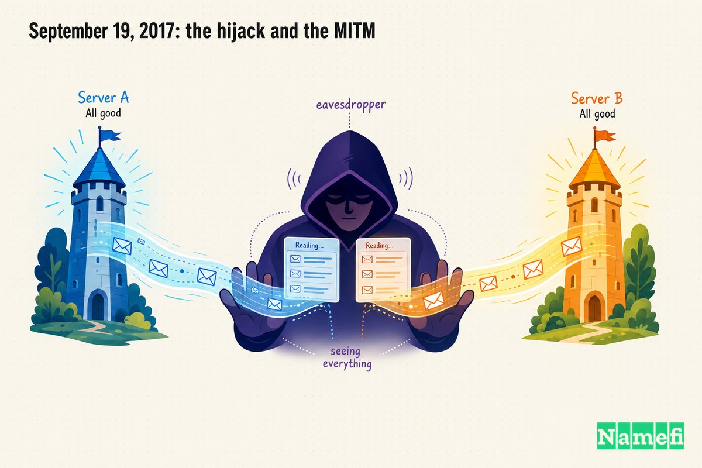
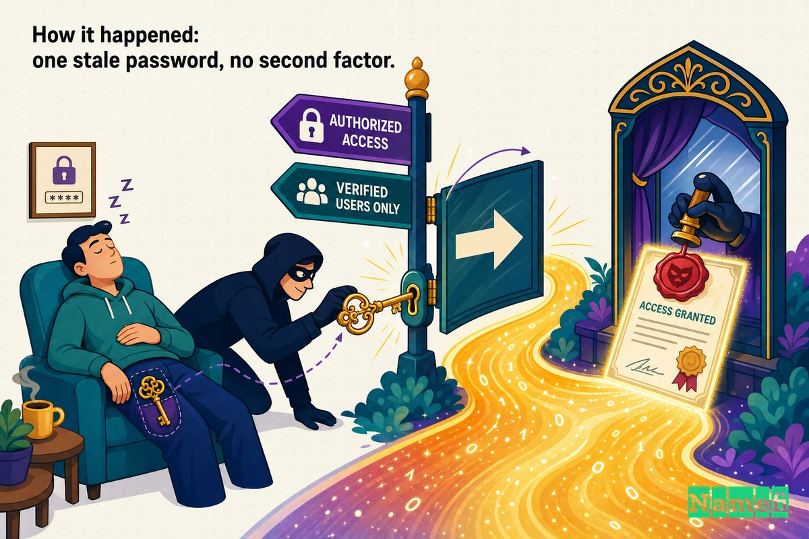
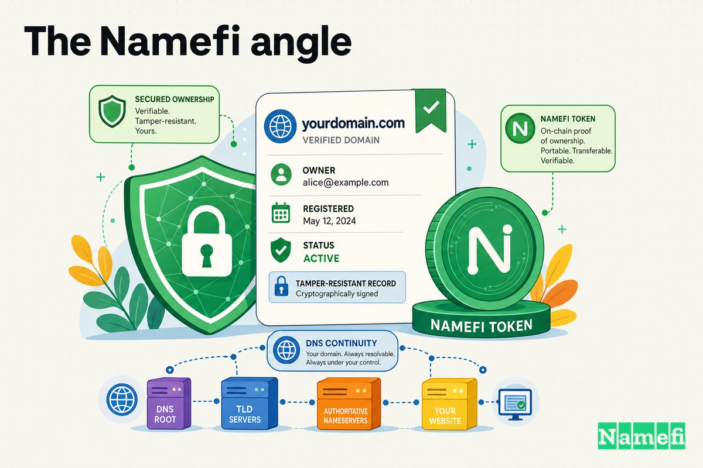

中間者攻撃の恐ろしさは、攻撃が進行している最中、すべてが正常に見えることにある。

サイトは表示される。アドレスバーには正しいドメインが示されている。鍵アイコンは閉じている。証明書は有効だ。ファイルはアップロードされ、ログインは成功し、メールは届く。エラーも警告も壊れた画像もない。ただ静かな第三者が会話の中間に座り、やり取りされる内容をすべて読み取り、両者に気づかれないよう、わずかな遅延でそのまま転送し続けているだけだ。

では、そのような攻撃を検知することを職業とする人々が標的になったとしたら、どうなるか。

2017年9月、オランダのサイバーセキュリティ企業Fox-IT——侵害調査、傍受検知センサーの開発、攻撃者の侵入経路に関する政府へのアドバイザリーを行う企業——は、攻撃者が自社ドメインのDNSをハイジャックし、TLS証明書を不正取得し、ほぼ丸一日にわたってクライアントポータルへのトラフィックを傍受し続けていたことを発見した。錠前師の錠前が破られたのだ。そしてFox-ITは、侵害を受けたほとんどの企業がしないことをした。[どのように起きたかを詳細に公開した](https://blog.fox-it.com/2017/12/14/lessons-learned-from-a-man-in-the-middle-attack/#:~:text=we%20limited%20the%20total%20effective%20MitM%20time%20to%2010%20hours%20and%2024%20minutes)のだ。

## セキュリティ企業もレジストラに依存している

この事件が突きつける不都合な真実がある。自社のセキュリティがどれほど優れていても、攻撃面の大部分は自分が管理していない企業に存在しているということだ。

ドメイン——顧客が入力する名前、証明書が発行される対象、メールの届け先——はドメイン[レジストラ](/ja/glossary/registrar/)で設定されている。そのレジストラアカウントを支配した者が、その名前の解決先を支配する。ウェブサイトの向き先を変え、メールを別の場所に誘導し、証明書認証局にドメインの「所有権」を証明することができる。そのいずれも、自社のサーバー、ファイアウォール、コードに触れる必要はない。必要なのは、一つのウェブパネルへのログインだけだ。

Fox-ITはあらゆる基準で見ても、本格的なセキュリティ組織だった。完全なパケットキャプチャと独自のネットワークセンサーを運用し、クライアント向けポータルには二要素認証を導入していた。その後NCC Groupに買収された。それでも、ほとんどログインしないアカウント一つを通じて侵害された。会社自身が述べたように、[DNSの設定は一般的にほとんど変更されない](https://blog.fox-it.com/2017/12/14/lessons-learned-from-a-man-in-the-middle-attack/#:~:text=DNS%20settings%20in%20general%20change%20very%20rarely)ため、それを守る認証情報は静かに陳腐化していたのだ。

Fox-ITは自社レポートの冒頭でこう述べている。[このような攻撃がセキュリティ企業に降りかかったなら、セキュリティに注力していない多くの企業にも同じことが起き得る](https://blog.fox-it.com/2017/12/14/lessons-learned-from-a-man-in-the-middle-attack/#:~:text=if%20such%20an%20attack%20can%20hit%20a%20security%20firm)と。

## 2017年9月19日：ハイジャックと中間者攻撃

Fox-ITのレポートは、インシデントレスポンス文書の小さな古典となった一節から始まる。[Fox-ITにとって「もし起きたら」が「起きた」に変わったのは、2017年9月19日火曜日](https://blog.fox-it.com/2017/12/14/lessons-learned-from-a-man-in-the-middle-attack/#:~:text=became%20%E2%80%98when%E2%80%99%20on%20Tuesday%2C%20September%2019%202017)——同社が中間者攻撃の被害を受けた日だ。

何が起きたかはサーバーへのエクスプロイトではなかった。9月19日の早朝、[攻撃者はサードパーティのドメインレジストラでFox-IT.comドメインのDNSレコードにアクセスした](https://grahamcluley.com/fox-it-dns-hack/#:~:text=an%20attacker%20accessed%20the%20DNS%20records%20for%20the%20Fox%2DIT.com%20domain)。そのレコードを掌握した攻撃者は、[特定のサーバーのDNSレコードを改ざんし、自分が管理するサーバーに向け、トラフィックを傍受した上でFox-ITの実際のインフラに転送する](https://blog.fox-it.com/2017/12/14/lessons-learned-from-a-man-in-the-middle-attack/#:~:text=modified%20a%20DNS%20record%20for%20one%20particular%20server)ようにした。

後半の「転送する」という部分こそが、これを単なる障害ではなく中間者攻撃たらしめた要因だ。訪問者は動いているポータルに到達し続けた。ただし、攻撃者を経由して。

攻撃対象は明確だった。[攻撃はFox-ITのドキュメント交換ウェブアプリケーションであるClientPortalに特化していた](https://grahamcluley.com/fox-it-dns-hack/#:~:text=specifically%20aimed%20at%20ClientPortal)。Fox-ITが顧客、サプライヤー、その他組織とファイルを安全にやり取りするために使用するシステムだ。つまり攻撃者は、機密クライアント文書が行き交うチャネルに真っ先に狙いを定めたのである。

Fox-ITが検知し封じ込めたことで、[中間者攻撃の実効時間は10時間24分に限定された](https://blog.fox-it.com/2017/12/14/lessons-learned-from-a-man-in-the-middle-attack/#:~:text=we%20limited%20the%20total%20effective%20MitM%20time%20to%2010%20hours%20and%2024%20minutes)。独立した報道でも同じ数字が確認されている。[このインシデントは9月19日に発生し、10時間24分続いた](https://www.bleepingcomputer.com/news/security/top-security-firm-admits-to-mitm-security-incident/#:~:text=lasted%20for%2010%20hours%20and%2024%20minutes)。

## 実際に傍受されたもの

ドキュメント交換ポータルに対する10時間の中間者攻撃は壊滅的に聞こえる。だが実際の被害は小さかった——そしてその小ささ自体がこの事件の本質だ。

その間、[9名のユーザーがログインし、認証情報が傍受された](https://blog.fox-it.com/2017/12/14/lessons-learned-from-a-man-in-the-middle-attack/#:~:text=Nine%20individual%20users%20logged%20in)。しかし、それらの認証情報はほぼ役に立たなかった。Fox-ITのポータルは第二の認証要素を要求しており、ネットワーク経路上に位置していた攻撃者はそれを再現できなかったのだ。Help Net Securityは、9名のログイン認証情報が取得されたが、[第二認証要素なしには無用だった](https://www.helpnetsecurity.com/2017/12/15/fox-it-security-breach/#:~:text=useless%20without%20the%20second%20authentication%20factor)と報じた。

ファイルについては、[12件（うち10件がユニーク）のファイルが転送・傍受された](https://blog.fox-it.com/2017/12/14/lessons-learned-from-a-man-in-the-middle-attack/#:~:text=Twelve%20files%20%28of%20which%20ten%20were%20unique%29%20were%20transferred%20and%20intercepted)。そのうち一部に機密クライアント情報が含まれていた。また攻撃者はClientPortalユーザーの氏名とメールアドレスの一部、アカウント名、携帯電話番号を取得した、と[SecurityWeekは報告している](https://www.securityweek.com/hackers-target-security-firm-fox-it/#:~:text=mobile%20phone%20number)。

被害を限定した二つの事実がある。第一に、Fox-ITは[国家機密に分類されたファイルはClientPortalで転送されることはない](https://blog.fox-it.com/2017/12/14/lessons-learned-from-a-man-in-the-middle-attack/#:~:text=Files%20classified%20as%20state%20secret%20are%20never%20transferred)と明言した——最も機密性の高い情報は、そもそも露出したチャネルに存在しなかった。第二に、自社の第二要素が認証情報の盗難を食い止めた。DNS境界が突破された後も、アーキテクチャが被害範囲を限定したのだ。

## どのように起きたか：古いパスワード一つ、第二要素なし

その手口は、被害者のサーバーにマルウェアを一行も仕込まずにドメインを乗っ取る方法のチェックリストそのものだ。

**ステップ1——レジストラアカウントへの侵入。** 攻撃者は[有効な認証情報を使い、サードパーティのドメインレジストラプロバイダーのDNSコントロールパネルへのログインに成功した](https://blog.fox-it.com/2017/12/14/lessons-learned-from-a-man-in-the-middle-attack/#:~:text=logged%20in%20to%20the%20DNS%20control%20panel)。Fox-ITの調査では、攻撃者は[サードパーティプロバイダーの侵害を通じてドメインレジストラのDNSコントロールパネルへの認証情報を入手した可能性が高い](https://www.helpnetsecurity.com/2017/12/15/fox-it-security-breach/#:~:text=through%20the%20compromise%20of%20a%20third%20party%20provider)と結論付けた。二つの要因がそのログインを成立させた。[パスワードは2013年以来変更されておらず](https://blog.fox-it.com/2017/12/14/lessons-learned-from-a-man-in-the-middle-attack/#:~:text=the%20password%20had%20not%20been%20changed%20since%202013)、レジストラは第二要素を一切提供していなかった。記事執筆時点でもFox-ITが指摘したように、[当該レジストラは2FAをサポートしていない](https://blog.fox-it.com/2017/12/14/lessons-learned-from-a-man-in-the-middle-attack/#:~:text=registrar%20still%20does%20not%20support%202FA)。

**ステップ2——DNSの変更と認証局への「所有権」証明。** パネルにアクセスした攻撃者はDNSの向き先を変更した。しかしHTTPSサイトに対して*信頼できる*中間者攻撃を実行するには、fox-it.comの有効な証明書が必要だ。現代的な取得方法は、ドメインを支配していることを証明することである。そこで攻撃者はまさにそれを実行した。02:05〜02:15という狭い時間窓に、[ClientPortalのSSL証明書を不正登録する過程でドメイン所有権を証明するという目的のために、Fox-ITのメールを一時的に迂回・傍受した](https://blog.fox-it.com/2017/12/14/lessons-learned-from-a-man-in-the-middle-attack/#:~:text=fraudulently%20registering%20an%20SSL%20certificate%20for%20our%20ClientPortal)。この部分は読者全員が立ち止まるべきだ。**実質的に、DNSの制御はドメイン認証の制御を意味する。** ドメイン認証済み証明書は、認証局のチャレンジに応答できる者に発行される。そしてここでDNSを制御することで、攻撃者は認証メールを迂回してチャレンジに応答できたのだ。DNSが所有権証明の到達先を決定する。

**ステップ3——中間で待ち構える。** 正規に発行された（しかし不正取得された）証明書を手にした攻撃者は、ドメインを海外のVPSに向け、トラフィックを傍受した。SecurityWeekが説明したように、[不正なSSL証明書がClientPortalへの中間者攻撃に使用され、トラフィックは海外のVPS（仮想プライベートサーバー）プロバイダーを経由してルーティングされた](https://www.securityweek.com/hackers-target-security-firm-fox-it/#:~:text=rogue%20SSL%20certificate%20was%20used)。訪問者には何も問題はなかった。鍵アイコンは本物だった。証明書は検証を通過した。中間者は、ブラウザが信頼する鍵を持っていた。

DNS、認証局、TLS自体の三層すべてが技術的に正常に機能していた。攻撃者はそのいずれも破らなかった。三つすべてに対して、自分がFox-ITであると信じ込ませた。そしてそれを可能にした唯一の要素は、レジストラにおける一つの古い、単一要素でのログインだった。

## Fox-ITの対応：検知、封じ込め、そして公開

この事件を他の数多くの静かなインシデントと区別するのは、技術的にも情報発信においても秀でた対応だ。

**検知は迅速だった。** Fox-ITはfox-it.comドメインのネームサーバーが書き換えられていることを突き止め、攻撃開始からおよそ5時間後に侵入を察知した。Help Net Securityによれば、[攻撃開始から5時間後](https://www.helpnetsecurity.com/2017/12/15/fox-it-security-breach/#:~:text=five%20hours%20after%20the%20attack%20started)のことだ。自社に対して実施していた完全なパケットキャプチャとネットワークセンサーが、何が触れられ、何が触れられなかったかを正確に再構成するためのフォレンジック記録を提供した。

**封じ込めは意図的だった。** ポータルを突然オフラインにして攻撃者に気づかれるのを避け、Fox-ITはより静かな対処を選んだ。[ClientPortalのログイン認証システムの第二要素認証を無効化した](https://blog.fox-it.com/2017/12/14/lessons-learned-from-a-man-in-the-middle-attack/#:~:text=disabled%20the%20second%20factor%20authentication)のだ——直感に反する行動だが、侵入を察知したことを明かさずにDNSの制御を取り戻しながら状況を管理するためだった。その後すぐに[これらのファイルに関係するすべての影響を受けたクライアントに連絡した](https://blog.fox-it.com/2017/12/14/lessons-learned-from-a-man-in-the-middle-attack/#:~:text=All%20affected%20clients%20in%20respect%20of%20these%20files%20were%20contacted%20immediately)。

**そしてこれをケーススタディにした部分が来る。** 3か月後、分析を終え法執行機関の調査が進む中、Fox-ITは明快なテーゼのもとに完全なタイムスタンプ付きポストモーテムを公開した。[透明性は秘密主義より信頼を構築し、学ぶべき教訓がある](https://blog.fox-it.com/2017/12/14/lessons-learned-from-a-man-in-the-middle-attack/#:~:text=transparency%20builds%20more%20trust%20than%20secrecy)という考えだ。セキュリティ企業が最もシンボリックな形で恥をかかされ、それを隠すのではなく業界に分解して手渡した。BleepingComputerの見出しはその瞬間にふさわしいトーンを捉えた。[大手セキュリティ企業、中間者攻撃インシデントを認める](https://www.bleepingcomputer.com/news/security/top-security-firm-admits-to-mitm-security-incident/#:~:text=Top%20Security%20Firm%20Admits)。

## レジストラセキュリティとレジストリロックについての教訓

具体的な詳細を取り除くと、Fox-ITインシデントは本当の境界線がどこにあるかについての教訓だ。多くの組織にとって、境界線はファイアウォールだけではない。それはレジストラへのログインでもある。この事件が示すこと：

1. **レジストラアカウントを本番インフラと同様に扱う。** 変更頻度が低いため忘れやすい——だからこそ劣化する。[2013年以来](https://blog.fox-it.com/2017/12/14/lessons-learned-from-a-man-in-the-middle-attack/#:~:text=the%20password%20had%20not%20been%20changed%20since%202013)変更されていないパスワードは「アクセスが少ないので低リスク」ではない。監視されていない高価値の認証情報だ。

2. **レジストラに多要素認証を要求し、提供されなければ乗り換える。** Fox-ITのレジストラは2FAを[一切サポートしていなかった](https://blog.fox-it.com/2017/12/14/lessons-learned-from-a-man-in-the-middle-attack/#:~:text=registrar%20still%20does%20not%20support%202FA)。ドメインのセキュリティチェーンにおいて最も重要なアカウントが、パスワードのみで守られていた。レジストラでの2FAの有無は、付加機能ではなく調達基準だ。

3. **レジストリロックを使用する。** レジストラ自体のログインを超えて、多くのレジストリは*[レジストリロック](/ja/glossary/registry-lock/)*——帯域外の手動確認ステップなしにネームサーバーや連絡先レコードの変更を阻止するサーバー側ホールド——を提供している。レジストリロックがあれば、レジストラのパスワードが完全に侵害されても、DNSが密かに書き換えられることはない。「パネル一つで完了」を「複数の人間と電話一本が必要」に変える。

4. **可能な限り[DNSSEC](/ja/glossary/dnssec/)を導入する。** DNSSECはDNS応答を暗号的に署名し、リゾルバが解決経路での改ざんを検知できるようにする。これは万能薬ではない——権威レコードを制御する攻撃者はそれを再署名できる——しかしコストを引き上げ、転送中のDNS操作の全クラスを排除する。このケースが示したように、DNSはTLSと証明書発行よりも信頼スタックの上位に位置するからこそ、DNSレイヤーでの多層防御が重要だ。

5. **DNSの制御は証明書の制御に等しいことを忘れない。** 攻撃者は[迂回したメールでドメイン所有権を証明することで](https://blog.fox-it.com/2017/12/14/lessons-learned-from-a-man-in-the-middle-attack/#:~:text=proving%20that%20they%20owned%20our%20domain)有効なTLS証明書を取得した。自分のドメインに対して意図せず発行された証明書を Certificate Transparency ログで監視する。CTに不正な証明書が現れることは、DNSハイジャックが進行中である数少ない外部シグナルの一つだ。

6. **アプリケーション自体には第二要素を維持する。** Fox-ITのポータル2FAにより、盗まれた9つのパスワードが[第二認証要素なしには無用](https://www.helpnetsecurity.com/2017/12/15/fox-it-security-breach/#:~:text=useless%20without%20the%20second%20authentication%20factor)になった。外側のレイヤー（DNS）が失敗したとき、内側のレイヤー（アプリレベルのMFA）が被害範囲を限定した。

一貫したテーマ：ドメインはあなたが部分的に外注している単一障害点だ。それを強化することは地味で、Fox-ITに起きたことを誰かが試みた日にのみ効果が現れる。

## Namefiの視点

Fox-ITインシデントは、その根本において制御と出所の問題だ。攻撃者はFox-ITになる必要はなかった。DNSを書き換えて証明書を取得するのに十分な時間、レジストラパネルというシステム一つに「自分はFox-ITだ」と信じ込ませるだけでよかった。その後のすべてがその信念を信頼した。

[Namefi](https://namefi.io)は、ドメイン制御をベンダーのウェブパネルにある使い回し可能なパスワードへの依存から脱却させ、検証可能で改ざん耐性のあるものにするために構築されている。[ドメイン所有権](/ja/glossary/domain-ownership/)をDNSとの互換性を保ちながらオンチェーンで検証可能な資産として表現することで、制御は誰かが静かにログインして再設定できるアカウントではなく、監査・証明できるものになる。重要な変更は、レジストリロックの精神に従い、何年も更新されていない認証情報ではなく、実際に保有する所有権に紐付けることができる。

これにより執念深い攻撃者が不可能になるわけではない。しかしFox-ITの話は、最終的には一つの盗まれたログインが名前の完全な制御に変換されたことについてだ。ドメイン制御が検証可能な所有権に近づくほど——そして古い単一のパスワードで名前を密かに変更することが難しくなるほど——Fox-ITの「もしが、起きたに変わった」ような瞬間が誰かに気づかれるまでに広がりにくくなる。

セキュリティ企業は5時間で自社のハイジャックを発見し、その方法を世界に公開した。ほとんどの組織はそのどちらもできないだろう。最も安上がりな教訓はFox-ITが支払ったものだ。開かれた扉になる前に、レジストラを封鎖せよ。

## 出典とさらに詳しく読む

- Fox-IT（NCC Group）——[中間者攻撃から学んだ教訓](https://blog.fox-it.com/2017/12/14/lessons-learned-from-a-man-in-the-middle-attack/)（一次ポストモーテム）
- BleepingComputer——[大手セキュリティ企業、中間者攻撃インシデントを認める](https://www.bleepingcomputer.com/news/security/top-security-firm-admits-to-mitm-security-incident/)
- Help Net Security——[セキュリティ企業Fox-IT、9月に受けた中間者攻撃を公開・詳述](https://www.helpnetsecurity.com/2017/12/15/fox-it-security-breach/)
- Graham Cluley——[Fox-IT、ハッカーによるDNSレコードのハイジャックとクライアントファイル閲覧を公表](https://grahamcluley.com/fox-it-dns-hack/)
- SecurityWeek——[ハッカーがセキュリティ企業Fox-ITを標的に](https://www.securityweek.com/hackers-target-security-firm-fox-it/)
- GBHackers——[大手ITセキュリティ企業Fox-IT、サイバー攻撃を受ける](https://gbhackers.com/cyber-attack/)
- Krebs on Security——[最近の広範なDNSハイジャック攻撃の深層分析](https://krebsonsecurity.com/2019/02/a-deep-dive-on-the-recent-widespread-dns-hijacking-attacks/)（関連：規模拡大したDNSハイジャック＋不正証明書手法）
