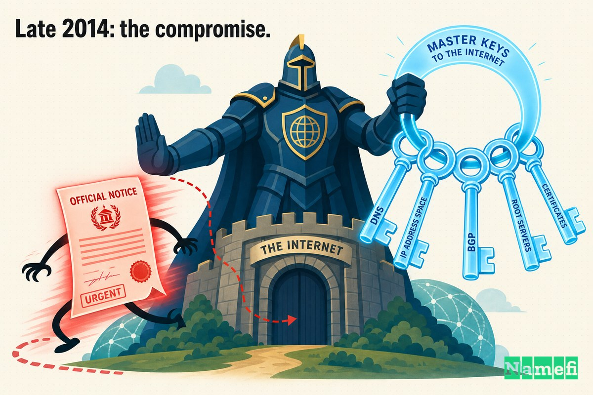
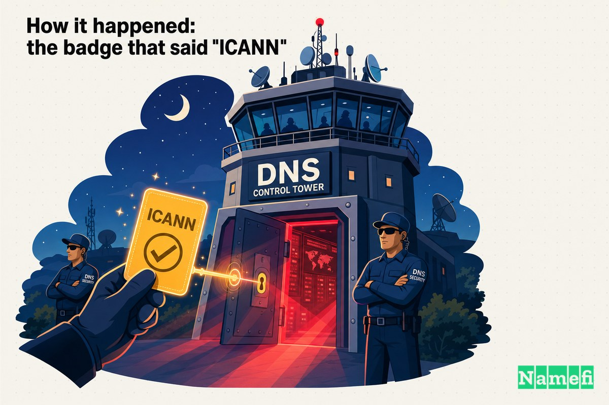
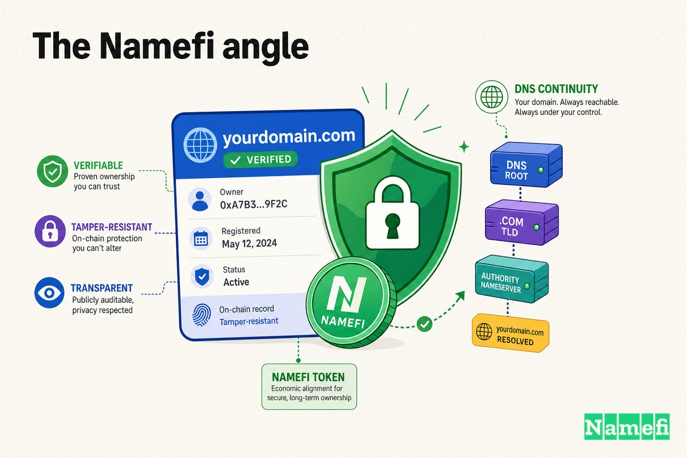

セキュリティ業界全体が一瞬立ち止まるような見出しがある。「また小売業者が被害」でも「また新興企業がデータベースを漏洩」でもなく――他の誰もが*信頼を置く*機関が、最もありふれた手口でハッキングされたと認めたときの見出しだ。

2014年12月、その機関は[ICANN](/ja/glossary/icann/)だった。Internet Corporation for Assigned Names and Numbers、すなわちインターネット全体の[ドメインネームシステム](/ja/glossary/dns/)を統括する非営利法人――`namefi.io`や`google.com`をはじめ、地球上のあらゆるアドレスがサーバーに解決されるためのルールを管理するこの組織は、複数のスタッフが偽のメールのリンクをクリックし、偽のログインページにパスワードを入力して、攻撃者に内部システムの鍵を渡してしまったと公表した。その対象には、世界のトップレベルドメインのゾーンファイルを申請・取得できるリポジトリ、Centralized Zone Data System（CZDS）も含まれていた。

インターネット上の信頼の仕組みを定義する組織が、フィッシングに遭った。ICANNを騙った偽メールで。

これは**Domain MaydayのEP11**だ――脅威の発信元が、まさに内側だったエピソードである。

## ICANNとは何か、そしてなぜここでの侵害が象徴的なのか

この話がなぜこれほど大きな衝撃を与えたかを理解するには、ICANNが実際に何をしているかを理解する必要がある。

ICANNはドメインを購入する会社ではない。その一層上に位置する。インターネットを航行可能にするユニーク識別子のグローバルシステム――トップレベルドメイン（`.com`、`.org`、`.io`、そして数百に及ぶ新しいもの）、レジストリとレジストラが従うルール、そして[IANA](/ja/glossary/iana/)機能を通じたDSN階層の最頂点、あらゆるルックアップが最終的に依存する[ルートゾーン](/ja/glossary/root-zone/)を統括している。

ドメインがインターネットのアドレスだとすれば、ICANNは郵便局のマスターディレクトリを運営している組織だ。[レジストラ](/ja/glossary/registrar/)での侵害は深刻だ。しかしICANNでの侵害は象徴的だ。なぜならICANNは*権威*であるべき組織――命名システムを整序かつ信頼できる状態に保つことを使命とする唯一の機関――だからだ。インターネット上の名前に関する権威機関が侵害されたとき、不快な問いは明白だ。*あの機関でさえ*フィッシングに遭うなら、遭わない組織などあるのか？

## 2014年末：侵害の経緯

ICANNは2014年12月16日に公開した[公式発表](https://www.icann.org/en/announcements/details/icann-targeted-in-spear-phishing-attack--enhanced-security-measures-implemented-16-12-2014-en#:~:text=We%20believe%20a%20%22spear%20phishing%22%20attack%20was%20initiated%20in%20late%20November%202014.)の中で、率直に経緯を説明した。「2014年11月下旬にスピアフィッシング攻撃が開始されたと考えています」

手口は侮辱的なほどシンプルだった。ICANNが説明したように、この攻撃は「[自組織のドメインから送信されたように見えるよう細工されたメールメッセージをスタッフに送付するもの](https://www.icann.org/en/announcements/details/icann-targeted-in-spear-phishing-attack--enhanced-security-measures-implemented-16-12-2014-en#:~:text=It%20involved%20email%20messages%20that%20were%20crafted%20to%20appear%20to%20come%20from%20our%20own%20domain%20being%20sent%20to%20members%20of%20our%20staff.)」だった。スタッフは`icann.org`――ICANN内部――から届いたように見えるメールを受け取った。何人かがクリックした。The Registerが再構成したところによれば、従業員たちは「[メッセージ内のリンクをクリックして偽のログインページに誘導され、ユーザー名とパスワードを入力した](https://www.theregister.com/security/2014/12/17/icann-hacked-intruders-poke-around-global-dns-innards/624044#:~:text=clicked%20on%20a%20link%20in%20the%20messages%20that%20took%20them%20to%20a%20bogus%20login%20page)」ことで、業務用メールの認証情報を攻撃者に渡してしまった。欠如していた防御についてThe Registerが辛辣に評した言葉：「[二要素認証の気配もなかった。](https://www.theregister.com/security/2014/12/17/icann-hacked-intruders-poke-around-global-dns-innards/624044#:~:text=No%20sign%20of%20two%2Dfactor%20authentication%2C%20then.)」

結果として、ICANNの言葉を借りれば「[この攻撃により、複数のICANNスタッフメンバーのメール認証情報が侵害されました。](https://www.icann.org/en/announcements/details/icann-targeted-in-spear-phishing-attack--enhanced-security-measures-implemented-16-12-2014-en#:~:text=The%20attack%20resulted%20in%20the%20compromise%20of%20the%20email%20credentials%20of%20several%20ICANN%20staff%20members.)」Help Net Securityはさらにわかりやすく述べた：「[複数のスタッフメンバーが騙されてメール認証情報を攻撃者に渡してしまいました。](https://www.helpnetsecurity.com/2014/12/18/icann-systems-breached-via-spear-phishing-emails/#:~:text=Several%20staff%20members%20were%20fooled%20into%20handing%20over%20their%20email%20credentials)」

ゼロデイ脆弱性もない。高度なマルウェアもない。説得力のあるメールと偽のログインボックス――インターネット最古の手口が、インターネットを運営する人々に向けて使われた。

## アクセスされた対象：中枢にあったゾーンデータシステム

盗まれたメール認証情報それ自体も深刻だ。しかしこの侵害がDomain Maydayのエピソードになった理由は、攻撃者がその認証情報を使って*到達した*先にある。

2014年12月初旬、ICANNは侵害された認証情報が他のシステムへの侵入に流用されていたことを発見した。最も深刻だったのは**Centralized Zone Data System**――CZDS、世界のジェネリックトップレベルドメインのゾーンファイルを認可された当事者が申請・ダウンロードできるプラットフォームだ。ICANNの公表文書は率直だ：「[攻撃者はCZDS内のすべてのファイルへの管理者アクセスを取得しました。](https://www.icann.org/en/announcements/details/icann-targeted-in-spear-phishing-attack--enhanced-security-measures-implemented-16-12-2014-en#:~:text=The%20attacker%20obtained%20administrative%20access%20to%20all%20files%20in%20the%20CZDS.)」

*管理者*アクセスを。*すべての*ファイルに。The Registerはそれがなぜ重要かを説明した：CZDSは「[認可された当事者が世界のジェネリックトップレベルドメインのすべてのゾーンファイルにアクセスできるシステム](https://www.theregister.com/security/2014/12/17/icann-hacked-intruders-poke-around-global-dns-innards/624044#:~:text=gives%20authorized%20parties%20access%20to%20all%20the%20zone%20files%20of%20the%20world%27s%20generic%20top%2Dlevel%20domains)」だ。このシステムの*ユーザー*は一般人ではない――The Registerが指摘したように「[世界のレジストリやレジストラの管理者の多く](https://www.theregister.com/security/2014/12/17/icann-hacked-intruders-poke-around-global-dns-innards/624044#:~:text=many%20of%20the%20administrators%20of%20the%20world%27s%20registries%20and%20registrars)」だ。攻撃者は単なるデータベースに侵入したのではない。命名システムの守門者たちが自らログインするデータベースに侵入したのだ。

ゾーンファイルに加え、CZDSユーザーが登録した個人情報も漏洩した。ICANNによれば、取得された情報には「[システム内のゾーンファイルのコピーのほか、氏名、住所、メールアドレス、FAX・電話番号、ユーザー名、パスワードといったユーザー入力情報](https://www.icann.org/en/announcements/details/icann-targeted-in-spear-phishing-attack--enhanced-security-measures-implemented-16-12-2014-en#:~:text=This%20included%20copies%20of%20the%20zone%20files%20in%20the%20system%2C%20as%20well%20as%20information%20entered%20by%20users)」が含まれていた。TLDを管理する人々のユーザー名とパスワードが、攻撃者が盗んだバッジで侵入したシステムに保存されていたのだ。

認証情報の侵害はさらに広がった。ICANNは攻撃者が**GACウィキ**（政府諮問委員会のスペース）、**ICANNブログ**、**[WHOIS](/ja/glossary/whois/)情報ポータル**にもアクセスしたと確認したが、後者の2システムについては[影響なしと報告](https://www.helpnetsecurity.com/2014/12/18/icann-systems-breached-via-spear-phishing-emails/#:~:text=The%20latter%20two%20were%20not%20affected%20in%20any%20way.)し、ウィキについても閲覧にとどまったとした。

## どのように起きたか：「ICANN」と書かれたバッジ

技術的な層を取り除くと、この攻撃は詐欺師の騙しの手口だ。

スピアフィッシングは通常のフィッシングとその精度において異なる。誰かが引っかかることを期待する大量のスパムメールではなく、特定の人物を狙った少数の巧みに仕立てられたメッセージで、日常的な内部通信のように見えるよう設計されている。今回の偽装は考えうる中で最も強力なものだった。メールは`icann.org`から届いたように見えた。The Registerがまとめたように、「[攻撃者はicann.orgから来たように見える偽のメールをスタッフに送った。](https://www.theregister.com/security/2014/12/17/icann-hacked-intruders-poke-around-global-dns-innards/624044#:~:text=Attackers%20sent%20staff%20spoofed%20emails%20appearing%20to%20coming%20from%20icann.org.)」

心理を考えてみてほしい。自分の組織のドメインから届いたメールは警戒心を起こさせない。毎日使っているログインページに似た画面も同様だ。この攻撃全体が、*内部から*と*見慣れている*が*安全*と同じに感じられるという事実を利用していた――しかし両者はイコールではない。アドレスバーには一つのことが表示されていたが、その裏のページは入力されたあらゆる情報を収集していた。

ICANNの唯一の本物の緩和措置はストレージ側にあった。盗まれたパスワードは平文で保存されていなかった。公表文書が注記するように、「[パスワードはソルト付き暗号ハッシュとして保存されていました](https://www.icann.org/en/announcements/details/icann-targeted-in-spear-phishing-attack--enhanced-security-measures-implemented-16-12-2014-en#:~:text=Although%20the%20passwords%20were%20stored%20as%20salted%20cryptographic%20hashes)」――何もしないよりはましだが、The Registerが指摘したように、ユーザーが同じログイン情報を他の場所で使い回していない場合にのみ保護は機能する。ハッシュはオフラインでクラックされうるからだ。侵害はダウンロードで終わらなかった。防御者がパスワードをローテーションするレースと、攻撃者がハッシュを逆算しようとするレースが始まったのだ。

## 対応とその後

その信頼に値する点として、ICANNは侵害自体よりも情報開示の扱いが優れていた。

数週間以内に公表し、CZDSのパスワードを無効化し、影響を受けたユーザーに通知した。特筆すべきは、透明性を責任として、負債としてではなく位置づけたことだ。組織は「[このインシデントについて公開情報を提供するのは、開放性と透明性へのコミットメントからだけでなく、サイバーセキュリティ情報の共有が関係するすべての人のシステム脅威の評価を助けるためでもあります](https://www.icann.org/en/announcements/details/icann-targeted-in-spear-phishing-attack--enhanced-security-measures-implemented-16-12-2014-en#:~:text=providing%20information%20about%20this%20incident%20publicly%2C%20not%20just%20because%20of%20our%20commitment%20to%20openness%20and%20transparency)」と述べた。また、その年の早い時期に始まったセキュリティ強化プログラムが「[攻撃によって得られた不正アクセスを制限するのに役立った](https://www.icann.org/en/announcements/details/icann-targeted-in-spear-phishing-attack--enhanced-security-measures-implemented-16-12-2014-en#:~:text=these%20enhancements%20helped%20limit%20the%20unauthorized%20access%20obtained%20in%20the%20attack)」とも報告した。

より広いインターネットにとって最も重要だったのは、*落ちなかった*ものについての一文だ。ICANNは「[この攻撃はIANA関連システムには影響を与えていません](https://www.icann.org/en/announcements/details/icann-targeted-in-spear-phishing-attack--enhanced-security-measures-implemented-16-12-2014-en#:~:text=this%20attack%20does%20not%20impact%20any%20IANA%2Drelated%20systems)」と確認した。IANA――Help Net Securityが「[ドメインネームシステム（DNS）のルートゾーンを管理する](https://www.helpnetsecurity.com/2014/12/18/icann-systems-breached-via-spear-phishing-emails/#:~:text=manages%20the%20root%20zone%20in%20the%20Domain%20Name%20System)」機能と説明した機関――は、インターネットの命名ピラミッドの実際の頂点だ。攻撃者がそこに到達していたなら、これは恥ずかしいデータ侵害では済まず、構造的な緊急事態になっていただろう。

タイミングも恥辱を深めた。The Registerの見出し文句は率直だった：「[スピアフィッシング攻撃のタイミングは、ドメイン名監督機関にとってこれ以上ないほど最悪だった。](https://www.theregister.com/security/2014/12/17/icann-hacked-intruders-poke-around-global-dns-innards/624044#:~:text=Spear%2Dphishing%20attack%20timing%20couldn%27t%20be%20worse%20for%20domain%20name%20overseer)」なぜか？ICANNが「[翌年に重要なIANA契約の管理権を引き渡される見込みだった](https://www.theregister.com/security/2014/12/17/icann-hacked-intruders-poke-around-global-dns-innards/624044#:~:text=it%20will%20prove%20extremely%20embarrassing%20to%20ICANN%2C%20which%20hopes%20to%20be%20handed%20control%20of%20the%20critical%20IANA%20contract%20next%20year)」からだ――まさに当時交渉中だったスチュワードシップ移管のことだ。フィッシングに遭うのは「DNSの中枢を信頼してください」という売り込みとしては不適切だ。（文脈として、これは2014年のCZDSをめぐる最初の騒動でもなかった。The Registerは4月に「[多数のユーザーが誤って管理者アクセスを与えられた](https://www.theregister.com/security/2014/12/17/icann-hacked-intruders-poke-around-global-dns-innards/624044#:~:text=a%20number%20of%20users%20were%20wrongly%20given%20admin%20access%20to%20the%20system)」以前の事件があったことも指摘している。）

そしてデータは長い余命を持った。2017年2月21日、自組織の発表に追記する形でICANNは、侵害で得た情報が再浮上していることを認めた：「[2014年に発表したスピアフィッシングインシデントで取得された一部の情報が、地下フォーラムで売りに出されています](https://www.icann.org/en/announcements/details/icann-targeted-in-spear-phishing-attack--enhanced-security-measures-implemented-16-12-2014-en#:~:text=some%20information%20obtained%20in%20the%20spear%20phishing%20incident%20we%20announced%20in%202014%20is%20being%20offered%20for%20sale%20on%20underground%20forums)」。CyberScoopは数年後の価格を報告した：「[そのデータは依然としてブラックマーケットで流通し、300ドルで売られている](https://cyberscoop.com/hacked-icann-data-still-sells-hundreds-dollars-years-breach/#:~:text=the%20data%20is%20still%20being%20passed%20around%20and%20sold%20on%20black%20markets%20for%20%24300)」とのことで、これまで一度も漏洩していないとの主張まで付いていた。2014年末の一回のクリックが、2017年になっても売上を生み続けていたのだ。

## 教訓：フィッシングに免疫を持つ組織はない――DNS権威機関でさえも

EP11の教訓は「ICANNが不注意だった」ということではない。もっと謙虚に受け止めるべきことだ。

**誰でもフィッシングに遭う。** 不注意な人だけではない。訓練を受けていない人だけでもない。*誰でも*だ。文字通りインターネット上の名前を管轄する組織――DNS、セキュリティ、インフラを生業として考え続けている人々で構成される組織――でさえ、メールが内部から来たように見えたというだけで、複数の従業員が偽のページに認証情報を入力してしまった。フィッシングは知識を打ち負かすのではなく、クリックするのにかかる2秒間の注意力を打ち負かす。

この事件から導き出される恒久的な教訓がいくつかある。

1. **認証情報こそが境界線だ。** 攻撃者はICANNの暗号を解読したわけでも、サーバーの欠陥を突いたわけでもない。パスワードを借りただけだ。身元確認が入口となった瞬間、盗まれた身元が侵害になる――だからこそフィッシングは世界で最も信頼性の高い攻撃であり続ける。
2. **特権システムに多要素認証は任意ではない。** 「[二要素認証の気配もなかった](https://www.theregister.com/security/2014/12/17/icann-hacked-intruders-poke-around-global-dns-innards/624044#:~:text=No%20sign%20of%20two%2Dfactor%20authentication%2C%20then.)」というThe Registerの皮肉こそが核心だ。第二の要素があれば、認証情報の盗難は何事もなく終わっていた可能性が高い。
3. **ラテラルムーブメントが被害を乗数的に拡大する。** 被害は*使い回し*から生じた――メールのログイン情報がCZDS、ウィキ、ポータルへのアクセスに転用された。アクセスを分離し、一つの盗まれた認証情報が多くの扉を開かないようにすることが侵害を封じ込める。
4. **漏洩データは永久に存在し続ける。** 2017年の転売が証明するように、「パスワードをリセットした」はインシデントを閉じても露出を閉じない。氏名、住所、電話番号は「漏洩前」に戻ることはない。
5. **権威と免疫は別物だ。** 信頼の定義者であることは、信頼への最も基本的な攻撃に対して免疫を与えない。むしろ、それはより良いターゲットにする。

## Namefiの視点

ICANNの侵害は、その本質において*誰が記録を管理するか*という問題であり、その管理が一元化されたシステム上の一つの盗まれたログインによっていかに乗っ取られたかという話だ。

これが向き合うべき構造的な弱点だ。重要なドメインデータへのアクセスまたは管理の権限を持つ者の証明が、一つのプラットフォーム上のユーザー名とパスワードの背後にある場合、それらの認証情報がフィッシングされた瞬間に信頼モデル全体が崩壊する。第二の検証手段はない。説得力のあるメールと使い回されたパスワードだけで、命名世界の中枢にあるゾーンデータシステムへの管理者アクセスを付与するのに十分だった。

[Namefi](https://namefi.io)は異なる前提の上に構築されている：[ドメイン所有権](/ja/glossary/domain-ownership/)と管理権は**検証可能で、改ざん耐性があり、単一の受信箱にある単一の秘密情報に依存しない**ものであるべきだという前提だ。[ドメイン所有権](/ja/glossary/domain-ownership/)をDNSとの互換性を保ちながら[オンチェーン](/ja/glossary/on-chain/)トークンとして表現することで、管理権は暗号学的に証明・監査できるものになる――パスワードによってゲートされ、スピアフィッシングメールが盗める何かではなくなる。これは誰もフィッシングに対して免疫を与えるものではない。何もそれはできない。しかし爆発半径を狭める。一つの借りた認証情報が、もはや王国の鍵への一歩手前ではなくなるように。

EP11に残る印象的な場面は、正しい制服を着ていたという理由でインターネットのマスターキーの守護者を通り過ぎた偽の文書だ。解決策はより賢い守護者ではない。鍵そのものが本物であることを証明できるシステムだ。

## 情報源と参考文献

- ICANN — [ICANN Targeted in Spear Phishing Attack | Enhanced Security Measures Implemented](https://www.icann.org/en/announcements/details/icann-targeted-in-spear-phishing-attack--enhanced-security-measures-implemented-16-12-2014-en)（一次資料、2017年の更新を含む）
- The Register — [ICANN HACKED: Intruders poke around global DNS innards](https://www.theregister.com/security/2014/12/17/icann-hacked-intruders-poke-around-global-dns-innards/624044)
- Help Net Security — [ICANN systems breached via spear-phishing emails](https://www.helpnetsecurity.com/2014/12/18/icann-systems-breached-via-spear-phishing-emails/)
- Computerworld — [ICANN data compromised in spearphishing attack](https://www.computerworld.com/article/1487605/icann-data-compromised-in-spearphishing-attack.html)
- WeLiveSecurity (ESET) — [ICANN computers compromised by hackers](https://www.welivesecurity.com/2014/12/18/icann-computers-compromised-hackers/)
- Associations Now — [ICANN Systems Infiltrated in "Spear Phishing" Attack](https://associationsnow.com/2014/12/icann-systems-infiltrated-spear-phishing-attack/)
- Slate — [ICANN Got Hacked](https://slate.com/technology/2014/12/icann-hacked-in-spear-phishing-campaign.html)
- Domain Incite — [Hacked ICANN data for sale on black market](http://domainincite.com/21562-hacked-icann-data-for-sale-on-black-market)
- Slashdot — [Hackers Compromise ICANN, Access Zone File Data System](https://tech.slashdot.org/story/14/12/18/1540233/hackers-compromise-icann-access-zone-file-data-system)
- CyberScoop — [Hacked ICANN data still sells for hundreds of dollars years after breach](https://cyberscoop.com/hacked-icann-data-still-sells-hundreds-dollars-years-breach/)
- DomainGang — [ICANN alerts users of CZDS & ICANN Wiki about security breach](https://domaingang.com/domain-news/icann-alerts-users-czds-icann-wiki-security-breach/)
