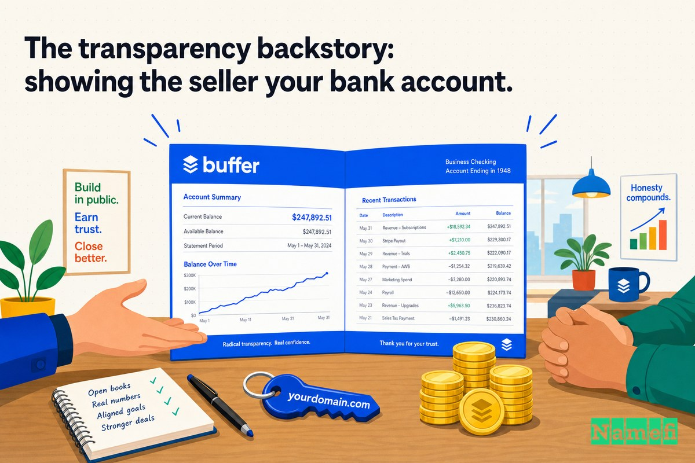

지금은 설정만 해두면 알아서 돌아가는 소셜 미디어 도구로 알려진 Buffer도, 한때는 더 긴 이름으로 불렸습니다. 바로 **BufferApp.com**입니다.

"App"이라는 단어는 브랜딩 전략의 산물이 아니었습니다. 어쩔 수 없는 차선책이었습니다. Joel Gascoigne이 2010년 말 Buffer의 첫 버전을 출시했을 때, 깔끔한 [정확일치 도메인](/ko/glossary/exact-match-domain/)인 Buffer.com은 이미 다른 사람 손에 있었습니다. 회사가 생겨나기도 전에 누군가가 등록해 둔 것이었습니다. 그래서 "Buffer"라는 이름을 달고 싶었던 이 제품은 결국 "Buffer, the app"이라는 이름으로 세상에 나왔습니다.

사실 처음 이름은 그보다 더 낯설었습니다. Buffer의 공식 기록에 따르면, [Joel이 2010년 말 Buffer를 출시했을 당시 처음엔 bfffr.com으로 시작했습니다](https://buffer.com/resources/acquired-buffer-com/#:~:text=we%20originally%20started%20out%20with%20bfffr.com%2C%20when%20Joel%20launched%20Buffer%20in%20late%202010) — 그 시대 스타트업들에게 유행하던 모음 없는 특이한 이름이었습니다. 발음하는 사람이 없었습니다. Joel은 [더 명확하게 하기 위해 bufferapp.com으로 이름을 바꿨고](https://buffer.com/resources/acquired-buffer-com/#:~:text=to%20make%20things%20more%20clear%20and%20worry%20less%20about%20not%20having%20the%20exact%20domain%20of%20your%20startup%27s%20name), 그러면서 [스타트업 이름과 정확히 일치하는 도메인이 없어도 크게 걱정하지 않기로](https://buffer.com/resources/acquired-buffer-com/#:~:text=to%20make%20things%20more%20clear%20and%20worry%20less%20about%20not%20having%20the%20exact%20domain%20of%20your%20startup%27s%20name) 마음먹었습니다.

바로 이 마지막 문장이 이 이야기 전체를 요약합니다. BufferApp.com은 회사가 소유하지 못한 도메인에 대한 걱정을 잠시 내려놓는 방법이었습니다 — 그 도메인을 갖지 못한 사실이 더 큰 문제가 되는 날이 오기 전까지는요.

이것은 Buffer가 결국 Buffer.com을 손에 넣기까지의 이야기입니다. 624일에 걸친 추격전, 과감한 투명 경영을 표방한 회사가 판매자에게 자사 은행 잔고까지 공개한 과정, 그리고 반전처럼도 보이는 결말 — 인터넷이 가장 궁금해했던 단 하나의 숫자만은 끝내 밝히지 않은 이유까지입니다.

## 2010년: 이름 속에 담긴 "App"이 실제로 한 일

Buffer는 작고 구체적인 도구로 출발했습니다. 위키피디아에 따르면, [Buffer는 공동 창업자 Joel Gascoigne에 의해 2010년 10월 영국 버밍엄에서 개발을 시작했고](https://en.wikipedia.org/wiki/Buffer_%28application%29#:~:text=Buffer%20began%20its%20development%20in%20October%202010%20in%20Birmingham%2C%20United%20Kingdom%20by%20co-founder%20Joel%20Gascoigne), [2010년 11월 30일에 Buffer 초기 버전이 출시되었습니다](https://en.wikipedia.org/wiki/Buffer_%28application%29#:~:text=On%20November%2030%2C%202010%2C%20the%20initial%20version%20of%20Buffer%20was%20launched). 이 제품은 단 하나의 기능에 집중했습니다. 소셜 포스트를 한꺼번에 올리는 대신, 일정에 맞게 예약 발행할 수 있도록 큐에 쌓아 두는 것이었습니다. Joel 본인도 나중에 이 날짜를 직접 확인해 주었습니다. [2010년 11월 30일에 Buffer를 출시했습니다](https://buffer.com/resources/10-years/#:~:text=I%20launched%20Buffer%20on%20November%2030th%2C%202010)라고 간결하게 적었습니다.

얼마 뒤 Joel에게 공동 창업자 Leo Widrich가 합류했고, [2011년 7월, 두 공동 창업자는 스타트업 거점을 영국에서 샌프란시스코로 이전하기로 결정했습니다](https://en.wikipedia.org/wiki/Buffer_%28application%29#:~:text=In%20July%202011%2C%20the%20cofounders%20decided%20to%20move%20the%20startup%20venture%20from%20the%20United%20Kingdom%20to%20San%20Francisco). 훗날 직원 연봉과 매출을 공개적으로 블로그에 올려 유명해질 이 팀은, 처음에는 여분의 단어가 붙은 도메인에 살던 두 명의 이민자와 스케줄링 도구에 불과했습니다.

그 초기 단계에서 BufferApp.com은 완전히 적합한 선택이었습니다. "App"은 이것이 무엇인지를 설명해 주었습니다. 확보할 수 없는 도메인을 기다리지 않고 회사 본연의 이름으로 제품을 출시할 수 있게 해 주었습니다. 수식어는 실패의 표시가 아니라 진입로였습니다 — 순수 단어를 이미 누군가가 차지했을 때 젊은 스타트업이 취하는 합리적인 차선책 그 자체였습니다.

## 문제: 세상은 계속 잘못된 문을 두드렸습니다

BufferApp.com으로 출시했을 때의 문제는, 세상이 도메인을 외워두지 않는다는 것이었습니다. 사람들은 추측합니다. 그리고 깔끔한 이름을 추측합니다.

Buffer가 성장하면서 이 추측은 점점 부담이 되었습니다. 회사 자체의 회고에 따르면, [점점 더 많은 사람들이 buffer.com이 우리 도메인이라고 생각하기 시작했고](https://buffer.com/resources/acquired-buffer-com/#:~:text=more%20and%20more%20people%20thought%20that%20buffer.com%20was%20our%20domain), 이 혼란은 [Buffer가 커질수록 더 반복되는 일상적인 문제가 되었습니다](https://buffer.com/resources/acquired-buffer-com/#:~:text=would%20become%20more%20of%20an%20ongoing%20occurrence%20as%20Buffer%20grew%20bigger). 새로운 사용자 모두, 모든 언론 보도, 모든 입소문 추천이 일부 사람들을 Buffer가 통제하지 못하는 도메인인 Buffer.com으로 안내했습니다.

이것이 수식어 도메인의 숨겨진 비용입니다. BufferApp.com은 정확히 입력하는 사람들에게는 완벽하게 작동했습니다. 하지만 브랜드가 커질수록, 회사가 소유하지 못한 *순수* 단어가 사람들이 먼저 떠올리고 손을 뻗는 이름이 되었습니다. 수식어는 출시 시점에 Buffer의 발목을 잡지 않았습니다. 하지만 규모가 커지면서 조용히 관심을 새고 있었습니다.

해결책은 리브랜딩이 아니었습니다. 제품은 이미 Buffer라는 이름을 가지고 있었습니다. 그저 주소가 이름과 일치하면 될 일이었습니다.

## 추격전: 한 단어를 얻기 위한 624일

Buffer.com 인수는 단순한 거래가 아니었습니다. 하나의 캠페인이었습니다.

이 도메인에는 깊은 뿌리가 있었습니다. [Buffer.com은 원래 1997년 Company corp에 의해 등록되었습니다](https://buffer.com/resources/acquired-buffer-com/#:~:text=Buffer.com%20was%20originally%20owned%20and%20registered) — Buffer가 존재하기도 전에, Joel이 아무것도 만들기 전에, 20년 가까이 다른 사람의 손에 있었습니다. 이 도메인을 풀어내는 데는 몇 주가 아닌 몇 년 단위의 인내가 필요했습니다.

Buffer는 그 타임라인을 정확히 기록했습니다. [첫 접촉부터 실제 도메인 이전까지 소요된 시간: 624일 (2013년 6월 5일 – 2015년 2월 19일)](https://buffer.com/resources/acquired-buffer-com/#:~:text=Time%20elapsed%20between%20first%20contact%20and%20effective%20domain%20transfer%3A%20624%20days%20%28June%205th%202013%20%E2%80%93%20Feb%2019th%202015%29). 첫 번째 이메일을 보낸 날부터 도메인이 마침내 이전된 날까지 거의 2년이 걸렸습니다. 전략적 판단 — Buffer라는 이름의 제품은 당연히 Buffer.com에 있어야 한다 — 은 처음부터 명확했습니다. 거래의 어려운 부분은 전부 실행의 문제였습니다. 적합한 사람을 찾고, 거래를 성사시킬 만큼 신뢰를 쌓고, 공개된 비교 사례도 없는 상황에서 가격에 합의하고, 실제 제품을 중단하지 않으면서 자산을 이전하는 것.

게다가 구매자에게는 풍부한 현금이 없었습니다. Buffer는 수익은 내고 있었지만 린(lean)한 스타트업이었고, 이 인수를 결정한다는 것은 [사용 가능한 현금의 상당 부분](https://buffer.com/resources/acquired-buffer-com/#:~:text=large%20portion%20of%20our%20available%20cash)을 단 하나의 무형 자산에 투자한다는 의미였습니다. 팀은 이를 두고 [가상의 자산이라 하더라도 사용 가능한 현금의 상당 부분으로 자산을 구매하는 것은 완전히 새로운 논의였다](https://buffer.com/resources/acquired-buffer-com/#:~:text=quite%20a%20new%20discussion%20to%20explore%20purchasing%20an%20asset%E2%80%94even%20a%20virtual%20one%E2%80%94for%20a%20large%20portion%20of%20our%20available%20cash)고 표현했습니다. 이 규모의 회사에서 도메인은 단순한 항목이 아니었습니다. 하나의 내기였습니다.

이 거래는 또한 내부적으로도 처음 있는 일이었습니다. Buffer는 이런 종류의 자산을 구매해 본 적이 없었습니다. 2015년에도 실물 형태가 없는 문자열에 큰 돈을 쓴다는 것은 여전히 낯설게 느껴졌습니다. 도메인은 재고도, 장비도, 채용도 아닙니다 — 순수한 무형 자산입니다. 그럼에도 불구하고, 모든 존재가 온라인에 있는 회사에게 Buffer.com은 [우리 정체성의 매우 중요한 구성 요소](https://buffer.com/resources/acquired-buffer-com/#:~:text=a%20very%20important%20component%20of%20our%20identity)였습니다.

## "App"을 떼어냈을 때 달라진 것

BufferApp.com과 Buffer.com 사이의 거리는 세 글자입니다. 전략적으로는, *다운로드하는 무언가*와 *브랜드 그 자체* 사이의 거리입니다.

**BufferApp.com**은 소프트웨어 — 앱, 수많은 앱 중 하나, 설치하는 것 — 를 지칭합니다. **Buffer.com**은 회사를, 동사를, 카테고리를 지칭합니다. 하나는 제품을 가리키고, 다른 하나는 그냥 *브랜드 자체*입니다. Buffer가 단일 스케줄링 도구에서 더 넓은 퍼블리싱·애널리틱스 플랫폼으로 성장하면서, "App"은 주소에 내장된 천장이 되었습니다.

| 이전 | 이후 |
| --- | --- |
| BufferApp.com | Buffer.com |
| 다운로드 가능한 "앱"을 지칭 | 브랜드 자체를 지칭 |
| 차선책 수식어를 담고 있음 | 단어 외에 아무것도 담지 않음 |
| "본래 이름은 이미 선점됨"을 암시 | "이곳이 공식 홈"임을 암시 |
| 추측하는 사람들을 소유하지 않은 도메인으로 누출 | 깔끔한 이름을 추측한 모든 사람을 포착 |

이것이 도메인 업그레이드 전반에 걸쳐 반복되는 패턴입니다. 초기 이름은 *한정*하고, 위대한 이름은 *소유*합니다. "App," "HQ," "Cab," "Get" 같은 수식어는 순수 단어를 다른 누군가가 보유하고 있을 때 출시하기 위한 합리적인 방법입니다. 그리고 회사가 충분히 커져서 순수 단어가 목적지가 되어야 할 바로 그 순간부터 부담이 됩니다 — 정확히 그때가 가장 많은 사람들이 그 단어를 타이핑하기 시작하는 때이기 때문입니다.

Buffer에게 그 신호는 분명했습니다. 고객들은 이미 Buffer.com을 정문으로 여기고 있었습니다. 업그레이드는 그 정문을 실제로 안으로 연결하는 일이었습니다.

수식어가 중요했던 데에는 좀 더 조용한 두 번째 이유도 있습니다. "App"은 회사를 특정 시대에 못 박습니다. 2010년에 모든 것에 "App"을 붙이는 것은 시대를 앞서가는 표시였습니다. 10년이 지난 후에는 스타트업 역사의 특정 순간을 상징하는 화석처럼 읽힙니다 — "2.0"이나 "i-"가 결국 그렇게 된 것처럼. 도메인은 모든 이메일과 모든 링크에 영구적으로 찍히기 때문에, 브랜딩 요소 중 낡아 보이는 것을 가장 감당하기 어려운 요소입니다. Buffer.com은 BufferApp.com이 결코 될 수 없었던 방식으로 시대를 초월합니다.

## 투명 경영의 뒷이야기: 판매자에게 은행 계좌를 보여주다

바로 여기서 Buffer의 이야기는 여느 도메인 거래와 다른 길을 걷기 시작합니다.

Buffer는 과감한 투명 경영으로 유명합니다. 2013년부터 이 회사는 팀원들의 연봉과 재무 상황을 공개적으로 발행해 왔습니다 — 공개 투명 대시보드에는 [투명성이 신뢰를 쌓고, 높은 기준에 책임감을 갖게 하며, 우리 업계를 앞으로 나아가게 하는 힘이 있다](https://buffer.com/transparency#:~:text=the%20power%20of%20transparency%20to%20build%20trust%2C%20hold%20us%20accountable%20to%20a%20high%20standard%2C%20and%20push%20our%20industry%20forward)고 명시되어 있으며, [2013년부터 Buffer의 재무와 팀원들의 연봉 등 다양한 지표를 공개해 왔다](https://buffer.com/transparency#:~:text=Since%202013%2C%20we%27ve%20been%20open%20with%20Buffer%27s%20finances%20and%20our%20team%27s%20salaries)고 밝힙니다. 대부분의 회사는 판매자가 구매자의 여력을 파악하지 못하도록 익명성의 장막 뒤에서 도메인 구매를 협상합니다 — 임시 이메일, 브로커, 비공개 구매자 등을 동원해서.

Buffer는 정반대로 했습니다. 팀은 고위험 인수 협상에서도 자신들의 가치관을 지키기로 결정했습니다. 그들의 말을 빌리자면, [의도를 숨기는 대신 최대한 투명하게 임했고, 나중에는 우리가 제시한 가격으로 도메인을 구매하려는 이유를 이해시키기 위해 소유자에게 우리의 은행 계좌까지 보여줬습니다](https://buffer.com/resources/acquired-buffer-com/#:~:text=we%20later%20on%20even%20showed%20the%20owners%20our%20bank%20account). 잔액표를 직접 출력해서 공유했습니다. [목요일에 우리는 잔액표를 출력했는데, 그날 은행에는 $844,386가 있었습니다](https://buffer.com/resources/acquired-buffer-com/#:~:text=On%20Thursday%2C%20we%20printed%20our%20balance%20sheet%3B%20we%20had%20%24844%2C386%20in%20the%20bank%20that%20day).

이것이 얼마나 이례적인 일인지 생각해 보십시오. 표준적인 전략은 판매자가 구매자의 가격 책정 근거를 알 수 없도록 지갑을 숨기는 것입니다. Buffer는 의도적으로 지갑을 열었고, 그 대가를 알면서도 그렇게 했습니다. 처음부터 팀은 [투명한 접근 방식이 다른 전략으로 협상했을 때보다 더 높은 금액을 지불하게 될 가능성이 크다는 것을 알고 있었습니다](https://buffer.com/resources/acquired-buffer-com/#:~:text=the%20transparent%20approach%20would%20likely%20mean%20we%20would%20be%20paying%20a%20higher%20amount%20for%20the%20domain%20than%20we%20could%20have%20gotten%20away%20with). 그들은 자신들이 말해 온 가치관을 지키기 위해 (아마도) 더 높은 가격을 선택했습니다. 거래가 완료되었을 때 Buffer는 판매자의 이름을 직접 언급하며 감사를 전했습니다. [우리가 이제 buffer.com을 소유하게 되었음을 발표하게 되어 기쁘며, 이 거래에서 훌륭한 파트너가 되어 준 Bob에게 진심으로 감사드립니다!](https://buffer.com/resources/acquired-buffer-com/#:~:text=we%20now%20own%20buffer.com%2C%20and%20are%20very%20thankful%20to%20Bob)

## 당시의 금액이 갖는 의미 — 그리고 Buffer가 숨긴 단 하나의 숫자

이 사례의 중심에는 묘한 아이러니가 있습니다. CEO 연봉, 매출, 직원 개인 연봉까지 이름을 붙여 블로그에 공개하는 회사 — "모든 것을 공유하는 것"의 수호성인 — 가 Buffer.com에 지불한 금액만은 공개하지 *않았습니다*.

Buffer는 이 누락을 솔직하게 밝혔습니다. [이전 소유자 역시 이 거래의 가격 공개를 원하지 않았습니다](https://buffer.com/resources/acquired-buffer-com/#:~:text=the%20previous%20owner%20also%20wasn%27t%20comfortable%20in%20sharing%20the%20price%20of%20this%20transaction)라고 설명했습니다. 다시 말해, 투명성은 타인의 프라이버시 앞에서 한계를 가집니다. Buffer는 자신의 장부를 판매자에게 열어 보였지만, 판매자의 거래 내용을 세상에 공개하지는 않았습니다.

그 침묵은 공백을 만들었고, 도메인 업계 언론이 앞다투어 그 공백을 채웠습니다. 널리 인용되는 "$600,000"이라는 수치는 Buffer에서 나온 것이 아니라 외부 애널리스트에게서 비롯되었습니다. Inc42는 [BufferApp.com이 Buffer.com 도메인을 $600,000에 구매했다는 기사를 발행했는데](https://www.thedomains.com/2015/03/14/report-bufferapp-buys-buffer-com-for-600000-it-took-almost-2-years/#:~:text=published%20a%20story%20about%20how%20BufferApp.com%20purchased%20the%20domain%20name%20Buffer.com%20for%20%24600%2C000), 이는 Buffer의 공개 재무 정보에서 역산한 추정치였습니다. The Domains는 이 보도를 인용하면서, [BufferApp.com은 블로그 포스트에서 Buffer.com에 지불한 가격을 언급하지 않았다](https://www.thedomains.com/2015/03/14/report-bufferapp-buys-buffer-com-for-600000-it-took-almost-2-years/#:~:text=BufferApp.com%20did%20not%20mention%20the%20price%20it%20paid%20for%20Buffer.com%20in%20their%20blog%20post)는 점을 신중하게 지적했습니다. 따라서 $600,000은 공개된 사실이 아닌 교육된 추측으로 받아들여야 합니다 — 그 자체가 이 사안 전체에서 가장 Buffer다운 부분이기도 합니다.

하지만 도메인 구매는 불확실성의 순간에 판단해야 합니다. 이야기의 끝에서 되돌아보며 판단할 것이 아닙니다. 정확한 금액이 얼마든, 그것은 $844,386의 잔고 중 [사용 가능한 현금의 상당 부분](https://buffer.com/resources/acquired-buffer-com/#:~:text=large%20portion%20of%20our%20available%20cash)이었습니다. 수익을 내고 있지만 소규모인 스타트업에게 은행 잔고의 상당 부분을 단 하나의 단어에 쓴다는 것은 진지한 자원 배분 결정이었습니다 — 런웨이와 인력 채용을 주소 하나와 맞바꾸는 일이었습니다. Buffer가 소셜 도구 업계의 대표적인 이름이 된 이후 되돌아보면 쉬운 결정처럼 보일 뿐입니다.

## "App"을 떼어냈을 때의 의미 — 타이밍

이 사례를 교훈적으로 만드는 것은 바로 순서입니다.

순서를 살펴보십시오. 이름이 먼저 정해졌습니다 — 2010년 도구가 막 탄생한 실험이었을 때 선택된 "Buffer"라는 이름. 제품은 임시 주소로 출시되었습니다. 먼저 bfffr.com, 그리고 곧 [좀 더 명확하게 하기 위한 bufferapp.com](https://buffer.com/resources/acquired-buffer-com/#:~:text=to%20make%20things%20more%20clear%20and%20worry%20less%20about%20not%20having%20the%20exact%20domain%20of%20your%20startup%27s%20name). 나중에, 혼란이 [Buffer가 커지면서 반복되는 일상적인 문제](https://buffer.com/resources/acquired-buffer-com/#:~:text=would%20become%20more%20of%20an%20ongoing%20occurrence%20as%20Buffer%20grew%20bigger)가 된 후에야, 회사는 정확일치 도메인을 추구하여 마침내 2015년 2월 19일, 첫 접촉으로부터 [624일](https://buffer.com/resources/acquired-buffer-com/#:~:text=624%20days) 만에 확보했습니다.

의존 관계는 한 방향으로 흐릅니다. Buffer는 출시하기 위해 Buffer.com이 필요하지 않았습니다. 브랜드가 수식어를 넘어 성장한 후 — 세상의 충분히 많은 사람들이 이미 순수 단어를 타이핑하고 있을 때 — Buffer.com이 필요해졌습니다. 업그레이드는 허영심의 문제가 아니었습니다. Buffer.com을 추측하고 다른 누군가를 만나는 모든 사용자의 누출을 막는 것이었습니다. 바로 그 순간에 — 순수 단어가 사람들이 당연하게 여기는 이름이 된 그 순간에 — 구매 타이밍을 맞춘 것이 있으면 좋을 것을 가질 가치 있는 것으로 전환시켰습니다.

## 도메인은 운영 체계의 일부가 되었습니다

프리미엄 도메인이 중요한 이유는 딱 하나, 화려하지 않은 이유입니다. 반복입니다.

회사의 핵심 도메인은 마케팅 팀이 직접 통제할 수 없는 모든 곳에 등장합니다 — 이메일 주소, 언론 링크, 브라우저 주소창, 검색 결과, 앱 리스팅, 그리고 입으로 전해지는 모든 추천. 각각의 반복은 마찰을 더하거나 줄입니다. BufferApp.com은 모든 사람에게 여분의 단어를 기억하도록 요구했고, 기억하지 못하는 사람들을 Buffer가 소유하지 않는 도메인으로 조용히 보냈습니다. Buffer.com은 아무것도 요구하지 않고 모든 사람을 포착했습니다.

이것이 624일 추격전 전체의 더 깊은 핵심입니다. 인수는 제품이 하는 일을 바꾸지 않았습니다. 앞으로의 모든 이름 언급이 도달하는 곳을 바꿨습니다. Buffer.com이 주소가 된 순간, 회사는 자신의 관객의 본능과 싸우는 것을 멈췄습니다. 가장 흔한 추측 — 순수 단어 — 이 마침내 집으로 이어졌습니다. 이것을 수년간의 성장에 걸쳐 곱하면, 은행 잔고의 상당 부분을 들인 도메인이 비용이 아닌 인프라처럼 보이기 시작합니다.

## 창업자들이 이 사례에서 배워야 할 것

쉬운 교훈 — "출시 전에 항상 정확일치 [.com](/ko/tld/com/)을 확보하라" — 은 잘못된 교훈입니다. Buffer는 말 그대로 그럴 수 없었기 때문입니다. 그 도메인은 1997년부터 등록되어 있었습니다. 더 유용한 교훈은 수식어, 타이밍, 그리고 협상 방식에 관한 것입니다.

1. **수식어는 훌륭한 진입로입니다.** "App"은 Buffer.com이 다른 사람의 포트폴리오에 있는 동안 Buffer가 자신의 진짜 이름으로 출시할 수 있게 해 주었습니다. BufferApp.com으로 출시한 것은 실패가 아니었습니다. 영원히 풀리지 않을 수도 있는 도메인을 기다리지 않고 시작하는 합리적인 방법이었습니다.
2. **수식어가 누출되기 시작하는 순간을 주시하십시오.** 신호는 자존심이 아니었습니다. [점점 더 많은 사람들이 buffer.com이 우리 도메인이라고 생각했다](https://buffer.com/resources/acquired-buffer-com/#:~:text=more%20and%20more%20people%20thought%20that%20buffer.com%20was%20our%20domain)는 것이었습니다. 세상이 이미 깔끔한 이름을 추측하고 있다면, 업그레이드는 스스로 비용을 정당화합니다.
3. **추격전의 예산을 주 단위가 아닌 년 단위로 잡으십시오.** Buffer의 거래는 [624일](https://buffer.com/resources/acquired-buffer-com/#:~:text=624%20days)이 걸렸습니다. 오랜 소유자가 보유한 정확일치 도메인은 당신의 타임라인대로 움직이지 않습니다. 일찍 시작하고, 인내심을 갖고, 거래가 아닌 관계로 접근하십시오.
4. **협상에서 자신의 가치관을 결정하고 — 그 비용을 받아들이십시오.** Buffer는 은행 계좌를 보여줄 만큼 투명하게 임하기로 선택했고, 그것이 [더 높은 금액을 지불하게 될 가능성이 크다는 것](https://buffer.com/resources/acquired-buffer-com/#:~:text=the%20transparent%20approach%20would%20likely%20mean%20we%20would%20be%20paying%20a%20higher%20amount%20for%20the%20domain%20than%20we%20could%20have%20gotten%20away%20with)을 알고 있었습니다. 그것은 충분히 옹호할 수 있는 선택입니다 — 하지만 의도적인 선택이었고, 대가가 따랐습니다.

도메인 업그레이드가 Buffer를 성공하게 만든 것이 아닙니다. 제품, 타이밍, 콘텐츠 마케팅, 그리고 개방성의 문화가 훨씬 더 중요했습니다. 하지만 Buffer.com은 그 성공에 *도달하기*를 더 쉽게 만들었습니다 — 그리고 당연한 이름을 추측한 모든 사람들의 조용한 누출을 끝냈습니다.

## Namefi의 관점

투명 경영이라는 무대 아래, Buffer의 이야기는 결국 이전(transfer) 문제입니다.

전략적 결정은 처음부터 의심의 여지가 없었습니다 — Buffer라는 이름의 제품은 당연히 Buffer.com에 있어야 합니다. 어려웠던 것은 자산을 둘러싼 모든 것이었습니다. 1997년에 등록된 도메인의 오랜 소유자를 찾고, 거래를 성사시킬 만큼 신뢰를 쌓고, 공개된 비교 사례도 없는 상황에서 가격에 합의하고, 실제 제품을 중단하지 않으면서 안전하게 소유권을 이전하는 것. 그 모든 작업이 [624일](https://buffer.com/resources/acquired-buffer-com/#:~:text=624%20days)을 요구했습니다 — 잔액표를 직접 출력한 회사도 결국 가격을 공개하지 못했습니다. 마찰이 많고 신뢰에 의존하는 도메인 거래의 특성상 가치의 많은 부분이 불투명하게 남기 때문입니다.

[Namefi](https://namefi.io)는 도메인이 인터넷 네이티브 자산처럼 작동해야 한다는 생각을 기반으로 구축되었습니다. 토큰화된 소유권은 [DNS](/ko/glossary/dns/)와의 호환성을 유지하면서 도메인 제어권의 확인, 이전, 현대적 워크플로 통합을 더 쉽게 만들 수 있습니다 — 이런 거래에서 느리고 신뢰에 의존하는 부분(누가 무엇을 소유하는지 확인하고, 조건에 합의하고, 자산을 안전하게 이전하는 것)을 깔끔하고 감사 가능한 거래에 가까운 것으로 전환시킵니다. [온체인](/ko/glossary/on-chain/)에서 소유권과 이전이 증명 가능한 세상이라면, 624일의 추격전이 임시 이메일, 출력된 은행 명세서, 2년의 인내에 의존하지 않아도 됩니다.

Buffer.com이 지금 당연해 보이는 것은 Buffer가 크게 성장했기 때문입니다. 하지만 교훈은 바로 처음에 적용됩니다. 이름이 사업을 이끌어갈 것이라면, 도메인은 장식이 아닙니다. 모든 사람이 이미 타이핑하는 단 하나의 단어를 소유하는 것과, 그 관심을 낯선 사람의 주소로 새는 것 사이의 차이입니다.

## 출처 및 추가 자료

- Buffer — [We Have Acquired Buffer.com: Here's How and Why We Did It](https://buffer.com/resources/acquired-buffer-com/#:~:text=we%20originally%20started%20out%20with%20bfffr.com%2C%20when%20Joel%20launched%20Buffer%20in%20late%202010)
- Buffer — [We Have Acquired Buffer.com (624일 타임라인)](https://buffer.com/resources/acquired-buffer-com/#:~:text=Time%20elapsed%20between%20first%20contact%20and%20effective%20domain%20transfer%3A%20624%20days%20%28June%205th%202013%20%E2%80%93%20Feb%2019th%202015%29)
- Buffer — [We Have Acquired Buffer.com (은행 계좌 공개)](https://buffer.com/resources/acquired-buffer-com/#:~:text=we%20later%20on%20even%20showed%20the%20owners%20our%20bank%20account)
- Buffer — [투명성 대시보드](https://buffer.com/transparency#:~:text=Since%202013%2C%20we%27ve%20been%20open%20with%20Buffer%27s%20finances%20and%20our%20team%27s%20salaries)
- Buffer — [Reflecting on 10 Years of Building Buffer](https://buffer.com/resources/10-years/#:~:text=I%20launched%20Buffer%20on%20November%2030th%2C%202010)
- Wikipedia — [Buffer (application)](https://en.wikipedia.org/wiki/Buffer_%28application%29#:~:text=Buffer%20began%20its%20development%20in%20October%202010%20in%20Birmingham%2C%20United%20Kingdom%20by%20co-founder%20Joel%20Gascoigne)
- The Domains — [Report: BufferApp Buys Buffer.com For $600,000 & It Took Almost 2 Years](https://www.thedomains.com/2015/03/14/report-bufferapp-buys-buffer-com-for-600000-it-took-almost-2-years/#:~:text=published%20a%20story%20about%20how%20BufferApp.com%20purchased%20the%20domain%20name%20Buffer.com%20for%20%24600%2C000)
- Inc42 — [Buffer Domain Bought At $600,000 And I Know The Reasons!](https://inc42.com/resources/buffer-domain-bought-at-600000-and-i-know-the-reasons/)
