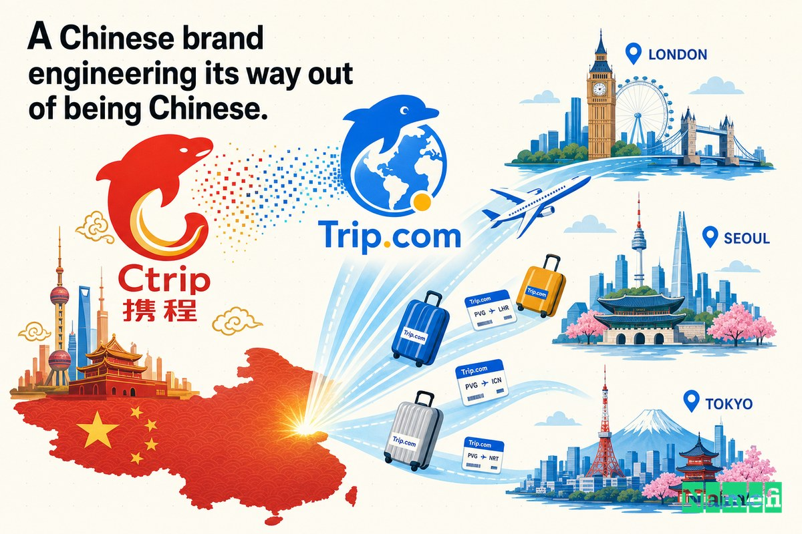

거의 20년 동안, 세계 최대 온라인 여행사는 한 나라에서는 완벽하게 통하지만 그 외의 어디서도 잘 통하지 않는 이름을 달고 있었습니다. 바로 **Ctrip.com**이었습니다.

그 이름에는 솔직한 의도가 담겨 있었습니다. James Liang과 세 명의 공동창업자가 1999년 6월 상하이에서 회사를 설립할 당시, "Ctrip" — C가 China를 암시하는 — 이라는 이름은 이 기업이 무엇인지를 정확히 설명하고 있었습니다. 중국 여행자를 위한 중국 여행 서비스. 위키피디아에 따르면 이 회사는 [James Liang, Neil Shen, Min Fan, Qi Ji가 1999년 6월에 Ctrip.com으로 설립](https://en.wikipedia.org/wiki/Trip.com_Group#:~:text=founded%20as%20Ctrip.com%20by%20James%20Liang%2C%20Neil%20Shen%2C%20Min%20Fan%2C%20and%20Qi%20Ji%20in%20June%201999)했습니다. 이후 놀라운 속도로 성장하여 2003년에는 메릴린치 주관으로 7,500만 달러를 조달하며 [NASDAQ에 상장](https://en.wikipedia.org/wiki/Trip.com_Group#:~:text=listed%20on%20the%20NASDAQ)되었는데, 이는 중국 소비자 인터넷 기업의 첫 번째 IPO 물결 중 하나였습니다.

중국 내에서 Ctrip.com은 표준이었습니다. 수억 명의 사람들이 항공편이나 호텔을 예약할 때 찾는 기본값이자, 일종의 동사처럼 쓰이는 이름이었습니다. 그러나 회사가 자국 시장 밖을 바라보는 순간, 그 이름은 벽이 되었습니다. "Ctrip"은 중국어 사용자에게는 자연스럽게 읽힙니다. 하지만 런던이나 서울의 여행자에게 이 이름은 낯선 자음 조합으로, 무엇보다 먼저 *중국* 회사라는 사실을 알리며, 철자를 쓰거나 발음하거나 기억하기 어려운 이름이었습니다.

그래서 2017년, 중국의 여행 대기업은 얼핏 사소해 보이는 일을 했습니다. 도메인 하나를 샀습니다. 경쟁사도 아니고 시장도 아닌, `.com`이 붙은 단 하나의 프리미엄 영어 단어: **Trip.com**. 2년 후, 그 도메인은 단순한 제품이 아니라 회사 전체의 이름이 됩니다.

## 1999~2017: 중국은 제패했지만 그 밖에는 거의 없었던 시절

2010년대 중반, Ctrip은 자국 시장을 완전히 장악하여 더 이상 가져올 것이 남지 않은 상태였습니다. 대부분의 국내 경쟁사를 흡수하거나 압도하며, 여러 매체가 묘사했듯 중국 최대 — 어떤 기준으로는 세계 최대 — 온라인 여행사가 되었습니다. 그러나 그 규모의 거의 전부는 단 하나의 국경 안에 머물러 있었습니다.

수치는 냉혹했습니다. South China Morning Post 보도에 따르면, Ctrip은 [최근 인수한 Trip.com 브랜드를 활용해 해외 고객으로부터 얻는 전체 매출 비중을 현재 2%에서 향후 5년 내 최소 20%까지 끌어올릴 계획](https://www.scmp.com/tech/article/2156222/china-travel-giant-ctrip-wants-book-bigger-seat-international-markets-tripcom#:~:text=plans%20to%20boost%20the%20proportion%20of%20total%20revenue%20it%20makes%20from%20overseas%20customers%20from%202%20per%20cent%20to%20at%20least%2020%20per%20cent%20over%20the%20next%20five%20years%2C%20using%20its%20recently-acquired%20Trip.com%20brand)이었습니다. 2%라는 숫자. 지구상에서 가장 큰 여행 시장을 지배하는 기업이 국제 무대에서는 반올림 오차 수준에 불과했던 것입니다.

매출이 세계적이지 않을 때도 야망은 이미 세계를 향해 있었습니다. Liang은 여행 산업 전체를 규모의 싸움으로 규정했습니다. 그는 [여행은 결국 승자독식 게임이 될 것](https://www.scmp.com/tech/article/2156222/china-travel-giant-ctrip-wants-book-bigger-seat-international-markets-tripcom#:~:text=travel%20will%20be%20a%20winner%20takes%20all%20game%20in%20the%20end)이라고 주장했습니다. 그리고 목표는 명확했습니다. [글로벌 관광 시장에서 큰 파이를 차지하고 Expedia 같은 경쟁사를 꺾는 것이 이제 Ctrip의 핵심 과제](https://www.scmp.com/tech/article/2156222/china-travel-giant-ctrip-wants-book-bigger-seat-international-markets-tripcom#:~:text=Taking%20a%20big%20slice%20of%20the%20global%20tourism%20market%20and%20beating%20competitors%20like%20Expedia%20is%20now%20a%20key%20focus%20for%20Ctrip)였습니다.

그러나 세계 대부분의 사람들이 발음조차 못하는 브랜드로 Expedia.com이나 Booking.com과 경쟁할 수는 없습니다. 자국에서의 성장에는 완벽한 발판이었던 서술적이고 중국에 고착된 이름이, 이제 회사가 나아가려는 해외 무대에서는 천장이 되어 있었습니다. Ctrip.com은 처음 18년 동안은 맞는 도메인이었습니다. 하지만 그 회사가 되려는 모습에는 맞지 않는 도메인이었습니다.

## 2017: Gogobot이라는 스타트업으로부터 Trip.com을 사다

그래서 Ctrip은 더 나은 이름을 얻으러 나섰습니다. 여행 업계 전체에서 가장 탐나는 도메인 중 하나인 `Trip.com`을, 그 도메인을 보유하고 있던 회사를 통째로 인수하는 방식으로 손에 넣었습니다.

그 회사는 샌프란시스코의 여행 추천 스타트업 Gogobot이었습니다. 이미 해당 도메인을 중심으로 리브랜딩을 마친 상태였습니다. ChinaTravelNews는 이 거래를 간결하게 보도했습니다. [Ctrip이 개인화 여행 추천 서비스를 제공하는 미국 여행 예약 플랫폼 Trip.com(구 Gogobot)의 인수를 최근 완료했다](https://www.chinatravelnews.com/article/118274/#:~:text=Ctrip%20has%20recently%20completed%20its%20acquisition%20of%20US%20travel%20booking%20platform%20Trip.com%20%28formerly%20Gogobot%29%20that%20offers%20personalized%20travel%20recommendations)고. 인수 금액은 공개되지 않았습니다.

핵심은, Ctrip이 실제로 사려고 했던 것은 추천 엔진이 아니라 주소였다는 점입니다. Trip.com을 손에 넣은 덕분에, 회사는 이제 나란히 운용할 수 있는 두 개의 깔끔한 영어 글로벌 브랜드를 갖게 되었습니다. 업계 분석가들은 이 구조를 즉각 알아봤습니다. 한 업계 관계자의 표현을 빌리면, Ctrip은 [메타서치에는 Skyscanner, 풀서비스 OTA에는 Trip.com](https://www.chinatravelnews.com/article/118274/#:~:text=Skyscanner%20for%20metasearch%20and%20Trip.com%20for%20full-service%20OTA)을 활용할 수 있게 된 것입니다. 2016년에 인수한 항공권 검색 브랜드와, 이제 막 확보한 예약 브랜드, 두 가지 모두 서양 여행자들이 실제로 쓸 수 있는 이름을 달게 되었습니다.

## Ctrip이 오기까지 도메인이 걸어온 20년의 여정

Trip.com이 그토록 특별한 자산인 이유가 여기 있습니다. Ctrip이 이를 매입할 당시, 이 도메인은 이미 거의 4반세기에 걸친 여행 업계 역사를 고스란히 담고 있었습니다. Skift가 전체 이력을 추적했는데, 소유권 이전의 연쇄는 온라인 여행 시대 전체를 아우르는 지도처럼 읽힙니다.

도메인은 1996년에 처음 등록되었는데, 최초 창업자 Antoine Toffa가 기억하는 인물은 [Trip Software Systems의 "Trip 씨"](https://finance.yahoo.com/news/trip-com-nearly-quarter-century-063018580.html#:~:text=Mr.%20Trip%22of%20Trip%20Software%20Systems)라는 이름만 남아 있습니다. Toffa는 이후 [1998년에 그로부터 5,000달러에 도메인을 구입](https://finance.yahoo.com/news/trip-com-nearly-quarter-century-063018580.html#:~:text=purchased%20it%20from%20him%20in%201998%20for%20%245%2C000)하여 초기 여행 사이트를 구축했습니다. 큰돈이 빠르게 찾아왔습니다. 여행 기술 기업 Galileo가 [2000년에 현금과 주식 2억 1,440만 달러에 나머지 지분을 인수](https://finance.yahoo.com/news/trip-com-nearly-quarter-century-063018580.html#:~:text=acquired%20the%20rest%20of%20the%20company%20in%202000%20for%20%24214.4%20million%20in%20cash%20and%20stock)한 것입니다.

이후 도메인은 긴 죽음과 부활의 사이클을 거쳤습니다. Cendant가 Galileo를 흡수한 뒤 [2003년 Trip.com을 폐쇄](https://finance.yahoo.com/news/trip-com-nearly-quarter-century-063018580.html#:~:text=shut%20down%20Trip.com%20in%202003)하면서 브랜드의 첫 번째 죽음을 맞이했습니다. 2009년에는 [Orbitz Worldwide가 Trip.com 브랜드를 메타서치 사이트로 부활](https://finance.yahoo.com/news/trip-com-nearly-quarter-century-063018580.html#:~:text=Orbitz%20Worldwide)시켰다가 다시 시들었습니다. 이후 Gogobot이 Expedia로부터 미공개 금액에 URL을 매입하여 [Trip.com으로 리브랜딩](https://finance.yahoo.com/news/trip-com-nearly-quarter-century-063018580.html#:~:text=Gogobot%20then%20rebranded%20to%20become%20Trip.com)했습니다. 그리고 마침내 [Ctrip이 2017년 Gogobot — 즉 Trip.com이 된 회사 — 을 인수](https://finance.yahoo.com/news/trip-com-nearly-quarter-century-063018580.html#:~:text=Ctrip%20acquired%20Gogobot-turned%20Trip.com%20in%202017)했습니다.

1998년 5,000달러에 시작한 도메인이 2000년에는 2억 1,440만 달러짜리 인수 거래 안에 포함되어 있었습니다. 세 개의 서로 다른 법인 소유주와 두 번의 서비스 종료를 이겨냈습니다. "Trip"이라는 단어에 [".com"](/ko/tld/com/)을 더한 조합은 여행 분야에서 너무 가치 있어서 묻혀 있을 수 없었으며, 글로벌 시장을 쫓는 중국 기업이야말로 이를 마침내 영구적으로 활용할 동기를 가진 바로 그 매수자였습니다.

## 그때 금액은 달라 보였다

오늘날의 Trip.com을 — 수백억 달러 가치의 회사의 글로벌 브랜드를 — 보면서 그 도메인을 사는 것이 당연한 결정이었을 것이라 생각하기 쉽습니다. 그러나 그렇지 않았습니다.

Ctrip은 Gogobot에 얼마를 지불했는지 끝내 공개하지 않았고, 이 거래는 순수한 도메인 매입이 아니라 법인 인수의 형태로 구조화되어 단일 가격표를 산출하기가 어렵습니다. 그러나 과거의 비교 사례들은 프리미엄 여행 도메인이 어떻게 가치를 축적해왔는지를 잘 보여줍니다. 같은 문자열이 1998년에는 5,000달러에 손을 바꿨다가 2년 뒤에는 2억 1,440만 달러 거래에 묶여 있었습니다. "Trip.com"의 가격은 도메인 등록 비용과 무관합니다. 그것은 특정 매수자가 카테고리 전체를 이해 가능하게 만드는 단 하나의 단어를 얼마나 절실히 원했는가의 문제였습니다.

2017년, Ctrip은 그것이 절실했습니다. 자국에서는 압도적인 규모를 갖추었으나 해외에서는 거의 아무것도 없었던, 해외 매출 비중 2%인 회사가 이를 20%까지 끌어올리고 Expedia에 정면 도전하겠다는 도박을 걸고 있었습니다. 재고나 기술, 마케팅 대신 *이름*에 진짜 돈을 쓰는 것은, 도메인을 그 위에 모든 것을 쌓아 올릴 기반으로 대할 때만 의미가 있습니다. Ctrip은 중국이 아닌 전 세계 사람들에게 새로운 브랜드를 학습시키려 하고 있었습니다. 그 브랜드를 가장 저렴하게 각인시키는 방법은, 여행자들이 이미 알고 있는 단어로 만드는 것이었습니다. trip.

## Trip.com으로의 전환이 중요한 이유

Ctrip.com과 Trip.com의 차이는 글자 하나입니다. 전략적으로는 지역 강자와 글로벌 강자의 차이입니다.

**Ctrip.com**은 기능보다 출신지를 먼저 드러냅니다. "C"는 하나의 깃발이고, 낯선 깃발입니다. **Trip.com**은 당신이 하러 온 바로 그것만을 드러냅니다. 이 이름은 가장 좋은 의미에서 일반적입니다. 지구상의 모든 여행자가 이미 이해하는 평범한 영어 명사이고, 정확히 일치하는 `.com`을 소유하며, 처음에도 정확히 철자를 쓸 수 있는 이름입니다. 하나의 이름은 세상이 중국 회사에 대해 배우기를 요구합니다. 다른 이름은 단순히 여행을 떠나도록 돕겠다고 제안합니다.

| 이전 | 이후 |
| --- | --- |
| Ctrip.com | Trip.com |
| "중국 여행 사이트"로 읽힘 | "그 여행 사이트"로 읽힘 |
| 출신 우선: "C"가 국적을 표시 | 기능 우선: 단어 자체가 카테고리 |
| 해외에서 철자, 발음, 기억하기 어려움 | 누구나 이미 아는 영어 명사 |
| 지역 강자의 이름 | 글로벌 카테고리의 이름 |

이것은 훌륭한 도메인 업그레이드에서 반복되는 패턴입니다. 초기 이름은 *당신이 누구인지를 설명*하고, 훌륭한 이름은 *당신이 하는 일을 소유*합니다. Ctrip.com은 중국을 정복하기에 완벽한 이름이었습니다. Trip.com은 그 밖의 모든 곳을 정복하기 위한 이름이었고, 두 번째 전략을 가지려면 먼저 두 번째 도메인을 소유해야 했습니다.

## 중국 브랜드가 스스로 '중국 브랜드'라는 껍질을 벗어나다

이 사례를 특별하게 만드는 것은 Ctrip이 얼마나 의도적으로 자신의 국가 정체성을 벗어던지려 했는가입니다. 이것은 우연한 리브랜딩이 아니었습니다. 회사 자신의 표현을 빌리면, 수술이었습니다.

글로벌 리브랜딩을 보도한 Marketing-Interactive는 Liang의 목표를 그의 말로 전했습니다. 그는 ["내부로부터의 리브랜딩"이라고 부른 작업을 통해 중국 소유 기업이라는 일체의 언급을 없애고 싶어](https://www.marketing-interactive.com/ctrip-launches-global-rebrand-to-trip-com#:~:text=He%20wants%20to%20eliminate%20any%20reference%20to%20being%20Chinese-owned%20through%20what%20he%20called%20%E2%80%98an%20inside-out%20rebranding%E2%80%99)했습니다. 새로운 Trip.com 브랜드는 [상징적인 돌핀을 로고에서 제거하고, 로고의 색상과 폰트를 변경](https://www.marketing-interactive.com/ctrip-launches-global-rebrand-to-trip-com#:~:text=removing%20its%20iconic%20dolphin%20from%20the%20logo%2C%20and%20changing%20the%20logo%E2%80%99s%20colour%20and%20font)하는 작업까지 포함했습니다. 새로운 지리적 중립 이름에 맞추어 시각 정체성이 다시 구축된 것입니다. 새롭게 론칭된 사이트는 국제 여행자를 직접 겨냥하여 설계되었습니다. Yicai Global에 따르면 [Trip.com은 웹사이트와 모바일 앱을 통해 13개 언어로 원스톱 여행 예약 서비스를 제공](https://www.yicaiglobal.com/news/china-leading-online-travel-services-provider-ctrip-goes-through-inside-out-rebranding-unveils-new-global-site#:~:text=Trip.com%20will%20provide%20one-stop%20travel%20booking%20services%20in%2013%20languages)합니다.

그 이유의 논리는 언제나 같았습니다. 바로 규모입니다. Liang이 SCMP에 말했듯, 단일 시장만으로는 경쟁이 불가능합니다. [여행 시장은 글로벌 시장입니다. 한 시장만 운영하면 규모의 경제를 실현하여 경쟁할 수 없습니다](https://www.scmp.com/tech/article/2156222/china-travel-giant-ctrip-wants-book-bigger-seat-international-markets-tripcom#:~:text=The%20travel%20market%20is%20a%20global%20market.%20If%20you%E2%80%99re%20just%20doing%20one%20market%2C%20you%20can%E2%80%99t%20realise%20the%20economies%20of%20scale%20to%20compete). Ctrip이 규모의 경제를 원하는 바로 그 시장에서 모든 서양 사용자에게 "중국 회사"를 방송하는 이름은 마찰이었습니다. Trip.com은 설계적으로 그 마찰을 제거했습니다. 일반적이고 특정 주인이 없는 느낌의 영어 단어를 통해, 상하이 회사가 런던의 여행자에게 단순히 여행을 예약하는 곳으로 자신을 소개할 수 있게 된 것입니다.

## 2019: 도메인이 곧 회사가 되다

2년 동안 Trip.com은 회사가 소유한 브랜드였습니다. 그리고 그것은 회사 *그 자체*의 이름이 되었습니다.

2019년 10월, 창립 20주년 기념식에서 모회사는 사명 변경 안건을 주주총회에 부쳤고 승인을 받았습니다. 신화통신은 [중국 최대 온라인 여행사 Ctrip이 공식 사명 변경을 결정했으며](http://www.xinhuanet.com/english/2019-10/29/c_138513249.htm#:~:text=China%E2%80%99s%20largest%20online%20travel%20agency%20Ctrip%20has%20decided%20to%20change%20its%20official%20name), [주주들이 "Ctrip.com International, Ltd."에서 "Trip.com Group Limited"로의 사명 변경 안건을 승인했다](http://www.xinhuanet.com/english/2019-10/29/c_138513249.htm#:~:text=The%20company%E2%80%99s%20shareholders%20have%20approved%20the%20change%20of%20the%20company%20name%20from)고 보도했습니다. 위키피디아도 같은 내용을 기록하고 있습니다. [2019년 10월, 주주들은 사명을 "Ctrip.com International, Ltd."에서 "Trip.com Group Limited"로 변경하는 회사의 제안을 승인했습니다.](https://en.wikipedia.org/wiki/Trip.com_Group#:~:text=In%20October%202019%2C%20shareholders%20approved%20the%20company%E2%80%99s%20proposal%20to%20change%20its%20name%20from%20%E2%80%9CCtrip.com%20International%2C%20Ltd.%E2%80%9D%20to%20%E2%80%9CTrip.com%20Group%20Limited.%E2%80%9D)

그 이유는 전적으로 글로벌 가독성에 있었습니다. Caixin Global에 따르면 Liang은 [새 이름이 "글로벌 사용자들이 쉽게 기억할 수 있는 이름"이라고 말하며, Expedia, Priceline 같은 국제 경쟁사 수준의 광범위한 브랜드 인지도를 달성하고자 하는 회사의 야심을 반영한다](https://www.caixinglobal.com/2019-10-30/ctrip-formalizes-name-change-as-it-eyes-global-expansion-101476945.html#:~:text=said%20the%20new%20name%20%22can%20be%20easily%20remembered%20by%20global%20users%2C%22%20reflecting%20the%20company%27s%20ambition%20to%20achieve%20the%20widespread%20brand%20recognition%20of%20international%20competitors%20like%20Expedia%20and%20Priceline)고 설명했습니다. 주식 티커도 새 정체성에 맞게 바뀌었습니다. 같은 보도에 따르면 [티커가 "CTRP"에서 "TCOM"으로 변경](https://www.caixinglobal.com/2019-10-30/ctrip-formalizes-name-change-as-it-eyes-global-expansion-101476945.html#:~:text=Its%20ticker%20will%20be%20changed%20from%20%22CTRP%22%20to%20%22TCOM.%22)됩니다.

그 순서에 주목하십시오. 이것이 핵심 교훈입니다. 도메인이 **먼저** 왔습니다(2017). 제품 리론칭이 **두 번째**였습니다(2018). 법인 사명 변경이 **마지막**이었습니다(2019). Trip.com을 소유하지 않은 채로 상장된 회사 전체를 "Trip.com Group"으로 개명할 수는 없습니다. Ctrip은 주주들에게 투표를 요청하기 전 2년을 그 확보에 썼습니다. 결정적으로, 사명 변경이 Ctrip을 죽이지는 않았습니다. Ctrip 브랜드는 중국 시장에서 살아남았고, Trip.com은 해외 공략의 첨병이 되었습니다. 그룹은 단순히 모회사의 이름으로 글로벌을 향한 이름을 선택한 것입니다.

## 도메인은 운영 체계의 일부가 되었다

프리미엄 도메인은 명성의 문제가 아닙니다. 반복의 문제입니다. 그리고 글로벌로 나가는 회사에게는, 고객이 실제로 사용하는 언어로 반복되는 것의 문제입니다.

회사의 핵심 도메인은 마케팅팀이 직접 통제하지 않는 곳에도 등장합니다.

- 수십 개 국가의 앱스토어 목록.
- 항공사 예약 확인 이메일, 호텔 바우처, 여행 일정표.
- 진출하는 모든 시장의 언론 헤드라인과 애널리스트 보고서.
- 검색 결과, 브라우저 주소창, 여행자들 사이의 입소문 추천.
- 주식 티커, 투자자 자료, 법인명 자체.

그 반복 하나하나가 마찰을 더하거나 줄입니다. Ctrip.com은 국제적으로 언급될 때마다 철자를 쓰기 약간 더 어렵고, 약간 더 이국적이며, 약간 더 "중국 사이트"로 느껴지게 만들었습니다. Trip.com은 언급될 때마다 13개 언어 중 어느 하나의 언어를 쓰는 여행자도 생각 없이 흡수할 수 있는 평범한 영어 단어가 되었습니다. 이를 수억 명의 사용자와 Ctrip이 진출하고자 했던 모든 시장에 곱하면, [프리미엄 도메인](/ko/glossary/premium-domain/)은 허영의 구매처럼 보이는 것을 멈추고 글로벌 성장의 저항을 영구적으로 줄이는 요소처럼 보이기 시작합니다.

## 창업자들이 사례 5에서 배워야 할 것

쉬운 교훈 — "일반 .com을 사라" — 은 진짜 구조를 놓칩니다. 유용한 교훈은 *서술적 이름이 언제 벽이 되는가*, 그리고 *그것을 어떤 순서로 허무는가*에 관한 것입니다.

1. **지역적이고 서술적인 이름은 초기에 특징이 됩니다.** "Ctrip" — 중국을 뜻하는 C — 는 중국을 정복하기 위한 올바른 이름이었습니다. 회사가 무엇인지를 필요한 청중에게 정확히 신호를 보냈습니다. 지리적으로 코딩되거나 서술적인 이름은 실수가 아니라 합리적인 시작점입니다.
2. **이름이 당신을 설명하는 것을 멈추고 당신을 제한하기 시작하는 순간을 주시하십시오.** Ctrip의 경우 그 신호는 구조적이었습니다. 해외 매출 2%, 외국 고객이 철자를 쓸 수 없는 이름, 20%를 달성하고 Expedia를 꺾겠다는 명시된 야심. 이름이 한 시장에서만 통하는데 모든 시장을 원할 때, 이름이 천장이 됩니다.
3. **회사 전체를 걸기 전에 도메인을 먼저 매입하십시오.** Ctrip은 2017년에 Trip.com을 인수하고, 2018년에 소비자 브랜드를 재론칭하고, 2019년에야 상장사 이름을 변경했습니다. 느리고, 비싸고, 외부 소유의 자산 — 도메인 — 을 *먼저* 확보해야 합니다. 법인 정체성은 그 뒤를 따를 수 있습니다.
4. **일반 명사는 영리한 이름이 할 수 없는 일을 합니다.** Trip.com이 통하는 것은 정확히 그것이 출처에서 *특별하지 않기* 때문입니다. 카테고리 전체를 아우르는 평범한 명사이고, 정확히 일치하는 `.com`을 완전히 소유하며, 글로벌 전략에서 기억하기 좋지만 낯선 것보다 소유 가능한 일반 명사가 유리합니다.

도메인 업그레이드만으로 Trip.com Group이 승리한 것은 아닙니다. Liang의 전략, 20년에 걸친 운영 역량, Skyscanner 인수, 그리고 순수한 규모가 훨씬 더 중요했습니다. 그러나 Trip.com은 회사가 중국 브랜드가 아닌 *글로벌* 브랜드로 재탄생하는 것을 실제로 *명명 가능*하게 만들었습니다. 그리고 그 이름은 중국 밖의 누구도 그것을 사용하기 몇 년 전에 이미 매입되어 있어야 했습니다.

## Namefi 관점에서 바라보기

브랜딩 드라마를 걷어내면, 이 사례는 본질적으로 이전과 출처 증명의 문제입니다.

전략적 결정 자체는 사실 의심의 여지가 없었습니다. 글로벌 여행 시장을 쫓는 회사가 Trip.com을 소유해야 한다는 것은 당연합니다. 어려운 것은 그 자산을 둘러싼 모든 것이었습니다. Trip.com은 20년에 걸쳐 적어도 여섯 명의 소유주를 거쳤습니다. 1998년의 5,000달러 구매자, 2000년의 2억 1,440만 달러 인수, Cendant, Orbitz, Expedia, Gogobot — 각각의 이전은 법인 거래 안에 묻혀 있었고, 각각의 가격은 비공개로 협상되었으며, 각각의 양도는 "이것이 누구의 소유인지 증명하고 안전하게 이전하라"는 새로운 문제를 만들었습니다. 그만큼의 역사를 지닌 도메인은 그만큼의 마찰을 안고 있습니다.

[Namefi](https://namefi.io)는 도메인이 인터넷 네이티브 자산처럼 동작해야 한다는 생각 위에 구축되어 있습니다. 토큰화된 소유권은 DNS와의 호환성을 유지하면서 도메인 제어의 검증, 이전, 현대적 워크플로우로의 통합을 더 쉽게 만들 수 있습니다. 이런 방식으로 이와 같은 거래에서 가장 복잡한 부분 — 긴 소유자 체인에 걸친 명확한 출처 확립, 가치 합의, 실시간 수익 창출 사이트를 중단시키지 않고 제어권 이전 — 을 깔끔하고 감사 가능한 거래에 가깝게 만들 수 있습니다. 25년 동안 여섯 번이나 소유주가 바뀐 도메인은 바로 과거 보도를 뒤지는 것이 아니라 한눈에 이력이 읽혀야 하는 종류의 자산입니다.

Trip.com은 오늘날 당연해 보입니다. Trip.com Group이 거대해졌기 때문입니다. 그러나 교훈은 그 규모에 훨씬 앞서 찾아옵니다. 이름이 회사를 국경 너머로 이끌어야 할 때, 도메인은 장식이 아닙니다. 그것은 하중을 지탱하는 부분입니다. 그리고 전 세계를 원하는 브랜드에게 있어, 사명 변경이 일어나기 수년 전부터 이미 쫓아야 할 가치가 있는 것이었습니다.

## 출처 및 추가 읽기

- South China Morning Post — [Exclusive: China travel giant Ctrip wants to go global with Trip.com brand](https://www.scmp.com/tech/article/2156222/china-travel-giant-ctrip-wants-book-bigger-seat-international-markets-tripcom#:~:text=plans%20to%20boost%20the%20proportion%20of%20total%20revenue%20it%20makes%20from%20overseas%20customers%20from%202%20per%20cent%20to%20at%20least%2020%20per%20cent)
- ChinaTravelNews — [Ctrip to further global expansion by acquiring US travel site Trip.com](https://www.chinatravelnews.com/article/118274/#:~:text=Ctrip%20has%20recently%20completed%20its%20acquisition%20of%20US%20travel%20booking%20platform%20Trip.com%20%28formerly%20Gogobot%29)
- Skift (via Yahoo Finance) — [Trip.com's Nearly Quarter Century Odyssey as a Can't Lose Travel Domain](https://finance.yahoo.com/news/trip-com-nearly-quarter-century-063018580.html#:~:text=purchased%20it%20from%20him%20in%201998%20for%20%245%2C000)
- Marketing-Interactive — [Ctrip launches global rebrand to Trip.com](https://www.marketing-interactive.com/ctrip-launches-global-rebrand-to-trip-com#:~:text=He%20wants%20to%20eliminate%20any%20reference%20to%20being%20Chinese-owned%20through%20what%20he%20called%20%E2%80%98an%20inside-out%20rebranding%E2%80%99)
- Yicai Global — [Ctrip Goes Through 'Inside-Out Rebranding,' Unveils New Global Site](https://www.yicaiglobal.com/news/china-leading-online-travel-services-provider-ctrip-goes-through-inside-out-rebranding-unveils-new-global-site#:~:text=Trip.com%20will%20provide%20one-stop%20travel%20booking%20services%20in%2013%20languages)
- Xinhua — [China's Ctrip changes name amid globalization push](http://www.xinhuanet.com/english/2019-10/29/c_138513249.htm#:~:text=China%E2%80%99s%20largest%20online%20travel%20agency%20Ctrip%20has%20decided%20to%20change%20its%20official%20name)
- Caixin Global — [Ctrip Formalizes Name Change as It Eyes Global Expansion](https://www.caixinglobal.com/2019-10-30/ctrip-formalizes-name-change-as-it-eyes-global-expansion-101476945.html#:~:text=said%20the%20new%20name%20%22can%20be%20easily%20remembered%20by%20global%20users%2C%22)
- Wikipedia — [Trip.com Group](https://en.wikipedia.org/wiki/Trip.com_Group#:~:text=In%20October%202019%2C%20shareholders%20approved%20the%20company%E2%80%99s%20proposal%20to%20change%20its%20name)
