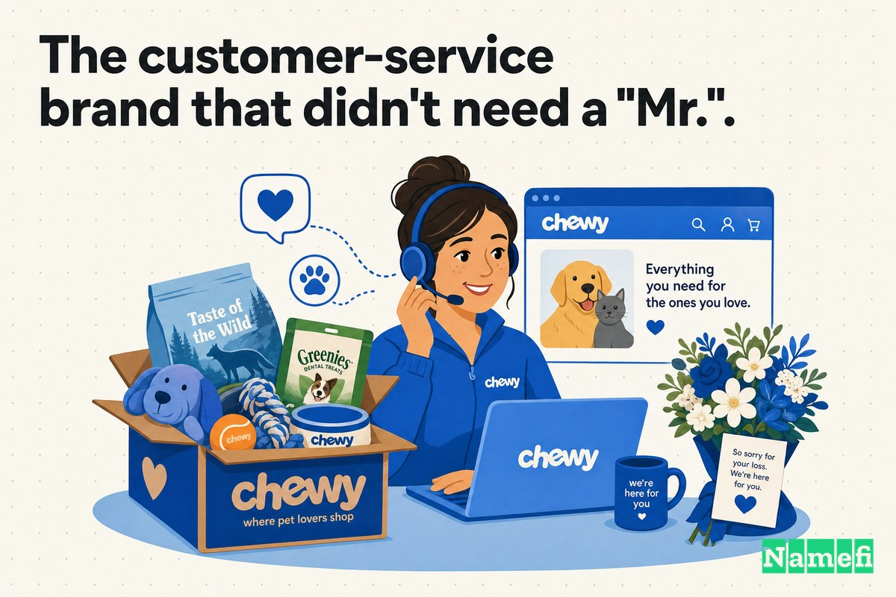

Chewy가 펫 이커머스의 고객 서비스 전설로 자리 잡기 전 — 손으로 쓴 카드, 위로의 꽃다발, 그리고 33억 5천만 달러의 엑시트가 이루어지기 전 — 이 브랜드에는 조금 더 귀엽고 조심스러운 이름이 있었습니다. 바로 **Mr. Chewy**였으며, 주소는 **MrChewy.com**이었습니다.

당시에는 그 경칭이 충분히 납득할 만했습니다. 2011년, 20대의 두 친구는 아무도 들어본 적 없는 웹사이트에서 낯선 사람들에게 개 사료를 팔려 하고 있었습니다. 그 카테고리는 이미 닷컴 시대의 가장 유명한 실패 사례 중 하나를 낳은 영역이기도 했습니다. "Mr. Chewy"는 친근했습니다. 다가가기 쉬운 이름이었습니다. 기업처럼 들리지 않고 하나의 캐릭터처럼 느껴졌습니다 — 당신의 반려동물을 위한 예의 바르고 인간적인 소매상인처럼요. 신뢰를 쌓아야 하는 신생 브랜드에게 "Mr."는 감정적으로 실질적인 역할을 했습니다.

그러나 마스코트처럼 읽히는 이름은 카테고리 그 자체처럼 읽히는 이름과 다릅니다. 회사가 첫 고객층을 넘어 성장하면서 "Mr."는 따뜻함보다는 보조 바퀴처럼 보이기 시작했습니다. 창업자들은 그것을 떼어냈습니다. 쇼핑몰은 단순히 **Chewy**가 되었고, 주소는 정확 일치 도메인 **Chewy.com**으로 바뀌었습니다 — 세계에서 가장 유명한 도메인 투자자 중 한 명이 어떤 펫 스타트업도 존재하기 수년 전에 손수 등록해 두었던 단 한 단어짜리 도메인이었습니다.

출시 6년 후, [PetSmart의 오너들은 Chewy를 33억 5천만 달러에 인수했습니다](https://hbr.org/2020/01/the-founder-of-chewy-com-on-finding-the-financing-to-achieve-scale) — 도메인이 아니라 회사 전체를 — 당시 역대 최대 이커머스 인수 사례로 기록되었습니다. 도메인이 그 이유는 아니었습니다. 그러나 그때쯤에는 깔끔한 단 한 단어의 이름이 핵심 자산이 되어 있었습니다 — 모든 박스, 모든 영수증, 그리고 한 반려동물 보호자에서 다음 보호자로 전달되는 "Chewy에서 샀어"라는 추천 한마디 위에 인쇄된 주소가 되어 있었습니다.

## 2011년: 신생 브랜드를 안심시킨 "Mr."

처음에 "Mr. Chewy"는 버그가 아니라 기능이었습니다.

회사는 [2011년 6월 Ryan Cohen과 Michael Day가 "Mr. Chewy"라는 이름으로 설립했습니다](https://en.wikipedia.org/wiki/Chewy_(company)#:~:text=Chewy%20was%20founded%20with%20the%20name%20%22Mr.%20Chewy%22%20in%20June%202011%20by%20Ryan%20Cohen%20and%20Michael%20Day). 이 사업은 처음부터 쉽지 않았습니다. 두 창업자의 말에 따르면, 그들은 원래 전혀 다른 사업을 막 출시하려던 참이었습니다. 창업 스토리에 따르면, [Cohen과 Day는 주얼리 사업 출시를 일주일 앞두고 재고와 금고를 팔아치우고 펫푸드 산업을 공부하는 데 몰입했습니다](https://www.businessofbusiness.com/articles/if-you-own-a-pet-youve-heard-of-chewy-heres-why-the-31-billion-site-succeeded-where-petscom-failed/#:~:text=Cohen%20and%20Day%20were%20a%20week%20away%20from%20launching%20their%20jewelry%20business). 방향 전환은 작고 개인적인 순간에서 비롯되었습니다. [Cohen이 자신의 푸들과 함께 펫푸드 매장에 서서 직원에게 식품 옵션에 대해 물어보다 영감을 얻은 것입니다](https://www.businessofbusiness.com/articles/if-you-own-a-pet-youve-heard-of-chewy-heres-why-the-31-billion-site-succeeded-where-petscom-failed/#:~:text=co%2Dfounder%20Ryan%20Cohen%20was%20standing%20in%20a%20pet%20food%20store%20with%20his%20poodle).

그들은 [2011년 자체 자금과 소액 대출 몇 건으로 Chewy.com을 출시했습니다](https://www.businessofbusiness.com/articles/if-you-own-a-pet-youve-heard-of-chewy-heres-why-the-31-billion-site-succeeded-where-petscom-failed/#:~:text=Cohen%20and%20Day%20launched%20Chewy.com%20in%202011%20using%20their%20own%20cash%20and%20several%20small%20loans) — 단, "Mr. Chewy" 간판을 달고 MrChewy.com에서요. 그 경칭은 신생 브랜드가 이름에 바라는 바를 정확히 해냈습니다. 검증되지 않은 웹사이트를 차가운 상점 대신 친근한 이웃처럼 느끼게 해준 것입니다. Pets.com의 화려한 몰락으로 여전히 상처가 남아 있던 카테고리에서, 따뜻하고 인간적인 이름은 지난 펫스토어 열풍의 차갑고 인형 같은 기억에 대한 의도적인 해독제였습니다.

"Mr."는 진입로였습니다. 목적지는 아니었습니다.

## "Mr."를 떼어내고 정확 일치 도메인으로

어느 순간 회사는 그 경칭을 놓아주었습니다. "Mr. Chewy"는 **Chewy**가 되었고, 브랜드는 정확 일치 도메인 **Chewy.com**으로 통합되었습니다.

도메인 업그레이드를 연구하는 업계 전문가들은 이 움직임을 교과서적인 단순화로 평가합니다. Smart Branding은 10년간의 브랜드 이름 축소 사례를 정리하며, [Chewy가 "Mr. Chewy"라는 이름으로 창립되었다가](https://smartbranding.com/2010-2020-a-decade-in-domains-part-1-brands-simplified-their-names/#:~:text=Chewy%20was%20founded%20under%20the%20name%20%22Mr.%20Chewy%22) 더 짧은 이름으로 통합된 과정을 기록했습니다. 그리고 도메인 자체가 그냥 유휴 자산으로 놓여 있던 것도 아니었습니다. 정확 일치 도메인에는 유명한 이전 소유자가 있었습니다. [Chewy.com 도메인은 Frank Schilling의 Name Administration에서 매각된 것으로 보입니다](https://smartbranding.com/2010-2020-a-decade-in-domains-part-1-brands-simplified-their-names/#:~:text=The%20domain%20Chewy.com%20appears%20to%20have%20been%20sold%20by%20Frank%20Schilling%27s%20Name%20Administration). 인터넷에서 가장 크고 유명한 도메인 포트폴리오 중 하나입니다. Chewy.com은 갓 등록된 도메인이 아니었습니다 — [2004년 4월에 이미 등록되어 있었으며](https://secureyourtrademark.com/blog/the-chewy-com-trademark/#:~:text=The%20domain%20chewy.com%20was%20registered%20in%20April%20of%202004), Mr. Chewy가 처음 사료 한 포대를 팔기 7년 전의 일이었습니다.

업그레이드 비용은 얼마였을까요? 여기서 공개 기록은 침묵합니다. 여러 자료에 따르면 회사는 [도메인 투자자 Frank Schilling으로부터 비공개 금액으로 도메인을 취득했으며](https://smartbranding.com/mychewy-com-upgrade-to-chewy-com/#:~:text=They%20acquired%20the%20name%20from%20domain%20investor%20Frank%20Schilling%20for%20an%20undisclosed%20amount), 같은 기록들은 [도메인 가격이 비공개로 유지되었다](https://smartbranding.com/2010-2020-a-decade-in-domains-part-1-brands-simplified-their-names/#:~:text=The%20price%20of%20the%20domain%20was%20kept%20private)고 단호하게 확인합니다. 따라서 이 이야기에서 공개된 수치는 도메인 가격이 아니라 이야기의 반대편 끝에 있는 숫자입니다. [2017년, PetSmart는 역대 최대 이커머스 인수 사례로 Chewy.com을 33억 5천만 달러에 인수했습니다](https://smartbranding.com/2010-2020-a-decade-in-domains-part-1-brands-simplified-their-names/#:~:text=In%202017%2C%20PetSmart%20acquired%20Chewy.com%20for%20%243.35%20billion%20in%20the%20largest%20e%2Dcommerce%20acquisition). PetSmart가 지분을 산 도메인은 경칭이 없는, 깔끔한 한 단어짜리 버전이었습니다.

## 뒷이야기: Java 채팅방, 주얼리 사업 피봇, 그리고 100번의 거절

창업자들은 처음에 아마존을 상대로 카테고리를 장악할 인물들처럼 보이지 않았습니다.

Cohen과 Day는 [Java 채팅방에서 만났습니다](https://www.aol.com/article/finance/2017/04/20/meet-the-young-founders-of-chewy-com-which-petsmart-just-bought/22048014#:~:text=launched%20the%20company%20in%202011%2C%20after%20meeting%20in%20a%20Java%20chat%20room) — Cohen은 어필리에이트 마케팅을 하고 있었고, Day는 프로그래머였습니다. 펫사업 이전에 [두 사람은 자체 자금 15만 달러를 온라인 주얼리 스타트업에 투자했다가](https://www.aol.com/article/finance/2017/04/20/meet-the-young-founders-of-chewy-com-which-petsmart-just-bought/22048014#:~:text=the%20two%20put%20%24150%2C000%20of%20their%20own%20money%20into%20an%20online%20jewelry%20startup) 출시 일주일 전에 포기했습니다.

그리고 "아니요"의 벽이 찾아왔습니다. [Cohen은 플로리다 자택에서 실리콘밸리로 날아가 수십 곳의 VC 펌을 찾아갔지만, 모두 Chewy가 아마존과 경쟁할 수 없다는 이유로 거절했습니다](https://www.businessofbusiness.com/articles/if-you-own-a-pet-youve-heard-of-chewy-heres-why-the-31-billion-site-succeeded-where-petscom-failed/#:~:text=Cohen%20flew%20from%20his%20home%20base%20in%20Florida%20to%20Silicon%20Valley%20and%20approached%20dozens%20of%20VC%20firms.%20Everyone%20turned%20him%20down). 돌파구는 다시 돌아온 한 신봉자로부터 왔습니다. [2013년 9월 말, 처음에 투자를 거절했던 한 투자자가 회사가 추정치를 크게 초과했다는 소식을 듣고 다시 살펴보았고](https://www.businessofbusiness.com/articles/if-you-own-a-pet-youve-heard-of-chewy-heres-why-the-31-billion-site-succeeded-where-petscom-failed/#:~:text=in%20late%20September%202013%2C%20an%20investor%20who%20had%20initially%20passed%20took%20a%20second%20look), [즉시 Cohen과 Day에게 1,500만 달러짜리 수표를 써 주었습니다](https://www.businessofbusiness.com/articles/if-you-own-a-pet-youve-heard-of-chewy-heres-why-the-31-billion-site-succeeded-where-petscom-failed/#:~:text=immediately%20wrote%20a%20%2415%20million%20check%20to%20Cohen%20and%20Day%20to%20invest%20in%20Chewy).

그때쯤 투자금이 들어왔을 때, 브랜드는 확장할 준비가 되어 있어야 했습니다. 그리고 확장하는 브랜드는 모든 언급에 마스코트의 경칭이 붙어 다니는 것을 원하지 않습니다.

## 그때는 자금 상황이 달랐습니다

"Chewy"와 "Chewy.com"을 보며 단 한 단어짜리 이름이 항상 당연하고, 저렴하고, 필연적이었다고 가정하기 쉽습니다. 그렇지 않았습니다.

2011년과 2012년, Chewy는 창업자의 자체 자금과 소액 대출로 운영되는 자기자본 스타트업이었고, 투자자들이 적극적으로 기피하던 카테고리에 속해 있었습니다. 프리미엄, 정확 일치, 단 한 단어짜리 [.com](/ko/tld/com/) — 2004년에 손수 등록되어 최고 등급 [도메인 포트폴리오](/ko/glossary/domain-portfolio/)에 보관되어 있던 — 은 자금이 부족한 펫 스토어가 가볍게 매입할 수 있는 자산이 아닙니다. 비공개로 유지된 가격이 얼마였든, 그것은 급여, 재고, 그리고 실제로 회사의 경쟁 우위가 된 고객 서비스 인프라와 비교 검토되었습니다.

이것이 모든 도메인 결정을 위한 올바른 프레임입니다. "이 이름이 이야기의 끝에서 얼마의 가치를 지니는가"가 아니라, "아직 한 해를 버틸 수 있을지 모르는 회사에게 이 이름이 지금 얼마의 가치를 지니는가"입니다. Chewy는 아직 작을 때 — 결정이 실질적인 비용을 의미할 때 — 깔끔한 이름으로 통합하기로 선택했습니다. 그것이 사후 판단이 아닌, 그 결정을 허영이 아닌 전략적 선택으로 만든 요소입니다.

## "Mr."를 떼어낸 것이 왜 중요했는가

MrChewy.com과 Chewy.com의 차이는 단 한 단어입니다 — 엄밀히 말하면 단어도 아니고, 그냥 호칭입니다. 전략적으로는 *캐릭터*와 *카테고리*의 차이입니다.

**MrChewy.com**은 하나의 개성처럼 들립니다. 매력적이지만 작고 개인적인 단 한 명의 친근한 상인처럼요. **Chewy.com**은 반려동물 용품을 사는 곳처럼 들립니다, 그 이상도 이하도 아닙니다. 하나는 방문하는 마스코트이고, 다른 하나는 자동으로 떠오르는 기본값입니다. 2011년에 매장을 안심하게 만들었던 경칭은, 점점 커지는 브랜드를 실제보다 더 작아 보이게 만드는 요소가 되었습니다.

| 이전 | 이후 |
| --- | --- |
| MrChewy.com | Chewy.com |
| 마스코트 / 캐릭터처럼 읽힘 | 카테고리 자체처럼 읽힘 |
| 친근하지만 작고 개인적 | 친근하면서도 기본값이 될 만큼 큼 |
| 모든 박스와 영수증의 두 단어 이름 | 말하기도 쓰기도 쉬운 깔끔한 한 단어 |
| "Mr. Chewy에 방문하세요" | "Chewy에서 주문하세요" |

이것은 도메인 업그레이드에서 반복되는 동일한 패턴입니다. 초기 이름은 *안심시키고*, 훌륭한 이름은 *소유합니다*. 안심시키는 버전은 새로운 회사가 아직 신뢰를 얻어야 할 때 도움이 됩니다. 정확 일치 버전은 회사가 사람들이 반사적으로 이름을 대는 존재가 될 준비가 되었을 때 도움이 됩니다. "Mr."를 떼어낸 것은 단순히 URL을 줄인 것이 아니었습니다 — 브랜드에 내재된 축소적 의미를 제거한 것이었습니다.

## "Mr."가 필요 없었던 고객 서비스 브랜드

여기에 "Mr."를 떼어낼 만한 아이러니가 있습니다. Chewy는 인간적으로 느껴지기 위해 경칭이 필요하지 않았습니다. 회사 자체에 인간성을 심었기 때문입니다.

처음부터 [Cohen과 Day는 사업에서 고객 서비스가 최우선이어야 한다고 믿었습니다](https://www.businessofbusiness.com/articles/if-you-own-a-pet-youve-heard-of-chewy-heres-why-the-31-billion-site-succeeded-where-petscom-failed/#:~:text=Cohen%20and%20Day%20believed%20that%20customer%20service%20had%20to%20be%20king%20in%20their%20business). 그들은 [콜센터 팀, 라이브 채팅 담당자, 고객 이메일에 응답하는 직원들에 자원을 쏟아부었습니다](https://www.businessofbusiness.com/articles/if-you-own-a-pet-youve-heard-of-chewy-heres-why-the-31-billion-site-succeeded-where-petscom-failed/#:~:text=They%20poured%20resources%20into%20their%20call%20center%20team%2C%20live%20chat%20representatives%2C%20and%20employees%20who%20responded%20to%20customer%20emails). 이 브랜드의 따뜻함을 보여주는 가장 유명한 사례는 실화이며 조용히 감동적입니다. [반려동물의 죽음으로 정기 배송을 취소한 고객에게 판매처가 위로의 꽃을 보내주는 것입니다](https://www.businessofbusiness.com/articles/if-you-own-a-pet-youve-heard-of-chewy-heres-why-the-31-billion-site-succeeded-where-petscom-failed/#:~:text=people%20who%20cancel%20their%20auto%2Dship%20orders%20because%20of%20the%20death%20of%20a%20pet%20receive%20condolence%20flowers%20from%20the%20retailer).

회사가 슬픔에 잠긴 반려동물 보호자에게 진짜 꽃을 보내고, 전화를 받을 때 진심을 담을 때, 따뜻함은 *서비스 안에* 있습니다. 더 이상 이름으로 연출할 필요가 없는 것입니다. "Mr."는 젊은 회사가 아직 충족시키지 못한 친근함의 약속이었습니다. Chewy가 고객 서비스의 전설이 되었을 때, 그것은 진정으로 그 약속을 지킨 상태였습니다 — 그리고 이름은 자신감 있고, 평범하고, 단 한 단어로 충분해졌습니다. 창업자의 회고적 발언은 그 따뜻함이 결국 도달한 규모를 잘 보여줍니다. [내 직업적 경력의 정점은 2017년 4월 18일, PetSmart의 오너들이 내가 6년 전 공동 창업한 펫 소매업체 Chewy.com을 33억 5천만 달러에 매입한 날이라고 대부분의 사람들이 생각합니다](https://hbr.org/2020/01/the-founder-of-chewy-com-on-finding-the-financing-to-achieve-scale).

## 타이밍: 세상이 수백만 번 당신의 이름을 말하기 전에 단순화하세요

순서가 교훈입니다.

Chewy는 아직 작을 때 — 브랜드가 수백만 개의 박스에 인쇄되기 전, [1,500만 달러](https://www.businessofbusiness.com/articles/if-you-own-a-pet-youve-heard-of-chewy-heres-why-the-31-billion-site-succeeded-where-petscom-failed/#:~:text=immediately%20wrote%20a%20%2415%20million%20check%20to%20Cohen%20and%20Day%20to%20invest%20in%20Chewy) 성장 투자가 규모 확장을 강제하기 전, 그리고 PetSmart가 전체를 [33억 5천만 달러](https://hbr.org/2020/01/the-founder-of-chewy-com-on-finding-the-financing-to-achieve-scale)로 평가하기 훨씬 전에 — 깔끔한 이름과 [정확 일치 도메인](/ko/glossary/exact-match-domain/)으로 통합했습니다. 그 순서가 노력 면에서 업그레이드를 저렴하게 만든 요인입니다. 설령 실제 비용이 들었더라도: 이름을 바꾸는 것은 천 명의 고객이 당신을 알고 있을 때는 사소한 일이지만, 천만 명이 알고 있을 때는 고통스러운 일입니다.

대안을 상상해보십시오. 기다리는 Chewy — MrChewy.com을 전국적 인지도로 키우고, 모든 패키지에 "Mr. Chewy"를 인쇄하고, 한 세대의 반려동물 보호자에게 "Mr. Chewy"라고 말하도록 가르친 후 — 그제야 "Mr."를 떼어내려 했다면 어떨까요? 그 리브랜딩은 전체 시장을 재교육하고, 모든 것을 다시 인쇄하고, 수년에 걸쳐 공들여 확보한 바로 그 고객들을 혼란스럽게 만드는 것을 의미했을 것입니다. 일찍 업그레이드함으로써 Chewy는 전환 비용을 한 번, 작을 때 치렀습니다.

## 도메인은 운영 시스템의 일부가 되었습니다

프리미엄 도메인은 명성에 관한 것이 아닙니다. 반복에 관한 것입니다.

펫 소매업체의 핵심 도메인은 마케팅 팀이 직접 통제하지 않는 곳에도 등장합니다.

- 문앞에 도착하는 모든 배송 박스 위에.
- 모든 영수증, 모든 정기 배송 알림, 모든 주문 확인 이메일에.
- 위로 카드, 콜센터 인사말, 라이브 채팅 헤더에.
- 검색 결과와 브라우저 주소창에.
- 모든 구두 추천 — "그냥 Chewy에서 시켜" — 가 한 반려동물 보호자에서 다음 보호자로 전달될 때마다.

이 반복들은 각각 마찰을 더하거나 줄입니다. **MrChewy.com**은 매 언급을 조금 더 길고, 조금 더 귀엽고, 조금 더 작게 만들었습니다. **Chewy.com**은 매 언급을 더 짧고, 더 명확하고, 카테고리 규모에 걸맞게 만들었습니다. 그것을 수천만 건의 주문과 반려동물이 있는 가정에서 매일 언급되는 브랜드에 곱하면, 단 한 단어짜리 업그레이드는 외적인 선택이 아니라 영구적인 저항 감소처럼 보이기 시작합니다.

도메인이 Chewy의 브랜드를 만든 것이 아닙니다 — 서비스가 만들었습니다. 그러나 Chewy.com이 주소가 된 이후, 미래의 모든 이름 반복은 "Mr."를 설명하거나 극복할 필요 없이 더 깔끔하고 자신 있는 기반 위에 쌓였습니다.

## Case 10에서 창업자들이 배워야 할 것

쉬운 교훈 — "귀여운 수식어를 떼고 정확 일치 .com을 확보하라" — 은 너무 단순합니다. 더 유용한 교훈은 *왜* 수식어가 도움이 되었는지, 그리고 *언제* 놓아주어야 하는지에 관한 것입니다.

1. **안심시키는 이름은 훌륭한 진입로입니다.** "Mr. Chewy"는 실수가 아니었습니다. Pets.com의 상처가 남아 있던 카테고리에서, 따뜻하고 인간적이며 거의 마스코트 같은 이름은 신생 브랜드의 신뢰 장벽을 낮췄습니다. "Mr.", "App", "HQ" 같은 수식어는 첫날 친근하게 느껴지게 하는 현명한 방법이 될 수 있습니다.
2. **수식어가 당신을 작아 보이게 만드는 순간을 지켜보십시오.** 업그레이드 신호는 미적 판단이 아닙니다 — 당신의 이름이 당신이 되어가는 것보다 더 작은 것을 묘사하기 시작할 때입니다. 마스코트 이름은 "매력적인 소규모 사업"에서 성장을 막습니다. 카테고리 이름은 그렇지 않습니다.
3. **이름이 약속했던 실체를 구축하십시오.** "Mr."는 친근함을 약속했고, Chewy의 콜센터, 라이브 채팅, 위로의 꽃이 그것을 *실현했습니다*. 따뜻함이 회사 안에 살게 되면, 이름이 더 이상 그것을 연출할 필요가 없습니다 — 그리고 이름은 평범하고 자신 있게 있을 수 있습니다.
4. **작을 때 업그레이드하십시오.** 리네임의 전환 비용은 기존 이름을 배운 고객 수에 비례해 커집니다. Chewy는 브랜드가 수백만 개의 박스에 인쇄되기 전에 Chewy.com으로 통합했습니다. 외부적으로 소유되어 있는 비싼 자산 — 2004년에 손수 등록되어 주요 포트폴리오에 보관된 정확 일치 도메인 — 은 일찍 확보할 가치가 있었습니다.

도메인 업그레이드가 Chewy를 성공하게 만든 것은 아닙니다. 서비스, 물류, 자본, 그리고 끊임없는 실행이 훨씬 더 중요했습니다. 그러나 "Mr."를 떼어내고 Chewy.com으로 통합한 것은 회사의 성장을 *이름으로 부를 수 있게* 만들었습니다 — 그리고 그것은 비용이 아직 작을 때 이루어졌습니다.

## Namefi의 관점

이 사례는 본질적으로 브랜딩 의상을 입은 이전(transfer) 문제입니다.

전략적 결정 자체는 사실 명확했습니다 — 물론 Chewy라는 펫 스토어는 MrChewy.com 대신 Chewy.com을 소유해야 합니다. 어려운 부분은 자산 주변의 모든 것이었습니다. 자금이 부족한 스타트업이 2004년부터 최고 등급 도메인 포트폴리오에 자리잡고 있던 프리미엄 단어 .com을 놓고 협상하고, 비공개로 유지된 가격에 합의하고, 곧 전체 브랜드가 의존하게 될 이름의 소유권을 이전하는 것 — 이 모든 것을 운영 중인 스토어를 중단시키지 않고 해내는 일이었습니다. 이 이야기에서 가장 결정적인 부분은 공개 기록조차 볼 수 없는 부분입니다. 비공개 가격, 조건, 그리고 깨끗한 소유권의 증명.

[Namefi](https://namefi.io)는 도메인이 인터넷 네이티브 자산처럼 작동해야 한다는 아이디어를 중심으로 구축되었습니다. 토큰화된 소유권은 DNS와의 호환성을 유지하면서 도메인 통제를 더 쉽게 검증하고, 이전하고, 현대 워크플로우에 통합할 수 있게 합니다 — 이런 거래의 가장 복잡한 부분들(누가 무엇을 소유하는지 증명하고, 가치에 합의하고, 안전하게 이전하는 것)을 깔끔하고 감사 가능한 거래에 가깝게 만들어 줍니다. 귀엽고 수식어가 붙은 출시 도메인에서 자신감 있는 정확 일치 도메인으로 졸업해야 하는 다음 창업자는, 비공개적이고 검증 불가능한 악수를 통해 그 일을 처리할 필요가 없어야 합니다.

Chewy.com이 지금 필연적으로 보이는 것은 Chewy가 거대해졌기 때문입니다. 그러나 교훈은 그 규모에 훨씬 앞서 적용됩니다. 이름이 당신이 배송하는 모든 박스 위에 실릴 것이라면, 도메인은 장식이 아닙니다 — 일찍 단순화하고 깔끔하게 확보할 가치가 있는 브랜드의 핵심 부분입니다. 그래야 회사가 이름에서 벗어나는 것이 아니라 이름으로 성장할 수 있습니다.

## 출처 및 추가 자료

- Wikipedia — [Chewy (company)](https://en.wikipedia.org/wiki/Chewy_(company)#:~:text=Chewy%20was%20founded%20with%20the%20name%20%22Mr.%20Chewy%22%20in%20June%202011%20by%20Ryan%20Cohen%20and%20Michael%20Day)
- Harvard Business Review — [The Founder of Chewy.com on Finding the Financing to Achieve Scale](https://hbr.org/2020/01/the-founder-of-chewy-com-on-finding-the-financing-to-achieve-scale)
- The Business of Business — [Why Chewy succeeded where Pets.com failed](https://www.businessofbusiness.com/articles/if-you-own-a-pet-youve-heard-of-chewy-heres-why-the-31-billion-site-succeeded-where-petscom-failed/#:~:text=Cohen%20and%20Day%20believed%20that%20customer%20service%20had%20to%20be%20king%20in%20their%20business)
- AOL / Business Insider — [Meet the young founders of Chewy.com, which PetSmart just bought for $3.35 billion](https://www.aol.com/article/finance/2017/04/20/meet-the-young-founders-of-chewy-com-which-petsmart-just-bought/22048014#:~:text=launched%20the%20company%20in%202011%2C%20after%20meeting%20in%20a%20Java%20chat%20room)
- Smart Branding — [2010–2020, a Decade in Domains: Brands simplified their names](https://smartbranding.com/2010-2020-a-decade-in-domains-part-1-brands-simplified-their-names/#:~:text=The%20domain%20Chewy.com%20appears%20to%20have%20been%20sold%20by%20Frank%20Schilling%27s%20Name%20Administration)
- Smart Branding — [MyChewy.com upgrades to Chewy.com](https://smartbranding.com/mychewy-com-upgrade-to-chewy-com/#:~:text=They%20acquired%20the%20name%20from%20domain%20investor%20Frank%20Schilling%20for%20an%20undisclosed%20amount)
- Secure Your Trademark — [The Chewy.com Trademark](https://secureyourtrademark.com/blog/the-chewy-com-trademark/#:~:text=The%20domain%20chewy.com%20was%20registered%20in%20April%20of%202004)
