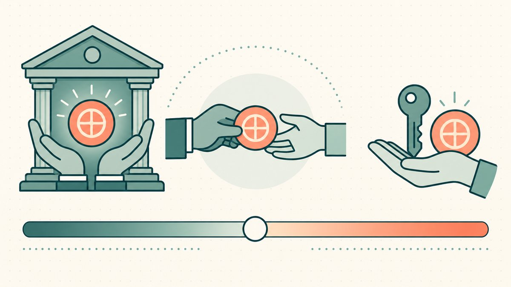
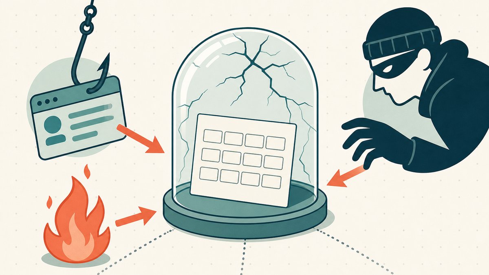
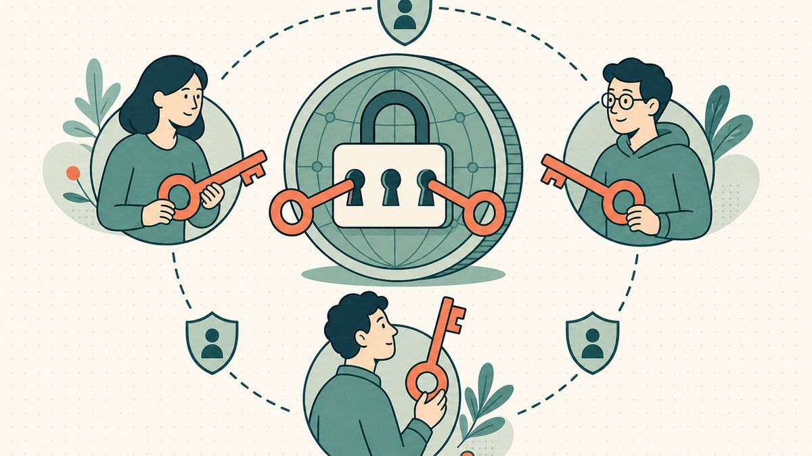

전통적인 도메인을 플리핑할 때는 커스터디가 다른 누군가의 문제입니다. 도메인 이름은 [레지스트라](/ko/glossary/registrar/) 계정에 보관되고, 비밀번호를 잊어버려도 재설정 링크와 고객 지원 대기열이 있습니다. 하지만 도메인을 [온체인](/ko/glossary/on-chain/)으로 이전하면 그 안전망은 사라집니다. 토큰 자체가 소유권 증서이며, [지갑](/ko/glossary/wallet/)의 키만이 당신과 자산 사이에 존재하는 유일한 보호막입니다. 이 변화는 전통적인 [애프터마켓](/ko/glossary/domain-trading/)에서 온체인 플리핑으로 전환하는 모든 사람에게 가장 크고 근본적인 사고방식의 전환입니다.

이 글은 [도메인 플리핑](/ko/blog/domain-flipping/) 시리즈의 커스터디 편입니다. 토큰화된 도메인에서 커스터디가 실제로 무엇을 의미하는지, 사람들이 접근권을 잃는 실제 경로, 이를 방지하는 지갑 설정 방법, 그리고 솔직히 말해 예방이 실패했을 때 복구가 어떻게 이루어지는지를 다룹니다. 온체인 도메인을 거래한다면, 이 내용을 배경 지식이 아닌 실무 운영 지침으로 받아들이시기 바랍니다.

## 도메인이 토큰이 된 이후 '커스터디'의 의미

[토큰화된 도메인](/ko/blog/what-are-tokenized-domains/)은 실제 [ICANN](/ko/glossary/icann/) 인증 도메인으로, 그 소유권이 [블록체인](/ko/glossary/blockchain/) 위에서 토큰 형태로도 표현됩니다. 일반적으로 [ERC-721](/ko/glossary/erc-721/) 표준을 따르는 [NFT](/ko/glossary/nft/)이며, 해당 규격 자체는 이를 [대체 불가능 토큰의 표준 인터페이스, 즉 소유권 증서로도 알려진](https://eips.ethereum.org/EIPS/eip-721#:~:text=A%20standard%20interface%20for%20non%2Dfungible%20tokens%2C%20also%20known%20as%20deeds) 것으로 정의합니다. '소유권 증서'라는 표현은 단순한 마케팅 용어가 아닙니다. 지갑에 토큰을 보유한 사람이 곧 그 도메인 이름을 소유하고 있는 것입니다.

이 점을 정확하게 이해하는 것이 중요합니다. 'Web3 도메인'이라고 불리는 것들이 커스터디와 해석 가능성 면에서 서로 매우 다른 특성을 가지고 있으며, 이를 혼동하면 잘못된 의사결정으로 이어지기 때문입니다.

- **토큰화된 ICANN 도메인** (Namefi 방식) — 모든 브라우저에서 정상적으로 접속되는 실제 `.com`, `.xyz`, `.io` 도메인으로, 레지스트리 수준의 소유권을 반영하는 온체인 토큰과 연동됩니다. 커스터디는 지갑이 담당하고, 해석은 일반 [DNS](/ko/blog/dns-on-tokenized-domains/)가 처리합니다.
- **[ENS](/ko/glossary/ens/) 이름** (`vitalik.eth`) — 이더리움 네이티브 이름으로, 완전히 온체인에서만 존재하며 리졸버나 브리지 없이는 일반 브라우저에서 접근할 수 없습니다.
- **Unstoppable 방식의 이름** (`.crypto`, `.x`) — ICANN 루트 외부에 있는 블록체인 네이티브 네임스페이스로, 지갑이나 익스텐션 수준의 해석이 필요합니다.

세 가지 모두 커스터디 측면에서는 유사합니다: [프라이빗 키](/ko/glossary/private-key/)가 자산을 통제합니다. 그러나 오직 토큰화된 ICANN 도메인만이 오프체인 레지스트리 기록을 함께 가지며, 바로 이 두 번째 레이어가 일부 복구 경로를 가능하게 합니다. 이 차이점은 [토큰화된 도메인 vs Web3 도메인](/ko/blog/tokenized-domain-vs-web3-domain/)에서 자세히 다룹니다. 플리핑 관점에서 이는 일반 구매자 누구에게나 판매할 수 있는 도메인과 크립토에 익숙한 구매자에게만 판매 가능한 도메인의 차이입니다.

## 커스터디 스펙트럼: 위탁 보관에서 완전한 자기 관리까지

커스터디는 스위치가 아닌 스펙트럼입니다. 한쪽 끝에는 [**위탁 보관(custodial ownership)**](/ko/glossary/custodial-ownership/)이 있습니다. 플랫폼이나 거래소가 키를 보유하고, 사용자는 계정 로그인만 가집니다. 편리하고 지원팀에 의한 복구가 가능하지만, 크립토가 극복하고자 했던 신뢰 모델 그 자체입니다. 반대쪽 끝은 완전한 자기 보관(full self-custody)으로, 키는 오직 사용자만 가지며, 누구도 자산을 동결하거나 압류할 수 없고, 그 누구도 도움을 줄 수 없습니다.

진지한 온체인 플리퍼 대부분은 중간 어딘가에 위치하며, 결정적으로 *도메인의 가치와 거래 빈도에 따라 커스터디 모델을 맞춥니다*. 적극적으로 [마켓플레이스](/ko/glossary/marketplace/)에 올려둔 소액 도메인은 매일 서명하는 핫 월렛에 보관해도 됩니다. 반면 수십만 원을 넘는 도메인을 장기 보유할 계획이라면 콜드 스토리지나 [멀티시그](/ko/glossary/multi-sig/) 외에 다른 선택지는 없습니다. 가장 흔한 실수는 두 경우를 동일하게 다루는 것, 즉 무작위 NFT를 발행하는 데도 쓰는 MetaMask 하나에 모든 것을 넣어두는 것입니다.

## 키는 실제로 어디에 있는가

[암호화폐 지갑](https://en.wikipedia.org/wiki/Cryptocurrency_wallet)은 도메인을 '저장'하지 않습니다. 지갑이 저장하는 것은 키입니다. 위키피디아의 설명처럼, [프라이빗 키는 소유자가 암호화폐에 접근하고 전송하는 데 사용되며, 소유자만 알고 있는 정보입니다](https://en.wikipedia.org/wiki/Cryptocurrency_wallet#:~:text=The%20private%20key%20is%20used%20by%20the%20owner%20to%20access%20and%20send%20cryptocurrency%20and%20is%20private%20to%20the%20owner). 동일한 키가 도메인 NFT 이전도 승인합니다. 도메인 트레이더를 위한 실용적인 분류:

- **핫 월렛** (MetaMask, Rabby) — 인터넷에 연결된 소프트웨어 지갑. 서명과 활성 목록 관리에 적합하지만, 악성 소프트웨어, 피싱, 악의적인 서명 요청에 노출됩니다. 이건 거래용 지갑이지 금고가 아닙니다.
- **[하드웨어 지갑](/ko/glossary/hardware-wallet/)** (Ledger, Trezor, Keystone, GridPlus) — 전용 기기에 오프라인으로 키를 보관하고 서명합니다. 이번 주 플리핑이 아닌 보유 중인 도메인의 올바른 보관 장소입니다. [민팅](/ko/glossary/minting/) 후 NFT를 이곳으로 이전하세요.
- **[스마트 컨트랙트](/ko/glossary/smart-contract/) 지갑** (멀티시그, 소셜 리커버리) — 단일 비밀값 대신 온체인 로직이 키를 관리합니다. 아래에서 자세히 설명합니다.

이들 대부분의 기반에는 **[시드 구문](/ko/glossary/seed-phrase/)**이 있습니다. [BIP-39 규격](https://github.com/bitcoin/bips/blob/master/bip-0039.mediawiki#:~:text=This%20BIP%20describes%20the%20implementation%20of%20a%20mnemonic%20code%20or%20mnemonic%20sentence%20%2D%2D%20a%20group%20of%20easy%20to%20remember%20words%20%2D%2D%20for%20the%20generation%20of%20deterministic%20wallets)이 정의한 12 또는 24개의 단어로, 결정론적 지갑을 생성하기 위한 니모닉입니다. 이 구문은 지갑이 보유한 모든 키를 재생성합니다. 위키피디아에 따르면, [지갑을 분실하거나 손상되거나 해킹당했을 경우, 시드 구문을 사용해 지갑과 연결된 키 및 암호화폐에 다시 접근할 수 있습니다](https://en.wikipedia.org/wiki/Cryptocurrency_wallet#:~:text=the%20seed%20phrase%20can%20be%20used%20to%20re%2Daccess%20the%20wallet%20and%20associated%20keys). 바로 그렇기 때문에 이 구문은 당신이 기록하게 될 가장 위험한 단어 목록이기도 합니다.

## 시드 구문 위험이 모든 것의 핵심

온체인에서 발생하는 거의 모든 치명적인 손실은 두 가지 시드 구문 실패 중 하나로 귀결되며, 이 둘은 정반대 방향으로 작용합니다.

1. **시드가 한 곳에만 보관되었고, 그 장소가 사라졌습니다.** 휴대폰 초기화, 화재, 노트북 분실. 재설정 링크는 없습니다. 단어의 유일한 사본이 사라지면, 도메인도 사라집니다.
2. **시드가 다른 누군가가 읽을 수 있는 곳에 보관되었습니다.** 클라우드 메모, 클라우드 동기화 비밀번호 관리자, 카메라 롤의 사진, 채팅 스크린샷, LLM에 붙여 넣기. 그 단어들을 읽은 사람은 누구든 지갑이 통제하는 모든 것을 즉시, 돌이킬 수 없이 소유하게 됩니다.

방어적 자세는 평범하지만 협상 불가능합니다. 단어를 종이에 두 번 써서 두 군데 물리적 장소에 보관하세요. 가치 있는 자산이라면 불과 물에도 견디는 스틸 백업 플레이트를 사용하세요. 실제 시드 구문이 인터넷에 연결된 표면에 닿지 않도록 하세요. 경험 많은 플리퍼들이 갱신에 적용하는 것과 동일한 원칙입니다. 필요하기 전에 미리 드는 저렴한 보험, 하지만 손실이 발생하면 전부를 잃는 그런 보험입니다.

## 멀티시그와 소셜 리커버리: 단일 실패 지점 제거

단일 시드 구문은 단일 실패 지점입니다. 구조적 해결책은 자산을 이전하기 위해 *하나 이상의* 키를 요구하는 것입니다.

[**멀티시그 지갑**](/ko/glossary/multi-sig/)은 EVM 체인에서 주로 [Safe](https://safe.global/) (이전 Gnosis Safe)로 구현되며, 이전을 실행하기 전에 N개 키 중 M개의 서명이 필요합니다. 하드웨어 지갑, 공동 서명자, 봉인된 오프라인 백업에 걸쳐 2-of-3 구성을 사용하면, 키 하나를 잃어도 도메인을 잃지 않으며, 단일 피싱 서명으로 모든 것을 빼앗기지도 않습니다. 암호학에도 동일한 개념이 존재합니다. [RFC 9591](https://www.rfc-editor.org/rfc/rfc9591#:~:text=FROST%20signatures%20can%20be%20issued%20after%20a%20threshold%20number%20of%20entities%20cooperate%20to%20compute%20a%20signature)에 표준화된 FROST와 같은 임계값 서명 방식은, 어떤 단일 참여자도 전체 키를 보유하지 않은 상태에서 [여러 엔티티가 협력해 서명을 계산](https://www.rfc-editor.org/rfc/rfc9591#:~:text=FROST%20signatures%20can%20be%20issued%20after%20a%20threshold%20number%20of%20entities%20cooperate%20to%20compute%20a%20signature)할 수 있게 합니다.

그러나 멀티시그는 마법의 단어가 아닙니다. 그렇게 여기는 것이 바로 대형 손실로 이어지는 방식입니다. 멀티시그는 단일 키 해킹과 내부자 위험을 막아주지만, 손상된 서명 UI나 여러 서명자를 같은 날 속이는 조직적인 피싱에는 *아무 효과가 없습니다*. '독립적인' 키 세 개가 모두 같은 아파트에서 혼자 통제하는 기기에 있다면, 멀티시그의 부담만 있고 단일 키의 위협 모델을 그대로 가진 셈입니다. 보호가 실질적으로 작동하는 경우와 그렇지 않은 경우를 [멀티시그 지갑이 실제로 보안을 개선하는가?](/ko/blog/do-multisig-wallets-actually-improve-security/)에서 자세히 분석합니다. 가치 있는 도메인을 맡기기 전에 필독 자료입니다.

공동 서명자 조율을 원하지 않는 개인 플리퍼에게는 **소셜 리커버리 지갑** (Argent, 복구 모듈이 있는 Safe, ERC-4337 스마트 어카운트)이 대안입니다. 키를 잃었을 때 집합적으로 접근을 복원할 수 있는 보호자를 지정할 수 있습니다. 멀티시그보다 사용하기 쉽지만, 더 많은 스마트 컨트랙트 코드와 실제로 존재하고 응답할 보호자 집합에 대한 신뢰가 필요합니다.

트레이딩 포트폴리오를 위한 실용적 규칙: 적극적으로 목록에 올린 도메인에는 소형 핫 월렛을 사용하고, 보유 중인 인벤토리에는 멀티시그나 하드웨어 기반 콜드 월렛을 사용하세요. 모든 빠른 판매에 세 명의 서명자가 필요하게 만들지 말고, 의심스러운 민팅마다 연결하는 지갑에 최고의 도메인을 두지 마세요.

## 복구: 접근권을 잃었을 때 실제로 무슨 일이 일어나는가

예방이 진정한 복구 전략이지만, 손실은 일어납니다. 가능한 것이 무엇인지는 전적으로 *어떻게* 접근권을 잃었는지에 달려 있습니다. 요약:

- **비밀번호를 잃었지만 시드가 있는 경우** — 실질적으로 손실이 아닙니다. 재설치 후 시드로 복원하면 됩니다.
- **기기를 잃었지만 시드가 있는 경우** — 새 기기에서 시드로 복원하면 됩니다.
- **기기는 있지만 시드를 잃은 경우** — 기기가 아직 작동하는 지금 당장 NFT를 제대로 백업된 새 지갑으로 이전하세요.
- **기기와 시드 모두 잃은 경우** — 가장 어려운 경우입니다. 암호학적으로 토큰에 접근할 수 없으며, 아무도 프라이빗 키를 무차별 대입으로 뚫을 수 없습니다. 그게 가능하다고 주장하는 사람은 사기꾼입니다.

마지막 경우가 바로 토큰화된 ICANN 도메인이 순수 온체인 이름과 차별화되는 지점입니다. 기반 자산이 실제 등록된 도메인이기 때문에, 오프체인 실마리가 있습니다. [등록자(registrant)](/ko/glossary/registrant/) 기록에 연결된 플랫폼 측 신원, 그리고 [WHOIS](/ko/glossary/whois/) 이력, 결제 기록, 정부 신분증으로 뒷받침되는 레지스트라 수준의 소유권 이의 신청 경로가 존재합니다. 이 경로들은 느리고, 서류 작업이 많으며, 신원 확인이 필요하고, 결코 보장되지 않습니다. 하지만 존재한다는 것 자체가, 분실된 `.eth` 키보다 훨씬 나은 상황입니다. **도난**은 분실과는 다른 문제입니다. 온체인 이동 경로를 증거로 추적하고, 플랫폼과 마켓플레이스에 도난 토큰을 신고하여 플래그를 달고, 법 집행 기관에 신고하세요. 도난된 토큰화 도메인은 도난된 등록 자산이기도 하기 때문입니다.

전체 대응 플레이북 — 모든 손실 시나리오, 행동 순서, 그리고 플랫폼이 실제로 할 수 있는 것과 없는 것 — 은 [지갑 분실 후 토큰화된 도메인 복구](/ko/blog/recovering-a-tokenized-domain-after-wallet-loss/)에 있습니다. 한 줄 요약: 빠르게 행동하고, 증거를 보존하며, 실제 ICANN 도메인에 대한 문이 영구적으로 닫혔다고 가정하지 마세요.

## 커스터디가 갱신 시계를 멈추지는 않습니다

온체인 도메인을 처음 접하는 플리퍼가 자주 빠지는 함정: 키를 완벽하게 보호해도 *등록*은 아무 관계가 없습니다. 토큰화된 도메인은 여전히 갱신 일정이 있는 실제 도메인이며, 토큰은 그 상태를 반영할 뿐 무효화하지 않습니다. 등록을 실효시키면 완벽하게 자기 보관된 도메인도 만료될 수 있습니다.

온체인 네이티브 네임스페이스도 마찬가지입니다. 예를 들어 ENS의 `.eth` 이름은 연간 임대 방식입니다. ENS에 따르면 [5글자 이상의 `.eth` 이름은 연간 5 USD](https://docs.ens.domains/registry/eth/#:~:text=letter%20%60.eth%60%20will%20cost%20you%20%605%20USD%60%20per%20year)이며, 만료 후에는 [90일의 유예 기간이 주어집니다. 이 기간 동안 표준 가격으로 연장할 수 있으며, 다른 사람은 등록할 수 없습니다](https://support.ens.domains/en/articles/8046905-what-is-a-grace-period#:~:text=After%20a%20.eth%20name%20expires%20you%20have%20a%2090%2Dday%20Grace%20Period). 토큰화된 ICANN 도메인은 해당 TLD의 표준 레지스트리 갱신 유예 기간을 따릅니다. 어느 쪽이든 커스터디와 갱신은 별개의 영역입니다. 키를 보유하는 것이 도메인 이름을 유지하는 것을 의미하지 않습니다. [DNS](/ko/blog/dns-on-tokenized-domains/)와 갱신을 건전하게 유지하는 것은 모든 [도메인 플리핑](/ko/blog/domain-flipping/) 운영이 생사를 걸고 실천해야 하는 포트폴리오 위생의 일부입니다.

## Namefi의 관점

커스터디는 플리퍼에게 토큰화가 진가를 발휘하는 바로 그 지점입니다. [Namefi](https://namefi.io)로 토큰화된 도메인은 지갑에 소유권이 있는 실제 ICANN 도메인이기 때문에, 자금을 보호하듯 멀티시그나 하드웨어 지갑에 정확히 같은 방식으로 보관할 수 있습니다. 자금을 지키는 것과 동일한 임계값 방식이 이제 DNS 제어 플레인도 지키므로, 피싱 당한 개인 한 명 때문에 회사의 핵심 `.com`을 잃을 일이 없습니다. 그리고 아래에 레지스트리 기록이 여전히 존재하기 때문에, 복구 가능성도 순수 온체인 이름보다 낫습니다. 자기 보관에 실패했을 때도 따라갈 수 있는 오프체인 신원 실마리가 있기 때문입니다. 거래를 위해 [도메인을 토큰화](/ko/blog/why-tokenize-domains/)하는 이유는 단순히 빠른 결제만이 아닙니다. 도메인의 가치에 맞는 커스터디 모델을 마침내 선택할 수 있기 때문입니다. 신중하게 선택하고, 도메인이 중요해지기 *전에* 설정하세요.

## 친절한 면책 고지 (꼭 읽어주세요!)

> 저희는 변호사, 회계사, 금융 어드바이저, 의사가 아니며, **이 글의 어떤 내용도 법률, 금융, 세금, 회계, 의학 또는 기타 전문적인 조언이 아닙니다.** 이 포스트는 자체 학습과 고객 편의를 위해 작성되었습니다. 여기의 정보는 오래되었거나, 특정 지역에만 해당되거나, 혹은 단순히 틀렸을 수 있습니다. 저희도 실수를 합니다.
>
> 중요한 결정을 내리기 전에 **반드시 전문가와 상담하세요 (진심으로!)**. 또는 그게 내키지 않는다면, 친구에게, Twitter에, Reddit에, AI에, 혹은 점쟁이에게 물어보세요. 한마디로: **DOYR - Do Your Own Research**. 함께 배우고 즐겁게 임합시다.

## 출처 및 추가 자료

- Ethereum — [ERC-721 대체 불가능 토큰 표준 ("대체 불가능 토큰의 표준 인터페이스, 소유권 증서로도 알려진")](https://eips.ethereum.org/EIPS/eip-721#:~:text=A%20standard%20interface%20for%20non%2Dfungible%20tokens%2C%20also%20known%20as%20deeds)
- Wikipedia — [암호화폐 지갑 (프라이빗 키 제어; 시드 구문 복구)](https://en.wikipedia.org/wiki/Cryptocurrency_wallet#:~:text=The%20private%20key%20is%20used%20by%20the%20owner%20to%20access%20and%20send%20cryptocurrency%20and%20is%20private%20to%20the%20owner)
- Bitcoin BIPs — [BIP-39 결정론적 지갑을 위한 니모닉 코드](https://github.com/bitcoin/bips/blob/master/bip-0039.mediawiki#:~:text=This%20BIP%20describes%20the%20implementation%20of%20a%20mnemonic%20code%20or%20mnemonic%20sentence%20%2D%2D%20a%20group%20of%20easy%20to%20remember%20words%20%2D%2D%20for%20the%20generation%20of%20deterministic%20wallets)
- IETF — [RFC 9591: FROST 임계값 서명](https://www.rfc-editor.org/rfc/rfc9591#:~:text=FROST%20signatures%20can%20be%20issued%20after%20a%20threshold%20number%20of%20entities%20cooperate%20to%20compute%20a%20signature)
- Safe — [스마트 어카운트 / 멀티시그 인프라](https://safe.global/)
- ENS Docs — [.eth 등록 가격 (5글자 이상 연간 5 USD)](https://docs.ens.domains/registry/eth/#:~:text=letter%20%60.eth%60%20will%20cost%20you%20%605%20USD%60%20per%20year)
- ENS Support — [유예 기간이란 무엇인가? (만료 후 90일 윈도우)](https://support.ens.domains/en/articles/8046905-what-is-a-grace-period#:~:text=After%20a%20.eth%20name%20expires%20you%20have%20a%2090%2Dday%20Grace%20Period)
