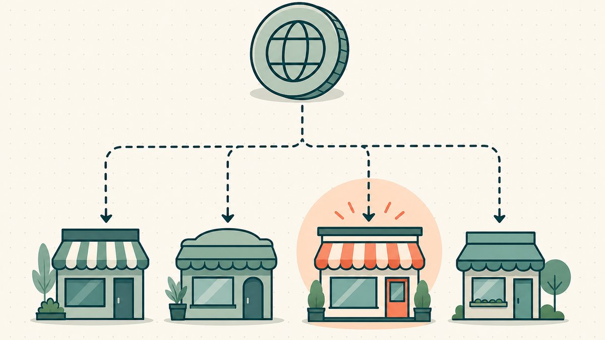

[토큰화 도메인](/ko/blog/what-are-tokenized-domains/)을 플리핑한다면 — 실제 ICANN 도메인에 [온체인](/ko/glossary/on-chain/) 소유권 토큰을 얹은 것 — 기존 도메인 시장에서는 누릴 수 없었던 선택지가 생깁니다. 일반 암호화폐 마켓플레이스에 [NFT](/ko/glossary/nft/)로 등록하거나, 제3자 수탁 없이 [Seaport](/ko/glossary/smart-contract/) 기반 플랫폼을 통해 판매하거나, 이 자산을 위해 특별히 설계된 도메인 전용 플랫폼을 활용할 수 있습니다. 어떤 경로를 택하든 동일한 토큰이 이동하지만, 수수료·도달 범위·수탁 방식이 서로 달라서 잘못 선택하면 구매자를 놓치거나 마진의 일부를 날릴 수 있습니다.

이 가이드는 온체인 플랫폼의 세 가지 유형 — OpenSea 같은 일반 NFT 마켓플레이스, Seaport 기반 및 무수수료 마켓플레이스, [Namefi](https://namefi.io)를 포함한 도메인 전용 플랫폼 — 을 실제 플리핑에서 중요한 네 가지 기준, 즉 수수료·도달 범위·수탁 방식·각 플랫폼에 맞는 거래 유형으로 비교합니다. Namefi는 여러 선택지 중 하나일 뿐, 유일한 정답이 아닙니다. 목적은 거래에 가장 적합한 플랫폼을 찾도록 돕는 것입니다.

토큰으로서 도메인을 판매하는 것이 처음이라면 [도메인 NFT 판매](/ko/blog/selling-domains-as-nfts/)와 [온체인 도메인 플리핑](/ko/blog/onchain-domain-flipping/) 클러스터 글부터 읽어보세요. 이 글은 이미 토큰화 도메인을 보유하고 어디서 팔지 결정하는 단계를 전제로 합니다.

## 온체인에서 플랫폼 선택이 더 중요한 이유

기존 [애프터마켓](/ko/glossary/domain-trading/)에서 마켓플레이스는 주로 리스팅 게시판과 [에스크로](/ko/blog/domain-escrow-explained/) 창구 역할을 합니다. 레지스트라 담당자가 수동으로 이전을 처리할 때까지 도메인은 움직이지 않고, 그 사이 중립적인 제3자가 대금을 보관합니다. 온체인에서 마켓플레이스는 결제 레이어에 가깝습니다. 스마트 컨트랙트 자체가 단일 트랜잭션으로 토큰과 대금을 교환할 수 있으므로, 에스크로가 해결하던 '누가 먼저 움직이나' 문제가 하나의 [원자적 이전](/ko/glossary/atomic-transfer/)으로 압축됩니다. 이 메커니즘은 [토큰화 마켓플레이스가 에스크로를 대체하는 방법](/ko/blog/how-tokenized-marketplaces-replace-escrow/)에서 자세히 설명합니다.

이러한 변화는 비교 기준 자체를 바꿉니다. 오프체인에서는 커미션율과 에스크로 신뢰도를 비교했지만, 온체인에서는 스마트 컨트랙트 모델, 플랫폼이 내 도메인을 [수탁](/ko/glossary/custodial-ownership/)하는지 여부, 그리고 실제 잠재 구매자가 그 플랫폼을 이용하는지까지 따져야 합니다. 핵심은 세 가지입니다. **수수료** (플랫폼과 창작자가 가져가는 몫), **도달 범위** (내 구매자가 해당 플랫폼에 있는지), **수탁** (거래 완료 순간까지 내 [지갑](/ko/glossary/wallet/)에 도메인을 보유하는지).

## OpenSea와 일반 NFT 마켓플레이스

OpenSea는 가장 규모가 큰 일반 NFT 마켓플레이스이기 때문에 기본 선택지로 꼽힙니다. [ERC-721](/ko/glossary/erc-721/) 토큰으로 발행된 대부분의 토큰화 도메인 — [비대체 토큰의 표준 인터페이스, 증서(deed)라고도 함](https://eips.ethereum.org/EIPS/eip-721#:~:text=A%20standard%20interface%20for%20non%2Dfungible%20tokens%2C%20also%20known%20as%20deeds) — 은 자동으로 OpenSea에 표시됩니다. Ethereum이나 Base에 도메인이 있다면 별도의 도메인 통합 없이도 대개 OpenSea에 리스팅할 수 있습니다.

수수료 측면에서 OpenSea는 현재 [NFT 판매 시 1% 수수료](https://support.opensea.io/en/articles/8867091-what-fees-do-i-pay-on-opensea#:~:text=1%25%20fee%20for%20selling%20NFTs)를 부과하며, 창작자 수익은 별도로 처리됩니다. OpenSea에서 [창작자 수익은 컬렉션에 따라 적용되거나 선택 사항](https://support.opensea.io/en/articles/8867091-what-fees-do-i-pay-on-opensea#:~:text=creator%20earnings%20are%20enforced%20or%20optional)입니다. 직접 발행한 도메인이라면 창작자 로열티를 고려할 필요가 없으므로 전체 비용은 낮은 편입니다.

강점은 도달 범위와 친숙도입니다. 이미 NFT를 거래하는 구매자라면 지갑이 연결되어 있고, 리스팅 흐름을 알며, 브랜드를 신뢰합니다. 약점은 일반 마켓플레이스가 내 도메인을 여느 JPEG와 똑같이 취급한다는 점입니다. [DNS](/ko/blog/dns-on-tokenized-domains/)에서 실제로 해석(resolve)되는지, 트래픽을 유발하는지, Web3 전용 문자열이 아닌 실제 `.com`인지 같은 도메인 고유 정보는 표시되지 않습니다. OpenSea를 스캔하는 도메인 투자자에게는 'X 조건을 만족하는 실제 ICANN 도메인'만을 필터링할 방법이 없습니다. OpenSea는 가장 넓은 그물이지만 맥락은 가장 얕습니다.

**적합한 경우:** 구매자가 암호화폐 네이티브이고 도메인 문자열만으로 가치가 분명한 유동성 높은 인지도 있는 도메인.

## Seaport 기반 및 무수수료 마켓플레이스

[Seaport](https://github.com/ProjectOpenSea/seaport#:~:text=Seaport%20is%20a%20marketplace%20protocol%20for%20safely%20and%20efficiently%20buying%20and%20selling%20NFTs)는 OpenSea의 기반이 되는 오픈소스 프로토콜로, 자체 저장소에서 [NFT를 안전하고 효율적으로 사고파는 마켓플레이스 프로토콜](https://github.com/ProjectOpenSea/seaport#:~:text=Seaport%20is%20a%20marketplace%20protocol%20for%20safely%20and%20efficiently%20buying%20and%20selling%20NFTs)로 설명됩니다. 공개 [스마트 컨트랙트](/ko/glossary/smart-contract/)이기 때문에 누구나 그 위에 마켓플레이스를 구축할 수 있으며, 이것이 'Seaport 기반'이 단일 사이트가 아니라 하나의 범주인 이유입니다. 공통점은 리스팅이 서명된 오퍼로서 컨트랙트에 의해 직접 체결된다는 것입니다. 도메인은 내 지갑에 남아 있고, 구매자의 대금과 내 토큰이 원자적으로 교환되며, 운영자가 자산을 수탁하는 일은 없습니다.

또 다른 주목할 유형은 무수수료 전문 트레이더 플랫폼입니다. 예를 들어 Blur는 기존 플랫폼에서 고빈도 트레이더를 유인하기 위해 [0%](https://blur.io/#:~:text=0%25) [마켓플레이스 수수료](https://blur.io/#:~:text=Marketplace%20fees)를 내세웁니다. 모든 베이시스 포인트를 최적화하는 플리퍼에게 무수수료 플랫폼은 매력적입니다. 단, 도달 범위가 함정입니다. 이 플랫폼들은 층이 깊고 대체 가능한 느낌의 아트·PFP 컬렉션에 최적화되어 있으며, 각 문자열이 별도 시장을 형성하는 일대일 도메인 이름에는 맞지 않습니다. 수수료를 아무것도 내지 않아도 적합한 구매자가 해당 플랫폼을 이용하지 않는다면 오랫동안 기다려야 할 수 있습니다.

수탁 구조는 이 계열의 진정한 강점입니다. 잘 설계된 Seaport 플로는 진정한 [원자적 이전](/ko/glossary/atomic-transfer/)이므로, 에스크로가 해소하던 상대방 위험이 대부분 사라집니다. 이는 [에스크로 설명](/ko/blog/how-tokenized-marketplaces-replace-escrow/)에서 다루는 오프체인 방식보다 의미 있는 개선입니다.

**적합한 경우:** 이미 구매자가 정해져 수수료를 최소화하고 싶은 판매자, 또는 자기 수탁과 원자적 체결을 원하지만 플랫폼이 수요를 창출해 줄 필요는 없는 판매자.

## Web3 네이티브 도메인 마켓플레이스에 관한 참고 사항

토큰화 ICANN 도메인과 Web3 네이티브 도메인은 서로 다른 곳에서 거래되므로 구분해 두는 것이 좋습니다. 두 가지는 쉽게 혼동됩니다. `vitalik.eth`와 같은 [ENS](/ko/glossary/ens/) 이름은 DNS 도메인이 아닙니다. ENS는 [Ethereum 블록체인 기반의 분산형·개방형·확장 가능한 네이밍 시스템](https://docs.ens.domains/learn/protocol#:~:text=a%20distributed%2C%20open%2C%20and%20extensible%20naming%20system%20based%20on%20the%20Ethereum%20blockchain)으로, `.eth` 이름은 ICANN 루트 밖에 존재합니다. 수수료 체계도 다릅니다. ENS는 `.eth` 등록을 길이 기준으로 책정하는데, 5자 이상 이름은 연간 약 [5 USD](https://docs.ens.domains/registry/eth#:~:text=5%20USD), 3자 이름은 연간 약 [$640](https://docs.ens.domains/registry/eth#:~:text=640)입니다.

ENS 및 유사 이름은 NFT로 거래될 수 있으며 OpenSea에서 토큰화 `.com` 옆에 나란히 놓일 수 있지만, `crypto.eth` 구매자와 `crypto.com` 구매자는 원하는 것이 다릅니다. 전자는 지갑 네이티브 정체성이고, 후자는 어디서나 해석 가능한 웹사이트 주소입니다. 전체 비교는 [ENS vs DNS 도메인 플리핑](/ko/blog/ens-vs-dns-domain-flipping/)과 플랫폼 수준 비교인 [ENS vs Unstoppable vs 토큰화 DNS](/ko/blog/ens-vs-unstoppable-vs-tokenized-dns/)에서 확인할 수 있습니다. 요약하면, 토큰화 ICANN 도메인을 ENS 이름처럼 가격 책정하거나 리스팅하지 말고, ENS 구매자가 내 구매자라고 가정하지 마세요.

## 도메인 전용 마켓플레이스 (Namefi 포함)

세 번째 유형은 토큰화된 실제 도메인을 위해 특별히 구축된 플랫폼입니다. 도메인을 범용 토큰으로 취급하는 대신, 도메인 전용 플랫폼은 그 아래 DNS 레이어를 이해합니다. 도메인이 실제로 해석되는지 표시하고, 거래 과정에서 DNS 연속성을 유지하여 실시간 사이트가 거래 중 중단되지 않도록 하며, 수집품이 아닌 실제 도메인을 찾는 구매자에게 리스팅을 노출합니다.

[Namefi](https://namefi.io)가 이 범주에 속합니다. Namefi는 DNS 레이어를 유지하면서 실제 ICANN 도메인을 Ethereum과 Base에서 NFT로 토큰화합니다. 즉, Namefi를 통해 판매된 도메인은 Seaport 거래와 동일한 원자적·에스크로 프리 메커니즘으로 [온체인](/ko/glossary/on-chain/) 체결될 수 있으면서, 일반 마켓플레이스가 제공할 수 없는 도메인 특유의 맥락도 갖춥니다. Namefi 토큰화 도메인은 표준 NFT이므로 OpenSea 등 다른 플랫폼에도 계속 리스팅할 수 있습니다. 하나의 플랫폼에 종속되는 것이 아니라 도메인 인식 옵션을 추가하는 것이며, 다른 선택지가 닫히는 것이 아닙니다. 처음부터 어디서 토큰화할지 선택 중이라면 [도메인 토큰화 플랫폼 선택 가이드](/ko/blog/choosing-a-domain-tokenization-platform/)에서 제공업체를 비교해 보세요.

단점은 도메인 전용 마켓플레이스가 OpenSea보다 역사가 짧고 규모가 작다는 것입니다. 모든 이용자가 더 적합한 도메인 구매자라 해도 절대적인 사용자 수는 적습니다. 그러나 구매자가 단순한 토큰이 아닌 실제로 해석되는 도메인을 받고 있다는 신뢰가 필요한 고가 도메인의 경우, 전문적인 맥락이 단순한 트래픽 수치보다 더 중요할 수 있습니다.

**적합한 경우:** DNS 연속성·구매자 신뢰·도메인 특화 표현이 중요한 실제 ICANN 도메인 — 일반적으로 고가 또는 실제 사용 중인 도메인.

## 거래에 맞는 플랫폼 선택하기

단 하나의 최적 마켓플레이스는 없습니다. 주어진 도메인에 가장 적합한 플랫폼이 있을 뿐입니다. 대략적인 의사 결정 가이드는 다음과 같습니다.

| 도메인 성격 | 권장 플랫폼 |
|---|---|
| 유동성 높은 암호화폐 인지도 있는 문자열, 구매자가 NFT 네이티브 | OpenSea — 가장 넓은 도달 범위, 낮은 1% 수수료 |
| 이미 구매자 확보, 무수수료 + 자기 수탁 원함 | Seaport 기반 또는 무수수료 플랫폼 — 원자적 체결 |
| 실제로 해석되는 ICANN 도메인, DNS 연속성과 신뢰가 중요 | Namefi 같은 도메인 전용 마켓플레이스 |
| ENS / Web3 네이티브 이름, DNS 도메인 아님 | ENS 인식 플랫폼 — 웹사이트가 아닌 정체성으로 가격 책정 |

더 깊은 핵심은 온체인에서는 동일한 토큰을 여러 플랫폼에 동시에 리스팅할 수 있다는 점입니다. 대부분의 플랫폼이 동일한 지갑과 동일한 ERC-721 컨트랙트를 읽기 때문입니다. 실용적인 플리퍼는 도달 범위를 위해 일반 마켓플레이스에 넓게 리스팅하고, 맥락과 신뢰가 필요한 고가 도메인은 도메인 전용 플랫폼을 통해 거래합니다. 수탁 모델 — 체결 시까지 자신의 [멀티시그](/ko/glossary/multi-sig/) 또는 단일 키 지갑에 도메인을 보유하는 것 — 은 모든 플랫폼에 걸쳐 적용됩니다. 이것이 자기 수탁 [마켓플레이스](/ko/glossary/marketplace/) 거래가 구식 에스크로 방식보다 나은 핵심 이유입니다. 자산 보호에 대한 자세한 내용은 [멀티시그 지갑이 실제로 보안을 개선하는가](/ko/blog/do-multisig-wallets-actually-improve-security/)와 [지갑 분실 후 토큰화 도메인 복구](/ko/blog/recovering-a-tokenized-domain-after-wallet-loss/) 복구 플레이북을 참고하세요.

지금 손에 있는 도메인에 맞는 플랫폼을 선택하세요. 반대로 하지 마세요. 토큰은 어디서나 동일하지만, 구매자는 그렇지 않습니다.

## 면책 고지 (꼭 읽어보세요!)

> 저희는 변호사, 회계사, 재무 어드바이저, 의사가 아니며, **이 글의 어떤 내용도 법적, 재무적, 세무적, 회계적, 의료적 또는 기타 전문적 조언이 아닙니다.** 이 포스트는 자체 학습 목적과 고객을 위한 참고 자료로 작성된 것입니다. 내용이 최신 정보가 아닐 수 있고, 특정 지역에 한정되거나 단순히 틀릴 수도 있습니다. 저희도 실수를 합니다.
>
> 중요한 결정을 내릴 때는 **반드시 실제 전문가와 상담하세요 (진지하게!)**. 아니면 친구, Twitter, Reddit, AI, 또는 점쟁이에게 물어보세요. 요컨대 **DOYR - Do Your Own Research(스스로 조사하세요)**. 함께 배우고 즐겁게 진행합시다.

## 출처 및 추가 자료

- Ethereum Improvement Proposals — [ERC-721 비대체 토큰 표준 ("비대체 토큰의 표준 인터페이스, 증서(deed)라고도 함")](https://eips.ethereum.org/EIPS/eip-721#:~:text=A%20standard%20interface%20for%20non%2Dfungible%20tokens%2C%20also%20known%20as%20deeds)
- ProjectOpenSea/seaport (GitHub) — [Seaport는 NFT를 안전하고 효율적으로 사고파는 마켓플레이스 프로토콜입니다](https://github.com/ProjectOpenSea/seaport#:~:text=Seaport%20is%20a%20marketplace%20protocol%20for%20safely%20and%20efficiently%20buying%20and%20selling%20NFTs)
- OpenSea 고객센터 — [OpenSea에서 어떤 수수료를 납부하나요? (NFT 판매 시 1% 수수료; 창작자 수익은 적용되거나 선택 사항)](https://support.opensea.io/en/articles/8867091-what-fees-do-i-pay-on-opensea#:~:text=1%25%20fee%20for%20selling%20NFTs)
- Blur — [전문 트레이더를 위한 NFT 마켓플레이스 (0% 마켓플레이스 수수료)](https://blur.io/#:~:text=0%25)
- ENS 문서 — [ENS란 무엇인가? ("Ethereum 블록체인 기반의 분산형·개방형·확장 가능한 네이밍 시스템")](https://docs.ens.domains/learn/protocol#:~:text=a%20distributed%2C%20open%2C%20and%20extensible%20naming%20system%20based%20on%20the%20Ethereum%20blockchain)
- ENS 문서 — [.eth 레지스트라 가격 책정 (길이 기반 연간 수수료: 5자 이상 ~$5/년, 3자 ~$640/년)](https://docs.ens.domains/registry/eth#:~:text=5%20USD)
