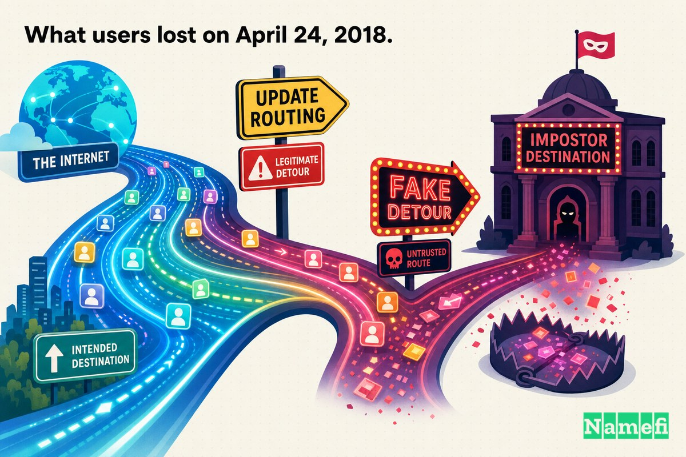
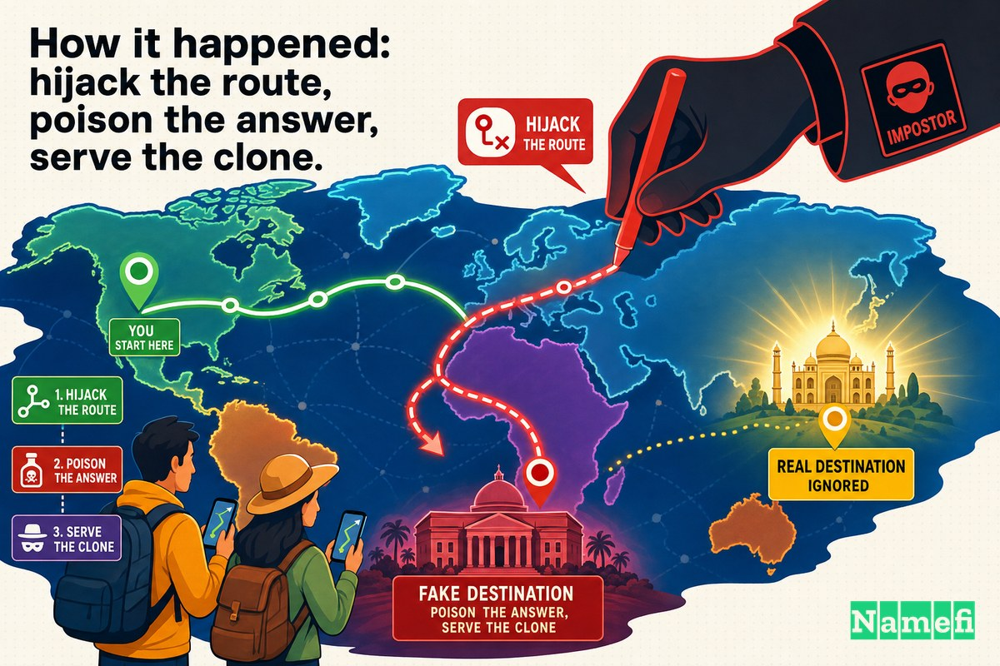
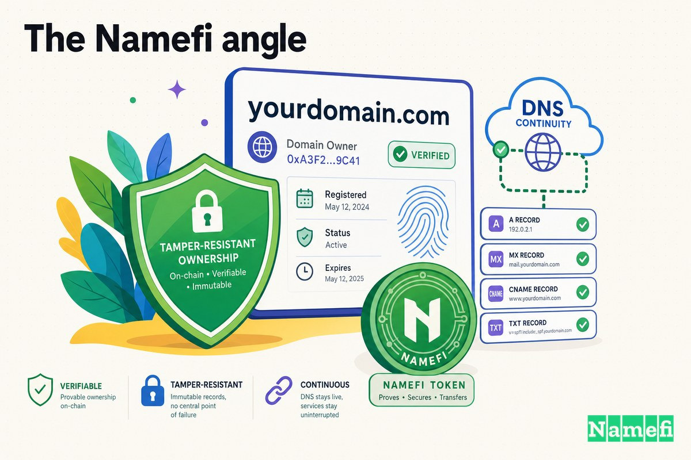

브라우저 주소창에 웹사이트 이름을 입력할 때, 우리는 눈에 보이지 않는 두 시스템이 정직하게 작동하리라 믿습니다.

첫 번째는 **DNS**입니다. 인터넷의 전화번호부라 불리는 이 시스템은 `myetherwallet.com` 같은 이름을 숫자로 된 [IP 주소](/ko/glossary/ip-address/)로 변환합니다. 두 번째는 **BGP**, 즉 경계 게이트웨이 프로토콜(Border Gateway Protocol)로, 패킷이 해당 주소에 도달하기까지 어떤 물리적 경로를 따를지 결정합니다. 이 두 시스템을 의식하는 사람은 거의 없습니다. 그냥 작동합니다. 하루에 수십억 번, 소리 없이.

**2018년 4월 24일** 아침, 두 시스템이 동시에 거짓말을 했습니다. 약 두 시간 동안, `myetherwallet.com`을 입력하고 브라우저 경고 하나를 그냥 넘긴 사람은 전혀 다른 서버에서 운영 중인 [피싱](/ko/glossary/phishing/) 클론 사이트로 연결되었습니다. 라우팅이 복구될 때쯤, 공격자들은 실제 사용자의 [지갑](/ko/glossary/wallet/)에서 **약 15만 달러 상당의 [이더리움](/ko/glossary/ethereum/)**을 빼돌린 뒤였습니다.

이 사건이 보안 교육의 영구적인 사례로 남아 있는 이유는 피해 금액 때문이 아닙니다. 이후 암호화폐 절도 사건들은 훨씬 큰 규모로 발생했습니다. 핵심은 *메커니즘*에 있습니다. 공격자들은 MyEtherWallet 서버에 침입하지 않았습니다. 비밀번호를 알아낸 것도 아닙니다. 그들은 건물이 아닌 **도로**를 공격했습니다. 인터넷의 라우팅 계층을 탈취해 DNS 자체를 오염시키는 방식으로.

## DNS는 기본적으로 신뢰를 전제하는 라우팅 계층 위에 얹혀 있습니다

무슨 일이 있었는지 이해하려면, 지구상 모든 도메인 이름 아래에 있는 불편한 토대를 먼저 이해해야 합니다.

DNS는 "`myetherwallet.com`의 IP 주소는 무엇인가?"라는 질문에 답합니다. 그런데 DNS 쿼리가 올바른 서버에 도달하려면, 인터넷의 라우터들이 *어느 네트워크*가 해당 DNS 서버의 IP 주소를 소유하는지 알아야 합니다. 이를 파악하기 위해 라우터들은 BGP에 의존합니다.

여기에 함정이 있습니다. BGP는 설계상 신뢰 기반 시스템입니다. Wikipedia의 Cloudflare 스타일 요약에 따르면, [기본적으로 BGP 프로토콜은 피어가 전송하는 모든 경로 공지를 신뢰하도록 설계되어 있습니다](https://en.wikipedia.org/wiki/BGP_hijacking#:~:text=by%20default%20the%20BGP%20protocol%20is%20designed%20to%20trust%20all%20route%20announcements%20sent%20by%20peers). 보안 연구자 Bob Cromwell은 원래의 설계 의도를 더 노골적으로 표현합니다. [BGP는 선의의 ISP와 대학들 사이의 신뢰 체계로 설계되었으며, 이들은 수신한 정보를 맹목적으로 믿었습니다](https://cromwell-intl.com/cybersecurity/bgp-hijacking.html#:~:text=BGP%20was%20designed%20to%20be%20a%20chain%20of%20trust).

다시 말해, 네트워크 운영자가 "이 IP 주소들로 향하는 트래픽은 나를 통해 오라"고 세상에 선언하면, 나머지 인터넷은 역사적으로 이를 그냥 믿었습니다. BGP에는 더 구체적인 경로를 우선시하는 타이브레이커가 내장되어 있습니다. 두 네트워크가 같은 주소를 주장할 경우, *더 좁고* 더 구체적인 블록을 공지하는 쪽이 이깁니다. 공격자가 당기는 레버가 바로 이 타이브레이커입니다.

따라서 도메인의 공격 표면은 [레지스트라](/ko/glossary/registrar/)보다, DNS 공급자보다, 웹 호스트보다 큽니다. DNS 쿼리를 올바른 곳으로 전달하는 전 세계 라우팅 구조 전체가 포함됩니다. MyEtherWallet은 이를 뼈저리게 경험했습니다.

## 2018년 4월 24일, 사용자들이 잃은 것

피해는 약 두 시간의 창에 집중되었습니다. The Register에 따르면, 악성 라우팅은 그날 [UTC 오전 11시에서 오후 1시 사이](https://www.theregister.com/2018/04/24/myetherwallet_dns_hijack/#:~:text=Between%2011am%20and%201pm%20UTC)에 운영되었습니다. 그 시간 동안 `myetherwallet.com`에 접속하려던 사용자 일부가 조용히 사칭 사이트로 연결되었습니다.

사칭 사이트는 설득력이 있었습니다. 거의 완벽한 클론이었기 때문에 MyEtherWallet처럼 보였습니다. 이를 드러낸 *유일한* 단서는 인증서 경고였는데, 결정적으로 사용자들은 그 경고를 그냥 클릭해 넘길 수 있었습니다. 그렇게 한 뒤 로그인한 사람들은 자신의 자금을 가져가는 열쇠를 넘겨준 것이었습니다. BleepingComputer가 보도한 것처럼, [로그인한 사람들의 지갑 개인 키가 탈취되었고, 공격자는 이를 이용해 계정을 비웠습니다](https://www.bleepingcomputer.com/news/security/hacker-hijacks-dns-server-of-myetherwallet-to-steal-160-000/#:~:text=Those%20who%20logged%20in%20had%20their%20wallet%20private%20keys%20stolen).

피해 집계는 매체마다 약간씩 다르지만 핵심 수치는 일관됩니다. BleepingComputer는 [거래 당시 215 이더, 약 16만 달러 상당](https://www.bleepingcomputer.com/news/security/hacker-hijacks-dns-server-of-myetherwallet-to-steal-160-000/#:~:text=215%20Ether%2C%20the%20equivalent%20of%20%24160%2C000)이라고 보도했습니다. CyberScoop은 [약 15만 2천 달러에 해당하는 215 이더](https://cyberscoop.com/ether-dns-bgp-amazon-route-53-heist/#:~:text=215%20Ether%2C%20amounting%20to%20about%20%24152%2C000)를 탈취했다고 전했습니다. Help Net Security는 [약 15만 달러 상당의 이더리움](https://www.helpnetsecurity.com/2018/04/25/myetherwallet-dns-hijacking/#:~:text=approximately%20%24150%2C000%20in%20Ethereum)을 빼앗겼다고 정리했습니다. 같은 215 ETH이며, 달러 금액은 절도 당시 환율에 따라 달라집니다.

이것이 암호화폐 지갑에 대한 라우팅+DNS 공격의 냉혹한 경제학입니다. 사기 환불 부서도, 이의 신청도, 전화할 은행도 없습니다. 개인 키가 공격자의 클론 사이트에 입력되고 자금이 [온체인](/ko/glossary/on-chain/)으로 이동하면, 그걸로 끝입니다.

## 어떻게 일어났는가: 경로 탈취, 응답 오염, 클론 제공

이 공격은 두 가지 실패를 연쇄시켰습니다. 각각 단독으로는 효과가 없었습니다. 하지만 결합하면 치명적이었습니다.

**1단계: Amazon DNS 서버로의 경로 탈취.** MyEtherWallet은 Amazon의 관리형 DNS 서비스를 사용했습니다. Help Net Security가 명확히 밝혔듯, [MyEtherWallet.com은 Amazon의 Route 53 DNS 서비스를 사용합니다](https://www.helpnetsecurity.com/2018/04/25/myetherwallet-dns-hijacking/#:~:text=MyEtherWallet.com%20uses%20Amazon%27s%20Route%2053%20DNS%20service). 공격자들은 Route 53에 침입하지 않았습니다. 대신, The Register에 따르면, [누군가가 인터넷의 핵심 라우터들에게 BGP — 경계 게이트웨이 프로토콜 — 메시지를 전송해, AWS 서버 일부로 향하는 트래픽을 불량 서버로 보내도록 설득했습니다](https://www.theregister.com/2018/04/24/myetherwallet_dns_hijack/#:~:text=someone%20was%20able%20to%20send%20BGP).

이를 실행한 공지는 예상치 못한 곳에서 나왔습니다. The Register는 [오하이오주 웹 호스팅 업체 eNet 소속의 네트워크 블록 AS10297이 AWS IP 주소 일부를 담당하겠다고 공지했다](https://www.theregister.com/2018/04/24/myetherwallet_dns_hijack/#:~:text=the%20network%20block%20AS10297%2C%20belonging%20to%20Ohio-based%20website%20hosting%20biz%20eNet)고 보도했습니다. BGP가 더 구체적인 경로를 선호하고 피어를 신뢰하기 때문에, 허위 공지가 전파되었습니다. Wikipedia는 그 규모를 기록합니다: [Amazon Route 53 전용 Amazon Web Services 공간 내 약 1,300개의 IP 주소가 오하이오주 콜럼버스의 ISP인 eNet(또는 그 고객)에 의해 탈취되었습니다. Hurricane Electric 등 여러 피어링 파트너가 이 공지를 맹목적으로 전파했습니다](https://en.wikipedia.org/wiki/BGP_hijacking#:~:text=Roughly%201300%20IP%20addresses%20within%20Amazon%20Web%20Services%20space). "맹목적으로 전파했다"는 표현이 BGP 신뢰 모델의 전부를 두 단어로 담아냅니다.

**2단계: DNS 서버를 사칭하고 거짓말하기.** 경로가 탈취된 후, 원래 Amazon의 실제 DNS 서버로 가야 할 쿼리가 공격자의 서버로 떨어졌습니다. 그 서버는 Route 53을 사칭했습니다. The Register는 결과를 이렇게 설명합니다: [그 불량 서버는 AWS의 DNS 서비스인 척하며, MyEtherWallet.com에 대한 잘못된 IP 주소를 제공해 일부 불운한 방문자들을 피싱 사이트로 연결했습니다](https://www.theregister.com/2018/04/24/myetherwallet_dns_hijack/#:~:text=That%20rogue%20machine%20then%20acted%20as%20AWS%27s%20DNS%20service). Kentik의 분석은 같은 사실을 DNS 측면에서 설명합니다: [사칭 권위 DNS 서버가 myetherwallet.com에 대한 허위 응답을 반환해 사용자들을 MyEtherWallet 사이트의 사칭 버전으로 유도했습니다](https://www.kentik.com/blog/bgp-hijacks-targeting-cryptocurrency-services/#:~:text=The%20imposter%20authoritative%20DNS%20server%20returned%20bogus%20responses%20for%20myetherwallet.com).

**3단계: 러시아에서 피싱 클론 제공.** 오염된 DNS 응답은 사용자들을 러시아에 있는 서버, 즉 가짜 지갑을 호스팅하는 서버로 향하게 했습니다. Help Net Security는 공격자들이 탈취를 이용해 [MyEtherWallet.com으로 향하는 트래픽을 러시아 서버에 호스팅된 유사 피싱 사이트로 리디렉션했다](https://www.helpnetsecurity.com/2018/04/25/myetherwallet-dns-hijacking/#:~:text=they%20redirect%20traffic%20meant%20for%20MyEtherWallet.com%20to%20the%20lookalike%20phishing%20site%2C%20hosted%20on%20a%20server%20in%20Russia)고 보도했습니다.

**거의 효과가 있었던 유일한 보호 장치: 인증서.** 모든 독자가 곱씹어야 할 부분입니다. 공격자들은 도메인의 *해석*과 *서버*를 통제했지만, 신뢰할 수 있는 기관에서 발급한 유효한 TLS 인증서를 `myetherwallet.com`용으로 만들어낼 수는 없었습니다. 그래서 브라우저는 정확히 해야 할 일을 했습니다. 경고를 띄웠습니다. Help Net Security는 이를 정확히 묘사합니다: [피싱 사이트가 아닌 척하고 있지 않다는 유일한 단서는, 방문자에게 해당 사이트의 TLS 인증서가 알 수 없는 기관에 의해 서명되었다는(즉, 자체 서명되었다는) 경고를 표시했다는 것이었습니다](https://www.helpnetsecurity.com/2018/04/25/myetherwallet-dns-hijacking/#:~:text=the%20only%20thing%20that%20gave%20some%20indication). BleepingComputer도 주의 깊게 보면 명백한 단서였다고 동의합니다: [공격자들이 자체 서명 TLS 인증서를 사용했기 때문에 가짜 웹사이트는 모든 최신 브라우저에서 오류를 유발해 쉽게 알아볼 수 있었습니다](https://www.bleepingcomputer.com/news/security/hacker-hijacks-dns-server-of-myetherwallet-to-steal-160-000/#:~:text=The%20fake%20website%20was%20easy%20to%20spot).

하지만 "쉽게 알아볼 수 있다"는 것은 사용자가 멈춘다는 전제 하에서입니다. ESET의 WeLiveSecurity는 보호 장치가 얼마나 얇은 것이었는지 포착했습니다: [일반 사용자가 알아차릴 수 있는 유일한 명백한 단서는, 가짜 MyEtherWallet 사이트를 방문했을 때 신뢰할 수 없는 SSL 인증서를 사용하고 있다는 오류 메시지가 표시된다는 것이었습니다](https://www.welivesecurity.com/2018/04/25/ethereum-cryptocurrency-wallets-raided/#:~:text=The%20only%20obvious%20clue%20that%20a%20typical%20user%20might%20have%20spotted). 브라우저는 손을 들고 *이건 잘못됐다*고 말했습니다. 돈을 잃은 사용자들은 그 경고를 그냥 클릭해 넘긴 사람들이었으며, 피해자들은 [가짜 MyEtherWallet.com이 신뢰할 수 없는 TLS/SSL 인증서를 사용하고 있었기 때문에 HTTPS 오류 메시지를 클릭해 넘겨야 했습니다](https://www.theregister.com/2018/04/24/myetherwallet_dns_hijack/#:~:text=Victims%20had%20to%20click%20through%20a%20HTTPS%20error%20message).

## 대응과 후폭풍

라우팅을 전문적으로 모니터링하는 사람들에게 이 탈취는 눈에 뜨이는 사건이었습니다. 네트워킹 모니터들은 허위의, 더 구체적인 프리픽스가 동일한 두 시간 창 안에 나타났다 사라지는 것을 목격했고, 불량 공지가 철회되자 Route 53으로의 정상 라우팅이 복구되었습니다.

MyEtherWallet 자체는 자사 인프라가 침해되지 않았다고 강조했습니다. 회사가 직후에 밝혔듯, 문제는 인터넷의 배관이지 애플리케이션이 아니었습니다. 이는 MEW 서버나 코드의 침해가 아닌, BGP를 통해 달성된 해석 경로에 대한 [DNS 하이재킹](https://www.helpnetsecurity.com/2018/04/25/myetherwallet-dns-hijacking/#:~:text=DNS%20hijacking)이었습니다.

근본적인 해결책은 라우팅 계층에 도달했습니다. 이 사건은 **RPKI**(Resource Public Key Infrastructure)와 **ROA**(Route Origin Authorization)를 위한 가장 많이 인용되는 논거 중 하나가 되었습니다. 이는 네트워크가 어느 자율 시스템이 어느 IP 프리픽스를 공지할 *권한*이 있는지 검증 가능한 방식으로 선언할 수 있는 암호화 기록입니다. 유효한 ROA가 있다면, 오하이오 ISP의 "Amazon 주소를 내가 처리하겠다"는 불량 공지는 **RPKI-무효**로 표시되어 [맹목적으로 전파](https://en.wikipedia.org/wiki/BGP_hijacking#:~:text=blindly%20propagated%20the%20announcements)되는 대신 폐기될 수 있습니다. Kentik은 직접적인 결과를 언급합니다: 동일한 공지가 오늘날 적절히 서명된 프리픽스를 대상으로 이루어진다면 [RPKI-무효로 평가될 것입니다](https://www.kentik.com/blog/bgp-hijacks-targeting-cryptocurrency-services/#:~:text=it%20would%20have%20been%20evaluated%20as%20RPKI-invalid). 이런 공격 이후 몇 년간, 대형 네트워크들은 바로 이런 유형의 경로를 위한 ROA 게시를 가속화했습니다.

그러나 RPKI 채택은 전 세계적이고 수 년에 걸친 자발적 노력입니다. 다른 모든 사람들에게 교훈은 더 단순하고 즉각적이었습니다: 도메인의 안전은 당신이 소유하지 않고 볼 수도 없는 계층들에 달려 있습니다.

## BGP와 DNS가 기본적으로 신뢰를 전제한다는 것이 우리에게 가르쳐 주는 것

이 사건은 "도메인 보안"에 대한 일반적인 멘탈 모델을 뒤집기 때문에 기억할 가치가 있습니다.

대부분의 사람들은 도메인 보안이 강력한 레지스트라 비밀번호, 이중 인증, 레지스트라 잠금을 의미한다고 생각합니다. 이 모든 것은 현실적이고 필요합니다. 그리고 **그 어느 것도 2018년 4월 24일을 막지 못했을 것입니다.** 공격자들은 레지스트라를 건드리지 않았고, MyEtherWallet의 DNS 레코드를 건드리지 않았으며, 서버를 건드리지 않았습니다. 레코드는 내내 올바른 내용을 담고 있었습니다. 인터넷이 그 레코드를 보유한 곳으로 쿼리를 전달하기를 멈췄을 뿐입니다.

몇 가지 지속적인 교훈:

1. **도메인은 빌린 신뢰 위에 올라타고 있습니다.** 해석은 BGP에 의존하며, BGP는 [기본적으로... 피어가 전송하는 모든 경로 공지를 신뢰하도록 설계되어 있습니다](https://en.wikipedia.org/wiki/BGP_hijacking#:~:text=by%20default%20the%20BGP%20protocol%20is%20designed%20to%20trust%20all%20route%20announcements%20sent%20by%20peers). 완벽한 DNS 설정을 갖추고도 한 계층 아래에서 탈취당할 수 있습니다.

2. **DNS 오염은 DNS를 건드리지 않고도 달성 가능합니다.** DNS 서버로 가는 경로를 탈취하면 권위 레코드가 훼손되지 않더라도 응답을 통제할 수 있습니다.

3. **TLS는 진짜 마지막 보루이자 취약한 보루입니다.** 인증서 경고는 사용자와 완전한 손실 사이를 가로막는 유일한 장치였습니다. 기술적으로는 작동했지만 행동적으로는 실패했습니다. 사용자가 클릭해 넘길 수 있는 보안 통제는 사용자의 인내심만큼만 강합니다.

4. **온체인 최종성은 안전망을 제거합니다.** 은행 로그인의 경우, 오염된 세션은 나쁜 일입니다. 암호화폐 지갑의 경우, 그것은 되돌릴 수 없습니다. 다른 종류의 사이트에 대한 동일한 공격은 두려운 일로 끝났을 것입니다. 여기서는 영구적 손실이었습니다.

5. **심층 방어는 라우팅 계층을 포함해야 합니다.** 네트워크 수준의 RPKI/ROA, 그리고 자신의 프리픽스에 대한 예상치 못한 출처 공지 모니터링은 이제 고가치 자산을 위한 기본 요건입니다.

## Namefi의 관점

MyEtherWallet 공격은 도메인이 단순히 "소유"하는 하나의 사물이 아니라는 것을 날카롭게 상기시켜 줍니다. 그것은 [레지스트리](/ko/glossary/registry/), 레지스트라, DNS 공급자, 그리고 해당 공급자로 쿼리를 전달하는 전 세계 라우팅 구조 — 어느 계층이든 무력화될 수 있는 신뢰 관계의 스택입니다.

[Namefi](https://namefi.io)는 그 스택의 *소유권* 계층을 검증 가능하고 변조 불가능하게 만드는 것을 중심으로 구축되었습니다. [토큰화된 도메인 소유권](/ko/blog/what-are-tokenized-domains/)은 단일 공급자의 계정 비밀번호에만 의존하는 것이 아니라, 감사 가능한 방식으로 암호화적으로 증명하고 이전할 수 있는 방식으로 도메인 제어를 가능하게 합니다. 물론 DNS와의 호환성을 유지하면서. 이것 자체만으로 BGP를 고치지는 않습니다. 소유권 계층의 어떤 것도 인터넷이 패킷을 라우팅하는 방식을 다시 쓰지는 않습니다. 그러나 이 사건이 드러낸 동일한 근본 질병을 공격합니다: **너무 많은 핵심 인터넷 신뢰가 암묵적이고, 검증 불가능하며, 올바른 메시지를 위조할 수 있는 누구에게나 되돌릴 수 있습니다.**

도메인 보안의 미래는 하나의 강력한 비밀번호보다는 모든 계층에서의 암호화 증명처럼 보입니다 — 검증 가능한 소유권, 검증 가능한 라우팅(RPKI), 검증 가능한 신원(TLS). MyEtherWallet 사용자들은 그 계층들 사이의 틈에서 돈을 잃었습니다. 그 틈을 하나씩, 검증 가능한 계층으로 닫아가는 것이 전체 프로젝트입니다.

2018년 4월 24일, 도메인 레코드는 단 한 번도 잘못된 내용을 담지 않았습니다. 인터넷이 그 레코드에 도달하는 방법에 대한 거짓말을 믿었을 뿐입니다. "누가 무엇을 소유하며, 어떻게 도달하는가"를 가정이 아닌 증명 가능한 것으로 만드는 것이, 다음 번의 위조된 공지가 이행되는 대신 폐기되도록 하는 방법입니다.

## 출처 및 추가 자료

- The Register — [Cryptocurrency thieves snatch ~$150k after BGP hijack reroutes MyEtherWallet DNS](https://www.theregister.com/2018/04/24/myetherwallet_dns_hijack/)
- BleepingComputer — [Hacker Hijacks DNS Server of MyEtherWallet to Steal $160,000](https://www.bleepingcomputer.com/news/security/hacker-hijacks-dns-server-of-myetherwallet-to-steal-160-000/)
- Help Net Security — [MyEtherWallet users robbed after successful DNS hijacking attack](https://www.helpnetsecurity.com/2018/04/25/myetherwallet-dns-hijacking/)
- CyberScoop — [Amazon DNS service server hijacked for $152,000 Ether theft](https://cyberscoop.com/ether-dns-bgp-amazon-route-53-heist/)
- ESET WeLiveSecurity — [Ethereum cryptocurrency wallets raided after Amazon's internet domain service hijacked](https://www.welivesecurity.com/2018/04/25/ethereum-cryptocurrency-wallets-raided/)
- Kentik — [What can be learned from recent BGP hijacks targeting cryptocurrency services?](https://www.kentik.com/blog/bgp-hijacks-targeting-cryptocurrency-services/)
- Wikipedia — [BGP hijacking](https://en.wikipedia.org/wiki/BGP_hijacking)
- Bob Cromwell — [BGP Hijacking](https://cromwell-intl.com/cybersecurity/bgp-hijacking.html)
- Neptune Mutual — [How Was MEW (MyEtherWallet) DNS Spoofed?](https://medium.com/neptune-mutual/how-was-mew-myetherwallet-dns-spoofed-cb813fab15f0)
- WCCFTech — [Hackers Hijacked DNS Servers to Steal from MyEtherWallet Users](https://wccftech.com/hackers-domain-service-to-empty-ethereum-wallets/)
