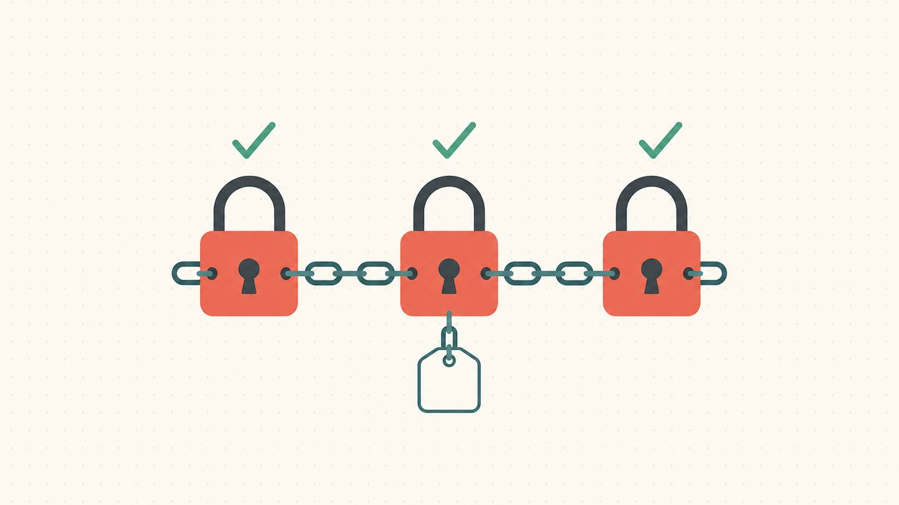
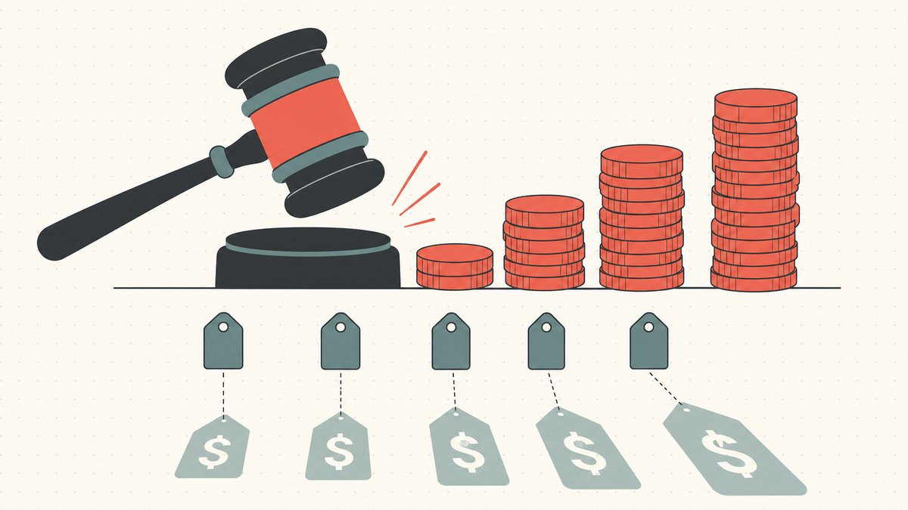
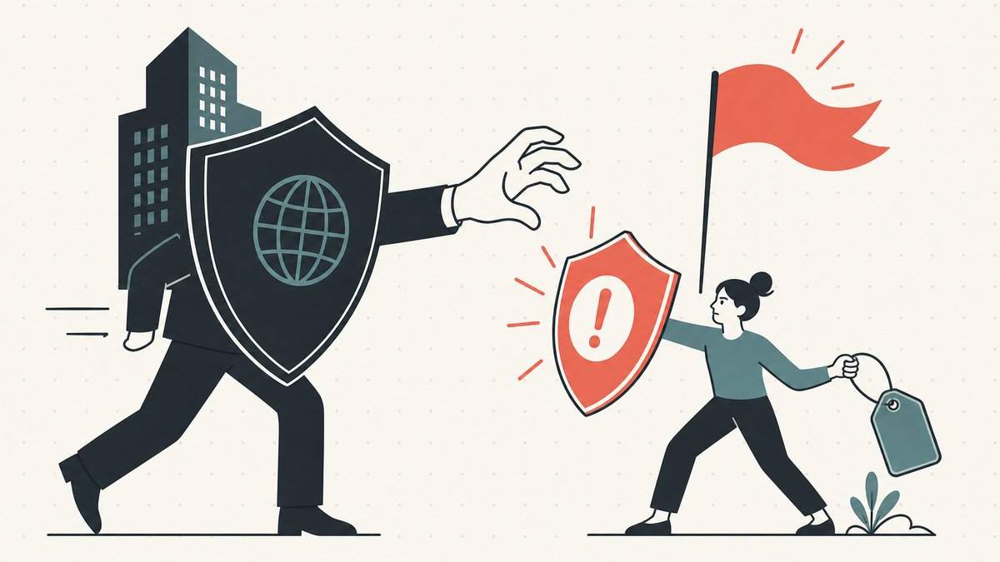

இருவர் ஒரு டொமைனை மறுவிற்பனை செய்வதற்காகப் பதிவு செய்கிறார்கள். ஒருவர், அந்தத் துறையில் உள்ள யாருக்கும் தேவையாக இருக்கக்கூடிய சாதாரண அகராதிச் சொற்றொடரான `solarpanels.com`-ஐ வாங்குகிறார். மற்றொருவர், Nike இருப்பதால் மட்டுமே மதிப்பு பெறும் `nike-running-shoes.net` என்ற பெயரை வாங்குகிறார். மேலோட்டமாகப் பார்த்தால் இருவரும் செய்வது ஒரே செயல்; ஆனால் சட்டரீதியாக அவர்களின் நிலைகள் முற்றிலும் வேறுபட்டவை. முதலாவது சாதாரண [டொமைனிங்](/ta/glossary/domaining/). இரண்டாவது [சைபர்ஸ்குவாட்டிங்](/ta/glossary/cybersquatting/); அதை பதிவு செய்தவரிடமிருந்து அந்தப் பெயரைப் பறிக்க நன்கு வடிவமைக்கப்பட்ட இரண்டு அமைப்புகள் உள்ளன.

இந்த இடைவெளியே இத்தொழிலில் மிக முக்கியமான எல்லை; தற்செயலாகக் கடக்க மிகவும் எளிதானதும் இதுவே. அந்த எல்லையை இந்த வழிகாட்டி விளக்குகிறது: சைபர்ஸ்குவாட்டிங் உண்மையில் என்ன, ஒரு பெயரை மீட்டெடுக்க UDRP பயன்படுத்தும் மூன்று-கூறு இணைப்புச் சோதனை என்ன, அமெரிக்க [ACPA](/ta/glossary/acpa/) பண இழப்பீட்டை எவ்வாறு கூடுதலாகச் சேர்க்கிறது, மேலும் பெரும்பாலான கட்டுரைகள் தவிர்க்கும் மறுபக்கமான தலைகீழ் டொமைன் பெயர் கடத்தல் என்ன—அதாவது, ஒரு சட்டபூர்வமான உரிமையாளருக்கு எதிராக ஒரு பிராண்ட் அமைப்பைத் துஷ்பிரயோகம் செய்வது. இது [டொமைன் மறுவிற்பனையும் சட்டமும்](/ta/blog/domain-flipping-and-the-law/) பற்றிய எங்கள் முதன்மைக் கட்டுரைக்கும் [டொமைன் மறுவிற்பனை](/ta/blog/domain-flipping/) தொடர் மையத்திற்குமான சட்ட அபாயத் துணைக் கட்டுரையாகும்.

> **இது சட்ட ஆலோசனை அல்ல.** டொமைன் உரிமையாளர்களுக்கான பொதுத் தகவல் மட்டுமே; சட்ட ஆலோசனை அல்ல. முடிவுகள் ஒவ்வொரு வழக்கின் குறிப்பிட்ட உண்மைகளைச் சார்ந்திருக்கும். உங்களுக்கு ஒரு புகார் வந்திருந்தாலோ, புகார் தாக்கல் செய்யத் திட்டமிட்டிருந்தாலோ, தகுதிபெற்ற வழக்கறிஞரிடம் பேசுங்கள்.

## சைபர்ஸ்குவாட்டிங் உண்மையில் என்ன

சைபர்ஸ்குவாட்டிங் என்பது "வேறு யாரோ விரும்பும் பெயரைப் பதிவு செய்வது" அல்ல. வேறொருவரின் [வணிக முத்திரையை](/ta/glossary/trademark/) சுரண்டுவதற்காக ஒரு பெயரைப் பதிவு செய்வதுதான் அது. மனதில் பதியவைக்க வேண்டிய வரையறையை Wikipedia வழங்குகிறது: [வேறொருவருக்குச் சொந்தமான வணிக முத்திரையின் நற்பெயரிலிருந்து லாபம் பெறும் தீய நோக்கத்துடன் இணைய டொமைன் பெயரைப் பதிவு செய்தல், அதில் வர்த்தகம் செய்தல் அல்லது அதைப் பயன்படுத்துதல்](https://en.wikipedia.org/wiki/Cybersquatting#:~:text=is%20the%20practice%20of%20registering%2C%20trafficking%20in%2C%20or%20using%20an%20Internet%20domain%20name%2C%20with%20a%20bad%20faith%20intent%20to%20profit) என்பதே அது. அந்த வாக்கியத்தின் ஒவ்வொரு சொல்லும் முக்கியமானது. நடத்தை (பதிவு செய்தல், வர்த்தகம் செய்தல், பயன்படுத்துதல்) பரந்தது. நோக்கம் ([தீய நோக்கம்](/ta/glossary/bad-faith/), லாபம் பெறுதல்) தான் நடவடிக்கையைத் தூண்டும் காரணி. இலக்கும் குறிப்பிட்டது: மொத்தச் சந்தைக்கும் பொதுவான சொல் அல்ல, *வேறொருவருக்குச் சொந்தமான வணிக முத்திரை*.

சட்டபூர்வ டொமைனிங் அந்த நோக்க எல்லையின் மறுபுறம் உள்ளது. பொதுவான, விளக்கமான அல்லது புதிதாக உருவாக்கப்பட்ட பெயர்களை வாங்கி மறுவிற்பனை செய்வது நீண்டகாலமாக நிலைபெற்ற வணிகம். `solarpanels.com` போன்ற ஒரு [டொமைன்](/ta/glossary/domain-ownership/) மதிப்புடையதாக இருப்பதற்குக் காரணம், அதன் சொற்கள் ஒரு நிறுவனத்தின் நற்பெயரின் மீது சவாரி செய்வது அல்ல; ஒரு முழுத் துறைக்கே அவை மதிப்புடையவை என்பதே. வணிக முத்திரையுடன் தொடர்பில்லாத, பிராண்டாகப் பயன்படுத்தத்தக்க புதுச் சொற்களுக்கும் குறுகிய [`.com`](/ta/tld/com/) அல்லது [`.io`](/ta/tld/io/) பெயர்களுக்கும் இதே விதி பொருந்தும். இங்கு சொத்தே அந்த எழுத்துச்சரம்; சட்டபூர்வ நடைமுறையாக [டொமைன் வர்த்தகத்தின்](/ta/glossary/domain-trading/) முழுச் சாரமும் அதுதான்.

ஒரு பெயரின் மதிப்பு அதன் சொற்களிலிருந்து அல்லாமல் ஒரு *பிராண்டிலிருந்து* வரும்போதுதான் சிக்கல் தொடங்குகிறது. `tesla` என்பதுடன் இணைப்புக்கோடு கொண்ட பின்னொட்டைச் சேர்த்துப் பதிவு செய்தல், புகழ்பெற்ற முத்திரையின் திட்டமிட்ட எழுத்துப் பிழையைப் பதிவு செய்தல் ([டைப்போஸ்குவாட்டிங்](/ta/glossary/typosquatting/)), அல்லது தயாரிப்பு அறிமுகமான உடனே புதிய [TLD](/ta/glossary/tld/) ஒன்றில் பிராண்ட் பெயரைப் பதிவு செய்தல் ஆகியவற்றில், நீங்கள் கைப்பற்ற முயலும் மதிப்பு வேறொருவரின் நற்பெயரிலிருந்து வருகிறது. கீழே உள்ள இரண்டு அமலாக்க அமைப்புகளும் துல்லியமாக இதைப் பிடிக்கவே உருவாக்கப்பட்டுள்ளன.

## UDRP-ன் மூன்று-கூறு இணைப்புச் சோதனை

முதல் மற்றும் மிகவும் பொதுவான அமைப்பு [UDRP](/ta/glossary/udrp/)—சீரான டொமைன் பெயர் தகராறு தீர்வுக் கொள்கை. நீங்கள் ஒரு பெயரைப் பதிவு செய்யும்போது ஒவ்வொரு அங்கீகரிக்கப்பட்ட [ரெஜிஸ்ட்ராரும்](/ta/glossary/registrar/) இதை ஏற்க வைக்கிறது; அதனால்தான் நீதிமன்றம் அல்லாத தனியார் நடுவர் குழுவால் உங்கள் டொமைனை வேறொருவருக்கு மாற்ற உத்தரவிட முடிகிறது. முழுச் செயல்முறை, காலவரிசை மற்றும் முடிவுகளை [UDRP என்றால் என்ன](/ta/blog/what-is-udrp/) என்பதில் விளக்குகிறோம்; இங்கே கவனம் சோதனையின் மீதே, ஏனெனில் டொமைன் மறுவிற்பனையாளர்கள் வெல்வதா தோற்பதா என்பதைச் சோதனைதான் தீர்மானிக்கிறது.

புகார்தாரர் பின்வரும் **மூன்றையும்** நிரூபிக்க வேண்டும். இது ஓர் *இணைப்புச்* சோதனை என்பதே இதில் மிக முக்கியமான ஒற்றை உண்மை. ஒரு கூறை நிரூபிக்கத் தவறினாலும், மற்ற இரண்டு எவ்வளவு வலுவாக இருந்தாலும் புகார் நிராகரிக்கப்படும்.

1. **ஒரே மாதிரி அல்லது குழப்பமளிக்கும் அளவுக்கு ஒத்தது.** கொள்கையின் சொற்களில், [புகார்தாரருக்கு உரிமை உள்ள வணிக முத்திரை அல்லது சேவை முத்திரையுடன் டொமைன் பெயர் ஒரே மாதிரியாக அல்லது குழப்பமளிக்கும் வகையில் ஒத்திருக்க வேண்டும்](https://en.wikipedia.org/wiki/Uniform_Domain-Name_Dispute-Resolution_Policy#:~:text=identical%20or%20confusingly%20similar%20to%20a%20trademark%20or%20service%20mark%20in%20which%20the%20complainant%20has%20rights). நடைமுறையில் இது பெரும்பாலும் வழக்குத் தொடுக்கும் தகுதிக்கான நிபந்தனையாகச் செயல்படுகிறது: புகார்தாரரிடம் தொடர்புடைய முத்திரை உள்ளது என்பதையும், உங்கள் பெயர் அதைப் போலத் தோன்றுகிறது என்பதையும் உறுதிசெய்கிறது.

2. **உரிமைகள் அல்லது சட்டபூர்வ நலன்கள் இல்லை.** இரண்டாவது கூறின்படி, [பதிவாளருக்கு அந்த டொமைன் பெயரில் எந்த உரிமைகளோ சட்டபூர்வ நலன்களோ இருக்கக் கூடாது](https://en.wikipedia.org/wiki/Uniform_Domain-Name_Dispute-Resolution_Policy#:~:text=The%20registrant%20does%20not%20have%20any%20rights%20or%20legitimate%20interests). உண்மையான வணிகப் பயன்பாடு, விளக்கப் பொருள் அல்லது வணிகமற்ற கருத்து வெளிப்பாடு ஆகிய அனைத்தும் ஒரு சட்டபூர்வ நலனை நிறுவக்கூடும்; அதனால்தான் பிராண்டை ஒட்டிய பெயர்களைவிட பொதுவான பெயர்களை வைத்திருப்பது மிகவும் பாதுகாப்பானது.

3. **தீய நோக்கத்துடன் பதிவு செய்யப்பட்டு பயன்படுத்தப்பட்டது.** மூன்றாவது கூறின்படி, [டொமைன் பெயர் "தீய நோக்கத்துடன்" பதிவு செய்யப்பட்டிருக்கவும் பயன்படுத்தப்பட்டு வரவும் வேண்டும்](https://en.wikipedia.org/wiki/Uniform_Domain-Name_Dispute-Resolution_Policy#:~:text=The%20domain%20name%20has%20been%20registered%20and%20the%20domain%20name%20is%20being%20used%20in). இங்கே அடிக்கோடிட வேண்டிய சொல் **மற்றும்**. பதிவு செய்தல், பயன்படுத்துதல் ஆகிய *இரண்டிலும்* தீய நோக்கம் இருக்க வேண்டும். புகார்தாரரின் வணிக முத்திரை உருவாவதற்குப் பல ஆண்டுகளுக்கு முன்பே பதிவுசெய்யப்பட்ட பெயர் பொதுவாகத் தீய நோக்கத்துடன் பதிவு செய்யப்பட்டிருக்க முடியாது; ஏனெனில் அப்போது இல்லாத பிராண்டை இலக்காகக் கொள்ள முடியாது.

பாதுகாக்கத்தக்க டொமைன் தொகுப்புகள் தப்பிப் பிழைப்பது அந்த மூன்றாவது கூறில்தான். UDRP அங்கீகரிக்கும் தீய நோக்க வடிவங்கள் குறிப்பிட்டவை: அதிகரிக்கப்பட்ட விலையில் வணிக முத்திரை உரிமையாளருக்கு விற்பதையே முதன்மை நோக்கமாகக் கொண்டு பெயரைப் பதிவு செய்தல்; ஒரு தொடர் நடத்தையின் பகுதியாக பிராண்ட் தனது பெயரைப் பெறுவதைத் தடுக்கப் பதிவு செய்தல்; போட்டியாளரைச் சீர்குலைக்கப் பதிவு செய்தல்; அல்லது முத்திரையுடன் குழப்பத்தை உருவாக்கி வருகையாளர்களை ஈர்க்கப் பெயரைப் பயன்படுத்துதல். முக்கியமாக, *ஒரு பொதுவான அல்லது விளக்கமான டொமைனை விற்பனைக்கு வைப்பது மட்டுமே தீய நோக்கம் அல்ல.* பெயர்களை விற்பது சட்டபூர்வமான வணிகம். நீங்கள் சொற்களில் வர்த்தகம் செய்தீர்களா, ஒரு பிராண்டை இலக்காகக் கொண்டீர்களா என்பதே பிரிக்கும் எல்லை.

டொமைன் மறுவிற்பனையாளருக்கான நடைமுறை முடிவு சுருக்கமானது: அகராதிச் சொல்லை வாங்குங்கள், வணிக முத்திரையை ஒருபோதும் வாங்காதீர்கள்; அதை *ஏன்*, *எப்போது* வாங்கினீர்கள் என்பதற்கான பதிவையும் வைத்திருங்கள். முத்திரைக்கு முந்தைய பதிவு தேதி பல நேரங்களில் வழக்கைத் தீர்மானிக்கும் காரணியாக இருக்கும்.

## ACPA: சைபர்ஸ்குவாட்டிங்கால் உண்மையான பண இழப்பு ஏற்படும் போது

ஒரு பெயருக்கு UDRP இரண்டு செயல்களை மட்டுமே செய்ய முடியும்: அதை மாற்றுதல் அல்லது ரத்து செய்தல். இழப்பீடு எதுவும் இல்லை. உறுதியான ஒரு பிராண்டையோ, குறிப்பாக மோசமான இணைய முகவரி ஆக்கிரமிப்பாளரையோ கையாள, அமெரிக்கா இன்னும் கூர்மையான அதிகாரங்களுடன் இரண்டாவது அமைப்பை உருவாக்கியது.

[1999](https://en.wikipedia.org/wiki/Anticybersquatting_Consumer_Protection_Act#:~:text=1999)-இல் இயற்றப்பட்ட Anticybersquatting Consumer Protection Act, ஒரு கூட்டாட்சி வழக்குரிமையை உருவாக்கியது. Wikipedia சுருக்குவதுபோல், ACPA [ஒரு வணிக முத்திரை அல்லது தனிநபர் பெயருடன் குழப்பமளிக்கும் வகையில் ஒத்த அல்லது அதன் தனித்துவத்தை நீர்த்துப்போகச் செய்யும் டொமைன் பெயரைப் பதிவு செய்தல், அதில் வர்த்தகம் செய்தல் அல்லது அதைப் பயன்படுத்துதல் ஆகியவற்றுக்கு எதிராக வழக்குத் தொடுக்கும் உரிமையை](https://en.wikipedia.org/wiki/Anticybersquatting_Consumer_Protection_Act#:~:text=a%20cause%20of%20action%20for%20registering%2C%20trafficking%20in%2C%20or%20using%20a%20domain%20name%20confusingly%20similar) நிறுவியது. சட்டத்தின் தரநிலை UDRP-ன் நோக்க நிபந்தனையை ஒத்தது: [அந்த முத்திரையிலிருந்து லாபம் பெறும் தீய நோக்கம் கொண்ட](https://www.law.cornell.edu/uscode/text/15/1125#:~:text=has%20a%20bad%20faith%20intent%20to%20profit%20from%20that%20mark) ஒருவர், தனித்துவமான முத்திரையுடன் ஒரே மாதிரியாகவோ குழப்பமளிக்கும் வகையில் ஒத்ததாகவோ உள்ள டொமைனைப் பதிவு செய்தால், அதில் வர்த்தகம் செய்தால் அல்லது பயன்படுத்தினால் இந்தச் சட்டத்தின் கீழ் பொறுப்பேற்கிறார்.

முக்கியமான வேறுபாடு பரிகாரத்தில்தான் உள்ளது. UDRP பெயரை மட்டும் மாற்றும் நிலையில், ACPA உங்கள் பணப்பையையே பாதிக்கலாம். வெற்றி பெறும் வழக்குத் தொடுப்பவர், [ஒரு டொமைன் பெயருக்கு குறைந்தது $1,000 முதல் அதிகபட்சம் $100,000 வரை, நீதிமன்றம் நியாயமானதெனக் கருதும் சட்டபூர்வ இழப்பீட்டை](https://www.law.cornell.edu/uscode/text/15/1117#:~:text=not%20less%20than%20%241%2C000%20and%20not%20more%20than%20%24100%2C000%20per%20domain%20name) தேர்வு செய்யலாம். ஒவ்வொரு பெயருக்கும் தனித்தனியாக. பிராண்ட் பெயர் மாறுபாடுகளைக் கொண்ட ஒரு தொகுப்பை வைத்திருக்கும் ஆக்கிரமிப்பாளருக்கு, டொமைன்களை இழப்பதுடன் சேர்த்து, தொகுப்பின் அளவுக்கேற்ப உயரும் பெருந்தொகை அபாயம் காத்திருக்கிறது.

இதிலிருந்து இரண்டு நடைமுறைக் கருத்துகள் கிடைக்கின்றன. ACPA அமெரிக்கச் சட்டம்; தரப்பினருக்கோ ரெஜிஸ்ட்ராருக்கோ அமெரிக்கத் தொடர்பு இருக்கும்போது இது மிகவும் பொருத்தமானது. ஆனால் UDRP ரெஜிஸ்ட்ரார் ஒப்பந்தத்தின் மூலம் உலகளவில் பொருந்துகிறது. இரண்டும் ஒன்றையொன்று விலக்குபவையும் அல்ல: ஒரு பிராண்ட் பெயரைப் பெற வேகமான, மலிவான UDRP நடைமுறையை நடத்திவிட்டு, இழப்பீட்டுக்காக ACPA-ன் கீழும் வழக்குத் தொடரலாம். சட்டபூர்வ டொமைனிங் செய்பவருக்கு இது பெரும்பாலும் நிம்மதி அளிப்பது; ஏனெனில் UDRP-ன் மூன்றாவது கூறைப் போலவே ACPA-ன் தீய நோக்க நிபந்தனையும் நல்நோக்கத்துடன் செய்யப்படும் பொதுவான பெயர்ப் பதிவுகளைப் பாதுகாக்கிறது. ஆக்கிரமிப்பாளருக்கு, கணக்கு ஒருபோதும் சாதகமாக அமையாததற்கான காரணம் இதுதான்.

## தலைகீழ் டொமைன் பெயர் கடத்தல்: பிராண்டே தவறிழைக்கும் தரப்பாகும்போது

இந்த எல்லை இரு திசைகளிலும் பொருந்தும்; "டொமைன் மறுவிற்பனை சட்டபூர்வமானதா" என்ற பெரும்பாலான கட்டுரைகள் தவிர்க்கும் பகுதி இதுதான். ஒரு வணிக முத்திரை அதன் உரிமையாளருக்கு, அதைப் போன்ற ஒவ்வொரு டொமைனின் மீதும் உரிமை வழங்காது. சட்டபூர்வமாக வைத்திருக்கும் உரிமையாளரிடமிருந்து பெயரைப் பறிக்க ஒரு பிராண்ட் தகராறு செயல்முறையைப் பயன்படுத்தும்போது, அந்தத் துஷ்பிரயோகத்திற்குப் பெயர் தலைகீழ் டொமைன் பெயர் கடத்தல்.

உண்மையில் ஆக்கிரமிப்பாளராக இல்லாத டொமைன் உரிமையாளருக்கு எதிராக சைபர்ஸ்குவாட்டிங் குற்றச்சாட்டுகளை முன்வைத்து, [உரிமை கொண்ட வணிக முத்திரை உரிமையாளர் ஒரு டொமைன் பெயரைப் பெற முயலும் போது](https://en.wikipedia.org/wiki/Reverse_domain_name_hijacking#:~:text=occurs%20where%20a%20rightful%20trademark%20owner%20attempts%20to%20secure%20a%20domain%20name%20by%20making%20cybersquatting%20claims) இது நிகழ்கிறது என Wikipedia வரையறுக்கிறது. இதற்கு எதிரான ஒரு கருவியை UDRP விதிகள் நடுவர் குழுக்களுக்கு வழங்குகின்றன. பத்தி 15(e)-ன் கீழ், [தீய நோக்கத்துடன் புகார் தாக்கல் செய்து UDRP நிர்வாகச் செயல்முறையைத் துஷ்பிரயோகம் செய்திருப்பது](https://en.wikipedia.org/wiki/Reverse_domain_name_hijacking#:~:text=the%20filing%20of%20a%20complaint%20in%20bad%20faith%2C%20resulting%20in%20the%20abuse) கண்டறியப்படும்போது தலைகீழ் டொமைன் பெயர் கடத்தல் தீர்மானிக்கப்படுகிறது.

RDNH கண்டறிதல் டொமைன் உரிமையாளருக்கு எந்தப் பணமும் வழங்காது; ஆனால் அது புகார்தாரரின் எதிர்கால தகராறுகளிலும் வழக்காடலிலும் நம்பகத்தன்மையைப் பாதிக்கும் முறையான, பொதுவான கண்டனமாகும். பொதுவான பெயர் ஒன்றை விரும்பிய ஒரு பிராண்ட், அதை வாங்குவதற்கான வாய்ப்பைத் தவறவிட்டு, பணம் கொடுத்து வாங்க வேண்டியதை UDRP குறுக்குவழி மூலம் பறிக்க முயல்வதே வழக்கமான தூண்டுதல். இப்படிப்பட்ட புகாரை வெளிப்படுத்தும் உண்மை நிலை பொதுவாக எளிமையானது: வணிக முத்திரை உருவாவதற்கு *முன்பே* டொமைன் பதிவு செய்யப்பட்டது; இதனால் தீய நோக்கமுள்ள பதிவு சாத்தியமற்றதாகிறது. குற்றமற்ற, பொதுவான பெயரை வைத்திருக்கும் டொமைனிங் செய்பவருக்கு, பதிலில் RDNH-ஐ முன்வைப்பது உண்மையான தற்காப்புக் கருவியாகும். இது பாதுகாப்பு அளவிலான [டொமைன் கடத்தலிலிருந்தும்](/ta/blog/how-domain-hijacking-actually-happens/) வேறுபட்டது; டொமைன் கடத்தல் என்பது நீங்கள் பதிலளிக்க வேண்டிய சட்டச் செயல்முறை அல்ல, தடுக்க வேண்டிய தாக்குதல்.

## எல்லையின் பாதுகாப்பான பக்கத்தில் இருப்பது

பெரும்பாலான பாதுகாப்பு முடிவுகள் நீங்கள் ஒரு டாலர் செலவிடுவதற்கு முன்பே தீர்மானிக்கப்படுகின்றன. சில பழக்கங்கள் டொமைன் தொகுப்பைச் சட்டரீதியாகப் பாதுகாக்கத்தக்கதாக வைத்திருக்கும்:

- **சொற்களை வாங்குங்கள், பிராண்டுகளை அல்ல.** பொதுவான, விளக்கமான மற்றும் புதிதாக உருவாக்கப்பட்ட பெயர்களே பாதுகாப்பான சரக்கு. ஒரு குறிப்பிட்ட நிறுவனம் இருப்பதால் மட்டுமே ஒரு பெயருக்கு மதிப்பு இருந்தால், அதைத் தவிருங்கள். ஒரு பெயர் பிராண்டாகத் தோன்றுகிறதா என்பதில் உங்களுக்கு ஐயம் இருந்தால், அந்த ஐயமே அதைத் தவிர்ப்பதற்கான சமிக்ஞை.
- **வாங்குவதற்கு முன் வணிக முத்திரைச் சோதனை செய்யுங்கள்.** துல்லியமான எழுத்துச்சரம் மற்றும் வெளிப்படையான எழுத்துப் பிழை மாறுபாடுகளைத் தொடர்புடைய பதிவகத்தில் விரைவாகத் தேடுவது பெரும்பாலான சிக்கல்களைப் பிடித்துவிடும். [மறுவிற்பனை சந்தையில்](/ta/glossary/aftermarket/) இது மிகவும் முக்கியம்; அங்கு பெயருடன் முந்தைய [பதிவாளரின்](/ta/glossary/registrant/) வரலாற்றையும் நீங்கள் பெறுகிறீர்கள்.
- **பதிவுகளை வைத்திருங்கள்; டொமைன் பார்க்கிங்கையும் குற்றமற்றதாக வைத்திருங்கள்.** தீய நோக்கம் பொதுவாகப் பதிவு செய்தபோதே இருந்திருக்க வேண்டும் என்பதால், உங்கள் பதிவுத் தேதியையும் வாங்கிய காரணத்தையும் சேமியுங்கள். வணிக முத்திரை உரிமையாளருடன் போட்டியிடும் PPC விளம்பரங்களைத் தவிருங்கள்; அவை ஒரு பொதுவான பெயரையே தீய நோக்கமுள்ள பயன்பாட்டின் சான்றாக மாற்றலாம்.
- **உள்வரும் வாங்கல் முன்மொழிவுகளைக் கவனமாகக் கையாளுங்கள்.** ஒரு பிராண்ட் உங்களை அணுகினால், *அவர்களுக்கு* அந்தப் பெயர் ஏன் தேவை என்பதை அடிப்படையாகக் கொண்டு தொகை கோராதீர்கள். அப்படிச் சொல்வதை, "வணிக முத்திரை உரிமையாளருக்கு விற்பதையே முதன்மை நோக்கமாகக் கொண்டு பதிவு செய்யப்பட்டது" என்று எளிதில் மறுவடிவமைத்துக் கூறலாம்.

பெயரும் பதிவுகளும் குற்றமற்றதாக இருக்கும்போது, பரிமாற்றமே கடைசி மாறியாகும். அதிக மதிப்புள்ள விற்பனைகள் நடுநிலையான [எஸ்க்ரோ](/ta/glossary/escrow/) வழியாகத் தீர்வு காண்பது, எந்தத் தரப்பும் முதலில் செயல்பட வேண்டியிருக்கக்கூடாது என்பதற்காகத்தான்; ஒரு பெயரின் வரலாறு எப்போதாவது கேள்விக்குள்ளானால், சரிபார்க்கக்கூடிய உரிமைச் சங்கிலியே அதைத் தற்காத்துக்கொள்ள உதவுகிறது. [Namefi](https://namefi.io) இதை முன்னிறுத்துகிறது: டோக்கனைஸ் செய்யப்பட்ட உரிமை, பெயரை முழுமையாக [ICANN](/ta/glossary/icann/) விதிகளுடன் இணக்கமாக வைத்தபடியே நீடித்த, தணிக்கை செய்யக்கூடிய மூலவரலாற்றுப் பதிவை வழங்குகிறது; எனவே அடிப்படை டொமைன் UDRP மற்றும் ACPA நிர்வகிக்கும் அமைப்புக்குள்ளேயே தெளிவாகத் தொடர்கிறது. டோக்கனைசேஷன் உங்கள் சான்றையும் கட்டுப்பாட்டையும் வலுப்படுத்துகிறது. ஆனால் அது ஒரு பெயரை வணிக முத்திரைச் சட்டத்திற்கு வெளியே வைக்காது; எந்த நேர்மையான கருவியும் அப்படிக் கூறாது.

## இறுதி முடிவு

டொமைனிங்கையும் சைபர்ஸ்குவாட்டிங்கையும் பிரிப்பது ஒரே ஒன்று: நோக்கம். சொற்களை வாங்கினால் நீங்கள் முதலீட்டாளர். பிராண்டுகளை வாங்கினால் நீங்கள் இலக்கு—பெயரைப் பறிக்கக்கூடிய உலகளாவிய நடுவர் அமைப்பும், அதற்கு மேல் ஒவ்வொரு டொமைனுக்கும் ஆறு இலக்கத் தொகை வரை வசூலிக்கக்கூடிய அமெரிக்கச் சட்டமும் உங்களை எதிர்கொள்கின்றன. அதே எல்லை மறுதிசையிலும் உங்களைப் பாதுகாக்கிறது; உங்கள் சட்டபூர்வமான பெயருக்கு எதிராகச் செயல்முறையைத் துஷ்பிரயோகம் செய்யும் வணிக முத்திரை உரிமையாளர், தலைகீழ் கடத்தலில் ஈடுபட்டவர் என அறிவிக்கப்படலாம். மூன்று-கூறு UDRP சோதனையை முழுமையாகக் கற்றுக்கொள்ளுங்கள்; உங்கள் டொமைன் தொகுப்பைப் பொதுவான பெயர்களாகவும் பதிவுகளைக் குற்றமற்றதாகவும் வைத்திருங்கள்; அப்போது இத்தொழிலின் சட்ட அபாயம் அதற்குரிய இடத்திலேயே—அமைப்பைத் துஷ்பிரயோகம் செய்ய முயல்பவர்களிடமே—இருக்கும்.

## ஆதாரங்களும் கூடுதல் வாசிப்பும்

- Wikipedia — [சைபர்ஸ்குவாட்டிங் (வரையறை)](https://en.wikipedia.org/wiki/Cybersquatting#:~:text=is%20the%20practice%20of%20registering%2C%20trafficking%20in%2C%20or%20using%20an%20Internet%20domain%20name%2C%20with%20a%20bad%20faith%20intent%20to%20profit)
- Wikipedia — [சீரான டொமைன் பெயர் தகராறு தீர்வுக் கொள்கை (மூன்று கூறுகள்)](https://en.wikipedia.org/wiki/Uniform_Domain-Name_Dispute-Resolution_Policy#:~:text=identical%20or%20confusingly%20similar%20to%20a%20trademark%20or%20service%20mark%20in%20which%20the%20complainant%20has%20rights)
- Wikipedia — [Anticybersquatting Consumer Protection Act (1999; வழக்குரிமை)](https://en.wikipedia.org/wiki/Anticybersquatting_Consumer_Protection_Act#:~:text=a%20cause%20of%20action%20for%20registering%2C%20trafficking%20in%2C%20or%20using%20a%20domain%20name%20confusingly%20similar)
- Legal Information Institute (Cornell) — [15 U.S.C. § 1125(d) ("லாபம் பெறும் தீய நோக்கம்")](https://www.law.cornell.edu/uscode/text/15/1125#:~:text=has%20a%20bad%20faith%20intent%20to%20profit%20from%20that%20mark)
- Legal Information Institute (Cornell) — [15 U.S.C. § 1117(d) (சட்டபூர்வ இழப்பீடு: ஒரு டொமைனுக்கு $1,000–$100,000)](https://www.law.cornell.edu/uscode/text/15/1117#:~:text=not%20less%20than%20%241%2C000%20and%20not%20more%20than%20%24100%2C000%20per%20domain%20name)
- Wikipedia — [தலைகீழ் டொமைன் பெயர் கடத்தல் (வரையறை; UDRP பத்தி 15(e))](https://en.wikipedia.org/wiki/Reverse_domain_name_hijacking#:~:text=occurs%20where%20a%20rightful%20trademark%20owner%20attempts%20to%20secure%20a%20domain%20name%20by%20making%20cybersquatting%20claims)
- ICANN — [சீரான டொமைன் பெயர் தகராறு தீர்வுக் கொள்கை](https://www.icann.org/resources/pages/policy-2012-02-25-en) · WIPO — [UDRP வழிகாட்டி](https://www.wipo.int/amc/en/domains/guide/)
