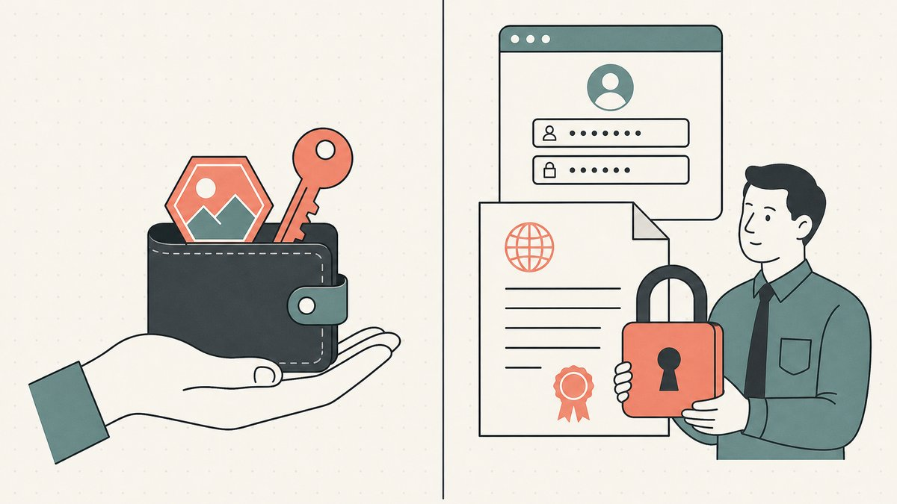
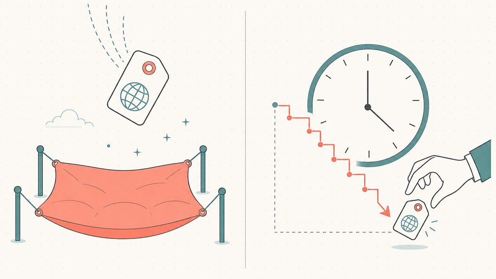

நீங்கள் டொமைன்களை மறுவிற்பவராக இருந்தால், [ENS](/ta/glossary/ens/) சந்தையை ஓரமாக நின்று கவனித்துவிட்டு, பழைய விளையாட்டுக்குப் புதிய தோற்றம் கொடுத்திருப்பது மட்டும்தானா என்று யோசித்திருக்கலாம். அப்படியல்ல. ஒரு `.eth` பெயரை மறுவிற்பதும் பாரம்பரிய `.com` பெயரை மறுவிற்பதும் மேலோட்டமாக ஒரே மாதிரியாகத் தோன்றும்—ஒரு நல்ல எழுத்துச் சரத்தை மலிவாக வாங்கி, அது உங்களைவிட அதிகம் தேவைப்படும் ஒருவருக்கு விற்பது. ஆனால் அடித்தளத்தில் கிட்டத்தட்ட எல்லாமே வேறுபடுகின்றன: உங்கள் உரிமையை யார் பார்க்க முடியும், விற்பனை எவ்வாறு நிறைவேறுகிறது, பெயரை வைத்திருக்க நீங்கள் எவ்வளவு செலுத்துகிறீர்கள், மேலும் ஒரு பெயரை “சொந்தமாக வைத்திருப்பது” என்பதன் பொருள் என்ன என்பவை உட்பட. உங்கள் நேரத்தையும் மூலதனத்தையும் எந்தச் சந்தையில் செலவிடுவது பொருத்தமானது என்பதை முடிவு செய்ய இந்தக் கட்டுரை உண்மையான வேறுபாடுகளை விளக்குகிறது.

முதலில் ஒரு தெளிவுபடுத்தல் தேவை; ஏனெனில் இந்தத் துறையில் வகைப்பாடுகள் குழப்பமாக இருக்கலாம். ENS `.eth` பெயர்களும் **டோக்கனைஸ் செய்யப்பட்ட DNS டொமைன்களும்** ஒன்றல்ல. `.eth` பெயர் முழுமையாக [ஆன்-செயினில்](/ta/glossary/on-chain/) உள்ளது; பெயர்தீர்வு சேவை அல்லது பாலம் இல்லாமல் வழக்கமான உலாவியில் அது பெயர்தீர்வு பெறாது. டோக்கனைஸ் செய்யப்பட்ட `.com` என்பது ஆன்-செயின் டோக்கனையும் கொண்ட ஓர் உண்மையான [ICANN](/ta/glossary/icann/) டொமைன்—வழக்கமான `.com` இயங்கும் எல்லா இடங்களிலும் இதுவும் இயங்கும். இந்த மூன்று வகைகளின் வேறுபாட்டை [டோக்கனைஸ் செய்யப்பட்ட டொமைன் vs Web3 டொமைன்](/ta/blog/tokenized-domain-vs-web3-domain/) மற்றும் [ENS vs Unstoppable vs டோக்கனைஸ் செய்யப்பட்ட DNS](/ta/blog/ens-vs-unstoppable-vs-tokenized-dns/) ஒப்பீடுகளில் விரிவாக விளக்குகிறோம். இந்தக் கட்டுரை குறிப்பாக ENS `.eth` மறுவிற்பனையையும் பாரம்பரிய DNS மறுவிற்பனையையும் ஒப்பிடுகிறது. இரண்டின் சிறந்த பண்புகளையும் பெறும் மூன்றாவது வகையும் இருப்பதை நினைவில் கொள்ளுங்கள்.

## நீங்கள் உண்மையில் வாங்குவது என்ன?

பாரம்பரிய DNS டொமைன் என்பது ஒரு பதிவு. ICANN அங்கீகரித்த [ரெஜிஸ்ட்ராருக்கு](/ta/glossary/registrar/) நீங்கள் கட்டணம் செலுத்துகிறீர்கள்; உங்கள் பெயர் பதிவகத் தரவுத்தளத்தில் இடம் பெறுகிறது. அந்த எழுத்துச் சரத்தை நீங்கள் முழுமையாகச் சொந்தமாக்குவதில்லை—புதுப்பிக்கக்கூடிய ஒரு குத்தகையை வைத்திருக்கிறீர்கள்; அதைக் கட்டுப்படுத்தும் இடைமுகம் ரெஜிஸ்ட்ரார் கணக்காகும்.

ENS பெயர் அடிப்படையிலேயே வேறு வகையைச் சேர்ந்தது. ENS ஆவணங்கள் கூறுவதுபோல், [Ethereum Name Service (ENS) என்பது Ethereum பிளாக்செயினை அடிப்படையாகக் கொண்ட, பரவலாக்கப்பட்ட, திறந்த மற்றும் விரிவாக்கக்கூடிய பெயரிடல் அமைப்பு](https://docs.ens.domains/learn/protocol#:~:text=The%20Ethereum%20Name%20Service%20%28ENS%29%20is%20a%20distributed%2C%20open%2C%20and%20extensible%20naming%20system%20based%20on%20the%20Ethereum%20blockchain). பதிவு செய்யப்பட்ட `.eth` பெயர் ஓர் [NFT](/ta/glossary/nft/)—குறிப்பாக [ERC-721](/ta/glossary/erc-721/) டோக்கன்—அது உங்கள் [பணப்பையில்](/ta/glossary/wallet/) இருக்கும். பயனர்கள் [மற்ற எந்த ERC721 டோக்கனைப் போலவே தங்கள் பெயரையும் பரிமாற்றலாம்](https://docs.ens.domains/registry/eth/#:~:text=transfer%20their%20name%20just%20like%20with%20any%20other%20ERC721%20token) என்று ENS ஆவணங்கள் தெளிவாகக் கூறுகின்றன. இதன் அடிப்படையான ERC-721 என்பது [பரிமாற்ற முடியாத டோக்கன்களுக்கான தரநிலை இடைமுகம்; இவை உரிமைப் பத்திரங்கள் என்றும் அழைக்கப்படுகின்றன](https://eips.ethereum.org/EIPS/eip-721#:~:text=A%20standard%20interface%20for%20non%2Dfungible%20tokens%2C%20also%20known%20as%20deeds); மேலும் அது [NFT-களைக் கண்காணிக்கவும் பரிமாற்றவும் தேவையான அடிப்படைச் செயல்பாடுகளை வழங்குகிறது](https://eips.ethereum.org/EIPS/eip-721#:~:text=This%20standard%20provides%20basic%20functionality%20to%20track%20and%20transfer%20NFTs).

எனவே முதல் வேறுபாடு பாதுகாவல் முறையாகும். DNS-இல், உங்கள் கணக்கிற்கான சாவிகளை ரெஜிஸ்ட்ரார் கட்டுப்படுத்துகிறது; அதிகாரப்பூர்வப் பதிவை பதிவகம் வைத்திருக்கிறது. ENS-இல், [ஸ்மார்ட் கான்ட்ராக்ட்](/ta/glossary/smart-contract/) பதிவை வைத்திருக்கிறது; சாவிகளை *நீங்களே* வைத்திருக்கிறீர்கள். மறுவிற்பனையாளருக்கு இதில் நன்மையும் ஆபத்தும் உள்ளன. விற்பனையில் ஓர் இடைத்தரகரை இது நீக்கினாலும், [சுயப் பாதுகாவலுக்கான](/ta/glossary/custodial-ownership/) முழுப் பொறுப்பும் உங்கள் சொந்த [விதை சொற்றொடர்](/ta/glossary/wallet/) மீதே விழுகிறது.

## உரிமை வெளிப்படையானது, ஆன்-செயினில் பதிவாகிறது, தணிக்கை செய்யக்கூடியது

நீங்கள் `.com` ஒன்றை வாங்கும்போது, உரிமை விவரங்கள் ஓரளவு தனிப்பட்டதாக இருக்கும். WHOIS தரவு பெரும்பாலும் மறைக்கப்பட்டிருக்கும், பரிமாற்ற வரலாறு வெளிப்படையாக இருக்காது; பெயருக்கு மறைமுகமான சுமைகளோ உரிமைக் கோரிக்கைகளோ இல்லை என்று விற்பவர் கூறுவதை வாங்குபவர் பெருமளவில் நம்ப வேண்டியிருக்கும்.

ENS இதற்கு நேர்மாறானது. ஒவ்வொரு பதிவு, பரிமாற்றம் மற்றும் விற்பனையும் ஆன்-செயின் பரிவர்த்தனையாக இருப்பதால், ஒரு பெயரின் முழு உரிமை வரலாறும் பொதுவாகவும் நிரந்தரமாகவும் பதிவாகிறது. எந்தப் [பணப்பை](/ta/glossary/wallet/) `crypto.eth`-ஐ வைத்திருக்கிறது, அது கடைசியாக எப்போது கைமாறியது, எவ்வளவு தொகைக்கு கைமாறியது என்பவற்றை யாரும் பார்க்கலாம். மறுவிற்பனையாளருக்கு இது இருபக்கமும் கூர்மையான வாள். நன்மை என்னவென்றால், உரிய ஆய்வு செய்வது எளிது; போலிகளை உருவாக்குவது கடினம்; [எஸ்க்ரோ](/ta/glossary/escrow/) முகவர் சான்றளிக்காமலேயே வாங்குபவர் உங்கள் உரிமையைச் சில விநாடிகளில் சரிபார்க்க முடியும். பாதகம் என்னவென்றால், உங்கள் டொமைன் தொகுப்பும் வாங்கிய விலைகளும் போட்டியாளர்களுக்குத் தெரியும்; “நான் ஒரு மறுவிற்பனையாளர்” என்று வெளிப்படுத்தும் பணப்பை, உங்களுக்குச் சாதகமற்ற எதிர்ச் சலுகைகளை வரவழைக்கலாம். பாரம்பரிய டொமைன் முதலீட்டில் நீங்கள் அமைதியாகச் செயல்பட முடியும்; ENS-இல் அது சாத்தியமில்லை.

ஆன்-செயின் பெயர்களை நிரலாக்க முறையில் எளிதாக மதிப்பிடவும் வர்த்தகம் செய்யவும் உதவும் அதே வெளிப்படைத்தன்மை இதுதான். [ஆன்-செயின் டொமைன்களை மதிப்பிடுதல்](/ta/blog/appraising-onchain-domains/) கட்டுரையில் இதை மேலும் விளக்குகிறோம்.

## இரண்டாம் நிலைச் சந்தைப் பணப்புழக்கம்: தரகர்கள் அல்ல, சந்தை இடங்கள்

ENS உண்மையிலேயே அனுபவத்தை மாற்றும் பகுதி இதுதான். `.eth` பெயர் ERC-721 டோக்கனாக இருப்பதால், தனிப்பட்ட டொமைன்-துறை உள்கட்டமைப்பு எதுவும் இல்லாமலேயே OpenSea, Blur போன்ற பொதுப் பயன்பாட்டு NFT [சந்தை இடங்களுடன்](/ta/glossary/marketplace/) அது இயல்பாகவே இணக்கமானது. மற்ற NFT-களைப் போலவே அதைப் பட்டியலிடலாம்; சந்தை இடத்தின் வழக்கமான [ஸ்மார்ட் கான்ட்ராக்ட்](/ta/glossary/smart-contract/) மூலம் விற்பனை நிறைவேறும்.

விற்பனை நிறைவேறும் விதமே முக்கிய வேறுபாடு. பாரம்பரிய டொமைன் விற்பனை பல நாட்கள் நீளும் தொடர்ச்சியான செயல்முறை: விலையை ஒப்புக்கொள்ளுதல், எஸ்க்ரோவைத் தொடங்குதல், வாங்குபவர் பணம் செலுத்துதல், ரெஜிஸ்ட்ராரில் நீங்கள் [பரிமாற்றத்தை](/ta/glossary/atomic-transfer/) முன்னெடுத்தல், ரெஜிஸ்ட்ரார் உறுதிப்படுத்துதல், இறுதியாக எஸ்க்ரோ பணத்தை விடுவித்தல். ENS விற்பனை ஓர் [அணு-பரிமாற்றம்](/ta/glossary/atomic-transfer/): ஒரே பரிவர்த்தனையில் வாங்குபவரின் பணமும் உங்கள் டோக்கனும் பரிமாறிக்கொள்ளப்படும்; இல்லையெனில் இரண்டுமே நடக்காது. பரிவர்த்தனையின் நடுவில் மூன்றாம் தரப்பு எவரும் சொத்தை வைத்திருப்பதில்லை. டோக்கனைஸ் செய்யப்பட்ட டொமைன் விற்பனைகளை எஸ்க்ரோ இல்லாமல் செயல்படச் செய்யும் அதே அமைப்பு இதுதான். மேலும் அறிய [டோக்கனைஸ் செய்யப்பட்ட சந்தை இடங்கள் எஸ்க்ரோவை எவ்வாறு மாற்றுகின்றன](/ta/blog/how-tokenized-marketplaces-replace-escrow/) மற்றும் விரிவான [ஆன்-செயின் டொமைன் சந்தை இடங்களின் ஒப்பீடு](/ta/blog/onchain-domain-marketplaces-compared/) ஆகியவற்றைப் பார்க்கவும்.

ஆனால் பணப்புழக்கத்தில் ஓர் உண்மையான வரம்பு உள்ளது. NFT சந்தை இடங்கள் *NFT-களுக்கு* பணப்புழக்கத்தை வழங்குகின்றன; ஆனால் ஒரு `.eth` பெயர், குறிப்பாக அந்தப் பெயரை விரும்பும் மற்றும் ஏற்கெனவே கிரிப்டோவைப் பயன்படுத்தும் வாங்குபவருக்கே விற்கப்படும். சிறந்த `.com`-ஐ உலகின் எந்த வணிகத்திற்கும் விற்கலாம்; சிறந்த `.eth`-ஐ ETH வைத்திருக்கும், பணப்பையை இயக்கத் தெரிந்த, ஆன்-செயின் பெயருக்கு மதிப்பு தரும் மிகவும் சிறிய பயனர் குழுவுக்கே விற்க முடியும். நிறைவேற்றம் வேகமாக இருக்கும்; ஆனால் தேவை குறுகியது. “உடனடியாகப் பரிமாற்ற முடியும்” என்பதையும் “எளிதாக விற்க முடியும்” என்பதையும் ஒன்றாகக் கருதாதீர்கள்.

## புதுப்பித்தல் மற்றும் காலாவதி முறை ஒன்றல்ல

இரு அமைப்புகளிலும் பெயரைத் தொடர்ந்து வைத்திருக்க கட்டணம் செலுத்த வேண்டும். ஆனால் ஒரு டொமைன் தொகுப்பை நிர்வகிக்கும்போது முக்கியத்துவம் பெறும் விதத்தில் அவற்றின் செயல்முறைகள் வேறுபடுகின்றன.

பாரம்பரிய DNS, ரெஜிஸ்ட்ரார் மற்றும் பதிவக விதிமுறைகளின் அடிப்படையில் இயங்குகிறது. ஒரு [gTLD](/ta/glossary/gtld/) பதிவை பொதுவாக அதிகபட்சம் பத்து ஆண்டுகள் வரை வைத்திருக்கலாம்; ஆனால் காலாவதிக்குப் பிந்தைய நடைமுறை எல்லா இடங்களிலும் ஒரே காலக்கணக்கைப் பின்பற்றாது. ரெஜிஸ்ட்ரார் வெளியிட்டுள்ள கொள்கையைப் பொறுத்து, காலாவதியான பதிவை வெவ்வேறு நேரங்களில் நீக்கலாம். நீக்கப்பட்ட பிறகு, ICANN-ன் [Expired Registration Recovery Policy](https://www.icann.org/en/contracted-parties/consensus-policies/expired-registration-recovery-policy/expired-registration-recovery-policy-21-02-2024-en) பொதுவாக 30 நாள் Redemption Grace Period-ஐ வழங்குகிறது; அந்தக் காலத்தில் நீக்கிய ரெஜிஸ்ட்ரார் மூலம் பதிவை மீட்டெடுக்கலாம். மீட்டெடுக்கப்படாவிட்டால், அதைத் தொடர்ந்து பொதுவாக ஐந்து நாள் Pending Delete கட்டம் வரும். சில்லறைப் புதுப்பித்தல் விலையும் ரெஜிஸ்ட்ராருக்கு ஏற்ப மாறும். Verisign-ன் [தற்போதைய `.com` கட்டண அட்டவணை](https://www.verisign.com/assets/com-registrar-agreement.pdf), 2026 அக்டோபர் 31 வரை அடிப்படை பதிவகக் கட்டணத்தை ஒரு டொமைன்-ஆண்டுக்கு USD $10.26 என நிர்ணயிக்கிறது; [2026 நவம்பர் 1 முதல் USD $10.97 ஆகும்](https://investor.verisign.com/news-releases/news-release-details/verisign-reports-first-quarter-2026-results) என்றும் Verisign அறிவித்துள்ளது.

ENS, பெயரின் நீளத்தை அடிப்படையாகக் கொண்ட ஆண்டு கட்டணத்தை ETH-இல் வசூலிக்கிறது. ENS ஆவணங்களின்படி, ஐந்து அல்லது அதற்கு மேற்பட்ட எழுத்துகளுள்ள பெயர்களுக்கு ஆண்டுக்கு சுமார் USD $5, நான்கு எழுத்துப் பெயர்களுக்கு சுமார் USD $160, மூன்று எழுத்துப் பெயர்களுக்கு சுமார் USD $640 செலவாகும். குறுகிய, அரிதான எழுத்துச் சரங்கள் பதுக்கப்படுவதைத் தடுக்க அவற்றுக்கு அதிகக் கட்டணம் விதிக்கப்படுகிறது. இந்த எண்ணிக்கைகள் இணைக்கப்பட்ட ஆவணத்தில் தற்போது குறிப்பிடப்பட்டுள்ளவை; ENS விலைகள் USD-இல் நிர்ணயிக்கப்பட்டு ETH-இல் செலுத்தப்படுவதால், துல்லியமான ETH தொகை oracle விகிதத்துடன் மாறும். பெயர் காலாவதியான பிறகு, அதை மீண்டும் பதிவு செய்யக் கிடைக்கும் முன் [90 நாள் அவகாசக் காலம்](https://docs.ens.domains/registry/eth/#:~:text=90%20days%20after%20a%20name%20expires) இருப்பதாக ENS ஆவணங்கள் குறிப்பிடுகின்றன. அதன் பிறகு, ஆவணங்கள் [21 நாள் டச்சு ஏலம்](https://docs.ens.domains/registry/eth/#:~:text=a%2021%20day%20dutch%20auction) என்று அழைக்கும் தற்காலிகக் கூடுதல் கட்டணச் செயல்முறையுடன் பெயர் மறுபதிவுக்குக் கிடைக்கும்; கூடுதல் கட்டணம் மிக உயர்ந்த அளவில் தொடங்கி பூஜ்ஜியத்தை நோக்கிக் குறையும். மறுவிற்பனையாளருக்கு பொதுவாகத் தெரியும் இந்தக் கூடுதல் கட்டணக் கட்டம் ஓர் ஆபத்தாகவும் வாய்ப்பாகவும் உள்ளது: மதிப்புள்ள பெயரை காலாவதியாக விட்டால் மற்றவர்கள் அதைப் பெறலாம்; அதே நேரத்தில், குறைந்து வரும் கூடுதல் கட்டணம் ஏற்ற அளவை அடையும் தருணத்தை வாங்குபவர் தேர்ந்தெடுக்கலாம்.

இதில் நடைமுறைப் பாடம், ஓர் அமைப்பு எப்போதும் அதிக நேரம் வழங்குகிறது என்பதல்ல. ENS 90 நாள் அவகாசக் காலத்தைத் தெளிவாக ஆவணப்படுத்துகிறது; DNS மீட்பு நேரம், ரெஜிஸ்ட்ரார் பெயரை எப்போது நீக்குகிறது என்பதையும் பொருந்தும் பதிவகக் கொள்கையையும் சார்ந்தது. காலாவதிக்குப் பிறகு என்ன நடக்கிறது என்பதே செயல்பாட்டு வேறுபாடு: காலாவதியான `.eth` பெயர், எல்லோருக்கும் தெரியும் தற்காலிகக் கூடுதல் கட்டண மறுபதிவு செயல்முறைக்குச் செல்கிறது; DNS பெயர் பதிவகத்திலிருந்து நீக்கப்படுவதற்கு முன் ரெஜிஸ்ட்ரார் விதிகளின் கீழ் ஏலமிடப்படலாம் அல்லது பதிவக வாழ்க்கைச் சுழற்சிக்குப் பிறகு வெளியிடப்படலாம். இரு அமைப்புகளிலும், மீட்பைத் தொகுப்பு நிர்வாக முறையாகக் கருதாமல் காலாவதிக்கு முன்பே புதுப்பியுங்கள்.

## கேஸ் மற்றும் நிறைவேற்றச் செலவுகள்

பாரம்பரிய டொமைன் செலவுகள் ஒப்பீட்டளவில் கணிக்கக்கூடியவை: முன்கூட்டியே குறிப்பிடப்படும் புதுப்பித்தல் கட்டணம், அவ்வப்போது வரும் பரிமாற்றக் கட்டணங்கள், மேலும் பொருந்தக்கூடிய எஸ்க்ரோ அல்லது சந்தைக் கட்டணம். எதிர்கால விலை மாற்றங்களுக்கு இடமளித்தபடியே, ரெஜிஸ்ட்ராரின் கட்டண அட்டவணையிலிருந்து ஒரு டொமைன் தொகுப்பின் ஆண்டு வைத்திருப்புச் செலவைக் கணிக்கலாம்.

ENS-இல் நீங்கள் முழுமையாகக் கட்டுப்படுத்த முடியாத மற்றொரு மாறி சேர்கிறது: கேஸ். பதிவு செய்தல், புதுப்பித்தல், நேரடியாகப் பரிமாற்றுதல் மற்றும் சந்தை இட விற்பனையை நிறைவேற்றுதல் ஆகியவற்றுக்கு ஆன்-செயின் பரிவர்த்தனைகள் தேவை; அவற்றின் நெட்வொர்க் கட்டணம் Ethereum நெட்வொர்க்கின் பயன்பாட்டுத் தேவைக்கேற்ப மாறும். ஆனால் **ஒவ்வொரு சந்தை இடச் செயலும் தனியே Ethereum பரிவர்த்தனை அல்ல**. ஒரு சேகரிப்பிலுள்ள NFT-ஐ முதன்முறையாக விற்பனைக்கு பட்டியலிடும்போது, அந்தச் சேகரிப்புக்கு அனுமதி வழங்குமாறு கேட்கப்படலாம்; அதற்கு விற்பவர் கேஸ் செலுத்த வேண்டியிருக்கலாம். அதே சேகரிப்பின் அடுத்தடுத்த விற்பனைப் பட்டியல்களுக்கு கேஸ் தேவையில்லை என்று OpenSea கூறுகிறது. நிர்ணயிக்கப்பட்ட விலை விற்பனையில் வாங்குபவர் நிறைவேற்றத்திற்கான கேஸ் செலுத்துகிறார்; விலைச் சலுகையை ஏற்றுக்கொள்ளும்போது விற்பவர் கேஸ் செலுத்துகிறார். ஆகவே விற்பனைப் பட்டியலை உருவாக்குவது ஆஃப்-செயின் பணப்பைக் கையொப்பமாக இருக்கலாம்; எனினும் இறுதி விற்பனை ஆன்-செயினில் நிறைவேறும். OpenSea-வின் தற்போதைய [கேஸ் கட்டணம் மற்றும் அதை யார் செலுத்துகிறார்கள் என்ற விளக்கத்தை](https://support.opensea.io/en/articles/8867014-who-pays-the-gas-fees-on-opensea) பார்க்கவும்.

இந்த வேறுபாடு குறைந்த மதிப்புள்ள மறுவிற்பனைகளின் செலவுக் கணக்கை மாற்றுகிறது. நெட்வொர்க் நெரிசலின்போது, உண்மையான புதுப்பித்தல் அல்லது நிறைவேற்றப் பரிவர்த்தனைக்கான கேஸ், குறைந்த விலைப் பெயரின் மொத்தச் செலவை கணிசமாக உயர்த்தலாம். ஆனால் அதன் அளவு பரிவர்த்தனை, சந்தை இட செயல்முறை, கட்டணம் செலுத்துபவர் மற்றும் நேரம் ஆகியவற்றைப் பொறுத்தது. ENS அடிப்படை வாடகை USD-இல் நிர்ணயிக்கப்பட்டு ETH-இல் செலுத்தப்படுகிறது; கேஸ் என்பது தனியான நெட்வொர்க் செலவு. பரிவர்த்தனையைச் செய்யும் நேரத்தில் இரண்டின் செலவையும் கணக்கிடுங்கள், ஒவ்வொரு கட்டணத்தையும் யார் செலுத்தினார்கள் என்பதைப் பதிவு செய்யுங்கள், ஒவ்வொரு விற்பனைப் பட்டியலுக்கும் புதிதாக ஆன்-செயின் கட்டணம் ஏற்படும் என்று கணக்கிடாதீர்கள்.

## ஒவ்வொன்றும் எதற்குச் சிறந்தது?

ஒன்று மற்றொன்றைவிட எல்லா வகையிலும் சிறந்தது அல்ல—இவை வெவ்வேறு மறுவிற்பனையாளர்களுக்கும் வெவ்வேறு பெயர்களுக்கும் ஏற்றவை.

**பாரம்பரிய DNS மறுவிற்பனை**, உங்கள் வாங்குபவர் கிரிப்டோ பயனர் அல்லாமல் ஒரு *வணிக நிறுவனமாக* இருக்கும்போது சிறந்தது: இணையதளம், மின்னஞ்சல் மற்றும் Google தரவரிசைக்காக `austinplumbing.com` தேவைப்படும் இறுதிப் பயனர் போன்றவர். வாங்குபவர் சந்தை முழுப் பொருளாதாரத்தையும் உள்ளடக்கியது; பெயர்கள் எந்தத் தடையும் இல்லாமல் எல்லா இடங்களிலும் இயங்கும்; வைத்திருப்புச் செலவை முன்கணிக்க முடியும்; நடைமுறைகள் முதிர்ச்சியடைந்தவை. இதற்கான விலை, மெதுவாக நிறைவேறும் எஸ்க்ரோ சார்ந்த விற்பனையும் வெளிப்படையற்ற உரிமையும் ஆகும். [டொமைன் மறுவிற்பனை](/ta/blog/domain-flipping/) கலையின் பெரும்பகுதி—பெயர்களைக் கண்டறிதல், [மதிப்பிடுதல்](/ta/blog/how-to-value-a-domain-name/), வாங்குபவர்களை அணுகுதல் போன்றவை—இந்தச் சந்தையில்தான் உருவாகியது.

**ENS மறுவிற்பனை**, பெயரின் மதிப்பு *கிரிப்டோவுக்கே உரியதாக* இருக்கும்போது சிறந்தது: தெளிவான பணப்பை அடையாளம், நெறிமுறை அல்லது DAO அடையாளப் பெயர், குறுகிய சேகரிப்புப் பெயர் போன்றவை. விற்பனை அணு முறையில் நிறைவேறும்; உரிமை சுயப் பாதுகாவலில் இருக்கும்; சொத்தை ஆன்-செயின் செயலிகளுடன் இணைத்துப் பயன்படுத்தலாம். இதற்கான விலை, குறுகிய வாங்குபவர் சந்தை, கேஸ் செலவு, காலாவதி அவகாசக் காலத்துக்குப் பிறகு அனைவருக்கும் தெரியும் தற்காலிகக் கூடுதல் கட்டணச் செயல்முறை, மேலும் உங்கள் சாவிகளுக்கான முழுப் பொறுப்பு ஆகியவை. பணப்பையை இழந்தால் பெயரும் போய்விடும். இதனால்தான் [பணப்பையை இழந்த பிறகு ஆன்-செயின் பெயரை மீட்டெடுப்பது](/ta/blog/recovering-a-tokenized-domain-after-wallet-loss/) மற்றும் [பல-கையெழுத்துப் பாதுகாவல்](/ta/glossary/multi-sig/) ஆகியவை DNS-ஐவிட இங்கு மிகவும் முக்கியமானவை.

இரண்டில் ஒன்றை மட்டும் தேர்ந்தெடுக்க வேண்டிய அவசியமில்லாத மூன்றாவது வழியும் உள்ளது. **டோக்கனைஸ் செய்யப்பட்ட DNS டொமைன்**—அதாவது ஆன்-செயின் டோக்கன் இணைக்கப்பட்ட ஓர் உண்மையான `.com`—DNS-ன் உலகளாவிய வாங்குபவர் சந்தையையும் ENS-ன் அணு முறையிலான, எஸ்க்ரோ இல்லாத நிறைவேற்றத்தையும் சுயப் பாதுகாவலையும் தருகிறது. இந்தப் பயன்பாட்டுக்காகத்தான் [Namefi](https://namefi.io) உருவாக்கப்பட்டுள்ளது: நீங்கள் எப்படியும் மறுவிற்பனை செய்ய நினைக்கும் பெயரை டோக்கனைஸ் செய்து, அதன் பெயர்தீர்வு எல்லா இடங்களிலும் தொடர்ந்து இயங்குமாறு வைத்துக்கொண்டு, எஸ்க்ரோ செயல்முறை இல்லாமல் ஆன்-செயினில் விற்கலாம். ஆன்-செயின் வாய்ப்பை நீங்கள் தீவிரமாகப் பரிசீலிக்கிறீர்கள் என்றால், தொகுப்பின் முதன்மைக் கட்டுரையான [ஆன்-செயின் டொமைன் மறுவிற்பனை](/ta/blog/onchain-domain-flipping/) மற்றும் [டோக்கனைசேஷன் டொமைன் மறுவிற்பனையை எவ்வாறு மாற்றுகிறது](/ta/blog/how-tokenization-changes-domain-flipping/) ஆகியவை முழுப் படத்தை விளக்குகின்றன; [டொமைன்களை NFT-களாக விற்பது](/ta/blog/selling-domains-as-nfts/) விற்பனைப் பட்டியல் உருவாக்கும் செயல்முறையை விளக்குகிறது.

## முடிவுரை

ENS மற்றும் DNS டொமைன் மறுவிற்பனை ஒரே நோக்கத்தைப் பகிர்ந்தாலும், அவற்றின் அடிப்படை அமைப்புகள் கிட்டத்தட்ட அனைத்திலும் வேறுபடுகின்றன. ENS வெளிப்படையான உரிமைப் பதிவு, NFT சந்தை இட [பணப்புழக்கம்](/ta/glossary/domain-trading/) மற்றும் அணு முறையிலான நிறைவேற்றத்தை வழங்குகிறது—அதற்குப் பதிலாக குறுகிய வாங்குபவர் சந்தை, கேஸ் செலவு, அவகாசக் காலத்துக்குப் பிந்தைய பொதுவான கூடுதல் கட்டணச் செயல்முறை மற்றும் சுயப் பாதுகாவல் ஆபத்து ஆகியவற்றை ஏற்க வேண்டும். DNS உலகளாவிய வாங்குபவர் சந்தையையும் ஒப்பீட்டளவில் முன்கணிக்கக்கூடிய வைத்திருப்புச் செலவையும் வழங்குகிறது—அதற்குப் பதிலாக ரெஜிஸ்ட்ராருக்கு ஏற்ப மாறும் காலாவதி நடைமுறைகளையும், மெதுவாகவும் பெரும்பாலும் எஸ்க்ரோ வழியாகவும் வெளிப்படையின்றியும் நடக்கும் பரிமாற்றங்களையும் ஏற்க வேண்டும். புத்திசாலித்தனமான மறுவிற்பனையாளர்கள் எந்தவொரு அணியையும் மட்டும் தேர்ந்தெடுப்பதில்லை; பெயருக்குச் சரியான சந்தையைத் தேர்ந்தெடுக்கிறார்கள். மேலும், இந்த இரண்டில் ஒன்றைத் தேர்ந்தெடுக்க வேண்டிய நிலையைத் தவிர்க்க அவர்கள் அதிகமாக டோக்கனைஸ் செய்யப்பட்ட DNS-ஐ நாடுகிறார்கள்.

## நட்பான பொறுப்புத் துறப்பு (தயவுசெய்து படிக்கவும்!)

> நாங்கள் வழக்கறிஞர்கள், கணக்காளர்கள், நிதி ஆலோசகர்கள் அல்லது மருத்துவர்கள் அல்ல; மேலும் **இந்தக் கட்டுரையில் உள்ள எதுவும் சட்ட, நிதி, வரி, கணக்கியல், மருத்துவ அல்லது வேறு எந்த வகையான தொழில்முறை ஆலோசனையும் அல்ல.** நாங்கள் கற்றுக்கொள்வதற்காகவும் எங்கள் வாடிக்கையாளர்களின் வசதிக்காகவும் இந்தக் கட்டுரைகளை எழுதுகிறோம். இங்குள்ள தகவல்கள் காலாவதியானதாகவோ, குறிப்பிட்ட புவியியல் பகுதிக்கு மட்டுமே பொருந்துவதாகவோ அல்லது முற்றிலும் தவறானதாகவோ இருக்கலாம். நாங்களும் தவறு செய்கிறோம்.
>
> எந்த முக்கியமான முடிவுக்கும், **உண்மையான ஒரு நிபுணரை அணுகுங்கள் (தீவிரமாகச் சொல்கிறோம்!)**. அது உங்களுக்குப் பொருந்தவில்லை என்றால், ஒரு நண்பரிடம் கேளுங்கள், Twitter-இல் கேளுங்கள், Reddit-இல் கேளுங்கள், AI-யிடம் கேளுங்கள் அல்லது குறி சொல்பவரிடம் கேளுங்கள். சுருக்கமாக: **DYOR — உங்கள் சொந்த ஆராய்ச்சியை நீங்களே செய்யுங்கள்**. கற்று மகிழ்வோம்.

## ஆதாரங்களும் மேலும் படிக்கவும்

- ENS Docs — [ENS என்றால் என்ன? (Ethereum பிளாக்செயினில் உள்ள பரவலாக்கப்பட்ட பெயரிடல் அமைப்பு)](https://docs.ens.domains/learn/protocol#:~:text=The%20Ethereum%20Name%20Service%20%28ENS%29%20is%20a%20distributed%2C%20open%2C%20and%20extensible%20naming%20system%20based%20on%20the%20Ethereum%20blockchain)
- ENS Docs — [ETH Registrar (.eth பெயர்கள் மற்ற ERC721 டோக்கன்களைப் போலப் பரிமாறப்படுகின்றன; காலாவதிக்கான அவகாசக் காலம் மற்றும் டச்சு ஏலம்; பெயர் நீளத்தைச் சார்ந்த ஆண்டுக் கட்டணங்கள்)](https://docs.ens.domains/registry/eth/#:~:text=transfer%20their%20name%20just%20like%20with%20any%20other%20ERC721%20token)
- Ethereum Improvement Proposals — [ERC-721 பரிமாற்ற முடியாத டோக்கன் தரநிலை (“பரிமாற்ற முடியாத டோக்கன்களுக்கான தரநிலை இடைமுகம்; உரிமைப் பத்திரங்கள் என்றும் அழைக்கப்படுகின்றன”)](https://eips.ethereum.org/EIPS/eip-721#:~:text=A%20standard%20interface%20for%20non%2Dfungible%20tokens%2C%20also%20known%20as%20deeds)
- OpenSea Help Center — [அனுமதிகள், விற்பனைப் பட்டியல்கள், நிர்ணயிக்கப்பட்ட விலை வாங்குதல்கள் மற்றும் ஏற்கப்பட்ட விலைச் சலுகைகள் ஆகியவற்றுக்கு கேஸ் செலுத்துவது யார்](https://support.opensea.io/en/articles/8867014-who-pays-the-gas-fees-on-opensea)
- ICANN — [Expired Registration Recovery Policy (ரெஜிஸ்ட்ரார் நீக்குதல், 30 நாள் RGP, DNS இடைநிறுத்தம் மற்றும் கட்டண வெளியீடு)](https://www.icann.org/en/contracted-parties/consensus-policies/expired-registration-recovery-policy/expired-registration-recovery-policy-21-02-2024-en)
- ICANN — [டொமைன் புதுப்பித்தல் மற்றும் காலாவதி அடிக்கடி கேட்கப்படும் கேள்விகள் (30 நாள் RGP-ஐத் தொடர்ந்து ஐந்து நாள் Pending Delete)](https://www.icann.org/resources/pages/domain-name-renewal-expiration-faqs-2018-12-07-en?6b790461_page=2)
- Verisign — [`.com` பதிவகம்–ரெஜிஸ்ட்ரார் ஒப்பந்தம் மற்றும் 2024 செப்டம்பர் 1 முதல் அமலில் உள்ள USD $10.26 கட்டண அட்டவணை](https://www.verisign.com/assets/com-registrar-agreement.pdf)
- Verisign — [2026 முதல் காலாண்டு முடிவுகளும் 2026 நவம்பர் 1 முதல் அமலாகும் `.com` பதிவகக் கட்டண உயர்வு அறிவிப்பும்](https://investor.verisign.com/news-releases/news-release-details/verisign-reports-first-quarter-2026-results)
