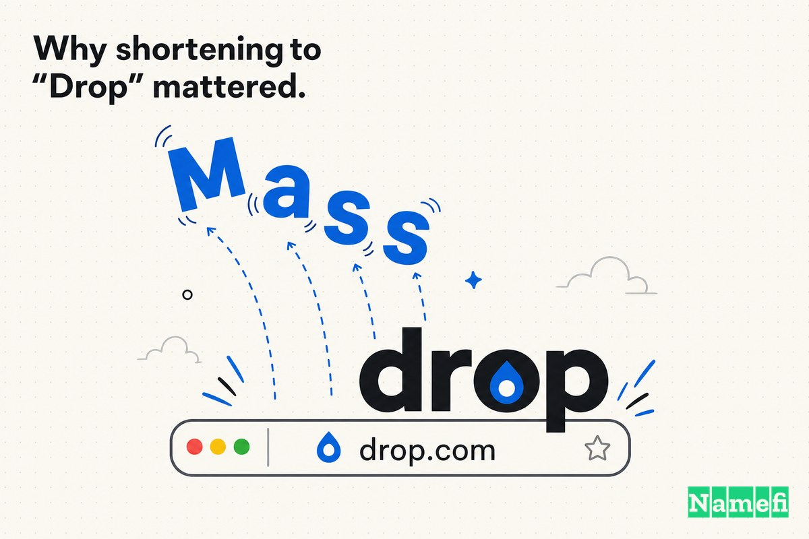
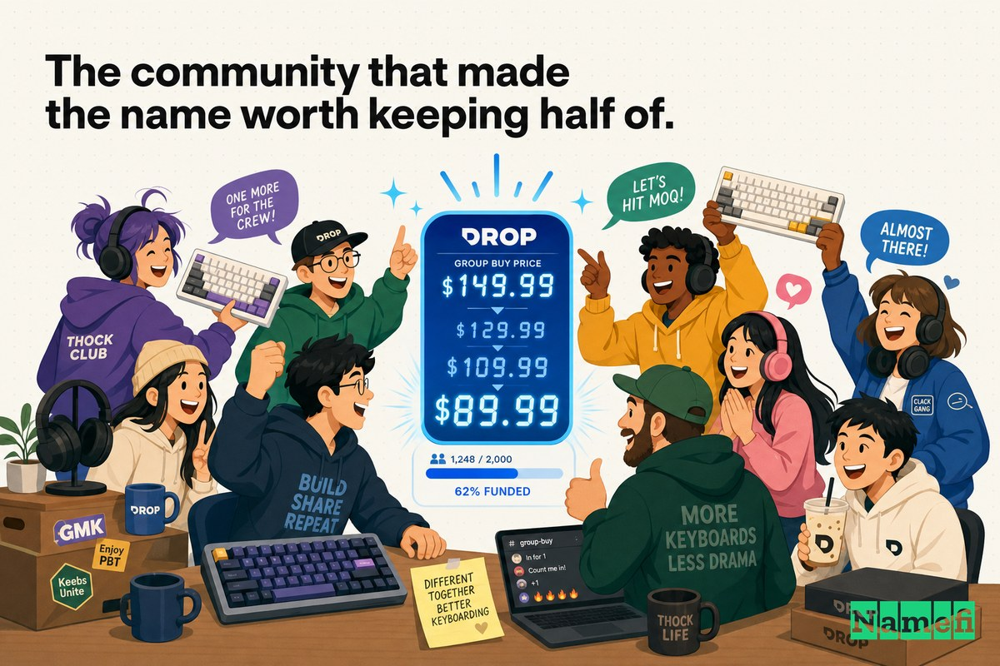
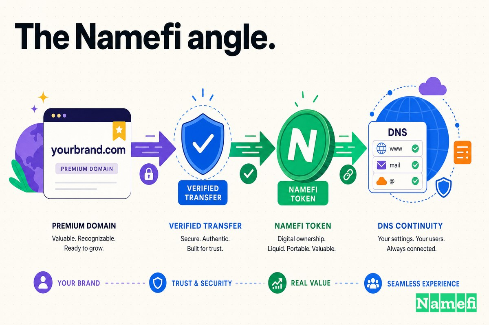

தனது முதல் ஏழு ஆண்டுகளில், இணையத்தின் மிகவும் விரும்பப்பட்ட ஆர்வலர் சமூகங்களில் ஒன்று, தான் என்ன செய்தது என்பதைத் துல்லியமாக விளக்கிய முகவரியில் இயங்கியது: **Massdrop.com**.

அந்தப் பெயர் அதன் செயல்முறையையே விவரித்தது. Massdrop *mass drops* எனப்படும் குழு வாங்குதல்களை நடத்தியது. ஒரே குறிப்பிட்ட தயாரிப்பை நூறு இயந்திர விசைப்பலகை ஆர்வலர்களோ ஒலியார்வலர்களோ விரும்பியபோது, Massdrop அவர்களது தேவையை ஒருங்கிணைத்து, உற்பத்தியாளருடன் பேச்சுவார்த்தை நடத்தி, அனைவருக்கும் சிறந்த விலையைப் பெற்றுத் தந்தது. தொடக்க அறிவிப்பு இதை நேரடியாகச் சொன்னது: [Massdrop என்பது ஆர்வலர்களுக்கான ஓர் ஆன்லைன் சமூகம்](https://www.globenewswire.com/news-release/2014/09/24/1201361/0/en/Massdrop-Lands-6-5-Million-to-Empower-Enthusiast-Communities.html?print=1#:~:text=Massdrop%20is%20an%20online%20community%20for%20enthusiasts); அது பல சமூகங்களைச் சேர்ந்தவர்கள் தங்கள் ஆர்டர்களை ஒன்றிணைக்க உதவியது. ஆகவே "Mass" என்ற சொல் உண்மையான பணி செய்தது. இங்கு எதுவும் தனியாக வாங்கப்படுவதில்லை என்பதே அதன் உத்தி என்று அது சொன்னது.

அந்த முதல் பார்வையாளர் குழுவுக்கு Massdrop.com மிகச் சரியானதாக இருந்தது. அது அந்தச் செயல்முறைக்கே பெயரிட்டது.

ஆனால் அந்தப் பெயருக்குப் பின்னால் இருந்த நிறுவனம் தொடர்ந்து மாறிக்கொண்டே இருந்தது. 2019-க்குள் Massdrop, பெரிய அளவிலான ஆர்டர்களை ஒருங்கிணைக்கும் நிறுவனம் மட்டுமல்ல. அது தனது சொந்த விசைப்பலகைகளையும் ஹெட்போன்களையும் வடிவமைத்தது, முழுமையான வணிகத் தளத்தை இயக்கியது, புதிய சந்தைகளுக்குள் நுழையத் தயாரானது. முதல் நாளில் அதன் வணிக மாதிரியை எளிதில் புரியவைத்த "Mass" என்ற சொல், அப்போது அது மாறியிருந்த நிறுவனத்தைவிடச் சிறிய, பழைய நிறுவனத்தையே விவரிக்கத் தொடங்கியது.

எனவே 2019 ஏப்ரலில், வளர்ந்து வரும் பல நிறுவனங்கள் இறுதியில் செய்வதையே Massdrop செய்தது: தனது பெயரின் பாதியை நீக்கியது. அது வெறுமனே **Drop** ஆனது; முன்கூட்டியே அமைதியாகப் பெற்றிருந்த [துல்லியப் பொருத்த டொமைனுக்கு](/ta/glossary/exact-match-domain/) மாறியது—ஒருகாலத்தில் [$800,000 கேட்பு விலை கொண்டிருந்த](https://domaininvesting.com/massdrop-rebrands-as-drop-with-drop-com-domain-name/#:~:text=the%20asking%20price%20for%20Drop.com%20was%20%24800%2C000) பிரீமியம் ஓர்ச்சொல் [.com](/ta/tld/com/) ஆன **Drop.com**.

## 2012–2019: உண்மையான பணி செய்த "Mass"

தொடக்கத்தில் "Mass" என்பது குறையல்ல; ஒரு சிறப்பம்சம்.

Steve El-Hage, Nelson Wu, Will Bright ஆகியோர் 2012 ஜூலையில் Massdrop-ஐ நிறுவினர். பொழுதுபோக்கு ஆர்வலர்களுக்கான இணையக் கருத்துக்களங்களில் வளர்ந்த அந்த நிறுவனர்கள், ஒரு செயல்திறனின்மையைக் கவனித்தனர்: ஆர்வலர்கள் ஏற்கெனவே ஒன்றாக வாங்க முயன்றுகொண்டிருந்தனர்; ஆனால் அது முறையாக நடைபெறவில்லை. ஓர் ஆரம்பகால விவரிப்பின்படி, [100 ஆர்வலர்களை ஒன்றாக வாங்கச் செய்து, குழு வாங்குதலைப் பெற ஒரு விற்பனையாளரிடம் அந்த ஆர்டரைச் சமர்ப்பிக்கும் செயல் தற்காலிகமான, ஒழுங்கற்ற முறையில் நடந்துகொண்டிருந்தது](https://vator.tv/news/2014-09-24-massdrop-lands-65m-for-group-buying-among-enthusiasts). அந்த ஒழுங்கற்ற பழக்கத்தை Massdrop ஒரு தயாரிப்பாக மாற்றியது.

அந்தச் செயல்முறையே முழுப் பிராண்டாக இருந்தது. Series A நிதி திரட்டியபோது நிறுவனம் விளக்கியபடி, [ஆர்வலர்கள் ஒன்றாக வாங்க விரும்பும் தயாரிப்புகளைத் தீர்மானிக்க Massdrop-இன் வாக்கெடுப்பு மற்றும் கலந்துரையாடல் அமைப்புகளைப் பயன்படுத்துகிறார்கள். பின்னர் Massdrop சமூகத்தின் சார்பாக உற்பத்தியாளர்களை நேரடியாகத் தொடர்புகொண்டு, சிறந்த விலைகளைப் பேசி, சரக்குப் போக்குவரத்தை ஒருங்கிணைக்கிறது](https://www.globenewswire.com/news-release/2014/09/24/1201361/0/en/Massdrop-Lands-6-5-Million-to-Empower-Enthusiast-Communities.html?print=1#:~:text=Enthusiasts%20use%20Massdrop%E2%80%99s%20polling%20and%20discussion%20systems). நிறுவனர்கள் தங்கள் அடிப்படைக் கருத்தை ஒரே வரியில் சுருக்கினர்: [மக்கள் சமூகங்களை ஒன்றிணைத்து, அவர்கள் அக்கறை கொண்ட தயாரிப்புகளை கூட்டாகக் கண்டறிந்து வாங்கச் செய்யும் எளிய எண்ணத்துடன் நாங்கள் Massdrop-ஐத் தொடங்கினோம்](https://www.globenewswire.com/news-release/2014/09/24/1201361/0/en/Massdrop-Lands-6-5-Million-to-Empower-Enthusiast-Communities.html?print=1#:~:text=We%20started%20Massdrop%20with%20the%20simple%20idea).

அது வெற்றியடைந்தது. 2014 செப்டம்பருக்குள், Mayfield Fund தலைமையிலான [Series A நிதிச் சுற்றில் Massdrop $6.5 மில்லியனைத் திரட்டியது](https://www.globenewswire.com/news-release/2014/09/24/1201361/0/en/Massdrop-Lands-6-5-Million-to-Empower-Enthusiast-Communities.html?print=1#:~:text=closed%20%246.5%20million%20in%20a%20Series%20A%20round%20of%20financing); 2015 ஆகஸ்டில் $40 மில்லியன் Series B நிதியையும் திரட்டியது. அதை வரையறுத்த சமூகங்கள்—குறிப்பாக [இயந்திர விசைப்பலகை மற்றும் ஒலியார்வலர் சமூகங்கள்](https://en.wikipedia.org/wiki/Drop_(company)#:~:text=mechanical%20keyboard%20and%20audiophile%20communities)—Massdrop-ஐ தீவிர விசுவாசமுள்ள ரசிகர்களைக் கொண்ட பிராண்டாக மாற்றின. மக்கள் அங்கு பொருட்களை வாங்க மட்டும் வரவில்லை. அவர்கள் கவனித்துப் படித்தனர், வாக்களித்தனர், விசைகளின் தொடு உணர்வு மற்றும் ஹெட்போன் மின்மறுப்பு குறித்து விவாதித்தனர், ஒரு drop அனுப்பப்படுவதற்காக வாரக்கணக்கில் காத்திருந்தனர்.

ஆனால் அதன் இலக்கு அந்தப் பெயரைக் கடந்து தொடர்ந்து விரிவடைந்தது. மற்றவர்களின் தயாரிப்புகளை மட்டும் குழு வாங்குதல்களாக Massdrop விற்பனை செய்யவில்லை. தனது சொந்தத் தயாரிப்புகளையும் உருவாக்கியது.

## ஏப்ரல் 2019: "Mass"-ஐ நீக்கி, Drop.com-ஐப் பெறுதல்

2019 ஏப்ரல் 29 அன்று நிறுவனம் அந்த மாற்றத்தை வெளியிட்டது. Notebookcheck அதைத் தெளிவாகப் பதிவு செய்தது: [Massdrop தனது மறுபிராண்டிங்கை வெளியிட்டுள்ளது. வணிகத்தின் பெயரை Drop என மாற்ற முடிவு செய்துள்ளது](https://www.notebookcheck.net/Massdrop-becomes-Drop-announces-new-range-of-own-brand-products.419780.0.html#:~:text=Massdrop%20has%20unveiled%20its%20rebrand.%20It%20has%20decided%20to%20change%20the%20business%E2%80%99%20name%20to%20Drop).

தொடக்கச் செயல்முறையைத் தாண்டி நிறுவனம் வளர்ந்ததே இதற்கான காரணம் என்று அது வெளிப்படையாகச் சொன்னது. CEO Steve El-Hage இதை நேரடியாகக் கூறினார்: [நாங்கள் வெறும் குழு வாங்கும் தளமாக இருந்தபோது Massdrop என்ற பெயர் தோன்றியது; ஆனால் இப்போது நாங்கள் அதைவிடப் பல மடங்கு பெரியவர்கள்](https://audioxpress.com/news/massdrop-announces-name-change-to-drop#:~:text=The%20name%20Massdrop%20originated%20when%20we%20were%20just%20a%20group-buying%20site). நிறுவனத்தின் வளர்ச்சியைக் குறிக்கும் அடையாளமாக அவர் இந்தப் பெயர் மாற்றத்தை விவரித்தார்: [2012 தொடக்கத்திலிருந்து, குழு வாங்கும் தளத்திலிருந்து வணிகத் தளமாக நாங்கள் வளர்ந்த விதத்தை இந்தப் புதிய பிராண்ட் பிரதிபலிக்கிறது](https://audioxpress.com/news/massdrop-announces-name-change-to-drop#:~:text=this%20new%20brand%20reflects%20how%20we%E2%80%99ve%20evolved%20since%20our%20beginnings%20in%202012). நிறுவனத்தின் சொந்தச் செய்தி வெளியீடு புதிய Drop-ஐ, [அடுத்த நிலைத் தயாரிப்புகளை உருவாக்க ஆர்வலர்களிடமிருந்து பெறும் தரவுகளையும் நுண்ணறிவுகளையும் பயன்படுத்தும்](https://www.prnewswire.com/news-releases/massdrop-evolves-brand-to-become-drop-launches-new-user-experience-to-enable-passions-and-products-300839436.html#:~:text=uses%20data%20and%20insights%20from%20enthusiasts%20to%20develop%20next-level%20products) வணிகமாக விவரித்தது—தள்ளுபடியை ஏற்பாடு செய்யும் அமைப்பல்ல, ஒரு தயாரிப்பு நிறுவனம்.

முக்கியமாக, அந்த டொமைன் ஏற்கெனவே அதன் வசம் இருந்தது. DomainInvesting பதிவிட்டபடி, [Drop என மறுபிராண்டிங் செய்வதாக Massdrop அறிவித்தது; புத்திசாலித்தனமாக, மறுபிராண்டிங்கிற்கு முன்னரே பொருந்தக்கூடிய Drop.com டொமைன் பெயரை நிறுவனத்தால் கையகப்படுத்த முடிந்தது](https://domaininvesting.com/massdrop-rebrands-as-drop-with-drop-com-domain-name/#:~:text=able%20to%20acquire%20the%20matching%20Drop.com%20domain%20name%20in%20advance%20of%20the%20rebrand). வழிமாற்றமும் தொடர்ந்தது: [Massdrop.com இப்போது Drop.com-க்கு வழிமாற்றப்படுகிறது](https://smartbranding.com/massdrop-rebrands-to-drop/#:~:text=Massdrop.com%20now%20directs%20to%20Drop.com) என்று Smart Branding குறிப்பிட்டது; நிறுவனம் [@Drop Twitter மற்றும் Instagram பயனர்பெயர்களையும் பெற முடிந்தது](https://domaininvesting.com/massdrop-rebrands-as-drop-with-drop-com-domain-name/#:~:text=managed%20to%20secure%20the%20%40Drop%20Twitter%20and%20Instagram%20handles).

நான்கு எழுத்துகளைக் கொண்ட துல்லியப் பொருத்த `.com`, அதற்குப் பொருந்தும் சமூக ஊடகப் பயனர்பெயர்கள்—பெயர் பொதுவில் வெளியாவதற்கு முன்பே அனைத்தும் தயாராக இருந்தன. அது அதிர்ஷ்டமல்ல. மறுபிராண்டிங்கின் முழுச் சுமையையும் தாங்கும் பகுதி டொமைனே என்பதைப் புரிந்துகொண்ட நிறுவனத்தின் செயல் அது.

## பின்னணி: ஒருபோதும் மலிவாகக் கிடைக்க வாய்ப்பில்லாத ஓர்ச்சொல் .com

இந்த வழக்கைச் சுவாரசியமாக்குவது, பொதுவாக அமைதியாகக் கைமாறாத வகையைச் சேர்ந்த டொமைனே Drop.com என்பதுதான்.

இது ஓரசை, பொதுவான ஓர் ஆங்கிலச் சொல், நான்கு எழுத்துகள், `.com` பெயர்வெளி. இத்தகைய பெயர்கள் உரிமைகோரப்படாமல் கிடப்பதில்லை; விற்க வேண்டிய அவசியமில்லாதவர்களின் தொகுப்புகளில் இருக்கும். கடைசியாகப் பொதுவில் கிடைத்த பதிவின்படி, [Drop Inc. என்ற நிறுவனத்துக்குச் சொந்தமாக அந்த டொமைன் பெயர் இருந்தது](https://domaininvesting.com/massdrop-rebrands-as-drop-with-drop-com-domain-name/#:~:text=the%20domain%20name%20had%20been%20owned%20by%20a%20company%20called%20Drop%20Inc) என்று DomainInvesting குறிப்பிட்டது—அதற்கு முன்பு, 2017 பிப்ரவரியில், அது [$800,000 கேட்பு விலையில் பட்டியலிடப்பட்டிருந்தது](https://domaininvesting.com/massdrop-rebrands-as-drop-with-drop-com-domain-name/#:~:text=the%20asking%20price%20for%20Drop.com%20was%20%24800%2C000).

Massdrop உண்மையில் செலுத்திய தொகை பொதுவில் தெரியவில்லை. அந்த டொமைன் தனியுரிமைப் பாதுகாப்புக்குப் பின்னால் மறைந்தது: [2017 ஆகஸ்டிலிருந்து GoDaddy-இல் Drop.com டொமைனுக்கான Whois தனியுரிமை இயக்கப்பட்டுள்ளது](https://domaininvesting.com/massdrop-rebrands-as-drop-with-drop-com-domain-name/#:~:text=Whois%20privacy%20enabled%20at%20GoDaddy%20since%20August%20of%202017). அதனால் கையகப்படுத்திய துல்லியமான தேதியையும் விலையையும் வெளியில் இருந்து உறுதிப்படுத்த முடியாது. ஆனால் காலவரிசை அதன் சொந்தக் கதையைச் சொல்கிறது: $800,000 கேட்பு விலை 2017 தொடக்கத்தில் வெளிவந்தது; 2017 ஆகஸ்டில் டொமைன் தனியுரிமைக்குப் பின்னால் சென்றது; 2019 ஏப்ரலில் மறுபிராண்டிங் நடந்தது. அந்தக் கால இடைவெளியில் எப்போதோ, குழு வாங்கும் நிறுவனம் தான் மாறவிருந்த சொல்லை அமைதியாகப் பெற்றது.

## அப்போது பணத்தின் தோற்றம் வேறாக இருந்தது

ஓர்ச்சொல் `.com` கையகப்படுத்தலை இன்று திரும்பிப் பார்த்து, அது எளிதான முடிவு என்று சொல்வது இயல்பாகத் தோன்றலாம். Drop பின்னர் தனது சொந்த விசைப்பலகைகளையும் ஹெட்போன்களையும் விற்பனை செய்தது, சர்வதேச அளவில் விரிவடைந்தது, இறுதியில் [2023 ஜூலையில் Corsair-ஆல் கையகப்படுத்தப்பட்டது](https://en.wikipedia.org/wiki/Drop_(company)#:~:text=Corsair%20announced%20it%20had%20acquired%20Drop). ஆனால் Drop.com-க்கு உண்மையில் செலுத்தப்பட்ட தொகை ஒருபோதும் வெளியிடப்படவில்லை; எனவே அதற்கு முன்பு இருந்த $800,000 கேட்பு விலையை Massdrop செலுத்திய தொகையாகக் கருத முடியாது.

ஆனால் அந்தச் செலவை கதையின் இறுதியில் இருந்து அல்ல, அது செய்யப்பட்ட தருணத்தில் வைத்து மதிப்பிட வேண்டும்.

2017 மற்றும் 2018-இல் Drop இன்னும் Massdrop என்றே இருந்தது—லாப வரம்புகள், சரக்குப் போக்குவரத்து, தனது முதல் சொந்தத் தயாரிப்புகளுக்கான இருப்புச் சரக்கு முடிவுகள் ஆகியவற்றைச் சார்ந்திருந்த, துணிகர முதலீடு பெற்ற சமூக வணிக நிறுவனம். விற்பனை விலை வெளியிடப்படாததால், டொமைனுக்காகச் செலவிட்ட தொகை எவ்வளவு பெரியது என்று நமக்குத் தெரியாது. $800,000-க்கு பொதுவில் விற்பனைக்கு வைக்கப்பட்டிருந்த ஓர்ச்சொல் `.com`-க்காகப் பேச்சுவார்த்தை நடத்தும்போது, அந்த முகவரியின் மதிப்பை பொறியியல், இருப்புச் சரக்கு, தயாரிப்புக் கருவிகள் ஆகியவற்றோடு நிறுவனம் ஒப்பிட்டுப் பார்க்க வேண்டியிருந்தது—மேலும் வரவிருப்பதாக ஏற்கெனவே முடிவு செய்திருந்த பெயர் மாற்றத்திற்கான உள்கட்டமைப்பாக டொமைனை நடத்த வேண்டியிருந்தது என்று மட்டும் சொல்லலாம்.

அந்த வரிசைதான் இதை வெளிப்படுத்துகிறது. இனி எந்த வகையிலும் "Mass" ஆக இருக்கக் கூடாது என்று அறிவிப்பதற்கு முன்னரே நிறுவனம் Drop.com-ஐப் பெற்றது—குறுகிய அந்த அடையாளத்தை உண்மையாக்க, குறுகிய பெயரை முதலில் சொந்தமாக்குவது மட்டுமே வழியாக இருந்தது.

## "Drop" எனச் சுருக்கியது ஏன் முக்கியமானது

Massdrop.com-க்கும் Drop.com-க்கும் இடையிலுள்ள இடைவெளி ஒரே ஒரு முன்னொட்டுதான். உத்திசார் வகையில், அது ஒரு *செயல்முறைக்கும்* ஒரு *பிராண்டுக்கும்* இடையிலுள்ள வேறுபாடு.

**Massdrop.com** அது எப்படிச் செயல்பட்டது என்பதை விவரிக்கிறது: *mass* + *drop*, அதாவது குழு வாங்குதல். **Drop.com** நிறுவனம் எதுவாக மாறியதோ அதற்குப் பெயரிடுகிறது: பிராண்டை ஒரே கொள்முதல் முறைக்குள் கட்டிப்போடாத, சொந்தமாக்கக்கூடிய ஒற்றைச் சொல். நிறுவனமே இதைக் கூறியது—பழைய பெயர் [நாங்கள் வெறும் குழு வாங்கும் தளமாக இருந்தபோது தோன்றியது](https://audioxpress.com/news/massdrop-announces-name-change-to-drop#:~:text=The%20name%20Massdrop%20originated%20when%20we%20were%20just%20a%20group-buying%20site); 2019-க்குள் குழு வாங்குதல் அதன் முழுக் கதையாக இல்லை.

| முன்பு | பிறகு |
| --- | --- |
| Massdrop.com | Drop.com |
| ஒரு செயல்முறையை விவரிக்கிறது (mass + drop) | வளர்ச்சிக்கு உச்சவரம்பில்லாத ஒரு பிராண்டுக்குப் பெயரிடுகிறது |
| குழு வாங்குதலுடன் பிணைக்கப்பட்டுள்ளது | வணிகம் மற்றும் சொந்தப் பிராண்ட் தயாரிப்புகள் முழுவதிலும் இயங்குகிறது |
| எட்டு எழுத்துகள், இரண்டு கருத்துகள் | நான்கு எழுத்துகள், ஒரு கருத்து |
| ஒரு சிறப்பம்சத்தின் பெயர் போலத் தெரிகிறது | ஒரு நிறுவனத்தின் பெயர் போலத் தெரிகிறது |

டொமைன் மேம்பாடுகளில் மீண்டும் மீண்டும் தோன்றும் அதே முறை இதுதான்: தொடக்கப் பெயர்கள் *விளக்குகின்றன*; மிகச் சிறந்த பெயர்கள் *சொந்தமாக்குகின்றன*. ஒரு நிறுவனம் தான் எப்படிச் செயல்படுகிறது என்று இன்னும் கற்றுக்கொடுக்க வேண்டியிருக்கும்போது விளக்கமான பதிப்பு உதவுகிறது. மக்கள் ஏற்கெனவே சொல்லும் சொல்லாகவே நிறுவனம் தயாரானபோது, துல்லியப் பொருத்தப் பதிப்பு உதவுகிறது. "Drop" என்பது சமூகம் தொடர்ந்து பயன்படுத்திய சொல்—ஒவ்வொரு குழு வாங்குதலும் ஒரு *drop*—எனவே குறுகிய பெயர் அதன் பாரம்பரியத்தைக் கைவிடவில்லை. அதைச் செறிவாக்கியது.

## பெயரின் பாதியைத் தக்கவைக்கச் செய்த சமூகம்

ஒரு வழக்கமான ஸ்டார்ட்அப் பெயர் மாற்றத்திலிருந்து இந்த மறுபிராண்டிங்கை வேறுபடுத்தும் விவரம் இதுதான்: நிறுவனம் சுருக்கிய பிராண்டை அதன் பயனர்கள் உண்மையாகவே நேசித்தனர்.

Massdrop விளம்பரத்தின் மூலம் வளரவில்லை. அடையாள உணர்வின் மூலம் வளர்ந்தது. அதன் உறுப்பினர்கள் செயலற்ற வாடிக்கையாளர்கள் அல்ல; [கருத்துக்களங்கள் மற்றும் வாக்கெடுப்புகள் மூலம் விற்பனைக்குத் தேர்ந்தெடுக்கப்படும் தயாரிப்புகளில் செல்வாக்கு செலுத்தும்](https://en.wikipedia.org/wiki/Drop_(company)#:~:text=influence%20the%20products%20chosen%20to%20be%20sold%20through%20forums%20and%20polls) பங்கேற்பாளர்கள். குறிப்பாக இயந்திர விசைப்பலகை மற்றும் ஒலியார்வலர் சமூகங்களுக்கு ஒரு "drop" என்பது ஒரு நிகழ்வு—பக்கத்தை மீண்டும் மீண்டும் புதுப்பித்துப் பார்க்கவும், விவாதிக்கவும், வாரக்கணக்கில் காத்திருக்கவும் வேண்டிய ஒன்று. "Drop" என்ற சொல் ஏற்கெனவே சமூகத்தின் சொந்தச் சொல்லாக இருந்தது.

எனவே நிறுவனம் "Mass" என்பதை வெட்டி "Drop" என்பதைத் தக்கவைத்தபோது, பிராண்டைத் தூக்கி எறியவில்லை. உணர்வைத் தாங்கிய பாதியை வைத்துக்கொண்டு, பின்னணிச் செயல்முறையை மட்டும் விவரித்த பாதியை நீக்கியது. செய்தி வெளியீடும் இதே தொடர்ச்சியை வலியுறுத்தியது; புதிய Drop-ஐ, [அடுத்த நிலைத் தயாரிப்புகளை உருவாக்க ஆர்வலர்களிடமிருந்து பெறும் தரவுகளையும் நுண்ணறிவுகளையும் பயன்படுத்தும்](https://www.prnewswire.com/news-releases/massdrop-evolves-brand-to-become-drop-launches-new-user-experience-to-enable-passions-and-products-300839436.html#:~:text=uses%20data%20and%20insights%20from%20enthusiasts) நிறுவனமாக முன்வைத்தது—அதே சமூகம், ஒன்றிணைய ஒரு குறுகிய பெயரைப் பெற்றது.

ஒரு நல்ல பெயர் மாற்றத்தின் நுட்பமான கலை அதுதான்: உங்களைக் கட்டுப்படுத்தும் சொல்லை நீக்குங்கள்; உங்கள் பயனர்கள் ஏற்கெனவே முழங்கும் சொல்லைத் தக்கவையுங்கள்.

## காலவரிசை: முதலில் டொமைன், அடுத்து பெயர் மாற்றம்

நிகழ்வுகளின் வரிசைதான் இந்த வழக்கை பயனுள்ள பாடமாக்குகிறது.

Drop.com-க்கான $800,000 கேட்பு விலை 2017 தொடக்கத்தில் வெளிவந்தது. [2017 ஆகஸ்டில்](https://domaininvesting.com/massdrop-rebrands-as-drop-with-drop-com-domain-name/#:~:text=Whois%20privacy%20enabled%20at%20GoDaddy%20since%20August%20of%202017) டொமைன் [WHOIS](/ta/glossary/whois/) தனியுரிமைக்குப் பின்னால் சென்றது. Drop எனும் பெயருக்கான பொதுவெளி மறுபிராண்டிங் [2019 ஏப்ரல் 29](https://www.notebookcheck.net/Massdrop-becomes-Drop-announces-new-range-of-own-brand-products.419780.0.html#:~:text=29%20April%2C%202019) வரை நடைபெறவில்லை. விலை உயர்ந்த, வெளித் தரப்புக்குச் சொந்தமான சொத்து, பெயர் நடைமுறைக்கு வருவதற்கு வெகுகாலம் முன்பே பாதுகாக்கப்பட்டது.

இங்குள்ள சார்பை கவனியுங்கள். தனது இணையதளம் Massdrop.com-இல் இருக்க, வேறொருவர் Drop.com-ஐச் சொந்தமாக வைத்திருக்கும்போது, Massdrop நம்பகமாக "Drop" ஆக முடியாது. பிராண்ட், சமூக ஊடகப் பயனர்பெயர்கள், டொமைன் ஆகிய அனைத்தும் ஒன்றாக மாற வேண்டியிருந்தது—அதில் நிறுவனத்தின் கட்டுப்பாட்டில் மிகவும் குறைவாக இருந்தது டொமைனே; ஏனெனில் அதற்கு விலையும் உரிமையாளரும் இருந்தனர். Drop.com-ஐயும் @Drop பயனர்பெயர்களையும் பாதுகாத்ததே, ஒரே அறிவிப்பில் மாற்றத்தைச் செயல்படுத்த நிறுவனத்தை அனுமதித்தது; முதல் நாளிலிருந்தே [Massdrop.com இப்போது Drop.com-க்கு வழிமாற்றப்பட்டது](https://smartbranding.com/massdrop-rebrands-to-drop/#:~:text=Massdrop.com%20now%20directs%20to%20Drop.com).

மாற்று நிலையை நினைத்துப் பாருங்கள்: இப்போது நீங்கள் "Drop" என்று அறிவித்தபோதும் வாடிக்கையாளர்கள் Massdrop.com-ஐத் தட்டச்சு செய்கிறார்கள்; குறுகிய பெயர் ஓர் அந்நியருக்குச் சொந்தமான நிறுத்திவைக்கப்பட்ட பக்கத்தைக் காட்டுகிறது. அந்தப் பொருத்தமின்மை பெயர் மாற்றத்தின் முழு நோக்கத்தையும் பலவீனப்படுத்தியிருக்கும். டொமைன் என்பது மறுபிராண்டிங்கின் மேல் வைத்த அலங்காரம் அல்ல. அதற்கான முன்நிபந்தனை.

## டொமைன் செயல்பாட்டு அமைப்பின் ஒரு பகுதியாக மாறியது

பிரீமியம் டொமைன்கள் கௌரவத்தின் அடையாளமாகத் திகழ்வதற்காக அல்ல. மீண்டும் மீண்டும் பயன்படுத்தப்படுவதற்காக.

சந்தைப்படுத்தல் குழு நேரடியாகக் கட்டுப்படுத்தாத பல இடங்களில் ஒரு நிறுவனத்தின் முக்கிய டொமைன் தோன்றுகிறது:

- ஒவ்வொரு ஆர்டர் உறுதிப்படுத்தலிலும் அனுப்புதல் மின்னஞ்சலிலும்.
- சமீபத்திய drop குறித்த சமூகக் கருத்துக்களப் பதிவுகளிலும் Reddit இழைகளிலும்.
- ஊழியர் மின்னஞ்சல் முகவரிகளிலும் கையொப்பங்களிலும்.
- தேடல் முடிவுகளிலும் உலாவி முகவரிப் பட்டைகளிலும்.
- ஓர் ஆர்வலரிடமிருந்து மற்றொருவருக்குச் செல்லும், "அதை நான் Drop-இல் வாங்கினேன்" என்ற ஒவ்வொரு வாய்மொழிப் பரிந்துரையிலும்.

அந்த ஒவ்வொரு மறுபயன்பாடும் உராய்வைச் சேர்க்கிறது அல்லது நீக்குகிறது. Massdrop.com ஒவ்வொரு குறிப்பையும் நீளமாக்கி, குழு வாங்கும் செயல்முறையோடு அதைப் பிணைத்தது. Drop.com ஒவ்வொரு குறிப்பையும் குறுகியதாகவும் தெளிவாகவும், எந்த ஒரு கொள்முதல் முறையிலிருந்தும் விடுபட்டதாகவும் மாற்றியது. கோடிக்கணக்கான உறுப்பினர்களிடமும், தனது வாங்குதல்களைப் பற்றி தொடர்ந்து பேசும் சமூகத்திடமும் இதைப் பெருக்கிப் பார்த்தால், டொமைனுக்கான செலவு ஆடம்பரமாகத் தெரியாமல், நிரந்தரமாக உராய்வைக் குறைக்கும் முதலீடாகத் தெரிகிறது.

Drop-இன் சமூகத்தை டொமைன் உருவாக்கவில்லை. ஆனால் Drop.com முகவரியாக மாறிய பிறகு, பிராண்டைப் பற்றிய ஒவ்வொரு எதிர்காலக் குறிப்பும் தெளிவான, குறுகிய அடித்தளத்தின் மீது கூட்டு மதிப்பைச் சேர்த்தது—கூட்டுச் சொல்லுக்குப் பதிலாக ஒற்றைச் சொல்; சுமந்து செல்ல "Mass" இல்லாமல்.

## வழக்கு 9-இலிருந்து நிறுவனர்கள் கற்றுக்கொள்ள வேண்டியது

எளிய முடிவு—"உங்கள் பெயரைச் சுருக்கி நான்கு எழுத்து .com-ஐ வாங்குங்கள்"—மிகவும் பொதுப்படையானது. பெரும்பாலான நிறுவனர்களால் ஓர்ச்சொல் .com-ஐ வாங்க முடியாது; பெரும்பாலானவர்கள் முதல் நாளிலேயே அதை முயலவும் கூடாது. நேரம் மற்றும் தொடர்ச்சி குறித்த பாடங்களே மிகவும் பயனுள்ளவை:

1. **விளக்கமான பெயர் ஒரு சிறந்த தொடக்கப் பாதை.** Massdrop.com ஏழு ஆண்டுகள் உண்மையான பணி செய்தது: அந்நியர்களுடன் உங்கள் ஆர்டரை ஒன்றிணைத்து விலையைக் குறைப்பது என்ற அறிமுகமில்லாத கருத்தை உடனடியாகப் புரியவைத்தது. "Massdrop", "UberCab", "TeslaMotors" போன்ற விளக்கமான கூட்டுப் பெயர் தோல்வியல்ல; நியாயமான தொடக்கப் புள்ளி.
2. **விளக்கம் உச்சவரம்பாக மாறும் தருணத்தைக் கவனியுங்கள்.** மேம்படுத்துவதற்கான அறிகுறி அழகியல் அல்ல. நீங்கள் மாறியுள்ள நிறுவனத்தைவிடக் குறுகிய அல்லது பழைய நிறுவனத்தை உங்கள் பெயர் விவரிக்கும் தருணமே அந்த அறிகுறி. Massdrop-க்கு, குழு வாங்குதல்களை ஒருங்கிணைப்பதிலிருந்து தனது சொந்தத் தயாரிப்புகளை வடிவமைப்பதற்கான மாற்றமே அது.
3. **உங்கள் பயனர்கள் ஏற்கெனவே நேசிக்கும் பாதியைத் தக்கவையுங்கள்.** Drop புதிய சொல்லை உருவாக்கவில்லை. சமூகம் ஏற்கெனவே முழங்கிய சொல்லை வைத்துக்கொண்டு, பின்னணிச் செயல்முறையை மட்டும் விவரித்த சொல்லை நீக்கியது. மிகச் சிறந்த பெயர்ச் சுருக்கம் கைவிடுதல் போலல்லாமல், செறிவாக்கம் போல உணரப்படும்.
4. **பெயர் மாற்றம் பொதுவில் தெரியும்முன் டொமைனைப் பாதுகாத்துக்கொள்ளுங்கள்.** மெதுவாகப் பெற வேண்டிய, விலை உயர்ந்த, வெளித் தரப்புக்குச் சொந்தமான சொத்து—ஒருகாலத்தில் [$800,000 விலை கேட்கப்பட்ட](https://domaininvesting.com/massdrop-rebrands-as-drop-with-drop-com-domain-name/#:~:text=the%20asking%20price%20for%20Drop.com%20was%20%24800%2C000) Drop.com—முதலில் பாதுகாக்கப்பட வேண்டியிருந்தது. நிறுவன அடையாளத்தை ஒரே பிற்பகலில் மாற்றலாம்; டொமைனை வாங்க ஆண்டுகள் ஆகலாம்.

டொமைன் மேம்பாடு Drop-ஐ வெற்றியடையச் செய்யவில்லை. சமூகம், தயாரிப்புத் தரம், செயல்படுத்தல் ஆகியவை அதைவிடப் பெரும் பங்கு வகித்தன. ஆனால் குழு வாங்கும் செயல்முறையிலிருந்து ஒரு பிராண்டாக நிறுவனம் வளர்ந்த மாற்றத்தை Drop.com *பெயரிடக்கூடியதாக* மாற்றியது; யாரும் அதைப் பயன்படுத்துவதற்கு முன்பே அது பாதுகாக்கப்பட வேண்டியிருந்தது.

## Namefi கோணம்

அடிப்படையில் இது, பிராண்டிங் வேடம் அணிந்த ஒரு பரிமாற்றச் சிக்கல்.

உத்திசார் முடிவில் உண்மையில் சந்தேகம் இருக்கவில்லை—அனைவரும் "Drop" என்று அழைத்த நிறுவனத்துக்கே Drop.com சொந்தமாக இருக்க வேண்டும். கடினமானது அந்தச் சொத்தைச் சுற்றியிருந்த அனைத்தும்: பிரீமியம் ஓர்ச்சொல் `.com` உரிமையாளர் ஏற்கக்கூடிய விதிமுறைகளைக் கண்டறிதல், பொதுவில் ஒப்பிடக்கூடிய விற்பனைகள் இல்லாதபோது விலையை ஒப்புக்கொள்ளுதல்—கடைசியாகப் பொதுவில் கிடைத்த அறிகுறி [$800,000 கேட்பு விலை](https://domaininvesting.com/massdrop-rebrands-as-drop-with-drop-com-domain-name/#:~:text=the%20asking%20price%20for%20Drop.com%20was%20%24800%2C000)—[Whois தனியுரிமைக்குப்](https://domaininvesting.com/massdrop-rebrands-as-drop-with-drop-com-domain-name/#:~:text=Whois%20privacy%20enabled%20at%20GoDaddy%20since%20August%20of%202017) பின்னால் கட்டுப்பாட்டைச் சீராக மாற்றுதல், மேலும் செயலில் இருந்த வணிகத் தளத்துக்கும் அதன் விசுவாசமான சமூகத்துக்கும் இடையூறு ஏற்படாமல், பெயர் பொதுவில் வெளியான தருணத்திலேயே வழிமாற்றம் செயல்படுமாறு நேரமிடுதல்.

[Namefi](https://namefi.io) டொமைன்கள் இணையத்துக்கே உரிய சொத்துகளைப் போலச் செயல்பட வேண்டும் என்ற கருத்தை மையமாகக் கொண்டது. டோக்கன் மயமாக்கப்பட்ட உரிமை, DNS-உடன் இணக்கத்தன்மையைத் தக்கவைத்தபடியே டொமைன் கட்டுப்பாட்டைச் சரிபார்க்கவும், மாற்றவும், நவீனப் பணிப்பாய்வுகளில் ஒருங்கிணைக்கவும் எளிதாக்கலாம்—இத்தகைய ஒப்பந்தத்தில் மிகவும் சிக்கலான பகுதிகளை (எது யாருக்குச் சொந்தம் என்பதை நிரூபித்தல், மதிப்பை ஒப்புக்கொள்ளுதல், அதை பாதுகாப்பாக மாற்றுதல்) தெளிவான, தணிக்கை செய்யக்கூடிய பரிவர்த்தனைக்கு நெருக்கமான ஒன்றாக மாற்றலாம். பிரீமியம் ஓர்ச்சொல் டொமைனுக்கு விலை நிர்ணயித்து, பல ஆண்டுகள் நீளும் ஆவணத் தடமும் தனியுரிமைத் திரையும் இல்லாமல் அதைப் பரிமாற்றக்கூடிய எதிர்காலமே, இந்த வழக்கு அமைதியாகக் கடக்க இவ்வளவு முயன்ற உராய்வை நீக்கும் வகையைச் சேர்ந்தது.

எல்லோரும் ஏற்கெனவே "drop" என்றே சொன்னதால் Drop.com இப்போது தவிர்க்க முடியாத முடிவு போலத் தெரிகிறது. ஆனால் பாடம் அதற்கு வெகுமுன்பே பொருந்துகிறது: ஒரு பெயர் வணிகத்தைத் தாங்கப் போகும்போது—குறிப்பாக உங்கள் பழைய பெயரைப் பாதியாக வெட்டும்போது—டொமைன் அலங்காரமல்ல. மாற்றத்தை அறிவிப்பதற்கு முன்பே பாதுகாக்க வேண்டிய பிராண்டின் பகுதி அதுதான்.

## ஆதாரங்களும் மேலதிக வாசிப்பும்

- DomainInvesting.com — [Drop.com டொமைன் பெயருடன் Massdrop, Drop என மறுபிராண்டிங் செய்தது](https://domaininvesting.com/massdrop-rebrands-as-drop-with-drop-com-domain-name/#:~:text=able%20to%20acquire%20the%20matching%20Drop.com%20domain%20name%20in%20advance%20of%20the%20rebrand)
- Smart Branding — [Massdrop, Drop என மறுபிராண்டிங்: தனித்துறைத் தளத்திலிருந்து உலகளாவிய பிராண்டாக](https://smartbranding.com/massdrop-rebrands-to-drop/#:~:text=Massdrop.com%20now%20directs%20to%20Drop.com)
- PR Newswire — [Massdrop பிராண்டை வளர்த்து Drop ஆனது](https://www.prnewswire.com/news-releases/massdrop-evolves-brand-to-become-drop-launches-new-user-experience-to-enable-passions-and-products-300839436.html#:~:text=uses%20data%20and%20insights%20from%20enthusiasts%20to%20develop%20next-level%20products)
- audioXpress — [Drop எனப் பெயர் மாற்றப்படுவதை Massdrop அறிவித்தது](https://audioxpress.com/news/massdrop-announces-name-change-to-drop#:~:text=The%20name%20Massdrop%20originated%20when%20we%20were%20just%20a%20group-buying%20site)
- Notebookcheck — [Massdrop, Drop ஆனது; புதிய சொந்தப் பிராண்ட் தயாரிப்புகளை அறிவித்தது](https://www.notebookcheck.net/Massdrop-becomes-Drop-announces-new-range-of-own-brand-products.419780.0.html#:~:text=Massdrop%20has%20unveiled%20its%20rebrand.%20It%20has%20decided%20to%20change%20the%20business%E2%80%99%20name%20to%20Drop)
- GlobeNewswire — [ஆர்வலர் சமூகங்களை வலுப்படுத்த Massdrop $6.5 மில்லியன் திரட்டியது](https://www.globenewswire.com/news-release/2014/09/24/1201361/0/en/Massdrop-Lands-6-5-Million-to-Empower-Enthusiast-Communities.html?print=1#:~:text=Enthusiasts%20use%20Massdrop%E2%80%99s%20polling%20and%20discussion%20systems)
- Vator — [ஆர்வலர்களின் குழு வாங்குதலுக்காக Massdrop $6.5M திரட்டியது](https://vator.tv/news/2014-09-24-massdrop-lands-65m-for-group-buying-among-enthusiasts#:~:text=getting%20100%20enthusiasts%20to%20buy%20together)
- Wikipedia — [Drop (நிறுவனம்)](https://en.wikipedia.org/wiki/Drop_(company)#:~:text=mechanical%20keyboard%20and%20audiophile%20communities)
