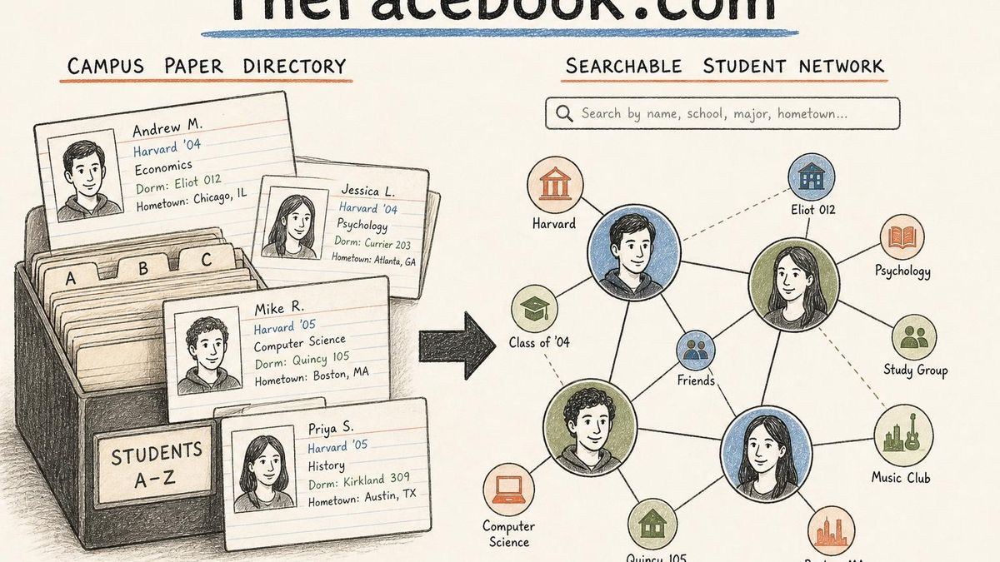
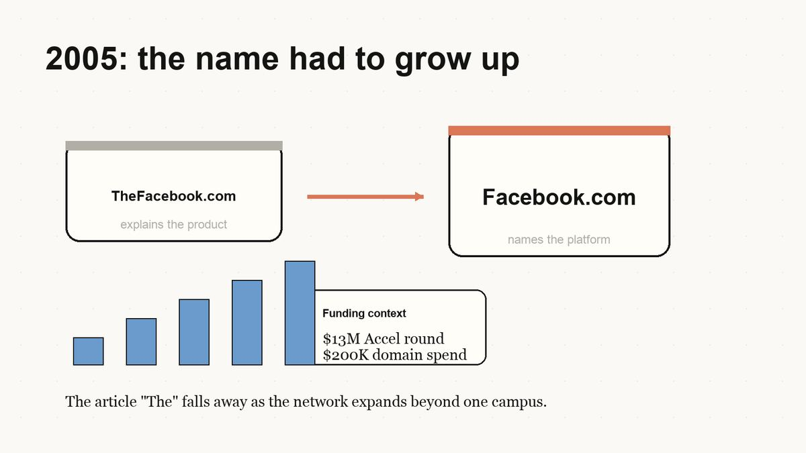
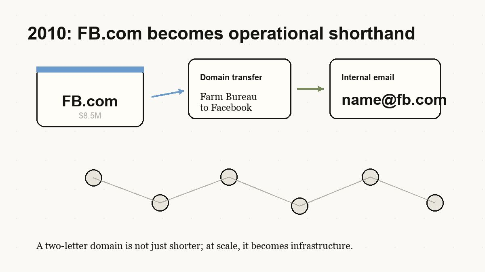
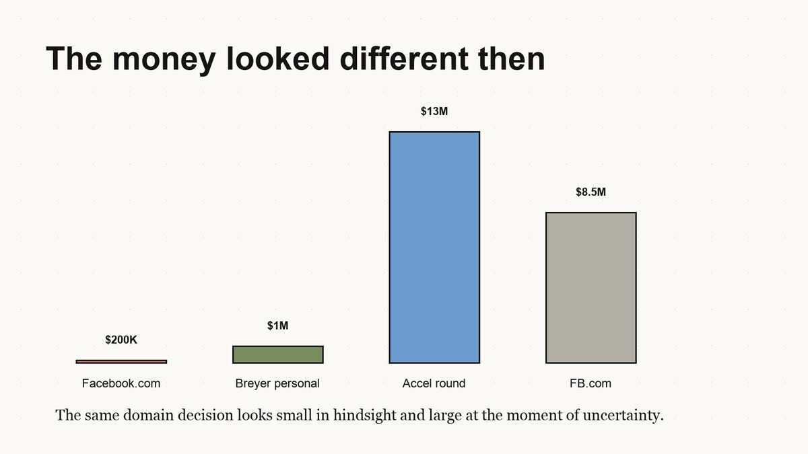
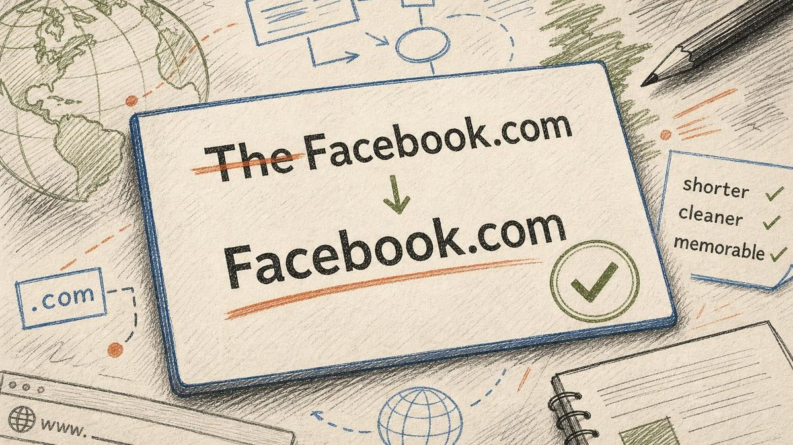
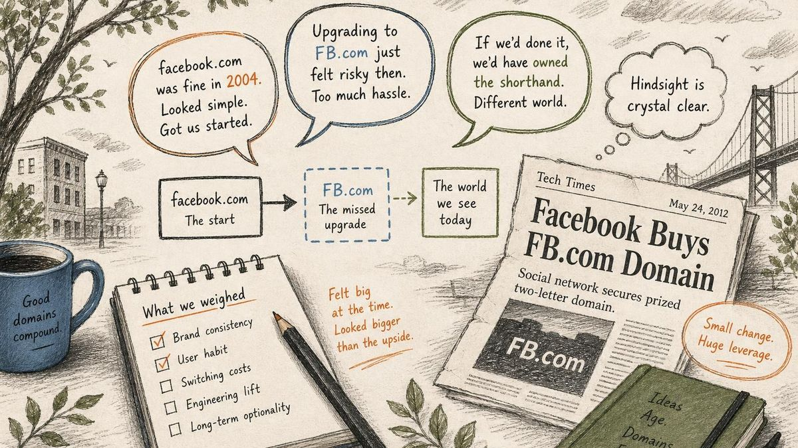
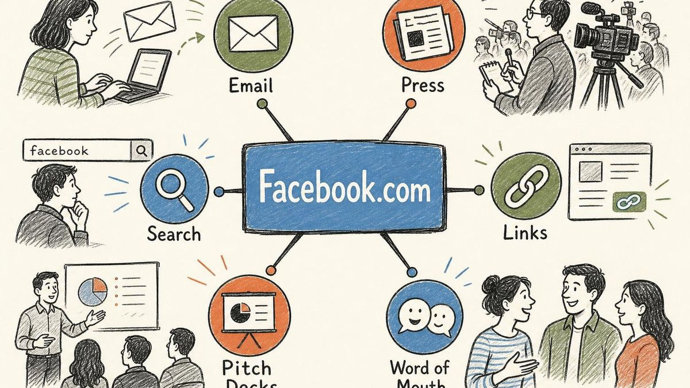
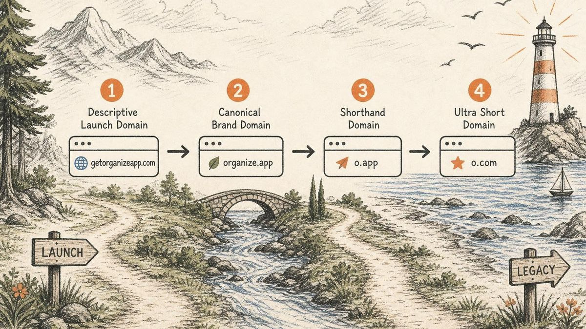
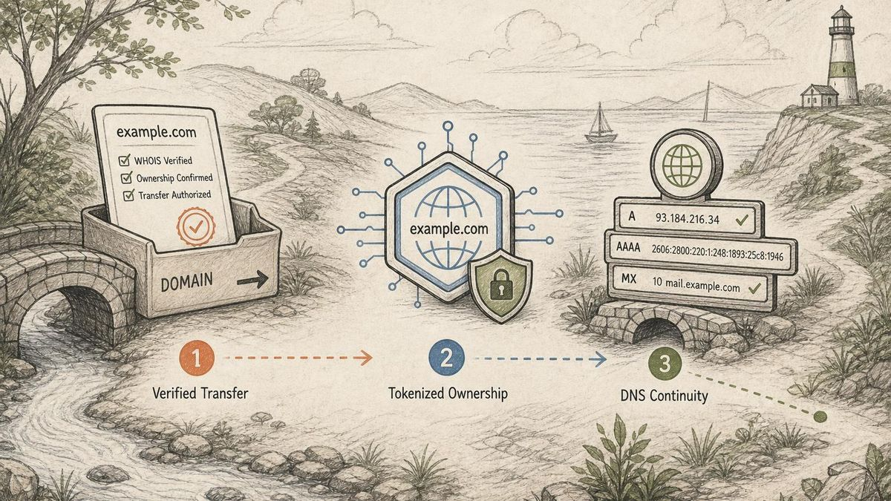

Facebook இணையத்தின் இயல்பான வினைச்சொற்களில் ஒன்றாக மாறுவதற்கு முன்பு, அது குறுகியதும் நேரடிப் பொருளுடையதுமான ஒன்றாக இருந்தது: **TheFacebook.com**.

அந்த முதல் பெயர் பொருத்தமானதே. Mark Zuckerberg [2004 பிப்ரவரி 4 அன்று Harvard-இல் தளத்தைத் தொடங்கியபோது](https://www.thecrimson.com/article/2014/2/4/facebook-ten-years-feature-1/#:~:text=got%20its%20start%20in%20a%20Kirkland%20House%20dorm%20room%20on%20Feb.%204%2C%202004%20as%20an%20internal%20directory%20for%20Harvard%20undergraduates), “facebook” என்பது வளாகத்தில் ஏற்கெனவே பரிச்சயமான ஒரு பொருளாக இருந்தது: [ஒவ்வொரு மாணவரின் புகைப்படத்தையும் அடையாளம் காணும் தகவல்களையும் கொண்ட மாணவர் கையேடு](https://www.newyorker.com/magazine/2006/05/15/me-media#:~:text=known%20as%20the%20%E2%80%9Cfacebook%2C%E2%80%9D%20which%20features%20a%20photograph%20of%20each%20member%2C%20accompanied%20by%20a%20few%20identifying%20facts). அப்போது அந்தத் தயாரிப்பு உலகளாவிய சமூக வரைபடமாக மாற முயலவில்லை. இணையத்திற்கு வெளியே இருந்த கல்லூரி மாணவர் கையேட்டைத் தேடக்கூடியதாகவும், சொடுக்கக்கூடியதாகவும், உயிரோட்டமுள்ளதாகவும் மாற்றவே முயன்றது.

அந்த முதல் பயனர் குழுவுக்கு TheFacebook.com தெளிவாக இருந்தது. தயாரிப்பு என்ன என்பதை அந்தப் பெயரே விளக்கியது.

ஆனால் தயாரிப்பின் இலக்கு, அதன் பெயரை விட வேகமாக மாறியது. 2005-க்குள் Facebook வெறும் Harvard பயன்பாட்டுச் சேவையாக இல்லை. அது [800-க்கும் மேற்பட்ட கல்லூரிகளில் ஏறக்குறைய முப்பது இலட்சம் பதிவு செய்த பயனர்களைக்](https://www.thecrimson.com/article/2005/5/27/firm-invests-13m-in-facebook-a/#:~:text=nearly%20three%20million%20registered%20users%20at%20over%20800%20colleges) கொண்டிருந்தது; பெரிய துணிகர முதலீட்டைத் திரட்டியிருந்தது; சமூக வலைப்பின்னல் எழுச்சியின் நடுவே இன்னும் விரிவான அடையாளத்தை நோக்கி நகர்ந்துகொண்டிருந்தது. அப்போது கூடுதலாக இருந்த “The” என்ற சொல் தொடக்கநிலை சாரக்கட்டு போலத் தோன்றத் தொடங்கியது: தயாரிப்புக்கு விளக்கம் தேவைப்பட்டபோது பயனுள்ளதாகவும், நிறுவனம் முழு வகையையே சொந்தமாக்க விரும்பியபோது இடையூறாகவும் இருந்தது.

எனவே Facebook, **Facebook.com**-ஐ அறிவிக்கப்பட்ட தகவலின்படி **[$200,000-க்கு](https://www.informationweek.com/it-sectors/facebook-paid-8-5-million-for-fb-com#:~:text=Back%20in%20August%202005%2C%20TheFacebook%20purchased%20Facebook.com%20for%20%24200%2C000)** வாங்கி, “The” என்பதை நீக்கியது.

அது வெறும் வெளித்தோற்ற URL சீரமைப்பு அல்ல. ஒரு ஸ்டார்ட்அப், வேகமாகப் பெருகிய வளர்ச்சியைத் தவிர்க்க முடியாத ஒன்றாக மாற்றுவதற்கு [பிரீமியம் டொமைனை](/ta/glossary/premium-domain/) பயன்படுத்திய ஆரம்பகால எடுத்துக்காட்டுகளில் அதுவும் ஒன்று.

கதை அங்கே முடிவடையவில்லை. ஐந்து ஆண்டுகளுக்குப் பிறகு, Facebook அறிவிக்கப்பட்ட தகவலின்படி **[FB.com-க்காக $8.5 மில்லியன்](https://www.nbcbayarea.com/news/local/facebook-paid-big-bucks-to-farm-bureau/1913822/#:~:text=Farm%20Bureau%20officials%20said%20the%20organization%20earned%20%248.5%20million)** செலுத்தியது; பெயரிடல் தொடர்பான ஒரு முடிவாக இருந்த டொமைன் பாடத்தை, போர்ட்ஃபோலியோ உத்தியாக அது மாற்றியது.

## 2004: நேரடிப் பொருளுடைய பெயர் தேவைப்பட்ட வளாக வலைப்பின்னல்

TheFacebook.com வரலாற்றின் ஒரு மிகத் தனித்துவமான தருணத்தில் தொடங்கப்பட்டது. [2004-இன் தொடக்கத்தில் சமூக ஊடகத் துறையின் முன்னணியில் Friendster இருந்தது](https://www.wired.com/2011/02/0204facebook-debuts/#:~:text=Friendster%20was%20the%20social%20media%20leader%20in%20early%202004); MySpace வெகுஜனச் சந்தை ஆதிக்கத்தை நோக்கிய தனது வளர்ச்சியைத் தொடங்கிக்கொண்டிருந்தது. ஆனால் அந்தக் காலத்தின் பெரும்பாலான சமூக வலைப்பின்னல்கள் அனைவருக்கும் திறந்தவையாகவும், ஒழுங்கற்றவையாகவும், உண்மையான அடையாளத்துக்கு குறைந்த முக்கியத்துவம் அளிப்பவையாகவும் இருந்தன.

Facebook-இன் ஆரம்பகால வேறுபாடு இதற்கு நேரெதிரானது: அது கட்டுப்படுத்தப்பட்டதாகவும், கட்டமைக்கப்பட்டதாகவும், உண்மையான வளாக அடையாளத்துடன் இணைக்கப்பட்டதாகவும் இருந்தது.

சுயவிவரங்கள், தேடல், “poking”, நண்பர் இணைப்புகள் ஆகியவற்றை மையமாகக் கொண்ட Harvard சமூக வலைப்பின்னலாக ஆரம்பகாலத் தயாரிப்பை The New Yorker விவரித்தது; முதலில் உறுப்பினர் ஆவதற்கு [Harvard மின்னஞ்சல் முகவரி](https://www.newyorker.com/magazine/2006/05/15/me-media#:~:text=Anybody%20with%20a%20Harvard%20e-mail%20address%20could%20join%20and%20create%20a%20profile) தேவைப்பட்டது. [பிப்ரவரி இறுதிக்குள் Harvard இளங்கலை மாணவர்களில் ஏறக்குறைய நான்கில் மூன்று பங்கினர் சேர்ந்திருந்தனர்](https://www.newyorker.com/magazine/2006/05/15/me-media#:~:text=By%20the%20end%20of%20February%2C%20about%20three-quarters%20of%20the%20undergraduates) என்றும் அதே பதிவு குறிப்பிடுகிறது. ஆரம்பகாலச் சேவை [Harvard இளங்கலை மாணவர்களுக்கான உள் கையேடாக](https://www.thecrimson.com/article/2014/2/4/facebook-ten-years-feature-1/#:~:text=internal%20directory%20for%20Harvard%20undergraduates) இருந்து, விரைவாக வளாக வாழ்க்கையின் ஒரு பகுதியாக மாறியதாக The Harvard Crimson பின்னர் நினைவுகூர்ந்தது.

“The Facebook” என்ற பெயர் ஏதோ தற்செயலாகத் தேர்ந்தெடுக்கப்பட்ட பிராண்டல்ல என்பதால் இந்தப் பின்னணி முக்கியமானது. பயனர்கள் ஏற்கெனவே புரிந்துகொண்ட ஒன்றை அது சுட்டியது. தொடக்க நாட்களில் விளக்கமான ஒரு டொமைன் சாதகமாக இருந்தது:

- இணையத் தயாரிப்பை பரிச்சயமான இணையத்திற்கு வெளியேயுள்ள ஒரு பொருளுடன் அது இணைத்தது.
- இது மாணவர்களுக்கானது, பொதுவான பொது சுயவிவரத் தளம் அல்ல என்பதை உணர்த்தியது.
- முதல் அலை பயனர்களுக்கு தயாரிப்பை விளக்க வேண்டிய செலவைக் குறைத்தது.

TheFacebook.com ஒரு மோசமான டொமைன் அல்ல. முதல் கட்டத்திற்குப் பொருத்தமான டொமைனாக அது இருந்தது: விளக்கமானது, வளாகச் சூழலுக்கு இயல்பானது, வலைப்பின்னல் விளைவைத் தொடங்குவதற்குப் போதுமானது.

## 2005: பெயர் முதிர வேண்டியிருந்தது

2005-க்குள் நிறுவனம் வேறொரு கட்டத்துக்கு நகர்ந்துகொண்டிருந்தது. The Facebook இனியும் மாணவர் விடுதி அறையில் நடந்த பரிசோதனை அல்ல. 15 மாதங்களே ஆன நிறுவனத்தில் [Accel Partners $13 மில்லியன் முதலீடு செய்யும்](https://www.thecrimson.com/article/2005/5/27/firm-invests-13m-in-facebook-a/#:~:text=invest%20%2413%20million%20into%20thefacebook.com) என்று 2005 மே மாதத்தில் The Harvard Crimson செய்தி வெளியிட்டது; அப்போது அது ஏற்கெனவே [800-க்கும் மேற்பட்ட கல்லூரிகளில் ஏறக்குறைய முப்பது இலட்சம் பதிவு செய்த பயனர்களைக்](https://www.thecrimson.com/article/2005/5/27/firm-invests-13m-in-facebook-a/#:~:text=nearly%20three%20million%20registered%20users%20at%20over%20800%20colleges) கொண்டிருந்தது.

அந்த முதலீட்டுச் செய்தி முக்கியமானது; ஏனெனில் டொமைன் வாங்கப்பட்ட சூழலை அது தெளிவுபடுத்துகிறது. இன்று Facebook.com-க்கு $200,000 என்பது மலிவான ஒப்பந்தமாகத் தோன்றுகிறது. 2005-இல், மிகவும் இளம் நிறுவனத்துக்கு அது இன்னும் குறிப்பிடத்தக்க மூலதன ஒதுக்கீட்டு முடிவாகவே இருந்தது.

Facebook.com-ஐ 2005 ஆகஸ்டில் Facebook $200,000-க்கு வாங்கியதாகப் பல வரலாற்றுப் பதிவுகள் தெரிவிக்கின்றன. அந்த வாங்குதலை பின்னர் Facebook மேற்கொண்ட, இதைவிட மிகப்பெரிய FB.com கையகப்படுத்தலுடன் InformationWeek ஒப்பிட்டது; [பின்னர் நடந்த FB.com ஒப்பந்தத்தை விட Facebook.com-இன் விலை 42.5 மடங்கு குறைவு](https://www.informationweek.com/it-sectors/facebook-paid-8-5-million-for-fb-com#:~:text=for%20%24200%2C000%20%2D%2D%2042.5%20times%20less%20than%20the%20estimated%20price%20tag%20for%20FB.com) என்று அது குறிப்பிட்டது. 2005-இல் [TheFacebook.com-இலிருந்து Facebook.com-க்கு மாறியதையும்](https://www.wired.com/story/15-years-later-what-is-facebook/#:~:text=August%202005%3A%20TheFacebook%20is%20officially%20Facebook) Wired-இன் Facebook வரலாறு விவரிக்கிறது.

Accel முதலீட்டு சுற்று அறிவிக்கப்பட்டிருந்தபோதிலும், $200,000 என்பது “வெறும்” $200,000 அல்ல. அது:

- ஒன்றரை வயதுகூட ஆகாத நிறுவனத்துக்கு ஒரே தடவையில் செலவிடப்பட்ட பெருந்தொகை.
- Accel முதலீட்டுடன் சேர்த்து Jim Breyer தனது சொந்தப் பணத்தில் செய்ததாகக் கூறப்பட்ட [$1 மில்லியன் முதலீட்டில்](https://www.forbes.com/2011/04/06/midas-list-11-jim-breyer-venture-capital-comeback-kid.html#:~:text=Thanks%20to%20the%20%241%20million%20of%20his%20own%20he%20put%20into%20Facebook%20back%20in%202005) 20%-க்குச் சமமான தொகை.
- மற்றொரு குறுகியகாலப் பணியமர்த்தல், சேவையக ஒதுக்கீடு அல்லது வளாகச் சந்தைப்படுத்தல் முயற்சியை விட, பெயரின் மிகத் தெளிவான வடிவம் முக்கியமானதாக இருக்கும் என்ற பந்தயம்.

அந்தக் கடைசிக் கருத்துதான் பாடம். Facebook, ஸ்டார்ட்அப் மூலதனத்தை பிராண்ட் உள்கட்டமைப்புக்காகச் செலவிட்டது.

## 2010: FB.com மற்றும் செயல்பாட்டுச் சுருக்கத்தின் விலை

Facebook.com வாங்கப்பட்டது பொது பிராண்டைத் தெளிவாக்கியது. பின்னர் **FB.com** வாங்கப்பட்டது வேறு வகையான முடிவு. நுகர்வோர் எதிர்கொள்ளும் பெயரை மாற்றுவது அதன் நோக்கம் அல்ல. நிறுவனத்தின் உள்கட்டமைப்பு, ஊழியர்கள், தயாரிப்புகள், தகவல் தொடர்புகள் ஆகியவை முதன்மை டொமைனின் வரம்பைத் தாண்டி வளர்ந்திருந்ததால், இயன்றவரை குறுகிய சுருக்கத்தைச் சொந்தமாக்குவதே நோக்கமாக இருந்தது.

2010 நவம்பரில், Facebook மறுவடிவமைக்கப்பட்ட Messages தயாரிப்பை அறிமுகப்படுத்திக்கொண்டிருந்தது. Facebook Messages, Facebook.com பெயரிடும் வெளியைப் பயன்படுத்தியதால், உள் மின்னஞ்சல் பயன்பாட்டுக்காக American Farm Bureau Federation-இடமிருந்து **FB.com**-ஐ Facebook வாங்கியதாக Zuckerberg தெரிவித்தார் என்று அக்காலச் செய்திகள் கூறின. அதன் அமைப்பை TechCrunch சுருக்கமாக விளக்கியது: உள் மின்னஞ்சல் முகவரிகளுக்கான டொமைனாகப் பயன்படுத்துவதற்கு Farm Bureau-இடமிருந்து [FB.com-ஐ Facebook வாங்கியது](https://techcrunch.com/2011/01/11/facebook-paid-farm-bureau-8-5-million-to-acquire-fb-com/#:~:text=to%20use%20as%20the%20domain%20for%20internal%20email%20addresses).

விலை பின்னர்தான் வெளிப்பட்டது. ஓரிரு டொமைன் பெயர்களை விற்றதன் மூலம் அமைப்பு [$8.5 மில்லியன் ஈட்டியதாக Farm Bureau அதிகாரிகள் கூறினர்](https://www.nbcbayarea.com/news/local/facebook-paid-big-bucks-to-farm-bureau/1913822/#:~:text=Farm%20Bureau%20officials%20said%20the%20organization%20earned%20%248.5%20million) என்று NBC Bay Area செய்தி வெளியிட்டது. American Farm Bureau Federation-இடமிருந்து [அதிகபட்சம் $8.5 மில்லியனுக்கு FB.com-ஐ Facebook வாங்கியதாக](https://www.informationweek.com/it-sectors/facebook-paid-8-5-million-for-fb-com#:~:text=Facebook%20acquired%20domain%20FB.com%20from%20the%20American%20Farm%20Bureau%20Federation%20for%20up%20to%20%248.5%20million) InformationWeek தெரிவித்தது. Reuters-ஐ மேற்கோள் காட்டிய CBS-உம், [FB.com-ஐ வாங்க Facebook $8.5 மில்லியன் செலுத்தியதாக](https://www.cbsnews.com/news/facebook-pays-85-million-for-fbcom-address/#:~:text=Facebook%20today%20acknowledged%20paying%20%248.5%20million%20to%20buy%20the%20Internet%20address%20%60fb.com%27) அதே பரிவர்த்தனையை விவரித்தது.

அந்தத் தொகை, Facebook.com-க்காகச் செலுத்திய $200,000-ஐ நாம் பார்க்கும் விதத்தையே மாற்றுகிறது. முதல் மேம்பாடு துல்லியமான பொது பிராண்டை வாங்கியது. இரண்டாவது மேம்பாடு இரண்டெழுத்துச் செயல்பாட்டுச் சொத்தை வாங்கியது. இந்த வேறுபாட்டை InformationWeek நேரடியாகக் குறிப்பிட்டது: Facebook.com-க்காக நிறுவனம் முதலில் செலுத்திய தொகையை விட FB.com-இன் விலை [42 மடங்குக்கும் அதிகம்](https://www.informationweek.com/it-sectors/facebook-paid-8-5-million-for-fb-com#:~:text=more%20than%2042%20times%20the%20amount%20the%20company%20originally%20paid%20for%20Facebook.com).

வேறு விதமாகச் சொன்னால், Facebook-இன் டொமைன் உத்தி பல அடுக்குகளாக முதிர்ந்தது:

- ஒரு வளாகத் தயாரிப்பை விளக்க **TheFacebook.com** உதவியது.
- பொது பிராண்டின் அதிகாரப்பூர்வ வடிவமாக **Facebook.com** அமைந்தது.
- உள் மற்றும் தயாரிப்பு சார்ந்த பயன்பாடுகளுக்கான குறுகிய உள்கட்டமைப்பை **FB.com** நிறுவனத்திற்கு வழங்கியது.

பிரீமியம் டொமைன்களுக்கு ஒரே வகையான நிலையான மதிப்பு இல்லை என்பதையும் பின்னர் நடந்த ஒப்பந்தம் காட்டுகிறது. சில சமயம் மதிப்பு என்பது சந்தைப்படுத்தல் தெளிவு. சில சமயம் அது நம்பிக்கை. இன்னும் சில சமயம் அது மிகப்பெரிய அளவில் கிடைக்கும் செயல்பாட்டு வசதி. 2010-க்குள், இரண்டெழுத்து டொமைனை வாங்குவது தற்பெருமைக்கான கொள்முதல் அல்ல என்று சொல்லும் அளவுக்கு Facebook பெரியதாக இருந்தது; ஆயிரக்கணக்கான ஊழியர்களும் நூற்றுக்கணக்கான மில்லியன் பயனர்களும் பயன்படுத்திய அமைப்பில் அது மிகுந்த பலன் தரும் சுருக்கமாக இருந்தது.

## அப்போது பணத்தின் மதிப்பு வேறுபட்டுத் தோன்றியது

கதையின் முடிவிலிருந்து இந்த ஒப்பந்தத்தை மதிப்பிடத் தோன்றும். Facebook, Meta ஆனது. உலகில் அதிகம் பார்வையிடப்படும் டொமைன்களில் ஒன்றாக Facebook.com மாறியது. இப்போது $200,000 என்பது வேடிக்கையாக மலிவான தொகை போலத் தெரிகிறது.

ஆனால் ஒரு டொமைன் வாங்குதலை அதன் முடிவு வெளிப்படையான பிறகு அல்ல, நிச்சயமற்றிருந்த அந்தத் தருணத்தில்தான் மதிப்பிட வேண்டும்.

2005-இல், நெரிசலான சமூக வலைப்பின்னல் சந்தையில் பல போட்டியாளர்களில் Facebook-உம் ஒன்றாக இருந்தது. வெகுஜனச் சந்தையில் MySpace மாபெரும் நிறுவனமாக இருந்தது. ஒரு சமூக வலைப்பின்னல் எவ்வளவு வேகமாக உயர்ந்து பின்னடையலாம் என்பதை Friendster ஏற்கெனவே காட்டியிருந்தது. News Corp, MySpace-ஐ 2005-இல் [$580 மில்லியனுக்கு](https://www.newyorker.com/magazine/2006/05/15/me-media#:~:text=Rupert%20Murdoch%E2%80%99s%20News%20Corporation%20purchased%20the%20company%20that%20owns%20MySpace%20for%20five%20hundred%20and%20eighty%20million%20dollars) வாங்கியது; அந்தத் துறை மிகப்பெரியது என்பதையும், அதே நேரத்தில் கடும் போட்டி நிறைந்தது என்பதையும் இது உணர்த்தியது. 2006-இன் சூழலை The New Yorker பதிவு செய்தது: Facebook வேகமாக வளர்ந்துகொண்டிருந்தது; ஆனால் அது அப்போதும் பெரும்பாலும் [ஏறக்குறைய எழுபத்தைந்து இலட்சம் பதிவு செய்த உறுப்பினர்களைக் கொண்ட கல்லூரி வலைப்பின்னலாகவே](https://www.newyorker.com/magazine/2006/05/15/me-media#:~:text=Today%2C%20Facebook%20has%20about%20seven%20and%20a%20half%20million%20registered%20members) இருந்தது. தன்னை எந்த அளவுக்குத் திறந்துவிட வேண்டும் என்பதை இன்னும் முடிவுசெய்துகொண்டிருந்தது; கல்லூரி அடையாளத்தை மட்டும் சார்ந்திருந்த அமைப்பை விரிவாக்க முடியுமா என்ற கேள்விகளையும் எதிர்கொண்டிருந்தது.

அந்தப் பின்னணியில், ஒரு டொமைனுக்காக $200,000 செலவிடுவது வெளிப்படையான முடிவாக இருக்கவில்லை. அது ஒரு கோட்பாடு:

> இந்த வலைப்பின்னல் வளாகங்களைக் கடந்து மிகப்பெரியதாக வளர்ந்தால், குறுகிய, துல்லியப் பொருத்தமுள்ள பிராண்ட் ஒவ்வொரு நாளும் கூட்டு மதிப்பை உருவாக்கும்.

அந்தக் கோட்பாடு சரியாக அமைந்தது.

## “The” என்பதை நீக்கியது ஏன் முக்கியமானது

TheFacebook.com-க்கும் Facebook.com-க்கும் இடையே பேசும்போது மூன்று எழுத்துகளும் ஓர் இடைவெளியும்தான் வேறுபாடு. ஆனால் உத்திசார் அளவில் அந்த வேறுபாடு மிகவும் பெரியது.

**TheFacebook.com** ஒரு தயாரிப்பு விளக்கம் போல ஒலிக்கிறது. அது ஒரு பொருளைச் சுட்டுகிறது: அந்த facebook, அந்தக் கையேடு, அந்த வளாகக் கருவி.

**Facebook.com** ஒரு தனிப்பெயர் போல ஒலிக்கிறது. அது ஒரு நிறுவனம், தளம், வினைச்சொல், இறுதியில் இணையத்தின் ஒரு சமூக அடுக்கு ஆகியவற்றின் பெயராக மாறக்கூடும்.

இந்த மேம்பாடு பல வழிகளில் பிராண்டை மேம்படுத்தியது:

| முன்பு | பிறகு |
| --- | --- |
| TheFacebook.com | Facebook.com |
| ஒரு வளாகக் கையேட்டை விவரிக்கிறது | பரந்த வலைப்பின்னலுக்குப் பெயரிடுகிறது |
| ஆரம்பகாலத் தயாரிப்பு போல உணர வைக்கிறது | அதிகாரப்பூர்வ இலக்கு போல உணர வைக்கிறது |
| தொடக்கச் சூழலைச் சுமக்கிறது | தொடக்கச் சூழலைத் தாண்டிப் பயணிக்கிறது |
| பயனர்கள் “The” என்ற சொல்லை நினைவில் வைத்திருக்கச் செய்கிறது | பிராண்டை ஒரே சொல்லாகச் சுருக்குகிறது |

ஸ்டார்ட்அப் பெயரிடலில் இது பொதுவான ஓர் அமைப்பு. ஆரம்பகாலப் பெயர்கள் விளக்குகின்றன. சிறந்த பெயர்கள் துறையையே தனதாக்குகின்றன.

தொடக்கத்தில் விளக்கம் உதவுகிறது. பின்னர் அதே விளக்கம் இழுவையாக மாறலாம். பிராண்டின் முக்கியத்துவத்தை நிறுவனம் உணரும் அளவுக்குப் போதுமான வளர்ச்சி கிடைத்த பிறகும், தெளிவான பெயர் அதிகாரப்பூர்வ வடிவமாக மாறுவதற்குப் போதுமான ஆரம்பத்திலும் நிகழும் மேம்பாடுகளே சிறந்த டொமைன் மேம்பாடுகள்.

Facebook அந்த நேரத்தைச் சரியாகப் பயன்படுத்தியது.

## பொதுவெளி உரையாடல்: பின்னோக்கிய பார்வை, வருத்தம் மற்றும் “சரியான டொமைன்”

பின்னோக்கிப் பார்க்கும்போது மிகவும் எளிதாகப் புரிவதால், டொமைன் மற்றும் ஸ்டார்ட்அப் உரையாடல்களில் Facebook.com வாங்கப்பட்டது மீண்டும் மீண்டும் எடுத்துக்காட்டாகக் கூறப்படுகிறது. துல்லியப் பொருத்தமுள்ள பிராண்ட் டொமைன்கள் வெளிப்படையான தேர்வுகளாகத் தெரிவதற்கு முன்பு விலையுயர்ந்தவையாகத் தோன்றலாம் என்பதற்கான சான்றாக டொமைன் முதலீட்டாளர்கள் அதைச் சுட்டுகின்றனர். ஒரு இளம் நிறுவனம் ஒருபோதும் ஒரு டொமைனுக்காகப் பெருந்தொகை செலவிடக்கூடாது என்ற கருத்துக்கு எதிரான எடுத்துக்காட்டாக ஸ்டார்ட்அப் சமூகங்கள் பெரும்பாலும் அதைப் பயன்படுத்துகின்றன.

மிகவும் சுவாரசியமான பொதுக் கருத்து Zuckerberg-இடமிருந்தே வந்தது. 2009 TechCrunch நேர்காணலில், வேறுவிதமாக என்ன செய்வார் என்று கேட்கப்பட்டபோது, [சரியான டொமைன் பெயரைப் பெறுவேன்](https://techcrunch.com/2009/10/24/startup-school-an-interview-with-mark-zuckerberg/#:~:text=I%E2%80%99d%20get%20the%20right%20domain%20name) என்று அவர் பதிலளித்தார். இந்தப் பாடத்தை TechCrunch-இன் நேர்காணல் எழுத்துப்பதிவு நேரடியாகக் கூறுகிறது: இறுதியில் அந்த டொமைனை Facebook-ஆல் பெற முடிந்தது; ஆனால் தனது தவறுக்குப் பின்னர் அது பணம் செலுத்த வேண்டியிருந்தது.

டொமைன் துறையின் பின்னோக்கிய ஆய்வுகளும் இதே கருத்தைத் தொடர்ந்து முன்வைத்துள்ளன. நிறுவனம் முதிர்ந்தபோது தனது [டொமைன் போர்ட்ஃபோலியோவை](/ta/glossary/domain-portfolio/) ஒழுங்குபடுத்திய பரந்த அமைப்பின் ஒரு பகுதியாக [TheFacebook.com-இலிருந்து Facebook.com-க்கும், பின்னர் FB.com-க்கும் மாறியதை](https://smartbranding.com/thefacebook-com-facebook-com-fb-com/#:~:text=The%20evolution%20of%20its%20domain%20names%20from%20TheFacebook.com%20to%20the%20sleeker%20Facebook.com%2C%20and%20ultimately%20to%20the%20succinct%20FB.com) Smart Branding-இன் கட்டுரை கருதுகிறது. பின்னர் [FB.com, Messenger.com, Internet.org போன்ற டொமைன்களையும் நிறுவனம் வாங்கியதை](https://www.strategicrevenue.com/if-you-didnt-already-know-facebook-com-sold-for-just-200000-in-2005/#:~:text=also%20acquiring%20the%20domains%20Messenger.com%2C%20Internet.org%2C%20and%20most%20notably) Strategic Revenue குறிப்பிட்டு, இதே வாதத்தை முன்வைத்தது. FB.com தலைப்புச் செய்திகள் தனித்த பொதுவெளி உரையாடலாகவும் மாறின. Farm Bureau, FB.com-ஐ Facebook-க்குக் கொடுக்கும்; அதற்குப் பதிலாக Facebook [விவசாய மானியங்களை விற்காது](https://techcrunch.com/2011/01/11/facebook-paid-farm-bureau-8-5-million-to-acquire-fb-com/#:~:text=agreed%20to%20give%20us%20FB.com%20and%20we%20in%20return%20have%20agreed%20to%20not%20sell%20Farm%20subsidies) என்று Zuckerberg நகைச்சுவையாகக் கூறியதை TechCrunch மேற்கோள் காட்டியது.

பொது விவாதங்களில் பயனுள்ள ஒரு கருத்து மோதலும் உள்ளது. [ஒரு ஸ்டார்ட்அப் டொமைனுக்காகப் பெருந்தொகை செலவிடுவது](https://news.ycombinator.com/item?id=10031246) குறித்த Hacker News உரையாடலில், தயாரிப்பு-சந்தைப் பொருத்தத்தைப் பெறுவதற்கு முன்பே ஆரம்பகட்ட நிறுவனங்கள் மிகையான விலை கொடுக்கக்கூடாது என்று சிலர் வாதிடுகின்றனர். தயாரிப்பு செயல்படுகிறது என்று தெளிவான பிறகு துல்லியமான பிராண்ட் டொமைன் மிகுந்த பலன் தரும் சொத்தாக இருக்க முடியும் என்பதற்கான சான்றாக Facebook, Airbnb மற்றும் இதேபோன்ற மேம்பாடுகளை மற்றவர்கள் சுட்டுகின்றனர். வெவ்வேறு கட்டங்களில் இரு தரப்பினரும் சரிதான். தொடங்குவதற்கு TheFacebook.com போதுமானதாக இருந்தது. வலைப்பின்னல் செயல்படுகிறது என்று தெளிவான பிறகு Facebook.com சிறந்ததாக இருந்தது.

முதல் நாளிலேயே மிகச் சரியான டொமைனை வாங்குவது புத்திசாலித்தனமான நடவடிக்கை அல்ல. அந்தப் பெயர் இன்னும் பெரிய வணிகத்தைத் தாங்கும் என்று நிறுவனத்துக்குத் தெரிந்த உடனேயே மேம்படுத்தியதுதான் புத்திசாலித்தனமான நடவடிக்கை.

## டொமைன் செயல்பாட்டு அமைப்பின் ஒரு பகுதியாக மாறியது

பிரீமியம் டொமைன்கள் முக்கியமானவையாக இருப்பதற்குக் காரணம் தற்பெருமை அல்ல. அது மீண்டும் மீண்டும் தோன்றுவதாகும்.

ஒரு முதன்மை டொமைன் எல்லா இடங்களிலும் தோன்றுகிறது:

- மின்னஞ்சல் முகவரிகளில்.
- ஊடகச் செய்திகளில்.
- வளாகத் துண்டுப்பிரசுரங்கள், முதலீட்டாளர் விளக்கவுரைகள், முதலீட்டாளர் குறிப்பாணைகளில்.
- தேடல் முடிவுகளில்.
- உலாவி முகவரிப்பட்டைகளிலும் இணைப்புகளிலும்.
- ஒரு பயனர் மற்றொருவருக்குச் சொல்லும் ஒவ்வொரு வாய்மொழிப் பரிந்துரையிலும்.

ஒவ்வொரு முறை தோன்றும்போதும் அது உராய்வைச் சேர்க்கிறது அல்லது நீக்குகிறது.

TheFacebook.com, “The” என்ற சொல்லை நினைவில் வைத்திருக்குமாறு பயனர்களைக் கேட்டது. Facebook.com அப்படிக் கேட்கவில்லை. அந்தச் சிறிய மாற்றம் முதலில் மில்லியன்கள், பின்னர் நூற்றுக்கணக்கான மில்லியன்கள், இறுதியில் பில்லியன்கணக்கான தொடர்புகளில் பெருகியது. Facebook-இன் வலைப்பின்னல் விளைவுகளை டொமைன் உருவாக்கவில்லை; ஆனால் அவற்றைத் தெரிவிப்பதை அது எளிதாக்கியது.

அதனால்தான் $200,000 முடிவு காலப்போக்கில் மிகச் சிறந்ததாக அமைந்தது. அது ஒரே தடவைக்கான பிராண்டிங் செலவு அல்ல. உராய்வை நிரந்தரமாகக் குறைத்த முடிவு.

## வழக்காய்வு 1-இலிருந்து நிறுவனர்கள் கற்றுக்கொள்ள வேண்டியது

“சிறந்த டொமைனை முன்கூட்டியே வாங்குங்கள்” என்று Facebook கதையைச் சிலர் எளிமைப்படுத்துகின்றனர். அது மிகப் பொதுப்படையான பாடம்.

இதைப் பல கட்டங்களைக் கொண்ட பாடமாகப் பார்ப்பதே சிறந்தது:

1. **தயாரிப்பைப் புரிந்துகொள்ள பயனர்களுக்கு உதவினால், தொடக்கத்தில் விளக்கமான டொமைனைப் பயன்படுத்துங்கள்.** Harvard பயன்பாட்டுச் சூழலுக்குப் பொருந்தியதால் TheFacebook.com செயல்பட்டது.
2. **பெயர் நிறுவனத்தின் இலக்குக்குப் பொருந்தாமல் போகும் தருணத்தைக் கவனியுங்கள்.** சேவை வெறும் வளாகக் கையேடாக இல்லாமல் போனதும், “The” ஒரு வரம்பாக மாறியது.
3. **மேம்பாட்டை அலங்காரமாக அல்ல, உள்கட்டமைப்பாகக் கருதுங்கள்.** அதிகாரப்பூர்வ டொமைன் நினைவாற்றல், நம்பிக்கை, பணியமர்த்தல், முதலீடு திரட்டுதல், ஊடகத் தொடர்பு, பயனர் பகிர்வு ஆகியவற்றை மேம்படுத்துகிறது.
4. **வலுவற்ற பெயர் நிலைத்துப்போவதற்கு முன்பே நகருங்கள்.** உலகின் பெரும்பாலான மக்கள் தெளிவான வடிவத்தை மட்டுமே அறியும் அளவுக்கு முன்கூட்டியே Facebook மேம்படுத்தியது.

டொமைன் மேம்பாடு மட்டும் Facebook-ஐ வெற்றிபெறச் செய்யவில்லை. தயாரிப்பு, காலத் தேர்வு, வரையறுக்கப்பட்ட அணுகல், செயலாக்கம், மூலதனம், வலைப்பின்னல் விளைவுகள் ஆகியவை அதைவிட முக்கியமானவை.

ஆனால் Facebook.com அந்த வெற்றிக்குப் பெயரிடுவதை எளிதாக்கியது.

## Namefi கோணம்

பெரும்பாலான டொமைன் மேம்பாடுகள் வெறும் பெயரிடல் முடிவுகள் அல்ல. அவை சொத்துப் பரிமாற்ற முடிவுகள்.

சிறந்த டொமைன் முக்கியமானது என்று முடிவுசெய்வது பெரும்பாலும் கடினமான பகுதி அல்ல. பரிவர்த்தனையைப் பாதுகாப்பாக நடத்துவதே கடினமான பகுதி: உரிமையாளரைக் கண்டறிதல், விலையை ஒப்புக்கொள்ளுதல், பணம் செலுத்துவதை ஒருங்கிணைத்தல், கட்டுப்பாட்டைப் பரிமாற்றுதல், [DNS](/ta/glossary/dns/) தொடர்ச்சியைப் பாதுகாத்தல், உரிமையை ஆவணப்படுத்துதல், ஒப்பந்தத்துக்குப் பிறகும் டொமைன் ஒருவரின் தனிப்பட்ட [ரெஜிஸ்ட்ரார்](/ta/glossary/registrar/) கணக்கில் இருக்காமல் உறுதிசெய்தல் ஆகியவை இதில் அடங்கும்.

டொமைன்கள் இணையப் பிறப்பு சொத்துகளைப் போலச் செயல்பட வேண்டும் என்ற கருத்தை மையமாகக் கொண்டு [Namefi](https://namefi.io) உருவாக்கப்பட்டுள்ளது. டோக்கனைஸ் செய்யப்பட்ட உரிமை, DNS உடன் இணக்கமாக இருந்தபடியே டொமைன் கட்டுப்பாட்டைச் சரிபார்க்கவும், பரிமாற்றவும், நவீன பணிப்பாய்வுகளுடன் ஒருங்கிணைக்கவும் எளிதாக்க முடியும்.

நிறுவனம் மிகப்பெரியதாக வளர்ந்ததால் Facebook-இன் மேம்பாடு இப்போது வெளிப்படையானதாகத் தெரிகிறது. ஆனால் உத்திசார் பாடம் இதைவிட மிகவும் ஆரம்பத்திலேயே பொருந்துகிறது: ஒரு பெயர் வணிகத்தைத் தாங்கப்போகிறது என்றால், டொமைன் அலங்காரம் அல்ல. அது பிராண்டின் அடித்தளத்தில் ஒரு பகுதி.

## ஆதாரங்களும் மேலதிக வாசிப்பும்

- The Harvard Crimson — [பத்து ஆண்டுகளுக்குப் பிறகு, Facebook-இன் முதல் பயனர்கள் தளத்தின் தொடக்க நாட்களை நினைவுகூர்கிறார்கள்](https://www.thecrimson.com/article/2014/2/4/facebook-ten-years-feature-1/#:~:text=got%20its%20start%20in%20a%20Kirkland%20House%20dorm%20room%20on%20Feb.%204%2C%202004%20as%20an%20internal%20directory%20for%20Harvard%20undergraduates)
- The Harvard Crimson — [Facebook-இல் நிறுவனம் $13M முதலீடு செய்கிறது](https://www.thecrimson.com/article/2005/5/27/firm-invests-13m-in-facebook-a/#:~:text=invest%20%2413%20million%20into%20thefacebook.com)
- The New Yorker — [Me Media](https://www.newyorker.com/magazine/2006/05/15/me-media#:~:text=Anybody%20with%20a%20Harvard%20e-mail%20address%20could%20join%20and%20create%20a%20profile)
- Wired — [2004 பிப்ரவரி 4: TheFacebook-இல் உங்களுக்கு ஒரு “நண்பர்” இருக்கிறார்](https://www.wired.com/2011/02/0204facebook-debuts/#:~:text=Friendster%20was%20the%20social%20media%20leader%20in%20early%202004)
- Wired — [Facebook வேகமாக நகர்ந்து, சில சமயம் விஷயங்களைச் சிதைத்த எல்லாத் தருணங்களும்](https://www.wired.com/story/15-years-later-what-is-facebook/#:~:text=August%202005%3A%20TheFacebook%20is%20officially%20Facebook)
- InformationWeek — [FB.com-க்காக Facebook $8.5 மில்லியன் செலுத்தியது](https://www.informationweek.com/it-sectors/facebook-paid-8-5-million-for-fb-com#:~:text=Back%20in%20August%202005%2C%20TheFacebook%20purchased%20Facebook.com%20for%20%24200%2C000)
- NBC Bay Area — [Farm Bureau-க்கு Facebook பெருந்தொகை செலுத்தியது](https://www.nbcbayarea.com/news/local/facebook-paid-big-bucks-to-farm-bureau/1913822/#:~:text=Farm%20Bureau%20officials%20said%20the%20organization%20earned%20%248.5%20million)
- TechCrunch — [FB.com-ஐ வாங்க Farm Bureau-க்கு Facebook $8.5 மில்லியன் செலுத்தியது](https://techcrunch.com/2011/01/11/facebook-paid-farm-bureau-8-5-million-to-acquire-fb-com/#:~:text=to%20use%20as%20the%20domain%20for%20internal%20email%20addresses)
- CBS News — [“fb.com” முகவரிக்காக Facebook $8.5 மில்லியன் செலுத்துகிறது](https://www.cbsnews.com/news/facebook-pays-85-million-for-fbcom-address/#:~:text=Facebook%20today%20acknowledged%20paying%20%248.5%20million%20to%20buy%20the%20Internet%20address%20%60fb.com%27)
- Forbes — [The Comeback Kid](https://www.forbes.com/2011/04/06/midas-list-11-jim-breyer-venture-capital-comeback-kid.html#:~:text=Thanks%20to%20the%20%241%20million%20of%20his%20own%20he%20put%20into%20Facebook%20back%20in%202005)
- TechCrunch — [Startup School: Mark Zuckerberg-உடன் ஒரு நேர்காணல்](https://techcrunch.com/2009/10/24/startup-school-an-interview-with-mark-zuckerberg/#:~:text=I%E2%80%99d%20get%20the%20right%20domain%20name)
- Smart Branding — [TheFacebook.com-இலிருந்து Facebook.com-க்கும், பின்னர் FB.com-க்கும்](https://smartbranding.com/thefacebook-com-facebook-com-fb-com/#:~:text=The%20evolution%20of%20its%20domain%20names%20from%20TheFacebook.com%20to%20the%20sleeker%20Facebook.com%2C%20and%20ultimately%20to%20the%20succinct%20FB.com)
- Strategic Revenue — [உங்களுக்கு முன்பே தெரியாவிட்டால்: Facebook.com, 2005-இல் வெறும் $200,000-க்கு விற்கப்பட்டது](https://www.strategicrevenue.com/if-you-didnt-already-know-facebook-com-sold-for-just-200000-in-2005/#:~:text=recognized%20the%20need%20for%20a%20shorter%20and%20better%20domain%20name)
- Hacker News — [ஒரு ஸ்டார்ட்அப் டொமைன் வாங்குதல் குறித்த உரையாடல்](https://news.ycombinator.com/item?id=10031246)
