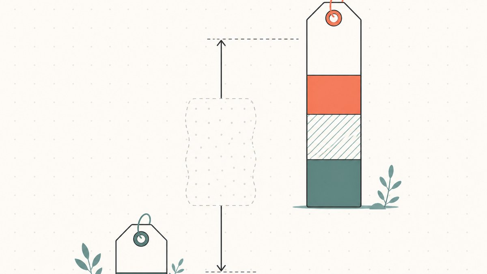

问两位资深域名玩家某个名字值多少钱，你可能得到相差十倍的两个答案，而且两个都对。这不是马虎，而是这一行最重要的一条定价事实：同一个域名在同一时刻就是有两个合理的价格，到底套用哪一个，完全取决于买家是谁。看不透这一点，你要么以远低于价值的折扣把名字送了出去，要么死守着它，永远等着一个本就没人会在你这个赛道里出的数字。

这是我们的估值支柱文章 [如何为域名估值：一份实用的评估指南](/zh-CN/blog/how-to-value-a-domain-name/) 所承诺的深入剖析。这里我们把这道「分裂」单独拎出来讲：两个价格各自从何而来、它们之间的差距通常有多大，以及对于任何一个名字，你该如何判断自己应该报出哪一个数字。

## 两个价格的定义

[二级市场](/zh-CN/glossary/aftermarket/) 里的每一个域名，都同时身处两个市场之中。

**[经销商](/zh-CN/glossary/reseller/)（批发）价** 是另一位投资人愿意付给你的价钱。他们买这个名字，不是为了把自己的公司挂上去；他们买的是库存，准备日后转手，于是定价方式和任何经销商给存货定价一样：只付他们预期最终能卖出价钱的一个零头，那道折扣就是他们的利润、他们的 [持有成本](/zh-CN/glossary/holding-cost/)，以及这个名字永远卖不出去的风险。批发买家是在替未来的你提前干活，于是他们也就照此定价。这是 **那个低的数字**。

**终端用户（零售）价** 是那个真正会 *使用* 这个名字的企业所付的价钱。他们买的不是用来转手的资产，而是自家公司的「正门」；他们衡量它的标准，是这个名字对 *他们自己* 运营的价值：他们的品牌、他们的市场营销、他们这个季度想要拿下的那笔生意。他们对比的不是别的域名，而是用一个更糟的名字开张要付出的代价。这是 **那个高的数字**。

同一串字母、同一条 [WHOIS](/zh-CN/glossary/whois/) 记录，却有两个价格，因为两个截然不同的买家，正在做两种截然不同的算术。

## 这道差距为什么会存在

这种分裂并不是域名独有的怪癖。它就是几乎贯穿所有转售市场的那套「批发对零售」结构，存在的原因也完全相同。

**经销商必须给自己留出利润空间。** 如果一个名字最终会以 $10,000 卖给某个 [终端用户](/zh-CN/glossary/end-user/)，那么从你手里买进它的投资人就不可能也付 $10,000——那样他们一分钱赚不到，却扛下了全部风险。他们会压到足够低的价位，好覆盖自己的利润，以及这名字一放就是好几年卖不掉的、非常真实的可能性。[域名投资](/zh-CN/glossary/domaining/) 按定义就是 [识别并注册或收购通用互联网域名作为一种投资、意图日后转售获利的做法](https://en.wikipedia.org/wiki/Domain_name_speculation#:~:text=the%20practice%20of%20identifying%20and%20registering%20or%20acquiring%20generic%20Internet%20domain%20names%20as%20an%20investment)，而「获利」这两个字，正是批发价被压低的全部原因。

**[流动性](/zh-CN/glossary/domain-liquidity/) 是值真金白银的。** 从你手里买进的经销商，提供的是速度和确定性：现金即时到账，不用等待，不用做外联推广，不用和一个犹犹豫豫、第一次买域名的人讨价还价。这份便利是一种服务，而你以更低的价格为它买单——就像你把车卖给车商，会比卖给一个恰好想要这款车的私人买家拿得更少一样。

**终端用户买的是用途，不是库存。** 当一家拿到融资的初创公司为了发布产品需要你那个单词域名时，他们不会拿它和别的可转售域名作比较。他们比较的是「没有它」的代价和痛苦：一个更别扭的名字、更弱的品牌、一群被搞糊涂的受众。这种衡量框架撑得起一个高得多的数字，因为这个名字正在为某一个特定的买家，解决一个特定而昂贵的问题。

这也正是自动估值工具吃力的原因。像 GoDaddy 那样的工具——其 [算法使用专有的机器学习和真实市场销售数据来估算域名价值](https://www.godaddy.com/resources/skills/godaddy-domain-name-value-appraisal-tool#:~:text=algorithm%20uses%20proprietary%20machine%20learning%20and%20real%20market%20sales%20data%20to%20estimate%20domain%20values)——是在两个市场之间取平均，根本看不见决定零售价的那个唯一变量：一个有着特定、紧迫需求的特定买家。

## 这道差价有多大

先把诚实的免责声明摆在前面：终端用户价与经销商价之间的差距，并没有任何公开、经审计的倍数，谁要是给你报一个精确数字，那都是在猜。二级市场是出了名的隐秘。大多数大额交易都是一对一谈成、从不公开的，连公开记录也只收录了两个极端。比如维基百科的「史上最贵域名」榜单，就只收录 [成交价在 300 万美元及以上的销售](https://en.wikipedia.org/wiki/List_of_most_expensive_domain_names#:~:text=most%20expensive%20domain%20name%20sales%2C%20with%20values%20of%20%243%20million)。在这之下的一切，以及每一笔签了保密协议的交易，都是看不见的。

所以请把下面这条当作一条经验法则，而不是一项经过测量的统计数据：在整个行业里，对同一个名字而言，终端用户价通常是批发价的 **好几倍**。一个投资人愿意花几百美元从你手里买进的名字，可能会以几千美元卖给对的那家企业；一个四位数的批发名字，则可能变成一笔五位数的终端用户成交。这个倍数不是固定的。对于有着明显且动机强烈的终端买家的名字，差距更宽；对于只有别的经销商才想要的通用库存，差距则更窄。但 *方向* 是可靠的：零售永远是那个更高的数字。

正是这道差价，让公开的可比销售记录读起来如此令人困惑。NameBio 这类工具汇集了海量的已报告交易（[据 NameBio 统计，2024 年共记录了 144,700 笔域名销售，总额达 1.85 亿美元](https://en.wikipedia.org/wiki/Domain_aftermarket#:~:text=According%20to%20NameBio%2C%20144%2C700%20domain%20name%20sales%20totaling%20US%24185%20million%20were%20recorded%20in%202024)，见维基百科的二级市场综述），但那一大堆数据把投资人之间的批发翻转和卖给终端用户的零售销售混在了一起，常常不标明谁是谁。对于两个几乎一模一样的名字，一条经销商可比数据和一条终端用户可比数据看上去可能像是在描述两种不同的资产——从某种意义上说也确实如此：它们是在给两个不同的买家定价。学会把它们区分开，正是 [如何解读可比域名销售数据（Comps）](/zh-CN/blog/how-to-read-comparable-domain-sales/) 里的核心技能。

## 你这笔交易该套用哪个数字

真正实用的问题，不是抽象地问「差价是多少」——而是问「我现在实际成交的，是我那两个价格里的哪一个？」这取决于你通过哪条渠道出售，以及上门的是哪种买家。

**当你做以下这些事时，拿到的是批发价：** 卖进面向投资人的渠道——一场论坛拍卖、一笔批量组合出售、一个由另一位域名玩家应答的 [议价](/zh-CN/glossary/make-offer/)，或者因为急需现金而快速清仓。那里的买家全都是按转售来定价的，没别的。二级市场按定义就是 [互联网域名的二手转售市场，有意收购某个已注册域名的一方在其中出价或谈判一个价格](https://en.wikipedia.org/wiki/Domain_aftermarket#:~:text=is%20the%20secondary%20resale%20market%20for%20Internet%20domain%20names)——而当出价的那一方是另一个经销商时，你就站在了批发价的地板上。在这里出售并没有错；它快速又确定。只是要明白，你是在用价格换速度。

**当你做以下这些事时，伸手去够的是终端用户价：** 你下功夫去找到并接触那个真正需要这个名字的企业——向有明显使用场景的买家做定向外联、一个专业的销售落地页、一个真正的终端用户会去浏览的挂牌、或者一位专攻零售交易的经纪人。Afternic 和 Sedo 这类市场的存在，正是为了搭起这座桥——维基百科指出，[交易由 Afternic 和 Sedo 等二级市场平台促成](https://en.wikipedia.org/wiki/Domain_aftermarket#:~:text=Transactions%20are%20facilitated%20by%20aftermarket%20platforms%20such%20as%20Afternic%20and%20Sedo)，它们 [为买卖双方提供沟通方式，让双方常常以匿名形式互动，去谈判并完成一笔交易](https://en.wikipedia.org/wiki/Domain_aftermarket#:~:text=provide%20communication%20methods%20for%20buyers%20and%20sellers%20to%20interact%2C%20often%20anonymously)。Sedo 本身就是 [一家美国域名二级市场公司](https://en.wikipedia.org/wiki/Sedo#:~:text=is%20an%20American%20domain%20aftermarket%20company)，整个业务就围绕着把这两端连接起来。够到终端用户更慢、更费事，但那才是更高数字所在的地方。

陷阱就在于把两者搞混。给批发买家报你的终端用户价，换来的是沉默；给终端用户报你的批发价，则白白把一个倍数的差额留在了桌上——更糟的是，还可能让一个认真的买家以为这个名字是垃圾货。在你开口报价之前，先想清楚你在跟哪种买家说话。一步步演示如何按渠道实际跑完一笔销售，请见 [如何出售您拥有的域名：实用检查清单](/zh-CN/blog/how-to-sell-a-domain-name-you-own/)。

## 在买入端，这道差价从何而来

这套两价结构，同时也是域名翻转的整个发动机，而当你处在买入端时，它是反向运转的。你的全部利润，就是「以批发价或接近批发价买进」和「以零售价卖出」之间的差额，所以进货渠道至关重要。通过面向批发的渠道买入——比如抢注 [拍卖](/zh-CN/glossary/auction/)，也就是 [在一个域名的注册到期失效后、立刻将其重新注册](https://en.wikipedia.org/wiki/Domain_drop_catching#:~:text=is%20the%20practice%20of%20registering%20a%20domain%20name%20once%20registration%20has%20lapsed) 的做法，或者投资人对投资人的销售——能让你在那些已经有需求的名字上更接近批发价。在经销商买的地方买，在终端用户买的地方卖。如果进货时就付了零售价，那就没有差价可赚了。

一个关于持有成本的细节，让买入端比表面差价显示的更为严苛。域名不是一次买断的；它是一种订阅，最长可续费至 [一个 gTLD 域名的最长注册期限](https://en.wikipedia.org/wiki/Domain_name_registrar#:~:text=The%20maximum%20period%20of%20registration%20for%20a%20gTLD%20domain%20name%20is%2010%20years) 十年，期间还要逐年续费，据维基百科，截至 2023 年，一个普通 `.com` 的续费价 [从每年约 9.70 美元到每年约 35 美元不等](https://en.wikipedia.org/wiki/Domain_name_registrar#:~:text=the%20retail%20cost%20generally%20ranges%20from%20a%20low%20of%20about%20%249.70%20per%20year)。一个名字等它的终端用户买家等得越久，这些续费就越是蚕食那道差价；纸面上一道很宽的差距，如果名字先搁上五年，就可能缩水到零。后缀同时塑造着这道差价的两端。[`.com`](/zh-CN/tld/com/) 拥有最深厚的终端用户需求，在 2024 年记录的销售中占据了 [全年总成交金额的 74.4%](https://en.wikipedia.org/wiki/Domain_aftermarket#:~:text=Sales%20of%20.com%20domains%20accounted%20for%2074.4%25%20of%20the%20year%27s%20total%20dollar%20volume)，而一个更新或更小众的后缀，零售市场可能更薄、等待期可能更长。这一点我们在 [顶级域名 (TLD) 如何影响域名价值](/zh-CN/blog/how-tld-affects-domain-value/) 里有详细拆解。

## 这一切对实际定价意味着什么

有三个习惯，能让这套两价现实为你所用，而不是与你为敌。

**永远先问清楚你在估的是哪个数字。** 当你给一个名字估值时，一开始就要决定：你想要的是它的批发价值（今天你愿意从另一个投资人手里接受的价钱），还是它的终端用户价值（在做了真正的销售努力之后、对的那家企业会付的价钱）。对同一个名字而言，这是两个不同的数字，而把它们混为一谈，是新手翻转者最常犯的估值错误。一个适合快速批发翻转的价格，放到终端用户销售上就是错的，反之亦然。

**在挂牌之前，让价格匹配渠道。** 如果你是要把一个名字甩进投资人拍卖里，就按批发价定价，好让它能成交。如果你是要对某家特定公司做外联，就锚定终端用户价，并守住它。在终端用户渠道上按批发价挂牌，不只是白白少赚——它还可能主动向那个本会出更高价的买家发出「低价值」的信号。

**别把一笔公开成交当成你的可比依据。** 一笔登上头条的零售成交，告诉你的只是 *某一个* 动机强烈的终端用户付了多少；它不等于明天一个经销商会给你的价钱。要从一组可比数据里搭建你的数字，按它们来自哪个市场分类，并在你面前的买家是另一个翻转者时大幅压低。估值工具是在两个市场之间取平均，它给的只是一个起步区间，永远不是最终价格——[估值支柱文章](/zh-CN/blog/how-to-value-a-domain-name/) 讲了如何使用它们而不被它们误导。

## 知道了你的数字之后，怎么把这笔交易做成

知道你的数字只是工作的一半。另一半，是在不受损伤的前提下把钱收到手——而终端用户价越高，在转移的那一刻风险就越尖锐。那经典的僵局：买家不想在掌控名字之前先打款，而你也不想在确认收到钱之前先放掉名字。这道信任鸿沟，正是高价值 [域名交易](/zh-CN/glossary/domain-trading/) 让人紧张的地方——无论你收的是同行付的批发价，还是一个从没买过域名的初次买家付的终端用户价，情况都一样。传统的解法是一套中立的 [托管](/zh-CN/glossary/escrow/) 流程，好让任何一方都不必先动——这一点我们在 [域名托管详解：安全域名交易的运作方式](/zh-CN/blog/domain-escrow-explained/) 里有讲解。

这正是 [Namefi](https://namefi.io) 想要收窄的那道鸿沟。把一个真实的 [ICANN](/zh-CN/glossary/icann/) 域名 [代币化](/zh-CN/glossary/tokenize/)，让 [所有权](/zh-CN/glossary/domain-ownership/) 更易于验证和转移，于是成交时的交接是可审计的，名字在整个变更过程中也能持续解析。把名字定价给对的买家；然后，让这笔交易变得安全。你费尽力气争来的那个数字，只有在真正到账之后才算数。

## 友情免责声明（请务必阅读！）

> 我们不是律师、会计师、理财顾问，也不是医生，**本文中的任何内容都不构成法律、财务、税务、会计、医疗或任何其他形式的专业建议。** 我们写这些文章，是为了教育我们自己，也是为了方便我们的客户。这里的信息可能已经过时、只适用于特定地区，或者干脆就是错的。我们也会犯错。

> 对于任何重要的决定，**请务必咨询真正的专业人士（说真的！）**。要是这不合你的胃口，那就问问朋友、问问 Twitter、问问 Reddit、问问 AI，或者问问算命先生。一句话：**DOYR——自己动手做研究（Do Your Own Research）**。让我们一起边学边乐。

## 来源与延伸阅读

- 维基百科 —— [Domain name speculation（域名投资的定义 /「意图日后转售获利」）](https://en.wikipedia.org/wiki/Domain_name_speculation#:~:text=the%20practice%20of%20identifying%20and%20registering%20or%20acquiring%20generic%20Internet%20domain%20names%20as%20an%20investment)
- 维基百科 —— [Domain aftermarket（二手转售市场的定义；NameBio 2024 年成交量；.com 占成交金额 74.4%；Afternic 与 Sedo 的促成作用）](https://en.wikipedia.org/wiki/Domain_aftermarket#:~:text=is%20the%20secondary%20resale%20market%20for%20Internet%20domain%20names)
- 维基百科 —— [Sedo（一家美国域名二级市场公司）](https://en.wikipedia.org/wiki/Sedo#:~:text=is%20an%20American%20domain%20aftermarket%20company)
- 维基百科 —— [Domain drop catching（在域名到期后立刻将其重新注册）](https://en.wikipedia.org/wiki/Domain_drop_catching#:~:text=is%20the%20practice%20of%20registering%20a%20domain%20name%20once%20registration%20has%20lapsed)
- 维基百科 —— [List of most expensive domain names（300 万美元以上方公开，仅限现金成交的范围）](https://en.wikipedia.org/wiki/List_of_most_expensive_domain_names#:~:text=most%20expensive%20domain%20name%20sales%2C%20with%20values%20of%20%243%20million)
- 维基百科 —— [Domain name registrar（gTLD 最长 10 年期限；.com 零售续费定价）](https://en.wikipedia.org/wiki/Domain_name_registrar#:~:text=The%20maximum%20period%20of%20registration%20for%20a%20gTLD%20domain%20name%20is%2010%20years)
- GoDaddy —— [Domain Name Value & Appraisal 工具（机器学习 + 真实市场销售数据）](https://www.godaddy.com/resources/skills/godaddy-domain-name-value-appraisal-tool#:~:text=algorithm%20uses%20proprietary%20machine%20learning%20and%20real%20market%20sales%20data%20to%20estimate%20domain%20values)
